# 技能管理前端页面

<cite>
**本文档引用的文件**
- [frontend/src/app/(dashboard)/skills/page.tsx](file://frontend/src/app/(dashboard)/skills/page.tsx)
- [frontend/src/app/(dashboard)/skills/components/CreateSkillDialog.tsx](file://frontend/src/app/(dashboard)/skills/components/CreateSkillDialog.tsx)
- [frontend/src/lib/hooks/use-skills.ts](file://frontend/src/lib/hooks/use-skills.ts)
- [frontend/src/lib/api/skills.ts](file://frontend/src/lib/api/skills.ts)
- [frontend/src/lib/api/client.ts](file://frontend/src/lib/api/client.ts)
- [frontend/src/lib/api/query-client.ts](file://frontend/src/lib/api/query-client.ts)
- [frontend/src/lib/hooks/use-notebooks.ts](file://frontend/src/lib/hooks/use-notebooks.ts)
- [frontend/src/components/ui/badge.tsx](file://frontend/src/components/ui/badge.tsx)
- [api/routers/skills.py](file://api/routers/skills.py)
- [open_notebook/skills/base.py](file://open_notebook/skills/base.py)
- [open_notebook/skills/registry.py](file://open_notebook/skills/registry.py)
- [open_notebook/skills/content_crawler.py](file://open_notebook/skills/content_crawler.py)
- [open_notebook/skills/note_organizer.py](file://open_notebook/skills/note_organizer.py)
- [open_notebook/skills/browser_base.py](file://open_notebook/skills/browser_base.py)
- [open_notebook/skills/scheduler.py](file://open_notebook/skills/scheduler.py)
</cite>

## 更新摘要
**所做更改**
- 更新了前端架构分析，反映新的React组件架构实现
- 新增了CreateSkillDialog对话框组件的详细分析
- 更新了自定义Hook设计和状态管理模式
- 增强了实时调度器状态监控功能的说明
- 完善了批量操作和用户交互体验的描述

## 目录
1. [简介](#简介)
2. [项目结构](#项目结构)
3. [核心组件](#核心组件)
4. [架构概览](#架构概览)
5. [详细组件分析](#详细组件分析)
6. [依赖关系分析](#依赖关系分析)
7. [性能考虑](#性能考虑)
8. [故障排除指南](#故障排除指南)
9. [结论](#结论)

## 简介

技能管理前端页面是 Open Notebook 项目中的一个核心功能模块，负责提供用户界面来管理和控制各种自动化技能（Skills）。这些技能可以自动执行内容爬取、处理和组织等任务，包括 RSS 内容爬虫、浏览器自动化、笔记总结和标签生成等功能。

**更新** 新页面采用现代化的React组件架构，集成了CreateSkillDialog对话框，提供了更直观的技能创建和管理界面，支持实时调度器状态监控和批量操作。

该页面提供了完整的技能生命周期管理，包括技能实例的创建、配置、执行、调度和删除，以及执行历史的查看和管理。

## 项目结构

技能管理功能分布在前端和后端两个主要部分，采用了现代化的React架构模式：

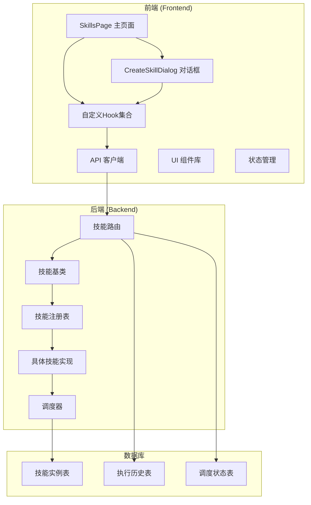

**图表来源**
- [frontend/src/app/(dashboard)/skills/page.tsx](file://frontend/src/app/(dashboard)/skills/page.tsx#L1-L189)
- [frontend/src/app/(dashboard)/skills/components/CreateSkillDialog.tsx](file://frontend/src/app/(dashboard)/skills/components/CreateSkillDialog.tsx#L1-L205)
- [frontend/src/lib/hooks/use-skills.ts](file://frontend/src/lib/hooks/use-skills.ts#L1-L212)

**章节来源**
- [frontend/src/app/(dashboard)/skills/page.tsx](file://frontend/src/app/(dashboard)/skills/page.tsx#L1-L189)
- [frontend/src/app/(dashboard)/skills/components/CreateSkillDialog.tsx](file://frontend/src/app/(dashboard)/skills/components/CreateSkillDialog.tsx#L1-L205)
- [frontend/src/lib/hooks/use-skills.ts](file://frontend/src/lib/hooks/use-skills.ts#L1-L212)

## 核心组件

技能管理页面的核心组件包括：

### 前端核心组件

1. **SkillsPage 组件** - 主要的技能管理界面，采用现代化React架构
2. **CreateSkillDialog 对话框** - 集成的技能创建对话框，提供直观的配置界面
3. **技能实例卡片** - 显示所有已创建的技能实例及其状态
4. **技能状态徽章** - 基于技能类型的彩色状态标识
5. **实时调度器状态面板** - 监控调度器运行状态
6. **批量操作按钮组** - 支持执行、编辑、删除等批量操作

### 自定义Hook系统

1. **useSkillInstances** - 获取技能实例列表
2. **useSkillTypes** - 获取可用技能类型
3. **useCreateSkillInstance** - 创建新技能实例
4. **useExecuteSkillInstance** - 执行技能实例
5. **useSchedulerStatus** - 实时获取调度器状态
6. **useDeleteSkillInstance** - 删除技能实例

### 后端核心组件

1. **技能路由器** - 提供 REST API 接口
2. **技能基类** - 定义技能的标准接口
3. **技能注册表** - 管理可用技能类型
4. **具体技能实现** - RSS 爬虫、浏览器自动化、笔记处理等
5. **调度器** - 管理定时执行任务

**章节来源**
- [frontend/src/app/(dashboard)/skills/page.tsx](file://frontend/src/app/(dashboard)/skills/page.tsx#L16-L189)
- [frontend/src/app/(dashboard)/skills/components/CreateSkillDialog.tsx](file://frontend/src/app/(dashboard)/skills/components/CreateSkillDialog.tsx#L19-L205)
- [frontend/src/lib/hooks/use-skills.ts](file://frontend/src/lib/hooks/use-skills.ts#L8-L212)

## 架构概览

技能管理系统采用现代化的前后端分离架构，结合React Query进行状态管理：

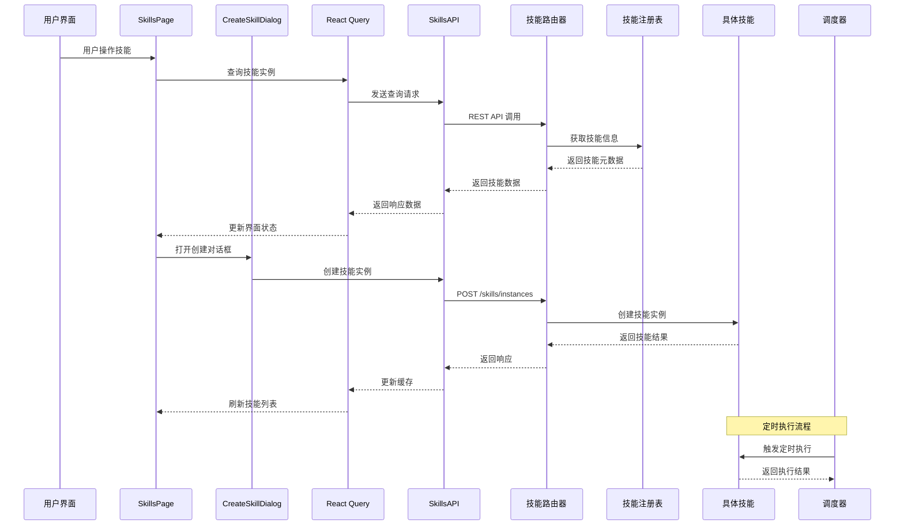

**图表来源**
- [frontend/src/app/(dashboard)/skills/page.tsx](file://frontend/src/app/(dashboard)/skills/page.tsx#L16-L189)
- [frontend/src/app/(dashboard)/skills/components/CreateSkillDialog.tsx](file://frontend/src/app/(dashboard)/skills/components/CreateSkillDialog.tsx#L19-L205)
- [frontend/src/lib/hooks/use-skills.ts](file://frontend/src/lib/hooks/use-skills.ts#L17-L28)

## 详细组件分析

### SkillsPage 组件分析

SkillsPage 是技能管理的主要界面组件，采用了现代化的React Hooks架构：

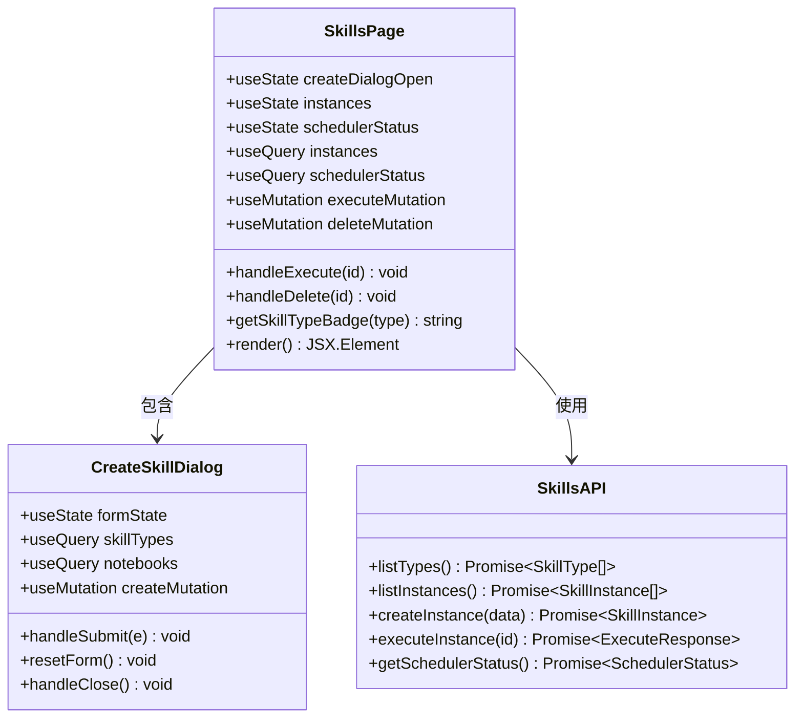

**图表来源**
- [frontend/src/app/(dashboard)/skills/page.tsx](file://frontend/src/app/(dashboard)/skills/page.tsx#L16-L189)
- [frontend/src/app/(dashboard)/skills/components/CreateSkillDialog.tsx](file://frontend/src/app/(dashboard)/skills/components/CreateSkillDialog.tsx#L19-L205)

#### 现代化状态管理模式

组件使用React Query进行状态管理，实现了以下关键功能：

| 状态管理特性 | 实现方式 | 优势 |
|-------------|----------|------|
| 数据缓存 | React Query 缓存 | 减少网络请求，提升性能 |
| 自动刷新 | 查询键失效机制 | 确保数据一致性 |
| 错误处理 | 内置错误边界 | 提供更好的用户体验 |
| 离线支持 | 缓存持久化 | 支持离线操作 |
| 并发处理 | 查询去重 | 避免重复请求 |

#### 技能状态徽章系统

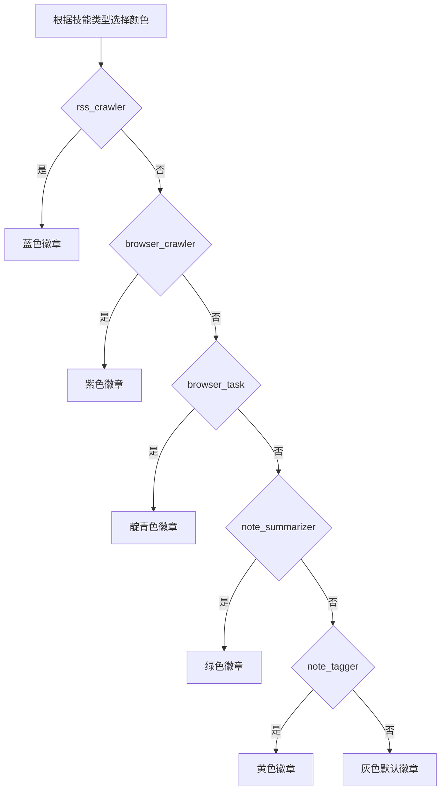

**图表来源**
- [frontend/src/app/(dashboard)/skills/page.tsx](file://frontend/src/app/(dashboard)/skills/page.tsx#L43-L53)

**章节来源**
- [frontend/src/app/(dashboard)/skills/page.tsx](file://frontend/src/app/(dashboard)/skills/page.tsx#L16-L189)

### CreateSkillDialog 对话框分析

CreateSkillDialog 是一个功能完整的技能创建对话框，提供了直观的配置界面：

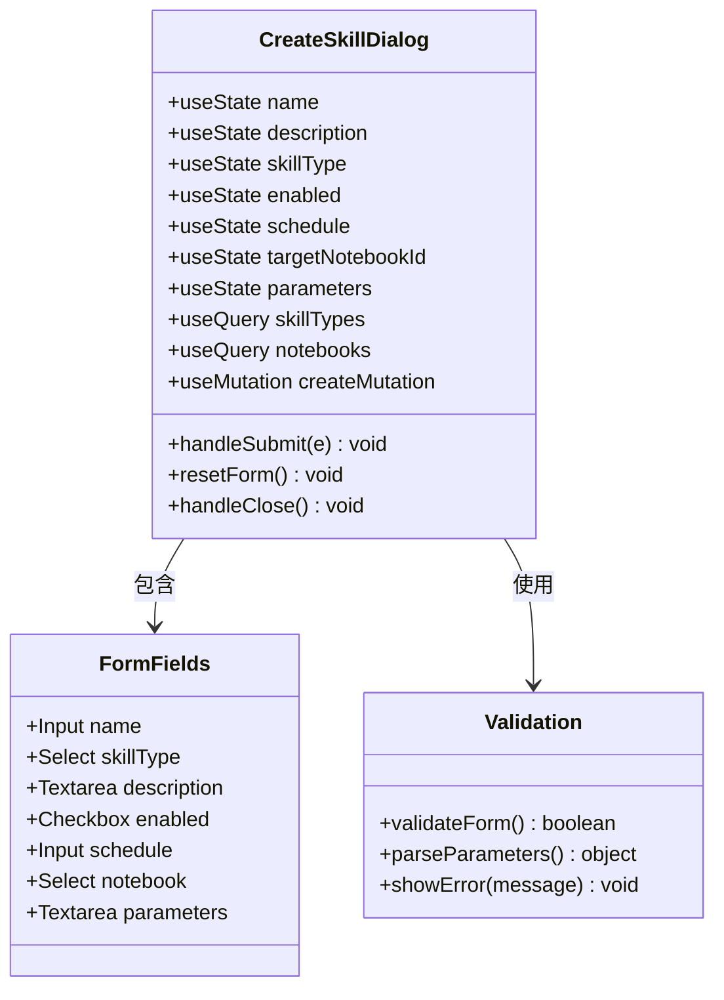

**图表来源**
- [frontend/src/app/(dashboard)/skills/components/CreateSkillDialog.tsx](file://frontend/src/app/(dashboard)/skills/components/CreateSkillDialog.tsx#L19-L205)

#### 对话框功能特性

| 功能模块 | 实现细节 | 用户价值 |
|---------|----------|----------|
| 技能类型选择 | 下拉菜单 + 实时描述 | 帮助用户理解技能用途 |
| 参数配置 | JSON编辑器 + 示例提示 | 支持复杂技能配置 |
| 调度设置 | Cron表达式输入 + 示例 | 提供灵活的时间控制 |
| 笔记本关联 | 可选目标笔记本 | 支持内容定向处理 |
| 实时验证 | 表单字段验证 + 错误提示 | 提升表单可靠性 |

**章节来源**
- [frontend/src/app/(dashboard)/skills/components/CreateSkillDialog.tsx](file://frontend/src/app/(dashboard)/skills/components/CreateSkillDialog.tsx#L19-L205)

### 自定义Hook系统分析

自定义Hook系统提供了完整的技能管理功能：

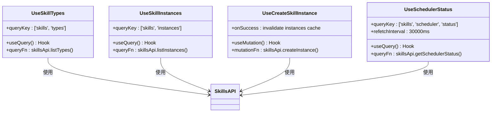

**图表来源**
- [frontend/src/lib/hooks/use-skills.ts](file://frontend/src/lib/hooks/use-skills.ts#L8-L212)

#### Hook设计模式

| Hook类型 | 功能特点 | 实现优势 |
|---------|----------|----------|
| 查询Hook | 数据获取 + 缓存管理 | 自动缓存 + 错误处理 |
| 变更Hook | 状态更新 + 乐观更新 | 用户体验优化 |
| 计算Hook | 数据转换 + 派生状态 | 性能优化 |
| 组合Hook | 多个Hook组合使用 | 代码复用 |

**章节来源**
- [frontend/src/lib/hooks/use-skills.ts](file://frontend/src/lib/hooks/use-skills.ts#L1-L212)

### API 客户端分析

前端使用专门的 API 客户端来处理与后端的通信：

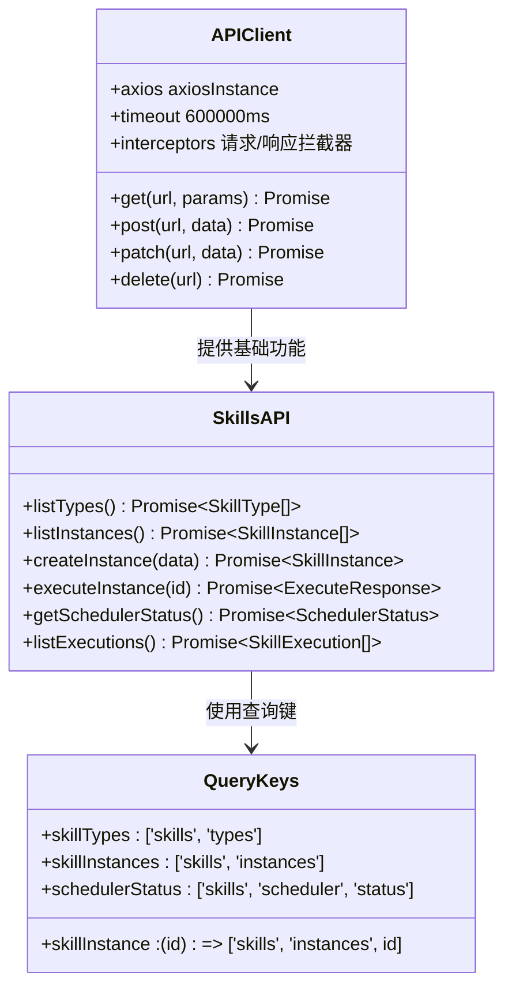

**图表来源**
- [frontend/src/lib/api/client.ts](file://frontend/src/lib/api/client.ts#L10-L66)
- [frontend/src/lib/api/skills.ts](file://frontend/src/lib/api/skills.ts#L66-L145)
- [frontend/src/lib/api/query-client.ts](file://frontend/src/lib/api/query-client.ts#L17-L42)

#### API端点映射

| 功能 | 前端函数 | 后端路由 | HTTP 方法 |
|------|----------|----------|-----------|
| 列出技能类型 | listTypes | /skills/available | GET |
| 列出技能实例 | listInstances | /skills/instances | GET |
| 创建技能实例 | createInstance | /skills/instances | POST |
| 执行技能实例 | executeInstance | /skills/instances/{id}/execute | POST |
| 获取调度器状态 | getSchedulerStatus | /skills/scheduler/status | GET |
| 列出执行历史 | listExecutions | /skills/executions | GET |

**章节来源**
- [frontend/src/lib/api/skills.ts](file://frontend/src/lib/api/skills.ts#L66-L145)
- [api/routers/skills.py](file://api/routers/skills.py#L114-L463)

### 技能类型分析

系统支持多种类型的技能，每种都有特定的功能和参数配置：

#### RSS 内容爬虫技能

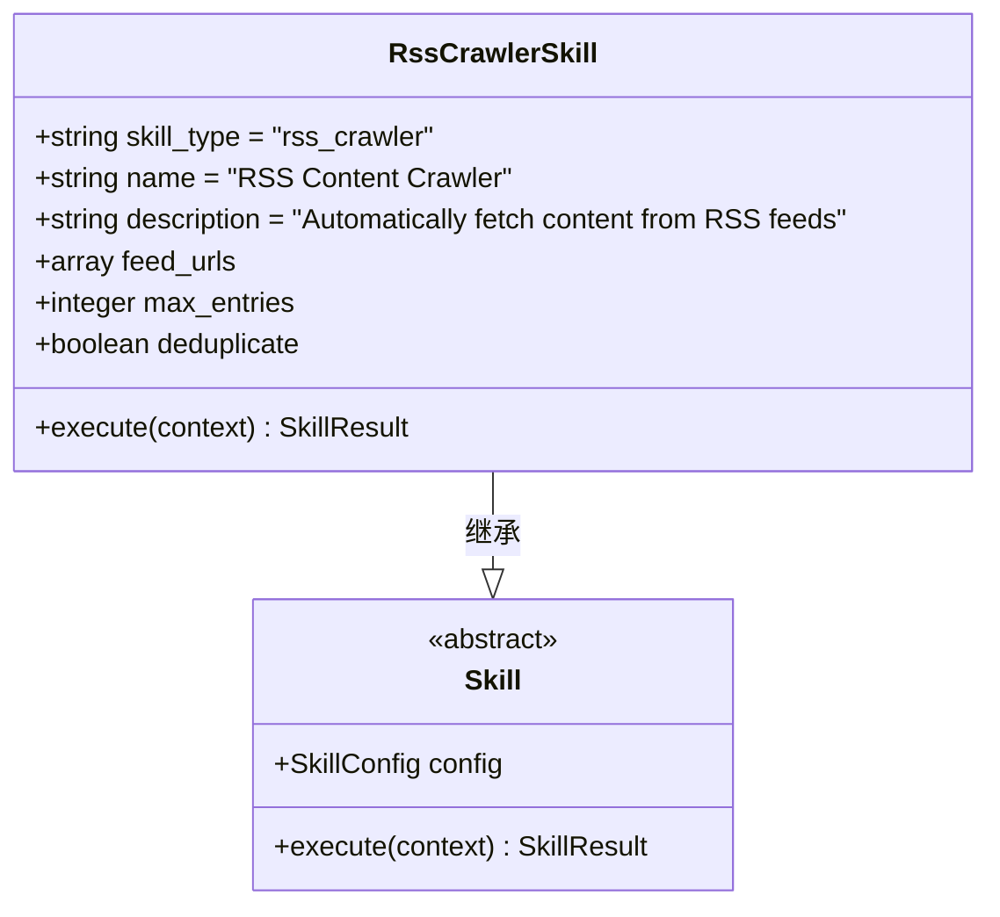

**图表来源**
- [open_notebook/skills/content_crawler.py](file://open_notebook/skills/content_crawler.py#L20-L315)
- [open_notebook/skills/base.py](file://open_notebook/skills/base.py#L83-L136)

#### 浏览器自动化技能

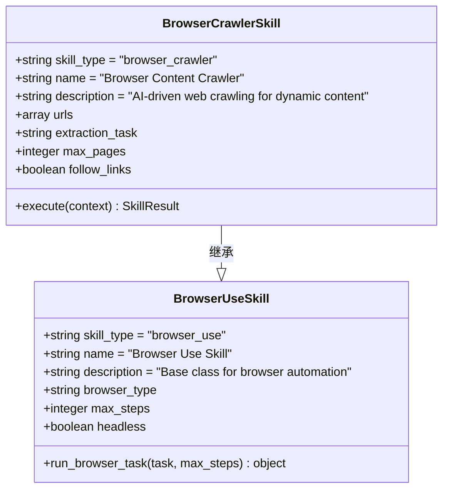

**图表来源**
- [open_notebook/skills/browser_base.py](file://open_notebook/skills/browser_base.py#L177-L315)

#### 笔记组织技能

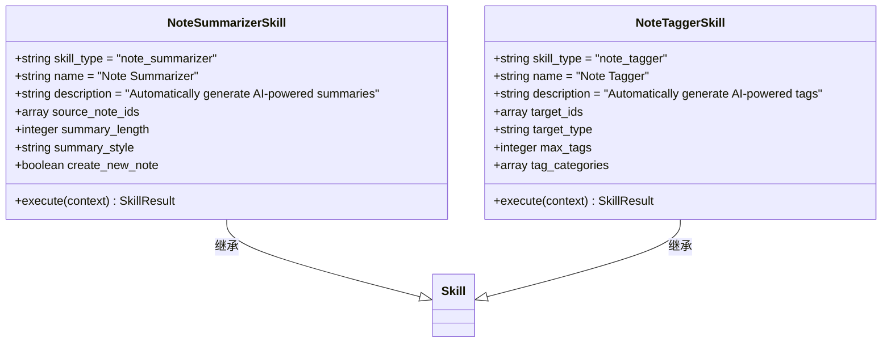

**图表来源**
- [open_notebook/skills/note_organizer.py](file://open_notebook/skills/note_organizer.py#L19-L408)

**章节来源**
- [open_notebook/skills/content_crawler.py](file://open_notebook/skills/content_crawler.py#L20-L315)
- [open_notebook/skills/browser_base.py](file://open_notebook/skills/browser_base.py#L177-L315)
- [open_notebook/skills/note_organizer.py](file://open_notebook/skills/note_organizer.py#L19-L408)

### 调度器系统分析

调度器负责管理技能的定时执行：

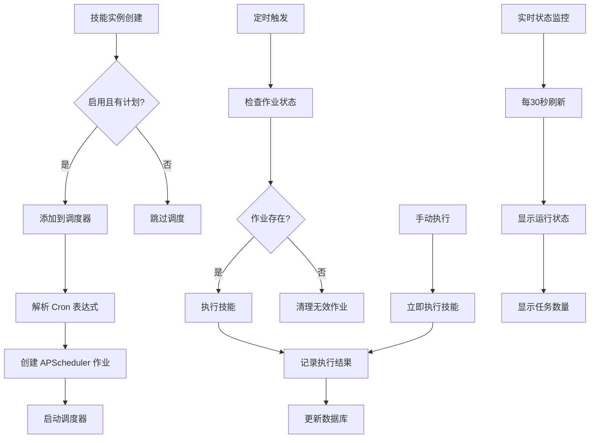

**图表来源**
- [open_notebook/skills/scheduler.py](file://open_notebook/skills/scheduler.py#L61-L179)
- [frontend/src/lib/hooks/use-skills.ts](file://frontend/src/lib/hooks/use-skills.ts#L171-L177)

#### 调度器状态管理

| 状态 | 描述 | 影响 |
|------|------|------|
| running | 调度器是否正在运行 | 控制新任务的接受 |
| scheduled_jobs | 当前调度的任务数量 | 显示系统负载 |
| jobs | 详细的任务信息 | 调试和监控 |

**章节来源**
- [open_notebook/skills/scheduler.py](file://open_notebook/skills/scheduler.py#L19-L235)

## 依赖关系分析

技能管理系统的依赖关系呈现清晰的分层结构：

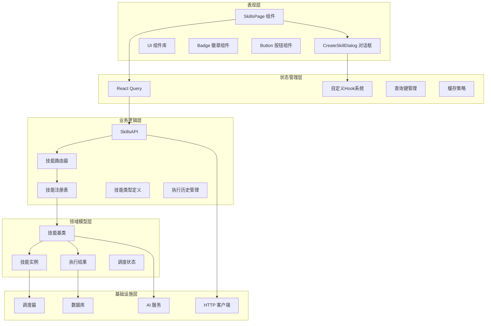

**图表来源**
- [frontend/src/app/(dashboard)/skills/page.tsx](file://frontend/src/app/(dashboard)/skills/page.tsx#L1-L189)
- [frontend/src/lib/hooks/use-skills.ts](file://frontend/src/lib/hooks/use-skills.ts#L1-L212)
- [frontend/src/lib/api/skills.ts](file://frontend/src/lib/api/skills.ts#L1-L145)

### 关键依赖关系

1. **组件到Hook的依赖**：SkillsPage 通过自定义Hook依赖于状态管理
2. **Hook到API的依赖**：自定义Hook依赖于SkillsAPI进行数据操作
3. **API到后端的依赖**：SkillsAPI依赖于技能路由器进行业务处理
4. **UI组件的依赖**：使用Radix UI和Tailwind CSS构建
5. **查询键到缓存的依赖**：查询键管理确保数据缓存一致性

**章节来源**
- [frontend/src/lib/hooks/use-skills.ts](file://frontend/src/lib/hooks/use-skills.ts#L1-L212)
- [frontend/src/lib/api/skills.ts](file://frontend/src/lib/api/skills.ts#L1-L145)

## 性能考虑

技能管理系统的性能优化主要体现在以下几个方面：

### 前端性能优化

1. **React Query缓存策略**：5分钟缓存时间，10分钟垃圾回收
2. **查询去重**：避免重复的API请求
3. **乐观更新**：立即更新UI，等待后端确认
4. **懒加载**：对话框按需加载
5. **状态持久化**：本地状态缓存

### 网络性能优化

1. **超时设置**：10分钟超时适应长耗时操作
2. **重试机制**：查询重试2次，变更重试1次
3. **连接复用**：Axios实例复用
4. **压缩传输**：支持Gzip压缩

### 实时监控优化

1. **30秒轮询间隔**：平衡实时性和性能
2. **条件刷新**：仅在页面可见时刷新
3. **增量更新**：仅更新变化的数据

**章节来源**
- [frontend/src/lib/api/query-client.ts](file://frontend/src/lib/api/query-client.ts#L3-L15)
- [frontend/src/lib/api/client.ts](file://frontend/src/lib/api/client.ts#L10-L16)
- [frontend/src/lib/hooks/use-skills.ts](file://frontend/src/lib/hooks/use-skills.ts#L171-L177)

## 故障排除指南

### 常见问题及解决方案

#### 技能执行失败

**症状**：技能执行返回失败状态
**可能原因**：
1. 参数配置错误
2. AI 服务不可用
3. 网络连接问题
4. 权限不足

**解决步骤**：
1. 检查技能参数格式
2. 验证 AI 服务连接
3. 查看网络连接状态
4. 确认用户权限

#### 调度器不工作

**症状**：定时任务无法执行
**可能原因**：
1. 调度器未启动
2. Cron 表达式错误
3. 服务器时间不同步
4. 任务冲突

**解决步骤**：
1. 检查调度器状态
2. 验证 Cron 表达式
3. 同步服务器时间
4. 清理冲突任务

#### 前端界面无响应

**症状**：页面加载缓慢或完全无响应
**可能原因**：
1. API 请求超时
2. 内存泄漏
3. 无限循环
4. 组件重渲染过多

**解决步骤**：
1. 检查网络请求状态
2. 使用浏览器开发者工具分析内存
3. 检查React组件循环
4. 优化状态更新逻辑

#### 对话框功能异常

**症状**：CreateSkillDialog 无法正常工作
**可能原因**：
1. 表单验证失败
2. API调用错误
3. 状态管理问题
4. 权限不足

**解决步骤**：
1. 检查表单字段必填性
2. 验证API响应格式
3. 查看控制台错误日志
4. 确认用户权限

**章节来源**
- [frontend/src/app/(dashboard)/skills/page.tsx](file://frontend/src/app/(dashboard)/skills/page.tsx#L24-L41)
- [frontend/src/app/(dashboard)/skills/components/CreateSkillDialog.tsx](file://frontend/src/app/(dashboard)/skills/components/CreateSkillDialog.tsx#L32-L51)

## 结论

技能管理前端页面经过重构后，采用了现代化的React组件架构，提供了更加直观和高效的技能管理体验。新架构通过集成CreateSkillDialog对话框、自定义Hook系统和React Query状态管理，显著提升了用户体验和开发效率。

### 主要优势

1. **现代化架构**：采用React Hooks和React Query，代码结构清晰
2. **直观界面**：CreateSkillDialog提供了一站式的技能创建体验
3. **实时监控**：30秒自动刷新的调度器状态面板
4. **状态管理**：完整的缓存、错误处理和乐观更新机制
5. **可扩展性**：基于自定义Hook的设计便于功能扩展

### 技术亮点

1. **组件化设计**：SkillsPage和CreateSkillDialog职责明确
2. **状态管理优化**：React Query提供完整的状态管理方案
3. **错误处理完善**：统一的错误处理和用户反馈机制
4. **性能优化**：缓存策略和查询去重提升性能
5. **用户体验**：实时状态更新和流畅的交互体验

### 未来改进方向

1. **批量操作增强**：支持多选和批量执行技能
2. **高级过滤**：按技能类型、状态等条件筛选
3. **执行历史详情**：提供更详细的执行结果分析
4. **调度器可视化**：提供图形化的任务调度界面
5. **性能监控**：集成更详细的性能指标监控

该系统为内容管理和自动化处理提供了坚实的技术基础，是Open Notebook生态系统中的重要组成部分，其现代化的架构设计为未来的功能扩展奠定了良好基础。