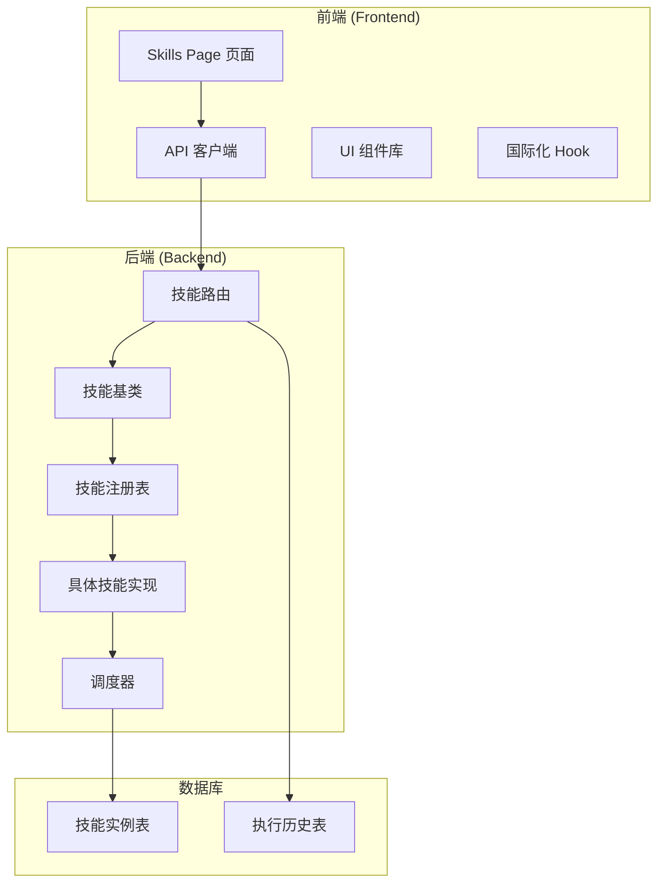
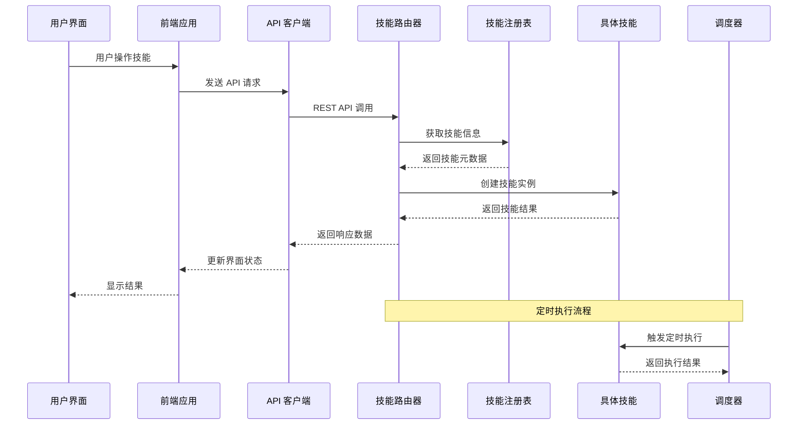
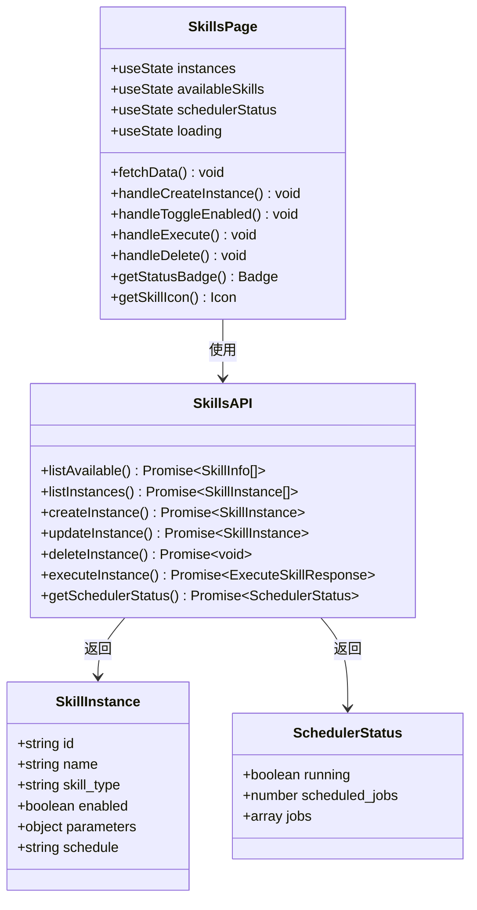
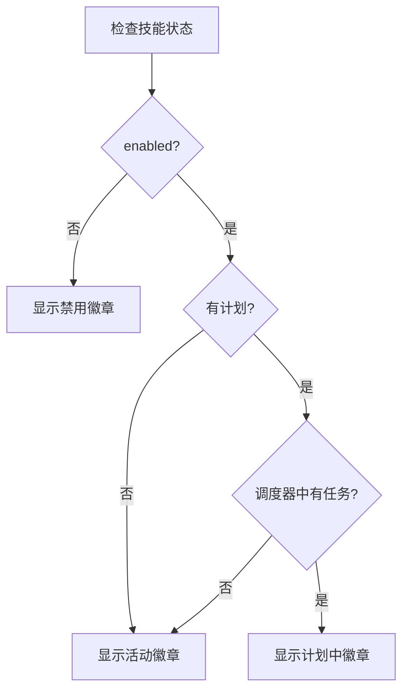
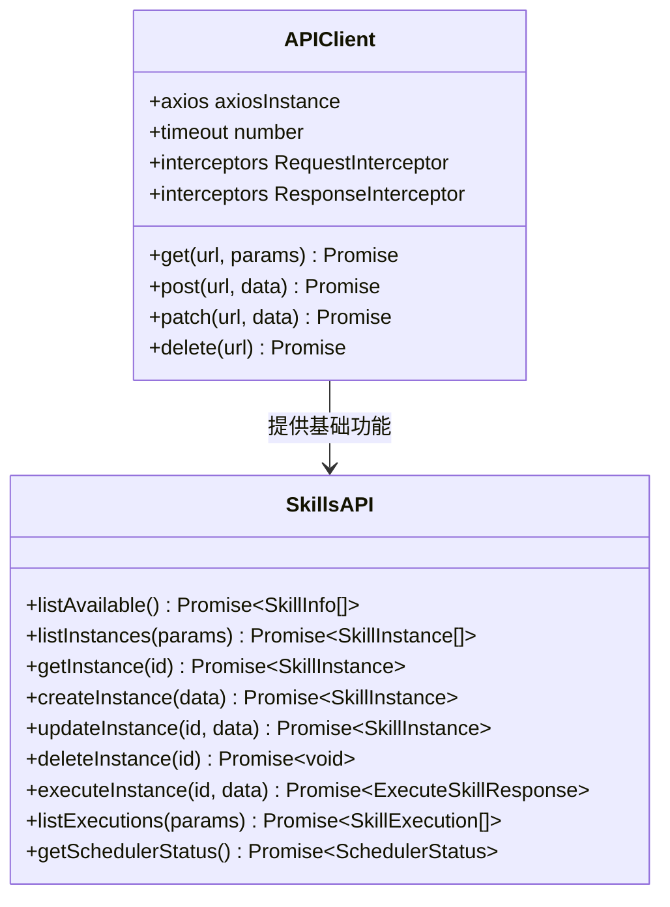
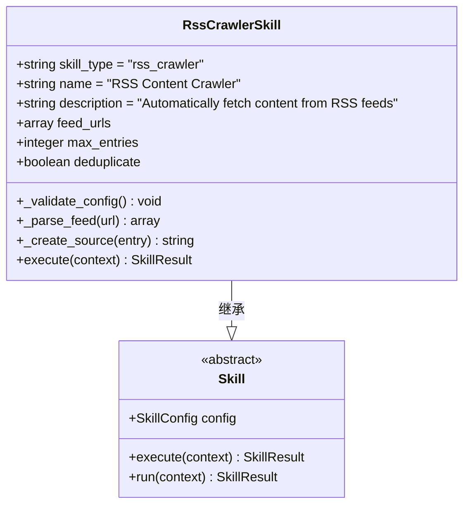
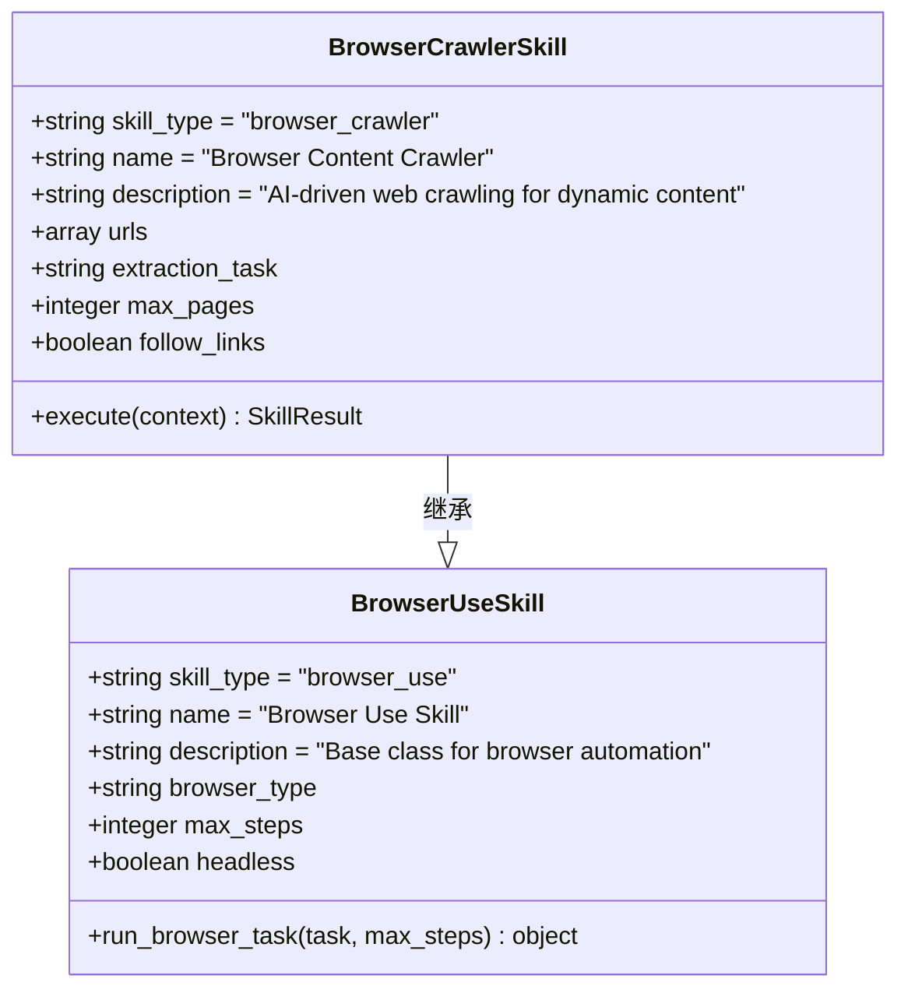
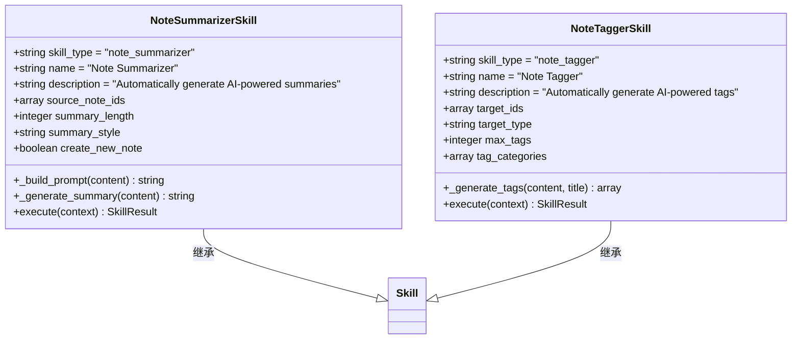
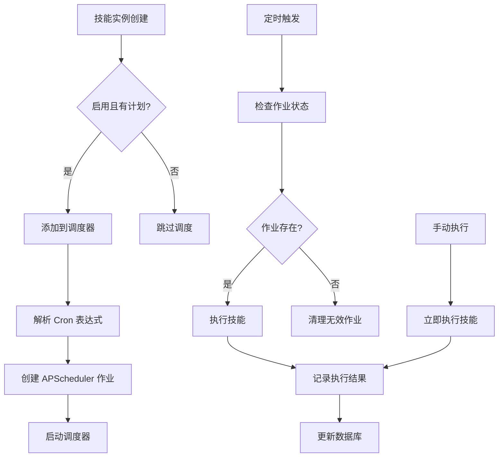
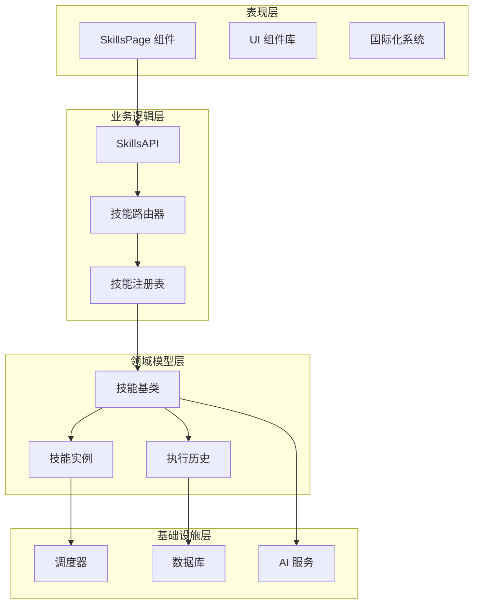

# 技能管理前端页面

<cite>
**本文档引用的文件**
- [frontend/src/app/(dashboard)/skills/page.tsx](file://frontend/src/app/(dashboard)/skills/page.tsx)
- [frontend/src/lib/api/skills.ts](file://frontend/src/lib/api/skills.ts)
- [frontend/src/lib/api/client.ts](file://frontend/src/lib/api/client.ts)
- [api/routers/skills.py](file://api/routers/skills.py)
- [open_notebook/skills/base.py](file://open_notebook/skills/base.py)
- [open_notebook/skills/registry.py](file://open_notebook/skills/registry.py)
- [open_notebook/skills/content_crawler.py](file://open_notebook/skills/content_crawler.py)
- [open_notebook/skills/note_organizer.py](file://open_notebook/skills/note_organizer.py)
- [open_notebook/skills/browser_base.py](file://open_notebook/skills/browser_base.py)
- [open_notebook/skills/scheduler.py](file://open_notebook/skills/scheduler.py)
- [frontend/src/components/ui/button.tsx](file://frontend/src/components/ui/button.tsx)
- [frontend/src/components/common/LoadingSpinner.tsx](file://frontend/src/components/common/LoadingSpinner.tsx)
- [frontend/src/lib/hooks/use-translation.ts](file://frontend/src/lib/hooks/use-translation.ts)
</cite>

## 目录
1. [简介](#简介)
2. [项目结构](#项目结构)
3. [核心组件](#核心组件)
4. [架构概览](#架构概览)
5. [详细组件分析](#详细组件分析)
6. [依赖关系分析](#依赖关系分析)
7. [性能考虑](#性能考虑)
8. [故障排除指南](#故障排除指南)
9. [结论](#结论)

## 简介

技能管理前端页面是 Open Notebook 项目中的一个核心功能模块，负责提供用户界面来管理和控制各种自动化技能（Skills）。这些技能可以自动执行内容爬取、处理和组织等任务，包括 RSS 内容爬虫、浏览器自动化、笔记总结和标签生成等功能。

该页面提供了完整的技能生命周期管理，包括技能实例的创建、配置、执行、调度和删除，以及执行历史的查看和管理。

## 项目结构

技能管理功能分布在前端和后端两个主要部分：

**图表来源**
- [frontend/src/app/(dashboard)/skills/page.tsx](file://frontend/src/app/(dashboard)/skills/page.tsx#L1-L362)
- [api/routers/skills.py](file://api/routers/skills.py#L1-L507)

**章节来源**
- [frontend/src/app/(dashboard)/skills/page.tsx](file://frontend/src/app/(dashboard)/skills/page.tsx#L1-L362)
- [api/routers/skills.py](file://api/routers/skills.py#L1-L507)

## 核心组件

技能管理页面的核心组件包括：

### 前端核心组件

1. **SkillsPage 组件** - 主要的技能管理界面
2. **技能实例列表** - 显示所有已创建的技能实例
3. **创建技能对话框** - 用于创建新的技能实例
4. **技能状态徽章** - 显示技能的当前状态
5. **执行按钮** - 手动触发技能执行

### 后端核心组件

1. **技能路由器** - 提供 REST API 接口
2. **技能基类** - 定义技能的标准接口
3. **技能注册表** - 管理可用技能类型
4. **具体技能实现** - RSS 爬虫、浏览器自动化、笔记处理等
5. **调度器** - 管理定时执行任务

**章节来源**
- [frontend/src/app/(dashboard)/skills/page.tsx](file://frontend/src/app/(dashboard)/skills/page.tsx#L48-L171)
- [api/routers/skills.py](file://api/routers/skills.py#L114-L295)

## 架构概览

技能管理系统采用前后端分离的架构模式：

**图表来源**
- [frontend/src/lib/api/skills.ts](file://frontend/src/lib/api/skills.ts#L80-L163)
- [api/routers/skills.py](file://api/routers/skills.py#L114-L357)
- [open_notebook/skills/registry.py](file://open_notebook/skills/registry.py#L82-L98)

## 详细组件分析

### SkillsPage 组件分析

SkillsPage 是技能管理的主要界面组件，实现了完整的 CRUD 操作：

**图表来源**
- [frontend/src/app/(dashboard)/skills/page.tsx](file://frontend/src/app/(dashboard)/skills/page.tsx#L48-L171)
- [frontend/src/lib/api/skills.ts](file://frontend/src/lib/api/skills.ts#L80-L163)

#### 技能状态管理

组件使用 React 的状态管理来跟踪以下关键状态：

| 状态变量 | 类型 | 描述 |
|---------|------|------|
| instances | SkillInstance[] | 当前用户的技能实例列表 |
| availableSkills | SkillInfo[] | 可用的技能类型列表 |
| schedulerStatus | SchedulerStatus | 调度器运行状态 |
| loading | boolean | 数据加载状态 |
| createDialogOpen | boolean | 创建对话框显示状态 |

#### 技能状态徽章系统

**图表来源**
- [frontend/src/app/(dashboard)/skills/page.tsx](file://frontend/src/app/(dashboard)/skills/page.tsx#L173-L199)

**章节来源**
- [frontend/src/app/(dashboard)/skills/page.tsx](file://frontend/src/app/(dashboard)/skills/page.tsx#L48-L171)

### API 客户端分析

前端使用专门的 API 客户端来处理与后端的通信：

**图表来源**
- [frontend/src/lib/api/client.ts](file://frontend/src/lib/api/client.ts#L10-L66)
- [frontend/src/lib/api/skills.ts](file://frontend/src/lib/api/skills.ts#L80-L163)

#### API 端点映射

| 功能 | 前端函数 | 后端路由 | HTTP 方法 |
|------|----------|----------|-----------|
| 列出可用技能 | listAvailable | /skills/available | GET |
| 列出技能实例 | listInstances | /skills/instances | GET |
| 获取技能实例 | getInstance | /skills/instances/{id} | GET |
| 创建技能实例 | createInstance | /skills/instances | POST |
| 更新技能实例 | updateInstance | /skills/instances/{id} | PATCH |
| 删除技能实例 | deleteInstance | /skills/instances/{id} | DELETE |
| 执行技能实例 | executeInstance | /skills/instances/{id}/execute | POST |
| 获取执行历史 | listExecutions | /skills/executions | GET |
| 获取调度器状态 | getSchedulerStatus | /skills/scheduler/status | GET |

**章节来源**
- [frontend/src/lib/api/skills.ts](file://frontend/src/lib/api/skills.ts#L80-L163)
- [api/routers/skills.py](file://api/routers/skills.py#L114-L463)

### 技能类型分析

系统支持多种类型的技能，每种都有特定的功能和参数配置：

#### RSS 内容爬虫技能

**图表来源**
- [open_notebook/skills/content_crawler.py](file://open_notebook/skills/content_crawler.py#L20-L315)
- [open_notebook/skills/base.py](file://open_notebook/skills/base.py#L83-L136)

#### 浏览器自动化技能

**图表来源**
- [open_notebook/skills/browser_base.py](file://open_notebook/skills/browser_base.py#L177-L315)

#### 笔记组织技能

**图表来源**
- [open_notebook/skills/note_organizer.py](file://open_notebook/skills/note_organizer.py#L19-L408)

**章节来源**
- [open_notebook/skills/content_crawler.py](file://open_notebook/skills/content_crawler.py#L20-L315)
- [open_notebook/skills/browser_base.py](file://open_notebook/skills/browser_base.py#L177-L315)
- [open_notebook/skills/note_organizer.py](file://open_notebook/skills/note_organizer.py#L19-L408)

### 调度器系统分析

调度器负责管理技能的定时执行：

**图表来源**
- [open_notebook/skills/scheduler.py](file://open_notebook/skills/scheduler.py#L61-L179)

#### 调度器状态管理

| 状态 | 描述 | 影响 |
|------|------|------|
| running | 调度器是否正在运行 | 控制新任务的接受 |
| scheduled_jobs | 当前调度的任务数量 | 显示系统负载 |
| jobs | 详细的任务信息 | 调试和监控 |

**章节来源**
- [open_notebook/skills/scheduler.py](file://open_notebook/skills/scheduler.py#L19-L235)

## 依赖关系分析

技能管理系统的依赖关系呈现清晰的分层结构：

**图表来源**
- [frontend/src/app/(dashboard)/skills/page.tsx](file://frontend/src/app/(dashboard)/skills/page.tsx#L1-L50)
- [api/routers/skills.py](file://api/routers/skills.py#L1-L50)
- [open_notebook/skills/base.py](file://open_notebook/skills/base.py#L1-L50)

### 关键依赖关系

1. **前端到后端的依赖**：SkillsPage 通过 SkillsAPI 依赖于后端技能路由器
2. **后端到领域的依赖**：技能路由器依赖于技能注册表和技能基类
3. **领域到基础设施的依赖**：技能实现依赖于调度器和数据库
4. **UI 组件的依赖**：使用 Radix UI 和 Tailwind CSS 构建

**章节来源**
- [frontend/src/lib/api/skills.ts](file://frontend/src/lib/api/skills.ts#L1-L78)
- [api/routers/skills.py](file://api/routers/skills.py#L15-L20)

## 性能考虑

技能管理系统的性能优化主要体现在以下几个方面：

### 前端性能优化

1. **异步数据加载**：使用 Promise.all 并行获取多个数据源
2. **状态管理优化**：合理使用 React 状态钩子避免不必要的重渲染
3. **组件懒加载**：大型组件按需加载减少初始包大小
4. **缓存策略**：API 响应缓存减少重复请求

### 后端性能优化

1. **并发执行**：调度器支持多任务并发执行
2. **资源池管理**：AI 服务连接池复用
3. **数据库优化**：索引优化和查询缓存
4. **内存管理**：及时释放不再使用的资源

### 网络性能优化

1. **超时设置**：10 分钟超时适应长耗时操作
2. **错误重试**：智能重试机制提高成功率
3. **连接复用**：HTTP 连接池复用
4. **压缩传输**：Gzip 压缩减少传输量

## 故障排除指南

### 常见问题及解决方案

#### 技能执行失败

**症状**：技能执行返回失败状态
**可能原因**：
1. 参数配置错误
2. AI 服务不可用
3. 网络连接问题
4. 权限不足

**解决步骤**：
1. 检查技能参数格式
2. 验证 AI 服务连接
3. 查看网络连接状态
4. 确认用户权限

#### 调度器不工作

**症状**：定时任务无法执行
**可能原因**：
1. 调度器未启动
2. Cron 表达式错误
3. 服务器时间不同步
4. 任务冲突

**解决步骤**：
1. 检查调度器状态
2. 验证 Cron 表达式
3. 同步服务器时间
4. 清理冲突任务

#### 前端界面无响应

**症状**：页面加载缓慢或完全无响应
**可能原因**：
1. API 请求超时
2. 内存泄漏
3. 无限循环
4. 组件重渲染过多

**解决步骤**：
1. 检查网络请求状态
2. 使用浏览器开发者工具分析内存
3. 检查 React 组件循环
4. 优化状态更新逻辑

**章节来源**
- [frontend/src/app/(dashboard)/skills/page.tsx](file://frontend/src/app/(dashboard)/skills/page.tsx#L74-L79)
- [api/routers/skills.py](file://api/routers/skills.py#L313-L332)

## 结论

技能管理前端页面是一个功能完整、架构清晰的自动化技能管理界面。它成功地将复杂的后端技能系统抽象为直观易用的前端界面，为用户提供了强大的内容自动化能力。

### 主要优势

1. **完整的生命周期管理**：从创建到执行再到删除的全流程支持
2. **灵活的配置选项**：支持多种技能类型和参数配置
3. **强大的调度功能**：支持定时执行和手动执行
4. **良好的用户体验**：直观的界面设计和实时状态反馈
5. **可扩展性**：基于注册表的设计便于添加新技能类型

### 技术亮点

1. **前后端分离架构**：清晰的职责划分和接口定义
2. **类型安全**：完整的 TypeScript 类型定义
3. **异步处理**：现代化的异步编程模式
4. **国际化支持**：完整的多语言支持
5. **错误处理**：完善的错误处理和用户反馈机制

该系统为内容管理和自动化处理提供了坚实的技术基础，是 Open Notebook 生态系统中的重要组成部分。