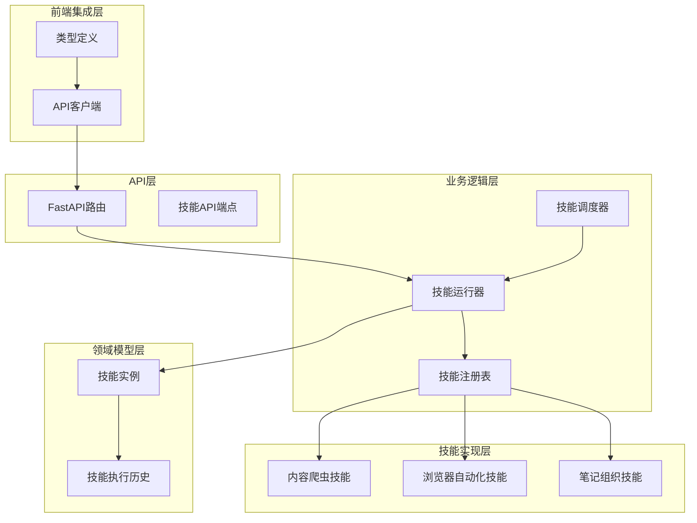
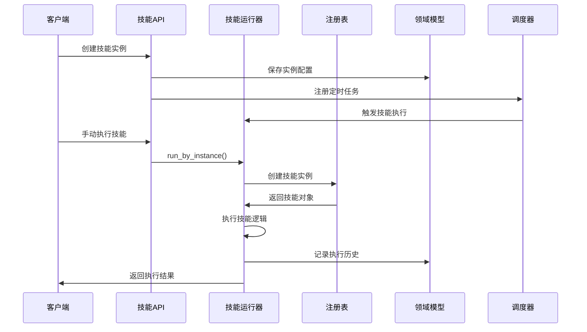
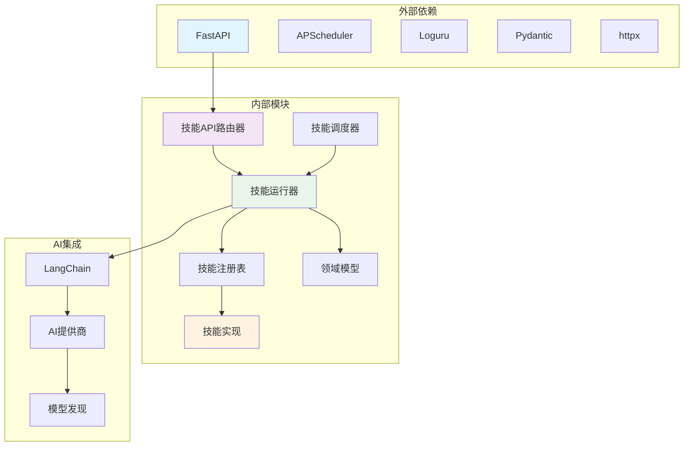

# 技能系统API集成

<cite>
**本文档引用的文件**
- [api/routers/skills.py](file://api/routers/skills.py)
- [open_notebook/skills/__init__.py](file://open_notebook/skills/__init__.py)
- [open_notebook/skills/base.py](file://open_notebook/skills/base.py)
- [open_notebook/skills/registry.py](file://open_notebook/skills/registry.py)
- [open_notebook/skills/runner.py](file://open_notebook/skills/runner.py)
- [open_notebook/skills/scheduler.py](file://open_notebook/skills/scheduler.py)
- [open_notebook/domain/skill.py](file://open_notebook/domain/skill.py)
- [open_notebook/skills/content_crawler.py](file://open_notebook/skills/content_crawler.py)
- [open_notebook/skills/browser_base.py](file://open_notebook/skills/browser_base.py)
- [open_notebook/skills/note_organizer.py](file://open_notebook/skills/note_organizer.py)
- [api/main.py](file://api/main.py)
- [frontend/src/lib/api/skills.ts](file://frontend/src/lib/api/skills.ts)
</cite>

## 目录
1. [简介](#简介)
2. [项目结构](#项目结构)
3. [核心组件](#核心组件)
4. [架构概览](#架构概览)
5. [详细组件分析](#详细组件分析)
6. [依赖关系分析](#依赖关系分析)
7. [性能考虑](#性能考虑)
8. [故障排除指南](#故障排除指南)
9. [结论](#结论)

## 简介

Open Notebook的技能系统是一个基于LangChain的轻量级自动化框架，为研究助手提供智能内容处理和自动化的技能执行能力。该系统通过REST API提供完整的技能生命周期管理，包括技能注册、实例化、调度执行和历史记录追踪。

技能系统的核心价值在于其模块化设计，允许用户创建可重用的自动化单元来处理内容爬取、笔记组织、播客生成等任务。每个技能都是独立的可执行单元，可以手动触发或按计划自动执行。

## 项目结构

技能系统采用分层架构设计，主要包含以下层次：

**图表来源**
- [api/routers/skills.py](file://api/routers/skills.py#L1-L507)
- [open_notebook/skills/runner.py](file://open_notebook/skills/runner.py#L1-L250)
- [open_notebook/skills/registry.py](file://open_notebook/skills/registry.py#L1-L133)

**章节来源**
- [api/routers/skills.py](file://api/routers/skills.py#L1-L507)
- [open_notebook/skills/__init__.py](file://open_notebook/skills/__init__.py#L1-L35)

## 核心组件

### 技能基础架构

技能系统的核心由五个关键组件构成：

1. **Skill基类** - 定义技能的标准接口和生命周期管理
2. **SkillRegistry** - 技能注册和发现机制
3. **SkillRunner** - 技能执行引擎
4. **SkillScheduler** - 基于APScheduler的任务调度
5. **SkillDomain模型** - 数据持久化和状态管理

### 技能类型系统

系统内置了多种预定义技能类型：

| 技能类型 | 功能描述 | 主要参数 |
|---------|----------|----------|
| rss_crawler | RSS内容爬取 | feed_urls, max_entries, deduplicate |
| browser_crawler | 浏览器自动化爬取 | urls, extraction_task, max_pages, follow_links |
| note_summarizer | 笔记自动摘要 | source_note_ids, summary_length, summary_style |
| note_tagger | 自动标签生成 | target_ids, target_type, max_tags |

**章节来源**
- [open_notebook/skills/base.py](file://open_notebook/skills/base.py#L83-L183)
- [open_notebook/skills/registry.py](file://open_notebook/skills/registry.py#L12-L133)
- [open_notebook/skills/content_crawler.py](file://open_notebook/skills/content_crawler.py#L20-L67)
- [open_notebook/skills/browser_base.py](file://open_notebook/skills/browser_base.py#L182-L234)
- [open_notebook/skills/note_organizer.py](file://open_notebook/skills/note_organizer.py#L19-L73)

## 架构概览

技能系统的整体架构采用事件驱动的设计模式，通过异步执行和错误处理确保系统的稳定性和可靠性：

**图表来源**
- [api/routers/skills.py](file://api/routers/skills.py#L162-L201)
- [open_notebook/skills/runner.py](file://open_notebook/skills/runner.py#L41-L150)
- [open_notebook/skills/scheduler.py](file://open_notebook/skills/scheduler.py#L61-L117)

## 详细组件分析

### 技能运行器（SkillRunner）

技能运行器是技能系统的核心执行引擎，负责协调技能的完整生命周期：

**图表来源**
- [open_notebook/skills/runner.py](file://open_notebook/skills/runner.py#L20-L250)
- [open_notebook/skills/base.py](file://open_notebook/skills/base.py#L26-L67)

技能运行器的关键特性包括：

1. **异步执行** - 支持非阻塞的技能执行
2. **生命周期管理** - 自动处理技能的初始化、执行和清理
3. **错误处理** - 完善的异常捕获和错误恢复机制
4. **状态追踪** - 详细的执行历史记录和进度跟踪

**章节来源**
- [open_notebook/skills/runner.py](file://open_notebook/skills/runner.py#L20-L250)

### 技能注册表（SkillRegistry）

技能注册表实现了技能的动态发现和实例化机制：

**图表来源**
- [open_notebook/skills/registry.py](file://open_notebook/skills/registry.py#L12-L133)
- [open_notebook/skills/base.py](file://open_notebook/skills/base.py#L83-L183)

注册表的主要功能：

1. **动态注册** - 运行时技能的注册和注销
2. **实例化** - 根据配置创建具体的技能实例
3. **发现机制** - 提供技能列表和元数据查询
4. **类型验证** - 确保技能类型的正确性

**章节来源**
- [open_notebook/skills/registry.py](file://open_notebook/skills/registry.py#L12-L133)

### 技能调度器（SkillScheduler）

技能调度器基于APScheduler实现cron表达式的任务调度：

**图表来源**
- [open_notebook/skills/scheduler.py](file://open_notebook/skills/scheduler.py#L19-L236)

调度器的核心能力：

1. **Cron调度** - 支持标准cron表达式的时间调度
2. **任务管理** - 动态添加、移除和重新调度任务
3. **状态监控** - 实时跟踪所有已安排任务的状态
4. **错误恢复** - 自动处理调度过程中的异常情况

**章节来源**
- [open_notebook/skills/scheduler.py](file://open_notebook/skills/scheduler.py#L19-L236)

### 领域模型（SkillDomain）

技能系统的数据持久化层提供了完整的技能配置和执行历史管理：

**图表来源**
- [open_notebook/domain/skill.py](file://open_notebook/domain/skill.py#L17-L162)

领域模型的设计特点：

1. **灵活的数据结构** - 使用JSON字段存储可变参数
2. **完整的生命周期** - 支持技能实例的完整生命周期管理
3. **执行历史追踪** - 详细的执行日志和结果记录
4. **查询优化** - 针对常见查询模式的索引设计

**章节来源**
- [open_notebook/domain/skill.py](file://open_notebook/domain/skill.py#L17-L162)

### 具体技能实现

#### 内容爬虫技能（RssCrawlerSkill）

内容爬虫技能实现了RSS订阅源的内容自动抓取和处理：

**图表来源**
- [open_notebook/skills/content_crawler.py](file://open_notebook/skills/content_crawler.py#L260-L311)

技能特性：

1. **多格式支持** - 同时支持RSS 2.0和Atom格式
2. **去重机制** - 基于URL哈希的重复内容检测
3. **灵活配置** - 可配置的最大条目数量和处理选项
4. **错误处理** - 完善的网络请求和解析错误处理

**章节来源**
- [open_notebook/skills/content_crawler.py](file://open_notebook/skills/content_crawler.py#L20-L315)

#### 浏览器自动化技能（BrowserCrawlerSkill）

浏览器自动化技能利用AI驱动的浏览器自动化进行复杂网页内容提取：

**图表来源**
- [open_notebook/skills/browser_base.py](file://open_notebook/skills/browser_base.py#L141-L175)

技能优势：

1. **AI驱动** - 利用自然语言指令进行复杂的网页操作
2. **动态内容处理** - 能够处理JavaScript渲染的动态内容
3. **智能提取** - 基于任务描述的智能内容提取
4. **可扩展性** - 支持自定义的浏览器配置和参数

**章节来源**
- [open_notebook/skills/browser_base.py](file://open_notebook/skills/browser_base.py#L17-L316)

#### 笔记组织技能（NoteOrganizer）

笔记组织技能提供AI驱动的内容理解和处理能力：

**图表来源**
- [open_notebook/skills/note_organizer.py](file://open_notebook/skills/note_organizer.py#L142-L216)

技能功能：

1. **多样式摘要** - 支持多种摘要风格和长度
2. **智能标签** - 基于内容的自动标签生成
3. **批量处理** - 支持同时处理多个笔记
4. **灵活输出** - 可选择创建新笔记或更新现有内容

**章节来源**
- [open_notebook/skills/note_organizer.py](file://open_notebook/skills/note_organizer.py#L19-L408)

## 依赖关系分析

技能系统的依赖关系呈现清晰的分层结构：

**图表来源**
- [api/routers/skills.py](file://api/routers/skills.py#L10-L20)
- [open_notebook/skills/runner.py](file://open_notebook/skills/runner.py#L10-L18)
- [open_notebook/skills/scheduler.py](file://open_notebook/skills/scheduler.py#L8-L17)

系统的关键依赖特性：

1. **模块化设计** - 各组件之间松耦合，便于独立维护
2. **异步架构** - 全面使用async/await确保高性能
3. **错误隔离** - 每个组件都有独立的错误处理机制
4. **可扩展性** - 新技能类型可以轻松添加到系统中

**章节来源**
- [api/routers/skills.py](file://api/routers/skills.py#L10-L20)
- [open_notebook/skills/runner.py](file://open_notebook/skills/runner.py#L10-L18)

## 性能考虑

技能系统在设计时充分考虑了性能优化：

### 并发执行
- 使用AsyncIOScheduler确保非阻塞的任务调度
- 技能执行采用异步模式，避免I/O阻塞
- 支持任务级别的并发控制，防止资源争用

### 缓存策略
- 技能配置和元数据的内存缓存
- 执行历史的分页查询优化
- 重复内容的快速检测机制

### 资源管理
- 自动化的浏览器实例清理
- 异常情况下的资源回收
- 内存使用监控和限制

## 故障排除指南

### 常见问题及解决方案

**技能无法注册**
- 检查技能类的skill_type属性是否唯一
- 确认技能类正确导入到技能包初始化中
- 验证技能参数schema的完整性

**调度器不工作**
- 确认APScheduler依赖已正确安装
- 检查cron表达式的语法正确性
- 验证调度器的启动状态

**执行失败**
- 查看技能执行历史中的错误信息
- 检查网络连接和外部服务可用性
- 验证技能参数的有效性

**章节来源**
- [open_notebook/skills/runner.py](file://open_notebook/skills/runner.py#L212-L237)
- [open_notebook/skills/scheduler.py](file://open_notebook/skills/scheduler.py#L181-L206)

## 结论

Open Notebook的技能系统提供了一个强大而灵活的自动化框架，通过模块化的设计和完善的生命周期管理，为研究助手提供了丰富的自动化能力。系统的核心优势包括：

1. **高度模块化** - 每个技能都是独立的可重用单元
2. **强大的扩展性** - 支持自定义技能的轻松集成
3. **完善的监控** - 详细的执行历史和状态追踪
4. **可靠的调度** - 基于APScheduler的稳定任务管理
5. **异步架构** - 确保高并发场景下的性能表现

该系统为构建复杂的自动化工作流提供了坚实的基础，开发者可以通过简单的接口实现各种内容处理和自动化任务，大大提升了研究助手的智能化水平和工作效率。