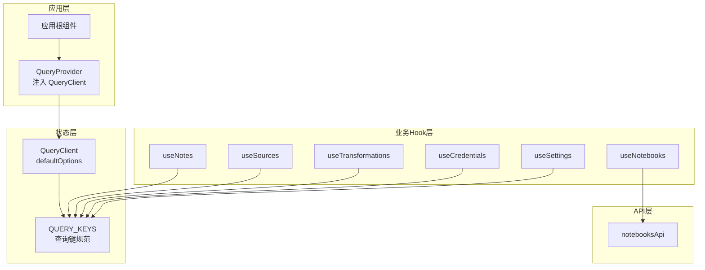
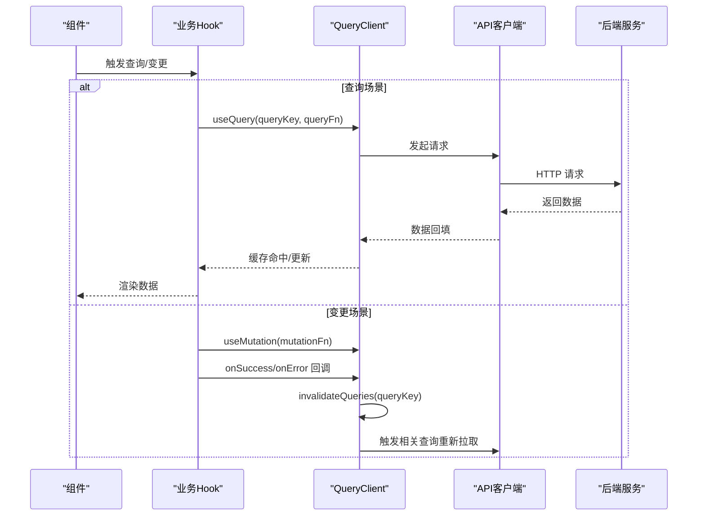
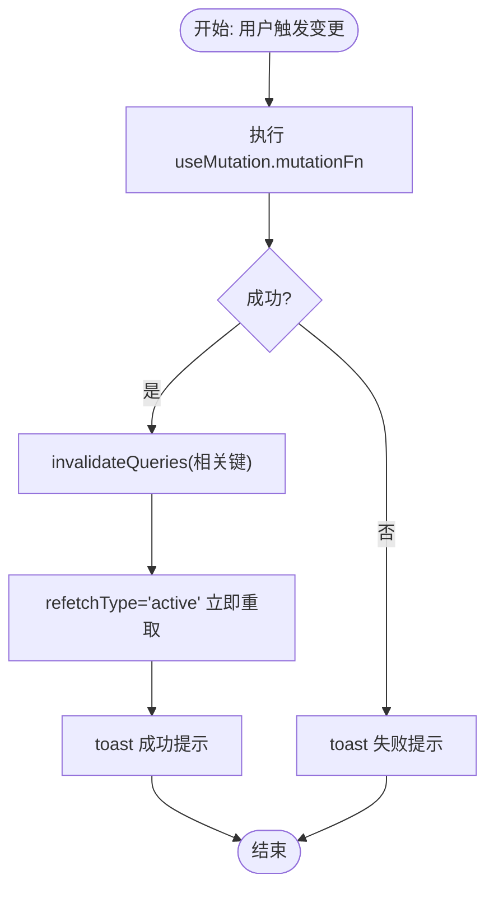
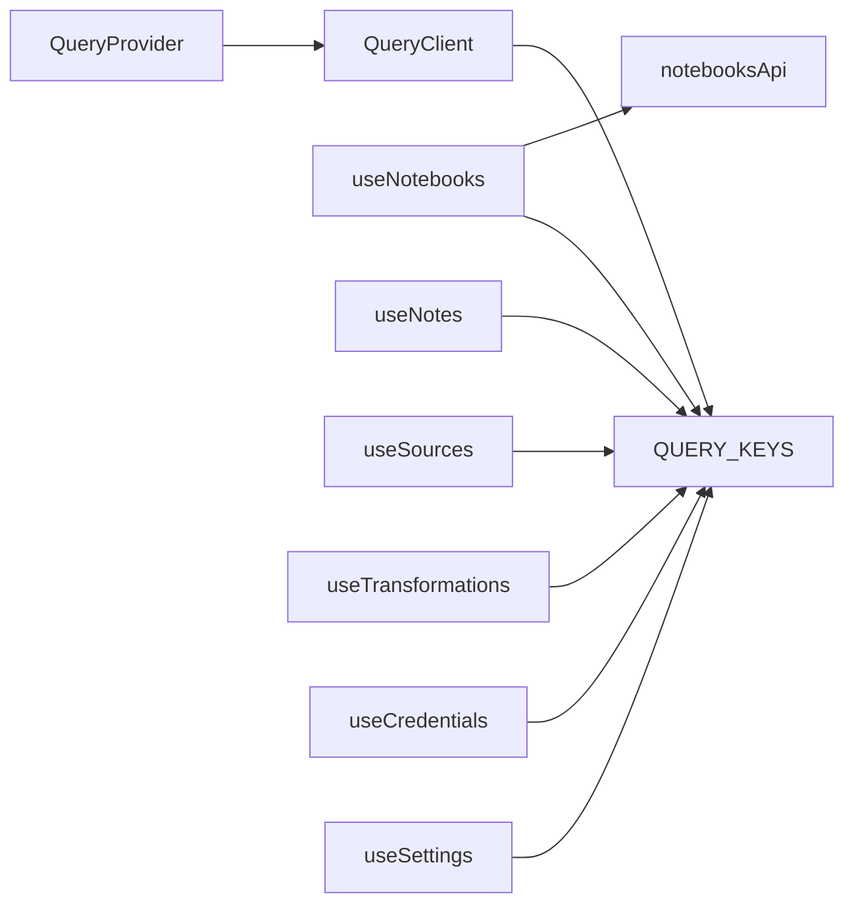

# React Query状态管理

<cite>
**本文引用的文件**
- [frontend/src/lib/api/query-client.ts](file://frontend/src/lib/api/query-client.ts)
- [frontend/src/components/providers/QueryProvider.tsx](file://frontend/src/components/providers/QueryProvider.tsx)
- [frontend/src/lib/hooks/use-notebooks.ts](file://frontend/src/lib/hooks/use-notebooks.ts)
- [frontend/src/lib/hooks/use-notes.ts](file://frontend/src/lib/hooks/use-notes.ts)
- [frontend/src/lib/hooks/use-sources.ts](file://frontend/src/lib/hooks/use-sources.ts)
- [frontend/src/lib/hooks/use-transformations.ts](file://frontend/src/lib/hooks/use-transformations.ts)
- [frontend/src/lib/hooks/use-credentials.ts](file://frontend/src/lib/hooks/use-credentials.ts)
- [frontend/src/lib/hooks/use-settings.ts](file://frontend/src/lib/hooks/use-settings.ts)
- [frontend/src/lib/api/notebooks.ts](file://frontend/src/lib/api/notebooks.ts)
</cite>

## 目录
1. [简介](#简介)
2. [项目结构](#项目结构)
3. [核心组件](#核心组件)
4. [架构总览](#架构总览)
5. [详细组件分析](#详细组件分析)
6. [依赖关系分析](#依赖关系分析)
7. [性能考量](#性能考量)
8. [故障排查指南](#故障排查指南)
9. [结论](#结论)
10. [附录](#附录)

## 简介
本文件系统性阐述 Open Notebook 前端中 React Query 的状态管理实践，覆盖 QueryClient 配置与初始化、查询缓存策略、自动重试与错误处理、Mutation 操作与失效策略、数据同步与手动刷新、缓存清理与内存管理、性能优化与调试方法，并通过具体 Hook 使用路径给出可直接参考的实现范式。

## 项目结构
前端采用按功能域划分的 Hook 层（lib/hooks）与 API 客户端层（lib/api），配合全局 Provider 注入 QueryClient，形成清晰的分层与职责边界：
- 全局 Provider：在应用根部注入 QueryClient，确保所有子组件可用 React Query 能力
- 查询 Hook：围绕领域模型（笔记本、笔记、来源、转换等）封装 useQuery/useMutation/useQueryClient
- API 客户端：统一调用后端接口，返回标准响应类型
- 查询键与默认选项：集中定义 QUERY_KEYS 与 defaultOptions，保证缓存一致性与行为可预期

图表来源
- [frontend/src/components/providers/QueryProvider.tsx](file://frontend/src/components/providers/QueryProvider.tsx#L1-L16)
- [frontend/src/lib/api/query-client.ts](file://frontend/src/lib/api/query-client.ts#L1-L35)
- [frontend/src/lib/hooks/use-notebooks.ts](file://frontend/src/lib/hooks/use-notebooks.ts#L1-L112)
- [frontend/src/lib/hooks/use-notes.ts](file://frontend/src/lib/hooks/use-notes.ts#L1-L102)
- [frontend/src/lib/hooks/use-sources.ts](file://frontend/src/lib/hooks/use-sources.ts#L1-L375)
- [frontend/src/lib/hooks/use-transformations.ts](file://frontend/src/lib/hooks/use-transformations.ts#L1-L155)
- [frontend/src/lib/hooks/use-credentials.ts](file://frontend/src/lib/hooks/use-credentials.ts#L1-L389)
- [frontend/src/lib/hooks/use-settings.ts](file://frontend/src/lib/hooks/use-settings.ts#L1-L38)
- [frontend/src/lib/api/notebooks.ts](file://frontend/src/lib/api/notebooks.ts#L1-L54)

章节来源
- [frontend/src/components/providers/QueryProvider.tsx](file://frontend/src/components/providers/QueryProvider.tsx#L1-L16)
- [frontend/src/lib/api/query-client.ts](file://frontend/src/lib/api/query-client.ts#L1-L35)

## 核心组件
- QueryClient 初始化与默认配置
  - 在全局范围内创建 QueryClient 实例，设置 queries 默认 staleTime/gcTime/retry/refetchOnWindowFocus，以及 mutations 默认 retry
  - 该配置对所有 useQuery/useMutation 生效，保证缓存生命周期与重试策略一致
- 查询键规范（QUERY_KEYS）
  - 将“领域+实体+筛选条件”映射为稳定数组键，确保缓存隔离与失效精准定位
  - 提供派生键工厂函数，如 notebook(id)、notes(notebookId)、sourcesInfinite(notebookId) 等
- Provider 注入
  - 在应用根部以 <QueryClientProvider client={queryClient}> 包裹，使所有子树组件可访问 QueryClient

章节来源
- [frontend/src/lib/api/query-client.ts](file://frontend/src/lib/api/query-client.ts#L1-L35)
- [frontend/src/components/providers/QueryProvider.tsx](file://frontend/src/components/providers/QueryProvider.tsx#L1-L16)

## 架构总览
React Query 在 Open Notebook 中承担以下角色：
- 统一的数据获取与缓存：useQuery 用于列表与详情的拉取与缓存
- 变更与副作用：useMutation 用于创建/更新/删除等写操作
- 失效与同步：通过 useQueryClient.invalidateQueries 精准触发重取
- 自动刷新与实时性：refetchOnWindowFocus、refetchOnMount、refetchInterval 等策略
- 错误处理与用户反馈：结合 toast 与翻译模块，提供一致的错误提示

图表来源
- [frontend/src/lib/hooks/use-notebooks.ts](file://frontend/src/lib/hooks/use-notebooks.ts#L24-L46)
- [frontend/src/lib/hooks/use-notes.ts](file://frontend/src/lib/hooks/use-notes.ts#L26-L50)
- [frontend/src/lib/hooks/use-sources.ts](file://frontend/src/lib/hooks/use-sources.ts#L89-L139)
- [frontend/src/lib/api/query-client.ts](file://frontend/src/lib/api/query-client.ts#L3-L15)

## 详细组件分析

### QueryClient 配置与初始化
- 默认查询选项
  - queries.staleTime：默认 5 分钟，平衡新鲜度与性能
  - queries.gcTime：默认 10 分钟，控制缓存垃圾回收时间
  - queries.retry：默认 2 次，避免瞬时网络波动导致失败
  - queries.refetchOnWindowFocus：关闭窗口焦点重取，减少后台切换抖动
  - mutations.retry：默认 1 次，降低写操作失败成本
- 查询键规范
  - 以数组形式表达层级与筛选条件，如 ['notebooks']、['notebooks', id]、['sources', notebookId] 等
  - 支持派生键工厂，确保不同筛选维度的键空间不冲突

章节来源
- [frontend/src/lib/api/query-client.ts](file://frontend/src/lib/api/query-client.ts#L3-L15)
- [frontend/src/lib/api/query-client.ts](file://frontend/src/lib/api/query-client.ts#L17-L34)

### 查询缓存策略与自动重试
- 列表与详情查询
  - 列表查询通常启用 enabled，避免无效 ID 导致的无意义请求
  - 详情查询根据 id 动态启用，避免空 id 请求
- 来源状态查询的动态刷新
  - 使用 refetchInterval 根据状态动态决定刷新频率（运行/排队/新建时每 2 秒刷新）
  - 对 404 场景禁用重试，避免无效轮询
- 状态标记与实时性
  - 来源状态查询设置 staleTime: 0，确保每次渲染都视为“过期”，从而触发最新数据获取

章节来源
- [frontend/src/lib/hooks/use-sources.ts](file://frontend/src/lib/hooks/use-sources.ts#L18-L26)
- [frontend/src/lib/hooks/use-sources.ts](file://frontend/src/lib/hooks/use-sources.ts#L79-L87)
- [frontend/src/lib/hooks/use-sources.ts](file://frontend/src/lib/hooks/use-sources.ts#L222-L247)

### 错误边界与错误处理
- 统一错误键解析
  - 通过 getApiErrorKey 将后端错误映射到本地化文案键，再由翻译模块 t(...) 输出
- Toast 反馈
  - 成功与失败均通过 toast 提示，成功描述来自翻译模块，失败描述来自错误键映射
- 未捕获异常兜底
  - Mutation 的 onError 统一处理，避免 UI 冻结或静默失败

章节来源
- [frontend/src/lib/hooks/use-notebooks.ts](file://frontend/src/lib/hooks/use-notebooks.ts#L38-L44)
- [frontend/src/lib/hooks/use-notes.ts](file://frontend/src/lib/hooks/use-notes.ts#L42-L48)
- [frontend/src/lib/hooks/use-sources.ts](file://frontend/src/lib/hooks/use-sources.ts#L131-L137)

### Mutation 操作与失效策略
- 创建/更新/删除
  - 成功回调中调用 queryClient.invalidateQueries，按 QUERY_KEYS 或派生键精确失效
  - 对于批量操作（如添加多个来源到笔记本），使用 Promise.allSettled 并汇总结果
- 即时刷新策略
  - 在来源创建/更新/删除等关键路径上，使用 refetchType: 'active' 强制活跃查询立即重取
- 跨领域联动
  - 删除笔记本时，同时失效笔记本列表与来源列表，确保 UI 一致性

图表来源
- [frontend/src/lib/hooks/use-notebooks.ts](file://frontend/src/lib/hooks/use-notebooks.ts#L29-L46)
- [frontend/src/lib/hooks/use-notes.ts](file://frontend/src/lib/hooks/use-notes.ts#L57-L75)
- [frontend/src/lib/hooks/use-sources.ts](file://frontend/src/lib/hooks/use-sources.ts#L94-L139)
- [frontend/src/lib/hooks/use-sources.ts](file://frontend/src/lib/hooks/use-sources.ts#L146-L165)

章节来源
- [frontend/src/lib/hooks/use-notebooks.ts](file://frontend/src/lib/hooks/use-notebooks.ts#L24-L112)
- [frontend/src/lib/hooks/use-notes.ts](file://frontend/src/lib/hooks/use-notes.ts#L26-L102)
- [frontend/src/lib/hooks/use-sources.ts](file://frontend/src/lib/hooks/use-sources.ts#L89-L193)

### 数据同步机制与手动刷新控制
- 无限滚动来源列表
  - 使用 useInfiniteQuery 获取分页数据，通过 getNextPageParam 计算下一页偏移
  - flatten 后的 sources 数组作为渲染数据，提供 fetchNextPage 与 refetch 手动控制
- 手动刷新
  - 通过 queryClient.invalidateQueries 触发指定查询的重取
  - 在来源状态轮询场景中，通过失效状态查询强制重新拉取

章节来源
- [frontend/src/lib/hooks/use-sources.ts](file://frontend/src/lib/hooks/use-sources.ts#L32-L77)
- [frontend/src/lib/hooks/use-sources.ts](file://frontend/src/lib/hooks/use-sources.ts#L222-L247)

### 手动刷新与主动重取
- 主动重取
  - 在来源创建/更新/删除后，针对笔记本来源列表与通用来源列表进行主动重取
- 窗口焦点重取
  - 来源列表与单个来源查询开启 refetchOnWindowFocus，提升用户体验

章节来源
- [frontend/src/lib/hooks/use-sources.ts](file://frontend/src/lib/hooks/use-sources.ts#L96-L116)
- [frontend/src/lib/hooks/use-sources.ts](file://frontend/src/lib/hooks/use-sources.ts#L149-L152)
- [frontend/src/lib/hooks/use-sources.ts](file://frontend/src/lib/hooks/use-sources.ts#L175-L183)

### 实际使用示例（Hook 路径）
- 查询笔记本列表
  - Hook 路径：[useNotebooks](file://frontend/src/lib/hooks/use-notebooks.ts#L9-L14)
  - 查询键：[QUERY_KEYS.notebooks](file://frontend/src/lib/api/query-client.ts#L18-L18)
- 查询单个笔记本
  - Hook 路径：[useNotebook](file://frontend/src/lib/hooks/use-notebooks.ts#L16-L22)
  - 查询键：[QUERY_KEYS.notebook(id)](file://frontend/src/lib/api/query-client.ts#L19-L19)
- 创建笔记本
  - Hook 路径：[useCreateNotebook](file://frontend/src/lib/hooks/use-notebooks.ts#L24-L46)
  - 失效键：[QUERY_KEYS.notebooks](file://frontend/src/lib/api/query-client.ts#L18-L18)
- 查询笔记列表
  - Hook 路径：[useNotes](file://frontend/src/lib/hooks/use-notes.ts#L9-L15)
  - 查询键：[QUERY_KEYS.notes(notebookId)](file://frontend/src/lib/api/query-client.ts#L20-L20)
- 查询单个笔记
  - Hook 路径：[useNote](file://frontend/src/lib/hooks/use-notes.ts#L17-L24)
  - 查询键：[QUERY_KEYS.note(id)](file://frontend/src/lib/api/query-client.ts#L21-L21)
- 创建笔记
  - Hook 路径：[useCreateNote](file://frontend/src/lib/hooks/use-notes.ts#L26-L50)
  - 失效键：[QUERY_KEYS.notes(notebook_id)](file://frontend/src/lib/api/query-client.ts#L20-L20)
- 查询来源列表（含无限滚动）
  - Hook 路径：[useSources](file://frontend/src/lib/hooks/use-sources.ts#L18-L26)
  - Hook 路径：[useNotebookSources](file://frontend/src/lib/hooks/use-sources.ts#L32-L77)
  - 查询键：[QUERY_KEYS.sources(notebookId)](file://frontend/src/lib/api/query-client.ts#L22-L22)
  - 查询键：[QUERY_KEYS.sourcesInfinite(notebookId)](file://frontend/src/lib/api/query-client.ts#L23-L23)
- 查询来源状态并自动刷新
  - Hook 路径：[useSourceStatus](file://frontend/src/lib/hooks/use-sources.ts#L222-L247)
  - 查询键：['sources', sourceId, 'status']
- 创建来源并主动重取
  - Hook 调用链：[useCreateSource](file://frontend/src/lib/hooks/use-sources.ts#L89-L139)
  - 失效键：[QUERY_KEYS.sources(notebookId)](file://frontend/src/lib/api/query-client.ts#L22-L22)、[QUERY_KEYS.sources()](file://frontend/src/lib/api/query-client.ts#L22-L22)
- 查询转换列表与默认提示词
  - Hook 路径：[useTransformations](file://frontend/src/lib/hooks/use-transformations.ts#L19-L24)
  - Hook 路径：[useDefaultPrompt](file://frontend/src/lib/hooks/use-transformations.ts#L125-L130)
  - 查询键：[TRANSFORMATION_QUERY_KEYS.transformations](file://frontend/src/lib/hooks/use-transformations.ts#L13-L17)
  - 查询键：[TRANSFORMATION_QUERY_KEYS.defaultPrompt](file://frontend/src/lib/hooks/use-transformations.ts#L13-L17)
- 凭证与环境迁移
  - Hook 路径：[useMigrateFromEnv](file://frontend/src/lib/hooks/use-credentials.ts#L287-L335)
  - Hook 路径：[useMigrateFromProviderConfig](file://frontend/src/lib/hooks/use-credentials.ts#L340-L388)
  - 失效键：[CREDENTIAL_QUERY_KEYS.all](file://frontend/src/lib/hooks/use-credentials.ts#L15-L21)、[MODEL_QUERY_KEYS.models](file://frontend/src/lib/hooks/use-credentials.ts#L13-L13)
- 设置项读取与更新
  - Hook 路径：[useSettings](file://frontend/src/lib/hooks/use-settings.ts#L9-L14)
  - Hook 路径：[useUpdateSettings](file://frontend/src/lib/hooks/use-settings.ts#L16-L38)
  - 查询键：[QUERY_KEYS.settings](file://frontend/src/lib/api/query-client.ts#L25-L25)

章节来源
- [frontend/src/lib/hooks/use-notebooks.ts](file://frontend/src/lib/hooks/use-notebooks.ts#L9-L112)
- [frontend/src/lib/hooks/use-notes.ts](file://frontend/src/lib/hooks/use-notes.ts#L9-L102)
- [frontend/src/lib/hooks/use-sources.ts](file://frontend/src/lib/hooks/use-sources.ts#L18-L247)
- [frontend/src/lib/hooks/use-transformations.ts](file://frontend/src/lib/hooks/use-transformations.ts#L19-L155)
- [frontend/src/lib/hooks/use-credentials.ts](file://frontend/src/lib/hooks/use-credentials.ts#L287-L388)
- [frontend/src/lib/hooks/use-settings.ts](file://frontend/src/lib/hooks/use-settings.ts#L9-L38)
- [frontend/src/lib/api/query-client.ts](file://frontend/src/lib/api/query-client.ts#L17-L34)

### 缓存清理与内存管理
- 垃圾回收时间（gcTime）
  - 默认 10 分钟，避免长期驻留的过期缓存占用内存
- 显式清理
  - 在删除笔记本/笔记/来源等场景，通过失效通用键 ['sources']、['notes'] 等触发批量清理
- 精准失效
  - 优先使用 QUERY_KEYS 派生键，避免全量失效带来的额外开销

章节来源
- [frontend/src/lib/api/query-client.ts](file://frontend/src/lib/api/query-client.ts#L6-L8)
- [frontend/src/lib/hooks/use-notebooks.ts](file://frontend/src/lib/hooks/use-notebooks.ts#L95-L98)
- [frontend/src/lib/hooks/use-notes.ts](file://frontend/src/lib/hooks/use-notes.ts#L83-L92)
- [frontend/src/lib/hooks/use-sources.ts](file://frontend/src/lib/hooks/use-sources.ts#L149-L183)

### 性能优化技巧
- 合理设置 staleTime
  - 列表类查询默认 5 分钟，来源列表与来源详情设置更短 staleTime（5~30 秒），提升实时性
- 关闭不必要的窗口焦点重取
  - 避免后台标签频繁重取，降低网络与 CPU 开销
- 无限滚动与分页
  - 使用 useInfiniteQuery 与 getNextPageParam，仅加载必要页面，减少一次性数据量
- 主动重取与批量失效
  - 在批量操作后使用 refetchType: 'active' 与精准失效，避免全量刷新
- 状态轮询
  - 仅在运行/排队/新建状态下启用 refetchInterval，完成后停止轮询

章节来源
- [frontend/src/lib/hooks/use-sources.ts](file://frontend/src/lib/hooks/use-sources.ts#L23-L25)
- [frontend/src/lib/hooks/use-sources.ts](file://frontend/src/lib/hooks/use-sources.ts#L84-L86)
- [frontend/src/lib/hooks/use-sources.ts](file://frontend/src/lib/hooks/use-sources.ts#L32-L77)
- [frontend/src/lib/hooks/use-sources.ts](file://frontend/src/lib/hooks/use-sources.ts#L227-L236)

## 依赖关系分析
- Provider 依赖 QueryClient
  - QueryProvider 仅负责注入，不参与配置细节
- Hook 依赖 QueryClient 与 API 客户端
  - useQuery/useMutation 依赖 QueryClient 的缓存与失效机制
  - API 客户端封装 HTTP 请求，返回标准化数据
- 查询键依赖
  - 所有 Hook 通过 QUERY_KEYS 保持键空间一致，避免跨组件键冲突

图表来源
- [frontend/src/components/providers/QueryProvider.tsx](file://frontend/src/components/providers/QueryProvider.tsx#L1-L16)
- [frontend/src/lib/api/query-client.ts](file://frontend/src/lib/api/query-client.ts#L17-L34)
- [frontend/src/lib/hooks/use-notebooks.ts](file://frontend/src/lib/hooks/use-notebooks.ts#L1-L112)
- [frontend/src/lib/hooks/use-notes.ts](file://frontend/src/lib/hooks/use-notes.ts#L1-L102)
- [frontend/src/lib/hooks/use-sources.ts](file://frontend/src/lib/hooks/use-sources.ts#L1-L375)
- [frontend/src/lib/hooks/use-transformations.ts](file://frontend/src/lib/hooks/use-transformations.ts#L1-L155)
- [frontend/src/lib/hooks/use-credentials.ts](file://frontend/src/lib/hooks/use-credentials.ts#L1-L389)
- [frontend/src/lib/hooks/use-settings.ts](file://frontend/src/lib/hooks/use-settings.ts#L1-L38)
- [frontend/src/lib/api/notebooks.ts](file://frontend/src/lib/api/notebooks.ts#L1-L54)

章节来源
- [frontend/src/components/providers/QueryProvider.tsx](file://frontend/src/components/providers/QueryProvider.tsx#L1-L16)
- [frontend/src/lib/api/query-client.ts](file://frontend/src/lib/api/query-client.ts#L17-L34)
- [frontend/src/lib/hooks/use-notebooks.ts](file://frontend/src/lib/hooks/use-notebooks.ts#L1-L112)
- [frontend/src/lib/hooks/use-notes.ts](file://frontend/src/lib/hooks/use-notes.ts#L1-L102)
- [frontend/src/lib/hooks/use-sources.ts](file://frontend/src/lib/hooks/use-sources.ts#L1-L375)
- [frontend/src/lib/hooks/use-transformations.ts](file://frontend/src/lib/hooks/use-transformations.ts#L1-L155)
- [frontend/src/lib/hooks/use-credentials.ts](file://frontend/src/lib/hooks/use-credentials.ts#L1-L389)
- [frontend/src/lib/hooks/use-settings.ts](file://frontend/src/lib/hooks/use-settings.ts#L1-L38)
- [frontend/src/lib/api/notebooks.ts](file://frontend/src/lib/api/notebooks.ts#L1-L54)

## 性能考量
- 缓存新鲜度与 GC 时间
  - 列表类查询较长 staleTime，详情类查询较短 staleTime，平衡用户体验与资源消耗
- 窗口焦点重取
  - 默认关闭，避免后台切换导致的重复请求；来源状态等实时场景单独开启
- 无限滚动与分页
  - 控制每页大小与仅加载必要页面，减少内存占用
- 主动重取与批量失效
  - 使用 refetchType: 'active' 与精准键失效，避免全量刷新
- 状态轮询
  - 仅在必要时开启轮询，完成后及时停止，防止持续网络压力

[本节为通用指导，无需列出章节来源]

## 故障排查指南
- 常见问题
  - 查询未生效：检查 queryKey 是否与 QUERY_KEYS 一致，确认 enabled 条件满足
  - 无法自动刷新：确认 refetchOnWindowFocus/refetchOnMount 设置是否符合预期
  - 状态轮询不停止：检查 refetchInterval 返回值逻辑，确保完成态返回 false
  - 失效不生效：核对失效键是否与查询键完全匹配，必要时使用通配符键 ['sources']
- 调试方法
  - 使用 React DevTools 的 React Query 插件观察查询状态与缓存
  - 在 Mutation 的 onError 中输出错误对象，结合 getApiErrorKey 定位后端错误码
  - 通过 queryClient.resetQueries 或 invalidateQueries 测试缓存清理效果

[本节为通用指导，无需列出章节来源]

## 结论
Open Notebook 在前端通过统一的 QueryClient 配置、规范化的查询键与完善的 Hook 抽象，实现了高效、可维护的状态管理。查询缓存策略、自动重试与失效机制协同工作，既保证了用户体验，又兼顾了性能与可扩展性。建议在新增业务时遵循 QUERY_KEYS 与 Hook 使用范式，确保缓存一致性与开发效率。

[本节为总结性内容，无需列出章节来源]

## 附录
- 相关实现路径速查
  - QueryClient 初始化与默认选项：[frontend/src/lib/api/query-client.ts](file://frontend/src/lib/api/query-client.ts#L3-L15)
  - 查询键规范：[frontend/src/lib/api/query-client.ts](file://frontend/src/lib/api/query-client.ts#L17-L34)
  - Provider 注入：[frontend/src/components/providers/QueryProvider.tsx](file://frontend/src/components/providers/QueryProvider.tsx#L1-L16)
  - 笔记本查询与变更：[frontend/src/lib/hooks/use-notebooks.ts](file://frontend/src/lib/hooks/use-notebooks.ts#L9-L112)
  - 笔记查询与变更：[frontend/src/lib/hooks/use-notes.ts](file://frontend/src/lib/hooks/use-notes.ts#L9-L102)
  - 来源查询、无限滚动与状态轮询：[frontend/src/lib/hooks/use-sources.ts](file://frontend/src/lib/hooks/use-sources.ts#L18-L247)
  - 转换查询与默认提示词：[frontend/src/lib/hooks/use-transformations.ts](file://frontend/src/lib/hooks/use-transformations.ts#L19-L155)
  - 凭证迁移与模型发现：[frontend/src/lib/hooks/use-credentials.ts](file://frontend/src/lib/hooks/use-credentials.ts#L287-L388)
  - 设置项读取与更新：[frontend/src/lib/hooks/use-settings.ts](file://frontend/src/lib/hooks/use-settings.ts#L9-L38)
  - API 客户端示例：[frontend/src/lib/api/notebooks.ts](file://frontend/src/lib/api/notebooks.ts#L1-L54)

[本节为索引性内容，无需列出章节来源]