# Zustand状态管理

<cite>
**本文档引用的文件**
- [frontend/src/lib/stores/theme-store.ts](file://frontend/src/lib/stores/theme-store.ts)
- [frontend/src/components/providers/ThemeProvider.tsx](file://frontend/src/components/providers/ThemeProvider.tsx)
- [frontend/src/lib/theme-script.ts](file://frontend/src/lib/theme-script.ts)
- [frontend/src/lib/stores/auth-store.ts](file://frontend/src/lib/stores/auth-store.ts)
- [frontend/src/lib/stores/notebook-columns-store.ts](file://frontend/src/lib/stores/notebook-columns-store.ts)
- [frontend/src/app/(dashboard)/layout.tsx](file://frontend/src/app/(dashboard)/layout.tsx)
- [frontend/src/components/auth/LoginForm.tsx](file://frontend/src/components/auth/LoginForm.tsx)
- [frontend/src/app/(dashboard)/notebooks/[id]/page.tsx](file://frontend/src/app/(dashboard)/notebooks/[id]/page.tsx)
- [frontend/src/components/podcasts/GeneratePodcastDialog.tsx](file://frontend/src/components/podcasts/GeneratePodcastDialog.tsx)
- [frontend/src/lib/hooks/use-modal-manager.ts](file://frontend/src/lib/hooks/use-modal-manager.ts)
- [frontend/src/lib/i18n.ts](file://frontend/src/lib/i18n.ts)
- [frontend/src/lib/i18n-events.ts](file://frontend/src/lib/i18n-events.ts)
- [frontend/src/lib/utils/date-locale.ts](file://frontend/src/lib/utils/date-locale.ts)
- [frontend/src/lib/stores/CLAUDE.md](file://frontend/src/lib/stores/CLAUDE.md)
- [frontend/src/lib/locales/CLAUDE.md](file://frontend/src/lib/locales/CLAUDE.md)
- [frontend/src/lib/api/client.ts](file://frontend/src/lib/api/client.ts)
</cite>

## 目录
1. [简介](#简介)
2. [项目结构](#项目结构)
3. [核心组件](#核心组件)
4. [架构概览](#架构概览)
5. [详细组件分析](#详细组件分析)
6. [依赖关系分析](#依赖关系分析)
7. [性能考虑](#性能考虑)
8. [故障排除指南](#故障排除指南)
9. [结论](#结论)
10. [附录](#附录)

## 简介

Open Notebook项目采用Zustand作为前端状态管理的核心解决方案。Zustand为项目提供了轻量级、类型安全且易于使用的状态管理能力，特别适用于需要复杂UI状态管理和持久化需求的应用场景。

该项目的状态管理架构具有以下特点：
- 基于Zustand的函数式状态管理
- 完整的本地存储持久化策略
- 组件级别的状态订阅和优化
- 类型安全的状态定义和操作
- 高效的主题切换和上下文管理

## 项目结构

前端状态管理主要集中在`frontend/src/lib/stores/`目录下，采用按功能模块划分的组织方式：

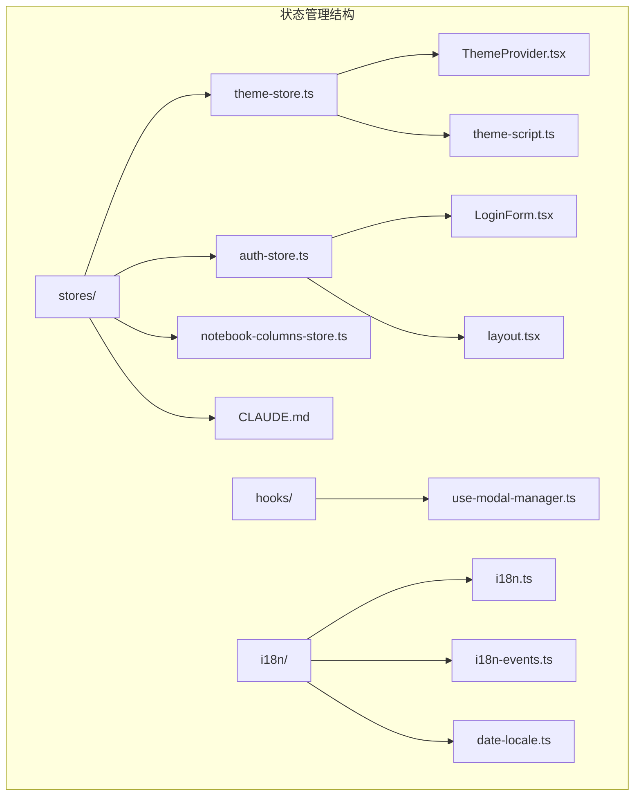

**图表来源**
- [frontend/src/lib/stores/theme-store.ts](file://frontend/src/lib/stores/theme-store.ts#L1-L61)
- [frontend/src/lib/stores/auth-store.ts](file://frontend/src/lib/stores/auth-store.ts#L1-L222)
- [frontend/src/lib/stores/notebook-columns-store.ts](file://frontend/src/lib/stores/notebook-columns-store.ts#L1-L27)

**章节来源**
- [frontend/src/lib/stores/theme-store.ts](file://frontend/src/lib/stores/theme-store.ts#L1-L61)
- [frontend/src/lib/stores/auth-store.ts](file://frontend/src/lib/stores/auth-store.ts#L1-L222)
- [frontend/src/lib/stores/notebook-columns-store.ts](file://frontend/src/lib/stores/notebook-columns-store.ts#L1-L27)

## 核心组件

### 主题状态管理

主题系统是Zustand在项目中的典型应用案例，实现了完整的主题切换和持久化功能：

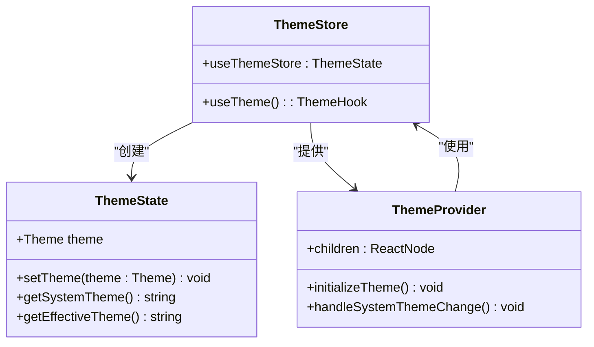

**图表来源**
- [frontend/src/lib/stores/theme-store.ts](file://frontend/src/lib/stores/theme-store.ts#L6-L11)
- [frontend/src/components/providers/ThemeProvider.tsx](file://frontend/src/components/providers/ThemeProvider.tsx#L6-L8)

### 认证状态管理

认证系统实现了完整的用户身份验证流程，包括登录、登出和自动验证功能：

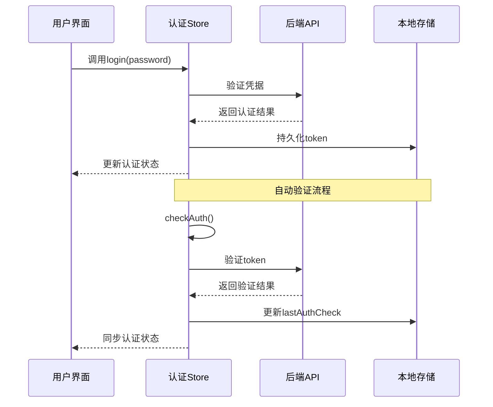

**图表来源**
- [frontend/src/lib/stores/auth-store.ts](file://frontend/src/lib/stores/auth-store.ts#L77-L140)
- [frontend/src/lib/stores/auth-store.ts](file://frontend/src/lib/stores/auth-store.ts#L150-L209)

**章节来源**
- [frontend/src/lib/stores/theme-store.ts](file://frontend/src/lib/stores/theme-store.ts#L1-L61)
- [frontend/src/components/providers/ThemeProvider.tsx](file://frontend/src/components/providers/ThemeProvider.tsx#L1-L44)
- [frontend/src/lib/stores/auth-store.ts](file://frontend/src/lib/stores/auth-store.ts#L1-L222)

## 架构概览

Open Notebook的Zustand状态管理架构采用了分层设计，确保了良好的可维护性和扩展性：

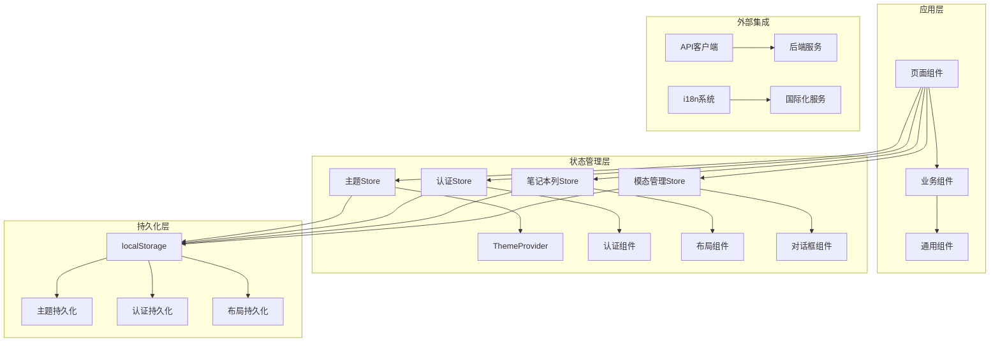

**图表来源**
- [frontend/src/lib/stores/theme-store.ts](file://frontend/src/lib/stores/theme-store.ts#L13-L49)
- [frontend/src/lib/stores/auth-store.ts](file://frontend/src/lib/stores/auth-store.ts#L21-L222)
- [frontend/src/lib/stores/notebook-columns-store.ts](file://frontend/src/lib/stores/notebook-columns-store.ts#L13-L27)

## 详细组件分析

### 主题管理系统

#### 状态定义和数据结构

主题系统的核心状态结构简洁而高效：

| 字段名 | 类型 | 描述 | 默认值 |
|--------|------|------|--------|
| theme | Theme | 当前主题设置 | 'system' |
| setTheme | Function | 设置新主题的方法 | - |
| getSystemTheme | Function | 获取系统主题的方法 | - |
| getEffectiveTheme | Function | 获取生效主题的方法 | - |

#### 主题切换流程

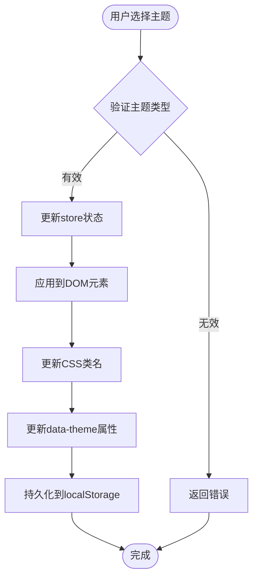

**图表来源**
- [frontend/src/lib/stores/theme-store.ts](file://frontend/src/lib/stores/theme-store.ts#L18-L30)

#### 主题初始化策略

为了防止主题闪烁问题，项目采用了预渲染脚本策略：

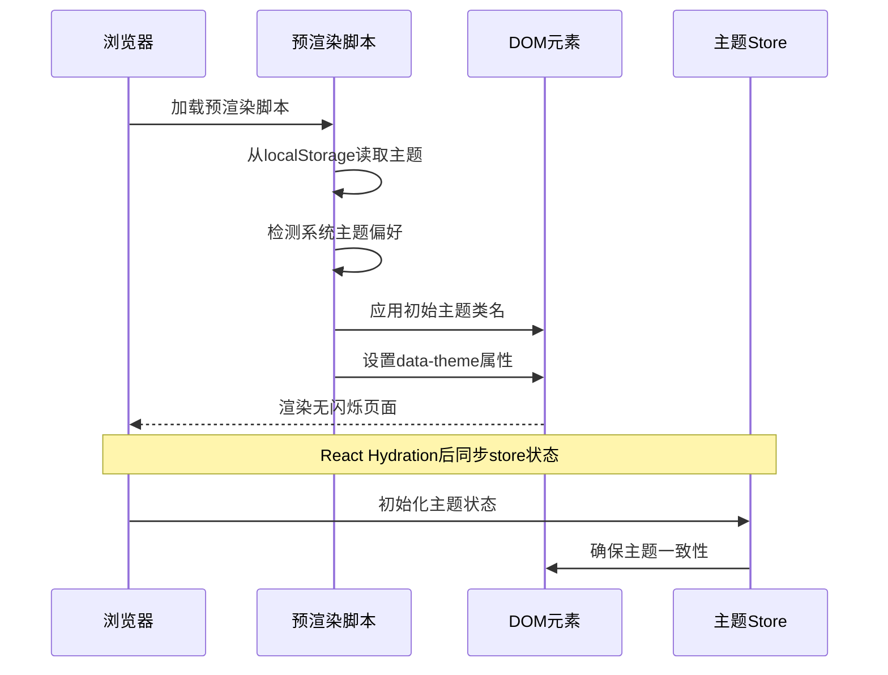

**图表来源**
- [frontend/src/lib/theme-script.ts](file://frontend/src/lib/theme-script.ts#L1-L18)
- [frontend/src/components/providers/ThemeProvider.tsx](file://frontend/src/components/providers/ThemeProvider.tsx#L13-L41)

**章节来源**
- [frontend/src/lib/stores/theme-store.ts](file://frontend/src/lib/stores/theme-store.ts#L1-L61)
- [frontend/src/components/providers/ThemeProvider.tsx](file://frontend/src/components/providers/ThemeProvider.tsx#L1-L44)
- [frontend/src/lib/theme-script.ts](file://frontend/src/lib/theme-script.ts#L1-L18)

### 认证管理系统

#### 认证状态流

认证系统实现了复杂的认证状态管理，包括自动验证、错误处理和状态同步：

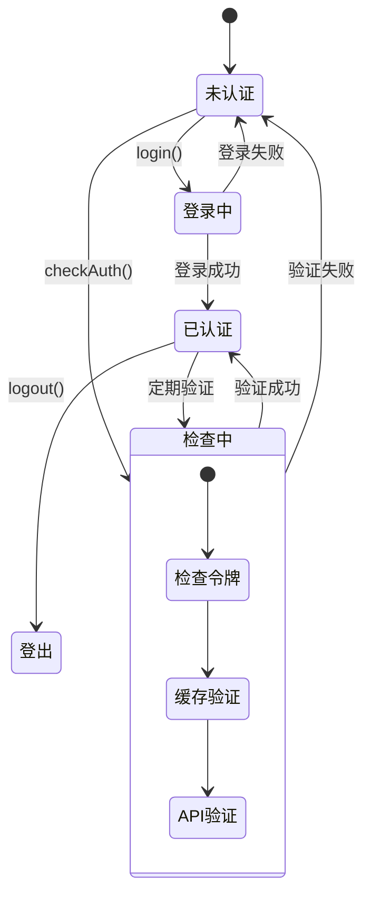

**图表来源**
- [frontend/src/lib/stores/auth-store.ts](file://frontend/src/lib/stores/auth-store.ts#L150-L209)

#### 认证持久化策略

认证信息通过localStorage进行持久化，确保用户会话的连续性：

| 存储键 | 数据类型 | 描述 | 生命周期 |
|--------|----------|------|----------|
| auth-storage | Object | 认证状态数据 | 浏览器会话期间 |
| 包含字段 | - | token, isAuthenticated, lastAuthCheck | - |

**章节来源**
- [frontend/src/lib/stores/auth-store.ts](file://frontend/src/lib/stores/auth-store.ts#L1-L222)
- [frontend/src/components/auth/LoginForm.tsx](file://frontend/src/components/auth/LoginForm.tsx#L128-L138)

### 笔记本布局管理系统

#### 列折叠状态管理

笔记本页面的布局状态管理体现了Zustand在复杂UI状态管理中的优势：

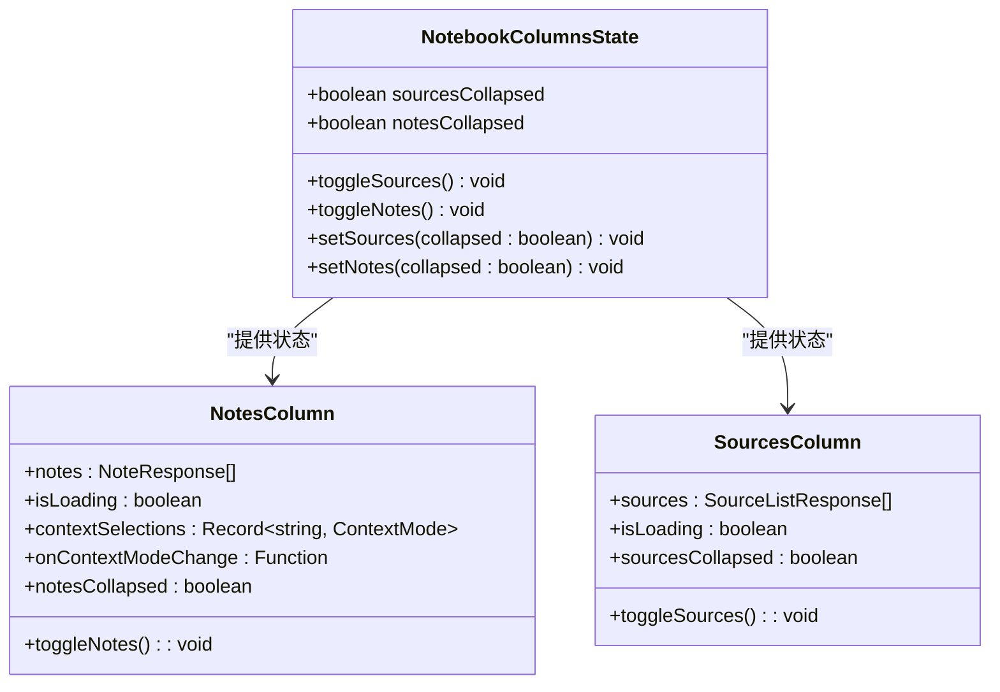

**图表来源**
- [frontend/src/lib/stores/notebook-columns-store.ts](file://frontend/src/lib/stores/notebook-columns-store.ts#L4-L11)

**章节来源**
- [frontend/src/lib/stores/notebook-columns-store.ts](file://frontend/src/lib/stores/notebook-columns-store.ts#L1-L27)
- [frontend/src/app/(dashboard)/notebooks/[id]/page.tsx](file://frontend/src/app/(dashboard)/notebooks/[id]/page.tsx#L47-L108)

### 国际化状态管理

#### 语言切换流程

国际化系统通过事件驱动的方式实现语言切换，确保了组件间的解耦：

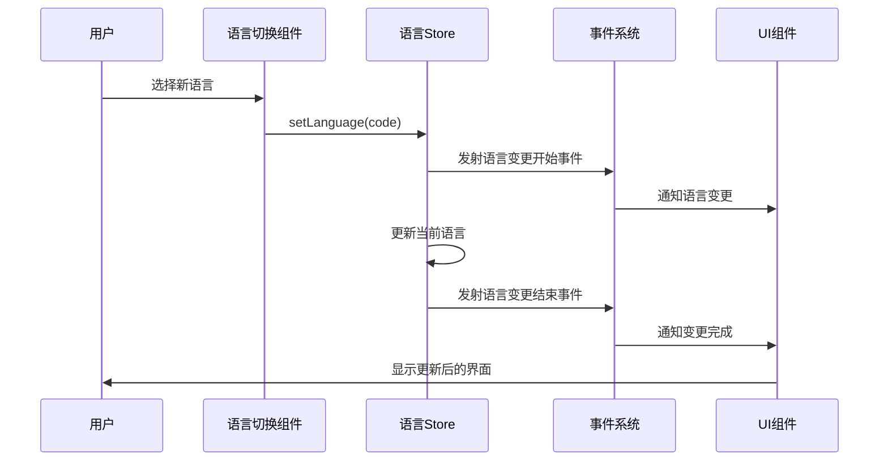

**图表来源**
- [frontend/src/lib/hooks/use-translation.ts](file://frontend/src/lib/hooks/use-translation.ts#L135-L148)
- [frontend/src/lib/i18n-events.ts](file://frontend/src/lib/i18n-events.ts#L10-L24)

**章节来源**
- [frontend/src/lib/i18n.ts](file://frontend/src/lib/i18n.ts#L1-L24)
- [frontend/src/lib/i18n-events.ts](file://frontend/src/lib/i18n-events.ts#L1-L24)
- [frontend/src/lib/utils/date-locale.ts](file://frontend/src/lib/utils/date-locale.ts#L1-L25)

## 依赖关系分析

### 组件间依赖关系

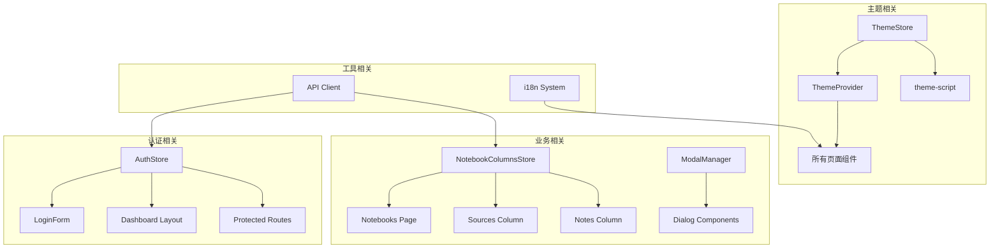

**图表来源**
- [frontend/src/lib/stores/theme-store.ts](file://frontend/src/lib/stores/theme-store.ts#L1-L61)
- [frontend/src/lib/stores/auth-store.ts](file://frontend/src/lib/stores/auth-store.ts#L1-L222)
- [frontend/src/lib/stores/notebook-columns-store.ts](file://frontend/src/lib/stores/notebook-columns-store.ts#L1-L27)

### 外部依赖关系

项目对Zustand及其中间件的依赖关系清晰明确：

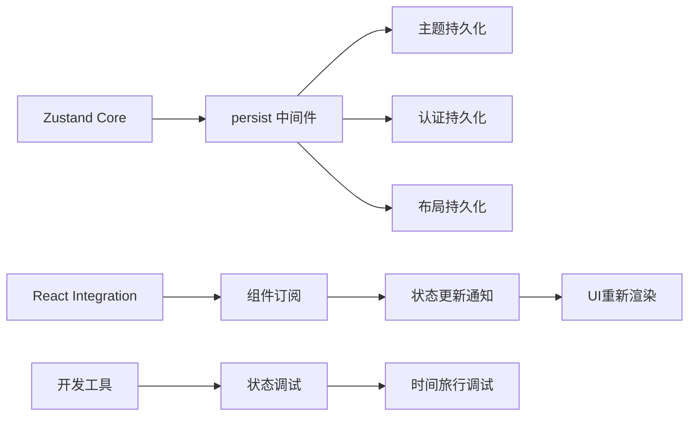

**图表来源**
- [frontend/src/lib/stores/theme-store.ts](file://frontend/src/lib/stores/theme-store.ts#L1-L2)
- [frontend/src/lib/stores/auth-store.ts](file://frontend/src/lib/stores/auth-store.ts#L1-L2)

**章节来源**
- [frontend/src/lib/stores/CLAUDE.md](file://frontend/src/lib/stores/CLAUDE.md#L26-L51)

## 性能考虑

### 状态更新优化

Zustand在Open Notebook中的性能优化主要体现在以下几个方面：

#### 1. 精确的状态订阅

通过使用`useStore`的精确订阅机制，组件只在相关状态变化时重新渲染：

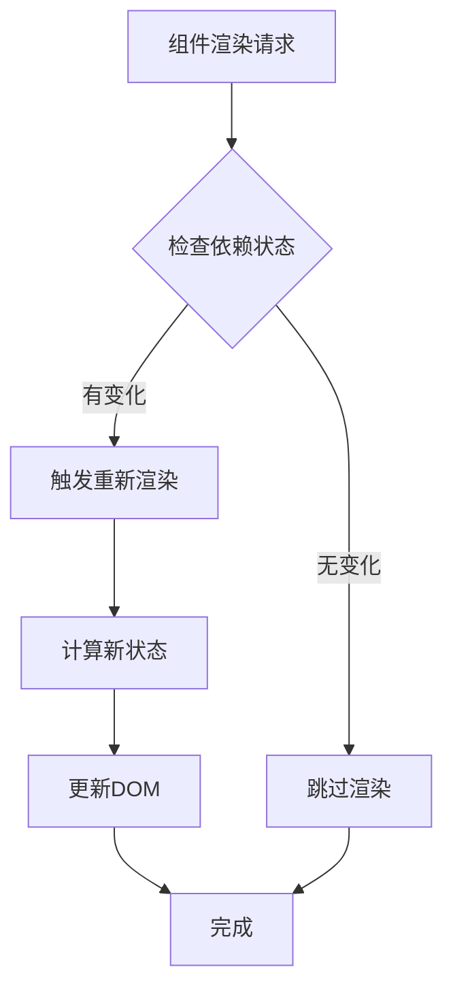

#### 2. 持久化策略优化

每个Store都采用了`partialize`函数来优化存储空间：

| Store | 存储字段 | 优化效果 |
|-------|----------|----------|
| ThemeStore | theme | 最小化存储占用 |
| AuthStore | token, isAuthenticated | 仅存储必要认证信息 |
| NotebookColumnsStore | sourcesCollapsed, notesCollapsed | 简化布局状态 |

#### 3. 防抖和缓存机制

认证系统的防抖机制避免了频繁的API调用：

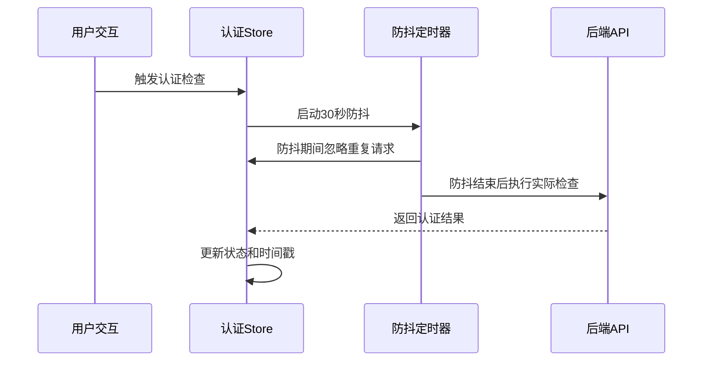

**图表来源**
- [frontend/src/lib/stores/auth-store.ts](file://frontend/src/lib/stores/auth-store.ts#L164-L168)

### 内存管理

项目采用了渐进式的内存管理策略：

1. **惰性初始化**：Store在首次使用时才创建
2. **条件加载**：仅在需要时加载相关状态
3. **自动清理**：组件卸载时自动清理订阅

**章节来源**
- [frontend/src/lib/stores/auth-store.ts](file://frontend/src/lib/stores/auth-store.ts#L150-L209)
- [frontend/src/lib/stores/CLAUDE.md](file://frontend/src/lib/stores/CLAUDE.md#L42-L51)

## 故障排除指南

### 常见问题诊断

#### 1. SSR水合不匹配问题

**症状**：服务器渲染和客户端渲染出现主题不一致

**解决方案**：
- 使用预渲染脚本确保SSR时的主题一致性
- 在组件中检查`hasHydrated`状态后再渲染

#### 2. 认证状态不同步

**症状**：登录后状态没有正确更新

**排查步骤**：
1. 检查localStorage中的认证数据
2. 验证API响应状态码
3. 确认store的持久化配置

#### 3. 状态更新性能问题

**症状**：频繁的状态更新导致UI卡顿

**优化建议**：
- 使用`useCallback`包装回调函数
- 合理拆分大型store
- 避免不必要的状态嵌套

### 调试工具使用

#### Zustand DevTools集成

项目支持使用Zustand DevTools进行状态调试：

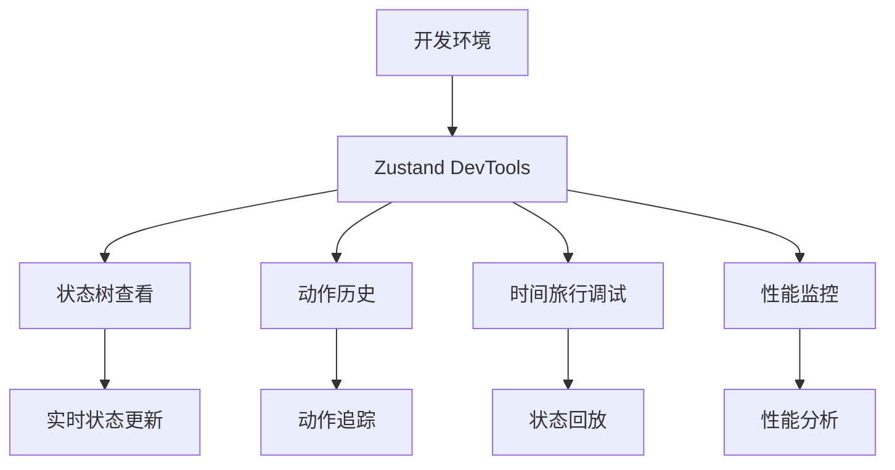

**图表来源**
- [frontend/src/lib/stores/CLAUDE.md](file://frontend/src/lib/stores/CLAUDE.md#L53-L69)

**章节来源**
- [frontend/src/lib/stores/CLAUDE.md](file://frontend/src/lib/stores/CLAUDE.md#L53-L69)

## 结论

Open Notebook项目中的Zustand状态管理实现了以下关键目标：

### 技术优势

1. **简洁性**：相比Redux等传统方案，Zustand提供了更少的样板代码
2. **类型安全**：完整的TypeScript支持确保编译时类型检查
3. **性能优化**：精确的状态订阅和高效的更新机制
4. **开发体验**：直观的API和强大的调试工具支持

### 最佳实践总结

1. **Store设计原则**：保持Store职责单一，避免过度耦合
2. **持久化策略**：合理使用`partialize`优化存储空间
3. **错误处理**：完善的错误边界和降级策略
4. **性能监控**：定期审查状态更新频率和组件渲染次数

### 扩展建议

1. **模块化组织**：随着功能增长，考虑进一步细分Store模块
2. **测试覆盖**：增加Store单元测试和集成测试
3. **文档完善**：为复杂Store添加详细的使用文档
4. **性能基准**：建立性能测试基准以监控优化效果

通过合理的架构设计和最佳实践的应用，Zustand为Open Notebook提供了稳定、高效且易于维护的状态管理解决方案。

## 附录

### API参考

#### 主题Store API

| 方法 | 参数 | 返回值 | 描述 |
|------|------|--------|------|
| useThemeStore | - | ThemeState | 创建主题Store实例 |
| useTheme | - | ThemeHook | 获取主题钩子函数 |
| setTheme | theme: Theme | void | 设置新主题 |
| getSystemTheme | - | 'light'\|'dark' | 获取系统主题 |
| getEffectiveTheme | - | 'light'\|'dark' | 获取生效主题 |

#### 认证Store API

| 方法 | 参数 | 返回值 | 描述 |
|------|------|--------|------|
| useAuthStore | - | AuthState | 创建认证Store实例 |
| checkAuthRequired | - | Promise<boolean> | 检查是否需要认证 |
| login | password: string | Promise<boolean> | 用户登录 |
| logout | - | void | 用户登出 |
| checkAuth | - | Promise<boolean> | 验证当前认证状态 |

**章节来源**
- [frontend/src/lib/stores/theme-store.ts](file://frontend/src/lib/stores/theme-store.ts#L6-L11)
- [frontend/src/lib/stores/auth-store.ts](file://frontend/src/lib/stores/auth-store.ts#L5-L19)