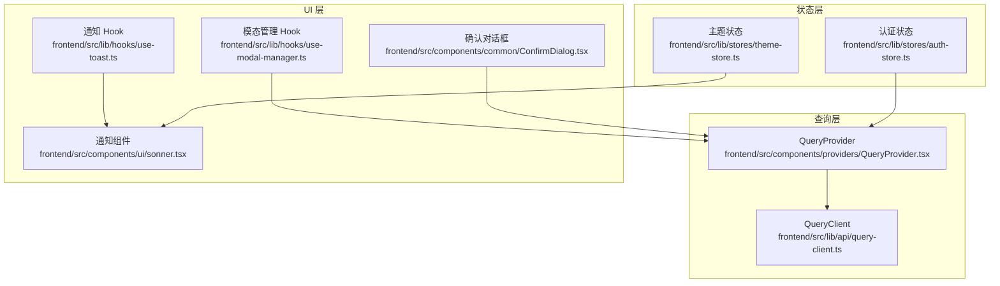
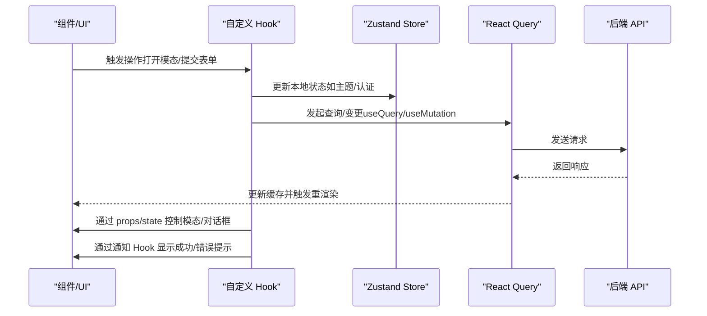
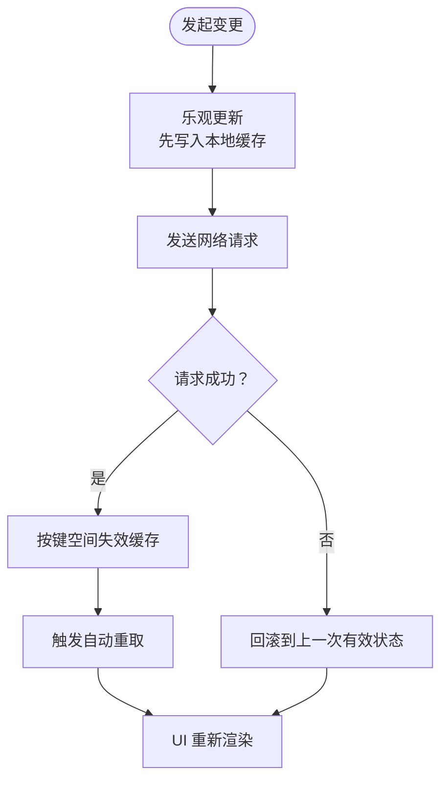
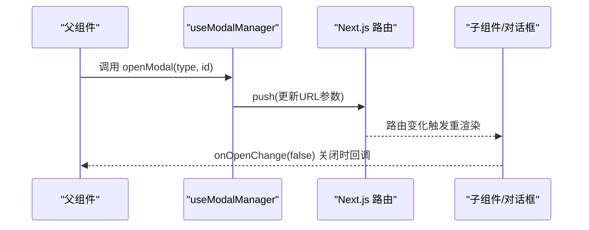
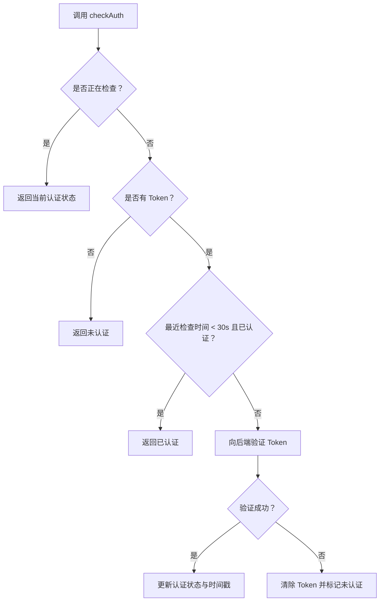
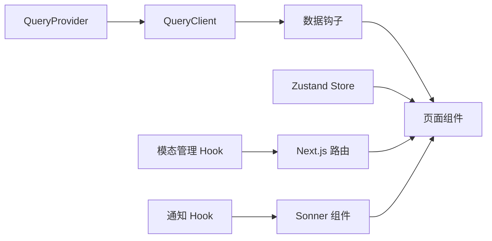

# 状态同步与通信

<cite>
**本文引用的文件**
- [frontend/src/lib/api/query-client.ts](file://frontend/src/lib/api/query-client.ts)
- [frontend/src/components/providers/QueryProvider.tsx](file://frontend/src/components/providers/QueryProvider.tsx)
- [frontend/src/lib/hooks/use-modal-manager.ts](file://frontend/src/lib/hooks/use-modal-manager.ts)
- [frontend/src/components/common/ConfirmDialog.tsx](file://frontend/src/components/common/ConfirmDialog.tsx)
- [frontend/src/lib/hooks/use-toast.ts](file://frontend/src/lib/hooks/use-toast.ts)
- [frontend/src/components/ui/sonner.tsx](file://frontend/src/components/ui/sonner.tsx)
- [frontend/src/lib/stores/theme-store.ts](file://frontend/src/lib/stores/theme-store.ts)
- [frontend/src/lib/stores/auth-store.ts](file://frontend/src/lib/stores/auth-store.ts)
- [frontend/src/lib/hooks/CLAUDE.md](file://frontend/src/lib/hooks/CLAUDE.md)
- [frontend/src/CLAUDE.md](file://frontend/src/CLAUDE.md)
- [frontend/src/components/sources/SourceCard.tsx](file://frontend/src/components/sources/SourceCard.tsx)
- [frontend/src/components/common/ConnectionGuard.tsx](file://frontend/src/components/common/ConnectionGuard.tsx)
- [frontend/src/lib/config.ts](file://frontend/src/lib/config.ts)
</cite>

## 目录
1. [引言](#引言)
2. [项目结构](#项目结构)
3. [核心组件](#核心组件)
4. [架构总览](#架构总览)
5. [详细组件分析](#详细组件分析)
6. [依赖关系分析](#依赖关系分析)
7. [性能考量](#性能考量)
8. [故障排查指南](#故障排查指南)
9. [结论](#结论)
10. [附录](#附录)

## 引言
本文件系统化梳理 Open Notebook 前端的状态同步与组件通信机制，重点覆盖以下方面：
- React Query 缓存与 Zustand 状态的协同策略
- 组件间通信模式、事件传递与状态广播
- 模态框状态管理、确认对话框与全局通知的状态处理
- 异步状态更新的协调与竞态条件处理
- 跨组件状态共享的最佳实践与性能优化
- 状态一致性保证与数据完整性维护
- 状态回滚、撤销重做与事务性更新的实现思路

## 项目结构
前端采用“查询层（TanStack Query）+ 状态层（Zustand）+ UI 层（组件与对话框）”的分层设计：
- 查询层：通过 QueryClient 提供统一的数据获取与缓存能力，并以 QUERY_KEYS 规范化缓存键空间
- 状态层：使用 Zustand 管理主题、认证等跨页面持久化状态
- UI 层：通过自定义 Hook（如 useModalManager、useToast）与对话框组件（ConfirmDialog）实现交互与状态广播



图表来源
- [frontend/src/lib/api/query-client.ts](file://frontend/src/lib/api/query-client.ts#L1-L35)
- [frontend/src/components/providers/QueryProvider.tsx](file://frontend/src/components/providers/QueryProvider.tsx#L1-L16)
- [frontend/src/lib/stores/theme-store.ts](file://frontend/src/lib/stores/theme-store.ts#L1-L61)
- [frontend/src/lib/stores/auth-store.ts](file://frontend/src/lib/stores/auth-store.ts#L1-L222)
- [frontend/src/lib/hooks/use-modal-manager.ts](file://frontend/src/lib/hooks/use-modal-manager.ts#L1-L47)
- [frontend/src/components/common/ConfirmDialog.tsx](file://frontend/src/components/common/ConfirmDialog.tsx#L1-L50)
- [frontend/src/lib/hooks/use-toast.ts](file://frontend/src/lib/hooks/use-toast.ts#L1-L26)
- [frontend/src/components/ui/sonner.tsx](file://frontend/src/components/ui/sonner.tsx#L1-L30)

章节来源
- [frontend/src/lib/api/query-client.ts](file://frontend/src/lib/api/query-client.ts#L1-L35)
- [frontend/src/components/providers/QueryProvider.tsx](file://frontend/src/components/providers/QueryProvider.tsx#L1-L16)

## 核心组件
- QueryClient 与 QUERY_KEYS：统一的缓存与失效策略，支持按实体粒度与层级化键空间管理
- Zustand 主题与认证 Store：提供持久化、即时主题切换与认证状态检查/登录/登出
- 模态管理 Hook：基于 URL 参数驱动的模态状态，避免全局状态污染
- 确认对话框组件：集中处理用户确认与加载状态反馈
- 通知系统：基于 Sonner 的全局提示，结合翻译 Hook 实现本地化标题/描述

章节来源
- [frontend/src/lib/hooks/CLAUDE.md](file://frontend/src/lib/hooks/CLAUDE.md#L15-L40)
- [frontend/src/CLAUDE.md](file://frontend/src/CLAUDE.md#L70-L95)

## 架构总览
整体状态流由“查询层 → 状态层 → UI 层”构成，同时通过 URL 参数与通知实现跨组件广播与一致性：



图表来源
- [frontend/src/lib/api/query-client.ts](file://frontend/src/lib/api/query-client.ts#L1-L35)
- [frontend/src/lib/stores/theme-store.ts](file://frontend/src/lib/stores/theme-store.ts#L1-L61)
- [frontend/src/lib/stores/auth-store.ts](file://frontend/src/lib/stores/auth-store.ts#L1-L222)
- [frontend/src/lib/hooks/use-modal-manager.ts](file://frontend/src/lib/hooks/use-modal-manager.ts#L1-L47)
- [frontend/src/lib/hooks/use-toast.ts](file://frontend/src/lib/hooks/use-toast.ts#L1-L26)

## 详细组件分析

### React Query 缓存与 Zustand 同步策略
- 缓存键规范化：QUERY_KEYS 为每个实体提供层级化键空间，确保精确失效与自动刷新
- 默认配置：查询缓存时间、垃圾回收时间、窗口焦点重取策略、重试次数等在 QueryClient 中集中管理
- 乐观更新与失效策略：Mutation 成功后进行定向或广域缓存失效，确保 UI 与服务端一致
- 自动刷新：对频繁变化的数据启用窗口焦点重取；对长耗时任务采用轮询 Hook（如源状态）



图表来源
- [frontend/src/lib/hooks/CLAUDE.md](file://frontend/src/lib/hooks/CLAUDE.md#L15-L40)
- [frontend/src/lib/api/query-client.ts](file://frontend/src/lib/api/query-client.ts#L1-L35)

章节来源
- [frontend/src/lib/api/query-client.ts](file://frontend/src/lib/api/query-client.ts#L1-L35)
- [frontend/src/lib/hooks/CLAUDE.md](file://frontend/src/lib/hooks/CLAUDE.md#L15-L40)

### 组件间通信与状态广播
- URL 参数驱动的模态广播：useModalManager 通过 URL 的 modal/id 参数读取/写入当前模态状态，避免全局状态耦合
- 对话框与确认流程：ConfirmDialog 接收外部 open/onOpenChange 控制器，内部仅负责渲染与交互，实现“受控组件”的广播式状态传播
- 通知广播：useToast 将标题/描述与变体传给 Sonner 组件，实现全局可见的反馈



图表来源
- [frontend/src/lib/hooks/use-modal-manager.ts](file://frontend/src/lib/hooks/use-modal-manager.ts#L1-L47)
- [frontend/src/components/common/ConfirmDialog.tsx](file://frontend/src/components/common/ConfirmDialog.tsx#L1-L50)

章节来源
- [frontend/src/lib/hooks/use-modal-manager.ts](file://frontend/src/lib/hooks/use-modal-manager.ts#L1-L47)
- [frontend/src/components/common/ConfirmDialog.tsx](file://frontend/src/components/common/ConfirmDialog.tsx#L1-L50)

### 模态框状态管理、确认对话框与全局通知
- 模态框状态：通过 URL 参数保持可分享、可回溯；关闭时清理参数，避免历史堆叠
- 确认对话框：支持自定义标题/描述/按钮文本与加载态禁用，集中处理用户确认与取消
- 全局通知：useToast 将本地化文案与变体传递给 Sonner，主题状态通过主题 Store 即时应用到 DOM

```mermaid
classDiagram
class ThemeStore {
+theme
+setTheme(theme)
+getSystemTheme()
+getEffectiveTheme()
}
class AuthStore {
+isAuthenticated
+login(password)
+logout()
+checkAuth()
}
class ModalManager {
+modalType
+modalId
+openModal(type, id)
+closeModal()
+isOpen
}
class ToastHook {
+toast({title, description, variant})
}
ThemeStore <.. ToastHook : "主题影响通知样式"
ModalManager ..> UI : "URL 广播状态"
AuthStore ..> UI : "认证状态影响可用性"
```

图表来源
- [frontend/src/lib/stores/theme-store.ts](file://frontend/src/lib/stores/theme-store.ts#L1-L61)
- [frontend/src/lib/stores/auth-store.ts](file://frontend/src/lib/stores/auth-store.ts#L1-L222)
- [frontend/src/lib/hooks/use-modal-manager.ts](file://frontend/src/lib/hooks/use-modal-manager.ts#L1-L47)
- [frontend/src/lib/hooks/use-toast.ts](file://frontend/src/lib/hooks/use-toast.ts#L1-L26)

章节来源
- [frontend/src/lib/stores/theme-store.ts](file://frontend/src/lib/stores/theme-store.ts#L1-L61)
- [frontend/src/lib/stores/auth-store.ts](file://frontend/src/lib/stores/auth-store.ts#L1-L222)
- [frontend/src/lib/hooks/use-toast.ts](file://frontend/src/lib/hooks/use-toast.ts#L1-L26)
- [frontend/src/components/ui/sonner.tsx](file://frontend/src/components/ui/sonner.tsx#L1-L30)

### 异步状态更新的协调与竞态条件处理
- 认证状态检查防抖：在短时间内重复调用 checkAuth 会复用上次结果，避免并发请求风暴
- 源状态轮询：根据状态值动态启停轮询，完成/失败后停止轮询并触发刷新
- 连接守护：ConnectionGuard 在挂载时检测 API 可达性，错误时提供重试与键盘快捷键



图表来源
- [frontend/src/lib/stores/auth-store.ts](file://frontend/src/lib/stores/auth-store.ts#L150-L209)
- [frontend/src/components/sources/SourceCard.tsx](file://frontend/src/components/sources/SourceCard.tsx#L130-L164)
- [frontend/src/components/common/ConnectionGuard.tsx](file://frontend/src/components/common/ConnectionGuard.tsx#L41-L87)

章节来源
- [frontend/src/lib/stores/auth-store.ts](file://frontend/src/lib/stores/auth-store.ts#L150-L209)
- [frontend/src/components/sources/SourceCard.tsx](file://frontend/src/components/sources/SourceCard.tsx#L130-L164)
- [frontend/src/components/common/ConnectionGuard.tsx](file://frontend/src/components/common/ConnectionGuard.tsx#L41-L87)

### 跨组件状态共享的最佳实践
- 使用 QueryClient 管理远端状态，Zustand 管理本地 UI/主题/认证等轻量状态
- 通过 URL 参数广播模态状态，避免全局状态树膨胀
- 使用受控对话框组件，配合 useToast 提供一致的用户反馈
- 对高频变更数据启用窗口焦点重取，对长耗时任务采用轮询 Hook

章节来源
- [frontend/src/lib/hooks/CLAUDE.md](file://frontend/src/lib/hooks/CLAUDE.md#L15-L40)
- [frontend/src/CLAUDE.md](file://frontend/src/CLAUDE.md#L70-L95)

### 性能优化建议
- 合理设置 staleTime/gcTime，减少不必要的网络请求
- Mutation 成功后进行最小化失效范围，避免全量重取
- 对于频繁轮询的任务，根据状态变化动态启停，降低资源消耗
- 使用持久化 Zustand Store 时，仅保存必要字段，减少序列化开销

章节来源
- [frontend/src/lib/api/query-client.ts](file://frontend/src/lib/api/query-client.ts#L3-L15)
- [frontend/src/lib/stores/theme-store.ts](file://frontend/src/lib/stores/theme-store.ts#L44-L49)

### 状态一致性与数据完整性
- 乐观更新 + 失效策略：Mutation 成功后立即更新本地缓存，失败时回滚，确保 UI 与服务端最终一致
- 错误边界与连接守护：ConnectionGuard 与 ErrorBoundary 配合，保障异常场景下的用户体验
- 配置缓存与重置：getApiUrl/resetConfig 提供运行时配置获取与缓存重置能力

章节来源
- [frontend/src/lib/hooks/CLAUDE.md](file://frontend/src/lib/hooks/CLAUDE.md#L15-L40)
- [frontend/src/components/common/ConnectionGuard.tsx](file://frontend/src/components/common/ConnectionGuard.tsx#L41-L87)
- [frontend/src/lib/config.ts](file://frontend/src/lib/config.ts#L110-L148)

### 回滚、撤销重做与事务性更新
- 回滚与重做：通过 Mutation 的 onError 回滚与 useQuery 的 refetch 实现撤销/重做
- 事务性更新：在单次 Mutation 中聚合多个变更，失败时整体回滚；对多步操作使用队列化处理
- 竞态控制：在认证与轮询场景中使用状态锁与时间戳，避免并发冲突

章节来源
- [frontend/src/lib/hooks/CLAUDE.md](file://frontend/src/lib/hooks/CLAUDE.md#L123-L134)
- [frontend/src/lib/stores/auth-store.ts](file://frontend/src/lib/stores/auth-store.ts#L150-L209)

## 依赖关系分析
- QueryProvider 作为根 Provider 注入 QueryClient，所有页面级 Hook 依赖其提供的缓存上下文
- Zustand Store 与 UI 组件解耦，通过 Hook 暴露状态与动作，避免直接依赖
- 模态管理与通知系统通过 URL 与全局组件实现跨组件广播



图表来源
- [frontend/src/components/providers/QueryProvider.tsx](file://frontend/src/components/providers/QueryProvider.tsx#L1-L16)
- [frontend/src/lib/api/query-client.ts](file://frontend/src/lib/api/query-client.ts#L1-L35)
- [frontend/src/lib/hooks/use-modal-manager.ts](file://frontend/src/lib/hooks/use-modal-manager.ts#L1-L47)
- [frontend/src/lib/hooks/use-toast.ts](file://frontend/src/lib/hooks/use-toast.ts#L1-L26)
- [frontend/src/components/ui/sonner.tsx](file://frontend/src/components/ui/sonner.tsx#L1-L30)

章节来源
- [frontend/src/components/providers/QueryProvider.tsx](file://frontend/src/components/providers/QueryProvider.tsx#L1-L16)
- [frontend/src/lib/api/query-client.ts](file://frontend/src/lib/api/query-client.ts#L1-L35)

## 性能考量
- 查询缓存策略：合理设置 staleTime/gcTime，避免过度请求或陈旧数据
- 失效范围：Mutation 成功后进行最小化失效，减少全量重取
- 轮询优化：根据状态动态启停，完成即停，降低 CPU/网络占用
- 持久化存储：Zustand 持久化仅保存必要字段，减少序列化与 IO 开销

## 故障排查指南
- 认证失败：检查登录流程中的错误分支与错误消息映射，确认网络可达性与令牌有效性
- 模态无法关闭：确认 URL 参数是否正确清理，路由 push 是否被调用
- 通知不显示：检查 useToast 的变体与 Sonner 主题配置，确认主题 Store 的生效逻辑
- 数据不刷新：确认 Mutation 是否执行了正确的失效键，以及窗口焦点重取是否开启

章节来源
- [frontend/src/lib/stores/auth-store.ts](file://frontend/src/lib/stores/auth-store.ts#L77-L140)
- [frontend/src/lib/hooks/use-modal-manager.ts](file://frontend/src/lib/hooks/use-modal-manager.ts#L21-L37)
- [frontend/src/lib/hooks/use-toast.ts](file://frontend/src/lib/hooks/use-toast.ts#L14-L24)
- [frontend/src/lib/hooks/CLAUDE.md](file://frontend/src/lib/hooks/CLAUDE.md#L17-L21)

## 结论
Open Notebook 的状态体系通过“查询层 + 状态层 + UI 层”的清晰分工，实现了高内聚、低耦合的状态管理与组件通信。React Query 与 Zustand 的协同使用，既保证了远端数据的一致性与性能，又满足了本地 UI 状态的即时反馈。通过 URL 广播、受控对话框与全局通知，系统在复杂交互场景下仍能保持良好的用户体验与可维护性。

## 附录
- 示例流程参考：Notebook Chat 与文件上传创建 Source 的完整数据与控制流
- 最佳实践参考：数据钩子的新增规范与缓存失效策略

章节来源
- [frontend/src/CLAUDE.md](file://frontend/src/CLAUDE.md#L70-L95)
- [frontend/src/lib/hooks/CLAUDE.md](file://frontend/src/lib/hooks/CLAUDE.md#L35-L40)