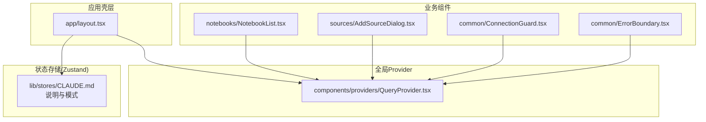
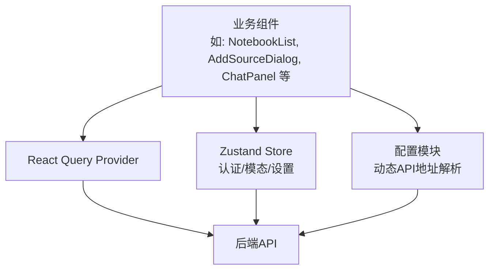
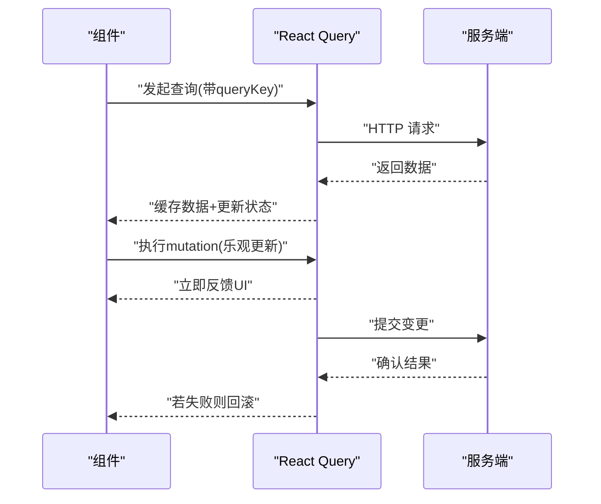
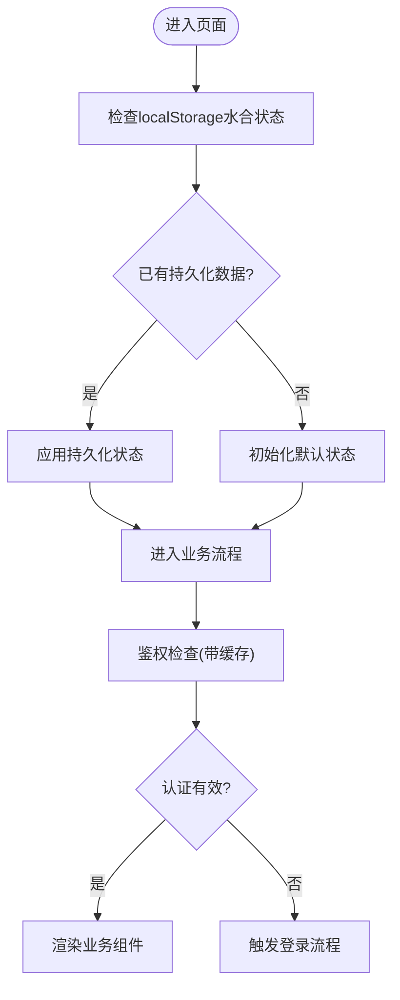
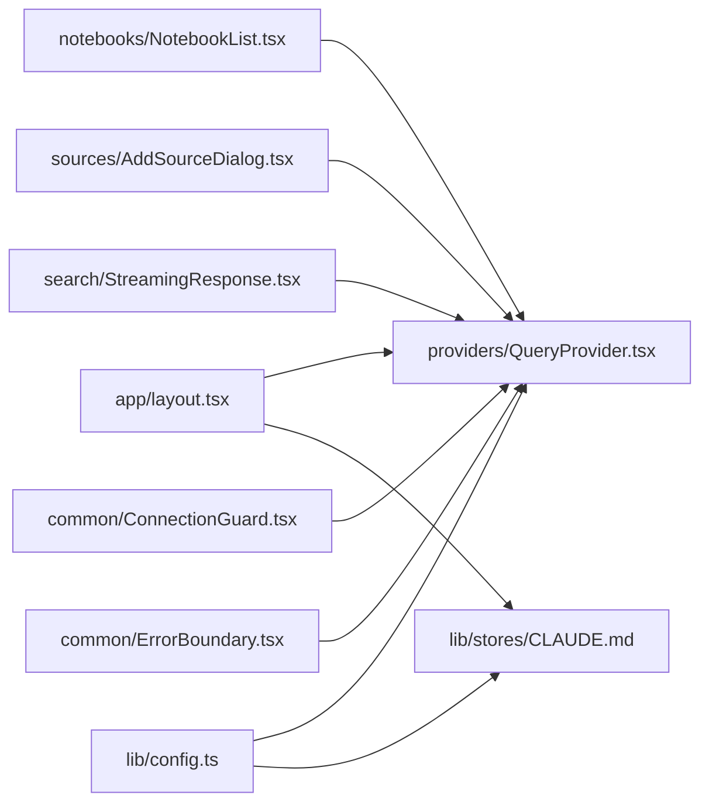

# 状态管理

<cite>
**本文引用的文件**
- [frontend/src/components/providers/QueryProvider.tsx](file://frontend/src/components/providers/QueryProvider.tsx)
- [frontend/src/lib/stores/CLAUDE.md](file://frontend/src/lib/stores/CLAUDE.md)
- [frontend/src/lib/config.ts](file://frontend/src/lib/config.ts)
- [frontend/src/app/layout.tsx](file://frontend/src/app/layout.tsx)
- [frontend/src/components/common/ErrorBoundary.tsx](file://frontend/src/components/common/ErrorBoundary.tsx)
- [frontend/src/components/common/ConnectionGuard.tsx](file://frontend/src/components/common/ConnectionGuard.tsx)
- [frontend/src/components/sources/AddSourceDialog.tsx](file://frontend/src/components/sources/AddSourceDialog.tsx)
- [frontend/src/components/notebooks/components/NotebookList.tsx](file://frontend/src/components/notebooks/components/NotebookList.tsx)
- [frontend/src/components/search/StreamingResponse.tsx](file://frontend/src/components/search/StreamingResponse.tsx)
- [frontend/src/components/source/ChatPanel.tsx](file://frontend/src/components/source/ChatPanel.tsx)
- [frontend/src/components/podcasts/GeneratePodcastDialog.tsx](file://frontend/src/components/podcasts/GeneratePodcastDialog.tsx)
- [frontend/src/components/settings/EmbeddingModelChangeDialog.tsx](file://frontend/src/components/settings/EmbeddingModelChangeDialog.tsx)
</cite>

## 目录
1. [简介](#简介)
2. [项目结构](#项目结构)
3. [核心组件](#核心组件)
4. [架构总览](#架构总览)
5. [详细组件分析](#详细组件分析)
6. [依赖关系分析](#依赖关系分析)
7. [性能考虑](#性能考虑)
8. [故障排查指南](#故障排查指南)
9. [结论](#结论)
10. [附录](#附录)

## 简介
本文件系统性梳理 Open Notebook 前端的状态管理策略与架构设计，重点覆盖以下方面：
- React Query 的状态缓存、数据同步与乐观更新实践
- 自定义 Hook 的设计模式与使用规范
- Zustand 状态管理的实现与组件间通信
- 状态持久化、错误处理与加载状态管理
- 最佳实践与性能优化建议

## 项目结构
前端采用分层组织：应用壳层（App Shell）在布局中注入全局 Provider；状态管理分为两类：
- React Query：用于远程数据请求与缓存
- Zustand：用于认证、模态框与应用级设置等轻量状态

图表来源
- [frontend/src/app/layout.tsx](file://frontend/src/app/layout.tsx)
- [frontend/src/components/providers/QueryProvider.tsx](file://frontend/src/components/providers/QueryProvider.tsx)
- [frontend/src/lib/stores/CLAUDE.md](file://frontend/src/lib/stores/CLAUDE.md)
- [frontend/src/components/notebooks/components/NotebookList.tsx](file://frontend/src/components/notebooks/components/NotebookList.tsx)
- [frontend/src/components/sources/AddSourceDialog.tsx](file://frontend/src/components/sources/AddSourceDialog.tsx)
- [frontend/src/components/common/ConnectionGuard.tsx](file://frontend/src/components/common/ConnectionGuard.tsx)
- [frontend/src/components/common/ErrorBoundary.tsx](file://frontend/src/components/common/ErrorBoundary.tsx)

章节来源
- [frontend/src/app/layout.tsx](file://frontend/src/app/layout.tsx)
- [frontend/src/components/providers/QueryProvider.tsx](file://frontend/src/components/providers/QueryProvider.tsx)
- [frontend/src/lib/stores/CLAUDE.md](file://frontend/src/lib/stores/CLAUDE.md)

## 核心组件
- React Query Provider：在应用壳层注入 QueryClientProvider，为全站提供统一的数据缓存与同步能力
- Zustand Store：集中管理认证、模态框与应用设置等状态，并通过 persist 中间件实现本地持久化
- 配置模块：动态解析 API 地址，支持运行时配置优先、环境变量回退与智能默认值
- 错误与连接守卫：统一处理网络异常与连接失败场景，保障用户体验

章节来源
- [frontend/src/components/providers/QueryProvider.tsx](file://frontend/src/components/providers/QueryProvider.tsx)
- [frontend/src/lib/stores/CLAUDE.md](file://frontend/src/lib/stores/CLAUDE.md)
- [frontend/src/lib/config.ts](file://frontend/src/lib/config.ts)
- [frontend/src/components/common/ErrorBoundary.tsx](file://frontend/src/components/common/ErrorBoundary.tsx)
- [frontend/src/components/common/ConnectionGuard.tsx](file://frontend/src/components/common/ConnectionGuard.tsx)

## 架构总览
下图展示前端状态管理的整体交互：应用壳层注入 Provider，业务组件通过 React Query 发起请求并利用缓存；Zustand 负责轻量状态与持久化；配置模块贯穿于网络请求与 UI 初始化。

图表来源
- [frontend/src/components/providers/QueryProvider.tsx](file://frontend/src/components/providers/QueryProvider.tsx)
- [frontend/src/lib/stores/CLAUDE.md](file://frontend/src/lib/stores/CLAUDE.md)
- [frontend/src/lib/config.ts](file://frontend/src/lib/config.ts)
- [frontend/src/components/notebooks/components/NotebookList.tsx](file://frontend/src/components/notebooks/components/NotebookList.tsx)
- [frontend/src/components/sources/AddSourceDialog.tsx](file://frontend/src/components/sources/AddSourceDialog.tsx)
- [frontend/src/components/source/ChatPanel.tsx](file://frontend/src/components/source/ChatPanel.tsx)

## 详细组件分析

### React Query 状态缓存与数据同步
- 缓存策略
  - 使用 QueryClientProvider 提供统一缓存实例，确保跨组件共享缓存
  - 利用查询键（queryKey）与查询函数（queryFn）组合，保证缓存命中与失效
  - 合理设置 staleTime、gcTime、refetch 策略，平衡实时性与性能
- 数据同步
  - 通过 mutation 与 invalidatesQueries 实现写后读一致性
  - 在编辑、删除、新增等操作后主动失效相关查询，触发自动重取
- 乐观更新
  - 对可预测的写操作采用 optimistic updates，先本地更新 UI，再等待服务端确认
  - 失败时回滚到上一次已知正确状态，保持一致性
- 加载状态管理
  - 使用 isLoading、isFetching、error 等标志位，结合骨架屏与占位符提升感知性能
  - 对长列表与流式响应，采用分页或增量渲染策略

图表来源
- [frontend/src/components/providers/QueryProvider.tsx](file://frontend/src/components/providers/QueryProvider.tsx)
- [frontend/src/components/notebooks/components/NotebookList.tsx](file://frontend/src/components/notebooks/components/NotebookList.tsx)
- [frontend/src/components/sources/AddSourceDialog.tsx](file://frontend/src/components/sources/AddSourceDialog.tsx)
- [frontend/src/components/search/StreamingResponse.tsx](file://frontend/src/components/search/StreamingResponse.tsx)

章节来源
- [frontend/src/components/providers/QueryProvider.tsx](file://frontend/src/components/providers/QueryProvider.tsx)
- [frontend/src/components/notebooks/components/NotebookList.tsx](file://frontend/src/components/notebooks/components/NotebookList.tsx)
- [frontend/src/components/sources/AddSourceDialog.tsx](file://frontend/src/components/sources/AddSourceDialog.tsx)
- [frontend/src/components/search/StreamingResponse.tsx](file://frontend/src/components/search/StreamingResponse.tsx)

### Zustand 状态管理与组件通信
- 设计模式
  - 单一 store + 动作：将状态与动作封装在同一 store 内，便于维护
  - 持久化中间件：通过 persist 与 partialize 控制持久化字段，避免存储敏感或临时状态
  - 水合标记：使用 hasHydrated 标记 localStorage 数据加载完成，避免 SSR 水合不一致
- 组件间通信
  - 认证状态：登录/登出/鉴权检查，配合 API 校验与 401 全局处理
  - 模态框状态：统一管理可见性与传入数据，减少 props 下钻
  - 应用设置：主题、语言、模型选择等，自动持久化并跨页面生效
- 错误与网络韧性
  - 30 秒鉴权缓存，降低频繁校验带来的开销
  - API 不可达时的优雅降级与提示

图表来源
- [frontend/src/lib/stores/CLAUDE.md](file://frontend/src/lib/stores/CLAUDE.md)

章节来源
- [frontend/src/lib/stores/CLAUDE.md](file://frontend/src/lib/stores/CLAUDE.md)

### 自定义 Hook 设计模式与使用规范
- 查询 Hook
  - 将 queryKey 与 queryFn 封装为独立 Hook，便于复用与测试
  - 在 Hook 内部处理错误与加载状态，暴露简洁的返回值给组件
- 变更 Hook
  - 将 mutation 与 invalidation 封装为 Hook，统一处理乐观更新与回滚
  - 返回 loading、error、mutate 等接口，简化组件调用
- 组合 Hook
  - 将多个查询/变更 Hook 组合为领域级 Hook（如“笔记本域”），提升内聚性
- 规范
  - 所有查询键以稳定字符串开头，避免重复与冲突
  - 仅在必要时使用 refetch，优先使用 invalidatesQueries 与背景刷新
  - 对复杂表单与多步流程，使用局部状态与临时缓存，避免污染全局缓存

章节来源
- [frontend/src/components/sources/AddSourceDialog.tsx](file://frontend/src/components/sources/AddSourceDialog.tsx)
- [frontend/src/components/notebooks/components/NotebookList.tsx](file://frontend/src/components/notebooks/components/NotebookList.tsx)
- [frontend/src/components/source/ChatPanel.tsx](file://frontend/src/components/source/ChatPanel.tsx)

### 状态持久化、错误处理与加载状态管理
- 持久化
  - 仅持久化必要字段（如 token、isAuthenticated、主题、语言），避免存储大对象
  - 使用 partialize 过滤敏感信息，确保安全
- 错误处理
  - ErrorBoundary 捕获渲染错误，提供降级 UI
  - ConnectionGuard 监测连接状态，统一展示网络问题
  - API 层统一拦截 401，触发认证流程或提示
- 加载状态
  - 使用 isLoading/isFetching 区分首次加载与后台刷新
  - 对长任务与流式响应，提供进度条与分段渲染

章节来源
- [frontend/src/components/common/ErrorBoundary.tsx](file://frontend/src/components/common/ErrorBoundary.tsx)
- [frontend/src/components/common/ConnectionGuard.tsx](file://frontend/src/components/common/ConnectionGuard.tsx)
- [frontend/src/lib/stores/CLAUDE.md](file://frontend/src/lib/stores/CLAUDE.md)

### 业务场景中的状态管理实践
- 笔记本列表：使用查询 Hook 获取笔记本列表，支持刷新与搜索过滤；新增/删除后失效相关查询并刷新
- 添加来源对话框：表单输入使用局部状态，提交使用 mutation 并乐观更新；失败时回滚
- 流式响应：在搜索与聊天中采用流式渲染，结合 React Suspense 与骨架屏提升体验
- 播客生成：多步骤向导使用局部状态与临时缓存，最终提交时统一写入后失效相关查询

章节来源
- [frontend/src/components/notebooks/components/NotebookList.tsx](file://frontend/src/components/notebooks/components/NotebookList.tsx)
- [frontend/src/components/sources/AddSourceDialog.tsx](file://frontend/src/components/sources/AddSourceDialog.tsx)
- [frontend/src/components/search/StreamingResponse.tsx](file://frontend/src/components/search/StreamingResponse.tsx)
- [frontend/src/components/podcasts/GeneratePodcastDialog.tsx](file://frontend/src/components/podcasts/GeneratePodcastDialog.tsx)

## 依赖关系分析
- 应用壳层依赖 Provider 注入，确保全局可用
- 业务组件依赖 Query 与 Zustand，形成清晰的分层
- 配置模块贯穿网络层，影响所有外部请求

图表来源
- [frontend/src/app/layout.tsx](file://frontend/src/app/layout.tsx)
- [frontend/src/components/providers/QueryProvider.tsx](file://frontend/src/components/providers/QueryProvider.tsx)
- [frontend/src/lib/stores/CLAUDE.md](file://frontend/src/lib/stores/CLAUDE.md)
- [frontend/src/lib/config.ts](file://frontend/src/lib/config.ts)
- [frontend/src/components/notebooks/components/NotebookList.tsx](file://frontend/src/components/notebooks/components/NotebookList.tsx)
- [frontend/src/components/sources/AddSourceDialog.tsx](file://frontend/src/components/sources/AddSourceDialog.tsx)
- [frontend/src/components/search/StreamingResponse.tsx](file://frontend/src/components/search/StreamingResponse.tsx)
- [frontend/src/components/common/ConnectionGuard.tsx](file://frontend/src/components/common/ConnectionGuard.tsx)
- [frontend/src/components/common/ErrorBoundary.tsx](file://frontend/src/components/common/ErrorBoundary.tsx)

章节来源
- [frontend/src/app/layout.tsx](file://frontend/src/app/layout.tsx)
- [frontend/src/components/providers/QueryProvider.tsx](file://frontend/src/components/providers/QueryProvider.tsx)
- [frontend/src/lib/stores/CLAUDE.md](file://frontend/src/lib/stores/CLAUDE.md)
- [frontend/src/lib/config.ts](file://frontend/src/lib/config.ts)

## 性能考虑
- 缓存策略
  - 为高频访问数据设置合理的 staleTime 与 gcTime，避免过度请求
  - 对只读列表启用 background refetch，保持数据新鲜度
- 乐观更新
  - 对可快速确认的操作采用乐观更新，显著缩短用户感知延迟
- 分页与增量
  - 列表采用分页或无限滚动，避免一次性渲染大量节点
  - 流式响应按块渲染，减少首屏阻塞
- 网络韧性
  - 重试与退避策略，避免雪崩效应
  - 离线兜底：在网络不可用时提供本地可用内容与提示

## 故障排查指南
- 网络连接问题
  - 使用 ConnectionGuard 检查 API 可达性与版本状态
  - 若返回 401，触发认证流程或提示重新登录
- 缓存不一致
  - 确认 mutation 是否正确 invalidatesQueries
  - 检查 queryKey 是否稳定且唯一
- 持久化异常
  - 检查 persist 配置与 partialize 过滤规则
  - 清理 localStorage 后重启应用，验证是否恢复
- 错误边界
  - ErrorBoundary 捕获渲染错误，记录日志并提供降级 UI

章节来源
- [frontend/src/components/common/ConnectionGuard.tsx](file://frontend/src/components/common/ConnectionGuard.tsx)
- [frontend/src/components/common/ErrorBoundary.tsx](file://frontend/src/components/common/ErrorBoundary.tsx)
- [frontend/src/lib/stores/CLAUDE.md](file://frontend/src/lib/stores/CLAUDE.md)

## 结论
本项目采用 React Query 与 Zustand 双轨并行的状态管理方案：前者专注远程数据缓存与同步，后者负责轻量应用状态与持久化。通过统一的 Provider 注入、严谨的查询键设计、乐观更新与错误处理机制，实现了高性能、可维护且用户体验友好的前端状态体系。建议在后续迭代中持续完善 Hook 抽象与缓存策略，进一步提升可测试性与可扩展性。

## 附录
- 最佳实践清单
  - 为每个查询定义稳定且语义化的 queryKey
  - 优先使用 invalidatesQueries 而非手动 refetch
  - 对写操作使用 optimistic updates 并准备回滚逻辑
  - 仅持久化必要字段，避免存储临时或大体量数据
  - 使用 ErrorBoundary 与 ConnectionGuard 提升健壮性
- 性能优化建议
  - 合理设置 staleTime/gcTime，避免过度请求
  - 对长列表与流式响应采用分页/增量渲染
  - 使用 Suspense 与骨架屏改善感知性能
  - 在高并发场景引入重试与退避策略