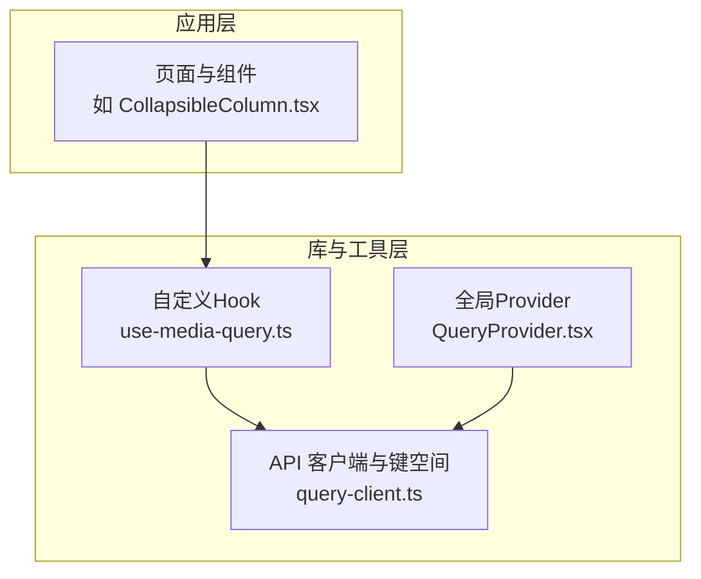
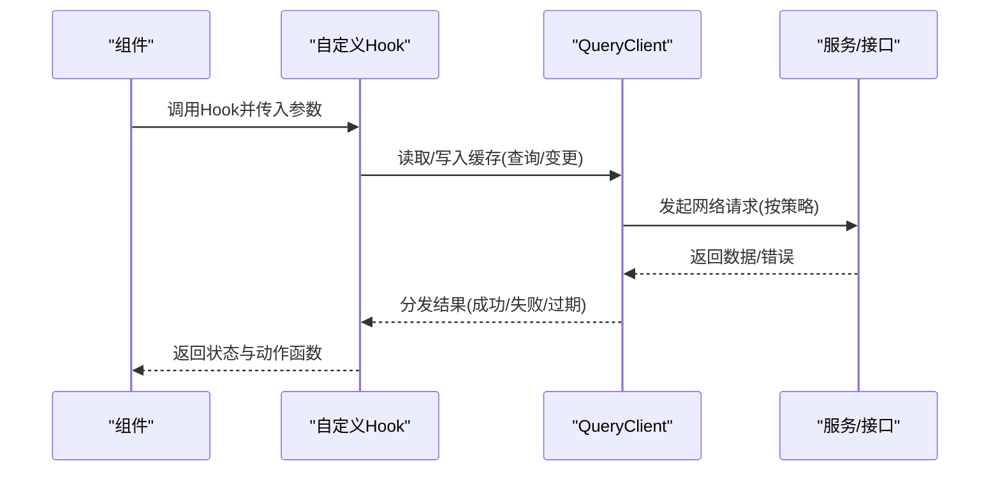
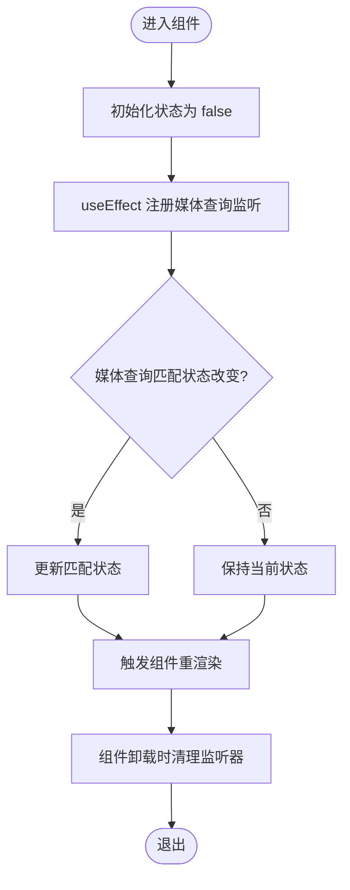
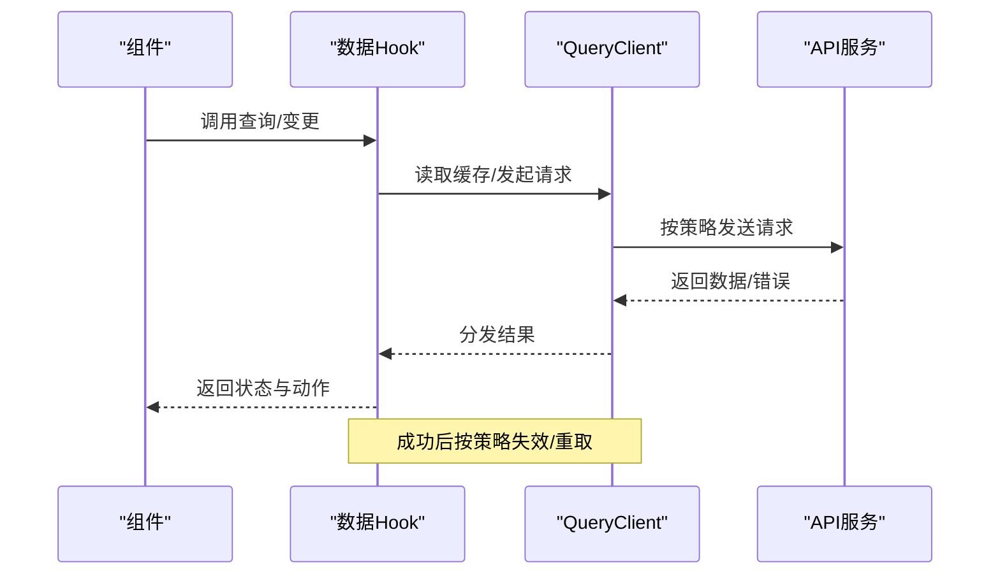
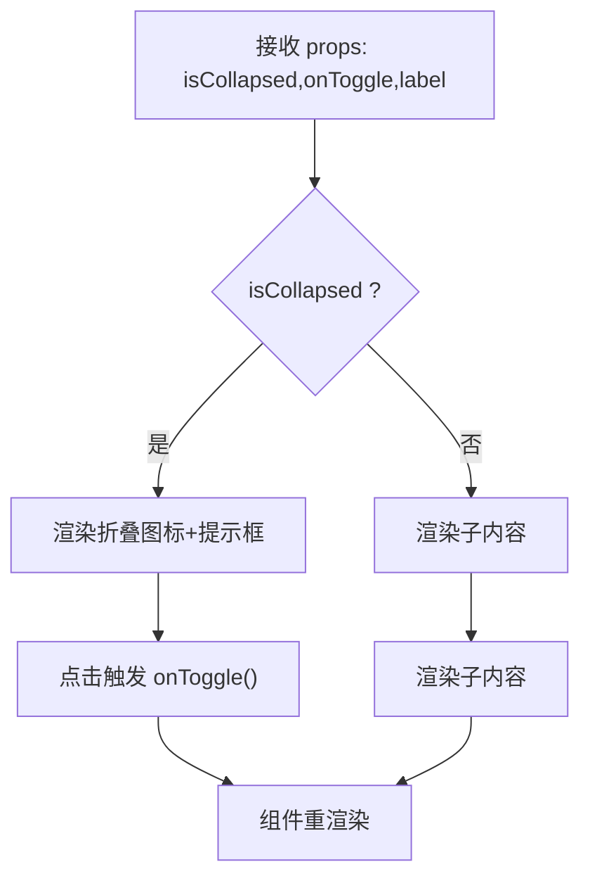
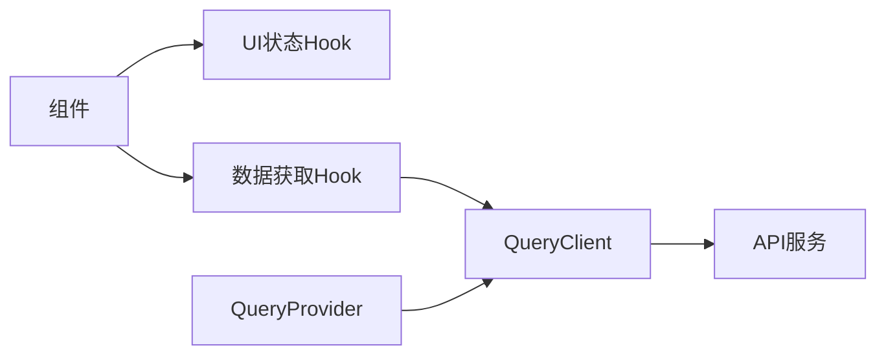

# 自定义Hook设计

<cite>
**本文引用的文件**
- [frontend/src/lib/hooks/use-media-query.ts](file://frontend/src/lib/hooks/use-media-query.ts)
- [frontend/src/lib/api/query-client.ts](file://frontend/src/lib/api/query-client.ts)
- [frontend/src/components/providers/QueryProvider.tsx](file://frontend/src/components/providers/QueryProvider.tsx)
- [frontend/src/lib/hooks/CLAUDE.md](file://frontend/src/lib/hooks/CLAUDE.md)
- [frontend/src/components/notebooks/CollapsibleColumn.tsx](file://frontend/src/components/notebooks/CollapsibleColumn.tsx)
</cite>

## 目录
1. [引言](#引言)
2. [项目结构](#项目结构)
3. [核心组件](#核心组件)
4. [架构总览](#架构总览)
5. [详细组件分析](#详细组件分析)
6. [依赖分析](#依赖分析)
7. [性能考虑](#性能考虑)
8. [故障排查指南](#故障排查指南)
9. [结论](#结论)
10. [附录](#附录)

## 引言
本文件系统化阐述 Open Notebook 前端中“自定义Hook”的设计与实现，聚焦以下主题：
- 设计原则：可复用、可组合、副作用最小化、状态收敛与集中管理
- 架构模式：基于 TanStack Query 的数据获取Hook、表单处理Hook、UI状态Hook三类模式
- 复用性设计：通过工厂函数、返回对象形态、参数化配置提升复用度
- 依赖注入与副作用管理：QueryProvider 注入 QueryClient，事件监听与清理、SSR 安全
- 错误处理、加载状态与空值检查的通用模式
- 实际示例：以媒体查询 Hook 为例展示复杂业务逻辑的状态封装
- 测试策略与单元测试编写方法
- 性能优化技巧与避免重复渲染的方法
- Hook 组合模式与依赖关系管理

## 项目结构
Open Notebook 前端采用 Next.js App Router 结构，自定义 Hook 主要位于 lib 目录下，配合 API 层与 Provider 提供全局状态与缓存能力。

图表来源
- [frontend/src/components/notebooks/CollapsibleColumn.tsx](file://frontend/src/components/notebooks/CollapsibleColumn.tsx#L1-L94)
- [frontend/src/lib/hooks/use-media-query.ts](file://frontend/src/lib/hooks/use-media-query.ts#L1-L33)
- [frontend/src/lib/api/query-client.ts](file://frontend/src/lib/api/query-client.ts#L1-L35)
- [frontend/src/components/providers/QueryProvider.tsx](file://frontend/src/components/providers/QueryProvider.tsx#L1-L16)

章节来源
- [frontend/src/lib/hooks/CLAUDE.md](file://frontend/src/lib/hooks/CLAUDE.md#L15-L40)
- [frontend/src/lib/api/query-client.ts](file://frontend/src/lib/api/query-client.ts#L1-L35)
- [frontend/src/components/providers/QueryProvider.tsx](file://frontend/src/components/providers/QueryProvider.tsx#L1-L16)

## 核心组件
- 媒体查询检测 Hook（UI 状态类）
  - 功能：在浏览器端检测视口是否匹配指定媒体查询；SSR 下返回默认值避免水合不一致
  - 关键点：useEffect 中注册/移除监听器；返回布尔值表示匹配状态
  - 参考路径：[frontend/src/lib/hooks/use-media-query.ts](file://frontend/src/lib/hooks/use-media-query.ts#L1-L33)

- 查询客户端与键空间（数据获取类）
  - 功能：统一配置 QueryClient 默认行为（过期时间、GC 时间、重试次数等）；定义 QUERY_KEYS 作为缓存键空间
  - 关键点：queries 与 mutations 的默认策略；键空间函数化，便于精确失效
  - 参考路径：[frontend/src/lib/api/query-client.ts](file://frontend/src/lib/api/query-client.ts#L1-L35)

- QueryProvider（依赖注入）
  - 功能：将 QueryClient 注入到应用树，使所有数据 Hook 获得统一的缓存与刷新能力
  - 参考路径：[frontend/src/components/providers/QueryProvider.tsx](file://frontend/src/components/providers/QueryProvider.tsx#L1-L16)

章节来源
- [frontend/src/lib/hooks/use-media-query.ts](file://frontend/src/lib/hooks/use-media-query.ts#L1-L33)
- [frontend/src/lib/api/query-client.ts](file://frontend/src/lib/api/query-client.ts#L1-L35)
- [frontend/src/components/providers/QueryProvider.tsx](file://frontend/src/components/providers/QueryProvider.tsx#L1-L16)

## 架构总览
Open Notebook 的自定义 Hook 遵循“分层职责”与“集中治理”：
- UI 状态 Hook：负责轻量、与 DOM/窗口事件强相关的状态（如媒体查询、滚动位置、尺寸变化）
- 数据获取 Hook：基于 TanStack Query，封装查询、变更、缓存与失效策略
- 表单处理 Hook：封装表单状态、校验、提交与反馈，返回状态与动作函数
- 依赖注入：通过 QueryProvider 注入 QueryClient，确保全局一致性
- 副作用管理：在 useEffect 中注册/清理事件监听；SSR 安全处理

图表来源
- [frontend/src/lib/api/query-client.ts](file://frontend/src/lib/api/query-client.ts#L1-L35)
- [frontend/src/components/providers/QueryProvider.tsx](file://frontend/src/components/providers/QueryProvider.tsx#L1-L16)

## 详细组件分析

### UI 状态 Hook：媒体查询检测
- 设计要点
  - SSR 安全：初始化返回 false，避免首屏与客户端不一致
  - 副作用管理：在 effect 中注册媒体查询监听，在清理函数中移除
  - 可复用性：导出 useIsDesktop 等便捷函数，内部复用 useMediaQuery
- 典型模式
  - 状态收敛：仅暴露布尔值；通过参数控制查询条件
  - 组合能力：可在组件中组合多个 UI 状态 Hook
- 复杂度与性能
  - 时间复杂度：O(1) 初始化；事件触发时 O(1) 更新
  - 渲染优化：依赖查询字符串作为依赖项，避免不必要的重渲染

图表来源
- [frontend/src/lib/hooks/use-media-query.ts](file://frontend/src/lib/hooks/use-media-query.ts#L1-L33)

章节来源
- [frontend/src/lib/hooks/use-media-query.ts](file://frontend/src/lib/hooks/use-media-query.ts#L1-L33)

### 数据获取 Hook：基于 TanStack Query 的模式
- 设计原则
  - 使用 useQuery/useMutation 封装 API 调用
  - 使用 QUERY_KEYS 生成稳定缓存键，支持精确失效
  - 乐观更新：变更前先更新本地状态，再等待服务器响应
  - 缓存失效：变更成功后对相关键进行失效或重取
  - 自动刷新：对频繁变化的数据启用 refetchOnWindowFocus
  - 手动刷新：返回 refetch 函数，由父组件触发刷新
  - SSE 流式处理：手动解析换行分隔的 JSON，处理不完整缓冲
  - 轮询：对特定状态（如运行中/排队）定时轮询
- 通用模式
  - 加载状态：isLoading/refetching
  - 错误处理：error/errorUpdateCount
  - 空值检查：isSuccess && data != null
  - 返回形状：返回包含状态与动作的对象，便于组合

图表来源
- [frontend/src/lib/hooks/CLAUDE.md](file://frontend/src/lib/hooks/CLAUDE.md#L15-L40)
- [frontend/src/lib/api/query-client.ts](file://frontend/src/lib/api/query-client.ts#L1-L35)

章节来源
- [frontend/src/lib/hooks/CLAUDE.md](file://frontend/src/lib/hooks/CLAUDE.md#L15-L40)
- [frontend/src/lib/api/query-client.ts](file://frontend/src/lib/api/query-client.ts#L1-L35)

### 表单处理 Hook：状态与动作分离
- 设计要点
  - 状态收敛：集中管理表单字段、校验状态、提交状态
  - 动作函数：提供 onChange/onSubmit/onReset 等回调，便于在组件中直接绑定
  - 校验策略：支持即时校验与提交时校验
  - 反馈机制：结合通知库（如 toast）反馈操作结果
- 复用性设计
  - 参数化：通过配置对象控制字段、规则、提交行为
  - 工厂函数：根据业务场景快速生成表单 Hook
- 与数据 Hook 组合
  - 在提交成功后调用数据 Hook 的失效/刷新逻辑

章节来源
- [frontend/src/lib/hooks/CLAUDE.md](file://frontend/src/lib/hooks/CLAUDE.md#L15-L40)

### UI 状态 Hook：复杂业务逻辑封装示例
- 示例：CollapsibleColumn 的折叠按钮
  - 业务逻辑：根据 isCollapsed 决定渲染方式；在桌面端显示折叠按钮；点击时调用 onToggle
  - 组合模式：createCollapseButton 工厂函数生成按钮，减少重复代码
  - 依赖关系：依赖 UI 组件库（按钮、提示框）、样式工具（cn）

图表来源
- [frontend/src/components/notebooks/CollapsibleColumn.tsx](file://frontend/src/components/notebooks/CollapsibleColumn.tsx#L1-L94)

章节来源
- [frontend/src/components/notebooks/CollapsibleColumn.tsx](file://frontend/src/components/notebooks/CollapsibleColumn.tsx#L1-L94)

## 依赖分析
- 组件对 Hook 的依赖
  - 组件通过 props 与 Hook 返回的动作函数交互，降低耦合
- Hook 对外部库的依赖
  - React：useState/useEffect
  - TanStack Query：QueryClient、useQuery/useMutation
  - UI 组件库：按钮、提示框等
- 依赖注入链路
  - QueryProvider 注入 QueryClient，所有数据 Hook 共享同一缓存与刷新策略

图表来源
- [frontend/src/components/providers/QueryProvider.tsx](file://frontend/src/components/providers/QueryProvider.tsx#L1-L16)
- [frontend/src/lib/api/query-client.ts](file://frontend/src/lib/api/query-client.ts#L1-L35)

章节来源
- [frontend/src/components/providers/QueryProvider.tsx](file://frontend/src/components/providers/QueryProvider.tsx#L1-L16)
- [frontend/src/lib/api/query-client.ts](file://frontend/src/lib/api/query-client.ts#L1-L35)

## 性能考虑
- 缓存策略
  - 合理设置 staleTime/gcTime，平衡内存占用与新鲜度
  - 使用精确键空间（QUERY_KEYS）避免过度失效
- 刷新策略
  - 对频繁变化的数据启用 refetchOnWindowFocus
  - 对长耗时任务使用轮询或 SSE 流式处理
- 渲染优化
  - 将依赖项稳定化（如媒体查询字符串），减少不必要的重渲染
  - 将动作函数通过 useCallback 包裹，避免父组件重渲染导致子组件重渲染
- 副作用清理
  - 在 useEffect 清理函数中移除事件监听，防止内存泄漏

章节来源
- [frontend/src/lib/api/query-client.ts](file://frontend/src/lib/api/query-client.ts#L1-L35)
- [frontend/src/lib/hooks/use-media-query.ts](file://frontend/src/lib/hooks/use-media-query.ts#L1-L33)

## 故障排查指南
- 常见问题
  - SSR 水合不一致：UI 状态 Hook 在 SSR 下返回默认值，确保初始化安全
  - 事件监听未清理：检查 useEffect 清理函数是否移除了监听器
  - 缓存未失效：确认变更成功后调用了正确的 QUERY_KEYS 进行失效
  - 重复渲染：检查依赖数组与动作函数是否稳定
- 排查步骤
  - 使用 React DevTools 检查组件树与渲染次数
  - 在 QueryClient 中开启调试日志，观察查询状态变化
  - 在媒体查询 Hook 中验证监听器注册与清理

章节来源
- [frontend/src/lib/hooks/use-media-query.ts](file://frontend/src/lib/hooks/use-media-query.ts#L1-L33)
- [frontend/src/lib/api/query-client.ts](file://frontend/src/lib/api/query-client.ts#L1-L35)

## 结论
Open Notebook 的自定义 Hook 设计以“可复用、可组合、副作用最小化”为核心，通过 QueryProvider 注入统一的 QueryClient，结合 UI 状态 Hook 与数据获取 Hook，形成清晰的分层与职责边界。遵循本文所述模式与最佳实践，可在复杂业务场景中高效封装状态、管理副作用，并获得良好的性能与可维护性。

## 附录
- 测试策略与单元测试编写方法
  - UI 状态 Hook：使用测试框架模拟 window.matchMedia，断言状态与副作用
  - 数据获取 Hook：Mock QueryClient 与 API，断言查询/变更行为与缓存失效
  - 表单处理 Hook：断言字段状态、校验逻辑与提交流程
- Hook 组合模式与依赖关系管理
  - 将多个 UI 状态 Hook 组合在一个组件中，通过工厂函数生成复用的组合 Hook
  - 明确依赖关系：UI 状态 Hook 不依赖网络；数据 Hook 依赖 QueryClient；表单 Hook 依赖数据 Hook 的提交结果