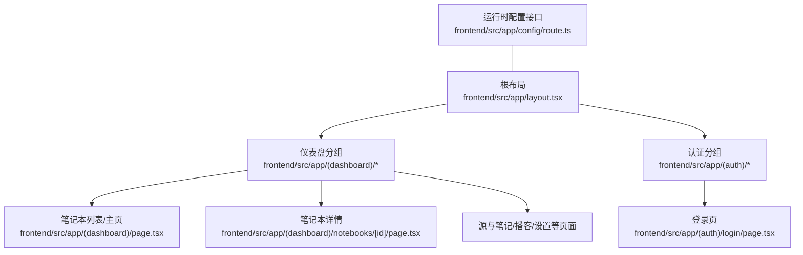
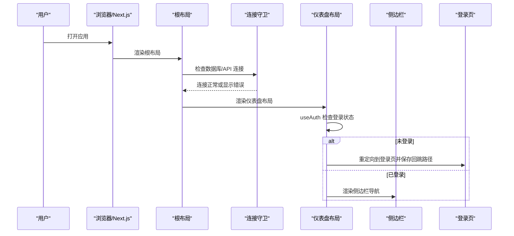
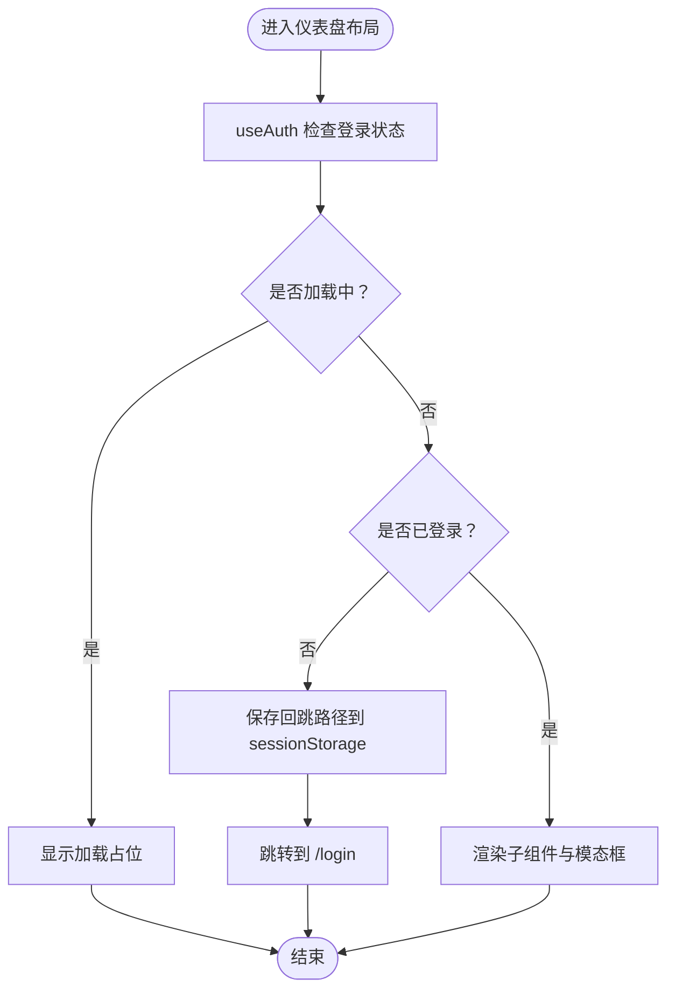
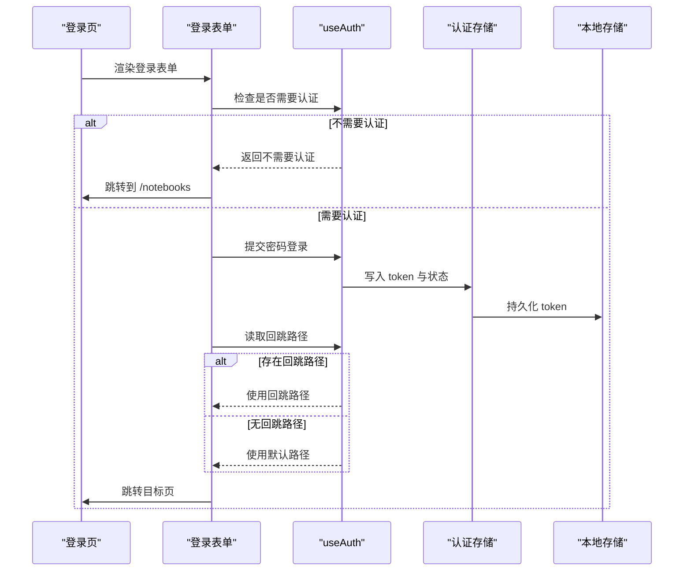
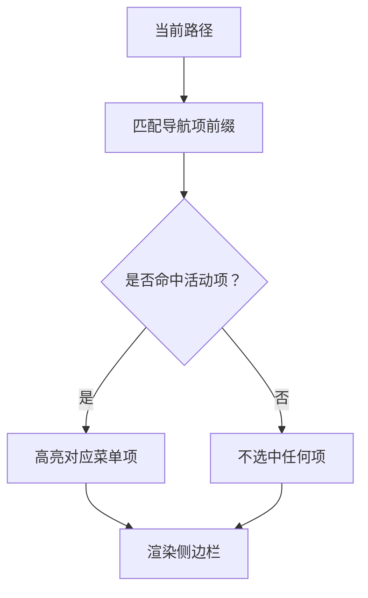
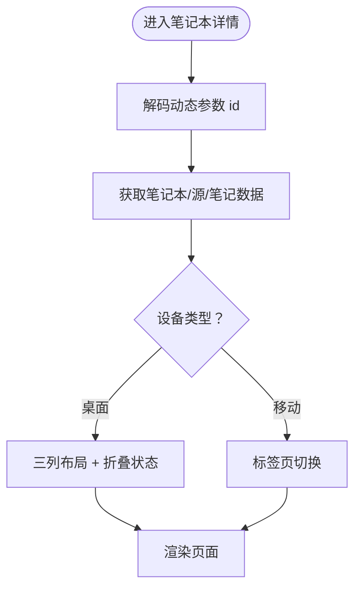
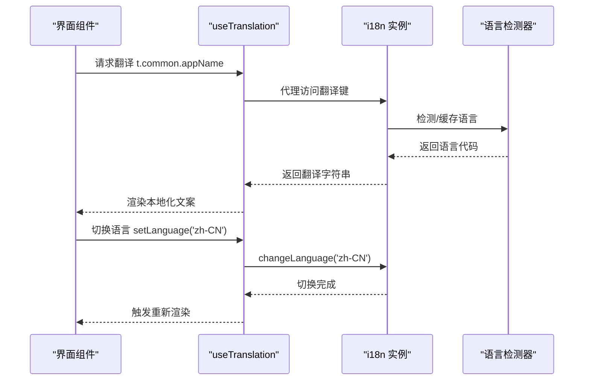
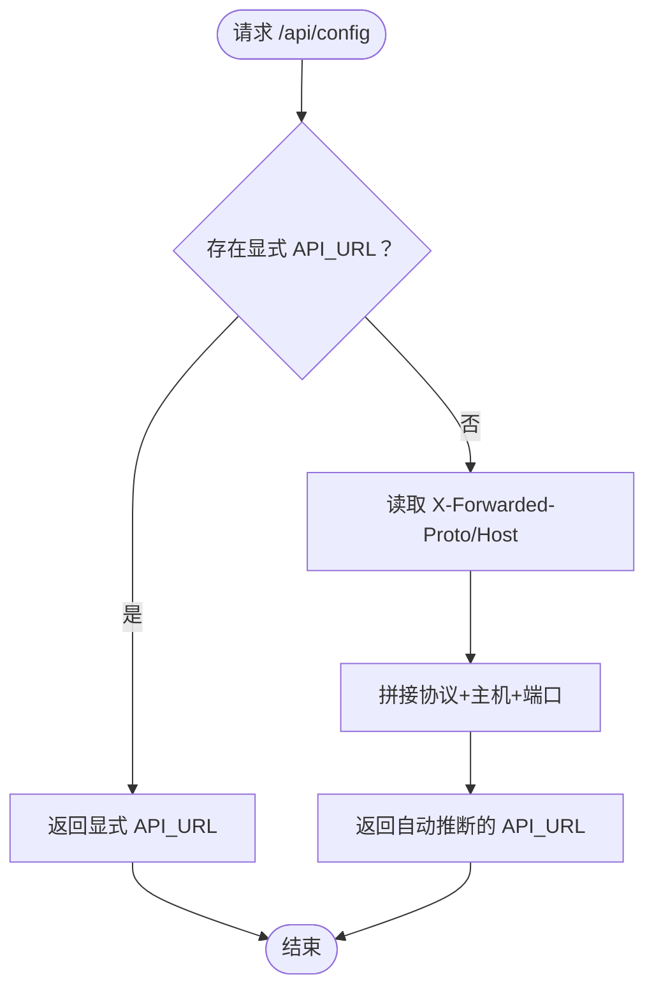
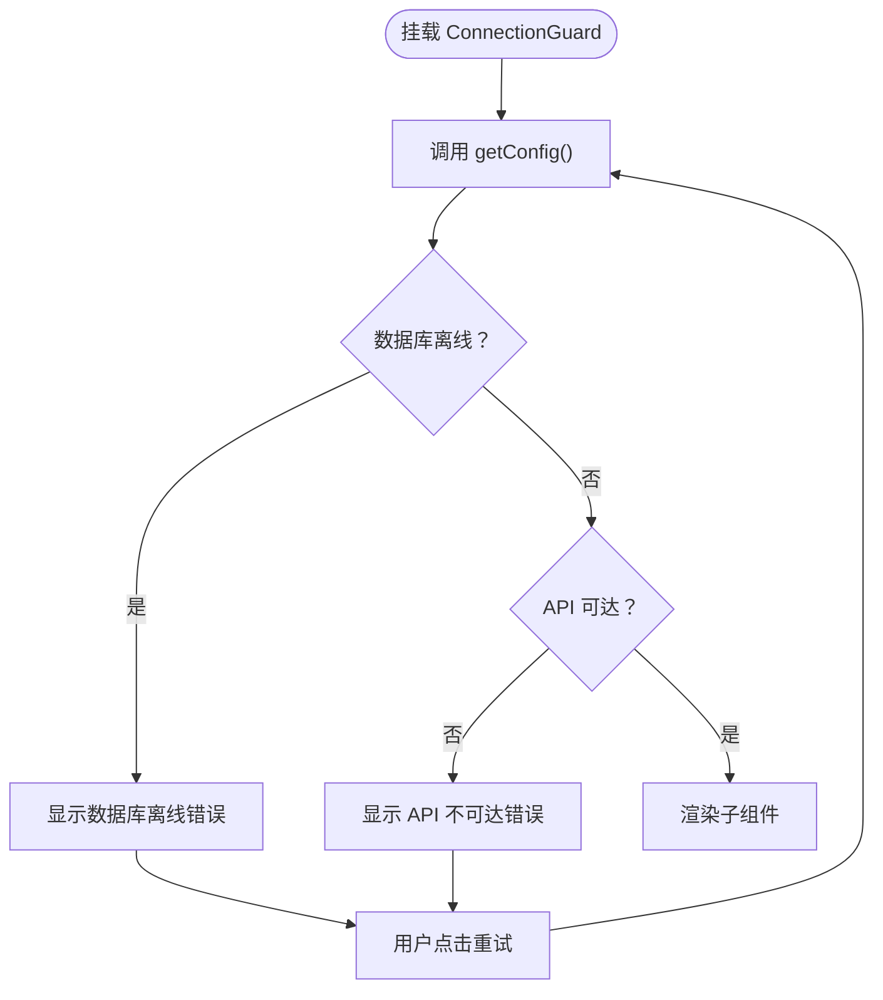
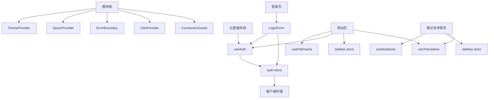

# 路由与导航

<cite>
**本文引用的文件**
- [frontend/src/app/layout.tsx](file://frontend/src/app/layout.tsx)
- [frontend/src/app/(dashboard)/layout.tsx](file://frontend/src/app/(dashboard)/layout.tsx)
- [frontend/src/app/(auth)/login/page.tsx](file://frontend/src/app/(auth)/login/page.tsx)
- [frontend/src/app/(dashboard)/notebooks/[id]/page.tsx](file://frontend/src/app/(dashboard)/notebooks/[id]/page.tsx)
- [frontend/src/app/config/route.ts](file://frontend/src/app/config/route.ts)
- [frontend/src/components/layout/AppSidebar.tsx](file://frontend/src/components/layout/AppSidebar.tsx)
- [frontend/src/components/auth/LoginForm.tsx](file://frontend/src/components/auth/LoginForm.tsx)
- [frontend/src/components/common/ConnectionGuard.tsx](file://frontend/src/components/common/ConnectionGuard.tsx)
- [frontend/src/lib/hooks/use-auth.ts](file://frontend/src/lib/hooks/use-auth.ts)
- [frontend/src/lib/stores/auth-store.ts](file://frontend/src/lib/stores/auth-store.ts)
- [frontend/src/lib/stores/sidebar-store.ts](file://frontend/src/lib/stores/sidebar-store.ts)
- [frontend/src/lib/hooks/use-translation.ts](file://frontend/src/lib/hooks/use-translation.ts)
- [frontend/src/lib/i18n.ts](file://frontend/src/lib/i18n.ts)
- [frontend/src/lib/locales/index.ts](file://frontend/src/lib/locales/index.ts)
</cite>

## 目录
1. [简介](#简介)
2. [项目结构](#项目结构)
3. [核心组件](#核心组件)
4. [架构总览](#架构总览)
5. [详细组件分析](#详细组件分析)
6. [依赖关系分析](#依赖关系分析)
7. [性能考量](#性能考量)
8. [故障排查指南](#故障排查指南)
9. [结论](#结论)
10. [附录](#附录)

## 简介
本文件系统性梳理 Open Notebook 前端在 Next.js App Router 下的路由与导航体系，覆盖以下主题：
- 路由分组与页面组织：认证与仪表盘分组、动态路由与页面渲染
- 应用内导航模式：侧边栏菜单、面包屑与移动端适配
- 权限控制与路由守卫：登录态检查、重定向与会话保持
- 国际化路由与多语言导航：语言检测、切换与界面文案
- 导航状态管理：侧边栏折叠、列布局状态、移动端标签页
- 历史记录与前进后退：基于浏览器历史的导航行为
- 路由优化与 SEO 友好配置：元数据、运行时配置与可访问性

## 项目结构
前端采用 Next.js App Router 的 App 目录结构，按功能域划分页面与布局：
- 根布局负责全局 Provider 包装与主题/国际化初始化
- 认证分组 (auth) 仅包含登录页
- 仪表盘分组 (dashboard) 包含笔记本、源、笔记、搜索、播客、设置、高级等页面，并通过仪表盘布局实现路由守卫
- 动态路由用于笔记本详情页（[id]）
- 运行时配置接口提供 API 地址等环境变量给客户端

图表来源
- [frontend/src/app/layout.tsx](file://frontend/src/app/layout.tsx#L1-L46)
- [frontend/src/app/(dashboard)/layout.tsx](file://frontend/src/app/(dashboard)/layout.tsx#L1-L64)
- [frontend/src/app/(auth)/login/page.tsx](file://frontend/src/app/(auth)/login/page.tsx#L1-L10)
- [frontend/src/app/(dashboard)/notebooks/[id]/page.tsx](file://frontend/src/app/(dashboard)/notebooks/[id]/page.tsx#L1-L245)
- [frontend/src/app/config/route.ts](file://frontend/src/app/config/route.ts#L1-L69)

章节来源
- [frontend/src/app/layout.tsx](file://frontend/src/app/layout.tsx#L1-L46)
- [frontend/src/app/(dashboard)/layout.tsx](file://frontend/src/app/(dashboard)/layout.tsx#L1-L64)
- [frontend/src/app/(auth)/login/page.tsx](file://frontend/src/app/(auth)/login/page.tsx#L1-L10)
- [frontend/src/app/(dashboard)/notebooks/[id]/page.tsx](file://frontend/src/app/(dashboard)/notebooks/[id]/page.tsx#L1-L245)
- [frontend/src/app/config/route.ts](file://frontend/src/app/config/route.ts#L1-L69)

## 核心组件
- 根布局与全局 Provider：注入主题、查询缓存、错误边界、连接守卫、国际化与通知
- 仪表盘布局与路由守卫：在客户端进行认证检查，未登录则重定向至登录页并保存回跳路径
- 登录表单与认证流程：检测是否需要认证、执行登录、处理错误与回跳
- 侧边栏导航：分组菜单、创建入口、主题/语言切换、登出
- 运行时配置：根据请求头自动推断 API 地址，解决构建期环境变量限制
- 国际化：i18n 初始化、语言检测与切换 Hook

章节来源
- [frontend/src/app/layout.tsx](file://frontend/src/app/layout.tsx#L1-L46)
- [frontend/src/app/(dashboard)/layout.tsx](file://frontend/src/app/(dashboard)/layout.tsx#L1-L64)
- [frontend/src/app/(auth)/login/page.tsx](file://frontend/src/app/(auth)/login/page.tsx#L1-L10)
- [frontend/src/components/layout/AppSidebar.tsx](file://frontend/src/components/layout/AppSidebar.tsx#L1-L382)
- [frontend/src/app/config/route.ts](file://frontend/src/app/config/route.ts#L1-L69)
- [frontend/src/lib/hooks/use-auth.ts](file://frontend/src/lib/hooks/use-auth.ts#L1-L68)
- [frontend/src/lib/stores/auth-store.ts](file://frontend/src/lib/stores/auth-store.ts#L1-L222)
- [frontend/src/lib/i18n.ts](file://frontend/src/lib/i18n.ts#L1-L25)
- [frontend/src/lib/hooks/use-translation.ts](file://frontend/src/lib/hooks/use-translation.ts#L1-L158)

## 架构总览
下图展示从用户访问到页面渲染的关键交互链路，包括认证守卫、连接检查、国际化与侧边栏导航。

图表来源
- [frontend/src/app/layout.tsx](file://frontend/src/app/layout.tsx#L1-L46)
- [frontend/src/components/common/ConnectionGuard.tsx](file://frontend/src/components/common/ConnectionGuard.tsx#L1-L109)
- [frontend/src/app/(dashboard)/layout.tsx](file://frontend/src/app/(dashboard)/layout.tsx#L1-L64)
- [frontend/src/components/layout/AppSidebar.tsx](file://frontend/src/components/layout/AppSidebar.tsx#L1-L382)
- [frontend/src/app/(auth)/login/page.tsx](file://frontend/src/app/(auth)/login/page.tsx#L1-L10)

## 详细组件分析

### 仪表盘布局与路由守卫
- 客户端认证检查：在首次加载时读取认证状态，若未认证则将当前路径写入 sessionStorage 并跳转登录页
- 加载态处理：在认证检查完成前显示加载占位，避免闪烁
- 错误边界包裹：确保子树异常不崩溃全局

图表来源
- [frontend/src/app/(dashboard)/layout.tsx](file://frontend/src/app/(dashboard)/layout.tsx#L1-L64)
- [frontend/src/lib/hooks/use-auth.ts](file://frontend/src/lib/hooks/use-auth.ts#L1-L68)
- [frontend/src/lib/stores/auth-store.ts](file://frontend/src/lib/stores/auth-store.ts#L1-L222)

章节来源
- [frontend/src/app/(dashboard)/layout.tsx](file://frontend/src/app/(dashboard)/layout.tsx#L1-L64)
- [frontend/src/lib/hooks/use-auth.ts](file://frontend/src/lib/hooks/use-auth.ts#L1-L68)
- [frontend/src/lib/stores/auth-store.ts](file://frontend/src/lib/stores/auth-store.ts#L1-L222)

### 登录流程与回跳机制
- 首次加载检测是否需要认证；若不需要则直接跳转到笔记本页
- 登录成功后优先使用 sessionStorage 中的回跳路径，否则默认跳转到笔记本页
- 登录失败时展示错误信息并允许重试

图表来源
- [frontend/src/app/(auth)/login/page.tsx](file://frontend/src/app/(auth)/login/page.tsx#L1-L10)
- [frontend/src/components/auth/LoginForm.tsx](file://frontend/src/components/auth/LoginForm.tsx#L1-L187)
- [frontend/src/lib/hooks/use-auth.ts](file://frontend/src/lib/hooks/use-auth.ts#L1-L68)
- [frontend/src/lib/stores/auth-store.ts](file://frontend/src/lib/stores/auth-store.ts#L1-L222)

章节来源
- [frontend/src/app/(auth)/login/page.tsx](file://frontend/src/app/(auth)/login/page.tsx#L1-L10)
- [frontend/src/components/auth/LoginForm.tsx](file://frontend/src/components/auth/LoginForm.tsx#L1-L187)
- [frontend/src/lib/hooks/use-auth.ts](file://frontend/src/lib/hooks/use-auth.ts#L1-L68)
- [frontend/src/lib/stores/auth-store.ts](file://frontend/src/lib/stores/auth-store.ts#L1-L222)

### 侧边栏导航与面包屑
- 分组菜单：按“收集/处理/创作/管理”分组，每个分组包含若干导航项
- 活动态判定：基于当前路径前缀匹配高亮当前菜单
- 创建入口：下拉菜单快速创建源/笔记本/播客
- 主题与语言切换：侧边栏底部提供主题与语言切换入口
- 面包屑：当前实现以菜单高亮替代面包屑，可在笔记本详情页进一步扩展

图表来源
- [frontend/src/components/layout/AppSidebar.tsx](file://frontend/src/components/layout/AppSidebar.tsx#L1-L382)

章节来源
- [frontend/src/components/layout/AppSidebar.tsx](file://frontend/src/components/layout/AppSidebar.tsx#L1-L382)

### 动态路由与笔记本详情页
- 动态参数：通过 [id] 获取笔记本 ID，并进行 URL 解码
- 多列布局：桌面端三列（源/笔记/聊天），移动端使用标签页切换
- 列折叠状态：通过 store 管理源/笔记列的折叠状态
- 上下文选择：为每个源/笔记设置上下文模式（关闭/洞察/全文）

图表来源
- [frontend/src/app/(dashboard)/notebooks/[id]/page.tsx](file://frontend/src/app/(dashboard)/notebooks/[id]/page.tsx#L1-L245)
- [frontend/src/lib/stores/sidebar-store.ts](file://frontend/src/lib/stores/sidebar-store.ts#L1-L21)

章节来源
- [frontend/src/app/(dashboard)/notebooks/[id]/page.tsx](file://frontend/src/app/(dashboard)/notebooks/[id]/page.tsx#L1-L245)
- [frontend/src/lib/stores/sidebar-store.ts](file://frontend/src/lib/stores/sidebar-store.ts#L1-L21)

### 国际化与多语言导航
- i18n 初始化：使用浏览器语言检测器与本地存储缓存，支持多种语言资源
- 自定义 Hook：提供安全的代理式翻译 API，避免递归与无限循环
- 语言切换：通过事件发射与监听，在切换过程中保持 UI 稳定

图表来源
- [frontend/src/lib/i18n.ts](file://frontend/src/lib/i18n.ts#L1-L25)
- [frontend/src/lib/hooks/use-translation.ts](file://frontend/src/lib/hooks/use-translation.ts#L1-L158)
- [frontend/src/lib/locales/index.ts](file://frontend/src/lib/locales/index.ts#L1-L39)

章节来源
- [frontend/src/lib/i18n.ts](file://frontend/src/lib/i18n.ts#L1-L25)
- [frontend/src/lib/hooks/use-translation.ts](file://frontend/src/lib/hooks/use-translation.ts#L1-L158)
- [frontend/src/lib/locales/index.ts](file://frontend/src/lib/locales/index.ts#L1-L39)

### 运行时配置与 API 地址解析
- 优先级策略：显式环境变量 > 请求头推断 > 回退地址
- 反向代理兼容：优先读取 X-Forwarded-Proto 与 Host 头
- 客户端消费：通过配置服务获取 API 地址，用于认证与数据请求

图表来源
- [frontend/src/app/config/route.ts](file://frontend/src/app/config/route.ts#L1-L69)

章节来源
- [frontend/src/app/config/route.ts](file://frontend/src/app/config/route.ts#L1-L69)

### 连接守卫与错误处理
- 启动时检查数据库与 API 可达性，离线时显示错误覆盖层并提供重试
- 支持键盘快捷键 R 重试
- 与仪表盘守卫配合，保证在不可用状态下不渲染主内容

图表来源
- [frontend/src/components/common/ConnectionGuard.tsx](file://frontend/src/components/common/ConnectionGuard.tsx#L1-L109)

章节来源
- [frontend/src/components/common/ConnectionGuard.tsx](file://frontend/src/components/common/ConnectionGuard.tsx#L1-L109)

## 依赖关系分析
- 根布局依赖 Provider 层：主题、查询缓存、错误边界、国际化、连接守卫
- 仪表盘布局依赖认证 Hook 与存储，实现路由守卫
- 登录页依赖认证 Hook 与存储，处理登录与回跳
- 侧边栏依赖路径钩子、认证 Hook、侧边栏状态存储与翻译 Hook
- 动态路由页面依赖笔记本/源/笔记 Hook 与状态存储
- 国际化依赖 i18n 实例与语言资源

图表来源
- [frontend/src/app/layout.tsx](file://frontend/src/app/layout.tsx#L1-L46)
- [frontend/src/app/(dashboard)/layout.tsx](file://frontend/src/app/(dashboard)/layout.tsx#L1-L64)
- [frontend/src/app/(auth)/login/page.tsx](file://frontend/src/app/(auth)/login/page.tsx#L1-L10)
- [frontend/src/components/layout/AppSidebar.tsx](file://frontend/src/components/layout/AppSidebar.tsx#L1-L382)
- [frontend/src/app/(dashboard)/notebooks/[id]/page.tsx](file://frontend/src/app/(dashboard)/notebooks/[id]/page.tsx#L1-L245)

章节来源
- [frontend/src/app/layout.tsx](file://frontend/src/app/layout.tsx#L1-L46)
- [frontend/src/app/(dashboard)/layout.tsx](file://frontend/src/app/(dashboard)/layout.tsx#L1-L64)
- [frontend/src/app/(auth)/login/page.tsx](file://frontend/src/app/(auth)/login/page.tsx#L1-L10)
- [frontend/src/components/layout/AppSidebar.tsx](file://frontend/src/components/layout/AppSidebar.tsx#L1-L382)
- [frontend/src/app/(dashboard)/notebooks/[id]/page.tsx](file://frontend/src/app/(dashboard)/notebooks/[id]/page.tsx#L1-L245)

## 性能考量
- 路由守卫与认证检查：避免重复请求，使用最近一次检查时间戳与状态标志
- 查询缓存：全局 QueryProvider 提供请求缓存与重试策略
- 动态导入与懒加载：页面组件按需加载，减少首屏负担
- 移动端优化：移动端仅渲染当前标签内容，避免重复挂载
- 侧边栏状态持久化：使用本地存储保持折叠状态，提升用户体验

## 故障排查指南
- 登录失败
  - 检查认证状态接口与令牌传递
  - 查看网络错误与状态码提示
  - 确认回跳路径是否正确写入与清除
- 无法连接 API
  - 使用连接守卫提供的重试按钮或键盘 R
  - 检查反向代理头（X-Forwarded-Proto/Host）与端口
- 语言切换无效
  - 确认 i18n 初始化与缓存策略
  - 检查自定义 Hook 的代理实现与递归保护
- 侧边栏状态不同步
  - 确认本地存储键名与持久化中间件配置一致

章节来源
- [frontend/src/lib/stores/auth-store.ts](file://frontend/src/lib/stores/auth-store.ts#L1-L222)
- [frontend/src/components/common/ConnectionGuard.tsx](file://frontend/src/components/common/ConnectionGuard.tsx#L1-L109)
- [frontend/src/lib/i18n.ts](file://frontend/src/lib/i18n.ts#L1-L25)
- [frontend/src/lib/hooks/use-translation.ts](file://frontend/src/lib/hooks/use-translation.ts#L1-L158)
- [frontend/src/lib/stores/sidebar-store.ts](file://frontend/src/lib/stores/sidebar-store.ts#L1-L21)

## 结论
本项目在 Next.js App Router 下实现了清晰的路由分组、完善的认证守卫与回跳机制、可扩展的侧边栏导航与动态路由页面。结合运行时配置与国际化方案，既满足本地部署场景，也便于多语言与多环境部署。建议后续增强：
- 面包屑导航与页面标题管理
- 动态路由的 SEO 元数据与结构化数据
- 更细粒度的权限控制与路由级鉴权

## 附录
- 元数据与可访问性：根布局设置站点标题与描述，确保可访问性脚本注入
- 国际化资源：集中管理多语言资源与语言列表，支持热切换

章节来源
- [frontend/src/app/layout.tsx](file://frontend/src/app/layout.tsx#L1-L46)
- [frontend/src/lib/locales/index.ts](file://frontend/src/lib/locales/index.ts#L1-L39)