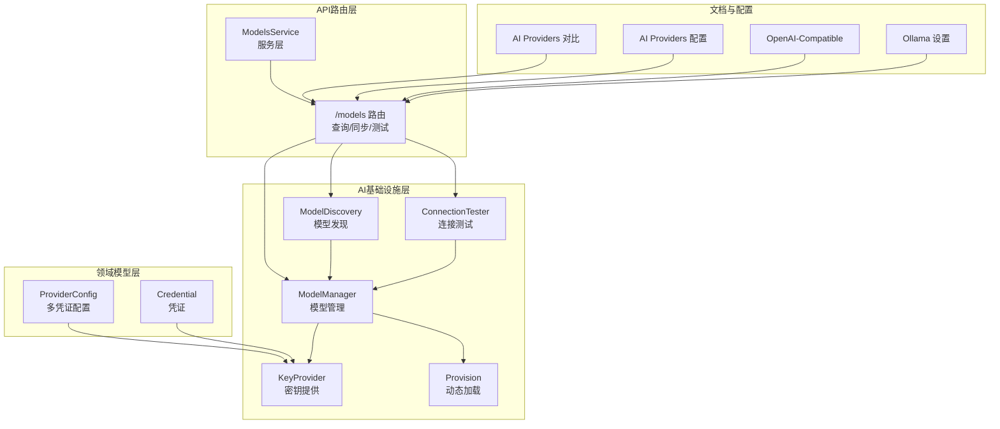
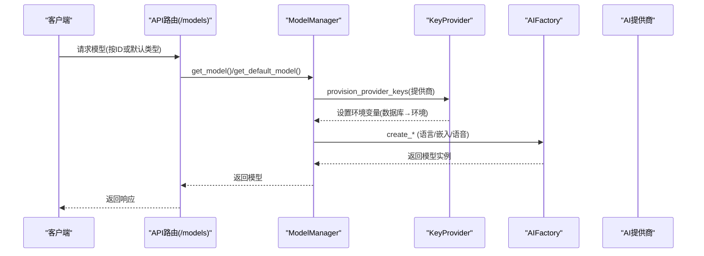
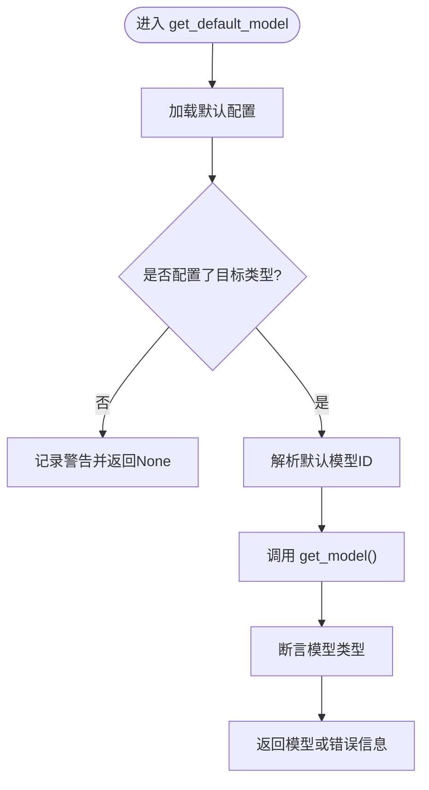
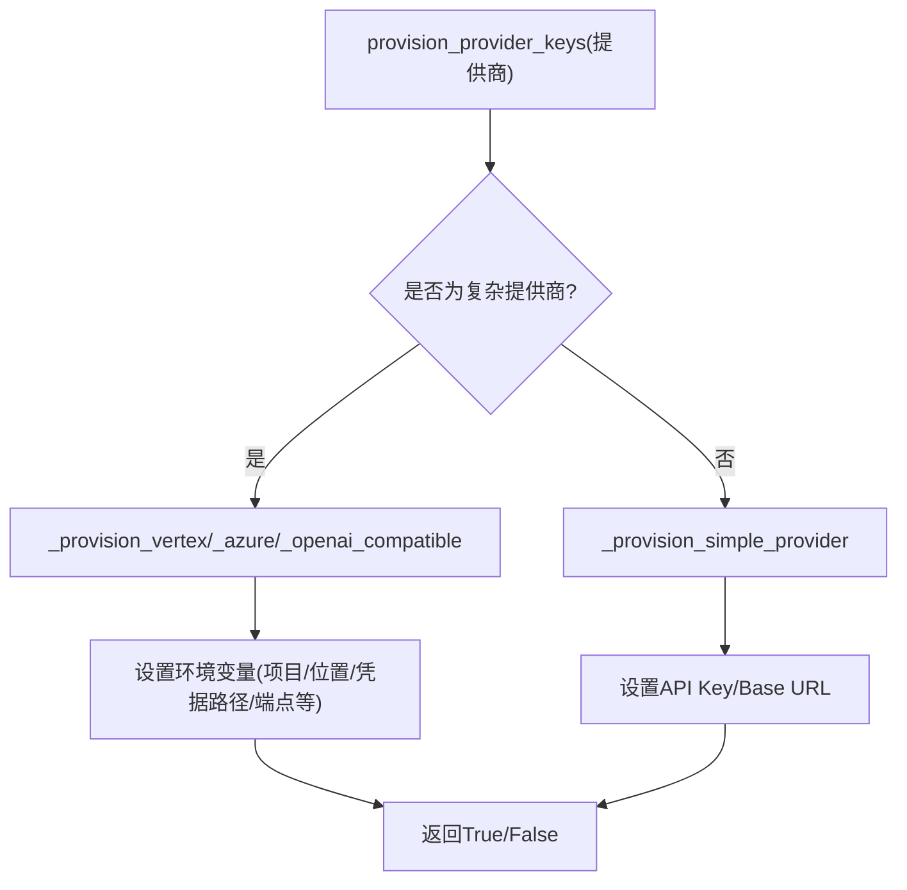
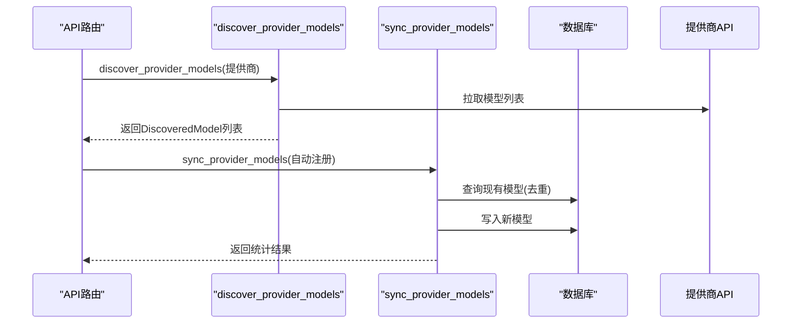
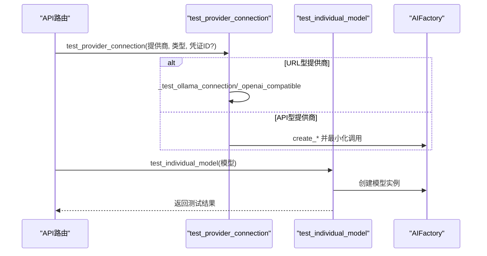
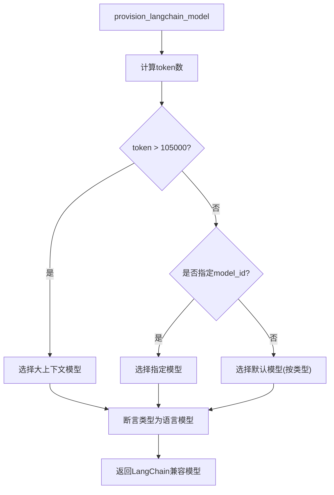
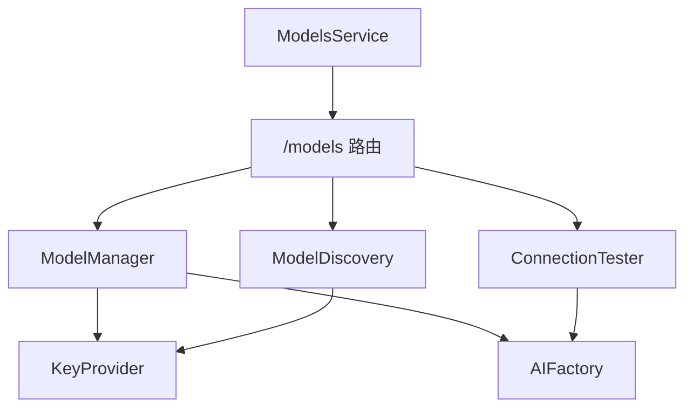

# AI提供商集成

<cite>
**本文档引用的文件**
- [open_notebook/ai/models.py](file://open_notebook/ai/models.py)
- [open_notebook/ai/key_provider.py](file://open_notebook/ai/key_provider.py)
- [open_notebook/ai/provision.py](file://open_notebook/ai/provision.py)
- [open_notebook/ai/model_discovery.py](file://open_notebook/ai/model_discovery.py)
- [open_notebook/ai/connection_tester.py](file://open_notebook/ai/connection_tester.py)
- [open_notebook/domain/provider_config.py](file://open_notebook/domain/provider_config.py)
- [open_notebook/domain/credential.py](file://open_notebook/domain/credential.py)
- [api/routers/models.py](file://api/routers/models.py)
- [api/models_service.py](file://api/models_service.py)
- [docs/4-AI-PROVIDERS/index.md](file://docs/4-AI-PROVIDERS/index.md)
- [docs/5-CONFIGURATION/ai-providers.md](file://docs/5-CONFIGURATION/ai-providers.md)
- [docs/5-CONFIGURATION/openai-compatible.md](file://docs/5-CONFIGURATION/openai-compatible.md)
- [docs/5-CONFIGURATION/ollama.md](file://docs/5-CONFIGURATION/ollama.md)
</cite>

## 目录
1. [简介](#简介)
2. [项目结构](#项目结构)
3. [核心组件](#核心组件)
4. [架构总览](#架构总览)
5. [详细组件分析](#详细组件分析)
6. [依赖关系分析](#依赖关系分析)
7. [性能考虑](#性能考虑)
8. [故障排除指南](#故障排除指南)
9. [结论](#结论)
10. [附录](#附录)

## 简介
本文件系统性阐述Open Notebook中多AI提供商（OpenAI、Anthropic Claude、Ollama、Google Gemini等）的集成方案。重点覆盖以下方面：
- 适配器模式与统一接口封装：通过Esperanto AIFactory屏蔽不同提供商差异
- 参数映射与配置验证：从数据库凭证到环境变量的回退机制
- 模型初始化流程：按类型分发、默认模型选择与动态加载
- 提供商切换、负载均衡与故障转移：基于优先级与自动分配策略
- 配置示例、API限制处理与成本优化建议

## 项目结构
围绕AI提供商集成的关键模块分布如下：
- AI基础设施层：模型管理、密钥提供、模型发现、连接测试
- 领域模型层：凭证与多提供商配置
- API路由层：模型查询、同步、可用性检测、自动分配
- 文档与配置指南：提供商对比、配置步骤与最佳实践



**图表来源**
- [open_notebook/ai/models.py](file://open_notebook/ai/models.py#L97-L267)
- [open_notebook/ai/key_provider.py](file://open_notebook/ai/key_provider.py#L236-L298)
- [open_notebook/ai/model_discovery.py](file://open_notebook/ai/model_discovery.py#L608-L725)
- [open_notebook/ai/connection_tester.py](file://open_notebook/ai/connection_tester.py#L170-L300)
- [open_notebook/ai/provision.py](file://open_notebook/ai/provision.py#L9-L61)
- [open_notebook/domain/provider_config.py](file://open_notebook/domain/provider_config.py#L175-L445)
- [open_notebook/domain/credential.py](file://open_notebook/domain/credential.py#L67-L83)
- [api/routers/models.py](file://api/routers/models.py#L165-L771)
- [api/models_service.py](file://api/models_service.py#L13-L113)

**章节来源**
- [open_notebook/ai/models.py](file://open_notebook/ai/models.py#L1-L267)
- [open_notebook/ai/key_provider.py](file://open_notebook/ai/key_provider.py#L1-L298)
- [open_notebook/ai/model_discovery.py](file://open_notebook/ai/model_discovery.py#L1-L757)
- [open_notebook/ai/connection_tester.py](file://open_notebook/ai/connection_tester.py#L1-L439)
- [open_notebook/ai/provision.py](file://open_notebook/ai/provision.py#L1-L61)
- [open_notebook/domain/provider_config.py](file://open_notebook/domain/provider_config.py#L1-L445)
- [open_notebook/domain/credential.py](file://open_notebook/domain/credential.py#L1-L83)
- [api/routers/models.py](file://api/routers/models.py#L1-L771)
- [api/models_service.py](file://api/models_service.py#L1-L113)
- [docs/4-AI-PROVIDERS/index.md](file://docs/4-AI-PROVIDERS/index.md#L1-L200)
- [docs/5-CONFIGURATION/ai-providers.md](file://docs/5-CONFIGURATION/ai-providers.md#L1-L468)
- [docs/5-CONFIGURATION/openai-compatible.md](file://docs/5-CONFIGURATION/openai-compatible.md#L1-L401)
- [docs/5-CONFIGURATION/ollama.md](file://docs/5-CONFIGURATION/ollama.md#L1-L741)

## 核心组件
- 模型管理器（ModelManager）
  - 统一入口：按ID或默认类型获取模型实例
  - 凭证优先：若模型关联凭证则使用凭证配置；否则回退至数据库或环境变量
  - 类型分发：根据模型类型调用AIFactory对应创建方法
  - 默认模型：支持聊天、转换、工具、嵌入、语音合成/识别等默认槽位
- 密钥提供器（KeyProvider）
  - 单一可信源：维护提供商到环境变量的映射
  - 数据库优先：优先从Credential读取，再回退到环境变量
  - 复杂提供商：Vertex、Azure、OpenAI-Compatible分别处理多字段配置
- 模型发现（ModelDiscovery）
  - 自动发现：针对各提供商API拉取可用模型列表
  - 类型分类：基于命名模式将模型归类为语言/嵌入/语音等
  - 同步注册：批量去重后写入数据库
- 连接测试（ConnectionTester）
  - 健康检查：对各提供商进行最小化连通性测试
  - 动态模型：对URL型提供商（如Ollama、OpenAI-Compatible）仅测试可达性
  - 逐模型验证：对具体模型执行端到端调用
- 动态加载（Provision）
  - 上下文感知：根据内容长度选择大上下文模型
  - 类型断言：确保返回的语言模型类型正确
- API路由与服务
  - 模型管理：查询、创建、删除、测试
  - 可用性检测：基于数据库与环境变量判断提供商可用状态
  - 自动分配：按提供商优先级与偏好选择默认模型

**章节来源**
- [open_notebook/ai/models.py](file://open_notebook/ai/models.py#L97-L267)
- [open_notebook/ai/key_provider.py](file://open_notebook/ai/key_provider.py#L236-L298)
- [open_notebook/ai/model_discovery.py](file://open_notebook/ai/model_discovery.py#L608-L725)
- [open_notebook/ai/connection_tester.py](file://open_notebook/ai/connection_tester.py#L170-L300)
- [open_notebook/ai/provision.py](file://open_notebook/ai/provision.py#L9-L61)
- [api/routers/models.py](file://api/routers/models.py#L165-L771)

## 架构总览
整体采用“凭证驱动 + 环境回退”的配置体系，通过AIFactory屏蔽提供商差异，实现统一的模型创建与调用。



**图表来源**
- [open_notebook/ai/models.py](file://open_notebook/ai/models.py#L101-L176)
- [open_notebook/ai/key_provider.py](file://open_notebook/ai/key_provider.py#L236-L271)
- [api/routers/models.py](file://api/routers/models.py#L165-L359)

**章节来源**
- [open_notebook/ai/models.py](file://open_notebook/ai/models.py#L97-L267)
- [open_notebook/ai/key_provider.py](file://open_notebook/ai/key_provider.py#L236-L298)
- [api/routers/models.py](file://api/routers/models.py#L165-L359)

## 详细组件分析

### 模型管理器（ModelManager）
- 职责
  - 按ID获取模型：解析模型记录，合并额外参数，规范化提供商名称
  - 凭证优先策略：若存在凭证则使用其配置；否则触发密钥提供器回退
  - 类型分发：语言模型、嵌入模型、语音识别、语音合成分别调用对应工厂方法
  - 默认模型：支持多种默认槽位，含大上下文模型
- 关键流程
  - 获取默认模型时，按类型映射到对应默认槽位，并在缺失时给出明确提示
  - 类型断言保证返回模型类型与期望一致



**图表来源**
- [open_notebook/ai/models.py](file://open_notebook/ai/models.py#L220-L264)

**章节来源**
- [open_notebook/ai/models.py](file://open_notebook/ai/models.py#L97-L267)

### 密钥提供器（KeyProvider）
- 职责
  - 维护简单提供商与复杂提供商的配置映射
  - 从数据库Credential读取配置，设置到环境变量
  - 支持Vertex、Azure、OpenAI-Compatible等多字段场景
- 关键点
  - PROVIDER_CONFIG集中定义环境变量映射
  - _provision_simple_provider统一处理API Key与Base URL
  - _provision_vertex/_provision_azure/_provision_openai_compatible分别处理多字段



**图表来源**
- [open_notebook/ai/key_provider.py](file://open_notebook/ai/key_provider.py#L236-L271)

**章节来源**
- [open_notebook/ai/key_provider.py](file://open_notebook/ai/key_provider.py#L29-L298)

### 模型发现（ModelDiscovery）
- 职责
  - 针对OpenAI、Anthropic、Google、Ollama、Groq、Mistral、DeepSeek、xAI、OpenRouter、Voyage、ElevenLabs等提供商分别实现发现逻辑
  - 基于命名模式分类模型类型（语言/嵌入/语音）
  - 批量同步到数据库，避免重复注册
- 关键点
  - PROVIDER_DISCOVERY_FUNCTIONS集中管理发现函数
  - classify_model_type按提供商与名称模式推断类型
  - sync_all_providers并行执行提升效率



**图表来源**
- [open_notebook/ai/model_discovery.py](file://open_notebook/ai/model_discovery.py#L608-L725)

**章节来源**
- [open_notebook/ai/model_discovery.py](file://open_notebook/ai/model_discovery.py#L1-L757)

### 连接测试（ConnectionTester）
- 职责
  - 测试提供商连通性：对URL型提供商测试基础端点，对API型提供商创建最小化模型并发起调用
  - 逐模型验证：对具体模型执行端到端调用，返回详细结果
- 关键点
  - TEST_MODELS为各提供商定义最小化测试模型
  - _test_azure_connection/_test_ollama_connection/_test_openai_compatible_connection分别处理不同认证方式
  - test_individual_model对语言/嵌入/语音进行针对性测试



**图表来源**
- [open_notebook/ai/connection_tester.py](file://open_notebook/ai/connection_tester.py#L170-L300)

**章节来源**
- [open_notebook/ai/connection_tester.py](file://open_notebook/ai/connection_tester.py#L1-L439)

### 动态加载（Provision）
- 职责
  - 基于内容长度与显式ID选择最优模型
  - 将Esperanto模型转为LangChain兼容形式
- 关键点
  - provision_langchain_model按105,000 token阈值自动升级到大上下文模型
  - 类型断言确保返回语言模型



**图表来源**
- [open_notebook/ai/provision.py](file://open_notebook/ai/provision.py#L9-L61)

**章节来源**
- [open_notebook/ai/provision.py](file://open_notebook/ai/provision.py#L1-L61)

### API路由与服务
- 路由功能
  - 模型CRUD：查询、创建、删除、测试
  - 可用性检测：基于数据库与环境变量判断提供商可用状态
  - 模型同步：按提供商或全部同步模型清单
  - 自动分配：按优先级与偏好选择默认模型
- 服务层
  - ModelsService封装API调用，便于前端或其它服务使用

```mermaid
classDiagram
class ModelsService {
+get_all_models(model_type) Model[]
+create_model(name, provider, type) Model
+delete_model(model_id) bool
+get_default_models() DefaultModels
+update_default_models(defaults) DefaultModels
}
class 路由Models {
+GET /models
+POST /models
+DELETE /models/{id}
+POST /models/{id}/test
+GET /models/defaults
+PUT /models/defaults
+GET /models/providers
+GET /models/discover/{provider}
+POST /models/sync/{provider}
+POST /models/sync
+GET /models/count/{provider}
+GET /models/by-provider/{provider}
+POST /models/auto-assign
}
ModelsService --> 路由Models : "调用API"
```

**图表来源**
- [api/models_service.py](file://api/models_service.py#L13-L113)
- [api/routers/models.py](file://api/routers/models.py#L165-L771)

**章节来源**
- [api/models_service.py](file://api/models_service.py#L1-L113)
- [api/routers/models.py](file://api/routers/models.py#L1-L771)

## 依赖关系分析
- 模块耦合
  - ModelManager高度依赖KeyProvider与AIFactory，形成稳定的适配器模式
  - ModelDiscovery与API提供商直接交互，但通过统一响应结构解耦
  - ConnectionTester独立于模型创建，仅依赖AIFactory与HTTP客户端
- 外部依赖
  - Esperanto AIFactory：统一模型创建接口
  - httpx：异步HTTP客户端
  - SurrealDB：数据持久化（通过repository）



**图表来源**
- [open_notebook/ai/models.py](file://open_notebook/ai/models.py#L97-L267)
- [open_notebook/ai/key_provider.py](file://open_notebook/ai/key_provider.py#L236-L298)
- [open_notebook/ai/model_discovery.py](file://open_notebook/ai/model_discovery.py#L608-L725)
- [open_notebook/ai/connection_tester.py](file://open_notebook/ai/connection_tester.py#L170-L300)
- [api/routers/models.py](file://api/routers/models.py#L165-L771)
- [api/models_service.py](file://api/models_service.py#L13-L113)

**章节来源**
- [open_notebook/ai/models.py](file://open_notebook/ai/models.py#L97-L267)
- [open_notebook/ai/key_provider.py](file://open_notebook/ai/key_provider.py#L236-L298)
- [open_notebook/ai/model_discovery.py](file://open_notebook/ai/model_discovery.py#L608-L725)
- [open_notebook/ai/connection_tester.py](file://open_notebook/ai/connection_tester.py#L170-L300)
- [api/routers/models.py](file://api/routers/models.py#L165-L771)
- [api/models_service.py](file://api/models_service.py#L13-L113)

## 性能考虑
- 异步并发
  - ModelDiscovery.sync_all_providers使用asyncio.gather并行发现所有提供商模型，显著降低等待时间
- 缓存与去重
  - ModelDiscovery预取现有模型集合，使用集合O(1)查找避免N+1查询
- 动态模型选择
  - provision_langchain_model基于内容长度自动选择大上下文模型，避免手动配置
- 资源控制
  - ConnectionTester对超时、速率限制进行友好提示，便于快速定位问题

**章节来源**
- [open_notebook/ai/model_discovery.py](file://open_notebook/ai/model_discovery.py#L708-L725)
- [open_notebook/ai/model_discovery.py](file://open_notebook/ai/model_discovery.py#L656-L697)
- [open_notebook/ai/provision.py](file://open_notebook/ai/provision.py#L22-L33)
- [open_notebook/ai/connection_tester.py](file://open_notebook/ai/connection_tester.py#L275-L300)

## 故障排除指南
- 常见问题
  - “无效API密钥”：检查密钥格式与权限，优先使用Settings UI添加凭证而非环境变量
  - “模型不可用”：重新发现并注册模型，确认模型名称与提供商API返回一致
  - “连接被拒绝/超时”：核对URL、网络与防火墙，Linux需配置extra_hosts
  - “速率限制”：属于有效连接但额度不足，可稍后再试或升级账户
- 排查步骤
  - 使用/test端点验证单个模型连通性
  - 通过/sync或/discover刷新模型清单
  - 查看日志中的详细错误信息与HTTP状态码

**章节来源**
- [open_notebook/ai/connection_tester.py](file://open_notebook/ai/connection_tester.py#L275-L300)
- [api/routers/models.py](file://api/routers/models.py#L266-L287)
- [docs/5-CONFIGURATION/ollama.md](file://docs/5-CONFIGURATION/ollama.md#L245-L474)

## 结论
该集成方案通过“凭证驱动 + 环境回退”的配置体系与AIFactory适配器模式，实现了对OpenAI、Anthropic、Ollama、Google Gemini等多家提供商的一致接入。配合模型发现、连接测试与自动分配机制，既保证了易用性，又兼顾了扩展性与可维护性。建议在生产环境中优先使用Settings UI管理凭证，并结合文档中的配置示例与最佳实践，实现稳定高效的AI提供商集成。

## 附录

### 配置示例与最佳实践
- OpenAI
  - 在Settings → API Keys添加凭证，测试连接后发现并注册模型
  - 推荐模型：gpt-4o（平衡质量与速度）、gpt-4o-mini（测试与低成本）
- Anthropic Claude
  - 推荐模型：claude-sonnet-4-5（最新且综合表现优秀）
- Google Gemini
  - 推荐模型：gemini-2.0-flash-exp（最新实验版）、gemini-1.5-pro（长上下文）
- Ollama
  - 本地部署，按硬件选择合适模型；注意启用外部访问与正确的base URL
- OpenAI-Compatible
  - LM Studio、vLLM等服务器均通过OpenAI兼容端点接入，注意模型名称与端口配置

**章节来源**
- [docs/4-AI-PROVIDERS/index.md](file://docs/4-AI-PROVIDERS/index.md#L1-L200)
- [docs/5-CONFIGURATION/ai-providers.md](file://docs/5-CONFIGURATION/ai-providers.md#L25-L468)
- [docs/5-CONFIGURATION/openai-compatible.md](file://docs/5-CONFIGURATION/openai-compatible.md#L1-L401)
- [docs/5-CONFIGURATION/ollama.md](file://docs/5-CONFIGURATION/ollama.md#L1-L741)

### API限制与成本优化
- 云提供商
  - OpenAI/Gemini：按token计费，合理选择模型与上下文长度
  - Anthropic：长上下文优势明显，适合复杂推理任务
  - Groq：极致性价比，适合批量与速度敏感任务
- 本地部署
  - Ollama完全免费，但受硬件限制；通过量化与GPU加速提升性能
- 通用建议
  - 使用ConnectionTester定期检查限额与可用性
  - 通过自动分配与默认模型减少配置负担
  - 在Settings中统一管理凭证，避免环境变量泄露风险

**章节来源**
- [docs/4-AI-PROVIDERS/index.md](file://docs/4-AI-PROVIDERS/index.md#L154-L182)
- [open_notebook/ai/connection_tester.py](file://open_notebook/ai/connection_tester.py#L275-L300)