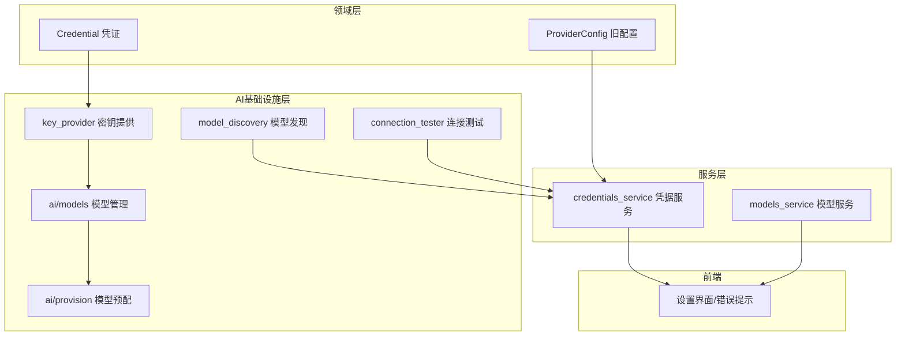
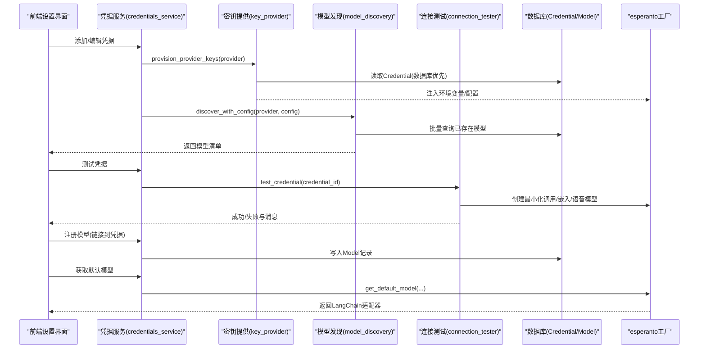
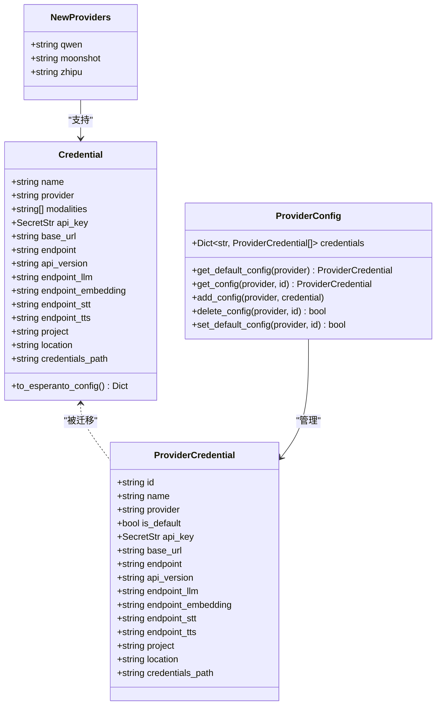
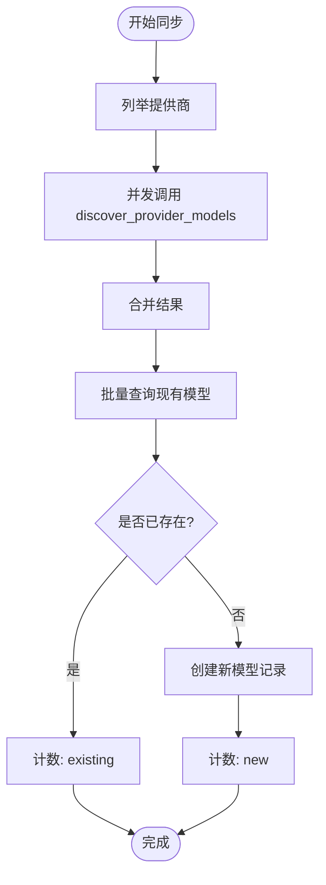
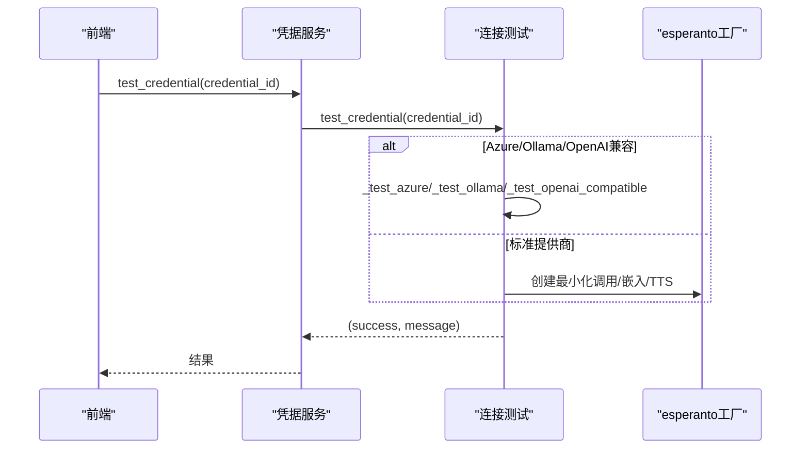
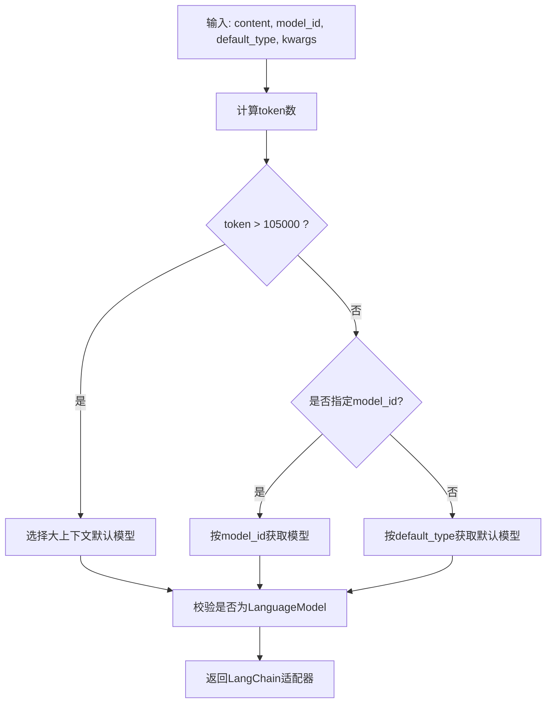
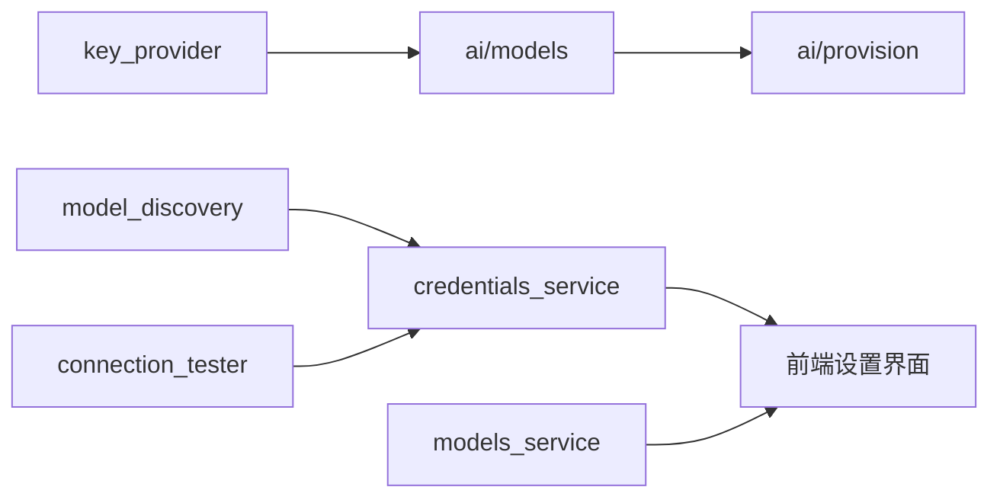

# AI服务集成

<cite>
**本文引用的文件**
- [open_notebook/ai/connection_tester.py](file://open_notebook/ai/connection_tester.py)
- [open_notebook/ai/key_provider.py](file://open_notebook/ai/key_provider.py)
- [open_notebook/ai/model_discovery.py](file://open_notebook/ai/model_discovery.py)
- [open_notebook/ai/models.py](file://open_notebook/ai/models.py)
- [open_notebook/ai/provision.py](file://open_notebook/ai/provision.py)
- [open_notebook/domain/credential.py](file://open_notebook/domain/credential.py)
- [open_notebook/domain/provider_config.py](file://open_notebook/domain/provider_config.py)
- [api/credentials_service.py](file://api/credentials_service.py)
- [api/models_service.py](file://api/models_service.py)
- [docs/4-AI-PROVIDERS/index.md](file://docs/4-AI-PROVIDERS/index.md)
- [docs/5-CONFIGURATION/ai-providers.md](file://docs/5-CONFIGURATION/ai-providers.md)
- [docs/6-TROUBLESHOOTING/ai-chat-issues.md](file://docs/6-TROUBLESHOOTING/ai-chat-issues.md)
</cite>

## 更新摘要
**变更内容**
- 新增Qwen、Moonshot、Zhipu AI提供商的完整集成支持
- 更新多AI提供商支持与密钥管理章节以包含新的提供商
- 新增模型发现机制章节中的新提供商支持
- 更新连接测试与错误归一化章节以包含新的提供商测试
- 更新不同AI提供商的集成要点以涵盖新提供商的特性

## 目录
1. [简介](#简介)
2. [项目结构](#项目结构)
3. [核心组件](#核心组件)
4. [架构总览](#架构总览)
5. [组件详解](#组件详解)
6. [依赖关系分析](#依赖关系分析)
7. [性能与优化](#性能与优化)
8. [故障排除指南](#故障排除指南)
9. [结论](#结论)
10. [附录](#附录)

## 简介
本文件系统性梳理了Open Notebook中AI服务集成的设计与实现，覆盖多AI提供商支持、模型发现机制、密钥与配置管理、连接测试、模型选择与默认模型、以及前端与后端的交互流程。文档同时给出异步处理、超时与重试策略建议，并提供针对不同提供商的集成要点、最佳实践与排障指引。

**更新** 新增Qwen、Moonshot、Zhipu AI提供商的完整集成支持，扩展了多提供商生态系统。

## 项目结构
围绕AI服务的核心模块分布如下：
- 领域层：凭证与配置模型（数据库记录）
- AI基础设施层：密钥提供、模型发现、连接测试、模型管理与实例化
- 服务层：API业务逻辑（凭据测试、模型发现、迁移等）
- 前端：设置界面与错误提示（连接失败、重试）

**图示来源**
- [open_notebook/domain/credential.py](file://open_notebook/domain/credential.py#L29-L98)
- [open_notebook/domain/provider_config.py](file://open_notebook/domain/provider_config.py#L175-L445)
- [open_notebook/ai/key_provider.py](file://open_notebook/ai/key_provider.py#L23-L298)
- [open_notebook/ai/model_discovery.py](file://open_notebook/ai/model_discovery.py#L1-L757)
- [open_notebook/ai/connection_tester.py](file://open_notebook/ai/connection_tester.py#L1-L439)
- [open_notebook/ai/models.py](file://open_notebook/ai/models.py#L1-L267)
- [open_notebook/ai/provision.py](file://open_notebook/ai/provision.py#L1-L61)
- [api/credentials_service.py](file://api/credentials_service.py#L1-L884)
- [api/models_service.py](file://api/models_service.py#L1-L113)

**章节来源**
- [open_notebook/domain/credential.py](file://open_notebook/domain/credential.py#L1-L200)
- [open_notebook/domain/provider_config.py](file://open_notebook/domain/provider_config.py#L1-L445)
- [open_notebook/ai/key_provider.py](file://open_notebook/ai/key_provider.py#L1-L298)
- [open_notebook/ai/model_discovery.py](file://open_notebook/ai/model_discovery.py#L1-L757)
- [open_notebook/ai/connection_tester.py](file://open_notebook/ai/connection_tester.py#L1-L439)
- [open_notebook/ai/models.py](file://open_notebook/ai/models.py#L1-L267)
- [open_notebook/ai/provision.py](file://open_notebook/ai/provision.py#L1-L61)
- [api/credentials_service.py](file://api/credentials_service.py#L1-L884)
- [api/models_service.py](file://api/models_service.py#L1-L113)

## 核心组件
- 密钥与配置提供
  - 数据库优先的密钥提供器，支持简单与复杂提供商（如Azure、Vertex、OpenAI兼容）的环境变量注入。
- 模型发现
  - 自动从各提供商拉取可用模型列表，按名称模式分类为语言、嵌入、语音识别/合成等类型，并可批量注册到数据库。
- 连接测试
  - 针对不同提供商的最小化连通性验证，包括动态模型检测与错误消息归一化。
- 模型管理与实例化
  - 通过esperanto工厂按类型创建模型实例，支持凭据关联与参数透传。
- 模型预配
  - 基于内容长度与显式ID选择最优模型，确保返回LangChain适配器。
- 凭据服务
  - 提供凭据测试、URL校验（SSRF防护）、凭据迁移（从旧ProviderConfig与环境变量）、模型发现与注册等。
- 模型服务
  - API封装的模型查询与默认模型设置更新。

**更新** 新增Qwen、Moonshot、Zhipu AI提供商的模型发现和连接测试支持。

**章节来源**
- [open_notebook/ai/key_provider.py](file://open_notebook/ai/key_provider.py#L23-L298)
- [open_notebook/ai/model_discovery.py](file://open_notebook/ai/model_discovery.py#L135-L757)
- [open_notebook/ai/connection_tester.py](file://open_notebook/ai/connection_tester.py#L170-L439)
- [open_notebook/ai/models.py](file://open_notebook/ai/models.py#L97-L267)
- [open_notebook/ai/provision.py](file://open_notebook/ai/provision.py#L9-L61)
- [api/credentials_service.py](file://api/credentials_service.py#L314-L884)
- [api/models_service.py](file://api/models_service.py#L1-L113)

## 架构总览
下图展示从"凭据—密钥—模型—实例"的完整链路，以及服务层如何协调发现与测试。

**图示来源**
- [api/credentials_service.py](file://api/credentials_service.py#L356-L466)
- [open_notebook/ai/key_provider.py](file://open_notebook/ai/key_provider.py#L236-L271)
- [open_notebook/ai/model_discovery.py](file://open_notebook/ai/model_discovery.py#L468-L757)
- [open_notebook/ai/connection_tester.py](file://open_notebook/ai/connection_tester.py#L367-L439)
- [open_notebook/ai/models.py](file://open_notebook/ai/models.py#L101-L176)

## 组件详解

### 多AI提供商支持与密钥管理
- 支持提供商映射与环境变量名
  - 简单提供商（如OpenAI、Anthropic等）仅需API Key；复杂提供商（Azure、Vertex、OpenAI兼容）需要额外字段（端点、版本、项目、位置、凭据路径等）。
- 数据库优先的密钥提供
  - provision_provider_keys会优先从Credential表读取配置，若无则回退到环境变量；复杂提供商分别设置对应环境变量。
- 凭据模型与加密
  - Credential支持多种模态（语言、嵌入、语音识别/合成），API Key以SecretStr存储并在入库前加密，出库时解密。
- 旧配置迁移
  - ProviderConfig（旧版）与环境变量均可迁移到新的Credential体系，保证平滑过渡。

**更新** 新增Qwen、Moonshot、Zhipu AI提供商的密钥管理支持，包括环境变量映射和默认基础URL配置。

**图示来源**
- [open_notebook/domain/credential.py](file://open_notebook/domain/credential.py#L29-L199)
- [open_notebook/domain/provider_config.py](file://open_notebook/domain/provider_config.py#L22-L445)
- [open_notebook/ai/key_provider.py](file://open_notebook/ai/key_provider.py#L323-L340)

**章节来源**
- [open_notebook/ai/key_provider.py](file://open_notebook/ai/key_provider.py#L29-L271)
- [open_notebook/domain/credential.py](file://open_notebook/domain/credential.py#L67-L199)
- [open_notebook/domain/provider_config.py](file://open_notebook/domain/provider_config.py#L175-L445)
- [api/credentials_service.py](file://api/credentials_service.py#L24-L307)

### 模型发现机制
- 分类与命名规则
  - 通过模型名模式将模型归类为语言、嵌入、语音识别或语音合成；部分提供商（如Anthropic、Voyage、ElevenLabs）使用静态列表。
- 并发与批处理
  - 同步所有提供商模型时采用并发gather，减少等待时间；批量查询现有模型避免N+1问题。
- 类型统计与注册
  - 支持按类型统计模型数量；注册时去重（基于(name,type)键）。

**更新** 新增Qwen、Moonshot、Zhipu AI提供商的模型发现支持，包括静态模型列表和API模型发现。

**图示来源**
- [open_notebook/ai/model_discovery.py](file://open_notebook/ai/model_discovery.py#L608-L724)

**章节来源**
- [open_notebook/ai/model_discovery.py](file://open_notebook/ai/model_discovery.py#L135-L757)
- [api/credentials_service.py](file://api/credentials_service.py#L468-L638)

### 连接测试与错误归一化
- 测试策略
  - 使用最小化调用（语言模型：最小消息；嵌入：短文本向量化；TTS：仅验证模型创建；STT：生成静音音频进行转录）。
  - 特殊提供商（Azure、Ollama、OpenAI兼容）使用各自API端点进行连通性验证。
- 错误消息归一化
  - 将HTTP状态码、网络错误、超时、速率限制、模型不存在等统一转换为用户可读信息。

**更新** 新增Qwen、Moonshot、Zhipu AI提供商的连接测试支持，包括静态模型映射和API调用测试。

**图示来源**
- [open_notebook/ai/connection_tester.py](file://open_notebook/ai/connection_tester.py#L170-L439)
- [api/credentials_service.py](file://api/credentials_service.py#L356-L466)

**章节来源**
- [open_notebook/ai/connection_tester.py](file://open_notebook/ai/connection_tester.py#L170-L439)
- [api/credentials_service.py](file://api/credentials_service.py#L356-L466)

### 模型配置、参数调优与默认模型
- 默认模型配置
  - DefaultModels记录各类默认模型（聊天、变换、工具、大上下文、嵌入、语音识别、语音合成），运行时从数据库读取最新值。
- 模型选择策略
  - provision_langchain_model根据内容token数阈值自动切换"大上下文"模型；否则按显式model_id或默认类型选择。
- 参数透传
  - ModelManager在创建模型时将kwargs合并到配置，便于温度、最大长度等参数调优。

**图示来源**
- [open_notebook/ai/provision.py](file://open_notebook/ai/provision.py#L9-L61)
- [open_notebook/ai/models.py](file://open_notebook/ai/models.py#L177-L264)

**章节来源**
- [open_notebook/ai/models.py](file://open_notebook/ai/models.py#L61-L267)
- [open_notebook/ai/provision.py](file://open_notebook/ai/provision.py#L9-L61)

### 异步处理、超时与重试
- 异步HTTP请求
  - 模型发现与连接测试均使用httpx.AsyncClient发起异步请求，避免阻塞。
- 超时控制
  - 发现与测试接口普遍设置合理超时（如30秒、10秒），防止长时间挂起。
- 重试策略建议
  - 对于不稳定网络或上游限流，可在客户端或网关层引入指数退避重试；当前前端对部分状态码（如404）不重试，其他场景可按失败次数上限重试。

**章节来源**
- [open_notebook/ai/model_discovery.py](file://open_notebook/ai/model_discovery.py#L180-L186)
- [open_notebook/ai/connection_tester.py](file://open_notebook/ai/connection_tester.py#L64-L68)
- [api/credentials_service.py](file://api/credentials_service.py#L518-L543)

### 不同AI提供商的集成要点
- OpenAI/Azure/Groq/Mistral/xAI/OpenRouter/Voyage/ElevenLabs/Ollama/Google/Vertex/LM Studio/OpenAI-Compatible
  - 通过统一的esperanto工厂创建模型实例；复杂提供商（Azure/Vertex/OpenAI-Compatible）通过环境变量或Credential配置项注入端点与凭据。
- **新增提供商支持**：Qwen（通义千问）、Moonshot（Kimi）、Zhipu AI（GLM）
  - Qwen：阿里云通义实验室开发的超大规模语言模型系列，支持多模态能力
  - Moonshot：月之暗面开发的Kimi模型，专注于长文本理解和推理
  - Zhipu AI：智谱AI开发的GLM系列模型，支持多语言和多模态任务
- URL校验与SSRF防护
  - 凭据服务对自托管URL进行scheme与地址范围校验，阻止危险的链路本地地址。

**更新** 新增Qwen、Moonshot、Zhipu AI提供商的集成要点，包括各提供商的特性和配置要求。

**章节来源**
- [open_notebook/ai/connection_tester.py](file://open_notebook/ai/connection_tester.py#L40-L95)
- [api/credentials_service.py](file://api/credentials_service.py#L85-L185)

## 依赖关系分析
- 模块耦合
  - ModelManager依赖esperanto工厂与数据库仓库；KeyProvider与Credential紧密耦合；CredentialsService横跨凭据、发现与迁移。
- 外部依赖
  - httpx用于异步HTTP；esperanto作为AI模型抽象工厂；loguru负责日志。
- 循环依赖
  - 未见直接循环导入；ModelManager与KeyProvider通过函数调用间接协作。

**图示来源**
- [open_notebook/ai/key_provider.py](file://open_notebook/ai/key_provider.py#L236-L271)
- [open_notebook/ai/models.py](file://open_notebook/ai/models.py#L101-L176)
- [open_notebook/ai/provision.py](file://open_notebook/ai/provision.py#L9-L61)
- [open_notebook/ai/model_discovery.py](file://open_notebook/ai/model_discovery.py#L608-L724)
- [open_notebook/ai/connection_tester.py](file://open_notebook/ai/connection_tester.py#L170-L439)
- [api/credentials_service.py](file://api/credentials_service.py#L356-L466)
- [api/models_service.py](file://api/models_service.py#L1-L113)

**章节来源**
- [open_notebook/ai/key_provider.py](file://open_notebook/ai/key_provider.py#L1-L298)
- [open_notebook/ai/models.py](file://open_notebook/ai/models.py#L1-L267)
- [open_notebook/ai/provision.py](file://open_notebook/ai/provision.py#L1-L61)
- [open_notebook/ai/model_discovery.py](file://open_notebook/ai/model_discovery.py#L1-L757)
- [open_notebook/ai/connection_tester.py](file://open_notebook/ai/connection_tester.py#L1-L439)
- [api/credentials_service.py](file://api/credentials_service.py#L1-L884)
- [api/models_service.py](file://api/models_service.py#L1-L113)

## 性能与优化
- 并发与批处理
  - 模型同步采用并发gather，批量查询现有模型避免重复查询。
- 超时与重试
  - 设置合理超时，结合客户端重试策略提升稳定性。
- 模型选择
  - 根据内容长度自动切换大上下文模型，避免token溢出导致失败。
- 加密与安全
  - API Key加密存储，SSRF校验保护自托管URL。

**章节来源**
- [open_notebook/ai/model_discovery.py](file://open_notebook/ai/model_discovery.py#L708-L724)
- [open_notebook/ai/provision.py](file://open_notebook/ai/provision.py#L22-L33)
- [api/credentials_service.py](file://api/credentials_service.py#L85-L185)

## 故障排除指南
- "未找到模型"或"模型不可用"
  - 重新发现并注册模型；检查模型名是否与提供商一致（尤其是Ollama）。
- "无效API密钥"或"未授权"
  - 在设置中测试凭据；从提供商官网获取新密钥并替换。
- "速率限制"或"请求过多"
  - 等待后重试；升级账户或切换更便宜/更快的提供商；本地Ollama无此限制。
- "上下文长度超限"
  - 切换长上下文模型；减少来源或使用摘要模式。
- "API调用失败"或"超时"
  - 检查提供商状态；重试操作；更换模型/提供商；确认网络可达。
- "聊天无历史记忆"
  - 确保在同一对话中进行，或为对话命名以保持上下文。

**更新** 新增Qwen、Moonshot、Zhipu AI提供商的故障排除指导，包括各提供商特有的问题和解决方案。

**章节来源**
- [docs/6-TROUBLESHOOTING/ai-chat-issues.md](file://docs/6-TROUBLESHOOTING/ai-chat-issues.md#L1-L443)
- [docs/5-CONFIGURATION/ai-providers.md](file://docs/5-CONFIGURATION/ai-providers.md#L1-L468)
- [docs/4-AI-PROVIDERS/index.md](file://docs/4-AI-PROVIDERS/index.md#L1-L200)

## 结论
该AI服务集成为多提供商、多模态提供了统一的密钥管理、模型发现与连接测试能力。通过数据库驱动的凭据体系、清晰的模型分类与默认配置、以及完善的错误归一化与SSRF防护，系统在易用性与安全性之间取得平衡。**更新** 新增Qwen、Moonshot、Zhipu AI提供商的完整集成，进一步丰富了多提供商生态系统。建议在生产环境中配合合理的超时与重试策略、成本控制与模型选择策略，持续优化用户体验与资源利用率。

## 附录
- 快速参考
  - 设置与配置：参阅"AI Providers配置指南"，完成凭据添加、连接测试、模型发现与注册。
  - 比较与选型：参阅"AI Providers对比与选择指南"，按速度、成本、隐私、企业合规等维度选择。
  - 排障：遇到问题先查看"AI与聊天问题"指南，按症状定位解决方案。

**章节来源**
- [docs/5-CONFIGURATION/ai-providers.md](file://docs/5-CONFIGURATION/ai-providers.md#L1-L468)
- [docs/4-AI-PROVIDERS/index.md](file://docs/4-AI-PROVIDERS/index.md#L1-L200)
- [docs/6-TROUBLESHOOTING/ai-chat-issues.md](file://docs/6-TROUBLESHOOTING/ai-chat-issues.md#L1-L443)