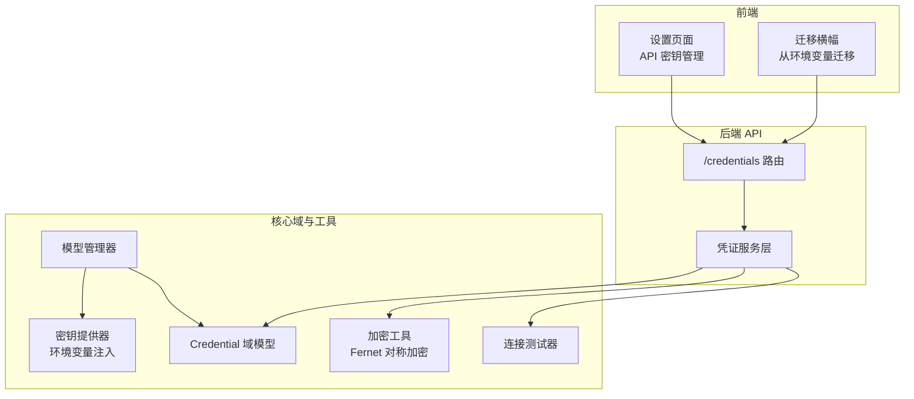
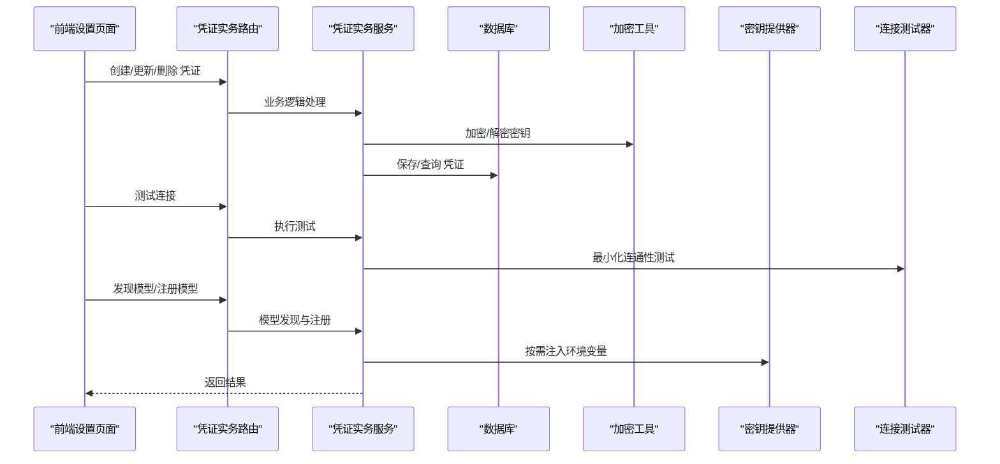
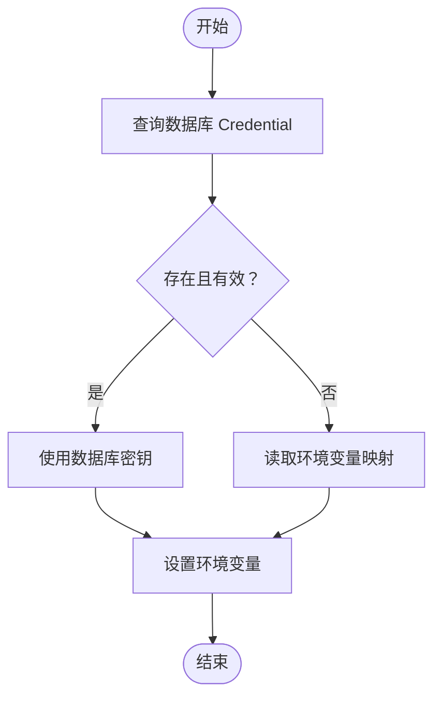
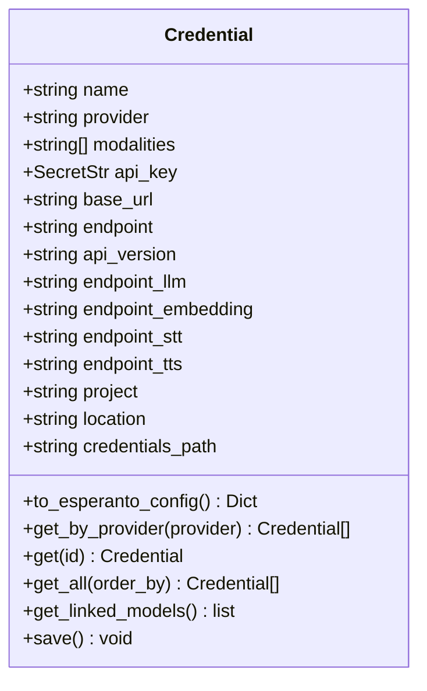
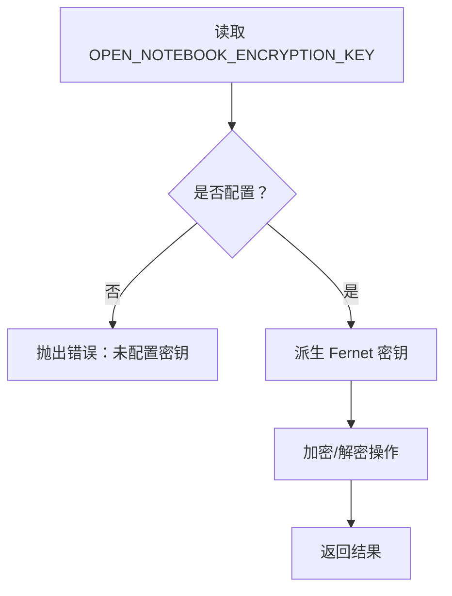
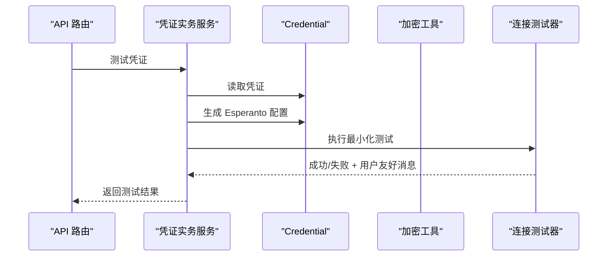
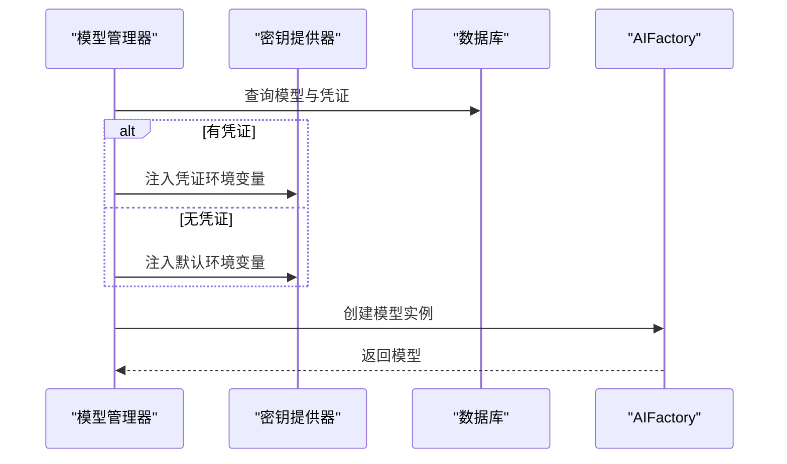
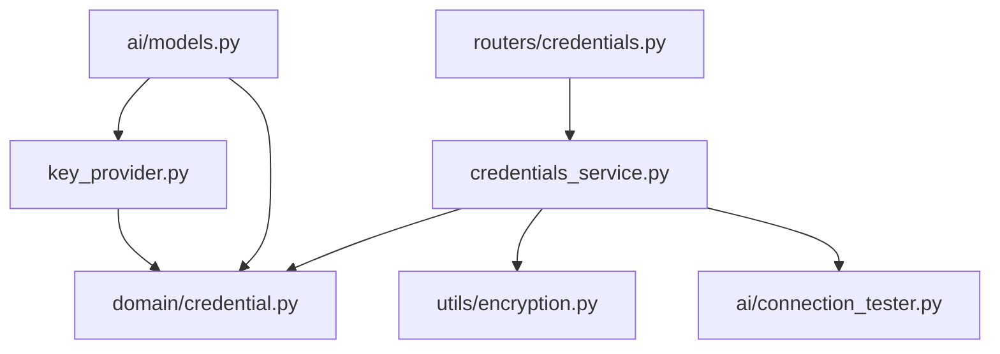

# 密钥管理与认证

<cite>
**本文档引用的文件**
- [open_notebook/ai/key_provider.py](file://open_notebook/ai/key_provider.py)
- [open_notebook/ai/provision.py](file://open_notebook/ai/provision.py)
- [open_notebook/domain/credential.py](file://open_notebook/domain/credential.py)
- [open_notebook/utils/encryption.py](file://open_notebook/utils/encryption.py)
- [api/routers/credentials.py](file://api/routers/credentials.py)
- [api/credentials_service.py](file://api/credentials_service.py)
- [open_notebook/ai/connection_tester.py](file://open_notebook/ai/connection_tester.py)
- [open_notebook/ai/models.py](file://open_notebook/ai/models.py)
- [docs/5-CONFIGURATION/security.md](file://docs/5-CONFIGURATION/security.md)
- [docs/6-TROUBLESHOOTING/quick-fixes.md](file://docs/6-TROUBLESHOOTING/quick-fixes.md)
- [.env.example](file://.env.example)
- [docs/SECURITY_REVIEW.md](file://docs/SECURITY_REVIEW.md)
</cite>

## 目录
1. [简介](#简介)
2. [项目结构](#项目结构)
3. [核心组件](#核心组件)
4. [架构总览](#架构总览)
5. [详细组件分析](#详细组件分析)
6. [依赖关系分析](#依赖关系分析)
7. [性能考虑](#性能考虑)
8. [故障排除指南](#故障排除指南)
9. [结论](#结论)
10. [附录](#附录)

## 简介
本文件为 Open Notebook 的 AI 密钥管理系统提供综合性技术文档，重点覆盖以下方面：
- 多提供商密钥存储机制：数据库优先、环境变量回退
- 密钥轮换策略与安全存储方案：基于对称加密的密文存储与密钥派生
- 验证流程、过期检测与自动刷新机制：通过连接测试与按需环境变量注入
- 环境变量配置、配置文件管理与运行时密钥注入
- 安全最佳实践、访问控制与审计日志建议
- 密钥配置示例、常见问题解决方案与安全加固指南

## 项目结构
该系统围绕“数据库优先 + 环境变量回退”的密钥管理模式构建，前端通过 API 路由进行密钥配置与迁移，后端通过领域模型与工具模块实现加密存储、按需注入与连接测试。

**图表来源**
- [api/routers/credentials.py](file://api/routers/credentials.py#L1-L387)
- [api/credentials_service.py](file://api/credentials_service.py#L1-L884)
- [open_notebook/domain/credential.py](file://open_notebook/domain/credential.py#L1-L200)
- [open_notebook/utils/encryption.py](file://open_notebook/utils/encryption.py#L1-L199)
- [open_notebook/ai/key_provider.py](file://open_notebook/ai/key_provider.py#L1-L298)
- [open_notebook/ai/connection_tester.py](file://open_notebook/ai/connection_tester.py#L1-L439)
- [open_notebook/ai/models.py](file://open_notebook/ai/models.py#L1-L267)

**章节来源**
- [api/routers/credentials.py](file://api/routers/credentials.py#L1-L387)
- [api/credentials_service.py](file://api/credentials_service.py#L1-L884)
- [open_notebook/domain/credential.py](file://open_notebook/domain/credential.py#L1-L200)
- [open_notebook/utils/encryption.py](file://open_notebook/utils/encryption.py#L1-L199)
- [open_notebook/ai/key_provider.py](file://open_notebook/ai/key_provider.py#L1-L298)
- [open_notebook/ai/connection_tester.py](file://open_notebook/ai/connection_tester.py#L1-L439)
- [open_notebook/ai/models.py](file://open_notebook/ai/models.py#L1-L267)

## 核心组件
- 数据库优先的密钥存储：Credential 域模型负责密钥的加密存储与解密读取，支持多提供商字段（如 base_url、endpoint 等）。
- 加密工具：基于 Fernet 的对称加密，支持任意字符串派生密钥，并提供 Docker secrets 支持。
- 密钥提供器：在运行时将数据库中的密钥注入到环境变量，支持简单与复杂提供商（Azure、Vertex、OpenAI-Compatible）。
- 凭证服务：提供状态检查、URL 校验、连接测试、模型发现与注册、从 ProviderConfig/环境变量迁移等能力。
- 连接测试器：针对不同提供商执行最小化连通性测试，避免泄露密钥。
- 模型管理器：在创建模型时按需注入密钥，支持默认模型与按需覆盖。

**章节来源**
- [open_notebook/domain/credential.py](file://open_notebook/domain/credential.py#L1-L200)
- [open_notebook/utils/encryption.py](file://open_notebook/utils/encryption.py#L1-L199)
- [open_notebook/ai/key_provider.py](file://open_notebook/ai/key_provider.py#L1-L298)
- [api/credentials_service.py](file://api/credentials_service.py#L1-L884)
- [open_notebook/ai/connection_tester.py](file://open_notebook/ai/connection_tester.py#L1-L439)
- [open_notebook/ai/models.py](file://open_notebook/ai/models.py#L1-L267)

## 架构总览
系统采用“数据库优先 + 环境变量回退”的密钥管理策略，前端通过 API 路由进行密钥配置与迁移，后端在模型创建或连接测试时按需注入密钥，确保密钥不被前端直接持有。

**图表来源**
- [api/routers/credentials.py](file://api/routers/credentials.py#L1-L387)
- [api/credentials_service.py](file://api/credentials_service.py#L1-L884)
- [open_notebook/utils/encryption.py](file://open_notebook/utils/encryption.py#L1-L199)
- [open_notebook/ai/key_provider.py](file://open_notebook/ai/key_provider.py#L1-L298)
- [open_notebook/ai/connection_tester.py](file://open_notebook/ai/connection_tester.py#L1-L439)

## 详细组件分析

### 组件一：密钥提供器（数据库优先 + 环境变量回退）
- 功能要点
  - 提供统一的密钥检索接口，优先从数据库 Credential 记录读取，失败则回退到环境变量。
  - 支持简单提供商（仅 API Key）与复杂提供商（Azure、Vertex、OpenAI-Compatible）的多字段注入。
  - 提供批量注入与单个提供商注入两种方式，推荐在模型创建前按需注入。
- 关键流程
  - 获取密钥：先查数据库，再查环境变量。
  - 注入环境变量：根据提供商映射设置对应环境变量，复杂提供商分别设置多个字段。
- 安全性
  - 不在内存中长期缓存密钥；按需注入，降低暴露风险。
  - 复杂提供商注入多个环境变量，但不返回明文密钥。

**图表来源**
- [open_notebook/ai/key_provider.py](file://open_notebook/ai/key_provider.py#L68-L134)

**章节来源**
- [open_notebook/ai/key_provider.py](file://open_notebook/ai/key_provider.py#L1-L298)

### 组件二：凭证域模型（加密存储与链接模型）
- 功能要点
  - 每条记录对应单一提供商的凭据，支持多种模态与多字段配置。
  - 保存前加密 API Key，读取时解密，保证数据库中密文存储。
  - 可查询关联的模型列表，便于迁移与删除时的联动处理。
- 关键点
  - _prepare_save_data：对 api_key 进行加密后再入库。
  - get/get_all：读取时自动解密并重封装为 SecretStr。
  - to_esperanto_config：生成 Esperanto/AIFactory 所需的配置字典。

**图表来源**
- [open_notebook/domain/credential.py](file://open_notebook/domain/credential.py#L29-L200)

**章节来源**
- [open_notebook/domain/credential.py](file://open_notebook/domain/credential.py#L1-L200)

### 组件三：加密工具（Fernet 对称加密）
- 功能要点
  - 使用 Fernet（AES-128-CBC + HMAC-SHA256）进行对称加密。
  - 支持任意字符串作为密钥，内部通过 SHA-256 派生有效密钥。
  - 支持 Docker secrets 模式（_FILE 后缀），提升生产部署安全性。
- 关键点
  - get_secret_from_env：优先读取 _FILE，再回退到直接环境变量。
  - lazy 初始化：首次使用时才加载密钥，避免启动时未配置导致崩溃。
  - 降级兼容：对历史明文数据进行兼容处理。

**图表来源**
- [open_notebook/utils/encryption.py](file://open_notebook/utils/encryption.py#L29-L126)

**章节来源**
- [open_notebook/utils/encryption.py](file://open_notebook/utils/encryption.py#L1-L199)

### 组件四：凭证实务服务（状态、测试、迁移、模型发现）
- 功能要点
  - get_provider_status：检查各提供商的配置来源（数据库/环境变量）与加密状态。
  - test_credential：对指定凭证执行最小化连通性测试，不返回密钥。
  - discover_with_config/register_models：基于凭证配置发现模型并注册到数据库。
  - migrate_from_provider_config/migrate_from_env：从旧 ProviderConfig 或环境变量迁移至数据库。
  - validate_url：URL 校验，防止 SSRF（允许私网地址用于自托管场景，阻断链路本地地址）。
- 安全性
  - 所有错误消息均进行通用化处理，避免泄露敏感信息。
  - URL 校验严格限制链路本地地址与相关绕过形式。

**图表来源**
- [api/credentials_service.py](file://api/credentials_service.py#L356-L466)
- [open_notebook/ai/connection_tester.py](file://open_notebook/ai/connection_tester.py#L170-L300)

**章节来源**
- [api/credentials_service.py](file://api/credentials_service.py#L1-L884)
- [open_notebook/ai/connection_tester.py](file://open_notebook/ai/connection_tester.py#L1-L439)

### 组件五：模型管理器（按需注入与创建）
- 功能要点
  - get_model：根据模型 ID 获取模型实例，若模型关联凭证则使用凭证配置，否则回退到环境变量注入。
  - normalize provider：将数据库中的下划线提供商名转换为期望的连字符格式。
  - 缓存策略：交由 Esperanto 管理实际模型实例缓存。
- 安全性
  - 不在内存中保留明文密钥；仅在创建模型时临时注入环境变量。

**图表来源**
- [open_notebook/ai/models.py](file://open_notebook/ai/models.py#L97-L176)
- [open_notebook/ai/key_provider.py](file://open_notebook/ai/key_provider.py#L236-L271)

**章节来源**
- [open_notebook/ai/models.py](file://open_notebook/ai/models.py#L1-L267)
- [open_notebook/ai/key_provider.py](file://open_notebook/ai/key_provider.py#L1-L298)

### 组件六：前端集成与迁移
- 设置页面：显示加密状态与凭证列表，不返回明文密钥。
- 迁移横幅：一键从 ProviderConfig 或环境变量迁移至数据库。
- 迁移钩子：成功后刷新状态与模型列表，失败提示用户。

**章节来源**
- [api/routers/credentials.py](file://api/routers/credentials.py#L1-L387)
- [frontend/src/lib/hooks/use-credentials.ts](file://frontend/src/lib/hooks/use-credentials.ts#L287-L388)

## 依赖关系分析

**图表来源**
- [open_notebook/ai/key_provider.py](file://open_notebook/ai/key_provider.py#L1-L298)
- [open_notebook/domain/credential.py](file://open_notebook/domain/credential.py#L1-L200)
- [api/credentials_service.py](file://api/credentials_service.py#L1-L884)
- [open_notebook/utils/encryption.py](file://open_notebook/utils/encryption.py#L1-L199)
- [open_notebook/ai/connection_tester.py](file://open_notebook/ai/connection_tester.py#L1-L439)
- [open_notebook/ai/models.py](file://open_notebook/ai/models.py#L1-L267)
- [api/routers/credentials.py](file://api/routers/credentials.py#L1-L387)

**章节来源**
- [open_notebook/ai/key_provider.py](file://open_notebook/ai/key_provider.py#L1-L298)
- [open_notebook/domain/credential.py](file://open_notebook/domain/credential.py#L1-L200)
- [api/credentials_service.py](file://api/credentials_service.py#L1-L884)
- [open_notebook/utils/encryption.py](file://open_notebook/utils/encryption.py#L1-L199)
- [open_notebook/ai/connection_tester.py](file://open_notebook/ai/connection_tester.py#L1-L439)
- [open_notebook/ai/models.py](file://open_notebook/ai/models.py#L1-L267)
- [api/routers/credentials.py](file://api/routers/credentials.py#L1-L387)

## 性能考虑
- 按需注入：仅在创建模型或测试连接时注入环境变量，避免全局污染与不必要的 IO。
- 缓存策略：模型实例由 Esperanto 缓存，减少重复初始化开销。
- URL 校验：在迁移与配置阶段进行严格的 URL 校验，避免无效请求带来的网络延迟。
- 并发与资源：合理设置并发参数，避免数据库连接过多导致的拥塞。

[本节为通用指导，无需特定文件分析]

## 故障排除指南
- “无法连接到服务器”：检查 API 端口与容器状态，确认健康检查可用。
- “无效 API 密钥或模型不可用”：在设置页面测试连接，必要时重新创建凭证并执行模型发现与注册。
- “端口占用”：修改 docker-compose 映射端口或释放占用端口。
- “数据库连接过多”：降低并发任务数以提高稳定性。
- “启动慢/下载超时（国内网络）”：增加下载超时或使用镜像源。

**章节来源**
- [docs/6-TROUBLESHOOTING/quick-fixes.md](file://docs/6-TROUBLESHOOTING/quick-fixes.md#L1-L373)

## 结论
该密钥管理系统通过“数据库优先 + 环境变量回退”的设计，在保障密钥安全存储的同时提供了灵活的配置与迁移能力。结合最小化连接测试、严格的 URL 校验与 Docker secrets 支持，系统在开发与生产环境中均具备良好的可运维性与安全性。建议在生产中启用强密码保护与 HTTPS，配合防火墙与反向代理进一步加固。

[本节为总结性内容，无需特定文件分析]

## 附录

### 环境变量与配置参考
- 必填项：OPEN_NOTEBOOK_ENCRYPTION_KEY（用于数据库中 API Key 的加密存储）
- 可选项：各提供商 API Key、基础 URL、端点、版本号等
- 示例文件：.env.example

**章节来源**
- [.env.example](file://.env.example#L1-L60)

### 安全最佳实践
- 强制开启加密：未配置 OPEN_NOTEBOOK_ENCRYPTION_KEY 时无法保存凭证。
- Docker secrets：使用 _FILE 形式注入密钥与密码。
- 密钥轮换：当前版本不支持密钥轮换，更换密钥需重新保存所有凭证。
- 生产加固：启用 HTTPS、强密码、防火墙、反向代理与访问控制。

**章节来源**
- [docs/5-CONFIGURATION/security.md](file://docs/5-CONFIGURATION/security.md#L1-L397)
- [docs/SECURITY_REVIEW.md](file://docs/SECURITY_REVIEW.md#L1-L97)

### 访问控制与审计日志
- 访问控制：基本的 Bearer Token 认证，未实现细粒度权限与会话超时。
- 审计日志：当前未内置审计日志功能，建议通过外部日志聚合服务实现。

**章节来源**
- [docs/5-CONFIGURATION/security.md](file://docs/5-CONFIGURATION/security.md#L291-L327)