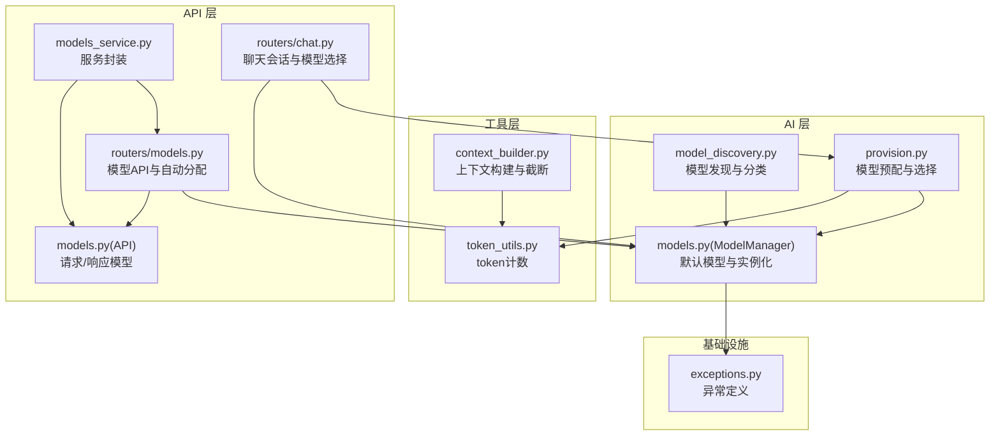
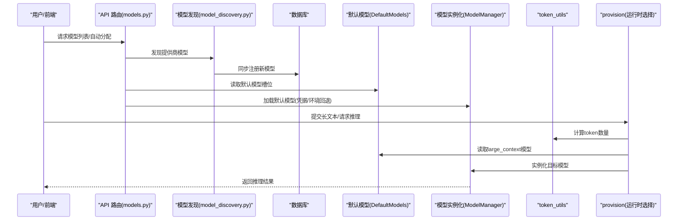
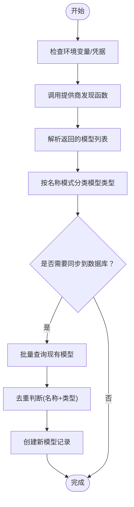
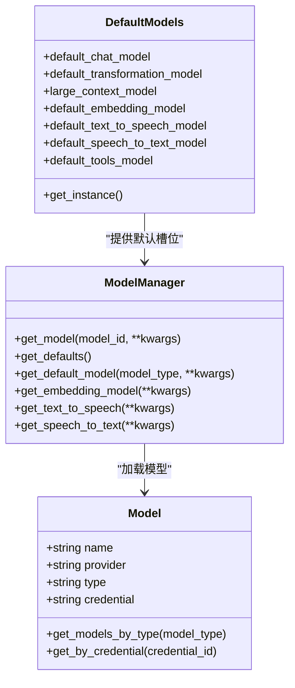
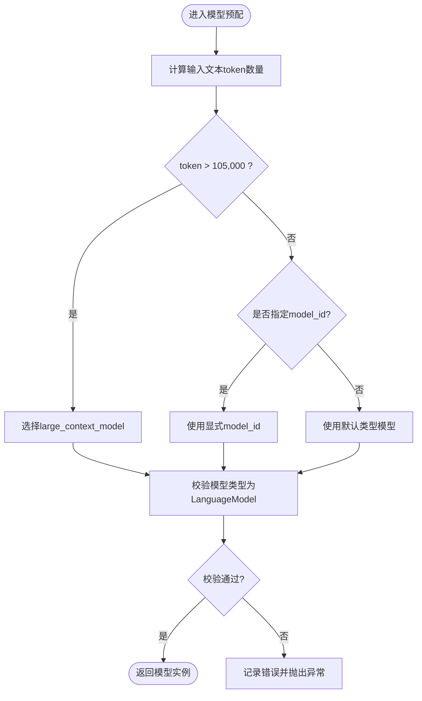
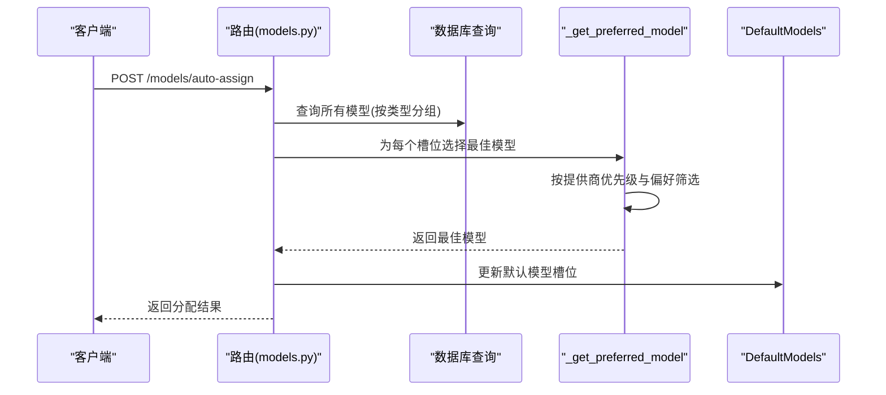
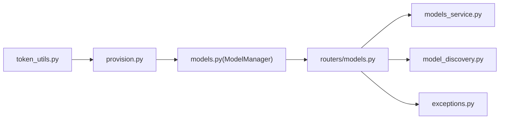

# 模型发现与选择

<cite>
**本文引用的文件**
- [model_discovery.py](file://open_notebook/ai/model_discovery.py)
- [models.py](file://open_notebook/ai/models.py)
- [models_service.py](file://api/models_service.py)
- [models.py（API）](file://api/models.py)
- [token_utils.py](file://open_notebook/utils/token_utils.py)
- [provision.py](file://open_notebook/ai/provision.py)
- [context_builder.py](file://open_notebook/utils/context_builder.py)
- [models.py（路由）](file://api/routers/models.py)
- [chat.py（路由）](file://api/routers/chat.py)
- [exceptions.py](file://open_notebook/exceptions.py)
</cite>

## 目录
1. [简介](#简介)
2. [项目结构](#项目结构)
3. [核心组件](#核心组件)
4. [架构总览](#架构总览)
5. [详细组件分析](#详细组件分析)
6. [依赖关系分析](#依赖关系分析)
7. [性能考量](#性能考量)
8. [故障排除指南](#故障排除指南)
9. [结论](#结论)

## 简介
本文件系统性阐述“模型发现与选择”机制，覆盖以下关键点：
- 基于内容长度的模型自动选择算法：当输入文本超过阈值时，自动切换到“大上下文模型”。
- 模型ID优先级规则：按提供商优先级与模型偏好模式进行优选。
- 默认模型配置策略：通过数据库记录的默认模型槽位进行统一管理。
- large_context 模型的选择逻辑、token 计数计算方法与模型类型验证机制。
- 模型配置检查、错误处理与日志记录实现。
- 最佳实践、性能优化建议与故障排除指南。

## 项目结构
围绕模型发现与选择的相关模块分布如下：
- AI 层：模型发现、模型管理与实例化、模型预配
- 工具层：token 计数工具、上下文构建器
- API 层：模型查询、自动分配默认模型、测试连接等接口
- 异常与日志：统一异常体系与日志记录

图表来源
- [model_discovery.py](file://open_notebook/ai/model_discovery.py#L1-L757)
- [models.py](file://open_notebook/ai/models.py#L1-L267)
- [provision.py](file://open_notebook/ai/provision.py#L1-L61)
- [token_utils.py](file://open_notebook/utils/token_utils.py#L1-L48)
- [context_builder.py](file://open_notebook/utils/context_builder.py#L1-L200)
- [models.py（路由）](file://api/routers/models.py#L1-L771)
- [models_service.py](file://api/models_service.py#L1-L113)
- [models.py（API）](file://api/models.py#L1-L685)
- [chat.py（路由）](file://api/routers/chat.py#L1-L200)
- [exceptions.py](file://open_notebook/exceptions.py#L1-L71)

章节来源
- [model_discovery.py](file://open_notebook/ai/model_discovery.py#L1-L757)
- [models.py](file://open_notebook/ai/models.py#L1-L267)
- [provision.py](file://open_notebook/ai/provision.py#L1-L61)
- [token_utils.py](file://open_notebook/utils/token_utils.py#L1-L48)
- [context_builder.py](file://open_notebook/utils/context_builder.py#L1-L200)
- [models.py（路由）](file://api/routers/models.py#L1-L771)
- [models_service.py](file://api/models_service.py#L1-L113)
- [models.py（API）](file://api/models.py#L1-L685)
- [chat.py（路由）](file://api/routers/chat.py#L1-L200)
- [exceptions.py](file://open_notebook/exceptions.py#L1-L71)

## 核心组件
- 模型发现与分类：从各提供商拉取可用模型列表，并按名称模式分类为语言、嵌入、语音识别或语音合成模型。
- 默认模型与实例化：通过数据库记录的默认模型槽位加载对应模型；支持凭据注入与环境变量回退。
- 模型预配与选择：根据输入内容长度阈值自动选择 large_context 模型，否则按显式 model_id 或默认类型选择。
- token 计数与上下文截断：使用 o200k_base 编码估算 token 数量；上下文构建器支持按最大 token 截断。
- API 自动分配：按提供商优先级与模型偏好模式，自动为各类默认槽位分配最优可用模型。

章节来源
- [model_discovery.py](file://open_notebook/ai/model_discovery.py#L135-L166)
- [models.py](file://open_notebook/ai/models.py#L97-L267)
- [provision.py](file://open_notebook/ai/provision.py#L9-L61)
- [token_utils.py](file://open_notebook/utils/token_utils.py#L15-L48)
- [context_builder.py](file://open_notebook/utils/context_builder.py#L21-L200)
- [models.py（路由）](file://api/routers/models.py#L634-L771)

## 架构总览
模型发现与选择贯穿“发现—登记—配置—实例化—调用”的完整链路，同时在运行时依据输入规模动态选择合适模型。

图表来源
- [models.py（路由）](file://api/routers/models.py#L165-L200)
- [model_discovery.py](file://open_notebook/ai/model_discovery.py#L632-L724)
- [models.py](file://open_notebook/ai/models.py#L61-L95)
- [models.py](file://open_notebook/ai/models.py#L97-L267)
- [token_utils.py](file://open_notebook/utils/token_utils.py#L15-L48)
- [provision.py](file://open_notebook/ai/provision.py#L9-L61)

## 详细组件分析

### 组件A：模型发现与分类
- 功能要点
  - 针对多家提供商（OpenAI、Anthropic、Google、Ollama、Groq、Mistral、DeepSeek、xAI、OpenRouter、Voyage、ElevenLabs、OpenAI-Compatible 等）分别实现发现函数。
  - 使用名称模式映射进行模型类型分类（语言、嵌入、语音识别、语音合成），部分提供商采用静态清单。
  - 支持同步到数据库：批量去重、新增与现有统计。
- 关键数据结构
  - DiscoveredModel：包含 name、provider、model_type、description。
  - PROVIDER_DISCOVERY_FUNCTIONS：提供商到发现函数的映射。
- 错误处理与日志
  - 对每个提供商的发现过程捕获异常并记录警告，避免中断整体流程。
  - 同步阶段对数据库查询失败进行降级处理，保证幂等性。

图表来源
- [model_discovery.py](file://open_notebook/ai/model_discovery.py#L173-L204)
- [model_discovery.py](file://open_notebook/ai/model_discovery.py#L632-L696)

章节来源
- [model_discovery.py](file://open_notebook/ai/model_discovery.py#L135-L166)
- [model_discovery.py](file://open_notebook/ai/model_discovery.py#L589-L630)
- [model_discovery.py](file://open_notebook/ai/model_discovery.py#L632-L724)

### 组件B：默认模型与实例化
- 功能要点
  - DefaultModels：记录默认模型槽位（如 default_chat_model、large_context_model、default_embedding_model 等）。
  - ModelManager：按类型加载模型，支持凭据注入与环境变量回退；校验模型类型合法性；将 Esperanto 的 provider 名称规范化为连字符形式。
  - 类型验证：仅允许 language、embedding、speech_to_text、text_to_speech 四类模型。
- 关键路径
  - get_default_model：根据类型选择对应槽位，若未配置则记录警告并返回 None。
  - get_model：加载指定 ID 的模型，合并 kwargs 参数，实例化对应类型的 Esperanto 模型。

图表来源
- [models.py](file://open_notebook/ai/models.py#L61-L95)
- [models.py](file://open_notebook/ai/models.py#L97-L267)

章节来源
- [models.py](file://open_notebook/ai/models.py#L61-L95)
- [models.py](file://open_notebook/ai/models.py#L97-L267)

### 组件C：基于内容长度的模型自动选择
- 算法概述
  - 输入文本经 token_count 计算 token 数量。
  - 若 token 数超过阈值（例如 105,000），优先选择 large_context_model。
  - 否则若显式传入 model_id，则直接使用该模型。
  - 否则回退到默认类型模型。
  - 最终校验模型类型必须为 LanguageModel，否则抛出错误。
- token 计数
  - 优先使用 o200k_base 编码；若导入失败则使用单词数估算（每词约 1.3 个 token）。
- 日志与错误
  - 记录选择原因与最终模型；若无模型可选或类型不匹配，记录错误并抛出异常。

图表来源
- [provision.py](file://open_notebook/ai/provision.py#L9-L61)
- [token_utils.py](file://open_notebook/utils/token_utils.py#L15-L48)

章节来源
- [provision.py](file://open_notebook/ai/provision.py#L9-L61)
- [token_utils.py](file://open_notebook/utils/token_utils.py#L15-L48)

### 组件D：API 自动分配默认模型
- 优先级规则
  - PROVIDER_PRIORITY 定义提供商优先顺序（如 OpenAI、Anthropic、Google 等）。
  - MODEL_PREFERENCES 定义各提供商内的偏好模型名称模式（如 gpt-4o、claude-3-5-sonnet 等）。
- 选择逻辑
  - 将可用模型按类型分组，遍历 PROVIDER_PRIORITY，优先选择匹配 MODEL_PREFERENCES 的模型；若无偏好匹配则选择首个可用模型。
  - 对每个默认槽位（如 default_chat_model、large_context_model、default_embedding_model 等）执行上述流程，跳过已有值的槽位。
- 结果
  - 返回已分配、已跳过、缺失槽位的统计信息，并持久化更新默认模型记录。

图表来源
- [models.py（路由）](file://api/routers/models.py#L678-L771)
- [models.py（路由）](file://api/routers/models.py#L634-L676)

章节来源
- [models.py（路由）](file://api/routers/models.py#L87-L109)
- [models.py（路由）](file://api/routers/models.py#L634-L771)

### 组件E：上下文构建与截断
- 上下文构建器 ContextBuilder
  - 将来源、笔记、洞察等聚合为 ContextItem，自动计算 token 数量。
  - 支持去重、优先级排序与按最大 token 截断。
- 截断策略
  - 当设置 max_tokens 时，按优先级移除项直至满足上限，确保最终 token 数不超过阈值。
- 与 token 计数的关系
  - ContextItem 在初始化时调用 token_count 计算内容 token 数；ContextBuilder 在格式化响应时汇总 total_tokens。

章节来源
- [context_builder.py](file://open_notebook/utils/context_builder.py#L21-L200)
- [context_builder.py](file://open_notebook/utils/context_builder.py#L346-L391)
- [token_utils.py](file://open_notebook/utils/token_utils.py#L15-L48)

## 依赖关系分析
- 模块耦合
  - ModelManager 依赖 DefaultModels 与 Credential，负责模型实例化与类型校验。
  - provision 依赖 token_utils 进行 token 计数，依赖 ModelManager 获取默认模型。
  - API 路由依赖 ModelManager 与 DefaultModels，提供模型查询与自动分配。
- 外部依赖
  - Esperanto：统一的 AI 模型工厂，负责具体提供商的模型实例化。
  - httpx：异步 HTTP 客户端，用于各提供商模型发现。
  - loguru：统一日志记录。
- 循环依赖
  - 未见循环依赖；各模块职责清晰，通过接口与服务层解耦。

图表来源
- [provision.py](file://open_notebook/ai/provision.py#L1-L61)
- [models.py](file://open_notebook/ai/models.py#L1-L267)
- [models.py（路由）](file://api/routers/models.py#L1-L200)
- [models_service.py](file://api/models_service.py#L1-L113)
- [model_discovery.py](file://open_notebook/ai/model_discovery.py#L1-L757)
- [exceptions.py](file://open_notebook/exceptions.py#L1-L71)

章节来源
- [models.py](file://open_notebook/ai/models.py#L1-L267)
- [models.py（路由）](file://api/routers/models.py#L1-L200)
- [provision.py](file://open_notebook/ai/provision.py#L1-L61)
- [model_discovery.py](file://open_notebook/ai/model_discovery.py#L1-L757)
- [models_service.py](file://api/models_service.py#L1-L113)
- [exceptions.py](file://open_notebook/exceptions.py#L1-L71)

## 性能考量
- 模型发现
  - 并行发现多个提供商模型，减少等待时间；对每个提供商独立超时控制，避免阻塞。
  - 同步阶段批量查询现有模型，降低 N+1 查询开销。
- token 计数
  - 优先使用缓存编码表（TIKTOKEN_CACHE_DIR），提升重复计算性能。
  - 导入失败时使用简单估算，避免阻塞。
- 上下文构建
  - 先去重再排序，最后按阈值截断，避免无效计算。
- 实例化缓存
  - Esperanto 工厂对模型实例进行缓存，减少重复初始化成本。

章节来源
- [model_discovery.py](file://open_notebook/ai/model_discovery.py#L708-L724)
- [token_utils.py](file://open_notebook/utils/token_utils.py#L10-L12)
- [context_builder.py](file://open_notebook/utils/context_builder.py#L129-L134)

## 故障排除指南
- “未配置默认模型”
  - 现象：调用 get_default_model 返回 None 并记录警告。
  - 排查：前往设置页面配置对应类型的默认模型；或通过 API 自动分配功能生成默认槽位。
  - 参考：[models.py](file://open_notebook/ai/models.py#L220-L264)
- “模型类型不匹配”
  - 现象：期望 LanguageModel 却得到其他类型模型，抛出错误。
  - 排查：确认默认模型槽位配置的是语言模型；检查模型类型字段是否正确。
  - 参考：[provision.py](file://open_notebook/ai/provision.py#L49-L58)
- “无可用模型”
  - 现象：自动分配返回 missing 列表，提示某些槽位无可用模型。
  - 排查：检查模型发现是否成功、模型类型是否正确、是否被过滤。
  - 参考：[models.py（路由）](file://api/routers/models.py#L733-L743)
- “token 计数异常”
  - 现象：tiktoken 导入失败导致估算偏差。
  - 排查：安装 tiktoken；或接受估算误差；必要时调整阈值。
  - 参考：[token_utils.py](file://open_notebook/utils/token_utils.py#L31-L33)
- “上下文超出阈值”
  - 现象：构建上下文后 token 超标。
  - 排查：降低 max_tokens 或减少高优先级项；检查 ContextBuilder 的优先权重。
  - 参考：[context_builder.py](file://open_notebook/utils/context_builder.py#L132-L134)

章节来源
- [models.py](file://open_notebook/ai/models.py#L220-L264)
- [provision.py](file://open_notebook/ai/provision.py#L49-L58)
- [models.py（路由）](file://api/routers/models.py#L733-L743)
- [token_utils.py](file://open_notebook/utils/token_utils.py#L31-L33)
- [context_builder.py](file://open_notebook/utils/context_builder.py#L132-L134)

## 结论
本机制通过“发现—登记—配置—实例化—运行时选择”的闭环，实现了灵活、可扩展且健壮的模型管理与选择能力。基于内容长度的自动切换与严格的类型验证，既保证了性能与成本控制，也提升了系统的可靠性。配合 API 的自动分配与完善的日志/异常体系，便于运维与排错。