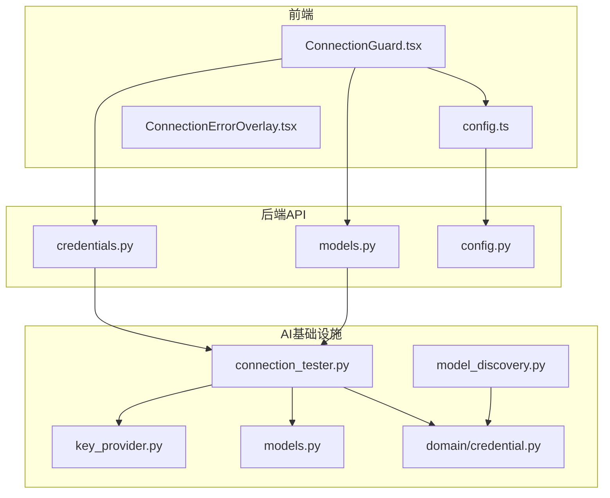
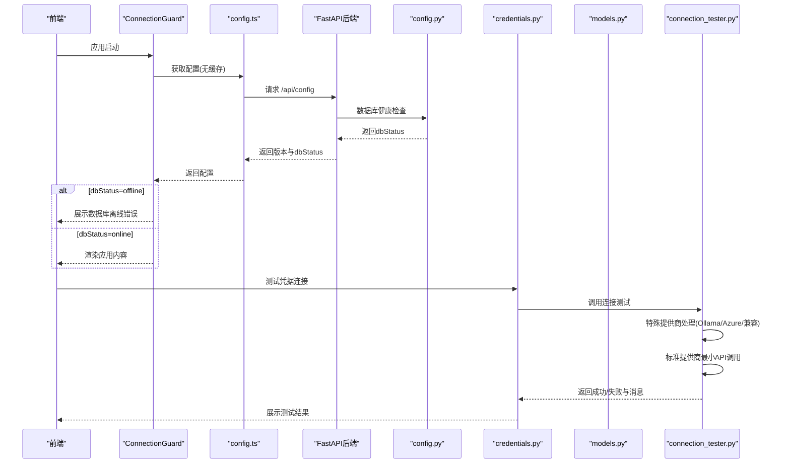
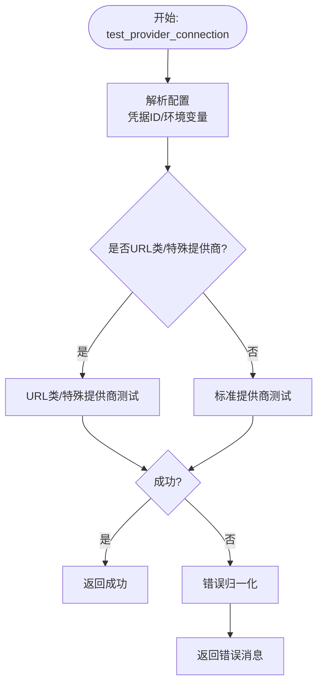
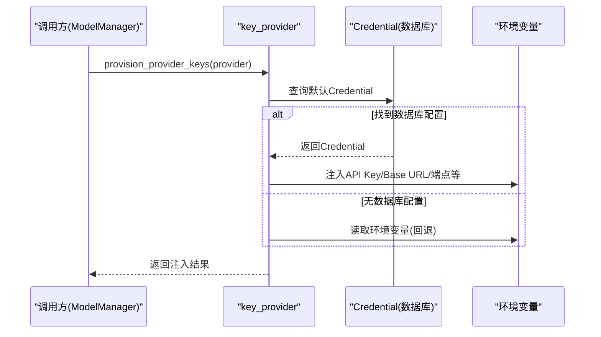
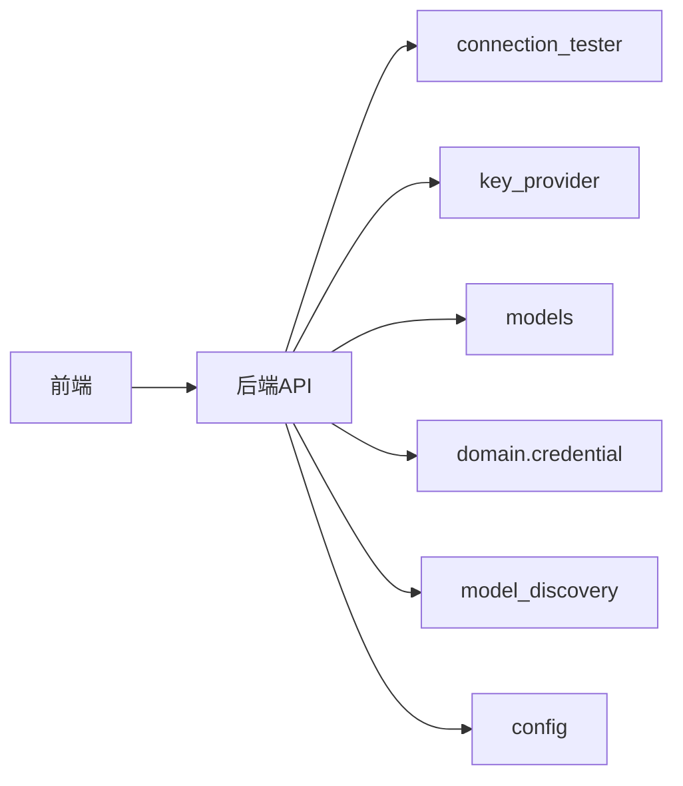

# 连接测试与健康检查

<cite>
**本文档引用的文件**
- [open_notebook/ai/connection_tester.py](file://open_notebook/ai/connection_tester.py)
- [open_notebook/ai/key_provider.py](file://open_notebook/ai/key_provider.py)
- [open_notebook/ai/models.py](file://open_notebook/ai/models.py)
- [open_notebook/ai/model_discovery.py](file://open_notebook/ai/model_discovery.py)
- [open_notebook/domain/credential.py](file://open_notebook/domain/credential.py)
- [api/routers/credentials.py](file://api/routers/credentials.py)
- [api/routers/models.py](file://api/routers/models.py)
- [api/routers/config.py](file://api/routers/config.py)
- [frontend/src/components/common/ConnectionGuard.tsx](file://frontend/src/components/common/ConnectionGuard.tsx)
- [frontend/src/lib/config.ts](file://frontend/src/lib/config.ts)
- [frontend/src/components/errors/ConnectionErrorOverlay.tsx](file://frontend/src/components/errors/ConnectionErrorOverlay.tsx)
</cite>

## 更新摘要
**变更内容**
- 新增中国AI提供商连接测试功能支持
- 添加阿里云百炼和硅基流动的测试模型配置
- 更新连接测试器以支持新增提供商
- 增强模型发现器以包含中文服务商支持
- 完善凭证提供器的初始化配置

## 目录
1. [简介](#简介)
2. [项目结构](#项目结构)
3. [核心组件](#核心组件)
4. [架构总览](#架构总览)
5. [详细组件分析](#详细组件分析)
6. [依赖关系分析](#依赖关系分析)
7. [性能考虑](#性能考虑)
8. [故障排查指南](#故障排查指南)
9. [结论](#结论)

## 简介
本文件系统化阐述本项目的连接测试与健康检查体系，覆盖以下关键能力：
- 连接状态检测：针对多AI提供商（含本地/自托管）进行最小成本的连通性验证
- 网络连通性测试：对URL类提供商（如Ollama、OpenAI兼容服务）进行端点可达性校验
- API可用性验证：通过最小API调用验证凭据有效性与模型可用性
- 超时配置与重试策略：统一的HTTP客户端超时设置与错误归一化
- 故障转移与降级：基于凭据优先与环境变量回退的配置加载链路
- 性能指标监控：通过日志与版本检查接口暴露运行状态
- 异常处理：统一的错误消息归一化与前端可视化展示
- 连接池管理与资源清理：基于异步HTTP客户端的短生命周期模式
- 状态缓存：前端配置缓存与后端版本检查缓存
- 配置示例与调优建议：提供可操作的配置清单与性能优化要点
- 故障诊断工具：结合前端连接守卫与后端健康检查接口进行定位
- **新增**：中国AI提供商支持，包括阿里云百炼和硅基流动的连接测试

## 项目结构
该功能横跨后端API层、AI基础设施层与前端UI层，形成"配置-测试-展示"的闭环。

**图表来源**
- [frontend/src/components/common/ConnectionGuard.tsx](file://frontend/src/components/common/ConnectionGuard.tsx#L1-L108)
- [frontend/src/lib/config.ts](file://frontend/src/lib/config.ts#L110-L148)
- [frontend/src/components/errors/ConnectionErrorOverlay.tsx](file://frontend/src/components/errors/ConnectionErrorOverlay.tsx#L1-L175)
- [api/routers/credentials.py](file://api/routers/credentials.py#L1-L387)
- [api/routers/models.py](file://api/routers/models.py#L1-L771)
- [api/routers/config.py](file://api/routers/config.py#L1-L161)
- [open_notebook/ai/connection_tester.py](file://open_notebook/ai/connection_tester.py#L1-L445)
- [open_notebook/ai/key_provider.py](file://open_notebook/ai/key_provider.py#L1-L465)
- [open_notebook/ai/model_discovery.py](file://open_notebook/ai/model_discovery.py#L1-L1071)
- [open_notebook/ai/models.py](file://open_notebook/ai/models.py#L1-L267)
- [open_notebook/domain/credential.py](file://open_notebook/domain/credential.py#L1-L200)

**章节来源**
- [open_notebook/ai/connection_tester.py](file://open_notebook/ai/connection_tester.py#L1-L445)
- [open_notebook/ai/key_provider.py](file://open_notebook/ai/key_provider.py#L1-L465)
- [open_notebook/ai/models.py](file://open_notebook/ai/models.py#L1-L267)
- [open_notebook/ai/model_discovery.py](file://open_notebook/ai/model_discovery.py#L1-L1071)
- [open_notebook/domain/credential.py](file://open_notebook/domain/credential.py#L1-L200)
- [api/routers/credentials.py](file://api/routers/credentials.py#L1-L387)
- [api/routers/models.py](file://api/routers/models.py#L1-L771)
- [api/routers/config.py](file://api/routers/config.py#L1-L161)
- [frontend/src/components/common/ConnectionGuard.tsx](file://frontend/src/components/common/ConnectionGuard.tsx#L1-L108)
- [frontend/src/lib/config.ts](file://frontend/src/lib/config.ts#L110-L148)
- [frontend/src/components/errors/ConnectionErrorOverlay.tsx](file://frontend/src/components/errors/ConnectionErrorOverlay.tsx#L1-L175)

## 核心组件
- 连接测试器：提供统一的连接测试入口，支持标准提供商与URL类提供商，并对错误进行用户友好化
- 凭证提供器：从数据库凭证与环境变量中加载API密钥与基础配置，支持Azure/Vertex/OpenAI兼容等复杂场景
- 模型管理器：按需构建模型实例，负责配置合并与类型分发
- 模型发现器：自动拉取各提供商可用模型列表，支持静态模型与动态API发现
- 前端连接守卫：在应用启动阶段进行健康检查与错误展示，支持重试与键盘快捷键
- 后端健康检查：提供版本检查与数据库健康检查接口，返回前端所需状态信息

**章节来源**
- [open_notebook/ai/connection_tester.py](file://open_notebook/ai/connection_tester.py#L170-L300)
- [open_notebook/ai/key_provider.py](file://open_notebook/ai/key_provider.py#L236-L271)
- [open_notebook/ai/models.py](file://open_notebook/ai/models.py#L97-L176)
- [open_notebook/ai/model_discovery.py](file://open_notebook/ai/model_discovery.py#L608-L724)
- [frontend/src/components/common/ConnectionGuard.tsx](file://frontend/src/components/common/ConnectionGuard.tsx#L18-L81)
- [api/routers/config.py](file://api/routers/config.py#L102-L160)

## 架构总览
下图展示了从前端到后端的健康检查与连接测试流程：

**图表来源**
- [frontend/src/components/common/ConnectionGuard.tsx](file://frontend/src/components/common/ConnectionGuard.tsx#L18-L81)
- [frontend/src/lib/config.ts](file://frontend/src/lib/config.ts#L110-L148)
- [api/routers/config.py](file://api/routers/config.py#L123-L160)
- [api/routers/credentials.py](file://api/routers/credentials.py#L313-L317)
- [open_notebook/ai/connection_tester.py](file://open_notebook/ai/connection_tester.py#L170-L300)

## 详细组件分析

### 连接测试器（connection_tester）
- 功能职责
  - 支持标准提供商（OpenAI、Anthropic、Google、Groq、Mistral、DeepSeek、xAI、OpenRouter、Voyage、ElevenLabs）与URL类提供商（Ollama、OpenAI兼容）、Azure特殊处理
  - **新增**：支持中国AI提供商（阿里云百炼、硅基流动）的连接测试
  - 对每个提供商选择最小/最便宜的测试模型，减少成本与延迟
  - 统一错误消息归一化，区分认证失败、权限不足、速率限制、网络超时等场景
  - 支持按凭据ID进行定向测试，或使用默认配置
- 关键流程
  - 解析配置：优先使用指定凭据，否则回退至环境变量
  - 特殊处理：Ollama通过/api/tags端点；Azure通过/openai/models端点；OpenAI兼容通过/models端点
  - 标准路径：通过AIFactory创建模型，执行最小调用（语言模型为简单请求，嵌入模型为单条向量生成，TTS为实例化验证）
  - 错误归一化：将常见错误模式映射为用户可理解的消息
- 超时与重试
  - HTTP客户端超时固定为10秒（URL类），兼容类为30秒
  - 未实现自动重试逻辑，错误直接反馈给上层
- 性能与资源
  - 使用异步HTTP客户端，短生命周期请求，避免连接池占用
  - 日志记录用于问题定位，不持久化敏感信息

**图表来源**
- [open_notebook/ai/connection_tester.py](file://open_notebook/ai/connection_tester.py#L170-L300)
- [open_notebook/ai/connection_tester.py](file://open_notebook/ai/connection_tester.py#L367-L445)

**章节来源**
- [open_notebook/ai/connection_tester.py](file://open_notebook/ai/connection_tester.py#L170-L300)
- [open_notebook/ai/connection_tester.py](file://open_notebook/ai/connection_tester.py#L367-L445)

### 凭证提供器（key_provider）
- 功能职责
  - 将数据库中的Credential记录转换为环境变量，供Esperanto读取
  - 支持Azure/Vertex/OpenAI兼容等多字段配置的环境变量注入
  - **新增**：支持阿里云百炼和硅基流动的凭证初始化
  - 提供按提供商批量注入与按需注入两种方式
- 关键点
  - 简单提供商：仅API Key
  - 复杂提供商：多端点/多参数，分别注入对应环境变量
  - 回退策略：若数据库无配置，则使用环境变量作为最终兜底
  - **新增**：PROVIDER_INIT_CONFIG中包含阿里云百炼(DASHSCOPE_API_KEY)和硅基流动(SILICONFLOW_API_KEY)的配置

**图表来源**
- [open_notebook/ai/key_provider.py](file://open_notebook/ai/key_provider.py#L236-L271)
- [open_notebook/ai/key_provider.py](file://open_notebook/ai/key_provider.py#L68-L77)

**章节来源**
- [open_notebook/ai/key_provider.py](file://open_notebook/ai/key_provider.py#L236-L271)
- [open_notebook/ai/key_provider.py](file://open_notebook/ai/key_provider.py#L68-L77)

### 模型管理器（models）
- 功能职责
  - 依据模型ID从数据库加载模型元数据
  - 若模型关联了Credential，则使用其配置；否则回退到环境变量注入
  - 将provider名称标准化（下划线转连字符）以适配Esperanto
  - 按类型创建相应模型实例（语言/嵌入/语音识别/文本转语音）
- 缓存与一致性
  - Esperanto负责实际模型实例缓存，ModelManager保持无状态
  - 默认配置采用"每次访问从数据库刷新"的策略，确保实时生效

**章节来源**
- [open_notebook/ai/models.py](file://open_notebook/ai/models.py#L97-L176)

### 模型发现器（model_discovery）
- 功能职责
  - 自动拉取各提供商可用模型列表，支持静态模型与动态API发现
  - 对模型进行类型分类（语言/嵌入/语音识别/文本转语音）
  - 支持批量同步与计数查询
  - **新增**：支持阿里云百炼和硅基流动的模型发现
- 特殊处理
  - Azure/Vertex需要凭据才能发现，因此提供端点式调用而非通用函数
  - Ollama通过本地端点/api/tags获取模型列表
  - **新增**：阿里云百炼使用DashScope API的/models端点，硅基流动使用SiliconFlow API的/v1/models端点
  - **新增**：两个新提供商都提供静态模型列表作为API失败时的回退方案

**章节来源**
- [open_notebook/ai/model_discovery.py](file://open_notebook/ai/model_discovery.py#L608-L724)

### 前端连接守卫（ConnectionGuard）
- 功能职责
  - 应用启动时发起健康检查，强制绕过缓存重新获取配置
  - 若数据库离线，显示错误Overlay并提供重试按钮与键盘快捷键（R键）
  - 成功则渲染应用内容
- 交互细节
  - 重试时重置配置缓存，确保最新状态
  - Overlay包含技术详情折叠面板，便于诊断

**章节来源**
- [frontend/src/components/common/ConnectionGuard.tsx](file://frontend/src/components/common/ConnectionGuard.tsx#L18-L81)
- [frontend/src/components/errors/ConnectionErrorOverlay.tsx](file://frontend/src/components/errors/ConnectionErrorOverlay.tsx#L1-L175)
- [frontend/src/lib/config.ts](file://frontend/src/lib/config.ts#L110-L148)

### 后端健康检查（config）
- 功能职责
  - 提供/version与/dbStatus等健康检查接口
  - 版本检查带缓存（24小时），避免频繁请求GitHub
  - 数据库健康检查使用轻量查询，超时2秒
- 输出
  - 返回当前版本、最新版本、是否有更新、数据库状态

**章节来源**
- [api/routers/config.py](file://api/routers/config.py#L102-L160)

## 依赖关系分析
- 调用链
  - 前端通过ConnectionGuard触发健康检查，后端config路由执行数据库健康检查
  - 凭据测试由credentials路由调用connection_tester，后者根据提供商类型走不同分支
  - 模型测试由models路由调用connection_tester的test_individual_model，内部通过ModelManager加载模型
- 耦合与内聚
  - connection_tester对提供商类型有强内聚，但对外通过统一接口解耦
  - key_provider与domain.credential紧密耦合，保证凭据安全存储与透明注入
  - 前后端通过API接口解耦，前端仅依赖HTTP响应结构
- **新增**：新增的中国AI提供商通过相同的接口集成到现有架构中

**图表来源**
- [open_notebook/ai/connection_tester.py](file://open_notebook/ai/connection_tester.py#L170-L300)
- [open_notebook/ai/key_provider.py](file://open_notebook/ai/key_provider.py#L236-L271)
- [open_notebook/ai/models.py](file://open_notebook/ai/models.py#L97-L176)
- [open_notebook/domain/credential.py](file://open_notebook/domain/credential.py#L67-L97)
- [open_notebook/ai/model_discovery.py](file://open_notebook/ai/model_discovery.py#L608-L724)
- [api/routers/config.py](file://api/routers/config.py#L102-L160)

**章节来源**
- [open_notebook/ai/connection_tester.py](file://open_notebook/ai/connection_tester.py#L170-L300)
- [open_notebook/ai/key_provider.py](file://open_notebook/ai/key_provider.py#L236-L271)
- [open_notebook/ai/models.py](file://open_notebook/ai/models.py#L97-L176)
- [open_notebook/domain/credential.py](file://open_notebook/domain/credential.py#L67-L97)
- [open_notebook/ai/model_discovery.py](file://open_notebook/ai/model_discovery.py#L608-L724)
- [api/routers/config.py](file://api/routers/config.py#L102-L160)

## 性能考虑
- 超时设置
  - URL类提供商（Ollama、兼容类）使用10秒超时，兼容类使用30秒超时，平衡成功率与响应速度
- 并发与批处理
  - 模型同步采用并行任务批量发现，减少整体等待时间
- 缓存策略
  - 前端配置缓存：ConnectionGuard在检查时强制清空缓存，确保状态实时
  - 版本检查缓存：后端版本检查缓存24小时，降低外部依赖压力
- 资源管理
  - 使用异步HTTP客户端，请求完成后立即释放，避免连接池长期占用
- 日志与可观测性
  - 关键路径均记录日志，便于定位性能瓶颈与错误根因

## 故障排查指南
- 常见错误与定位
  - 401/403：认证失败或权限不足，检查API Key与提供商权限
  - 速率限制：API Key有效但触发限流，稍后重试或调整并发
  - 网络超时/连接拒绝：检查网络连通性、代理设置与防火墙
  - 模型不存在：API Key有效但测试模型不可用，属于连通性成功
- 前端诊断
  - 使用ConnectionGuard的重试按钮或R键快速重试
  - 在ConnectionErrorOverlay中查看技术详情与堆栈，便于上报问题
- 后端诊断
  - 访问/api/config确认数据库状态与版本信息
  - 查看后端日志中的超时与异常堆栈
- 凭据与配置
  - 确认Credential记录已保存且加密密钥已配置
  - 对于Azure/Vertex/OpenAI兼容，确认所有必需字段均已注入环境变量
  - **新增**：对于阿里云百炼和硅基流动，确认DASHSCOPE_API_KEY和SILICONFLOW_API_KEY已正确配置

**章节来源**
- [open_notebook/ai/connection_tester.py](file://open_notebook/ai/connection_tester.py#L275-L299)
- [frontend/src/components/errors/ConnectionErrorOverlay.tsx](file://frontend/src/components/errors/ConnectionErrorOverlay.tsx#L134-L175)
- [api/routers/config.py](file://api/routers/config.py#L123-L160)

## 结论
本系统通过"前端连接守卫 + 后端健康检查 + 统一连接测试器"的组合，实现了对多AI提供商的全面连接测试与健康监控。其设计强调：
- 可靠性：最小成本测试、错误归一化与明确的回退链路
- 可维护性：模块职责清晰、接口稳定、日志可观测
- 可扩展性：新增提供商只需在TEST_MODELS与特殊处理函数中扩展
- 可诊断性：前后端协同，提供完整的状态与错误信息

**更新** 本次更新特别增强了对中文AI生态的支持，新增了阿里云百炼和硅基流动两大中国AI提供商的连接测试功能，进一步完善了系统的国际化和本土化能力。

建议在生产环境中：
- 明确超时阈值并结合业务场景调优
- 对高频测试场景引入指数退避与熔断策略
- 定期审查凭据与配置，确保及时更新
- 利用日志与版本检查接口建立自动化巡检
- **新增**：关注中国AI提供商的API变化和模型更新，定期同步测试配置