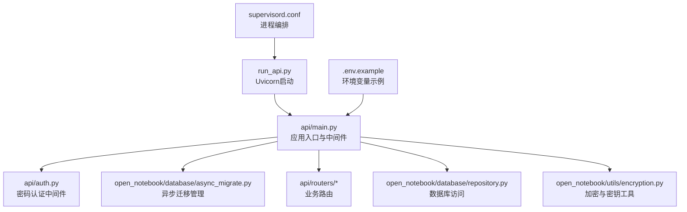
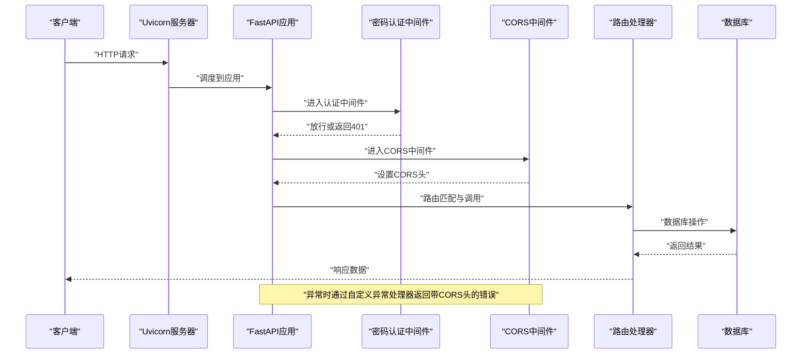
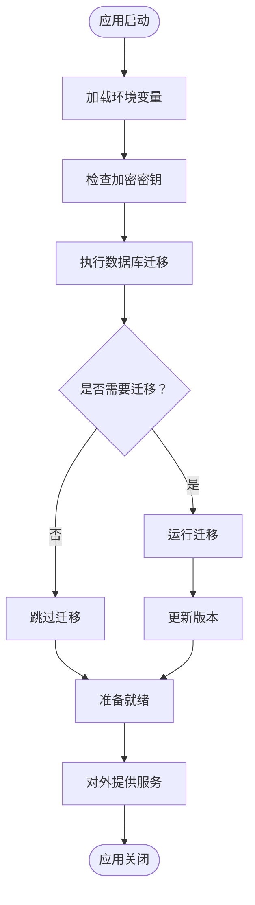
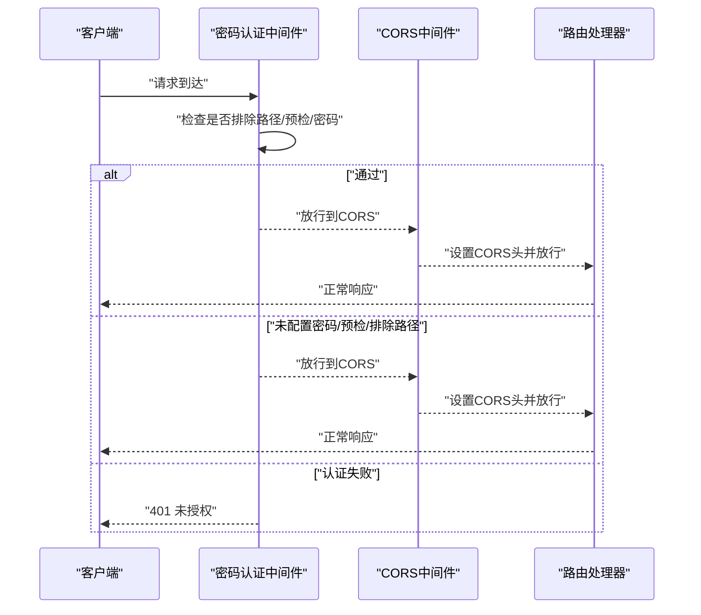
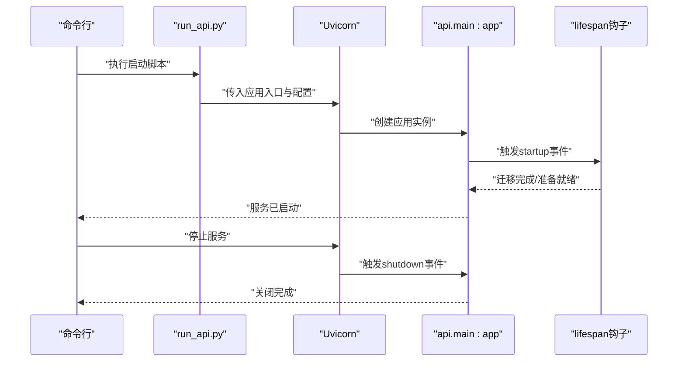
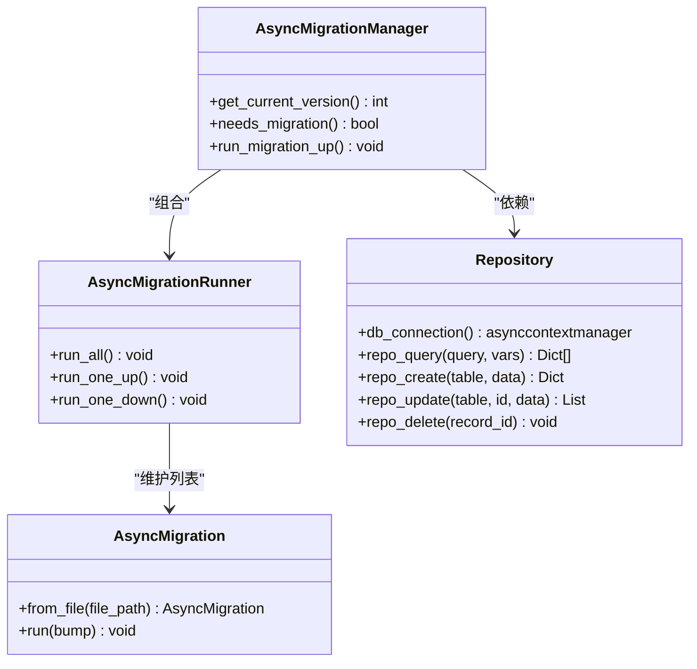
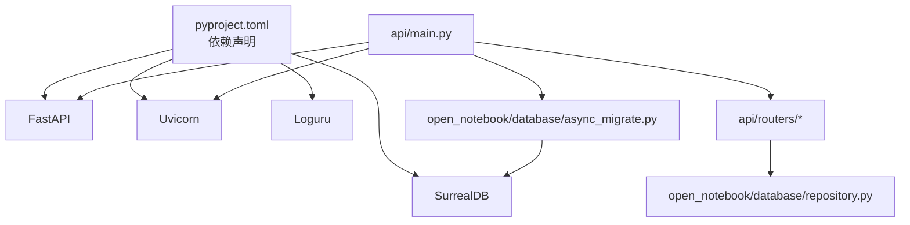

# FastAPI应用结构

<cite>
**本文档引用的文件**
- [api/main.py](file://api/main.py)
- [api/auth.py](file://api/auth.py)
- [open_notebook/database/async_migrate.py](file://open_notebook/database/async_migrate.py)
- [open_notebook/utils/encryption.py](file://open_notebook/utils/encryption.py)
- [open_notebook/database/repository.py](file://open_notebook/database/repository.py)
- [api/routers/auth.py](file://api/routers/auth.py)
- [api/routers/chat.py](file://api/routers/chat.py)
- [run_api.py](file://run_api.py)
- [supervisord.conf](file://supervisord.conf)
- [.env.example](file://.env.example)
- [pyproject.toml](file://pyproject.toml)
</cite>

## 目录
1. [简介](#简介)
2. [项目结构](#项目结构)
3. [核心组件](#核心组件)
4. [架构总览](#架构总览)
5. [详细组件分析](#详细组件分析)
6. [依赖关系分析](#依赖关系分析)
7. [性能考虑](#性能考虑)
8. [故障排除指南](#故障排除指南)
9. [结论](#结论)
10. [附录](#附录)

## 简介
本文件系统性梳理了基于 FastAPI 的 Open Notebook 后端应用结构与运行机制，重点覆盖以下方面：
- 应用初始化与生命周期管理（lifespan）
- 中间件配置与执行顺序（密码认证中间件、CORS 中间件）
- 异常处理机制与跨域错误响应策略
- 路由注册与 API 版本控制思路
- 健康检查端点设计
- 启动与关闭流程、数据库迁移集成
- 安全配置要点（加密密钥、认证策略）
- 性能优化建议与最佳实践

## 项目结构
后端采用分层与功能模块化组织方式：
- 核心入口：api/main.py 定义 FastAPI 应用、中间件、路由注册与健康检查端点
- 认证与安全：api/auth.py 提供密码认证中间件；open_notebook/utils/encryption.py 提供环境变量与加密工具
- 数据库与迁移：open_notebook/database/repository.py 提供数据库连接与查询封装；open_notebook/database/async_migrate.py 提供异步迁移管理
- 路由模块：api/routers 下按功能划分多个子路由，统一在主应用中注册
- 启动脚本：run_api.py 使用 uvicorn 启动服务；supervisord.conf 配置进程管理

**图表来源**
- [api/main.py](file://api/main.py#L99-L190)
- [api/auth.py](file://api/auth.py#L12-L76)
- [open_notebook/database/async_migrate.py](file://open_notebook/database/async_migrate.py#L91-L189)
- [open_notebook/database/repository.py](file://open_notebook/database/repository.py#L47-L83)
- [open_notebook/utils/encryption.py](file://open_notebook/utils/encryption.py#L29-L59)
- [run_api.py](file://run_api.py#L16-L31)
- [supervisord.conf](file://supervisord.conf#L7-L26)
- [.env.example](file://.env.example#L1-L60)

**章节来源**
- [api/main.py](file://api/main.py#L1-L190)
- [run_api.py](file://run_api.py#L1-L32)
- [supervisord.conf](file://supervisord.conf#L1-L41)
- [.env.example](file://.env.example#L1-L60)

## 核心组件
- 应用实例与生命周期：通过 lifespan 钩子在启动时执行数据库迁移，在关闭时进行清理日志输出
- 密码认证中间件：对请求进行 Bearer Token 校验，默认无密码时跳过校验
- CORS 中间件：允许跨域请求，生产环境建议限制具体来源
- 自定义异常处理器：确保错误响应包含 CORS 头信息，尤其针对上传类错误
- 路由注册：统一前缀 /api，按功能模块注册多个子路由
- 健康检查：根路径与 /health 返回简单状态信息

**章节来源**
- [api/main.py](file://api/main.py#L47-L97)
- [api/main.py](file://api/main.py#L105-L154)
- [api/main.py](file://api/main.py#L157-L189)

## 架构总览
下图展示了应用启动到请求处理的关键流程，包括中间件执行顺序与异常处理策略。

**图表来源**
- [api/main.py](file://api/main.py#L105-L154)
- [api/main.py](file://api/main.py#L157-L189)
- [open_notebook/database/repository.py](file://open_notebook/database/repository.py#L65-L83)

## 详细组件分析

### 应用初始化与生命周期管理
- 启动阶段：
  - 加载环境变量
  - 检查加密密钥配置（未配置会记录警告）
  - 执行数据库迁移：检测当前版本、判断是否需要迁移、执行迁移并更新版本
  - 迁移失败时快速失败，阻止启动
- 关闭阶段：
  - 输出关闭完成日志

**图表来源**
- [api/main.py](file://api/main.py#L47-L97)
- [open_notebook/database/async_migrate.py](file://open_notebook/database/async_migrate.py#L165-L189)
- [open_notebook/utils/encryption.py](file://open_notebook/utils/encryption.py#L29-L59)

**章节来源**
- [api/main.py](file://api/main.py#L47-L97)
- [open_notebook/database/async_migrate.py](file://open_notebook/database/async_migrate.py#L91-L189)
- [open_notebook/utils/encryption.py](file://open_notebook/utils/encryption.py#L29-L101)

### 中间件配置与执行顺序
- 密码认证中间件（PasswordAuthMiddleware）：
  - 优先级高，先于 CORS 执行
  - 支持排除路径（如 /health、/docs、/openapi.json、/redoc、/api/auth/status、/api/config）
  - 支持 Docker Secrets 文件读取（OPEN_NOTEBOOK_PASSWORD_FILE）
  - OPTIONS 预检请求直接放行
  - 未配置密码时自动跳过认证
- CORS 中间件（CORSMiddleware）：
  - 允许所有来源、凭据、方法与头
  - 生产环境建议限制具体来源
- 自定义异常处理器：
  - 对 StarletteHTTPException 统一返回带 CORS 头的错误响应
  - 特别适用于上传类错误（如 413）

**图表来源**
- [api/main.py](file://api/main.py#L105-L127)
- [api/auth.py](file://api/auth.py#L19-L75)

**章节来源**
- [api/main.py](file://api/main.py#L105-L154)
- [api/auth.py](file://api/auth.py#L12-L76)

### 异常处理机制
- 自定义异常处理器：
  - 捕获 StarletteHTTPException
  - 在响应头中注入 Access-Control-Allow-* 字段
  - 保证前端在跨域场景下也能正确接收错误信息
- 错误处理策略：
  - 对于反向代理返回的 413 等错误，若在到达 FastAPI 之前被拦截，则无法通过此处理器添加 CORS 头，需在反向代理层配置 CORS 头
  - 业务路由内部使用 HTTPException 抛出标准错误，配合统一异常处理器返回一致格式

**章节来源**
- [api/main.py](file://api/main.py#L130-L154)
- [api/routers/chat.py](file://api/routers/chat.py#L128-L134)

### 路由注册与API版本控制
- 路由注册：
  - 统一前缀 /api，按功能模块注册多个子路由（如 /api/auth、/api/notebooks、/api/search 等）
  - 部分嵌套命名空间路由（如 /api/embeddings）
- API 版本控制：
  - 当前未实现显式的 /v1 前缀或版本目录
  - 可通过新增版本前缀（如 /api/v2）逐步推进兼容性变更
- 健康检查：
  - / 与 /health 返回简单状态信息，便于探活与监控

**章节来源**
- [api/main.py](file://api/main.py#L157-L189)
- [api/routers/auth.py](file://api/routers/auth.py#L10-L27)

### 启动与关闭流程
- 启动流程：
  - run_api.py 读取环境变量（主机、端口、热重载），调用 uvicorn.run 启动 api.main:app
  - supervisord.conf 将 API、Worker、Frontend 作为独立进程管理，支持自动重启与依赖顺序
- 关闭流程：
  - 应用生命周期结束时输出关闭日志

**图表来源**
- [run_api.py](file://run_api.py#L16-L31)
- [api/main.py](file://api/main.py#L47-L97)
- [supervisord.conf](file://supervisord.conf#L7-L26)

**章节来源**
- [run_api.py](file://run_api.py#L1-L32)
- [supervisord.conf](file://supervisord.conf#L1-L41)
- [api/main.py](file://api/main.py#L47-L97)

### 数据库迁移集成
- 迁移管理器：
  - AsyncMigrationManager 维护 up/down 迁移列表，按序执行
  - 通过版本表记录当前版本，支持批量执行与单步执行
- 生命周期集成：
  - 在应用启动时自动检测并执行待迁移任务
  - 迁移失败时抛出异常，阻止服务启动
- 数据访问：
  - repository 提供数据库连接、查询、插入、更新、删除等通用操作
  - 查询结果统一解析 RecordID 为字符串，避免序列化问题

**图表来源**
- [open_notebook/database/async_migrate.py](file://open_notebook/database/async_migrate.py#L91-L189)
- [open_notebook/database/repository.py](file://open_notebook/database/repository.py#L47-L83)

**章节来源**
- [open_notebook/database/async_migrate.py](file://open_notebook/database/async_migrate.py#L91-L229)
- [open_notebook/database/repository.py](file://open_notebook/database/repository.py#L47-L195)

### 安全配置
- 加密与密钥：
  - OPEN_NOTEBOOK_ENCRYPTION_KEY 用于存储数据库中的敏感字段（如 API Key）
  - 支持 _FILE 形式（Docker Secrets），未配置时会报错
- 认证策略：
  - OPEN_NOTEBOOK_PASSWORD 作为 Bearer Token 使用
  - 支持 _FILE 形式；未配置则跳过认证
  - 排除路径用于文档与状态检查端点
- 环境变量示例：
  - .env.example 提供默认值与注释，建议在部署时覆盖

**章节来源**
- [open_notebook/utils/encryption.py](file://open_notebook/utils/encryption.py#L29-L101)
- [api/auth.py](file://api/auth.py#L19-L75)
- [.env.example](file://.env.example#L8-L10)
- [.env.example](file://.env.example#L54-L56)

## 依赖关系分析
- 应用依赖：
  - FastAPI、Uvicorn、Pydantic、Loguru、SurrealDB 等
  - 文档与开发工具链（pytest、ruff、mypy 等）
- 内部模块耦合：
  - api/main.py 依赖中间件、迁移管理器与各路由模块
  - 路由模块依赖领域模型与数据库仓库
  - 数据库迁移依赖仓库查询与版本表

**图表来源**
- [pyproject.toml](file://pyproject.toml#L15-L42)
- [api/main.py](file://api/main.py#L1-L190)
- [open_notebook/database/async_migrate.py](file://open_notebook/database/async_migrate.py#L1-L229)
- [open_notebook/database/repository.py](file://open_notebook/database/repository.py#L1-L195)

**章节来源**
- [pyproject.toml](file://pyproject.toml#L1-L99)
- [api/main.py](file://api/main.py#L1-L190)

## 性能考虑
- 中间件顺序优化：
  - 将密码认证置于 CORS 之前，减少不必要的跨域处理开销
  - 对 OPTIONS 预检请求放行，避免重复认证
- 数据库访问：
  - 使用异步连接池与上下文管理器，避免连接泄漏
  - 批量写入与去重逻辑可降低冲突与重试成本
- 日志与异常：
  - 对并发冲突类错误使用调试级别日志，避免噪声
  - 统一异常处理器减少分支判断与重复头设置
- 启动与热重载：
  - 开发模式启用 reload，生产环境关闭以提升稳定性

[本节为通用指导，无需特定文件引用]

## 故障排除指南
- 数据库迁移失败：
  - 现象：应用启动时报错并终止
  - 排查：查看迁移日志与版本表状态，确认数据库连接与权限
- 413 请求实体过大：
  - 现象：前端跨域错误或 CORS 头缺失
  - 排查：若反向代理提前返回 413，需在代理层添加 CORS 头；否则可通过自定义异常处理器增强响应头
- 认证失败：
  - 现象：返回 401 未授权
  - 排查：确认 Authorization 头格式为 Bearer Token，核对 OPEN_NOTEBOOK_PASSWORD 或其文件配置
- 健康检查不可达：
  - 现象：/ 与 /health 返回 404
  - 排查：确认路由注册与中间件顺序，检查排除路径配置

**章节来源**
- [api/main.py](file://api/main.py#L84-L88)
- [api/main.py](file://api/main.py#L130-L154)
- [api/auth.py](file://api/auth.py#L46-L71)
- [api/main.py](file://api/main.py#L182-L189)

## 结论
该 FastAPI 应用通过清晰的生命周期管理、严格的中间件顺序与完善的异常处理策略，实现了安全、稳定且可扩展的服务基础。结合异步数据库迁移与统一的路由注册模式，为后续的功能演进与版本控制提供了良好支撑。建议在生产环境中进一步收紧 CORS 策略、完善认证与审计日志，并在路由层引入版本前缀以保障向后兼容。

[本节为总结性内容，无需特定文件引用]

## 附录
- 环境变量参考：见 .env.example
- 启动方式：本地使用 run_api.py，容器编排使用 supervisord.conf
- 依赖清单：见 pyproject.toml

**章节来源**
- [.env.example](file://.env.example#L1-L60)
- [run_api.py](file://run_api.py#L1-L32)
- [supervisord.conf](file://supervisord.conf#L1-L41)
- [pyproject.toml](file://pyproject.toml#L1-L99)