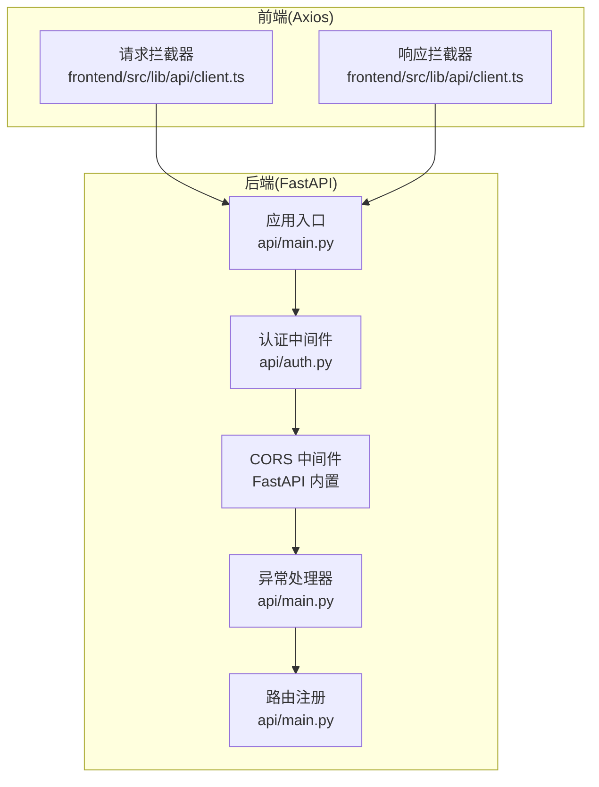
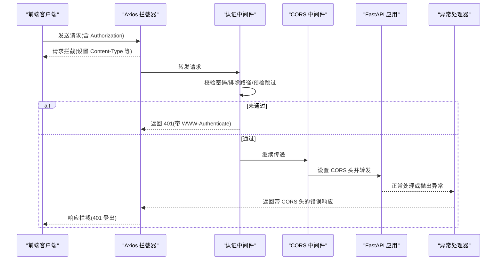
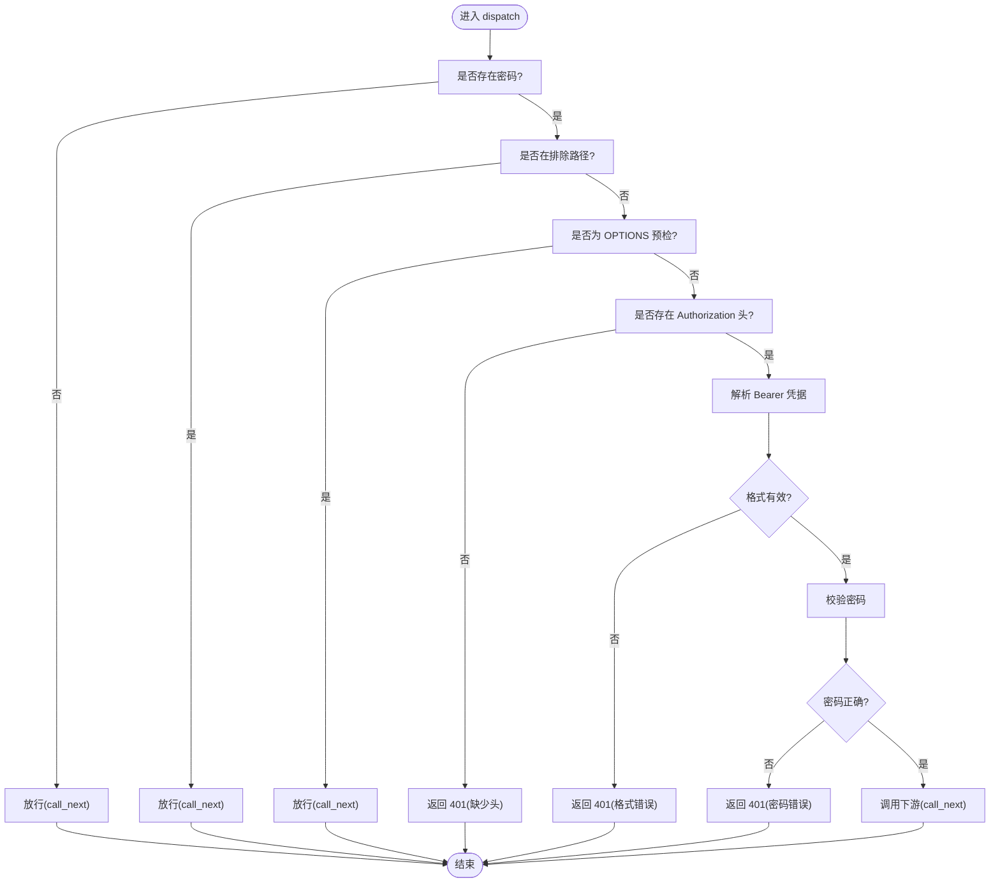
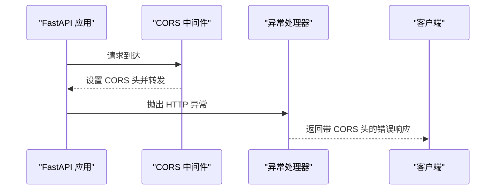
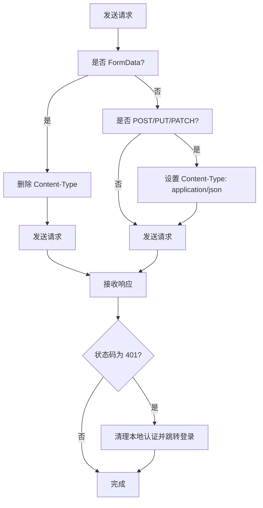
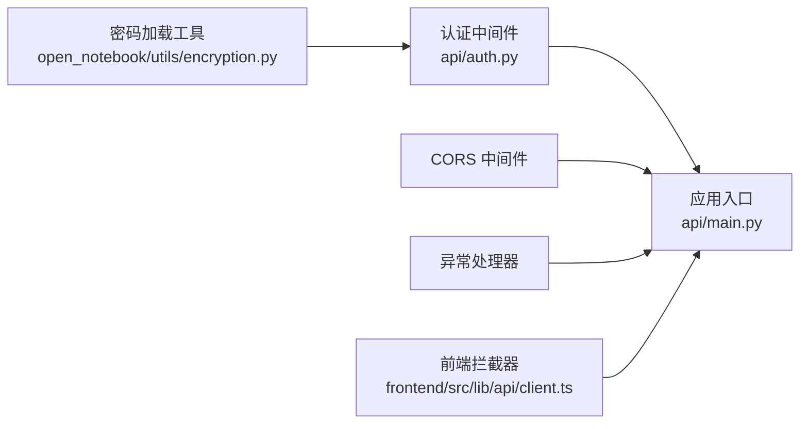

# 中间件与拦截器

<cite>
**本文引用的文件**
- [api/main.py](file://api/main.py)
- [api/auth.py](file://api/auth.py)
- [open_notebook/utils/encryption.py](file://open_notebook/utils/encryption.py)
- [api/routers/auth.py](file://api/routers/auth.py)
- [open_notebook/exceptions.py](file://open_notebook/exceptions.py)
- [docs/5-CONFIGURATION/security.md](file://docs/5-CONFIGURATION/security.md)
- [docs/5-CONFIGURATION/reverse-proxy.md](file://docs/5-CONFIGURATION/reverse-proxy.md)
- [frontend/src/lib/api/client.ts](file://frontend/src/lib/api/client.ts)
- [frontend/src/app/config/route.ts](file://frontend/src/app/config/route.ts)
- [frontend/src/lib/config.ts](file://frontend/src/lib/config.ts)
</cite>

## 目录
1. [引言](#引言)
2. [项目结构](#项目结构)
3. [核心组件](#核心组件)
4. [架构总览](#架构总览)
5. [组件详解](#组件详解)
6. [依赖关系分析](#依赖关系分析)
7. [性能考量](#性能考量)
8. [故障排查指南](#故障排查指南)
9. [结论](#结论)
10. [附录](#附录)

## 引言
本文件系统性阐述 Open Notebook 后端的中间件与拦截器机制，重点覆盖以下内容：
- 自定义中间件的实现方式、执行顺序与配置方法
- 认证中间件、CORS 中间件与异常处理中间件的功能与配置
- 中间件链的构建、性能影响与调试方法
- 自定义中间件开发指南、最佳实践与常见问题解决方案

## 项目结构
后端基于 FastAPI 构建，中间件在应用启动时按注册顺序构成中间件链。前端通过 Axios 拦截器进行统一错误处理与请求头设置。

图表来源
- [api/main.py](file://api/main.py#L99-L154)
- [api/auth.py](file://api/auth.py#L12-L75)
- [frontend/src/lib/api/client.ts](file://frontend/src/lib/api/client.ts#L33-L64)

章节来源
- [api/main.py](file://api/main.py#L99-L154)

## 核心组件
- 认证中间件：对所有受保护 API 请求进行密码校验，支持排除路径与预检请求跳过。
- CORS 中间件：允许跨域访问，生产环境建议限制具体来源。
- 异常处理中间件：确保错误响应（尤其是上传错误）包含 CORS 头部。
- 前端拦截器：统一对 401 错误进行登出处理与重定向。

章节来源
- [api/auth.py](file://api/auth.py#L12-L75)
- [api/main.py](file://api/main.py#L120-L154)
- [frontend/src/lib/api/client.ts](file://frontend/src/lib/api/client.ts#L33-L64)

## 架构总览
下图展示请求从浏览器到后端的中间件链路与关键处理点：

图表来源
- [api/main.py](file://api/main.py#L105-L154)
- [api/auth.py](file://api/auth.py#L30-L75)
- [frontend/src/lib/api/client.ts](file://frontend/src/lib/api/client.ts#L33-L64)

## 组件详解

### 认证中间件 PasswordAuthMiddleware
- 功能概述
  - 对所有 API 请求进行密码校验，若未配置密码则跳过认证。
  - 支持排除路径（如健康检查、文档等），以及 CORS 预检请求跳过。
  - 密码来源优先使用 Docker 秘密文件，其次为环境变量。
- 关键行为
  - 若未设置密码，直接放行。
  - 若请求路径在排除列表中，直接放行。
  - OPTIONS 预检请求直接放行。
  - 缺少或格式不正确的 Authorization 头返回 401 并携带 WWW-Authenticate。
  - 密码不匹配返回 401。
  - 校验通过后调用下游中间件/路由。
- 配置要点
  - 通过环境变量 OPEN_NOTEBOOK_PASSWORD 或其 _FILE 变体配置密码。
  - 排除路径可在注册中间件时指定。
- 与路由的关系
  - 提供独立的路由 /api/auth/status 用于查询是否启用认证。

图表来源
- [api/auth.py](file://api/auth.py#L30-L75)

章节来源
- [api/auth.py](file://api/auth.py#L12-L75)
- [open_notebook/utils/encryption.py](file://open_notebook/utils/encryption.py#L29-L59)
- [api/routers/auth.py](file://api/routers/auth.py#L13-L27)
- [docs/5-CONFIGURATION/security.md](file://docs/5-CONFIGURATION/security.md#L139-L170)

### CORS 中间件与异常处理中间件
- CORS 中间件
  - 使用 FastAPI 内置 CORSMiddleware，默认允许所有来源、方法与头部。
  - 生产环境建议限制 allow_origins 以提升安全性。
- 异常处理中间件
  - 注册 StarletteHTTPException 的自定义异常处理器，确保错误响应（特别是上传错误）包含 CORS 头。
  - 当反向代理在到达应用前返回 413 时，该处理器不会被触发，需在反向代理层添加 CORS 头。

图表来源
- [api/main.py](file://api/main.py#L120-L154)
- [docs/5-CONFIGURATION/reverse-proxy.md](file://docs/5-CONFIGURATION/reverse-proxy.md#L671-L680)

章节来源
- [api/main.py](file://api/main.py#L120-L154)
- [docs/5-CONFIGURATION/reverse-proxy.md](file://docs/5-CONFIGURATION/reverse-proxy.md#L671-L680)

### 前端拦截器（Axios）
- 请求拦截器
  - 对 FormData 自动移除 Content-Type 以便浏览器设置 multipart 边界。
  - 对非 GET/HEAD 的 POST/PUT/PATCH 请求默认设置 application/json。
- 响应拦截器
  - 对 401 错误清理本地认证状态并重定向至登录页。

图表来源
- [frontend/src/lib/api/client.ts](file://frontend/src/lib/api/client.ts#L33-L64)

章节来源
- [frontend/src/lib/api/client.ts](file://frontend/src/lib/api/client.ts#L33-L64)

## 依赖关系分析
- 认证中间件依赖密码加载工具，后者支持 Docker 秘密文件与环境变量。
- 应用在启动时注册中间件链，先认证再 CORS，最后异常处理。
- 前端拦截器与后端中间件链协同工作，保证跨域与错误处理一致性。

图表来源
- [open_notebook/utils/encryption.py](file://open_notebook/utils/encryption.py#L29-L59)
- [api/auth.py](file://api/auth.py#L19-L28)
- [api/main.py](file://api/main.py#L105-L154)
- [frontend/src/lib/api/client.ts](file://frontend/src/lib/api/client.ts#L33-L64)

章节来源
- [open_notebook/utils/encryption.py](file://open_notebook/utils/encryption.py#L29-L59)
- [api/auth.py](file://api/auth.py#L19-L28)
- [api/main.py](file://api/main.py#L105-L154)
- [frontend/src/lib/api/client.ts](file://frontend/src/lib/api/client.ts#L33-L64)

## 性能考量
- 中间件链顺序影响性能：认证与 CORS 通常开销较小，但应避免在认证失败时重复计算。
- 生产环境建议：
  - 限制 CORS 来源与方法，减少不必要的预检请求。
  - 将认证排除路径最小化，仅保留必要公开端点。
  - 对大体积上传场景，结合反向代理限流与超时配置，减少后端压力。
- 日志与可观测性：利用日志记录中间件执行耗时与失败原因，便于定位瓶颈。

## 故障排查指南
- 401 未授权
  - 确认 Authorization 头格式为 Bearer 且值与 OPEN_NOTEBOOK_PASSWORD 匹配。
  - 检查是否命中排除路径或预检请求被跳过。
  - 参考安全配置文档中的示例与排错步骤。
- CORS 相关错误
  - 若出现“CORS header missing”，检查反向代理是否在应用前返回 413，此时异常处理器无法生效。
  - 在反向代理层添加 CORS 头，或调整上传大小限制。
- 健康检查与认证状态
  - 使用 /api/auth/status 查询当前认证状态，确认密码是否已正确配置。

章节来源
- [docs/5-CONFIGURATION/security.md](file://docs/5-CONFIGURATION/security.md#L330-L377)
- [docs/5-CONFIGURATION/reverse-proxy.md](file://docs/5-CONFIGURATION/reverse-proxy.md#L671-L680)
- [api/routers/auth.py](file://api/routers/auth.py#L13-L27)

## 结论
本项目的中间件体系以“认证优先、CORS 兜底、异常兜底”为核心设计，既满足基本的安全需求，又兼顾跨域与错误处理的一致性。通过合理的配置与调试手段，可稳定支撑多场景部署。

## 附录

### 中间件链构建与配置清单
- 认证中间件
  - 注册位置：应用启动时最先注册
  - 排除路径：根、健康检查、文档、OpenAPI、重定向等
  - 密码来源：OPEN_NOTEBOOK_PASSWORD 或其 _FILE 变体
- CORS 中间件
  - 默认允许所有来源、方法与头部；生产建议限制 allow_origins
- 异常处理中间件
  - 确保错误响应包含 CORS 头；反向代理返回的 413 不会触发该处理器

章节来源
- [api/main.py](file://api/main.py#L105-L154)
- [api/auth.py](file://api/auth.py#L19-L28)

### 自定义中间件开发指南
- 设计原则
  - 明确职责边界，单一中间件只做一件事。
  - 尽量短路失败路径，避免无谓的下游调用。
  - 保持幂等性，避免副作用。
- 实现要点
  - 继承 BaseHTTPMiddleware 并实现 dispatch。
  - 通过 call_next 控制请求流向，注意异常捕获与上下文透传。
  - 在应用入口处按期望顺序注册中间件。
- 最佳实践
  - 将可配置项集中管理，避免硬编码。
  - 为敏感操作增加速率限制与审计日志。
  - 与前端拦截器配合，统一错误处理策略。

### 常见问题与解决方案
- 413 上传错误且缺失 CORS 头
  - 在反向代理层设置允许的最大请求体大小，并添加 CORS 头。
- 401 但浏览器仍提示未登录
  - 检查前端拦截器是否正确清理认证状态并跳转登录页。
- 认证状态与实际行为不符
  - 使用 /api/auth/status 确认密码是否已配置，核对排除路径是否正确。

章节来源
- [docs/5-CONFIGURATION/reverse-proxy.md](file://docs/5-CONFIGURATION/reverse-proxy.md#L671-L680)
- [frontend/src/lib/api/client.ts](file://frontend/src/lib/api/client.ts#L51-L64)
- [api/routers/auth.py](file://api/routers/auth.py#L13-L27)