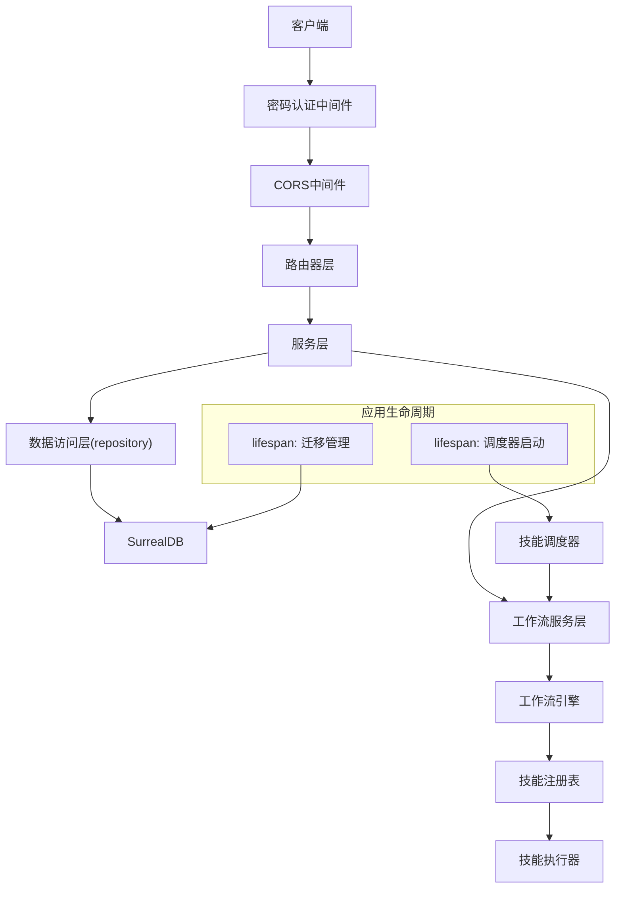
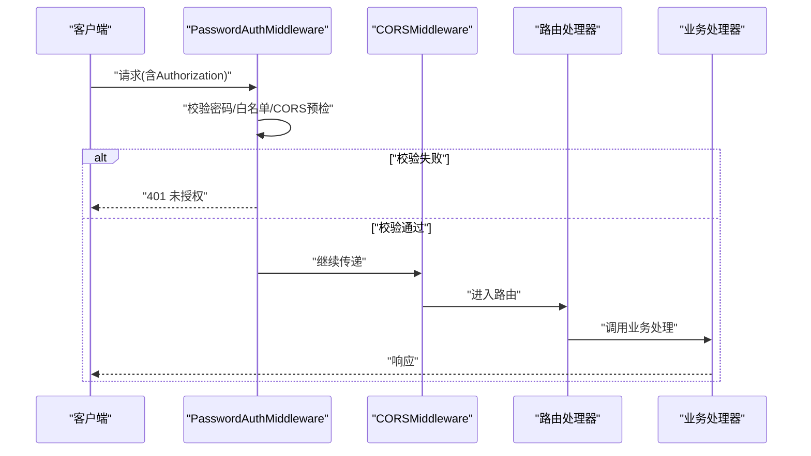
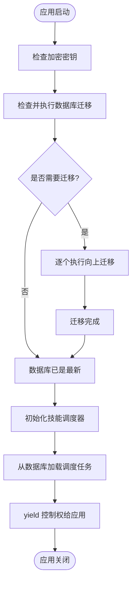
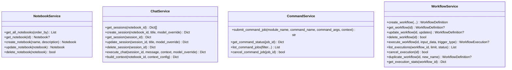
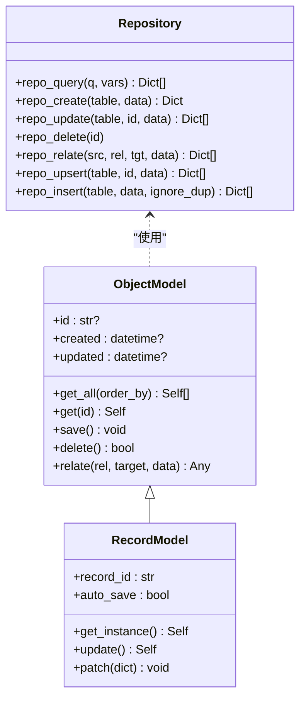
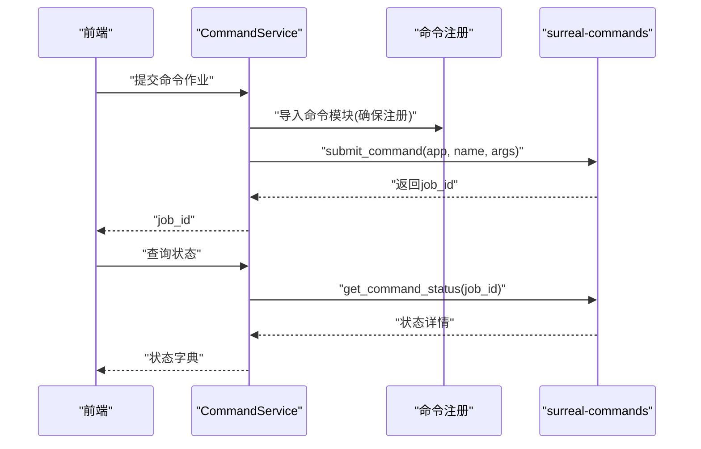
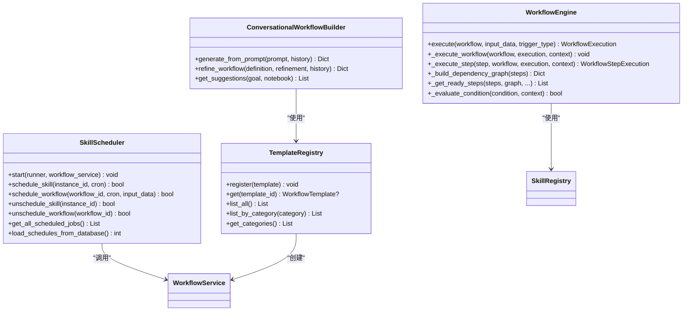
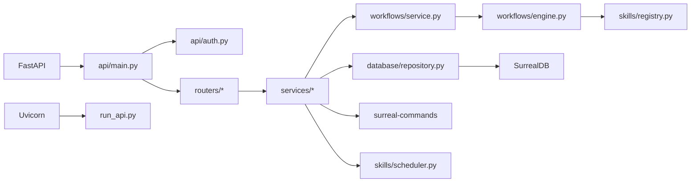

# 后端架构

<cite>
**本文引用的文件**
- [api/main.py](file://api/main.py)
- [api/auth.py](file://api/auth.py)
- [api/routers/__init__.py](file://api/routers/__init__.py)
- [api/notebook_service.py](file://api/notebook_service.py)
- [api/chat_service.py](file://api/chat_service.py)
- [api/command_service.py](file://api/command_service.py)
- [api/routers/workflows.py](file://api/routers/workflows.py)
- [api/routers/workflow_builder.py](file://api/routers/workflow_builder.py)
- [api/routers/workflow_templates.py](file://api/routers/workflow_templates.py)
- [run_api.py](file://run_api.py)
- [pyproject.toml](file://pyproject.toml)
- [open_notebook/database/async_migrate.py](file://open_notebook/database/async_migrate.py)
- [open_notebook/database/repository.py](file://open_notebook/database/repository.py)
- [open_notebook/domain/base.py](file://open_notebook/domain/base.py)
- [open_notebook/utils/encryption.py](file://open_notebook/utils/encryption.py)
- [open_notebook/config.py](file://open_notebook/config.py)
- [open_notebook/workflows/engine.py](file://open_notebook/workflows/engine.py)
- [open_notebook/workflows/service.py](file://open_notebook/workflows/service.py)
- [open_notebook/workflows/templates.py](file://open_notebook/workflows/templates.py)
- [open_notebook/workflows/conversational.py](file://open_notebook/workflows/conversational.py)
- [open_notebook/skills/scheduler.py](file://open_notebook/skills/scheduler.py)
- [open_notebook/skills/registry.py](file://open_notebook/skills/registry.py)
</cite>

## 目录
1. [简介](#简介)
2. [项目结构](#项目结构)
3. [核心组件](#核心组件)
4. [架构总览](#架构总览)
5. [详细组件分析](#详细组件分析)
6. [工作流引擎与调度器集成](#工作流引擎与调度器集成)
7. [依赖分析](#依赖分析)
8. [性能考量](#性能考量)
9. [故障排查指南](#故障排查指南)
10. [结论](#结论)
11. [附录](#附录)

## 简介
本文件面向Open Notebook后端，系统化阐述基于FastAPI的应用架构与分层设计，覆盖服务层、数据访问层、中间件配置、异步任务与命令系统、状态管理、AI服务集成与模型发现、连接管理、错误处理、日志与监控、性能优化与扩展性，以及API路由设计与请求处理流程。

**更新** 新增工作流引擎、调度器和模板系统的集成架构，展示从技能执行到工作流编排的演进。

## 项目结构
后端采用"入口应用 + 路由器 + 服务层 + 数据访问层"的清晰分层，现已扩展为包含工作流编排和调度功能的完整架构：
- 应用入口：通过Uvicorn启动FastAPI应用，集中注册中间件、异常处理器与路由。
- 路由器层：按功能域拆分路由模块，统一前缀与标签，便于维护与扩展。
- 服务层：封装业务逻辑，屏蔽底层实现细节（数据库、外部API、命令系统、工作流引擎）。
- 数据访问层：抽象SurrealDB访问，提供查询、插入、更新、删除、关系建立等通用能力，并内置迁移管理。
- 工作流层：包含工作流引擎、服务层、模板系统和调度器，提供技能编排和自动化执行能力。

```mermaid
graph TB
subgraph "应用入口"
RUN["run_api.py<br/>启动脚本"]
MAIN["api/main.py<br/>FastAPI应用"]
end
subgraph "中间件与异常"
AUTH["api/auth.py<br/>密码认证中间件"]
CORS["FastAPI CORS 中间件"]
EXC["自定义异常处理器"]
end
subgraph "路由器层"
R_AUTH["routers/auth.py"]
R_CHAT["routers/chat.py"]
R_MODELS["routers/models.py"]
R_NOTES["routers/notes.py"]
R_SOURCES["routers/sources.py"]
R_COMMANDS["routers/commands.py"]
R_EMBED["routers/embedding*.py"]
R_SEARCH["routers/search.py"]
R_SETTINGS["routers/settings.py"]
R_CONTEXT["routers/context.py"]
R_PODCASTS["routers/podcasts.py"]
R_INSIGHTS["routers/insights.py"]
R_CONFIG["routers/config.py"]
R_TRANSFORM["routers/transformations.py"]
R_WORKFLOWS["routers/workflows.py<br/>工作流管理"]
R_TEMPLATES["routers/workflow_templates.py<br/>模板系统"]
R_BUILDER["routers/workflow_builder.py<br/>对话式构建器"]
end
subgraph "服务层"
S_NOTE["notebook_service.py"]
S_CHAT["chat_service.py"]
S_CMD["command_service.py"]
S_WF["workflows/service.py<br/>工作流服务"]
end
subgraph "工作流层"
WF_ENGINE["workflows/engine.py<br/>工作流引擎"]
WF_SCHED["skills/scheduler.py<br/>调度器"]
WF_TEMPLATES["workflows/templates.py<br/>模板系统"]
WF_CONVERS["workflows/conversational.py<br/>对话式构建器"]
SKILL_REG["skills/registry.py<br/>技能注册表"]
end
subgraph "数据访问层"
DB_REPO["database/repository.py"]
DB_MIG["database/async_migrate.py"]
end
RUN --> MAIN
MAIN --> AUTH
MAIN --> CORS
MAIN --> EXC
MAIN --> R_AUTH
MAIN --> R_CHAT
MAIN --> R_MODELS
MAIN --> R_NOTES
MAIN --> R_SOURCES
MAIN --> R_COMMANDS
MAIN --> R_EMBED
MAIN --> R_SEARCH
MAIN --> R_SETTINGS
MAIN --> R_CONTEXT
MAIN --> R_PODCASTS
MAIN --> R_INSIGHTS
MAIN --> R_CONFIG
MAIN --> R_TRANSFORM
MAIN --> R_WORKFLOWS
MAIN --> R_TEMPLATES
MAIN --> R_BUILDER
S_NOTE --> DB_REPO
S_CHAT --> DB_REPO
S_CMD --> DB_MIG
S_WF --> WF_ENGINE
S_WF --> WF_SCHED
WF_ENGINE --> SKILL_REG
WF_SCHED --> S_WF
DB_REPO --> DB_MIG
```

**图表来源**
- [api/main.py](file://api/main.py#L137-L221)
- [api/routers/workflows.py](file://api/routers/workflows.py#L1-L453)
- [api/routers/workflow_templates.py](file://api/routers/workflow_templates.py#L1-L215)
- [api/routers/workflow_builder.py](file://api/routers/workflow_builder.py#L1-L305)
- [open_notebook/workflows/engine.py](file://open_notebook/workflows/engine.py#L1-L620)
- [open_notebook/workflows/service.py](file://open_notebook/workflows/service.py#L1-L240)
- [open_notebook/skills/scheduler.py](file://open_notebook/skills/scheduler.py#L1-L430)
- [open_notebook/workflows/templates.py](file://open_notebook/workflows/templates.py#L1-L528)
- [open_notebook/workflows/conversational.py](file://open_notebook/workflows/conversational.py#L1-L426)
- [open_notebook/skills/registry.py](file://open_notebook/skills/registry.py#L1-L133)

**章节来源**
- [api/main.py](file://api/main.py#L137-L221)
- [run_api.py](file://run_api.py#L16-L32)

## 核心组件
- 应用入口与生命周期
  - 使用Uvicorn运行FastAPI应用，支持热重载与主机/端口环境变量控制。
  - 应用生命周期在启动时执行数据库迁移，失败则快速退出，确保Schema一致性。
  - **新增** 启动时初始化技能调度器，加载数据库中的现有调度任务。
- 中间件体系
  - 密码认证中间件：对除白名单外的路径进行Bearer密码校验；支持Docker secrets文件。
  - CORS中间件：允许跨域请求，生产环境建议限制具体来源。
  - 自定义异常处理器：保证错误响应包含CORS头，尤其针对上传类错误。
- 路由器与API设计
  - 统一前缀/api与标签分类，便于OpenAPI文档生成与前端调用。
  - 按领域拆分路由模块，职责清晰，便于独立演进。
  - **新增** 工作流相关路由：工作流定义、执行、模板和构建器API。
- 服务层
  - NotebookService：封装笔记本的增删改查与对象转换。
  - ChatService：封装聊天会话、执行与上下文构建的异步调用。
  - CommandService：封装命令提交、状态查询与作业管理的抽象接口。
  - **新增** WorkflowService：封装工作流定义、执行、统计和调度管理。
- 数据访问层
  - repository.py：SurrealDB异步客户端封装，提供查询、创建、更新、删除、关系建立、Upsert等。
  - async_migrate.py：基于SurrealQL的异步迁移管理器，支持版本跟踪与回滚。
- 工作流层
  - **新增** WorkflowEngine：工作流执行引擎，负责步骤依赖管理和并行执行。
  - **新增** SkillScheduler：基于APScheduler的技能和工作流调度器。
  - **新增** TemplateRegistry：预构建工作流模板注册表。
  - **新增** ConversationalWorkflowBuilder：AI驱动的工作流对话式构建器。
- 安全与配置
  - 加密工具：基于Fernet的字段级加密，支持从环境或Docker secrets加载密钥。
  - 配置常量：数据目录、SQLite检查点文件、上传目录、缓存目录等。

**章节来源**
- [api/main.py](file://api/main.py#L51-L134)
- [api/auth.py](file://api/auth.py#L12-L76)
- [api/routers/workflows.py](file://api/routers/workflows.py#L1-L453)
- [api/routers/workflow_templates.py](file://api/routers/workflow_templates.py#L1-L215)
- [api/routers/workflow_builder.py](file://api/routers/workflow_builder.py#L1-L305)
- [open_notebook/workflows/engine.py](file://open_notebook/workflows/engine.py#L1-L620)
- [open_notebook/workflows/service.py](file://open_notebook/workflows/service.py#L1-L240)
- [open_notebook/skills/scheduler.py](file://open_notebook/skills/scheduler.py#L1-L430)
- [open_notebook/workflows/templates.py](file://open_notebook/workflows/templates.py#L1-L528)
- [open_notebook/workflows/conversational.py](file://open_notebook/workflows/conversational.py#L1-L426)

## 架构总览
下图展示从客户端到服务层再到数据访问层的整体交互，以及中间件在请求链路中的位置。**新增** 工作流层组件展示了技能执行到工作流编排的完整流程。

**图表来源**
- [api/main.py](file://api/main.py#L104-L120)
- [api/auth.py](file://api/auth.py#L12-L76)
- [open_notebook/workflows/service.py](file://open_notebook/workflows/service.py#L22-L31)
- [open_notebook/skills/scheduler.py](file://open_notebook/skills/scheduler.py#L20-L55)

## 详细组件分析

### 应用与中间件
- 密码认证中间件
  - 支持白名单路径跳过校验、CORS预检请求放行、Bearer格式校验与密码比对。
  - 未配置密码时自动跳过认证，便于开发环境使用。
- CORS中间件
  - 默认允许所有来源/方法/头，生产部署需收紧。
- 自定义异常处理器
  - 在异常发生时注入CORS相关响应头，避免浏览器因CORS导致的跨域错误被屏蔽。

**图表来源**
- [api/auth.py](file://api/auth.py#L30-L75)
- [api/main.py](file://api/main.py#L144-L165)

**章节来源**
- [api/auth.py](file://api/auth.py#L12-L115)
- [api/main.py](file://api/main.py#L144-L192)

### 生命周期与数据库迁移
- 应用启动时执行异步迁移，若需要迁移则自动执行至最新版本；失败则抛出致命错误阻止启动。
- 迁移版本存储于专用表，支持向上与向下迁移。
- **新增** 启动时初始化技能调度器，加载数据库中的现有调度任务。

**图表来源**
- [api/main.py](file://api/main.py#L51-L120)
- [open_notebook/database/async_migrate.py](file://open_notebook/database/async_migrate.py#L169-L189)

**章节来源**
- [api/main.py](file://api/main.py#L51-L120)
- [open_notebook/database/async_migrate.py](file://open_notebook/database/async_migrate.py#L91-L190)

### 服务层设计
- NotebookService
  - 提供获取全部、获取单个、创建、更新、删除笔记本的同步式封装，内部通过API客户端调用。
- ChatService
  - 提供会话列表、创建、获取、更新、删除、执行聊天、构建上下文等异步方法，内置超时配置以适配本地推理服务。
- CommandService
  - 提供提交命令作业、查询状态、列出作业、取消作业的抽象接口，当前列出与取消为占位实现。
- **新增** WorkflowService
  - 提供工作流定义创建、更新、删除、查询等CRUD操作。
  - 提供工作流执行、取消、统计和复制功能。
  - 协调工作流引擎和调度器，管理技能和工作流的生命周期。

**图表来源**
- [api/notebook_service.py](file://api/notebook_service.py#L13-L88)
- [api/chat_service.py](file://api/chat_service.py#L13-L169)
- [api/command_service.py](file://api/command_service.py#L7-L93)
- [open_notebook/workflows/service.py](file://open_notebook/workflows/service.py#L22-L240)

**章节来源**
- [api/notebook_service.py](file://api/notebook_service.py#L13-L88)
- [api/chat_service.py](file://api/chat_service.py#L13-L169)
- [api/command_service.py](file://api/command_service.py#L7-L93)
- [open_notebook/workflows/service.py](file://open_notebook/workflows/service.py#L22-L240)

### 数据访问层与模型基类
- repository.py
  - 提供db_connection上下文管理器、repo_query、repo_create、repo_update、repo_delete、repo_relate、repo_upsert、repo_insert等。
  - 记录ID解析与转换，确保返回结果中RecordID被序列化为字符串。
- domain/base.py
  - ObjectModel：提供通用的get/get_all/save/delete/relate等方法，内置Pydantic验证与异常包装。
  - RecordModel：提供单例模式与异步更新/补丁能力，支持自动保存警告提示。
- 配置与加密
  - config.py：定义数据目录、SQLite检查点文件、上传目录、缓存目录等。
  - encryption.py：提供从环境/Docker secrets读取密钥、Fernet派生与加解密工具，支持容错降级。

**图表来源**
- [open_notebook/domain/base.py](file://open_notebook/domain/base.py#L31-L329)
- [open_notebook/database/repository.py](file://open_notebook/database/repository.py#L65-L195)
- [open_notebook/config.py](file://open_notebook/config.py#L1-L18)
- [open_notebook/utils/encryption.py](file://open_notebook/utils/encryption.py#L29-L126)

**章节来源**
- [open_notebook/database/repository.py](file://open_notebook/database/repository.py#L65-L195)
- [open_notebook/domain/base.py](file://open_notebook/domain/base.py#L31-L329)
- [open_notebook/config.py](file://open_notebook/config.py#L1-L18)
- [open_notebook/utils/encryption.py](file://open_notebook/utils/encryption.py#L29-L126)

### 异步任务处理、命令系统与状态管理
- 命令系统
  - 通过surreal-commands提交命令作业，要求在进程内导入对应命令模块以注册。
  - 提供作业状态查询接口，返回状态、结果、错误信息、进度与时间戳。
  - 列出与取消作业为占位实现，后续可结合SurrealDB查询完善。
- 状态管理
  - 命令状态以字典形式返回，包含作业ID、状态、结果、错误、进度与时间戳，便于前端轮询与展示。
- **新增** 工作流执行状态管理
  - WorkflowExecution模型跟踪工作流执行状态、步骤执行历史、创建的资源ID等。
  - 支持成功、失败、部分成功、取消等多种状态。

**图表来源**
- [api/command_service.py](file://api/command_service.py#L11-L65)

**章节来源**
- [api/command_service.py](file://api/command_service.py#L7-L93)

### 工作流引擎与调度器集成
- **新增** WorkflowEngine
  - 解析工作流定义，管理步骤依赖和执行顺序。
  - 执行技能并正确处理上下文传递。
  - 处理重试和错误条件，持久化执行状态。
  - 支持条件判断、并行执行和依赖管理。
- **新增** SkillScheduler
  - 基于APScheduler的异步调度器，支持技能实例和工作流的定时执行。
  - 支持Cron表达式调度，防止重叠执行。
  - 提供调度任务的查询、更新和取消功能。
  - 从数据库加载现有调度任务。
- **新增** TemplateRegistry
  - 预构建工作流模板，提供常见场景的一键创建工作流。
  - 支持模板分类、搜索和实例化。
- **新增** ConversationalWorkflowBuilder
  - 使用AI理解用户意图，生成结构化的工作流定义。
  - 支持工作流的对话式精炼和改进。
  - 提供工作流建议和模板匹配功能。

**图表来源**
- [open_notebook/workflows/engine.py](file://open_notebook/workflows/engine.py#L130-L620)
- [open_notebook/skills/scheduler.py](file://open_notebook/skills/scheduler.py#L20-L430)
- [open_notebook/workflows/templates.py](file://open_notebook/workflows/templates.py#L494-L528)
- [open_notebook/workflows/conversational.py](file://open_notebook/workflows/conversational.py#L104-L426)

**章节来源**
- [open_notebook/workflows/engine.py](file://open_notebook/workflows/engine.py#L1-L620)
- [open_notebook/skills/scheduler.py](file://open_notebook/skills/scheduler.py#L1-L430)
- [open_notebook/workflows/templates.py](file://open_notebook/workflows/templates.py#L1-L528)
- [open_notebook/workflows/conversational.py](file://open_notebook/workflows/conversational.py#L1-L426)

### AI服务集成、模型发现与连接管理
- 模型发现与连接测试
  - 通过AI子模块的模型发现与连接测试能力，支持多提供商适配与可用性检测。
- 连接管理
  - 通过环境变量配置SurrealDB连接参数，repository提供统一的异步连接与命名空间选择。
- **新增** 对话式工作流构建
  - 使用LangChain模型生成工作流定义，支持自然语言到结构化工作流的转换。
  - 提供工作流解释、估计时长和改进建议。
- 日志与监控
  - 使用loguru进行结构化日志输出，异常捕获与关键路径打点便于问题定位与性能分析。

**章节来源**
- [open_notebook/database/repository.py](file://open_notebook/database/repository.py#L12-L27)
- [open_notebook/database/repository.py](file://open_notebook/database/repository.py#L47-L63)
- [open_notebook/workflows/conversational.py](file://open_notebook/workflows/conversational.py#L152-L161)

### 错误处理、日志记录与监控
- 错误处理
  - 自定义HTTP异常处理器确保CORS头在错误响应中生效；数据库操作捕获异常并包装为领域异常。
  - 命令系统与服务层均进行异常捕获与日志记录，必要时抛出上层处理。
  - **新增** 工作流执行错误处理，支持部分失败和重试机制。
- 日志记录
  - 全局使用loguru，关键路径如迁移、数据库操作、命令提交与状态查询均有日志输出。
  - **新增** 调度器和工作流执行的日志记录，便于追踪自动化任务。
- 监控
  - 建议结合应用日志与外部APM系统进行指标采集与告警配置。

**章节来源**
- [api/main.py](file://api/main.py#L168-L192)
- [open_notebook/domain/base.py](file://open_notebook/domain/base.py#L152-L160)
- [open_notebook/database/repository.py](file://open_notebook/database/repository.py#L76-L82)

## 依赖分析
- 外部依赖
  - FastAPI/Uvicorn：Web框架与ASGI服务器。
  - SurrealDB：文档型数据库，提供RPC连接与SurrealQL查询语言。
  - LangChain/LangGraph：用于RAG与对话流程编排。
  - loguru：结构化日志。
  - surreal-commands：命令系统与后台作业管理。
  - **新增** APScheduler：异步调度器，支持Cron表达式。
- 内部耦合
  - 服务层依赖数据访问层；路由器层依赖服务层；中间件贯穿请求链路。
  - 命令系统与命令模块存在运行时导入依赖，需确保命令模块在进程内被导入。
  - **新增** 工作流服务层依赖工作流引擎和调度器；工作流引擎依赖技能注册表。

**图表来源**
- [pyproject.toml](file://pyproject.toml#L15-L42)
- [api/main.py](file://api/main.py#L15-L36)
- [run_api.py](file://run_api.py#L25-L31)

**章节来源**
- [pyproject.toml](file://pyproject.toml#L15-L42)
- [api/main.py](file://api/main.py#L15-L36)

## 性能考量
- 异步化
  - 数据库访问与外部API调用均采用异步客户端，减少阻塞。
- 超时与资源
  - ChatService对本地推理设置短连接超时与长读超时，平衡响应速度与长时间推理。
- 缓存与持久化
  - tiktoken缓存目录与SQLite检查点文件降低重复计算成本。
- 并发与冲突
  - 数据库层对事务冲突进行调试级别日志记录，避免噪声；必要时引入重试策略。
- **新增** 工作流执行优化
  - 支持步骤并行执行，最大化利用系统资源。
  - 条件执行和跳过机制减少不必要的计算。
  - 重试机制和错误隔离确保工作流的健壮性。
- 扩展性
  - 命令系统与迁移管理器为水平扩展与版本演进提供基础；建议引入队列与分布式锁以支撑高并发。
  - **新增** 调度器支持动态任务管理，可根据系统负载调整执行策略。

**章节来源**
- [api/chat_service.py](file://api/chat_service.py#L137-L144)
- [open_notebook/config.py](file://open_notebook/config.py#L15-L18)
- [open_notebook/database/repository.py](file://open_notebook/database/repository.py#L76-L82)
- [open_notebook/workflows/engine.py](file://open_notebook/workflows/engine.py#L249-L272)

## 故障排查指南
- 启动失败（数据库迁移）
  - 现象：应用启动即报错并退出。
  - 排查：查看迁移日志与错误堆栈，确认SurrealDB连接参数与权限。
- 认证失败
  - 现象：401未授权。
  - 排查：确认OPEN_NOTEBOOK_PASSWORD或其文件配置；核对Authorization头格式。
- CORS错误
  - 现象：浏览器跨域失败。
  - 排查：确认CORS中间件已启用；若反向代理提前返回错误，需在代理层添加CORS头。
- 命令提交失败
  - 现象：提交后无法获取状态。
  - 排查：确认命令模块已在进程内导入；检查surreal-commands可用性与作业ID格式。
- **新增** 工作流执行失败
  - 现象：工作流执行中断或部分失败。
  - 排查：查看工作流执行历史，确认失败步骤和错误信息；检查技能依赖和参数配置。
- **新增** 调度器问题
  - 现象：定时任务未执行或重复执行。
  - 排查：检查Cron表达式格式；确认调度器状态；查看调度任务列表。

**章节来源**
- [api/main.py](file://api/main.py#L84-L88)
- [api/auth.py](file://api/auth.py#L46-L71)
- [api/main.py](file://api/main.py#L168-L192)
- [api/command_service.py](file://api/command_service.py#L21-L44)
- [open_notebook/workflows/service.py](file://open_notebook/workflows/service.py#L116-L142)
- [open_notebook/skills/scheduler.py](file://open_notebook/skills/scheduler.py#L219-L275)

## 结论
该后端以FastAPI为核心，采用清晰的分层与中间件体系，结合SurrealDB的数据访问与异步迁移管理，提供了可扩展的命令系统与服务层封装。**新增** 的工作流引擎、调度器和模板系统展示了从技能执行到工作流编排的完整演进，支持复杂的自动化任务编排和执行。通过密码认证、CORS与结构化日志，保障了安全性与可观测性。建议在生产环境中收紧CORS、完善命令系统的列出/取消与状态持久化，并引入队列与监控以进一步提升稳定性与性能。

## 附录
- API路由设计要点
  - 统一前缀/api与标签分类，便于OpenAPI文档生成与前端调用。
  - 将认证与CORS置于其他中间件之前，确保错误响应具备CORS头。
  - **新增** 工作流相关路由：工作流定义CRUD、执行管理、模板浏览和构建器API。
- 请求处理流程
  - 客户端请求经中间件校验后进入路由器，由服务层处理业务逻辑，最终通过数据访问层与数据库交互。
  - **新增** 工作流请求通过工作流服务层协调引擎和调度器，实现技能的编排执行。