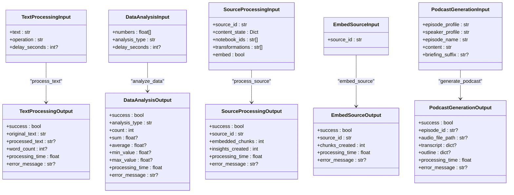

# 命令执行引擎

<cite>
**本文引用的文件**
- [api/command_service.py](file://api/command_service.py)
- [api/routers/commands.py](file://api/routers/commands.py)
- [commands/__init__.py](file://commands/__init__.py)
- [commands/example_commands.py](file://commands/example_commands.py)
- [commands/podcast_commands.py](file://commands/podcast_commands.py)
- [commands/source_commands.py](file://commands/source_commands.py)
- [commands/embedding_commands.py](file://commands/embedding_commands.py)
- [open_notebook/utils/embedding.py](file://open_notebook/utils/embedding.py)
- [open_notebook/domain/notebook.py](file://open_notebook/domain/notebook.py)
- [open_notebook/config.py](file://open_notebook/config.py)
- [frontend/src/lib/api/insights.ts](file://frontend/src/lib/api/insights.ts)
</cite>

## 目录
1. [简介](#简介)
2. [项目结构](#项目结构)
3. [核心组件](#核心组件)
4. [架构总览](#架构总览)
5. [详细组件分析](#详细组件分析)
6. [依赖关系分析](#依赖关系分析)
7. [性能考量](#性能考量)
8. [故障排查指南](#故障排查指南)
9. [结论](#结论)
10. [附录](#附录)

## 简介
本文件系统化阐述命令执行引擎的设计与实现，覆盖命令调度算法、执行队列管理、并发控制机制；详述命令执行上下文、参数传递与返回值处理；包含命令超时管理、中断处理与优雅关闭；并提供执行日志记录、性能监控与资源清理策略，以及命令执行优化与故障恢复机制。

## 项目结构
命令执行引擎由三层组成：
- 路由层：FastAPI 路由负责接收请求、校验输入、调用服务层，并返回状态查询与取消接口。
- 服务层：封装与底层命令调度系统的交互，统一提交、查询、取消等操作。
- 命令层：具体业务命令实现，使用装饰器注册到命令系统，具备输入输出模型与重试策略。

图表来源
- [api/routers/commands.py](file://api/routers/commands.py#L37-L119)
- [api/command_service.py](file://api/command_service.py#L11-L92)
- [commands/example_commands.py](file://commands/example_commands.py#L43-L143)
- [commands/podcast_commands.py](file://commands/podcast_commands.py#L49-L188)
- [commands/source_commands.py](file://commands/source_commands.py#L48-L269)
- [commands/embedding_commands.py](file://commands/embedding_commands.py#L621-L787)
- [open_notebook/utils/embedding.py](file://open_notebook/utils/embedding.py#L82-L208)
- [open_notebook/config.py](file://open_notebook/config.py#L1-L18)

章节来源
- [api/routers/commands.py](file://api/routers/commands.py#L1-L167)
- [api/command_service.py](file://api/command_service.py#L1-L93)
- [commands/__init__.py](file://commands/__init__.py#L1-L25)

## 核心组件
- 路由器：提供命令提交、状态查询、作业列表与取消接口，支持调试注册表查看。
- 服务层：封装提交、状态查询、列表与取消逻辑，屏蔽底层命令系统差异。
- 命令模块：通过装饰器注册命令，定义输入输出模型，内置重试策略与错误处理。
- 工具与配置：嵌入生成与聚合、数据目录与缓存路径等支撑能力。

章节来源
- [api/routers/commands.py](file://api/routers/commands.py#L13-L167)
- [api/command_service.py](file://api/command_service.py#L7-L93)
- [commands/__init__.py](file://commands/__init__.py#L1-L25)
- [open_notebook/utils/embedding.py](file://open_notebook/utils/embedding.py#L1-L208)
- [open_notebook/config.py](file://open_notebook/config.py#L1-L18)

## 架构总览
命令从HTTP入口进入，经路由层解析后交由服务层提交至命令系统；命令系统异步执行具体命令；客户端通过轮询或前端SDK查询状态；命令内部可进一步提交子任务以实现分阶段与并行化。

图表来源
- [api/routers/commands.py](file://api/routers/commands.py#L37-L86)
- [api/command_service.py](file://api/command_service.py#L11-L68)

## 详细组件分析

### 路由层：命令提交与状态查询
- 提交接口：接收应用名、命令名与参数，立即返回job_id，便于后续轮询。
- 状态查询：返回状态、结果、错误消息、时间戳与进度字段。
- 列表与取消：预留接口（当前基础阶段返回空列表/记录尝试）。
- 注册表调试：列出已注册命令及其分组，辅助开发与排障。

图表来源
- [api/routers/commands.py](file://api/routers/commands.py#L37-L119)

章节来源
- [api/routers/commands.py](file://api/routers/commands.py#L13-L167)

### 服务层：统一命令操作
- 提交流程：确保命令模块导入，调用底层提交函数，转换并返回job_id。
- 查询流程：封装底层状态查询，标准化返回字段（含进度）。
- 取消流程：记录尝试（待底层支持完善）。
- 列表流程：预留（基础阶段返回空列表）。

图表来源
- [api/command_service.py](file://api/command_service.py#L7-L93)

章节来源
- [api/command_service.py](file://api/command_service.py#L1-L93)

### 命令层：示例命令与业务命令
- 示例命令：文本处理与数据分析，演示不同处理类型与错误处理。
- 源处理命令：多笔记本批处理、转换链路执行、嵌入与洞察创建。
- 嵌入命令：单条/批量嵌入、均值池化、重建嵌入协调器。
- 播客命令：加载配置、生成播客、持久化结果与错误提示。

图表来源
- [commands/example_commands.py](file://commands/example_commands.py#L10-L143)
- [commands/source_commands.py](file://commands/source_commands.py#L31-L155)
- [commands/embedding_commands.py](file://commands/embedding_commands.py#L104-L118)
- [commands/podcast_commands.py](file://commands/podcast_commands.py#L31-L47)

章节来源
- [commands/example_commands.py](file://commands/example_commands.py#L1-L143)
- [commands/source_commands.py](file://commands/source_commands.py#L1-L269)
- [commands/embedding_commands.py](file://commands/embedding_commands.py#L1-L787)
- [commands/podcast_commands.py](file://commands/podcast_commands.py#L1-L188)

### 执行上下文、参数传递与返回值
- 上下文注入：命令输入基类提供执行上下文字段，命令内部可提取命令ID用于日志与追踪。
- 参数传递：路由层将请求体中的输入字典直接传递给命令；命令内部使用Pydantic模型进行校验与序列化。
- 返回值处理：命令返回标准化输出模型；服务层统一包装为状态响应，包含结果、错误消息与时间戳。

章节来源
- [commands/source_commands.py](file://commands/source_commands.py#L20-L28)
- [commands/embedding_commands.py](file://commands/embedding_commands.py#L26-L31)
- [api/command_service.py](file://api/command_service.py#L47-L68)

### 并发控制与重试策略
- 命令级重试：部分命令显式配置重试策略（最大次数、退避策略、停止条件），区分永久性错误与瞬时错误。
- 协调器模式：重建嵌入命令作为协调器，提交多个子任务，自身禁用重试，子任务各自处理重试。
- 失败分类：验证错误不重试，其他异常按策略重试，最终失败由命令系统记录。

章节来源
- [commands/source_commands.py](file://commands/source_commands.py#L48-L59)
- [commands/source_commands.py](file://commands/source_commands.py#L179-L190)
- [commands/embedding_commands.py](file://commands/embedding_commands.py#L120-L131)
- [commands/embedding_commands.py](file://commands/embedding_commands.py#L212-L233)
- [commands/embedding_commands.py](file://commands/embedding_commands.py#L306-L317)
- [commands/embedding_commands.py](file://commands/embedding_commands.py#L442-L453)
- [commands/embedding_commands.py](file://commands/embedding_commands.py#L621-L640)

### 超时管理、中断处理与优雅关闭
- 超时与轮询：前端SDK默认轮询间隔与最大次数，超时则标记失败；命令系统底层支持取消（当前服务层记录尝试）。
- 中断处理：命令内部捕获异常并返回错误信息；重建嵌入协调器在提交过程中记录失败项。
- 优雅关闭：命令结束时统一记录处理时长；播客命令在失败时附加提示信息帮助定位模型问题。

章节来源
- [frontend/src/lib/api/insights.ts](file://frontend/src/lib/api/insights.ts#L65-L94)
- [api/command_service.py](file://api/command_service.py#L83-L92)
- [commands/podcast_commands.py](file://commands/podcast_commands.py#L169-L187)

### 日志记录、性能监控与资源清理
- 日志记录：命令执行前后记录关键信息；嵌入生成记录文本长度统计与API调用上下文；错误时记录详细堆栈。
- 性能监控：记录处理时长；嵌入命令记录分块统计；前端轮询统计等待时长。
- 资源清理：播客命令创建输出目录；重建嵌入前删除旧嵌入记录；均值池化避免内存峰值。

章节来源
- [commands/example_commands.py](file://commands/example_commands.py#L49-L91)
- [commands/embedding_commands.py](file://commands/embedding_commands.py#L338-L439)
- [commands/embedding_commands.py](file://commands/embedding_commands.py#L641-L787)
- [commands/podcast_commands.py](file://commands/podcast_commands.py#L122-L147)
- [open_notebook/utils/embedding.py](file://open_notebook/utils/embedding.py#L116-L141)

### 优化策略与故障恢复
- 批量嵌入：对多分块一次性生成向量，减少API往返。
- 均值池化：将长文本分块嵌入后合并为单一向量，提升检索一致性。
- 分阶段提交：协调器提交子任务，子任务各自重试，提高整体吞吐。
- 错误恢复：针对特定模型错误给出提示建议；数据库事务冲突场景自动重试。

章节来源
- [open_notebook/utils/embedding.py](file://open_notebook/utils/embedding.py#L82-L141)
- [open_notebook/utils/embedding.py](file://open_notebook/utils/embedding.py#L143-L208)
- [commands/embedding_commands.py](file://commands/embedding_commands.py#L306-L416)
- [commands/embedding_commands.py](file://commands/embedding_commands.py#L442-L545)
- [commands/podcast_commands.py](file://commands/podcast_commands.py#L169-L187)

## 依赖关系分析
命令系统通过装饰器注册，路由层与服务层解耦于具体命令实现；命令内部依赖工具模块与配置；前端通过API轮询状态。

图表来源
- [api/routers/commands.py](file://api/routers/commands.py#L1-L167)
- [api/command_service.py](file://api/command_service.py#L1-L93)
- [commands/example_commands.py](file://commands/example_commands.py#L1-L143)
- [commands/podcast_commands.py](file://commands/podcast_commands.py#L1-L188)
- [commands/source_commands.py](file://commands/source_commands.py#L1-L269)
- [commands/embedding_commands.py](file://commands/embedding_commands.py#L1-L787)
- [open_notebook/utils/embedding.py](file://open_notebook/utils/embedding.py#L1-L208)
- [open_notebook/config.py](file://open_notebook/config.py#L1-L18)
- [frontend/src/lib/api/insights.ts](file://frontend/src/lib/api/insights.ts#L54-L94)

章节来源
- [api/routers/commands.py](file://api/routers/commands.py#L1-L167)
- [api/command_service.py](file://api/command_service.py#L1-L93)
- [commands/__init__.py](file://commands/__init__.py#L1-L25)

## 性能考量
- I/O密集与批处理：嵌入生成采用批量API调用与均值池化，降低网络开销与内存峰值。
- 并发与重试：子命令独立重试，协调器只负责编排，提升整体吞吐。
- 轮询策略：前端默认2秒轮询，最多60次，平衡实时性与服务器压力。
- 数据库写入：重建嵌入前删除旧记录，保证一致性；批量插入减少事务次数。

章节来源
- [open_notebook/utils/embedding.py](file://open_notebook/utils/embedding.py#L82-L141)
- [commands/embedding_commands.py](file://commands/embedding_commands.py#L351-L403)
- [frontend/src/lib/api/insights.ts](file://frontend/src/lib/api/insights.ts#L65-L94)

## 故障排查指南
- 提交失败：检查命令模块是否导入成功；确认应用名与命令名正确；查看服务层错误日志。
- 状态查询失败：确认job_id有效；检查底层命令系统状态可用性。
- 取消无效：当前仅记录尝试，需等待底层支持完善。
- 播客生成错误：若出现JSON解析错误，考虑更换模型；查看服务层附加提示。
- 嵌入失败：检查嵌入模型配置；确认内容非空且可分块；查看均值池化统计。

章节来源
- [api/command_service.py](file://api/command_service.py#L18-L44)
- [api/command_service.py](file://api/command_service.py#L66-L68)
- [api/command_service.py](file://api/command_service.py#L83-L92)
- [commands/podcast_commands.py](file://commands/podcast_commands.py#L169-L187)
- [open_notebook/utils/embedding.py](file://open_notebook/utils/embedding.py#L108-L141)

## 结论
该命令执行引擎以装饰器注册为核心，结合服务层抽象与前端轮询，实现了高内聚、低耦合的异步命令体系。通过明确的上下文与输入输出模型、完善的重试与错误分类、以及批处理与均值池化等优化手段，满足了复杂业务场景下的可靠性与性能需求。未来可在作业列表、取消与监控方面进一步完善，以支撑更大规模的生产环境。

## 附录
- 前端轮询示例：参考前端SDK的轮询与超时处理逻辑，合理设置轮询间隔与最大次数。
- 命令注册调试：通过调试端点查看已注册命令与分组，辅助开发与排障。

章节来源
- [frontend/src/lib/api/insights.ts](file://frontend/src/lib/api/insights.ts#L65-L94)
- [api/routers/commands.py](file://api/routers/commands.py#L122-L167)