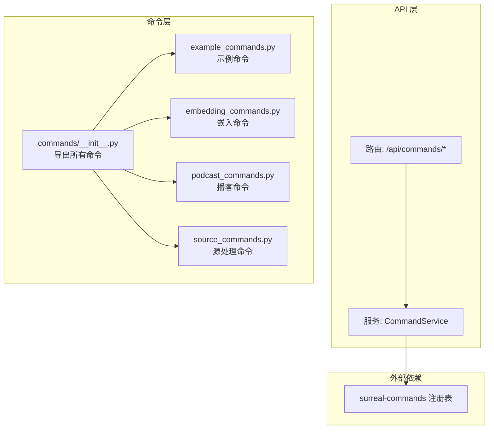
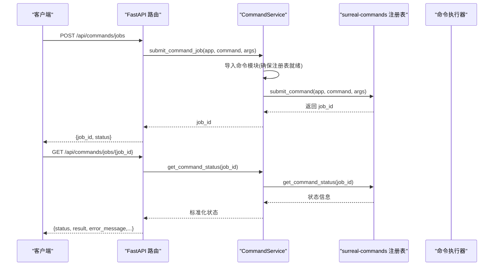
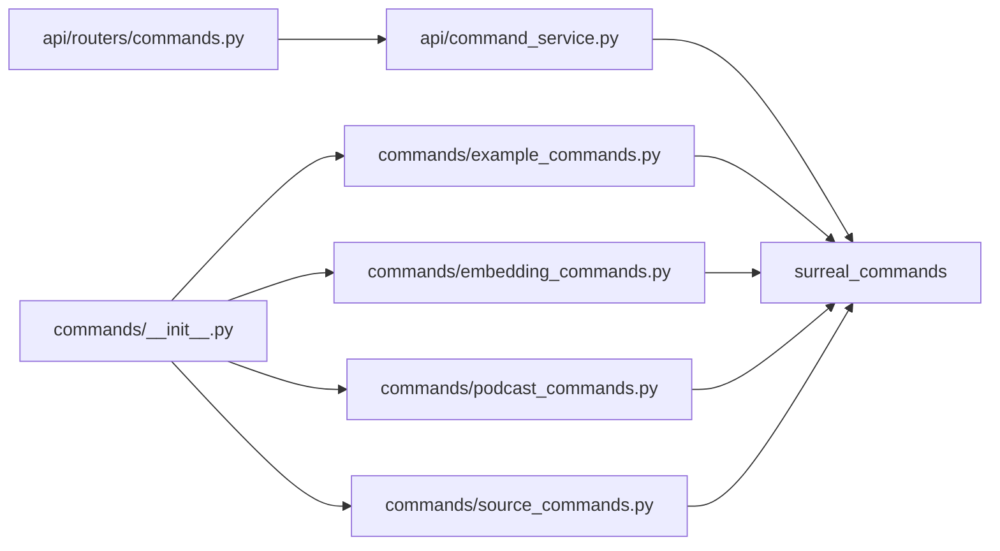

# 命令注册与发现

<cite>
**本文引用的文件**
- [api/command_service.py](file://api/command_service.py)
- [api/routers/commands.py](file://api/routers/commands.py)
- [commands/__init__.py](file://commands/__init__.py)
- [commands/example_commands.py](file://commands/example_commands.py)
- [commands/embedding_commands.py](file://commands/embedding_commands.py)
- [commands/podcast_commands.py](file://commands/podcast_commands.py)
- [commands/source_commands.py](file://commands/source_commands.py)
- [api/main.py](file://api/main.py)
- [pyproject.toml](file://pyproject.toml)
</cite>

## 目录
1. [简介](#简介)
2. [项目结构](#项目结构)
3. [核心组件](#核心组件)
4. [架构总览](#架构总览)
5. [详细组件分析](#详细组件分析)
6. [依赖关系分析](#依赖关系分析)
7. [性能考量](#性能考量)
8. [故障排查指南](#故障排查指南)
9. [结论](#结论)
10. [附录](#附录)

## 简介
本文件系统化阐述本项目的“命令注册与发现”机制，围绕以下目标展开：
- 解释命令注册表的工作原理、命令元数据管理与自动发现机制
- 详解命令装饰器的使用、命令参数验证与类型检查
- 覆盖命令命名规范、版本管理与兼容性处理
- 提供命令注册流程、依赖注入与生命周期管理
- 总结命令开发最佳实践与调试技巧

该系统基于 surreal-commands 库实现命令装饰器与注册表，并通过 FastAPI 路由暴露命令提交、状态查询与调试接口；命令实现位于 commands 包中，采用 Pydantic 模型进行输入输出的强类型约束与自动校验。

## 项目结构
命令系统主要分布在以下模块：
- API 层：FastAPI 路由与服务封装，负责命令提交、状态查询与调试
- 命令层：commands 包下的具体命令实现，使用 @command 装饰器注册
- 配置与入口：主应用在启动时加载命令模块，确保注册表可用

图表来源
- [api/routers/commands.py](file://api/routers/commands.py#L1-L167)
- [api/command_service.py](file://api/command_service.py#L1-L93)
- [commands/__init__.py](file://commands/__init__.py#L1-L25)
- [commands/example_commands.py](file://commands/example_commands.py#L1-L143)
- [commands/embedding_commands.py](file://commands/embedding_commands.py#L1-L787)
- [commands/podcast_commands.py](file://commands/podcast_commands.py#L1-L188)
- [commands/source_commands.py](file://commands/source_commands.py#L1-L269)

章节来源
- [api/routers/commands.py](file://api/routers/commands.py#L1-L167)
- [api/command_service.py](file://api/command_service.py#L1-L93)
- [commands/__init__.py](file://commands/__init__.py#L1-L25)

## 核心组件
- 命令装饰器与注册表
  - 使用 surreal-commands 的 @command 装饰器为函数注册到全局注册表，指定 app 名称与可选重试策略
  - 注册表可通过 registry.get_all_commands() 获取已注册命令列表，用于调试与可视化
- 命令服务层
  - CommandService 封装提交、状态查询、作业列表与取消等操作，内部调用 surreal-commands 的 submit_command/get_command_status
  - 在提交前强制导入命令模块，确保注册表已填充
- API 路由层
  - 提供 /commands/jobs 提交命令并返回 job_id
  - 提供 /commands/jobs/{job_id} 查询状态
  - 提供 /commands/registry/debug 查看注册表内容
- 命令实现层
  - commands 包下各模块定义命令函数，使用 Pydantic 模型作为输入输出类型，自动完成参数验证与序列化
  - 支持重试策略（如指数退避抖动），区分永久错误与瞬时错误

章节来源
- [api/routers/commands.py](file://api/routers/commands.py#L1-L167)
- [api/command_service.py](file://api/command_service.py#L1-L93)
- [commands/example_commands.py](file://commands/example_commands.py#L1-L143)
- [commands/embedding_commands.py](file://commands/embedding_commands.py#L1-L787)
- [commands/podcast_commands.py](file://commands/podcast_commands.py#L1-L188)
- [commands/source_commands.py](file://commands/source_commands.py#L1-L269)

## 架构总览
命令从提交到执行的关键路径如下：

图表来源
- [api/routers/commands.py](file://api/routers/commands.py#L37-L86)
- [api/command_service.py](file://api/command_service.py#L11-L68)

## 详细组件分析

### 命令装饰器与元数据管理
- 装饰器使用
  - @command("command_name", app="open_notebook", retry=...) 将函数注册为命令，绑定 app 与重试策略
  - 示例：文本处理命令、数据分析命令、播客生成命令、源处理与转换命令等
- 元数据与类型检查
  - 输入/输出均使用 Pydantic BaseModel 定义，自动进行字段类型校验、默认值处理与序列化
  - 命令函数签名中，输入参数类型即为 Pydantic 模型，返回值亦为 Pydantic 模型
- 自动发现机制
  - 通过 commands/__init__.py 统一导出命令，确保模块被导入后注册到注册表
  - API 启动时显式导入命令模块，保证注册表在服务启动阶段就绪
  - 调试端点 /commands/registry/debug 可列出所有已注册命令及其 app 分组

章节来源
- [commands/example_commands.py](file://commands/example_commands.py#L43-L143)
- [commands/embedding_commands.py](file://commands/embedding_commands.py#L120-L787)
- [commands/podcast_commands.py](file://commands/podcast_commands.py#L49-L188)
- [commands/source_commands.py](file://commands/source_commands.py#L48-L269)
- [commands/__init__.py](file://commands/__init__.py#L1-L25)
- [api/routers/commands.py](file://api/routers/commands.py#L122-L167)
- [api/main.py](file://api/main.py#L40-L44)

### 命令参数验证与类型检查
- 输入模型
  - TextProcessingInput/DataAnalysisInput/PodcastGenerationInput/EmbedNoteInput 等均为 Pydantic 模型，定义必填字段、可选字段与默认值
- 输出模型
  - 对应的 Output 模型统一包含 success、processing_time 等通用字段，便于上层消费
- 校验行为
  - 请求体经 FastAPI 的 Pydantic 校验后进入路由
  - 命令函数内部对业务逻辑进行二次校验（如空值、范围、格式）
  - 异常被捕获并映射到输出模型的 error_message 字段

章节来源
- [commands/example_commands.py](file://commands/example_commands.py#L10-L41)
- [commands/podcast_commands.py](file://commands/podcast_commands.py#L31-L47)
- [commands/embedding_commands.py](file://commands/embedding_commands.py#L33-L118)
- [commands/source_commands.py](file://commands/source_commands.py#L31-L46)

### 命令命名规范与版本管理
- 命名规范
  - 命令名称建议使用小写加下划线风格，语义清晰且唯一
  - app 名统一为 "open_notebook"，便于按应用维度分组与隔离
- 版本与兼容
  - 当前实现未直接体现命令版本号字段；可通过命令名称后缀或输入输出模型版本字段实现向后兼容
  - 建议在新增命令或变更输入输出时，保持向后兼容或引入新命令替代旧命令

章节来源
- [commands/example_commands.py](file://commands/example_commands.py#L43-L94)
- [commands/embedding_commands.py](file://commands/embedding_commands.py#L120-L621)
- [commands/podcast_commands.py](file://commands/podcast_commands.py#L49-L131)
- [commands/source_commands.py](file://commands/source_commands.py#L48-L191)

### 命令注册流程与生命周期
- 注册流程
  - 命令模块被导入时，@command 装饰器将函数注册到 surreal-commands 注册表
  - API 启动阶段显式导入命令模块，确保注册表在服务可用前就绪
- 生命周期
  - 提交：CommandService.submit_command_job 调用 surreal-commands 提交命令
  - 执行：命令在后台执行，支持重试策略（指数退避抖动）
  - 状态：CommandService.get_command_status 返回标准化状态与结果
  - 取消：预留取消接口，当前记录日志并返回成功占位

章节来源
- [api/command_service.py](file://api/command_service.py#L11-L92)
- [api/routers/commands.py](file://api/routers/commands.py#L37-L119)
- [api/main.py](file://api/main.py#L40-L44)

### 依赖注入与上下文
- 执行上下文
  - 命令输入模型继承自 CommandInput，可访问 execution_context.command_id 等上下文信息
- 外部依赖
  - 数据库：通过 repository 接口进行查询与写入
  - AI 模型：通过 model_manager 获取嵌入模型
  - 文件系统：播客命令在 DATA_FOLDER 下生成音频与转录文件
- 依赖注入方式
  - 通过函数参数传递模型实例或工具类，避免全局状态
  - 命令函数内部按需加载资源（如模型、配置）

章节来源
- [commands/embedding_commands.py](file://commands/embedding_commands.py#L26-L131)
- [commands/podcast_commands.py](file://commands/podcast_commands.py#L13-L188)
- [commands/source_commands.py](file://commands/source_commands.py#L60-L154)

### 错误处理与重试策略
- 错误分类
  - 永久错误：如参数缺失、对象不存在等，不重试
  - 瞬时错误：网络超时、数据库锁冲突等，按策略重试
- 重试策略
  - 最大尝试次数、等待策略（指数退避抖动）、最小/最大等待时间、停止条件（如遇到特定异常类型）
- 日志与可观测性
  - 成功与失败均记录处理时长与关键信息
  - 调试端点可查看注册表与命令分组

章节来源
- [commands/embedding_commands.py](file://commands/embedding_commands.py#L120-L439)
- [commands/source_commands.py](file://commands/source_commands.py#L48-L154)
- [commands/podcast_commands.py](file://commands/podcast_commands.py#L49-L188)

## 依赖关系分析
- 外部依赖
  - surreal-commands：提供命令装饰器、注册表、提交与状态查询能力
  - pydantic：提供输入输出模型的类型检查与序列化
  - loguru：统一日志记录
- 内部依赖
  - API 路由依赖 CommandService
  - CommandService 依赖 surreal-commands 的 submit_command/get_command_status
  - 命令模块依赖 surreal-commands 的 @command 装饰器与 CommandInput/CommandOutput 基类

图表来源
- [api/routers/commands.py](file://api/routers/commands.py#L1-L167)
- [api/command_service.py](file://api/command_service.py#L1-L93)
- [commands/__init__.py](file://commands/__init__.py#L1-L25)
- [commands/example_commands.py](file://commands/example_commands.py#L1-L143)
- [commands/embedding_commands.py](file://commands/embedding_commands.py#L1-L787)
- [commands/podcast_commands.py](file://commands/podcast_commands.py#L1-L188)
- [commands/source_commands.py](file://commands/source_commands.py#L1-L269)

章节来源
- [pyproject.toml](file://pyproject.toml#L15-L43)

## 性能考量
- 并发与队列
  - 命令执行可能因队列深度导致延迟，可通过增加重试等待上限缓解
- 批量处理
  - 嵌入重建命令会批量提交多个子任务，注意控制提交频率与并发度
- I/O 与网络
  - 嵌入生成与外部模型调用是性能瓶颈，建议合理设置批大小与缓存策略
- 日志开销
  - 重试日志级别可调整，避免高频日志影响性能

## 故障排查指南
- 提交失败
  - 确认命令模块已导入，注册表中有对应命令
  - 检查请求体字段是否符合 Pydantic 模型定义
- 状态查询异常
  - 确认 job_id 正确且未过期
  - 查看服务端日志定位 surreal-commands 状态查询问题
- 调试注册表
  - 访问 /api/commands/registry/debug，确认 app 与命令名称正确
- 常见错误
  - 参数缺失或类型不符：检查输入模型字段
  - 对象不存在：检查 ID 是否有效
  - 外部依赖不可用：检查模型配置、文件路径与网络连通性

章节来源
- [api/routers/commands.py](file://api/routers/commands.py#L122-L167)
- [api/command_service.py](file://api/command_service.py#L11-L92)

## 结论
本系统的命令注册与发现机制以 surreal-commands 为核心，结合 FastAPI 路由与 Pydantic 类型系统，实现了：
- 明确的命令装饰器与注册表
- 强类型的输入输出模型与自动校验
- 可观测的提交、状态查询与调试接口
- 可扩展的重试策略与生命周期管理

建议在后续迭代中完善命令版本化、作业列表与取消功能，并持续优化批量提交与外部依赖的性能表现。

## 附录

### 命令开发最佳实践
- 使用清晰的命令命名与 app 分组
- 输入输出模型尽量保持稳定，必要时通过新模型或字段迁移实现兼容
- 明确区分永久错误与瞬时错误，合理配置重试策略
- 在命令函数内记录关键指标（处理时长、错误原因）以便监控
- 通过调试端点定期检查注册表状态

### 调试技巧
- 使用 /api/commands/registry/debug 快速核对命令清单
- 在本地开发环境开启更详细的日志级别，定位重试与异常
- 对批量提交场景，先小规模测试再扩大规模