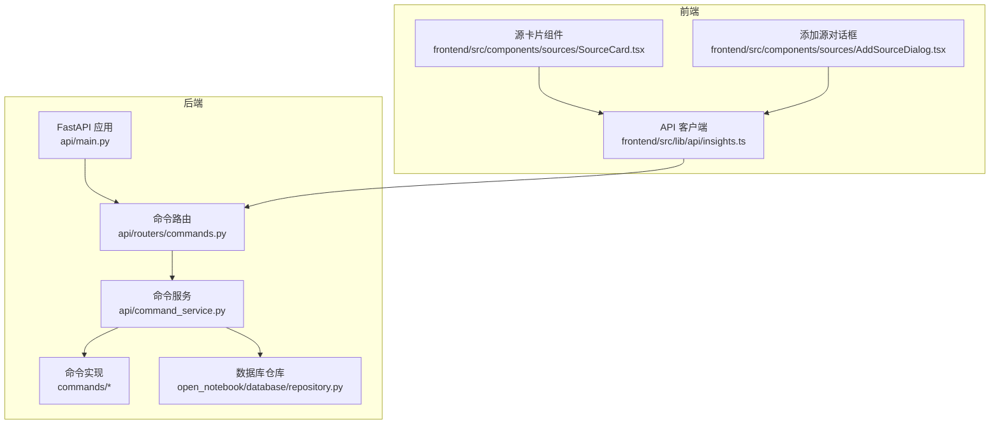
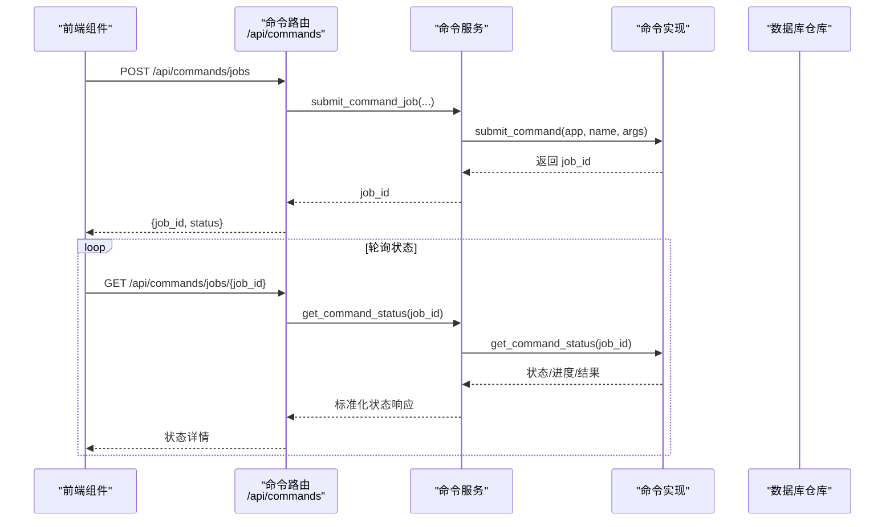
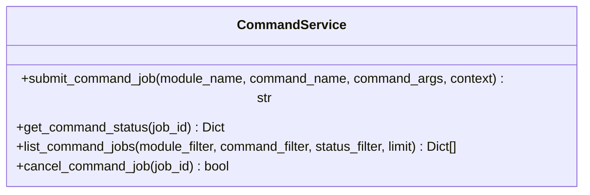
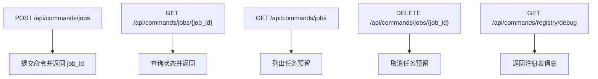
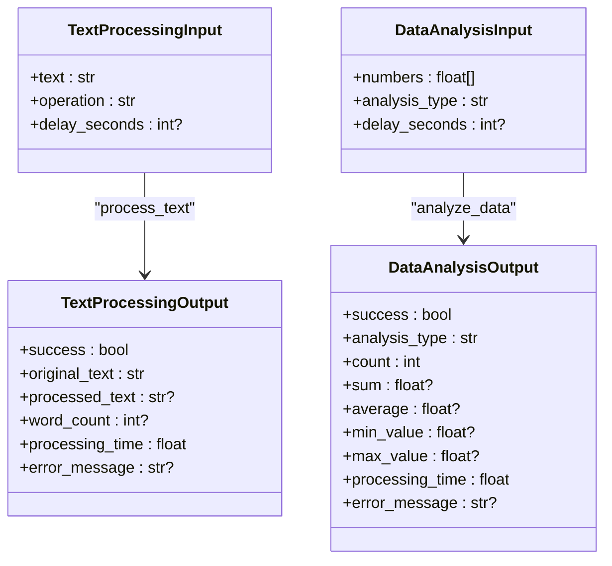
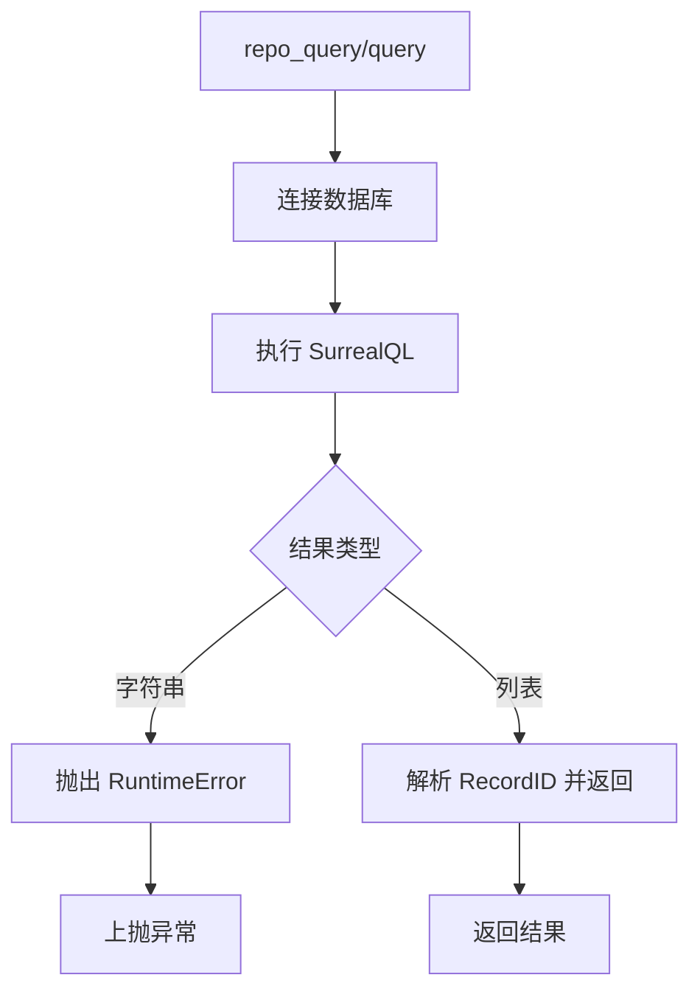
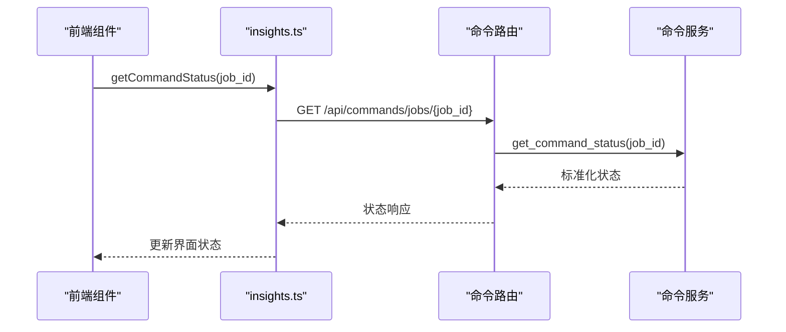
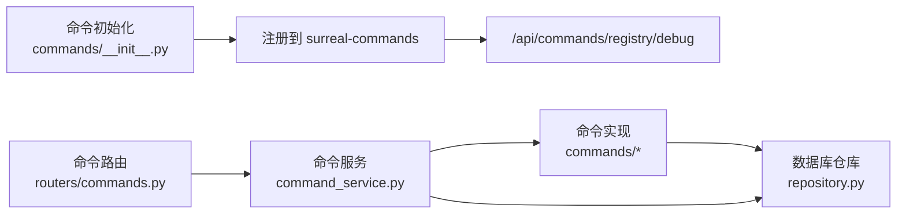

# 命令监控与状态管理

<cite>
**本文档引用的文件**
- [api/command_service.py](file://api/command_service.py)
- [api/routers/commands.py](file://api/routers/commands.py)
- [api/main.py](file://api/main.py)
- [commands/__init__.py](file://commands/__init__.py)
- [commands/example_commands.py](file://commands/example_commands.py)
- [commands/embedding_commands.py](file://commands/embedding_commands.py)
- [open_notebook/database/repository.py](file://open_notebook/database/repository.py)
- [frontend/src/lib/api/insights.ts](file://frontend/src/lib/api/insights.ts)
- [frontend/src/components/sources/AddSourceDialog.tsx](file://frontend/src/components/sources/AddSourceDialog.tsx)
- [frontend/src/components/sources/SourceCard.tsx](file://frontend/src/components/sources/SourceCard.tsx)
- [api/routers/souces.py](file://api/routers/souces.py)
- [api/routers/embedding_rebuild.py](file://api/routers/embedding_rebuild.py)
</cite>

## 目录
1. [简介](#简介)
2. [项目结构](#项目结构)
3. [核心组件](#核心组件)
4. [架构总览](#架构总览)
5. [详细组件分析](#详细组件分析)
6. [依赖关系分析](#依赖关系分析)
7. [性能考虑](#性能考虑)
8. [故障排查指南](#故障排查指南)
9. [结论](#结论)
10. [附录](#附录)

## 简介
本文件面向“命令监控与状态管理”的完整实现，覆盖命令提交、状态跟踪、进度上报、实时更新、历史与审计、取消与重试策略、指标采集与告警建议、以及状态查询 API 与前端集成方案。当前系统基于 FastAPI 提供 REST 接口，使用 surreal-commands 作为命令执行引擎，并通过 SurrealDB 进行数据持久化与查询。

## 项目结构
围绕命令监控与状态管理的关键模块分布如下：
- 后端 API 层：提供命令提交、状态查询、任务列表与取消接口
- 命令服务层：封装 surreal-commands 的提交与状态查询能力
- 命令实现层：定义具体可执行命令（示例命令与嵌入命令）
- 数据访问层：统一的数据库连接与查询封装
- 前端集成：通过 API 客户端轮询命令状态，展示进度与结果

图表来源
- [api/main.py](file://api/main.py#L157-L180)
- [api/routers/commands.py](file://api/routers/commands.py#L1-L167)
- [api/command_service.py](file://api/command_service.py#L1-L93)
- [commands/__init__.py](file://commands/__init__.py#L1-L25)
- [open_notebook/database/repository.py](file://open_notebook/database/repository.py#L1-L195)
- [frontend/src/lib/api/insights.ts](file://frontend/src/lib/api/insights.ts#L50-L94)
- [frontend/src/components/sources/SourceCard.tsx](file://frontend/src/components/sources/SourceCard.tsx#L130-L394)
- [frontend/src/components/sources/AddSourceDialog.tsx](file://frontend/src/components/sources/AddSourceDialog.tsx#L496-L532)

章节来源
- [api/main.py](file://api/main.py#L157-L180)
- [api/routers/commands.py](file://api/routers/commands.py#L1-L167)
- [api/command_service.py](file://api/command_service.py#L1-L93)
- [commands/__init__.py](file://commands/__init__.py#L1-L25)
- [open_notebook/database/repository.py](file://open_notebook/database/repository.py#L1-L195)
- [frontend/src/lib/api/insights.ts](file://frontend/src/lib/api/insights.ts#L50-L94)
- [frontend/src/components/sources/SourceCard.tsx](file://frontend/src/components/sources/SourceCard.tsx#L130-L394)
- [frontend/src/components/sources/AddSourceDialog.tsx](file://frontend/src/components/sources/AddSourceDialog.tsx#L496-L532)

## 核心组件
- 命令服务层（CommandService）：封装提交命令、查询状态、列出任务、取消任务等通用操作；对接 surreal-commands 的状态查询与提交能力。
- 命令路由层（commands 路由）：提供 REST API，包括提交命令、查询单个任务状态、列出任务、取消任务、调试注册表等。
- 命令实现层：包含示例命令与嵌入命令，展示输入输出模型、错误处理、重试策略与进度上报。
- 数据访问层（Repository）：统一数据库连接、查询、插入、更新、删除，支持 RecordID 解析与转换。
- 前端集成：通过 API 客户端轮询命令状态，前端组件根据状态渲染进度条与结果。

章节来源
- [api/command_service.py](file://api/command_service.py#L7-L93)
- [api/routers/commands.py](file://api/routers/commands.py#L13-L167)
- [commands/example_commands.py](file://commands/example_commands.py#L43-L143)
- [commands/embedding_commands.py](file://commands/embedding_commands.py#L120-L787)
- [open_notebook/database/repository.py](file://open_notebook/database/repository.py#L65-L195)
- [frontend/src/lib/api/insights.ts](file://frontend/src/lib/api/insights.ts#L54-L94)

## 架构总览
命令从提交到完成的典型流程如下：

图表来源
- [api/routers/commands.py](file://api/routers/commands.py#L37-L86)
- [api/command_service.py](file://api/command_service.py#L10-L68)
- [commands/example_commands.py](file://commands/example_commands.py#L43-L92)
- [commands/embedding_commands.py](file://commands/embedding_commands.py#L120-L210)

## 详细组件分析

### 命令服务层（CommandService）
职责与特性：
- 提交命令：确保命令模块导入后调用 surreal-commands 的提交函数，返回字符串化的 job_id。
- 查询状态：封装 surreal-commands 的状态查询，标准化返回字段（状态、结果、错误信息、时间戳、进度）。
- 列出任务：预留接口，当前返回空列表（基础阶段）。
- 取消任务：预留接口，当前仅记录尝试（等待 surreal-commands 支持）。

图表来源
- [api/command_service.py](file://api/command_service.py#L7-L93)

章节来源
- [api/command_service.py](file://api/command_service.py#L10-L92)

### 命令路由层（commands 路由）
职责与特性：
- 提交命令：接收请求体中的命令名、应用名与输入参数，立即返回 job_id。
- 查询状态：按 job_id 获取状态，返回标准化响应。
- 列出任务：支持按命令名、状态过滤与限制数量。
- 取消任务：删除路径触发取消尝试。
- 注册表调试：列出已注册命令及其分组。

图表来源
- [api/routers/commands.py](file://api/routers/commands.py#L37-L167)

章节来源
- [api/routers/commands.py](file://api/routers/commands.py#L13-L167)

### 命令实现层
- 示例命令：演示文本处理与数据分析命令，包含输入输出模型、异常处理与处理时长统计。
- 嵌入命令：包含笔记、洞察与源的嵌入生成与存储，支持重试策略、批量插入与进度上报。

图表来源
- [commands/example_commands.py](file://commands/example_commands.py#L10-L41)

章节来源
- [commands/example_commands.py](file://commands/example_commands.py#L43-L143)
- [commands/embedding_commands.py](file://commands/embedding_commands.py#L120-L787)

### 数据访问层（Repository）
职责与特性：
- 统一数据库连接与认证，支持 RecordID 解析与转换。
- 提供查询、创建、关联、更新、删除与批量插入等操作。
- 对事务冲突与错误进行日志级别控制与异常抛出。

图表来源
- [open_notebook/database/repository.py](file://open_notebook/database/repository.py#L65-L195)

章节来源
- [open_notebook/database/repository.py](file://open_notebook/database/repository.py#L1-L195)

### 前端集成与实时更新
- API 客户端：提供获取命令状态与轮询等待完成的方法。
- 源卡片组件：根据状态渲染进度条与处理信息，自动停止轮询。
- 添加源对话框：展示批量进度与单项进度条。

图表来源
- [frontend/src/lib/api/insights.ts](file://frontend/src/lib/api/insights.ts#L54-L94)
- [api/routers/commands.py](file://api/routers/commands.py#L74-L86)
- [api/command_service.py](file://api/command_service.py#L47-L68)

章节来源
- [frontend/src/lib/api/insights.ts](file://frontend/src/lib/api/insights.ts#L54-L94)
- [frontend/src/components/sources/SourceCard.tsx](file://frontend/src/components/sources/SourceCard.tsx#L130-L394)
- [frontend/src/components/sources/AddSourceDialog.tsx](file://frontend/src/components/sources/AddSourceDialog.tsx#L496-L532)

## 依赖关系分析
- 命令注册与发现：命令在初始化时被导入，注册到 surreal-commands 的本地注册表，路由提供调试接口查看注册项。
- 数据持久化：命令实现通过 Repository 封装的查询与插入接口与数据库交互。
- 状态查询：路由直接调用命令服务，命令服务再调用 surreal-commands 的状态查询。

图表来源
- [commands/__init__.py](file://commands/__init__.py#L1-L25)
- [api/routers/commands.py](file://api/routers/commands.py#L122-L167)
- [api/command_service.py](file://api/command_service.py#L1-L93)
- [open_notebook/database/repository.py](file://open_notebook/database/repository.py#L1-L195)

章节来源
- [commands/__init__.py](file://commands/__init__.py#L1-L25)
- [api/routers/commands.py](file://api/routers/commands.py#L122-L167)
- [api/command_service.py](file://api/command_service.py#L1-L93)
- [open_notebook/database/repository.py](file://open_notebook/database/repository.py#L1-L195)

## 性能考虑
- 异步与并发：命令实现采用异步模式，避免阻塞；批量插入与嵌入生成减少多次往返。
- 重试策略：嵌入命令为瞬态失败配置指数退避重试，避免永久性错误重复尝试。
- 日志与可观测性：命令实现与服务层均记录关键事件与错误，便于定位问题。
- 前端轮询：默认轮询间隔与最大次数可在客户端配置，平衡用户体验与服务器压力。

章节来源
- [commands/embedding_commands.py](file://commands/embedding_commands.py#L120-L210)
- [commands/embedding_commands.py](file://commands/embedding_commands.py#L306-L440)
- [frontend/src/lib/api/insights.ts](file://frontend/src/lib/api/insights.ts#L65-L94)

## 故障排查指南
常见问题与处理建议：
- 提交命令失败：检查命令模块是否正确导入与注册；确认 surreal-commands 的 app 名称与命令名称一致。
- 查询状态为空：确认 job_id 正确且命令仍在运行或存在；检查 surreal-commands 的状态存储。
- 取消任务无效：当前取消接口为预留实现，需等待 surreal-commands 的取消支持。
- 前端无法轮询：检查网络连通性与 CORS 配置；确认 API 路径与鉴权设置。
- 数据库事务冲突：Repository 已对冲突进行日志降级处理，必要时重试或调整并发度。

章节来源
- [api/command_service.py](file://api/command_service.py#L18-L44)
- [api/command_service.py](file://api/command_service.py#L82-L92)
- [open_notebook/database/repository.py](file://open_notebook/database/repository.py#L77-L82)
- [api/main.py](file://api/main.py#L105-L127)

## 结论
该系统以 surreal-commands 为核心，结合 FastAPI 的 REST 接口与前端轮询机制，实现了命令提交、状态查询与进度展示的闭环。嵌入命令展示了重试、批量处理与进度上报的最佳实践。后续可扩展任务列表、取消与暂停、历史与审计、指标与告警等功能，以满足更复杂的生产场景需求。

## 附录

### 状态查询 API
- 提交命令
  - 方法与路径：POST /api/commands/jobs
  - 请求体字段：command（命令名）、app（应用名）、input（参数字典）
  - 响应：job_id、status、message
- 查询单个任务状态
  - 方法与路径：GET /api/commands/jobs/{job_id}
  - 响应字段：job_id、status、result、error_message、created、updated、progress
- 列出任务（预留）
  - 方法与路径：GET /api/commands/jobs?command_filter=&status_filter=&limit=
- 取消任务（预留）
  - 方法与路径：DELETE /api/commands/jobs/{job_id}
- 调试注册表
  - 方法与路径：GET /api/commands/registry/debug

章节来源
- [api/routers/commands.py](file://api/routers/commands.py#L37-L167)

### 前端集成要点
- 使用 API 客户端轮询命令状态，直到完成或失败。
- 在组件中根据状态渲染进度条与处理信息，完成后停止轮询。
- 批量处理场景下显示总体进度与单项进度。

章节来源
- [frontend/src/lib/api/insights.ts](file://frontend/src/lib/api/insights.ts#L54-L94)
- [frontend/src/components/sources/SourceCard.tsx](file://frontend/src/components/sources/SourceCard.tsx#L375-L390)
- [frontend/src/components/sources/AddSourceDialog.tsx](file://frontend/src/components/sources/AddSourceDialog.tsx#L519-L526)