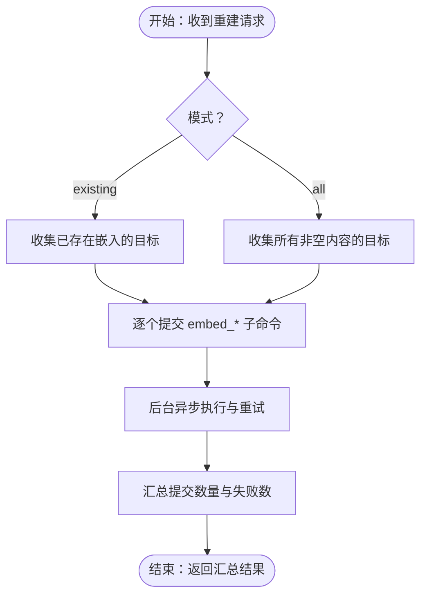

# 命令类型与分类

<cite>
**本文引用的文件**
- [commands/__init__.py](file://commands/__init__.py)
- [commands/embedding_commands.py](file://commands/embedding_commands.py)
- [commands/podcast_commands.py](file://commands/podcast_commands.py)
- [commands/source_commands.py](file://commands/source_commands.py)
- [commands/example_commands.py](file://commands/example_commands.py)
- [api/command_service.py](file://api/command_service.py)
- [api/routers/commands.py](file://api/routers/commands.py)
- [open_notebook/podcasts/models.py](file://open_notebook/podcasts/models.py)
- [open_notebook/domain/notebook.py](file://open_notebook/domain/notebook.py)
- [docs/7-DEVELOPMENT/code-standards.md](file://docs/7-DEVELOPMENT/code-standards.md)
</cite>

## 目录
1. [简介](#简介)
2. [项目结构](#项目结构)
3. [核心组件](#核心组件)
4. [架构总览](#架构总览)
5. [详细组件分析](#详细组件分析)
6. [依赖关系分析](#依赖关系分析)
7. [性能考量](#性能考量)
8. [故障排查指南](#故障排查指南)
9. [结论](#结论)
10. [附录：新命令开发指南与最佳实践](#附录新命令开发指南与最佳实践)

## 简介
本文件系统性梳理 Open Notebook 的命令体系，聚焦命令类型与分类，解释不同命令的特点、用途与实现方式，并覆盖嵌入命令、播客生成命令、源处理命令与示例命令。文档还涵盖命令参数结构、输入输出格式、错误处理策略、命令组合使用（链式执行）、条件判断以及新命令开发指南与最佳实践，帮助开发者快速理解并扩展命令系统。

## 项目结构
命令系统由“命令模块 + API 路由 + 服务层 + 模型”四部分组成：
- 命令模块：定义具体命令函数及其输入/输出模型，使用统一装饰器注册为可调度任务。
- API 路由：对外暴露命令提交、状态查询等接口，便于前端或外部系统异步调用。
- 服务层：封装命令提交、状态查询等通用能力，屏蔽底层调度细节。
- 模型：与命令结果关联的数据模型（如播客剧集），支持命令作业跟踪与状态回显。

图表来源
- [commands/embedding_commands.py](file://commands/embedding_commands.py#L1-L787)
- [commands/podcast_commands.py](file://commands/podcast_commands.py#L1-L188)
- [commands/source_commands.py](file://commands/source_commands.py#L1-L269)
- [commands/example_commands.py](file://commands/example_commands.py#L1-L143)
- [api/routers/commands.py](file://api/routers/commands.py#L1-L167)
- [api/command_service.py](file://api/command_service.py#L1-L93)
- [open_notebook/podcasts/models.py](file://open_notebook/podcasts/models.py#L1-L148)
- [open_notebook/domain/notebook.py](file://open_notebook/domain/notebook.py#L1-L200)

章节来源
- [commands/__init__.py](file://commands/__init__.py#L1-L25)
- [api/routers/commands.py](file://api/routers/commands.py#L1-L167)
- [api/command_service.py](file://api/command_service.py#L1-L93)

## 核心组件
- 嵌入命令族：负责对笔记、洞察、源文档进行向量化嵌入，支持重建嵌入、批量提交与重试策略。
- 播客生成命令：基于预设的剧集与说话人配置，生成播客音频、转写与大纲。
- 源处理命令：对源内容执行图式处理（含转换、嵌入、洞察生成），支持链式提交与异步执行。
- 示例命令：提供文本处理与数据分析示例，演示命令输入/输出、错误处理与异步行为。

章节来源
- [commands/embedding_commands.py](file://commands/embedding_commands.py#L1-L787)
- [commands/podcast_commands.py](file://commands/podcast_commands.py#L1-L188)
- [commands/source_commands.py](file://commands/source_commands.py#L1-L269)
- [commands/example_commands.py](file://commands/example_commands.py#L1-L143)

## 架构总览
命令系统通过统一的装饰器注册命令，API 层负责接收请求并委托服务层提交到后台调度器；命令在后台执行，期间可被查询状态；部分命令会创建领域模型记录以便后续追踪。

图表来源
- [api/routers/commands.py](file://api/routers/commands.py#L37-L105)
- [api/command_service.py](file://api/command_service.py#L10-L68)

## 详细组件分析

### 嵌入命令（Embedding Commands）
- 命令类型
  - 单条嵌入：对单个笔记、单个洞察或单个源文档生成嵌入。
  - 批量重建：根据模式与包含项收集目标，异步提交多个嵌入任务。
  - 洞察创建：创建洞察记录并“火并式”提交后续嵌入任务。
- 输入/输出模型
  - 单条嵌入：包含目标对象 ID（笔记/洞察/源）。
  - 批量重建：包含模式（仅现有/全部）、包含标志（源/笔记/洞察）。
  - 洞察创建：包含源 ID、洞察类型、内容。
- 处理流程
  - 加载目标实体 → 验证内容 → 自动生成嵌入（必要时分块与平均池化）→ 写入数据库。
  - 批量重建：先收集目标列表，再逐个提交子命令，最终返回汇总统计。
- 错误处理
  - 永久性错误（如未找到记录、无内容）不重试，直接返回失败信息。
  - 临时性错误（网络/超时）按指数抖动退避重试，直至成功或达到上限。
- 组合与链式执行
  - 批量重建命令作为“协调者”，提交多个子命令，子命令各自带重试策略。
  - 洞察创建命令在创建后“火并式”提交嵌入命令，形成简单链式。
- 性能特性
  - 支持内容类型感知的分块与批量嵌入，减少 API 调用次数。
  - 对已有嵌入进行幂等删除与重建，避免重复数据。

图表来源
- [commands/embedding_commands.py](file://commands/embedding_commands.py#L548-L786)

章节来源
- [commands/embedding_commands.py](file://commands/embedding_commands.py#L1-L787)

### 播客生成命令（Podcast Generation Command）
- 命令类型：一次性生成播客剧集，产出音频、转写与大纲。
- 输入/输出模型
  - 输入：剧集配置名、说话人配置名、剧集名称、内容、可选补充指令。
  - 输出：是否成功、剧集 ID、音频文件路径、转写与大纲、处理耗时、错误信息。
- 处理流程
  - 加载剧集与说话人配置 → 配置外部库 → 创建剧集记录并关联命令 → 生成音频与元数据 → 更新记录。
- 错误处理
  - 配置缺失或外部库不可用时立即失败。
  - 生成过程异常时记录详细错误，必要时给出模型兼容性提示。
- 组合与链式执行
  - 该命令独立完成，不直接提交其他命令；可在上层业务中与其他命令组合使用。
- 性能特性
  - 使用外部库进行音频生成，注意 I/O 与磁盘空间管理。

图表来源
- [commands/podcast_commands.py](file://commands/podcast_commands.py#L49-L187)
- [open_notebook/podcasts/models.py](file://open_notebook/podcasts/models.py#L90-L148)

章节来源
- [commands/podcast_commands.py](file://commands/podcast_commands.py#L1-L188)
- [open_notebook/podcasts/models.py](file://open_notebook/podcasts/models.py#L1-L148)

### 源处理命令（Source Processing Commands）
- 命令类型
  - 源处理：对源内容执行图式处理（应用转换、嵌入、洞察生成），返回处理统计。
  - 运行转换：对既有源运行指定转换以生成洞察，采用“火并式”提交。
- 输入/输出模型
  - 源处理：包含源 ID、内容状态、笔记本 ID 列表、转换 ID 列表、是否嵌入。
  - 运行转换：包含源 ID 与转换 ID。
- 处理流程
  - 源处理：加载转换 → 更新源记录关联命令 → 执行图式 → 统计嵌入块数与洞察数。
  - 运行转换：加载源与转换 → 执行图式 → 创建洞察（内部可能再次提交嵌入）。
- 错误处理
  - 永久性错误不重试；临时性错误按指数抖动退避重试。
- 组合与链式执行
  - 源处理命令可与嵌入命令组合，先处理再嵌入。
  - 运行转换命令可与洞察创建/嵌入命令组合，形成“触发式”链式。
- 性能特性
  - 通过图式执行器并行化处理，减少阻塞。

图表来源
- [commands/source_commands.py](file://commands/source_commands.py#L60-L154)
- [commands/source_commands.py](file://commands/source_commands.py#L191-L268)

章节来源
- [commands/source_commands.py](file://commands/source_commands.py#L1-L269)

### 示例命令（Example Commands）
- 命令类型：演示型命令，用于验证命令框架功能与错误处理。
- 输入/输出模型
  - 文本处理：文本、操作类型（大写/小写/反转/词数）、可选延迟。
  - 数据分析：数值列表、分析类型（基础/详细）、可选延迟。
- 处理流程
  - 根据操作类型执行相应逻辑；支持可选延迟模拟异步场景。
- 错误处理
  - 输入为空或未知操作时抛出永久性错误；捕获并返回错误信息。
- 组合与链式执行
  - 可作为更复杂工作流的单元步骤，配合其他命令串联。

章节来源
- [commands/example_commands.py](file://commands/example_commands.py#L1-L143)

## 依赖关系分析
- 命令注册与发现
  - 命令通过装饰器注册到全局注册表，API 路由通过注册表调试端点列出可用命令。
- 命令提交与状态
  - 服务层负责导入命令模块以确保注册表就绪，随后提交命令并返回 job_id；状态查询统一返回结构化信息。
- 模型关联
  - 播客生成命令创建剧集记录并与命令作业关联，便于后续状态查询与展示。

图表来源
- [api/routers/commands.py](file://api/routers/commands.py#L122-L166)
- [api/command_service.py](file://api/command_service.py#L10-L44)
- [open_notebook/podcasts/models.py](file://open_notebook/podcasts/models.py#L90-L148)

章节来源
- [api/routers/commands.py](file://api/routers/commands.py#L1-L167)
- [api/command_service.py](file://api/command_service.py#L1-L93)

## 性能考量
- 分块与批量嵌入：对长文档自动分块并批量生成嵌入，降低 API 调用次数与网络开销。
- 指数抖动重试：对瞬时性错误采用指数抖动退避，避免雪崩效应。
- 幂等与去重：重建嵌入前删除旧记录，保证结果一致性。
- 异步与并发：命令提交后立即返回 job_id，避免阻塞；后台并发执行，提升吞吐。
- I/O 优化：播客生成需关注磁盘空间与文件系统性能。

## 故障排查指南
- 命令提交失败
  - 确认命令模块已导入（服务层会尝试导入以确保注册表就绪）。
  - 检查 app 名称与命令名称是否正确。
- 命令执行失败
  - 查看状态响应中的错误信息；区分永久性错误（如找不到记录）与临时性错误（网络/超时）。
  - 对于播客生成，若出现 JSON 解析错误，考虑更换更合适的模型。
- 状态查询
  - 使用状态查询接口轮询 job_id，直到完成或失败；前端可参考等待逻辑。
- 日志定位
  - 关注命令函数内的日志输出，定位具体阶段与异常原因。

章节来源
- [api/command_service.py](file://api/command_service.py#L10-L68)
- [commands/podcast_commands.py](file://commands/podcast_commands.py#L169-L187)
- [frontend/src/lib/api/insights.ts](file://frontend/src/lib/api/insights.ts#L65-L93)

## 结论
Open Notebook 的命令体系以统一的装饰器注册机制为核心，结合 API 层的异步提交与状态查询，实现了高可靠、可扩展的任务编排。嵌入命令族覆盖了从单条嵌入到批量重建的完整场景；播客生成命令提供了端到端的内容生产能力；源处理命令将转换、嵌入与洞察生成整合为可组合的工作流；示例命令则为新命令开发提供了模板与最佳实践。通过合理的参数设计、错误处理与重试策略，命令系统能够稳定支撑复杂业务需求。

## 附录：新命令开发指南与最佳实践
- 参数设计
  - 使用 Pydantic 模型定义输入/输出，明确必填字段与默认值。
  - 将“命令上下文”（如命令 ID）纳入输入，便于日志与追踪。
- 错误处理
  - 区分永久性与临时性错误；对后者启用重试策略，前者直接返回错误信息。
  - 在装饰器中配置重试参数（最大次数、等待策略、停止条件）。
- 异步与链式
  - 对耗时操作采用“火并式”提交后续命令，避免阻塞主流程。
  - 使用“协调者”命令聚合多个子任务，统一返回汇总结果。
- 性能优化
  - 合理分块与批量处理，减少外部调用次数。
  - 幂等设计：删除旧记录后再写入，避免重复数据。
- 文档与测试
  - 为每个命令编写清晰的文档字符串，说明输入/输出、流程与错误场景。
  - 参考示例命令的输入/输出结构，确保一致的错误返回格式。
- 代码规范
  - 遵循项目代码标准，使用类型提示、异步模式与结构化错误处理。

章节来源
- [docs/7-DEVELOPMENT/code-standards.md](file://docs/7-DEVELOPMENT/code-standards.md#L1-L376)
- [commands/example_commands.py](file://commands/example_commands.py#L1-L143)
- [commands/embedding_commands.py](file://commands/embedding_commands.py#L120-L210)
- [commands/source_commands.py](file://commands/source_commands.py#L48-L154)
- [commands/podcast_commands.py](file://commands/podcast_commands.py#L49-L187)