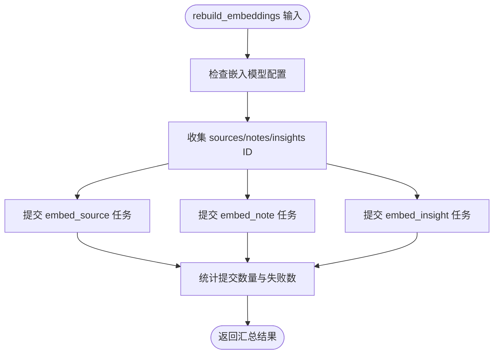

# 命令系统

<cite>
**本文引用的文件**
- [api/command_service.py](file://api/command_service.py)
- [api/routers/commands.py](file://api/routers/commands.py)
- [commands/__init__.py](file://commands/__init__.py)
- [commands/example_commands.py](file://commands/example_commands.py)
- [commands/embedding_commands.py](file://commands/embedding_commands.py)
- [commands/podcast_commands.py](file://commands/podcast_commands.py)
- [commands/source_commands.py](file://commands/source_commands.py)
- [pyproject.toml](file://pyproject.toml)
- [docs/5-CONFIGURATION/advanced.md](file://docs/5-CONFIGURATION/advanced.md)
- [docs/5-CONFIGURATION/environment-reference.md](file://docs/5-CONFIGURATION/environment-reference.md)
- [frontend/src/lib/api/insights.ts](file://frontend/src/lib/api/insights.ts)
</cite>

## 目录
1. [简介](#简介)
2. [项目结构](#项目结构)
3. [核心组件](#核心组件)
4. [架构总览](#架构总览)
5. [详细组件分析](#详细组件分析)
6. [依赖关系分析](#依赖关系分析)
7. [性能考量](#性能考量)
8. [故障排查指南](#故障排查指南)
9. [结论](#结论)
10. [附录](#附录)

## 简介
本文件系统性阐述命令系统的异步任务处理、命令注册与执行机制，覆盖命令队列管理、状态跟踪与进度监控、命令生命周期、错误处理与重试策略、命令调度与并发控制、资源管理，并提供命令开发指南、调试技巧与性能优化方法。该系统基于 surreal-commands 框架实现，通过 FastAPI 提供 REST 接口，命令在后台异步执行，支持重试、取消与状态查询。

## 项目结构
命令系统由三层组成：
- API 层：提供 REST 接口提交命令、查询状态、列出作业与取消作业。
- 服务层：封装命令提交、状态查询等通用逻辑。
- 命令层：定义具体命令函数，使用装饰器注册到 surreal-commands 注册表。

图表来源
- [api/routers/commands.py](file://api/routers/commands.py#L1-L167)
- [api/command_service.py](file://api/command_service.py#L1-L93)
- [commands/__init__.py](file://commands/__init__.py#L1-L25)

章节来源
- [api/routers/commands.py](file://api/routers/commands.py#L1-L167)
- [api/command_service.py](file://api/command_service.py#L1-L93)
- [commands/__init__.py](file://commands/__init__.py#L1-L25)

## 核心组件
- 命令服务（CommandService）：封装提交命令、查询状态、列出作业、取消作业等操作，屏蔽 surreal-commands 的细节。
- 命令路由（Commands Router）：提供 /commands/jobs 提交、查询、列表、取消接口；提供 /commands/registry/debug 调试注册表。
- 命令注册与导出：commands/__init__.py 将各模块命令统一导出，确保提交前注册表可用。
- 具体命令：示例命令、嵌入命令、播客生成命令、源处理命令，均使用 @command 装饰器注册。

章节来源
- [api/command_service.py](file://api/command_service.py#L7-L93)
- [api/routers/commands.py](file://api/routers/commands.py#L1-L167)
- [commands/__init__.py](file://commands/__init__.py#L1-L25)

## 架构总览
命令从 API 提交后，经服务层调用 surreal-commands 提交至注册表，后台执行器按队列调度执行。命令可设置重试策略，失败时自动重试，成功或最终失败后记录结果与错误信息。前端通过轮询 /commands/jobs/{job_id} 获取状态。

图表来源
- [api/routers/commands.py](file://api/routers/commands.py#L37-L86)
- [api/command_service.py](file://api/command_service.py#L11-L68)

## 详细组件分析

### 命令服务层（CommandService）
- 提交命令：确保命令模块导入以完成注册，然后调用 surreal-commands 的 submit_command，返回 job_id。
- 查询状态：调用 get_command_status，封装为统一字典，包含状态、结果、错误消息、创建/更新时间、进度等。
- 列出作业：预留接口，当前返回空列表（基础阶段）。
- 取消作业：预留接口，当前仅记录尝试。

图表来源
- [api/command_service.py](file://api/command_service.py#L7-L93)

章节来源
- [api/command_service.py](file://api/command_service.py#L7-L93)

### 命令路由层（Commands Router）
- 提交命令：接收 app、command、input，调用服务层提交，立即返回 job_id。
- 查询状态：GET /commands/jobs/{job_id}，返回状态、结果、错误、时间戳、进度。
- 列出作业：GET /commands/jobs，支持 command_filter、status_filter、limit。
- 取消作业：DELETE /commands/jobs/{job_id}。
- 调试注册表：GET /commands/registry/debug，返回已注册命令清单与分组。

图表来源
- [api/routers/commands.py](file://api/routers/commands.py#L37-L72)

章节来源
- [api/routers/commands.py](file://api/routers/commands.py#L1-L167)

### 命令注册与导出
- commands/__init__.py 将嵌入、示例、播客、源处理等命令集中导出，确保提交命令前注册表已填充。
- 路由层在提交时显式导入播客命令模块，保证注册表可用。

章节来源
- [commands/__init__.py](file://commands/__init__.py#L1-L25)
- [api/routers/commands.py](file://api/routers/commands.py#L22-L25)

### 示例命令（process_text、analyze_data）
- 使用 @command 装饰器注册，app="open_notebook"。
- 输入输出使用 Pydantic 模型，便于类型约束与序列化。
- 支持可选延迟参数用于模拟异步行为与测试。
- 成功/失败均返回包含处理耗时的输出模型。

章节来源
- [commands/example_commands.py](file://commands/example_commands.py#L43-L143)

### 嵌入命令（embed_* 与 rebuild_embeddings）
- embed_note：为单条笔记生成嵌入并写回数据库。
- embed_insight：为单条洞察生成嵌入并写回数据库。
- embed_source：检测内容类型、分块、批量生成嵌入并写入 source_embedding 表。
- create_insight：创建洞察并异步提交 embed_insight。
- rebuild_embeddings：协调器命令，收集目标项并提交 embed_* 子命令，禁用自身重试，子命令各自重试。

图表来源
- [commands/embedding_commands.py](file://commands/embedding_commands.py#L621-L787)

章节来源
- [commands/embedding_commands.py](file://commands/embedding_commands.py#L120-L787)

### 播客命令（generate_podcast）
- 加载剧集与说话人配置，配置 podcast-creator。
- 创建 PodcastEpisode 记录并关联当前命令。
- 生成播客音频、转录与大纲，保存到记录。
- 对特定模型错误给出提示建议。

章节来源
- [commands/podcast_commands.py](file://commands/podcast_commands.py#L49-L188)

### 源处理命令（process_source 与 run_transformation）
- process_source：加载转换对象，更新源记录绑定命令，执行 source_graph，统计嵌入块数与洞察数。
- run_transformation：运行指定转换生成洞察，内部触发 create_insight 流程。

章节来源
- [commands/source_commands.py](file://commands/source_commands.py#L48-L269)

## 依赖关系分析
- 外部依赖：surreal-commands、SurrealDB、FastAPI、loguru、pydantic 等。
- 配置变量：SURREAL_COMMANDS_MAX_TASKS、SURREAL_COMMANDS_RETRY_* 等影响并发与重试策略。
- 前端：通过 /commands/jobs/{job_id} 轮询状态，等待命令完成。

图表来源
- [pyproject.toml](file://pyproject.toml#L15-L43)
- [docs/5-CONFIGURATION/advanced.md](file://docs/5-CONFIGURATION/advanced.md#L1-L89)
- [docs/5-CONFIGURATION/environment-reference.md](file://docs/5-CONFIGURATION/environment-reference.md#L34-L77)
- [frontend/src/lib/api/insights.ts](file://frontend/src/lib/api/insights.ts#L54-L94)

章节来源
- [pyproject.toml](file://pyproject.toml#L15-L43)
- [docs/5-CONFIGURATION/advanced.md](file://docs/5-CONFIGURATION/advanced.md#L1-L89)
- [docs/5-CONFIGURATION/environment-reference.md](file://docs/5-CONFIGURATION/environment-reference.md#L34-L77)
- [frontend/src/lib/api/insights.ts](file://frontend/src/lib/api/insights.ts#L54-L94)

## 性能考量
- 并发控制：通过 SURREAL_COMMANDS_MAX_TASKS 控制最大并发任务数，CPU 核心越多可适当提高，但会增加数据库冲突概率。
- 重试策略：推荐 exponential_jitter，避免“惊群效应”；合理设置最小/最大等待时间与最大重试次数。
- 超时配置：API 客户端超时应大于 LLM 推理超时并留有缓冲。
- 批量处理：播客生成可配置 TTS 批大小，依据提供商能力调整。
- 日志级别：生产环境建议 DEBUG 以下级别，避免日志噪声。

章节来源
- [docs/5-CONFIGURATION/advanced.md](file://docs/5-CONFIGURATION/advanced.md#L9-L77)
- [docs/5-CONFIGURATION/environment-reference.md](file://docs/5-CONFIGURATION/environment-reference.md#L34-L77)

## 故障排查指南
- 提交失败：确认命令模块已导入且注册表存在对应命令；检查 app 名称是否正确。
- 状态查询异常：确认 surreal-commands 正常工作，检查 job_id 是否有效。
- 重试过多：检查 wait_strategy、wait_min/wait_max、stop_on 设置；验证业务逻辑是否导致频繁瞬时错误。
- 取消无效：当前取消接口为占位实现，需后续对接 surreal-commands 的取消能力。
- 前端轮询：若长时间无进展，检查 /commands/jobs/{job_id} 返回的状态与错误消息；必要时增大轮询间隔或重试上限。

章节来源
- [api/command_service.py](file://api/command_service.py#L18-L44)
- [api/routers/commands.py](file://api/routers/commands.py#L74-L119)
- [frontend/src/lib/api/insights.ts](file://frontend/src/lib/api/insights.ts#L65-L94)

## 结论
命令系统以 surreal-commands 为核心，结合 FastAPI 提供了完整的异步命令提交、状态查询与调试能力。通过合理的重试策略、并发控制与资源管理，可在高负载场景下保持稳定与高效。建议在生产环境中根据硬件与业务特点调整并发与重试参数，并持续监控命令执行状态与错误趋势。

## 附录

### 命令开发指南
- 使用 @command 装饰器注册命令，明确 app 名称与输入输出模型。
- 在命令中显式处理永久性错误（如 ValueError）与瞬时错误（抛出异常触发重试）。
- 合理设置 retry 参数：max_attempts、wait_strategy、wait_min/max、stop_on、retry_log_level。
- 使用 Pydantic 模型进行输入/输出约束，便于前端与 API 层交互。
- 在命令中记录关键指标（处理耗时、提交数量、失败数），便于监控与排障。

章节来源
- [commands/example_commands.py](file://commands/example_commands.py#L43-L143)
- [commands/embedding_commands.py](file://commands/embedding_commands.py#L120-L131)
- [commands/source_commands.py](file://commands/source_commands.py#L48-L59)

### 调试技巧
- 使用 /commands/registry/debug 查看已注册命令清单与分组。
- 在提交命令后立即轮询 /commands/jobs/{job_id}，观察状态变化。
- 前端可参考 waitForCommand 实现指数退避轮询，避免过于频繁请求。
- 开启详细日志（RUST_LOG、LOGLEVEL）定位问题。

章节来源
- [api/routers/commands.py](file://api/routers/commands.py#L122-L167)
- [frontend/src/lib/api/insights.ts](file://frontend/src/lib/api/insights.ts#L65-L94)
- [docs/5-CONFIGURATION/advanced.md](file://docs/5-CONFIGURATION/advanced.md#L81-L89)

### 性能优化方法
- 调整 SURREAL_COMMANDS_MAX_TASKS 与 wait_strategy，平衡吞吐与冲突。
- 对高并发场景启用 exponential_jitter，降低数据库压力峰值。
- 合理设置 API_CLIENT_TIMEOUT 与 LLM 超时，避免请求堆积。
- 播客生成时根据提供商能力调整 TTS_BATCH_SIZE。

章节来源
- [docs/5-CONFIGURATION/advanced.md](file://docs/5-CONFIGURATION/advanced.md#L9-L77)
- [docs/5-CONFIGURATION/environment-reference.md](file://docs/5-CONFIGURATION/environment-reference.md#L34-L77)