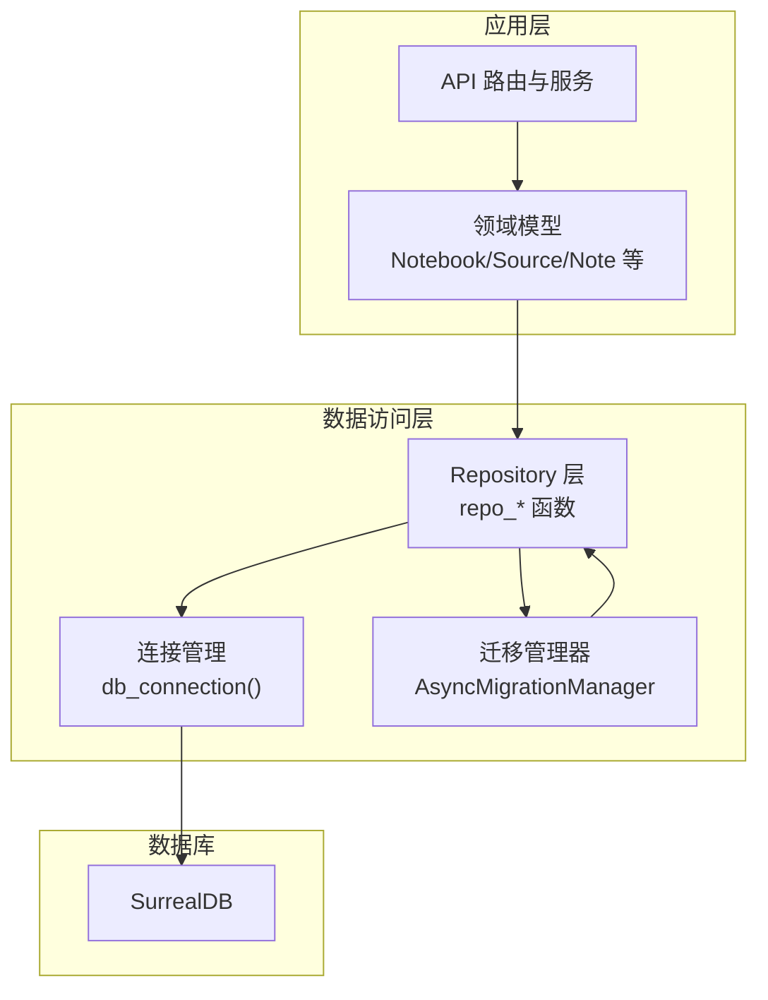
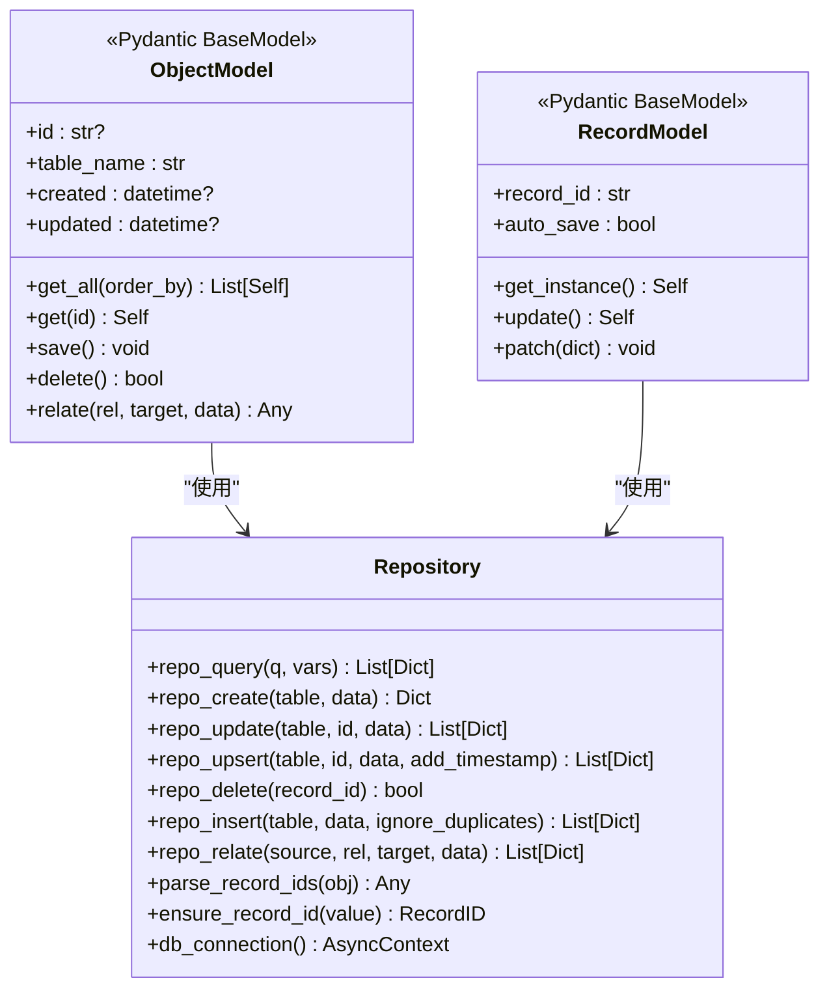
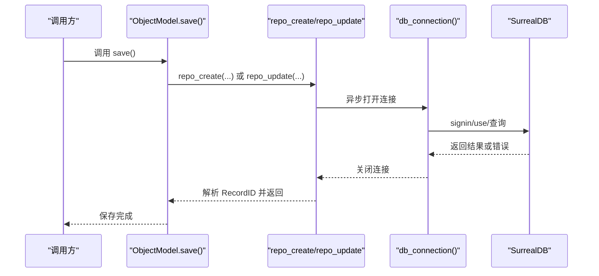
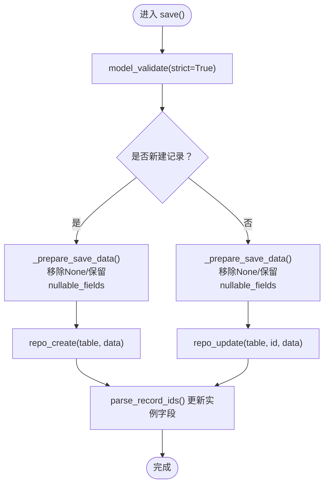
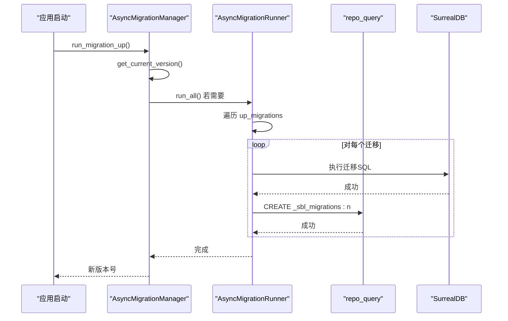
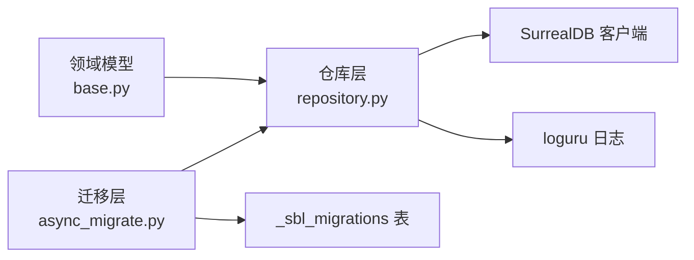

# 数据访问层

<cite>
**本文引用的文件**
- [repository.py](file://open_notebook/database/repository.py)
- [async_migrate.py](file://open_notebook/database/async_migrate.py)
- [migrate.py](file://open_notebook/database/migrate.py)
- [base.py](file://open_notebook/domain/base.py)
- [notebook.py](file://open_notebook/domain/notebook.py)
- [transformation.py](file://open_notebook/domain/transformation.py)
- [content_settings.py](file://open_notebook/domain/content_settings.py)
- [provider_config.py](file://open_notebook/domain/provider_config.py)
- [database.md](file://docs/5-CONFIGURATION/database.md)
- [index.md](file://docs/5-CONFIGURATION/index.md)
- [CLAUDE.md](file://open_notebook/database/CLAUDE.md)
- [code-standards.md](file://docs/7-DEVELOPMENT/code-standards.md)
- [test_domain.py](file://tests/test_domain.py)
</cite>

## 目录
1. [简介](#简介)
2. [项目结构](#项目结构)
3. [核心组件](#核心组件)
4. [架构总览](#架构总览)
5. [详细组件分析](#详细组件分析)
6. [依赖关系分析](#依赖关系分析)
7. [性能考虑](#性能考虑)
8. [故障排查指南](#故障排查指南)
9. [结论](#结论)
10. [附录](#附录)

## 简介
本文件系统性阐述数据访问层的设计与实现，覆盖以下主题：
- Repository 模式：统一的 CRUD 封装、查询执行与关系操作
- 数据库连接管理：基于 AsyncSurreal 的连接生命周期与认证
- SurrealDB 集成：SurrealQL 查询构建、RecordID 处理与错误传播
- 事务与并发：冲突重试策略与日志分级
- 数据模型映射：Pydantic 模型与数据库记录的双向转换
- 字段验证与数据转换：模型级校验、时间解析与 RecordID 规范化
- 数据库迁移管理：版本控制、迁移执行与回滚策略
- 性能优化：连接模式、批量写入与查询分析建议

## 项目结构
数据访问层由三层组成：
- Repository 层（repository.py）：直接面向 SurrealDB 的异步 CRUD 与查询封装
- 迁移层（async_migrate.py、migrate.py）：版本化迁移与回滚
- 领域模型层（domain/base.py 及各实体模型）：基于 Pydantic 的数据模型与业务规则，通过 Repository 完成持久化

图表来源
- [repository.py](file://open_notebook/database/repository.py#L47-L62)
- [async_migrate.py](file://open_notebook/database/async_migrate.py#L91-L163)
- [base.py](file://open_notebook/domain/base.py#L31-L183)

章节来源
- [repository.py](file://open_notebook/database/repository.py#L1-L195)
- [async_migrate.py](file://open_notebook/database/async_migrate.py#L1-L229)
- [base.py](file://open_notebook/domain/base.py#L1-L329)

## 核心组件
- 连接管理
  - get_database_url/get_database_password：兼容新旧环境变量，构造连接字符串
  - db_connection：异步上下文管理器，负责登录、命名空间与数据库选择、连接关闭
- 查询与 CRUD
  - repo_query：执行任意 SurrealQL，返回标准化字典列表；对 RecordID 嵌套结构进行字符串化
  - repo_create/repo_update/repo_upsert/repo_delete/repo_insert/repo_relate：针对表、记录与关系的常用操作
- 工具函数
  - parse_record_ids：递归将 RecordID 转为字符串，便于序列化与传输
  - ensure_record_id：确保输入为 RecordID 类型

章节来源
- [repository.py](file://open_notebook/database/repository.py#L12-L62)
- [repository.py](file://open_notebook/database/repository.py#L65-L195)

## 架构总览
Repository 模式将领域模型与数据库实现解耦。领域模型通过 ObjectModel/RecordModel 提供统一的保存、删除、关系建立等能力，底层委托给仓库层的 repo_* 函数。迁移层独立于业务逻辑，通过版本表维护数据库结构演进。

图表来源
- [base.py](file://open_notebook/domain/base.py#L31-L329)
- [repository.py](file://open_notebook/database/repository.py#L47-L195)

## 详细组件分析

### Repository 层：连接与查询封装
- 连接生命周期
  - 每次调用 repo_* 打开/关闭连接，适合无状态 API 场景
  - 登录后选择命名空间与数据库，确保后续查询作用域正确
- 查询执行
  - repo_query 支持参数化查询，自动将 RecordID 嵌套结构转为字符串
  - 对字符串返回值抛出 RuntimeError，用于区分“可重试”的事务冲突与“不可重试”的错误
- 写入操作
  - repo_create 自动设置 created/updated 时间戳，并移除传入数据中的 id 字段
  - repo_update 支持 table:id 或完整 RecordID；自动规范化 created 字段为 datetime
  - repo_upsert 使用 MERGE 实现“存在则更新，否则插入”
  - repo_insert 支持批量插入，可忽略重复键错误
- 关系操作
  - repo_relate 生成 RELATE 语句，支持在关系上附加数据
- 错误处理
  - 事务冲突以 RuntimeError 抛出并在日志中以 DEBUG 记录，避免噪声
  - 其他异常统一记录并重新抛出

图表来源
- [base.py](file://open_notebook/domain/base.py#L113-L160)
- [repository.py](file://open_notebook/database/repository.py#L47-L83)

章节来源
- [repository.py](file://open_notebook/database/repository.py#L47-L195)

### 领域模型层：数据映射与验证
- ObjectModel
  - 统一 CRUD 行为：get_all、get、save、delete、relate
  - 字段验证：created/updated 字符串到 datetime 的解析
  - 数据准备：_prepare_save_data 过滤 None 值，保留 nullable_fields 中允许的 None
- RecordModel
  - 单例缓存：按 record_id 缓存实例，避免重复加载
  - 异步更新：update 使用 repo_upsert 后再读取最新值，保持对象状态一致
  - patch：从字典更新属性并触发保存

图表来源
- [base.py](file://open_notebook/domain/base.py#L113-L160)
- [base.py](file://open_notebook/domain/base.py#L162-L168)

章节来源
- [base.py](file://open_notebook/domain/base.py#L31-L329)

### 实体模型示例：Notebook/Source/Note
- Notebook
  - 字段验证：名称不能为空
  - 关联查询：获取源、笔记、聊天会话；删除前预览统计
- Source
  - 字段验证：命令字段 RecordID 解析；ID 字段兼容字符串/RecordID
  - 生命周期：向量化、洞察生成、删除时清理文件、嵌入与洞察
- Note
  - 保存后提交嵌入命令（异步），避免阻塞请求

章节来源
- [notebook.py](file://open_notebook/domain/notebook.py#L16-L679)

### 配置与记录模型：DefaultPrompts/ContentSettings/ProviderConfig
- DefaultPrompts/ContentSettings
  - 基于 RecordModel 的单例记录，通过 repo_upsert 存储键值配置
- ProviderConfig
  - 多凭证管理：加密存储、默认配置切换、从数据库加载与保存

章节来源
- [transformation.py](file://open_notebook/domain/transformation.py#L1-L22)
- [content_settings.py](file://open_notebook/domain/content_settings.py#L1-L26)
- [provider_config.py](file://open_notebook/domain/provider_config.py#L175-L445)

### 迁移管理：版本控制与回滚
- 版本表
  - 使用 _sbl_migrations 表记录版本号与应用时间
- 迁移执行
  - AsyncMigrationManager 维护 up/down 迁移列表，按序执行
  - run_all/run_one_up/run_one_down 控制迁移粒度
  - 成功后 bump_version/lower_version 更新版本表
- 向后兼容
  - 同步包装器 MigrationManager 适配旧式调用

图表来源
- [async_migrate.py](file://open_notebook/database/async_migrate.py#L165-L189)
- [async_migrate.py](file://open_notebook/database/async_migrate.py#L66-L88)
- [async_migrate.py](file://open_notebook/database/async_migrate.py#L214-L228)

章节来源
- [async_migrate.py](file://open_notebook/database/async_migrate.py#L1-L229)
- [migrate.py](file://open_notebook/database/migrate.py#L1-L27)

## 依赖关系分析
- 组件耦合
  - 领域模型依赖仓库层（repo_*）与异常类型
  - 仓库层依赖 SurrealDB 客户端与日志库
  - 迁移层依赖仓库层执行 SQL 与版本表
- 外部依赖
  - SurrealDB AsyncSurreal：异步连接与查询
  - Pydantic：模型定义、验证与序列化
  - loguru：统一日志输出

图表来源
- [base.py](file://open_notebook/domain/base.py#L13-L26)
- [repository.py](file://open_notebook/database/repository.py#L1-L10)
- [async_migrate.py](file://open_notebook/database/async_migrate.py#L10-L11)

章节来源
- [base.py](file://open_notebook/domain/base.py#L13-L26)
- [repository.py](file://open_notebook/database/repository.py#L1-L10)
- [async_migrate.py](file://open_notebook/database/async_migrate.py#L10-L11)

## 性能考虑
- 连接模式
  - 当前每操作一次即创建/销毁连接，适合无状态 API；高吞吐场景建议引入连接池
- 批量写入
  - repo_insert 支持批量插入，可减少往返次数
- 查询优化
  - 使用参数化查询（repo_query 的 vars）避免拼接注入风险
  - 在领域模型中尽量使用精确查询（如按 id 获取）
- 事务冲突
  - 通过 RuntimeError 区分可重试冲突，结合指数退避策略提升并发稳定性
- 建议
  - 对热点查询建立合适索引（参考数据库文档）
  - 使用分页与 LIMIT 控制结果集大小
  - 对长文本字段采用惰性加载（omit 大字段）

## 故障排查指南
- 连接失败
  - 检查环境变量 SURREAL_URL/SURREAL_USER/SURREAL_PASSWORD/SURREAL_NAMESPACE/SURREAL_DATABASE
  - 参考配置文档确认网络可达性与端口
- 查询异常
  - 查看日志中 repo_query 的异常堆栈；若为 RuntimeError 且包含“transaction”或“conflict”，属于可重试冲突
- 数据不一致
  - 确认 save() 后是否及时刷新实例字段（RecordModel.update 会重新查询）
- 迁移问题
  - 使用 MigrationManager/AsyncMigrationManager 的同步包装或异步接口检查当前版本
  - 如需回滚，调用 run_one_down 或 lower_version

章节来源
- [repository.py](file://open_notebook/database/repository.py#L76-L82)
- [base.py](file://open_notebook/domain/base.py#L290-L316)
- [async_migrate.py](file://open_notebook/database/async_migrate.py#L165-L189)
- [database.md](file://docs/5-CONFIGURATION/database.md#L1-L51)
- [index.md](file://docs/5-CONFIGURATION/index.md#L74-L84)

## 结论
该数据访问层以 Repository 模式为核心，结合 Pydantic 模型与 SurrealDB AsyncSurreal，提供了清晰的领域抽象与稳定的数据库交互路径。迁移层通过版本表实现了可控的结构演进。建议在生产环境中引入连接池、索引与查询分析工具，持续优化性能与可靠性。

## 附录

### 数据库配置要点
- 环境变量
  - SURREAL_URL、SURREAL_USER、SURREAL_PASSWORD、SURREAL_NAMESPACE、SURREAL_DATABASE
- 默认部署
  - Docker Compose 示例与主机直连配置见配置文档

章节来源
- [database.md](file://docs/5-CONFIGURATION/database.md#L16-L46)
- [index.md](file://docs/5-CONFIGURATION/index.md#L78-L84)

### 开发规范与示例
- 异步数据库操作示例与模型验证模式参考开发文档

章节来源
- [code-standards.md](file://docs/7-DEVELOPMENT/code-standards.md#L317-L376)

### 测试要点
- 领域模型验证与行为测试（如 Source 删除清理文件、Note 内容验证等）

章节来源
- [test_domain.py](file://tests/test_domain.py#L108-L203)