# 数据访问层

<cite>
**本文引用的文件**
- [unified_repository.py](file://open_notebook/database/unified_repository.py)
- [surrealdb_adapter.py](file://open_notebook/database/surrealdb_adapter.py)
- [postgresql_adapter.py](file://open_notebook/database/postgresql_adapter.py)
- [sync_hooks.py](file://open_notebook/database/sync_hooks.py)
- [repository.py](file://open_notebook/database/repository.py)
- [__init__.py](file://open_notebook/database/__init__.py)
- [CLAUDE.md](file://open_notebook/database/CLAUDE.md)
- [CLAUDE_LKS_INTEGRATION.md](file://open_notebook/database/CLAUDE_LKS_INTEGRATION.md)
- [architecture.md](file://docs/7-DEVELOPMENT/architecture.md)
- [database.md](file://docs/5-CONFIGURATION/database.md)
- [index.md](file://docs/5-CONFIGURATION/index.md)
- [code-standards.md](file://docs/7-DEVELOPMENT/code-standards.md)
- [test_domain.py](file://tests/test_domain.py)
</cite>

## 更新摘要
**所做更改**
- 新增统一数据访问层架构章节，涵盖多后端支持
- 添加DomainRouter、BackendAdapter、SyncHookRegistry等新组件说明
- 更新架构图以反映新的统一接口设计
- 新增跨域同步机制和事件驱动架构
- 更新性能考虑和故障排查指南以包含新组件

## 目录
1. [简介](#简介)
2. [统一数据访问层架构](#统一数据访问层架构)
3. [核心组件详解](#核心组件详解)
4. [架构总览](#架构总览)
5. [详细组件分析](#详细组件分析)
6. [跨域同步机制](#跨域同步机制)
7. [依赖关系分析](#依赖关系分析)
8. [性能考虑](#性能考虑)
9. [故障排查指南](#故障排查指南)
10. [结论](#结论)
11. [附录](#附录)

## 简介
本文件系统性阐述**统一数据访问层**的设计与实现，这是Open Notebook从单一SurrealDB架构升级为支持SurrealDB和PostgreSQL的统一仓库接口的关键架构变更。统一数据访问层的核心目标包括：

- **统一接口**：为SurrealDB（核心业务数据）和PostgreSQL（活体知识系统数据）提供一致的API
- **透明路由**：根据实体类型自动路由到相应的数据库后端
- **事件驱动**：通过同步钩子实现跨域数据一致性
- **渐进式迁移**：支持新旧代码共存，逐步迁移到统一架构

## 统一数据访问层架构

### 多后端支持架构
统一数据访问层采用**多后端架构**，支持两种主要数据域：

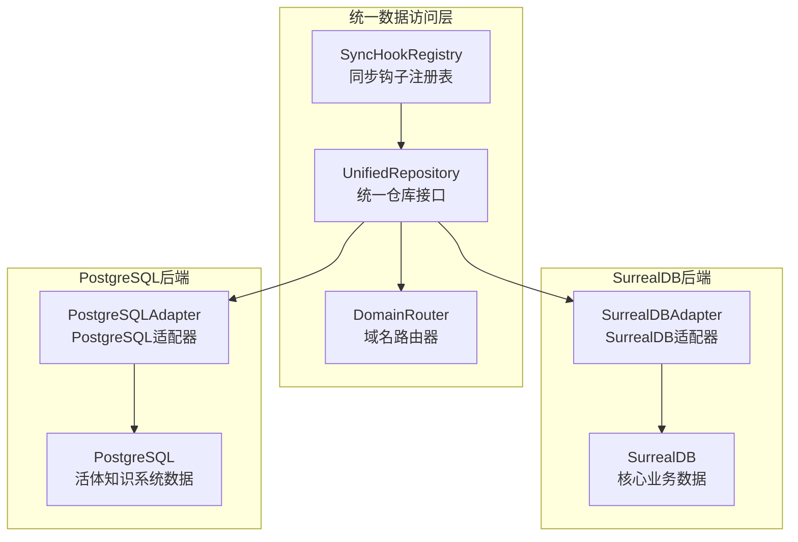

**图表来源**
- [unified_repository.py](file://open_notebook/database/unified_repository.py#L323-L548)
- [surrealdb_adapter.py](file://open_notebook/database/surrealdb_adapter.py#L23-L281)
- [postgresql_adapter.py](file://open_notebook/database/postgresql_adapter.py#L17-L364)

### 数据域分类
统一数据访问层将数据分为三个域：

| 数据域 | 描述 | 示例实体 | 存储后端 |
|--------|------|----------|----------|
| CORE | 核心业务数据 | notebook, source, note, chat_session | SurrealDB |
| LIVING | 活体知识系统数据 | cell, agent, meridian_metrics | PostgreSQL |
| CROSS | 跨域查询 | search_result, activity_feed | 组合后端 |

**章节来源**
- [unified_repository.py](file://open_notebook/database/unified_repository.py#L36-L47)

## 核心组件详解

### UnifiedRepository接口
统一仓库接口定义了标准的数据访问方法：

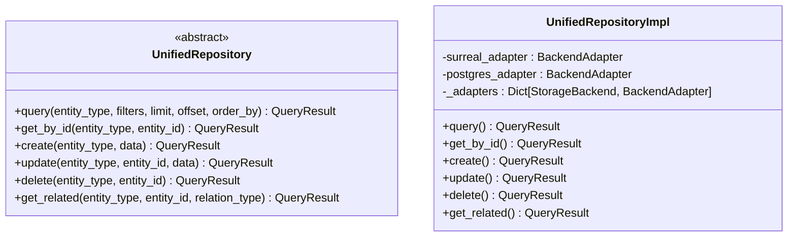

**图表来源**
- [unified_repository.py](file://open_notebook/database/unified_repository.py#L71-L188)
- [unified_repository.py](file://open_notebook/database/unified_repository.py#L323-L493)

### DomainRouter域名路由器
域名路由器负责实体类型到存储后端的路由：

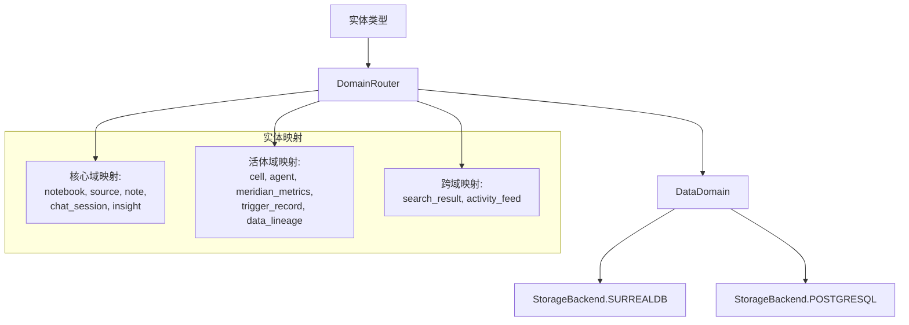

**图表来源**
- [unified_repository.py](file://open_notebook/database/unified_repository.py#L194-L244)

**章节来源**
- [unified_repository.py](file://open_notebook/database/unified_repository.py#L194-L244)

### BackendAdapter适配器模式
适配器模式为不同数据库提供统一接口：

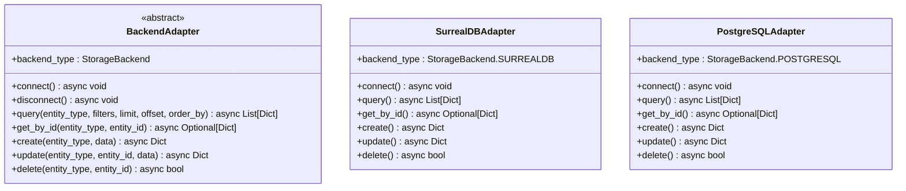

**图表来源**
- [unified_repository.py](file://open_notebook/database/unified_repository.py#L250-L317)
- [surrealdb_adapter.py](file://open_notebook/database/surrealdb_adapter.py#L23-L281)
- [postgresql_adapter.py](file://open_notebook/database/postgresql_adapter.py#L17-L364)

**章节来源**
- [unified_repository.py](file://open_notebook/database/unified_repository.py#L250-L317)
- [surrealdb_adapter.py](file://open_notebook/database/surrealdb_adapter.py#L23-L281)
- [postgresql_adapter.py](file://open_notebook/database/postgresql_adapter.py#L17-L364)

## 架构总览

### 统一数据访问层整体架构
统一数据访问层通过三层架构实现：

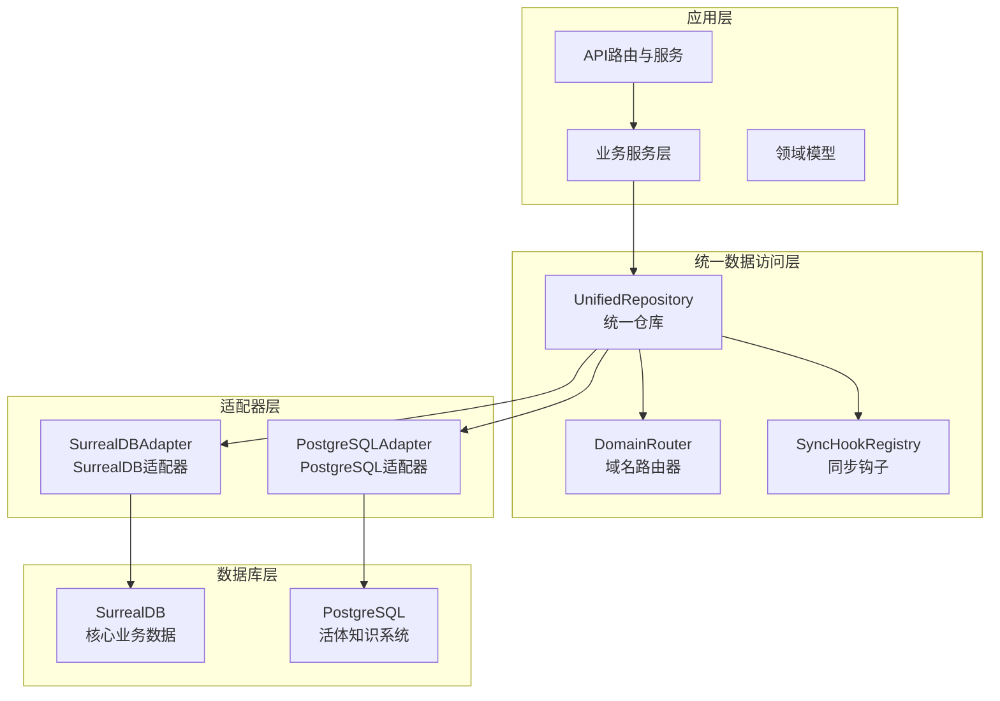

**图表来源**
- [unified_repository.py](file://open_notebook/database/unified_repository.py#L323-L548)
- [surrealdb_adapter.py](file://open_notebook/database/surrealdb_adapter.py#L23-L281)
- [postgresql_adapter.py](file://open_notebook/database/postgresql_adapter.py#L17-L364)

### 查询流程
统一仓库的查询流程如下：

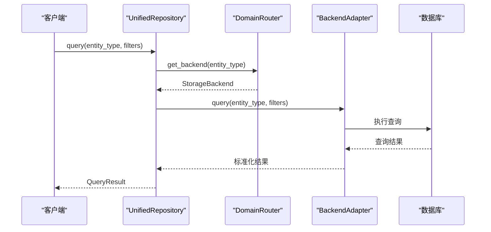

**图表来源**
- [unified_repository.py](file://open_notebook/database/unified_repository.py#L347-L376)

**章节来源**
- [unified_repository.py](file://open_notebook/database/unified_repository.py#L323-L493)

## 详细组件分析

### SurrealDB适配器
SurrealDB适配器包装了原有的repository.py功能，提供统一接口：

#### 查询构建
SurrealDB适配器支持动态查询构建：

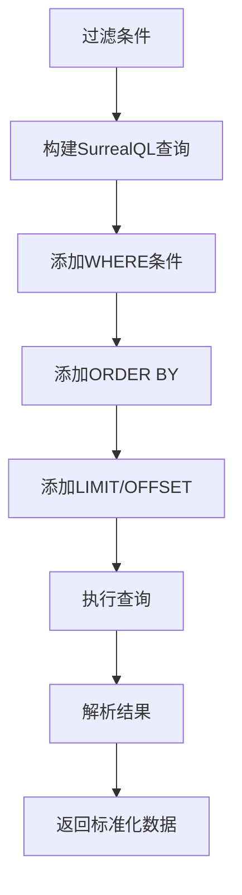

**图表来源**
- [surrealdb_adapter.py](file://open_notebook/database/surrealdb_adapter.py#L61-L118)

#### 记录ID处理
SurrealDB适配器处理RecordID的复杂性：

**章节来源**
- [surrealdb_adapter.py](file://open_notebook/database/surrealdb_adapter.py#L119-L226)

### PostgreSQL适配器
PostgreSQL适配器包装了活体知识系统的数据库操作：

#### 实体映射
PostgreSQL适配器将实体类型映射到具体表名：

| 实体类型 | 表名 | ID列 |
|----------|------|------|
| cell | cell_states | skill_id |
| agent | agent_states | agent_id |
| meridian_metrics | meridian_metrics | meridian_id |
| trigger_record | trigger_records | trigger_id |
| data_lineage | data_lineage | data_id |

**章节来源**
- [postgresql_adapter.py](file://open_notebook/database/postgresql_adapter.py#L52-L171)

### 查询结果包装
统一数据访问层提供标准化的查询结果：

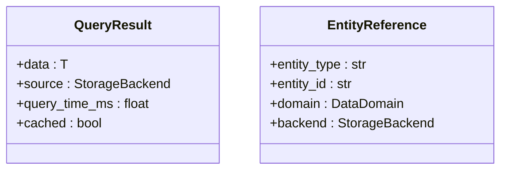

**图表来源**
- [unified_repository.py](file://open_notebook/database/unified_repository.py#L49-L65)

**章节来源**
- [unified_repository.py](file://open_notebook/database/unified_repository.py#L49-L65)

## 跨域同步机制

### 同步事件类型
统一数据访问层支持多种跨域同步事件：

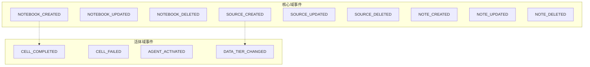

**图表来源**
- [sync_hooks.py](file://open_notebook/database/sync_hooks.py#L19-L37)

### 事件处理器注册
同步钩子注册表实现发布-订阅模式：

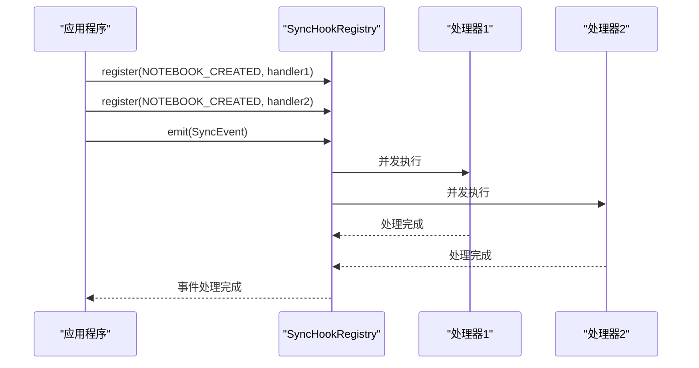

**图表来源**
- [sync_hooks.py](file://open_notebook/database/sync_hooks.py#L92-L120)

### 默认同步处理器
系统提供默认的同步处理器：

**章节来源**
- [sync_hooks.py](file://open_notebook/database/sync_hooks.py#L163-L242)

## 依赖关系分析

### 组件依赖关系
统一数据访问层的依赖关系如下：

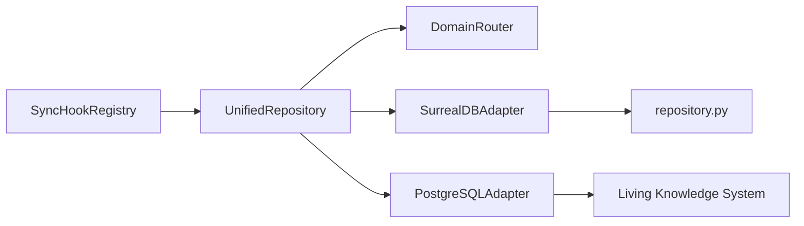

**图表来源**
- [unified_repository.py](file://open_notebook/database/unified_repository.py#L330-L340)
- [surrealdb_adapter.py](file://open_notebook/database/surrealdb_adapter.py#L11-L18)
- [postgresql_adapter.py](file://open_notebook/database/postgresql_adapter.py#L11-L12)

### 外部依赖
统一数据访问层依赖的关键外部组件：

- **SurrealDB**：核心业务数据存储，支持原生图查询
- **PostgreSQL**：活体知识系统数据存储，支持复杂关系查询
- **Loguru**：统一日志记录
- **AsyncSurreal**：SurrealDB异步客户端

**章节来源**
- [unified_repository.py](file://open_notebook/database/unified_repository.py#L14-L31)
- [surrealdb_adapter.py](file://open_notebook/database/surrealdb_adapter.py#L6-L10)
- [postgresql_adapter.py](file://open_notebook/database/postgresql_adapter.py#L6-L12)

## 性能考虑

### 连接管理
统一数据访问层采用**按需连接**模式：

- **SurrealDB**：每次操作创建临时连接，适合无状态API
- **PostgreSQL**：使用连接池，支持并发连接复用
- **连接复用**：适配器级别连接复用，避免重复连接开销

### 查询优化
- **延迟计时**：所有查询都记录执行时间，便于性能监控
- **批量操作**：支持批量查询和写入操作
- **索引利用**：PostgreSQL适配器利用数据库索引优化查询

### 缓存策略
- **查询结果缓存**：QueryResult支持缓存标记
- **连接池管理**：PostgreSQL适配器使用连接池
- **内存缓存**：适配器内部缓存连接状态

### 并发处理
- **事件并发**：同步钩子并发执行多个处理器
- **查询并发**：统一仓库支持并发查询
- **连接并发**：PostgreSQL连接池支持并发连接

## 故障排查指南

### 连接问题
**SurrealDB连接问题**
- 检查SURREAL_URL、SURREAL_USER、SURREAL_PASSWORD环境变量
- 验证SurrealDB服务可用性和网络连通性
- 查看连接测试日志输出

**PostgreSQL连接问题**
- 检查数据库连接参数（host、port、database、user、password）
- 验证PostgreSQL服务状态和防火墙设置
- 查看连接池状态和连接数限制

### 查询问题
**查询超时**
- 检查查询过滤条件和索引使用情况
- 分析查询执行计划和性能指标
- 调整查询参数（limit、offset）

**数据不一致**
- 验证实体ID格式和域名映射
- 检查跨域同步事件处理状态
- 查看事件历史和错误日志

### 同步问题
**事件处理失败**
- 检查事件处理器注册状态
- 查看处理器执行日志和错误信息
- 验证事件数据格式和完整性

**章节来源**
- [unified_repository.py](file://open_notebook/database/unified_repository.py#L37-L47)
- [surrealdb_adapter.py](file://open_notebook/database/surrealdb_adapter.py#L37-L59)
- [postgresql_adapter.py](file://open_notebook/database/postgresql_adapter.py#L37-L50)
- [sync_hooks.py](file://open_notebook/database/sync_hooks.py#L92-L120)

## 结论
统一数据访问层成功实现了从单一SurrealDB架构到支持SurrealDB和PostgreSQL的多后端架构升级。通过DomainRouter、BackendAdapter、SyncHookRegistry等核心组件，系统实现了：

- **透明路由**：自动识别实体类型并路由到相应后端
- **统一接口**：为不同数据库提供一致的API
- **事件驱动**：通过同步钩子实现跨域数据一致性
- **渐进式迁移**：支持新旧代码共存，便于系统演进

该架构为Open Notebook的未来发展奠定了坚实基础，支持更复杂的业务需求和更高的性能要求。

## 附录

### 数据库配置要点
**统一数据访问层配置**
- **SURREAL_URL**：SurrealDB连接URL
- **POSTGRES_HOST**：PostgreSQL主机地址
- **POSTGRES_PORT**：PostgreSQL端口号
- **POSTGRES_DB**：PostgreSQL数据库名
- **POSTGRES_USER**：PostgreSQL用户名
- **POSTGRES_PASSWORD**：PostgreSQL密码

### 开发规范与示例
**统一仓库使用示例**
```python
from open_notebook.database import get_unified_repository

# 获取统一仓库实例
repo = await get_unified_repository()

# 查询笔记本（路由到SurrealDB）
notebooks = await repo.query("notebook", limit=50)

# 查询细胞状态（路由到PostgreSQL）
cells = await repo.query("cell", filters={"status": "active"}, limit=100)
```

**章节来源**
- [database.md](file://docs/5-CONFIGURATION/database.md#L16-L46)
- [code-standards.md](file://docs/7-DEVELOPMENT/code-standards.md#L317-L376)

### 测试要点
**统一数据访问层测试**
- **适配器测试**：验证SurrealDB和PostgreSQL适配器功能
- **路由测试**：验证实体类型到后端的正确路由
- **同步测试**：验证跨域事件处理和数据一致性
- **性能测试**：验证查询性能和并发处理能力

**章节来源**
- [test_domain.py](file://tests/test_domain.py#L108-L203)
- [sync_hooks.py](file://open_notebook/database/sync_hooks.py#L163-L242)