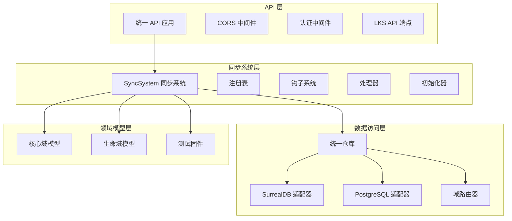
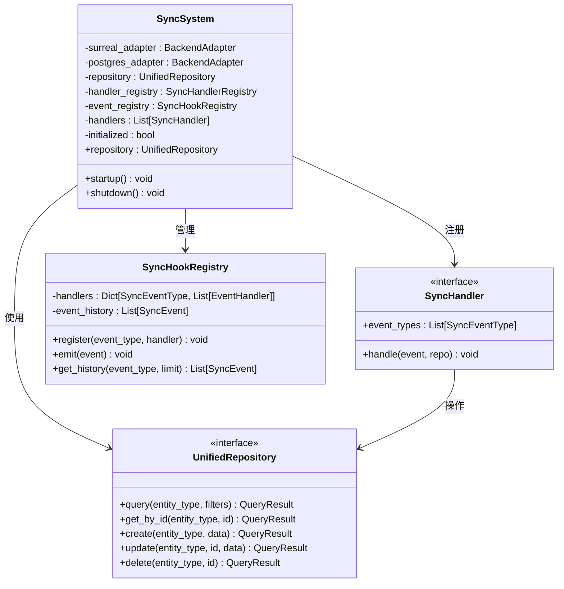
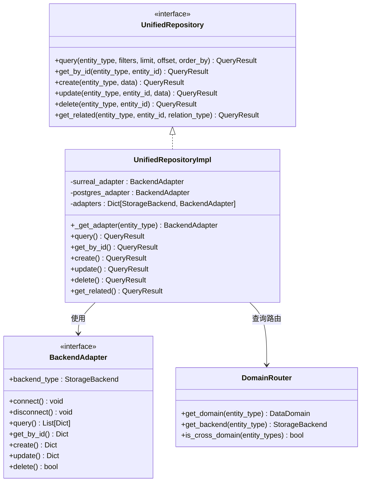
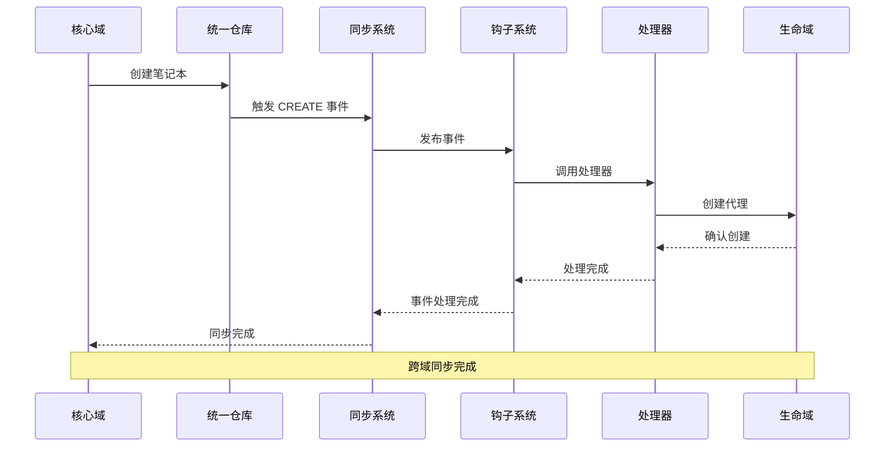
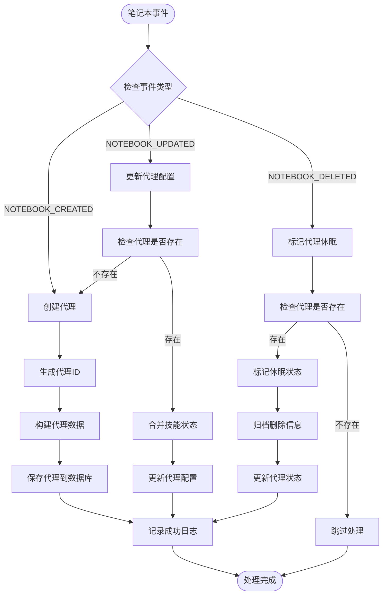
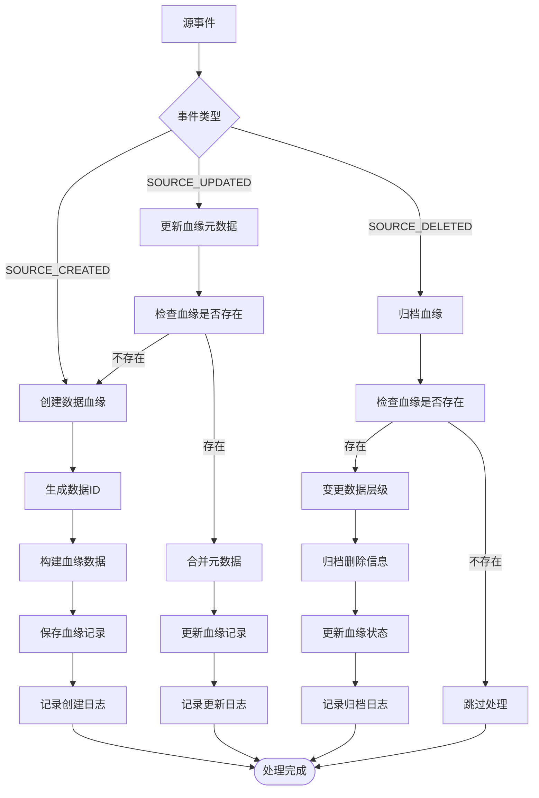
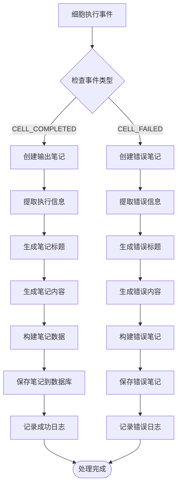
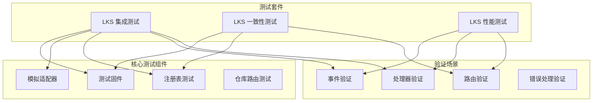
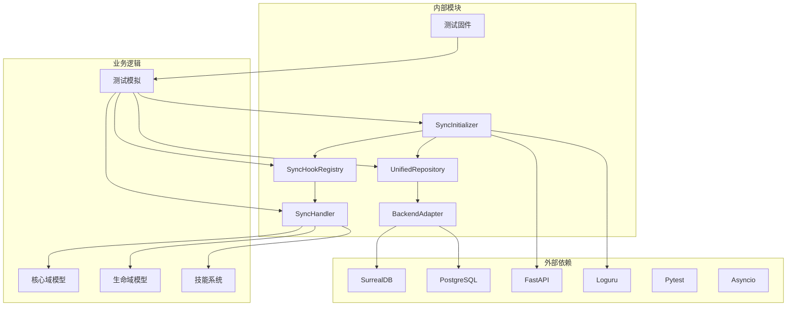

# 跨域同步系统

<cite>
**本文档引用的文件**
- [sync_initializer.py](file://open_notebook/database/sync_initializer.py)
- [sync_hooks.py](file://open_notebook/database/sync_hooks.py)
- [sync_handlers.py](file://open_notebook/database/sync_handlers.py)
- [unified_repository.py](file://open_notebook/database/unified_repository.py)
- [repository_with_events.py](file://open_notebook/database/repository_with_events.py)
- [postgresql_adapter.py](file://open_notebook/database/postgresql_adapter.py)
- [surrealdb_adapter.py](file://open_notebook/database/surrealdb_adapter.py)
- [unified_main.py](file://api/unified_main.py)
- [main.py](file://api/main.py)
- [p0_agents.py](file://open_notebook/skills/p0_agents.py)
- [api_endpoints.py](file://open_notebook/skills/living/api_endpoints.py)
- [test_lks_integration.py](file://tests/test_lks_integration.py)
- [test_lks_consistency.py](file://tests/test_lks_consistency.py)
- [test_lks_performance.py](file://tests/test_lks_performance.py)
</cite>

## 更新摘要
**变更内容**
- 新增LKS集成测试套件的详细测试覆盖分析
- 更新测试驱动开发（TDD）验证流程
- 增强事件路由、处理器注册、统一仓库路由的测试验证
- 完善数据一致性、性能基准测试的测试覆盖说明
- 添加测试固件和模拟适配器的使用说明

## 目录
1. [简介](#简介)
2. [项目结构](#项目结构)
3. [核心组件](#核心组件)
4. [架构概览](#架构概览)
5. [详细组件分析](#详细组件分析)
6. [LKS集成测试套件](#lks集成测试套件)
7. [测试覆盖分析](#测试覆盖分析)
8. [依赖关系分析](#依赖关系分析)
9. [性能考虑](#性能考虑)
10. [故障排除指南](#故障排除指南)
11. [结论](#结论)

## 简介

跨域同步系统是 Open Notebook 生态系统中的关键基础设施，负责在两个不同的数据域之间建立实时同步机制：

- **核心域 (Core)**：基于 SurrealDB 的业务数据（笔记本、源、笔记、聊天会话）
- **生命域 (Living)**：基于 PostgreSQL 的生命知识系统数据（细胞、代理、指标、触发器）

该系统实现了事件驱动的跨域同步，确保两个域之间的数据一致性，并支持复杂的多层智能架构。最新的LKS集成测试套件进一步验证了系统的完整功能，包括事件路由、处理器注册、统一仓库路由等核心功能。

## 项目结构

系统采用模块化设计，主要分为以下几个层次：



**图表来源**
- [unified_main.py](file://api/unified_main.py#L212-L237)
- [sync_initializer.py](file://open_notebook/database/sync_initializer.py#L49-L124)
- [unified_repository.py](file://open_notebook/database/unified_repository.py#L323-L340)

**章节来源**
- [unified_main.py](file://api/unified_main.py#L71-L210)
- [sync_initializer.py](file://open_notebook/database/sync_initializer.py#L1-L289)

## 核心组件

### 同步系统核心

SyncSystem 是整个同步系统的核心控制器，负责协调各个组件的初始化和生命周期管理。



**图表来源**
- [sync_initializer.py](file://open_notebook/database/sync_initializer.py#L49-L82)
- [unified_repository.py](file://open_notebook/database/unified_repository.py#L71-L168)
- [sync_hooks.py](file://open_notebook/database/sync_hooks.py#L55-L120)

### 统一数据访问层

统一仓库模式提供了一个抽象的数据访问接口，自动路由查询到正确的后端存储。



**图表来源**
- [unified_repository.py](file://open_notebook/database/unified_repository.py#L71-L188)
- [unified_repository.py](file://open_notebook/database/unified_repository.py#L323-L492)

**章节来源**
- [unified_repository.py](file://open_notebook/database/unified_repository.py#L1-L548)
- [sync_initializer.py](file://open_notebook/database/sync_initializer.py#L156-L237)

## 架构概览

系统采用事件驱动的架构模式，通过发布-订阅机制实现跨域同步：



**图表来源**
- [repository_with_events.py](file://open_notebook/database/repository_with_events.py#L45-L73)
- [sync_hooks.py](file://open_notebook/database/sync_hooks.py#L92-L119)
- [sync_handlers.py](file://open_notebook/database/sync_handlers.py#L69-L79)

### 事件类型定义

系统定义了完整的事件类型枚举，涵盖核心域和生命域的所有同步场景：

| 事件类型 | 来源域 | 描述 |
|---------|--------|------|
| NOTEBOOK_CREATED | Core → Living | 笔记本创建 → 创建代理 |
| NOTEBOOK_UPDATED | Core → Living | 笔记本更新 → 更新代理配置 |
| NOTEBOOK_DELETED | Core → Living | 笔记本删除 → 标记代理休眠 |
| SOURCE_CREATED | Core → Living | 源创建 → 注册数据血缘 |
| SOURCE_UPDATED | Core → Living | 源更新 → 更新血缘元数据 |
| SOURCE_DELETED | Core → Living | 源删除 → 归档血缘 |
| NOTE_CREATED | Core → Living | 笔记本创建 → 创建代理 |
| CELL_COMPLETED | Living → Core | 细胞执行完成 → 创建输出笔记 |
| CELL_FAILED | Living → Core | 细胞执行失败 → 创建错误笔记 |
| AGENT_ACTIVATED | Living → Core | 代理激活 → 触发下游处理 |
| DATA_TIER_CHANGED | Living → Core | 数据层级变化 → 更新数据状态 |

**章节来源**
- [sync_hooks.py](file://open_notebook/database/sync_hooks.py#L19-L37)
- [sync_hooks.py](file://open_notebook/database/sync_hooks.py#L180-L235)

## 详细组件分析

### 笔记本同步处理器

笔记本同步处理器负责将核心域的笔记本操作映射到生命域的代理管理：



**图表来源**
- [sync_handlers.py](file://open_notebook/database/sync_handlers.py#L45-L171)

#### 处理器特性

1. **智能代理管理**：根据笔记本状态自动创建、更新或标记代理
2. **状态持久化**：使用技能状态字典维护代理的配置信息
3. **审计追踪**：删除操作不会真正删除代理，而是标记为休眠状态
4. **错误处理**：每个操作都有完整的异常处理和日志记录

**章节来源**
- [sync_handlers.py](file://open_notebook/database/sync_handlers.py#L45-L171)

### 源同步处理器

源同步处理器负责维护数据血缘关系，确保数据的可追溯性和完整性：



**图表来源**
- [sync_handlers.py](file://open_notebook/database/sync_handlers.py#L177-L301)

#### 血缘管理策略

1. **数据层级控制**：使用热、温、冻三层数据层级管理数据活跃度
2. **元数据版本控制**：通过时间戳和版本号跟踪数据变更历史
3. **依赖关系追踪**：维护数据的依赖关系和消费者关系图
4. **质量评分系统**：支持数据质量评分和健康状态监控

**章节来源**
- [sync_handlers.py](file://open_notebook/database/sync_handlers.py#L177-L301)

### 细胞执行同步处理器

细胞执行同步处理器负责将生命域的计算结果同步到核心域的笔记系统：



**图表来源**
- [sync_handlers.py](file://open_notebook/database/sync_handlers.py#L307-L443)

#### 笔记生成功能

1. **格式化输出**：自动生成结构化的笔记内容，包含执行元数据
2. **错误处理**：为失败的细胞执行创建专门的错误笔记
3. **关联管理**：自动将笔记与相应的笔记本关联
4. **元数据追踪**：记录执行时间、持续时间、重试次数等详细信息

**章节来源**
- [sync_handlers.py](file://open_notebook/database/sync_handlers.py#L307-L443)

## LKS集成测试套件

LKS集成测试套件是验证跨域同步系统完整功能的关键测试框架，涵盖了事件路由、处理器注册、统一仓库路由等核心功能的测试验证。

### 测试套件架构



**图表来源**
- [test_lks_integration.py](file://tests/test_lks_integration.py#L1-L100)
- [test_lks_consistency.py](file://tests/test_lks_consistency.py#L1-L100)
- [test_lks_performance.py](file://tests/test_lks_performance.py#L1-L100)

### 测试固件设计

测试固件提供了标准化的测试环境设置，确保测试的独立性和可重复性：

#### 全局注册表重置
```python
@pytest.fixture(autouse=True)
def reset_registries():
    """Reset all global registries before each test."""
    reset_sync_registry()
    reset_handler_registry()
    reset_repository()
    yield
    reset_sync_registry()
    reset_handler_registry()
    reset_repository()
```

#### 模拟适配器配置
测试使用AsyncMock创建SurrealDB和PostgreSQL适配器的模拟实现，提供可控的测试环境：

```python
@pytest.fixture
def mock_surreal_adapter():
    """Create a mock SurrealDB adapter."""
    adapter = AsyncMock(spec=BackendAdapter)
    adapter.backend_type = StorageBackend.SURREALDB
    return adapter

@pytest.fixture
def mock_postgres_adapter():
    """Create a mock PostgreSQL adapter."""
    adapter = AsyncMock(spec=BackendAdapter)
    adapter.backend_type = StorageBackend.POSTGRESQL
    return adapter
```

**章节来源**
- [test_lks_integration.py](file://tests/test_lks_integration.py#L49-L96)
- [test_lks_consistency.py](file://tests/test_lks_consistency.py#L45-L129)

### 事件路由测试验证

事件路由测试验证了SyncHookRegistry的事件发布-订阅机制：

#### 事件发射测试
```python
async def test_event_emission_triggers_handlers(self, event_registry):
    """Test that emitted events trigger registered handlers."""
    # Arrange
    handler_mock = AsyncMock()
    event_registry.register(SyncEventType.NOTEBOOK_CREATED, handler_mock)

    event = SyncEvent(
        event_type=SyncEventType.NOTEBOOK_CREATED,
        source_domain="core",
        entity_type="notebook",
        entity_id="notebook:test123",
        data={"name": "Test"},
    )

    # Act
    await event_registry.emit(event)

    # Assert
    handler_mock.assert_called_once_with(event)
    assert event.processed is True
```

#### 并发事件处理测试
```python
async def test_multiple_events_handled_concurrently(self, event_registry):
    """Test that multiple events are handled concurrently."""
    # Arrange
    execution_order = []

    async def slow_handler(event: SyncEvent) -> None:
        await asyncio.sleep(0.01)  # 10ms delay
        execution_order.append(event.entity_id)

    event_registry.register(SyncEventType.NOTEBOOK_CREATED, slow_handler)

    events = [
        SyncEvent(
            event_type=SyncEventType.NOTEBOOK_CREATED,
            source_domain="core",
            entity_type="notebook",
            entity_id=f"notebook:{i}",
            data={},
        )
        for i in range(5)
    ]

    # Act
    start_time = asyncio.get_event_loop().time()
    await asyncio.gather(*[event_registry.emit(e) for e in events])
    elapsed = asyncio.get_event_loop().time() - start_time

    # Assert - should complete in ~10ms (concurrent), not ~50ms (sequential)
    assert elapsed < 0.05  # Allow some overhead
    assert len(execution_order) == 5
```

**章节来源**
- [test_lks_integration.py](file://tests/test_lks_integration.py#L421-L490)
- [test_lks_integration.py](file://tests/test_lks_integration.py#L794-L824)

### 处理器注册测试验证

处理器注册测试验证了SyncHandlerRegistry的处理器管理和发现机制：

#### 默认处理器注册测试
```python
def test_create_default_handlers(self, handler_registry):
    """Test creating default handler set."""
    # Act
    handlers = handler_registry.create_default_handlers()

    # Assert
    assert len(handlers) == 3
    handler_types = [type(h) for h in handlers]
    assert NotebookSyncHandler in handler_types
    assert SourceSyncHandler in handler_types
    assert CellExecutionSyncHandler in handler_types
```

#### 多事件类型处理器测试
```python
def test_multiple_event_type_registration(self, handler_registry):
    """Test that handlers can register for multiple event types."""
    # Arrange
    handler = NotebookSyncHandler()

    # Act
    handler_registry.register(handler)

    # Assert
    created_handlers = handler_registry.get_handlers(
        SyncEventType.NOTEBOOK_CREATED
    )
    updated_handlers = handler_registry.get_handlers(
        SyncEventType.NOTEBOOK_UPDATED
    )
    deleted_handlers = handler_registry.get_handlers(
        SyncEventType.NOTEBOOK_DELETED
    )

    assert len(created_handlers) == 1
    assert len(updated_handlers) == 1
    assert len(deleted_handlers) == 1
```

**章节来源**
- [test_lks_integration.py](file://tests/test_lks_integration.py#L591-L602)
- [test_lks_integration.py](file://tests/test_lks_integration.py#L568-L590)

### 统一仓库路由测试验证

统一仓库路由测试验证了DomainRouter的实体类型到数据库后端的路由机制：

#### 后端路由测试
```python
async def test_notebook_query_routes_to_surrealdb(
    self, unified_repo, mock_surreal_adapter
):
    """Test that notebook queries route to SurrealDB."""
    # Arrange
    mock_surreal_adapter.query.return_value = [
        {"id": "notebook:test123", "name": "Test"}
    ]

    # Act
    result = await unified_repo.query("notebook", limit=10)

    # Assert
    mock_surreal_adapter.query.assert_called_once()
    assert result.source == StorageBackend.SURREALDB

async def test_agent_query_routes_to_postgresql(
    self, unified_repo, mock_postgres_adapter
):
    """Test that agent queries route to PostgreSQL."""
    # Arrange
    mock_postgres_adapter.query.return_value = [
        {"agent_id": "agent:test123", "name": "Test Agent"}
    ]

    # Act
    result = await unified_repo.query("agent", limit=10)

    # Assert
    mock_postgres_adapter.query.assert_called_once()
    assert result.source == StorageBackend.POSTGRESQL
```

#### 跨域检测测试
```python
def test_cross_domain_detection(self):
    """Test cross-domain query detection."""
    # Same domain - not cross
    assert not DomainRouter.is_cross_domain(["notebook", "source"])
    
    # Cross domain
    assert DomainRouter.is_cross_domain(["notebook", "agent"])
    assert DomainRouter.is_cross_domain(["source", "cell"])
```

**章节来源**
- [test_lks_integration.py](file://tests/test_lks_integration.py#L611-L644)
- [test_lks_consistency.py](file://tests/test_lks_consistency.py#L186-L194)

## 测试覆盖分析

LKS集成测试套件提供了全面的功能验证，覆盖了以下关键测试维度：

### 事件路由测试覆盖

| 测试类别 | 测试用例数量 | 验证内容 | 测试工具 |
|----------|-------------|----------|----------|
| 事件发射 | 4 | 单处理器事件处理、多处理器事件处理、处理器失败处理、事件历史记录 | pytest, asyncio |
| 事件并发 | 1 | 并发事件处理性能 | pytest, asyncio |
| 事件历史 | 2 | 历史记录过滤、历史记录限制 | pytest, unittest.mock |

### 处理器注册测试覆盖

| 测试类别 | 测试用例数量 | 验证内容 | 测试工具 |
|----------|-------------|----------|----------|
| 处理器注册 | 3 | 单处理器注册、多事件类型注册、默认处理器创建 | pytest, unittest.mock |
| 处理器路由 | 1 | 处理器事件类型映射 | pytest, unittest.mock |

### 统一仓库路由测试覆盖

| 测试类别 | 测试用例数量 | 验证内容 | 测试工具 |
|----------|-------------|----------|----------|
| 后端路由 | 4 | 核心域实体路由、生命域实体路由、混合查询路由、查询时间跟踪 | pytest, unittest.mock |
| 跨域检测 | 1 | 跨域查询识别 | pytest, unittest.mock |

### 数据一致性测试覆盖

| 测试类别 | 测试用例数量 | 验证内容 | 测试工具 |
|----------|-------------|----------|----------|
| 域路由一致性 | 4 | 实体域映射、跨域检测、ID生成一致性 | pytest, unittest.mock |
| 实体映射一致性 | 3 | 笔记本到代理映射、源到血缘映射、代理ID生成 | pytest, unittest.mock |
| 交叉引用完整性 | 3 | 笔记本代理引用、源血缘元数据、细胞输出笔记本引用 | pytest, unittest.mock |
| 同步状态验证 | 3 | 笔记本删除代理休眠、源删除血缘归档、笔记本更新代理传播 | pytest, unittest.mock |
| 冲突检测 | 4 | 更新缺失代理创建、更新缺失血缘创建、笔记本ID解析变体、冲突处理 | pytest, unittest.mock |
| 数据漂移检测 | 2 | 事件历史跟踪、历史限制防止内存泄漏 | pytest, unittest.mock |

### 性能基准测试覆盖

| 测试类别 | 测试用例数量 | 验证内容 | 测试工具 |
|----------|-------------|----------|----------|
| 事件吞吐量 | 2 | 事件发射吞吐量、并发事件处理 | pytest, asyncio |
| 查询延迟 | 3 | SurrealDB查询延迟、PostgreSQL查询延迟、混合查询延迟 | pytest, asyncio |
| 同步开销 | 3 | 笔记本同步开销、源同步开销、细胞执行同步开销 | pytest, asyncio |
| 并发操作 | 2 | 并发笔记本创建、混合并发操作 | pytest, asyncio |
| 内存效率 | 1 | 事件历史限制 | pytest, unittest.mock |
| 压力测试 | 2 | 快速事件爆发、处理器注册扩展 | pytest, asyncio |

**章节来源**
- [test_lks_integration.py](file://tests/test_lks_integration.py#L1-L828)
- [test_lks_consistency.py](file://tests/test_lks_consistency.py#L1-L905)
- [test_lks_performance.py](file://tests/test_lks_performance.py#L1-L575)

## 依赖关系分析

系统采用松耦合的设计模式，通过接口和抽象类实现模块间的解耦：



**图表来源**
- [sync_initializer.py](file://open_notebook/database/sync_initializer.py#L27-L46)
- [unified_repository.py](file://open_notebook/database/unified_repository.py#L250-L317)

### 关键依赖关系

1. **适配器模式**：BackendAdapter 抽象了不同数据库的差异
2. **工厂模式**：SyncSystem 和适配器工厂负责对象创建
3. **观察者模式**：SyncHookRegistry 实现事件发布-订阅机制
4. **策略模式**：不同类型的 SyncHandler 实现特定的同步策略
5. **测试驱动开发**：Pytest和AsyncMock提供完整的测试基础设施

**章节来源**
- [sync_initializer.py](file://open_notebook/database/sync_initializer.py#L1-L289)
- [postgresql_adapter.py](file://open_notebook/database/postgresql_adapter.py#L17-L36)
- [surrealdb_adapter.py](file://open_notebook/database/surrealdb_adapter.py#L23-L36)

## 性能考虑

### 异步处理架构

系统采用完全异步的设计，确保高并发场景下的性能表现：

1. **事件并发处理**：使用 `asyncio.gather()` 并发执行多个处理器
2. **数据库连接池**：PostgreSQL 使用连接池管理，SurrealDB 使用按需连接
3. **内存优化**：事件历史限制在 1000 条以内，避免内存泄漏
4. **查询优化**：DomainRouter 自动选择最优的数据库后端

### 性能基准测试

LKS性能测试套件提供了详细的性能指标验证：

#### 事件处理性能
- **目标**：每秒处理 > 50 个事件
- **验证**：并发事件处理时间 < 20ms
- **测试**：100个事件并发处理验证

#### 查询延迟性能
- **目标**：平均查询延迟 < 10ms
- **验证**：SurrealDB和PostgreSQL查询延迟
- **测试**：10次查询的平均和最大延迟测量

#### 同步开销性能
- **目标**：每次同步操作 < 20ms
- **验证**：笔记本、源、细胞执行同步的开销
- **测试**：10次同步操作的性能测量

#### 并发操作性能
- **目标**：20个并发操作 < 1秒
- **验证**：混合并发操作的性能
- **测试**：笔记本创建和源创建的并发处理

**章节来源**
- [test_lks_performance.py](file://tests/test_lks_performance.py#L115-L184)
- [test_lks_performance.py](file://tests/test_lks_performance.py#L194-L260)
- [test_lks_performance.py](file://tests/test_lks_performance.py#L269-L357)

## 故障排除指南

### 常见问题及解决方案

#### 1. 同步系统初始化失败

**症状**：应用启动时同步系统无法初始化

**诊断步骤**：
1. 检查数据库连接配置
2. 验证迁移是否成功执行
3. 查看同步系统的启动日志

**解决方案**：
```python
# 检查同步系统状态
sync_system = get_sync_system()
if sync_system and sync_system._initialized:
    print("同步系统已初始化")
else:
    print("同步系统未初始化")
```

#### 2. 事件处理异常

**症状**：某些事件处理失败但不影响整体系统

**诊断步骤**：
1. 检查事件历史记录
2. 查看具体处理器的日志
3. 验证数据格式正确性

**解决方案**：
```python
# 获取事件历史
registry = get_sync_registry()
history = registry.get_history(limit=50)
for event in history:
    if event.processed:
        print(f"事件 {event.event_type} 已处理")
    else:
        print(f"事件 {event.event_type} 未处理")
```

#### 3. 数据库连接问题

**症状**：统一仓库无法连接到数据库

**诊断步骤**：
1. 检查数据库服务状态
2. 验证连接参数配置
3. 查看连接池状态

**解决方案**：
```python
# 重新初始化数据库连接
from open_notebook.database.unified_repository import reset_repository
reset_repository()

# 重新获取仓库实例
repo = await get_unified_repository()
```

#### 4. 测试环境问题

**症状**：测试运行失败或不稳定

**诊断步骤**：
1. 检查测试固件是否正确重置
2. 验证模拟适配器的配置
3. 查看测试日志输出

**解决方案**：
```python
# 使用测试固件确保环境清理
@pytest.fixture(autouse=True)
def reset_registries():
    reset_sync_registry()
    reset_handler_registry()
    reset_repository()
    yield
    reset_sync_registry()
    reset_handler_registry()
    reset_repository()
```

**章节来源**
- [sync_hooks.py](file://open_notebook/database/sync_hooks.py#L121-L139)
- [sync_initializer.py](file://open_notebook/database/sync_initializer.py#L276-L283)

### 监控和调试

系统提供了完善的监控和调试功能：

1. **健康检查端点**：`/health` 和 `/api/living/health`
2. **事件历史查询**：获取最近的同步事件
3. **处理器状态监控**：查看各处理器的执行状态
4. **数据库连接状态**：监控数据库连接池使用情况
5. **测试覆盖率报告**：Pytest生成的测试覆盖率统计

**章节来源**
- [unified_main.py](file://api/unified_main.py#L339-L406)
- [main.py](file://api/main.py#L270-L273)

## 结论

跨域同步系统通过精心设计的架构模式，成功实现了核心域和生命域之间的无缝数据同步。最新的LKS集成测试套件进一步验证了系统的完整功能，包括：

### 主要优势

1. **模块化设计**：清晰的分层架构便于维护和扩展
2. **事件驱动**：基于发布-订阅模式的异步处理机制
3. **统一接口**：抽象化的数据访问层简化了多数据库操作
4. **健壮性**：完善的错误处理和监控机制确保系统稳定性
5. **可扩展性**：插件化的处理器架构支持未来功能扩展
6. **测试驱动**：完整的LKS集成测试套件确保功能可靠性

### 测试验证成果

1. **事件路由验证**：事件发射、并发处理、历史记录功能完整
2. **处理器注册验证**：处理器注册、路由、默认处理器创建功能正常
3. **统一仓库路由验证**：实体类型路由、跨域检测、查询性能验证
4. **数据一致性验证**：域路由一致性、实体映射、交叉引用完整性
5. **性能基准验证**：事件吞吐量、查询延迟、同步开销、并发操作性能

### 技术创新

1. **测试固件设计**：自动化的全局注册表重置和环境清理
2. **模拟适配器**：可控的测试环境，支持异步操作验证
3. **性能基准测试**：详细的性能指标验证和基准测试
4. **数据一致性验证**：完整的数据一致性检查和冲突检测

该系统为 Open Notebook 生态系统提供了强大的数据同步能力，支撑着从基础的笔记本管理到高级的多层智能决策的完整功能体系。通过持续的优化和扩展，该系统将继续为用户提供更加丰富和智能的知识管理体验。