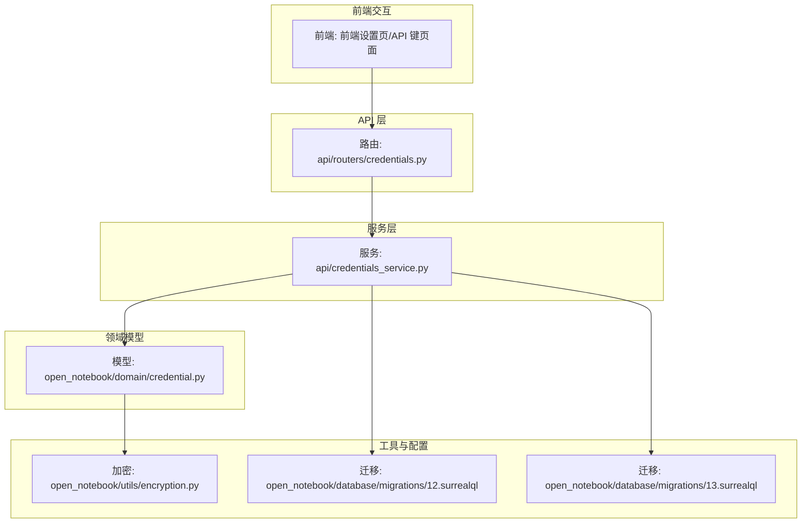
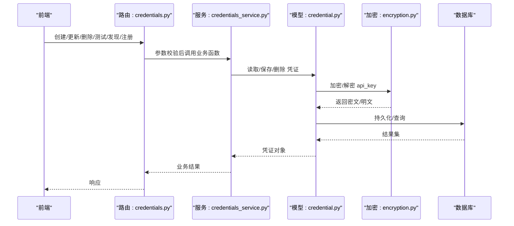
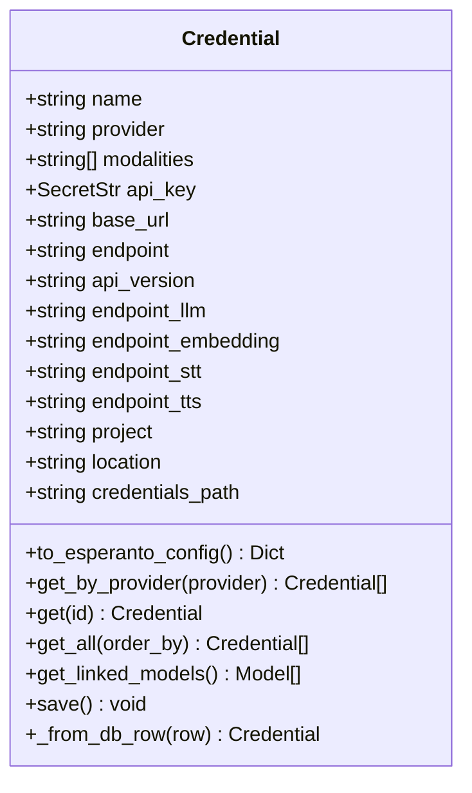
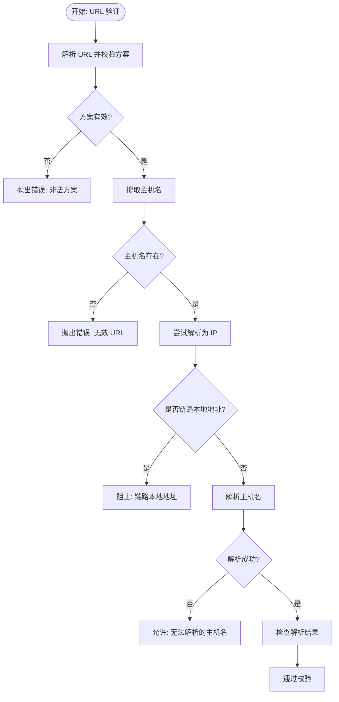
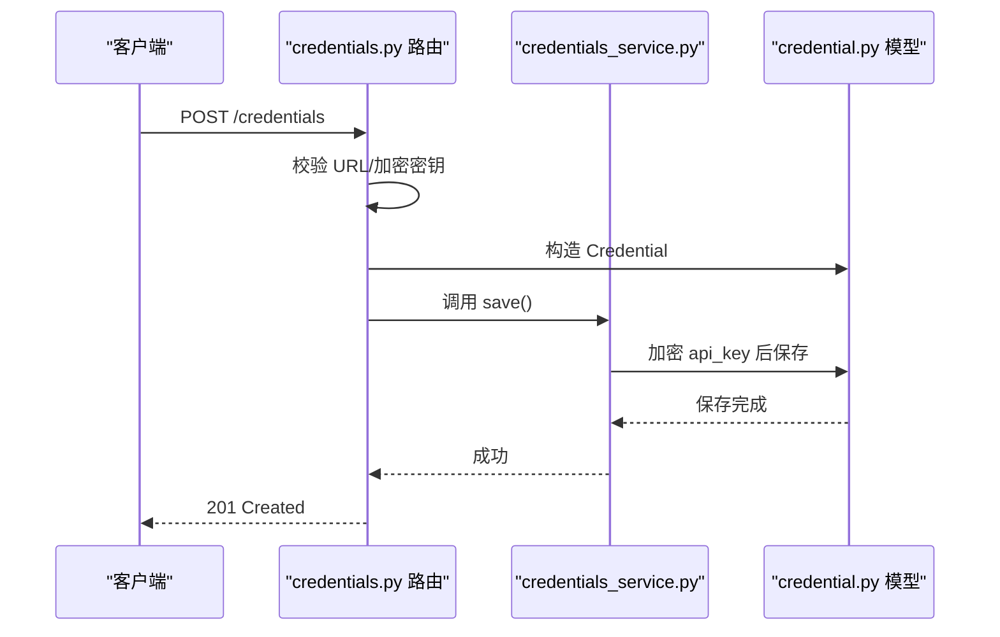
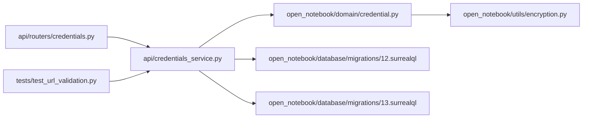
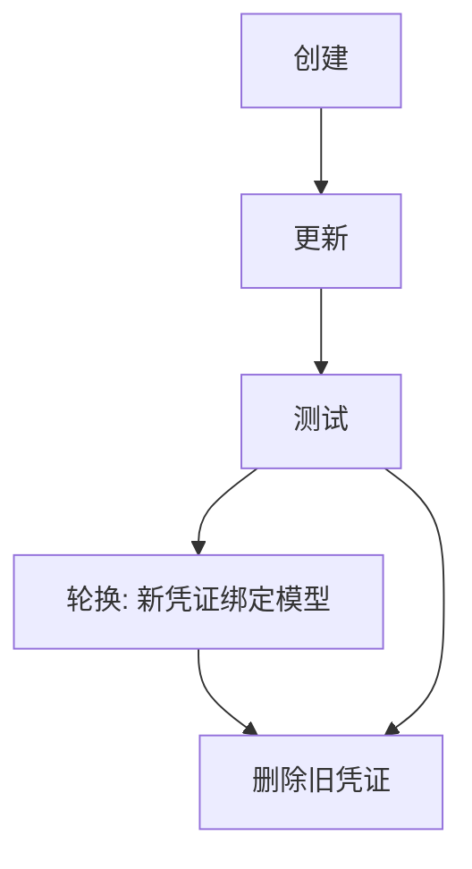

# 凭证服务

<cite>
**本文引用的文件**
- [api/credentials_service.py](file://api/credentials_service.py)
- [api/routers/credentials.py](file://api/routers/credentials.py)
- [open_notebook/domain/credential.py](file://open_notebook/domain/credential.py)
- [open_notebook/utils/encryption.py](file://open_notebook/utils/encryption.py)
- [api/models.py](file://api/models.py)
- [open_notebook/database/migrations/12.surrealql](file://open_notebook/database/migrations/12.surrealql)
- [open_notebook/database/migrations/13.surrealql](file://open_notebook/database/migrations/13.surrealql)
- [tests/test_url_validation.py](file://tests/test_url_validation.py)
</cite>

## 目录
1. [简介](#简介)
2. [项目结构](#项目结构)
3. [核心组件](#核心组件)
4. [架构总览](#架构总览)
5. [详细组件分析](#详细组件分析)
6. [依赖关系分析](#依赖关系分析)
7. [性能考量](#性能考量)
8. [故障排除指南](#故障排除指南)
9. [结论](#结论)
10. [附录](#附录)

## 简介
本文件系统性阐述凭证服务（CredentialsService）的安全凭证管理机制，包括：
- 凭证的创建、更新、删除与轮换流程
- 加密存储与解密策略
- 访问控制与安全审计
- API 密钥生命周期管理、权限验证与连接测试
- 安全配置指南、最佳实践与故障排除

## 项目结构
凭证服务由三层组成：HTTP 路由层、业务服务层与领域模型层，配合数据库迁移脚本与加密工具模块共同实现安全的凭证管理。

图表来源
- [api/routers/credentials.py](file://api/routers/credentials.py#L1-L387)
- [api/credentials_service.py](file://api/credentials_service.py#L1-L884)
- [open_notebook/domain/credential.py](file://open_notebook/domain/credential.py#L1-L200)
- [open_notebook/utils/encryption.py](file://open_notebook/utils/encryption.py#L1-L199)
- [open_notebook/database/migrations/12.surrealql](file://open_notebook/database/migrations/12.surrealql#L1-L30)
- [open_notebook/database/migrations/13.surrealql](file://open_notebook/database/migrations/13.surrealql#L1-L4)

章节来源
- [api/routers/credentials.py](file://api/routers/credentials.py#L1-L387)
- [api/credentials_service.py](file://api/credentials_service.py#L1-L884)
- [open_notebook/domain/credential.py](file://open_notebook/domain/credential.py#L1-L200)
- [open_notebook/utils/encryption.py](file://open_notebook/utils/encryption.py#L1-L199)
- [open_notebook/database/migrations/12.surrealql](file://open_notebook/database/migrations/12.surrealql#L1-L30)
- [open_notebook/database/migrations/13.surrealql](file://open_notebook/database/migrations/13.surrealql#L1-L4)

## 核心组件
- 路由器（API 层）
  - 提供凭证的 CRUD、测试、发现与注册模型、迁移等接口，统一进行输入校验与错误转换。
- 服务层（业务逻辑）
  - 实现凭证状态查询、URL 验证（SSRF 防护）、连接测试、模型发现与注册、从环境变量与旧配置迁移等。
- 领域模型（数据持久化）
  - 封装单个凭证记录，负责字段准备、保存时加密、加载时解密、按提供者查询与关联模型查询。
- 加密工具
  - 提供对称加密/解密、密钥派生、Docker secrets 文件读取、令牌识别与容错处理。
- 数据库迁移
  - 定义凭证表结构、索引与模型到凭证的外键关系。

章节来源
- [api/routers/credentials.py](file://api/routers/credentials.py#L1-L387)
- [api/credentials_service.py](file://api/credentials_service.py#L1-L884)
- [open_notebook/domain/credential.py](file://open_notebook/domain/credential.py#L1-L200)
- [open_notebook/utils/encryption.py](file://open_notebook/utils/encryption.py#L1-L199)
- [open_notebook/database/migrations/12.surrealql](file://open_notebook/database/migrations/12.surrealql#L1-L30)

## 架构总览
凭证服务采用分层架构，确保职责分离与可维护性。HTTP 路由层仅做参数校验与异常转换；服务层集中处理业务规则与外部集成；领域模型封装数据与持久化细节；加密工具提供安全能力；数据库迁移脚本保证结构演进。

图表来源
- [api/routers/credentials.py](file://api/routers/credentials.py#L132-L174)
- [api/credentials_service.py](file://api/credentials_service.py#L356-L466)
- [open_notebook/domain/credential.py](file://open_notebook/domain/credential.py#L115-L199)
- [open_notebook/utils/encryption.py](file://open_notebook/utils/encryption.py#L128-L199)

## 详细组件分析

### 凭证模型（Credential）
- 字段设计
  - 名称、提供者、支持模态、API 密钥（可选）、基础 URL、端点、版本、各服务端点（LLM/Embedding/STT/TTS）、项目/区域、凭据路径等。
  - 可空字段集合用于数据库兼容与选择性存储。
- 加密与解密
  - 保存前对 api_key 进行加密；加载时自动解密并封装为 SecretStr，避免明文泄露。
  - 支持回退处理：若数据库中为明文，解密失败则视为历史数据，返回原值。
- 关联模型
  - 查询与凭证绑定的模型列表，便于删除凭证时的迁移或清理。

图表来源
- [open_notebook/domain/credential.py](file://open_notebook/domain/credential.py#L29-L200)

章节来源
- [open_notebook/domain/credential.py](file://open_notebook/domain/credential.py#L1-L200)

### 服务层（CredentialsService）
- URL 验证（SSRF 防护）
  - 严格校验 URL 方案（仅允许 http/https），解析主机名，阻断链路本地地址（169.254.x.x）及其 IPv4 映射形式，避免云元数据暴露风险。
  - 对于无法解析的主机名，不强制拒绝，以适配内部 DNS 场景。
- 凭证状态与环境检查
  - 统计每个提供者的配置来源（数据库/环境变量/未配置），并报告加密密钥是否已配置。
  - 检查环境变量配置状态，辅助迁移与诊断。
- 连接测试
  - 针对不同提供者执行连接测试：Ollama、OpenAI 兼容、Azure、以及通过 Esperanto 工厂的标准提供者。
  - 对常见错误进行语义化提示（如 401 无效密钥、403 权限不足、速率限制、模型不存在等）。
- 模型发现与注册
  - 通过提供者 API 或静态清单发现可用模型，支持用户指定模型类型后批量注册并绑定到凭证。
- 迁移
  - 从 ProviderConfig 单例迁移到独立凭证记录，并将未分配模型重新链接到新凭证。
  - 从环境变量迁移 API 密钥到数据库凭证，支持跳过已存在记录或报错。
- URL 校验与业务异常
  - 所有业务错误以 ValueError 抛出，由路由层转换为 HTTP 异常，保持一致的错误语义。

图表来源
- [api/credentials_service.py](file://api/credentials_service.py#L85-L186)

章节来源
- [api/credentials_service.py](file://api/credentials_service.py#L1-L884)

### 路由层（API）
- 接口职责
  - 列表/按提供者查询、创建、更新、删除、测试、发现模型、注册模型、状态查询、环境状态查询、从 ProviderConfig/环境变量迁移。
- 输入校验与安全
  - 创建/更新时对所有 URL 字段执行 SSRF 校验；要求开启加密密钥后方可写入凭证。
  - 删除凭证时，若存在关联模型，需显式传参决定删除或迁移，防止误删。
- 错误处理
  - 将服务层 ValueError 转换为 HTTP 异常，统一错误消息。

图表来源
- [api/routers/credentials.py](file://api/routers/credentials.py#L132-L174)
- [open_notebook/domain/credential.py](file://open_notebook/domain/credential.py#L174-L189)

章节来源
- [api/routers/credentials.py](file://api/routers/credentials.py#L1-L387)

### 数据模型与响应
- 请求/响应模型
  - CreateCredentialRequest/UpdateCredentialRequest/CredentialResponse/DiscoverModelsResponse/RegisterModelsRequest/Response/TestConnectionResponse 等，覆盖凭证 CRUD、模型发现与注册、连接测试等场景。
- 不返回敏感信息
  - 响应体中不包含实际 API 密钥，仅返回摘要信息与统计数。

章节来源
- [api/models.py](file://api/models.py#L556-L664)

### 数据库结构
- 凭证表（credential）
  - 包含名称、提供者、模态数组、可空的 API 密钥、URL/端点/版本、项目/区域/凭据路径等字段。
  - 为 provider 建立索引，提升查询效率。
- 模型到凭证的外键
  - 在 model 表新增 credential 字段，建立可选关系，实现模型与凭证的绑定。

章节来源
- [open_notebook/database/migrations/12.surrealql](file://open_notebook/database/migrations/12.surrealql#L1-L30)
- [open_notebook/database/migrations/13.surrealql](file://open_notebook/database/migrations/13.surrealql#L1-L4)

## 依赖关系分析
- 路由依赖服务层函数，服务层依赖领域模型与加密工具。
- 领域模型依赖数据库仓库与加密工具，实现字段准备、保存与加载。
- 测试覆盖 URL 校验逻辑，确保 SSRF 防护生效。

图表来源
- [api/routers/credentials.py](file://api/routers/credentials.py#L1-L387)
- [api/credentials_service.py](file://api/credentials_service.py#L1-L884)
- [open_notebook/domain/credential.py](file://open_notebook/domain/credential.py#L1-L200)
- [open_notebook/utils/encryption.py](file://open_notebook/utils/encryption.py#L1-L199)
- [open_notebook/database/migrations/12.surrealql](file://open_notebook/database/migrations/12.surrealql#L1-L30)
- [open_notebook/database/migrations/13.surrealql](file://open_notebook/database/migrations/13.surrealql#L1-L4)
- [tests/test_url_validation.py](file://tests/test_url_validation.py#L1-L40)

章节来源
- [api/routers/credentials.py](file://api/routers/credentials.py#L1-L387)
- [api/credentials_service.py](file://api/credentials_service.py#L1-L884)
- [open_notebook/domain/credential.py](file://open_notebook/domain/credential.py#L1-L200)
- [open_notebook/utils/encryption.py](file://open_notebook/utils/encryption.py#L1-L199)
- [open_notebook/database/migrations/12.surrealql](file://open_notebook/database/migrations/12.surrealql#L1-L30)
- [open_notebook/database/migrations/13.surrealql](file://open_notebook/database/migrations/13.surrealql#L1-L4)
- [tests/test_url_validation.py](file://tests/test_url_validation.py#L1-L40)

## 性能考量
- 加密/解密开销
  - 对每个凭证的 API 密钥在保存/加载时进行加解密，建议在高并发场景下关注 CPU 使用率与延迟。
- URL 校验成本
  - 解析与主机名解析可能带来额外网络与解析开销，但仅在创建/更新时触发。
- 数据库索引
  - 为 provider 建立索引，提升按提供者查询的性能。
- 批量操作
  - 模型注册采用批量写入，减少往返次数，提高吞吐。

[本节为通用指导，无需特定文件来源]

## 故障排除指南
- 无法保存凭证
  - 确认已设置 OPEN_NOTEBOOK_ENCRYPTION_KEY，且值有效；检查密钥来源（环境变量或 Docker secrets 文件）。
  - 若出现“密钥不正确”提示，确认使用的是正确的加密密钥。
- 连接测试失败
  - 401：检查 API 密钥是否正确、是否被禁用或过期。
  - 403：检查密钥权限是否满足目标提供者的要求。
  - 速率限制：等待冷却后重试，或调整并发。
  - 模型不存在：确认提供者 API 是否支持该模型名称。
- URL 校验失败
  - 检查 URL 方案是否为 http/https；避免使用链路本地地址（169.254.x.x）。
  - 对于内部 DNS 名称，若解析失败仍允许通过，但请确认网络可达性。
- 删除凭证失败
  - 若凭证关联了模型，请明确传入 delete_models 或 migrate_to 参数，否则会返回冲突信息。
- 迁移失败
  - ProviderConfig 迁移：检查旧配置是否存在，避免重复迁移导致跳过。
  - 环境变量迁移：若数据库中已有同名凭证，会跳过；可通过强制覆盖策略或手动清理后重试。

章节来源
- [api/credentials_service.py](file://api/credentials_service.py#L356-L466)
- [api/routers/credentials.py](file://api/routers/credentials.py#L248-L306)
- [tests/test_url_validation.py](file://tests/test_url_validation.py#L1-L40)

## 结论
凭证服务通过严格的 URL 校验（SSRF 防护）、对称加密存储、细粒度的 CRUD 与迁移能力，构建了安全可靠的 API 密钥管理体系。结合模型发现与注册、连接测试与状态查询，实现了从创建到轮换的完整生命周期管理。建议在生产环境中始终启用加密密钥，并遵循最小权限原则与定期轮换策略。

[本节为总结，无需特定文件来源]

## 附录

### 凭证生命周期管理流程
- 创建
  - 校验加密密钥与 URL；构造 Credential；保存并返回摘要信息。
- 更新
  - 校验加密密钥与 URL；更新字段；保存并返回最新摘要。
- 删除
  - 若存在关联模型，需显式选择删除或迁移；完成后返回删除统计。
- 轮换
  - 新建凭证并测试通过后，迁移模型绑定至新凭证，再删除旧凭证。

[本图为概念流程图，无需图表来源]

### 安全配置与最佳实践
- 必须设置 OPEN_NOTEBOOK_ENCRYPTION_KEY，推荐使用强随机字符串；支持 Docker secrets 文件方式。
- 仅使用 http/https 方案；避免链路本地地址；自托管场景允许私网与 localhost。
- 最小权限：为不同提供者授予必要的 API 权限；定期轮换密钥。
- 审计与监控：保留连接测试与迁移的日志；对异常错误进行告警。
- 备份与恢复：迁移前后做好备份；密钥变更时同步更新。

[本节为通用指导，无需特定文件来源]