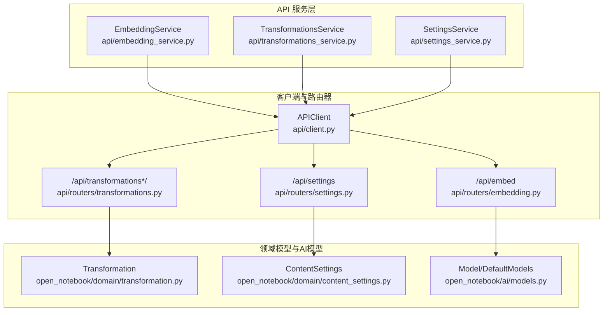
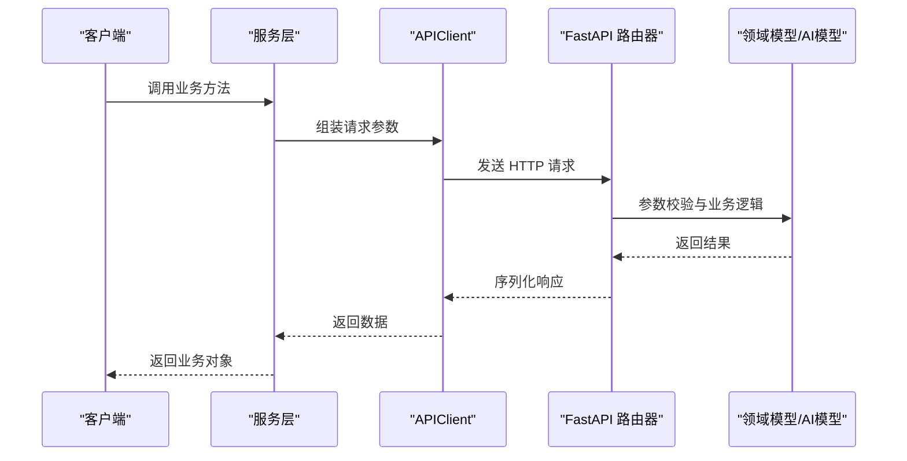
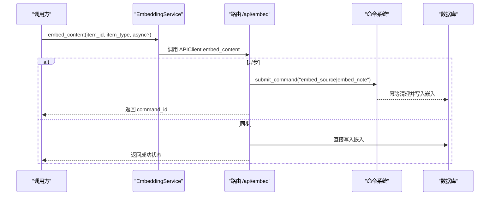
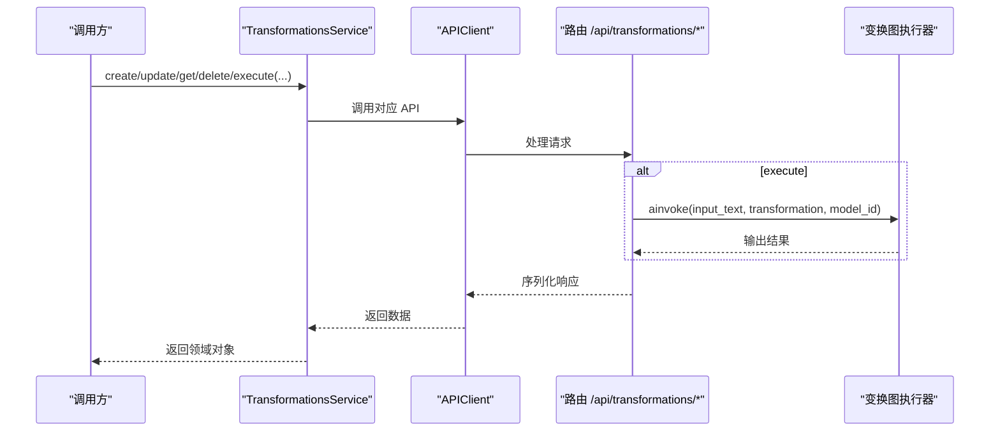
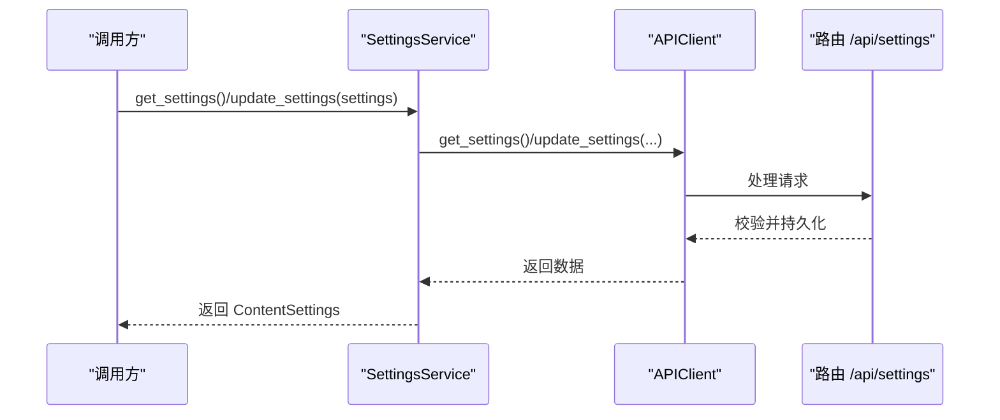
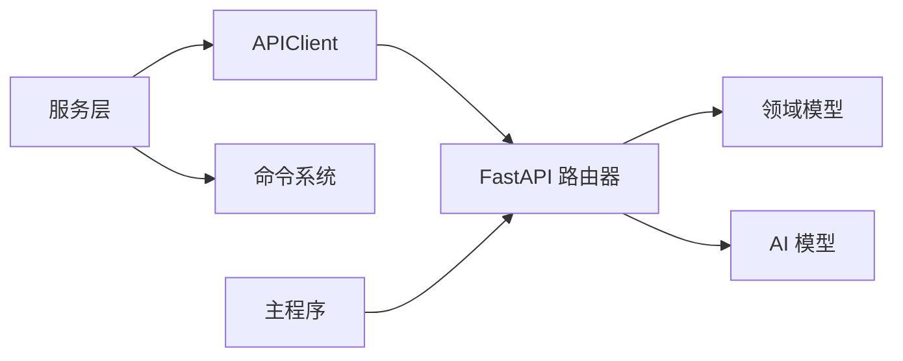

# 工具服务

<cite>
**本文引用的文件**
- [embedding_service.py](file://api/embedding_service.py)
- [transformations_service.py](file://api/transformations_service.py)
- [settings_service.py](file://api/settings_service.py)
- [client.py](file://api/client.py)
- [embedding.py](file://api/routers/embedding.py)
- [transformations.py](file://api/routers/transformations.py)
- [settings.py](file://api/routers/settings.py)
- [models.py](file://api/models.py)
- [main.py](file://api/main.py)
- [embedding_commands.py](file://commands/embedding_commands.py)
- [transformation.py](file://open_notebook/domain/transformation.py)
- [content_settings.py](file://open_notebook/domain/content_settings.py)
- [models.py](file://open_notebook/ai/models.py)
</cite>

## 目录
1. [简介](#简介)
2. [项目结构](#项目结构)
3. [核心组件](#核心组件)
4. [架构总览](#架构总览)
5. [详细组件分析](#详细组件分析)
6. [依赖分析](#依赖分析)
7. [性能考虑](#性能考虑)
8. [故障排查指南](#故障排查指南)
9. [结论](#结论)

## 简介
本文件系统化梳理工具服务层的设计与实现，重点覆盖以下三类服务：
- 嵌入服务：负责内容向量化与批量重建，支持同步与异步两种处理路径。
- 转换服务：负责“变换”（Transformations）的增删改查与执行，提供统一的提示词模板与默认提示管理。
- 设置服务：负责应用配置的读取与更新，包括内容处理引擎、嵌入策略、语言偏好等。

文档从架构、数据流、处理逻辑、错误处理、性能优化与扩展性等方面进行深入分析，并给出服务间协作关系与集成使用示例。

## 项目结构
工具服务位于后端 API 层，采用“服务层（Service）+ 客户端（Client）+ 路由器（Router）+ 模型（Pydantic）”的分层设计：
- 服务层：封装对外 API 的调用细节，提供简洁的业务方法。
- 客户端：统一封装 HTTP 请求、超时控制、认证头、错误处理。
- 路由器：FastAPI 路由，定义接口契约、参数校验与异常处理。
- 模型：Pydantic 数据模型，用于请求/响应序列化与字段约束。

图表来源
- [embedding_service.py](file://api/embedding_service.py#L12-L27)
- [transformations_service.py](file://api/transformations_service.py#L14-L141)
- [settings_service.py](file://api/settings_service.py#L11-L79)
- [client.py](file://api/client.py#L13-L529)
- [embedding.py](file://api/routers/embedding.py#L12-L114)
- [transformations.py](file://api/routers/transformations.py#L23-L251)
- [settings.py](file://api/routers/settings.py#L11-L89)
- [transformation.py](file://open_notebook/domain/transformation.py#L8-L22)
- [content_settings.py](file://open_notebook/domain/content_settings.py#L8-L26)
- [models.py](file://open_notebook/ai/models.py#L18-L267)

章节来源
- [main.py](file://api/main.py#L157-L179)
- [models.py](file://api/models.py#L198-L255)

## 核心组件
- 嵌入服务（EmbeddingService）
  - 提供 embed_content(item_id, item_type) 方法，委托 APIClient 发起 /api/embed 请求。
  - 支持同步与异步两种模式：同步直接提交到领域模型；异步通过命令系统后台处理。
- 转换服务（TransformationsService）
  - 提供获取、创建、更新、删除、执行变换的方法。
  - 将 API 响应转换为领域模型对象（Transformation），并处理时间字段解析。
- 设置服务（SettingsService）
  - 提供 get_settings() 与 update_settings()，将 API 响应映射为领域模型（ContentSettings）。
  - 支持部分字段更新，类型安全地进行字面量校验。

章节来源
- [embedding_service.py](file://api/embedding_service.py#L12-L27)
- [transformations_service.py](file://api/transformations_service.py#L14-L141)
- [settings_service.py](file://api/settings_service.py#L11-L79)

## 架构总览
工具服务的整体调用链如下：
- 客户端层（APIClient）封装 HTTP 请求、超时与认证。
- 路由器层（FastAPI）负责接口定义、参数校验与异常处理。
- 服务层（Service）负责业务编排与数据转换。
- 领域模型（Domain Models）与 AI 模型（Model/DefaultModels）提供强类型的数据结构与默认配置。

图表来源
- [client.py](file://api/client.py#L48-L78)
- [embedding.py](file://api/routers/embedding.py#L12-L114)
- [transformations.py](file://api/routers/transformations.py#L23-L251)
- [settings.py](file://api/routers/settings.py#L11-L89)
- [models.py](file://api/models.py#L198-L255)

## 详细组件分析

### 嵌入服务（EmbeddingService）
- 设计要点
  - 服务层薄封装：仅转发调用，便于替换底层实现或增加中间件。
  - 异步处理：通过路由器支持异步模式，避免长耗时阻塞。
- 关键流程
  - 同步路径：路由器根据 item_type 调用 Source/Note 的向量化方法，返回 command_id。
  - 异步路径：路由器提交 embed_source 或 embed_note 命令，交由命令系统后台执行。
- 错误处理
  - 缺失嵌入模型时直接返回 HTTP 400。
  - 未找到资源返回 404；其他异常统一包装为 500。
- 性能与扩展性
  - 路由器内置超时控制，适配慢速模型或远程 API。
  - 命令系统支持重试与幂等（如删除旧嵌入再插入新嵌入）。
  - 批量重建通过协调命令提交多个子任务，提升吞吐。

图表来源
- [embedding_service.py](file://api/embedding_service.py#L18-L23)
- [embedding.py](file://api/routers/embedding.py#L32-L103)
- [embedding_commands.py](file://commands/embedding_commands.py#L318-L440)

章节来源
- [embedding_service.py](file://api/embedding_service.py#L12-L27)
- [client.py](file://api/client.py#L292-L302)
- [embedding.py](file://api/routers/embedding.py#L12-L114)
- [embedding_commands.py](file://commands/embedding_commands.py#L120-L440)

### 转换服务（TransformationsService）
- 设计要点
  - 统一的 CRUD 与执行接口，屏蔽 API 细节。
  - 将 API 响应转换为强类型领域对象（Transformation），包含创建/更新时间解析。
- 关键流程
  - 获取列表/单个：调用 APIClient，构造 Transformation 对象。
  - 创建/更新：先调用 APIClient，再将响应映射回对象。
  - 执行：调用 APIClient.execute_transformation，返回结果。
- 错误处理
  - 更新前校验 ID 存在性。
  - 字段可选更新，避免全量覆盖。
- 性能与扩展性
  - 执行阶段通过图执行器（transformation_graph）解耦具体模型调用。
  - 默认提示词（DefaultPrompts）集中管理，便于统一策略。

图表来源
- [transformations_service.py](file://api/transformations_service.py#L20-L141)
- [transformations.py](file://api/routers/transformations.py#L81-L116)
- [transformation.py](file://open_notebook/domain/transformation.py#L8-L22)

章节来源
- [transformations_service.py](file://api/transformations_service.py#L14-L141)
- [transformations.py](file://api/routers/transformations.py#L23-L251)
- [transformation.py](file://open_notebook/domain/transformation.py#L8-L22)

### 设置服务（SettingsService）
- 设计要点
  - 将 API 响应映射为强类型领域对象（ContentSettings），支持部分字段更新。
  - 类型安全的字面量校验，确保配置值合法。
- 关键流程
  - 获取：调用 APIClient.get_settings，映射为 ContentSettings。
  - 更新：构造更新字典，调用 APIClient.update_settings，回填对象字段。
- 错误处理
  - 输入校验失败抛出 400；其他异常统一包装为 500。
- 性能与扩展性
  - 配置项集中存储于记录模型，便于前端展示与编辑。
  - 可按需扩展更多配置项，保持向后兼容。

图表来源
- [settings_service.py](file://api/settings_service.py#L17-L75)
- [settings.py](file://api/routers/settings.py#L11-L89)
- [content_settings.py](file://open_notebook/domain/content_settings.py#L8-L26)

章节来源
- [settings_service.py](file://api/settings_service.py#L11-L79)
- [settings.py](file://api/routers/settings.py#L11-L89)
- [content_settings.py](file://open_notebook/domain/content_settings.py#L8-L26)

## 依赖分析
- 服务层依赖客户端层（APIClient），后者封装 HTTP 与超时。
- 路由器层依赖领域模型（Transformation、ContentSettings）与 AI 模型（Model/DefaultModels）。
- 嵌入服务与命令系统（commands/embedding_commands.py）配合，实现异步嵌入与批量重建。
- 主程序（main.py）注册所有路由器，形成统一 API 入口。

图表来源
- [main.py](file://api/main.py#L157-L179)
- [client.py](file://api/client.py#L13-L529)
- [embedding_commands.py](file://commands/embedding_commands.py#L621-L787)

章节来源
- [main.py](file://api/main.py#L157-L179)
- [client.py](file://api/client.py#L13-L529)
- [embedding_commands.py](file://commands/embedding_commands.py#L621-L787)

## 性能考虑
- 超时与并发
  - 客户端支持可配置超时，针对慢速模型或远程 API 场景进行优化。
  - 嵌入执行与变换执行均使用较长超时，避免误判连接失败。
- 异步与批处理
  - 嵌入支持异步模式，避免阻塞主线程。
  - 批量重建通过协调命令提交多个子任务，提升吞吐。
- 重试与幂等
  - 命令系统为关键操作提供指数退避重试，避免瞬时故障影响。
  - 嵌入写入采用幂等策略（删除旧嵌入再插入新嵌入），保证一致性。
- 缓存策略
  - AI 模型管理器（ModelManager）由 Esperanto 负责实例缓存，减少重复初始化开销。
  - 配置读取采用记录模型，建议在上层应用中结合本地缓存降低频繁查询成本。

章节来源
- [client.py](file://api/client.py#L16-L40)
- [embedding_commands.py](file://commands/embedding_commands.py#L120-L440)
- [models.py](file://open_notebook/ai/models.py#L97-L267)

## 故障排查指南
- 常见错误与定位
  - 缺少嵌入模型：路由层会直接返回 400，检查模型配置。
  - 资源不存在：返回 404，确认 item_id 是否正确。
  - 连接失败：客户端捕获 HTTP 异常并包装为运行时错误，检查 API 地址与鉴权。
- 日志与可观测性
  - 服务层与客户端均使用日志记录关键事件与错误堆栈，便于定位问题。
  - 命令系统输出重试与进度信息，可用于评估批量任务状态。
- 快速修复建议
  - 调整 API_CLIENT_TIMEOUT 以适应慢速硬件或远程 API。
  - 使用异步模式处理长耗时任务，避免超时。
  - 批量重建时适当提高超时时间，关注失败条目并重试。

章节来源
- [embedding.py](file://api/routers/embedding.py#L16-L21)
- [client.py](file://api/client.py#L60-L78)
- [embedding_commands.py](file://commands/embedding_commands.py#L621-L787)

## 结论
工具服务通过清晰的分层设计实现了嵌入、转换与设置三大核心能力：
- 嵌入服务提供灵活的同步/异步向量化能力，并与命令系统协同完成批量重建。
- 转换服务以强类型领域模型承载提示词与默认策略，简化调用与维护。
- 设置服务以类型安全的方式管理应用配置，保障系统行为一致性。

整体架构具备良好的扩展性与可维护性，适合在多模型、多场景下演进。