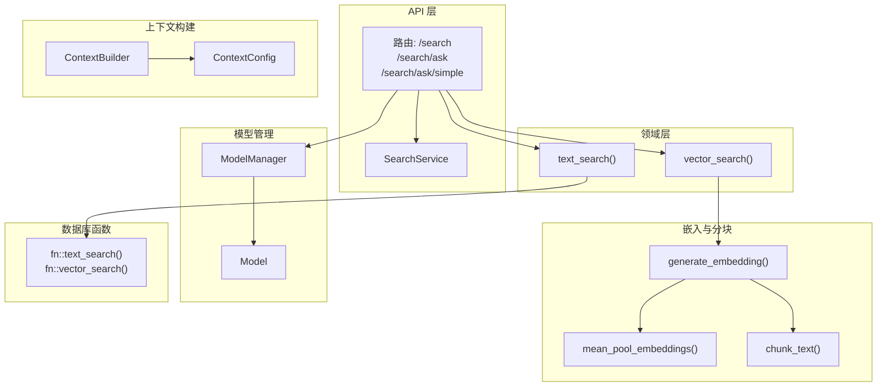
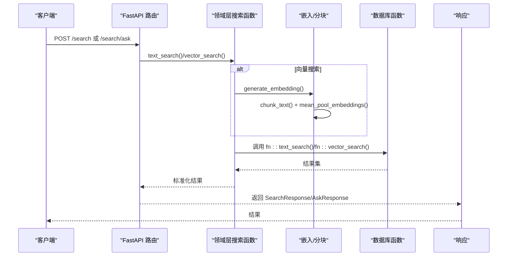
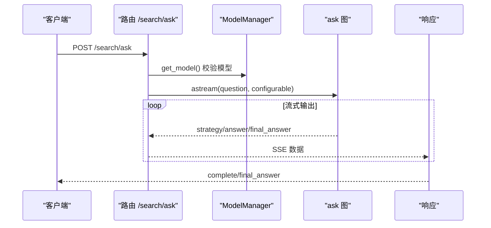
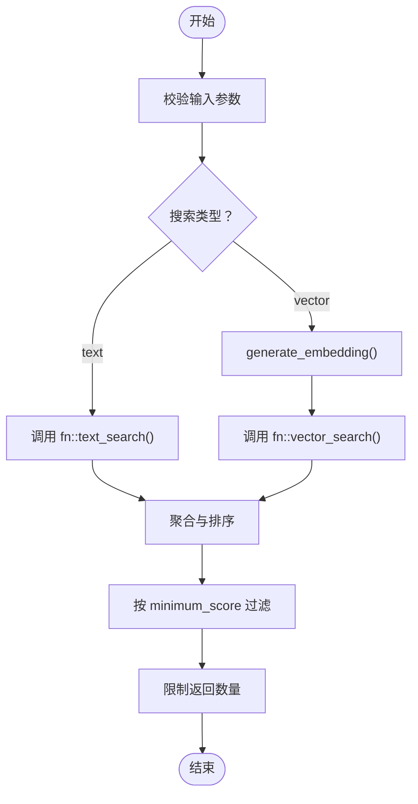
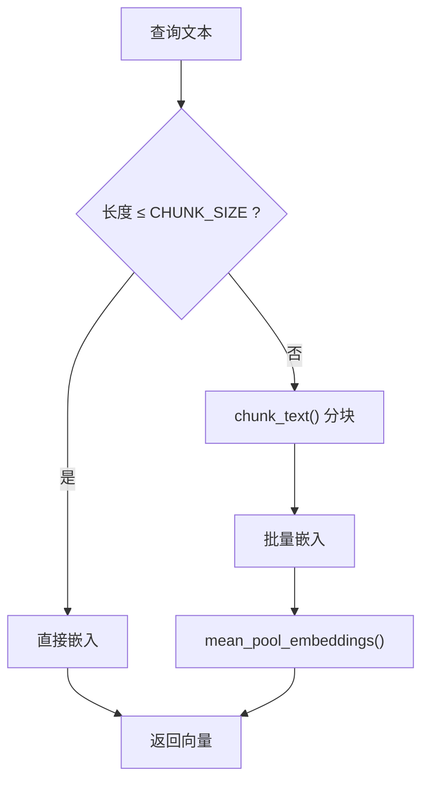
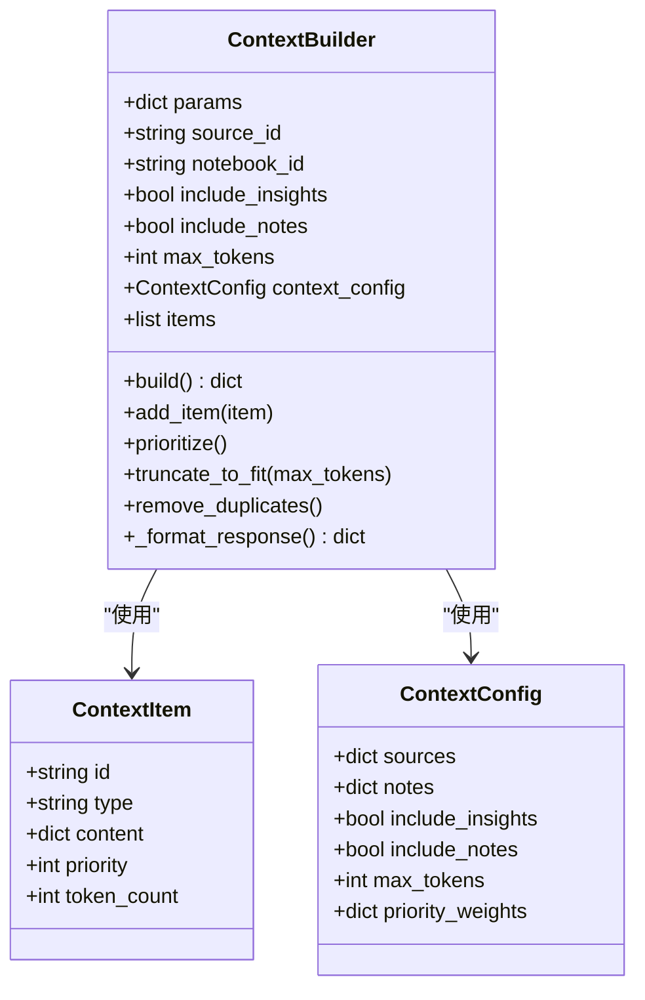
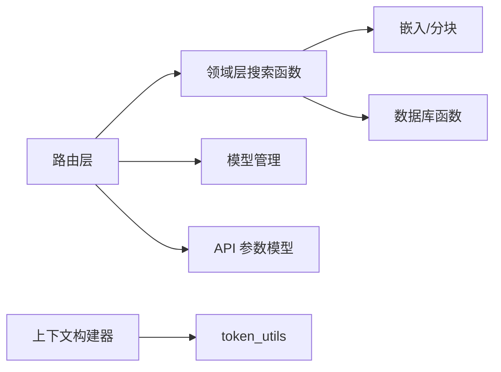

# 搜索服务

<cite>
**本文档引用的文件**
- [api/search_service.py](file://api/search_service.py)
- [api/routers/search.py](file://api/routers/search.py)
- [open_notebook/domain/notebook.py](file://open_notebook/domain/notebook.py)
- [open_notebook/utils/context_builder.py](file://open_notebook/utils/context_builder.py)
- [open_notebook/utils/embedding.py](file://open_notebook/utils/embedding.py)
- [open_notebook/utils/chunking.py](file://open_notebook/utils/chunking.py)
- [open_notebook/utils/token_utils.py](file://open_notebook/utils/token_utils.py)
- [open_notebook/ai/models.py](file://open_notebook/ai/models.py)
- [open_notebook/graphs/ask.py](file://open_notebook/graphs/ask.py)
- [api/models.py](file://api/models.py)
- [docs/3-USER-GUIDE/search.md](file://docs/3-USER-GUIDE/search.md)
</cite>

## 目录
1. [简介](#简介)
2. [项目结构](#项目结构)
3. [核心组件](#核心组件)
4. [架构总览](#架构总览)
5. [详细组件分析](#详细组件分析)
6. [依赖关系分析](#依赖关系分析)
7. [性能考虑](#性能考虑)
8. [故障排除指南](#故障排除指南)
9. [结论](#结论)
10. [附录](#附录)

## 简介
本文件系统化梳理搜索服务的实现与使用，重点覆盖：
- SearchService 类的搜索算法实现与混合检索机制
- 上下文构建逻辑（ContextBuilder）
- 文本搜索、向量搜索与混合搜索的实现原理（查询处理、结果排序与相关性评分）
- 搜索优化策略、性能调优方法与缓存机制
- 搜索 API 的使用示例、参数配置与结果处理指导

## 项目结构
搜索服务涉及后端 API 路由层、领域层搜索函数、嵌入与分块工具、上下文构建器以及模型管理等模块。整体采用“路由层 → 领域层搜索函数 → 嵌入/分块 → 数据库函数”的分层设计。

图表来源
- [api/routers/search.py](file://api/routers/search.py#L17-L58)
- [open_notebook/domain/notebook.py](file://open_notebook/domain/notebook.py#L627-L679)
- [open_notebook/utils/embedding.py](file://open_notebook/utils/embedding.py#L82-L207)
- [open_notebook/utils/chunking.py](file://open_notebook/utils/chunking.py#L386-L446)
- [open_notebook/utils/context_builder.py](file://open_notebook/utils/context_builder.py#L59-L495)
- [open_notebook/ai/models.py](file://open_notebook/ai/models.py#L97-L200)

章节来源
- [api/routers/search.py](file://api/routers/search.py#L17-L58)
- [open_notebook/domain/notebook.py](file://open_notebook/domain/notebook.py#L627-L679)
- [open_notebook/utils/embedding.py](file://open_notebook/utils/embedding.py#L82-L207)
- [open_notebook/utils/chunking.py](file://open_notebook/utils/chunking.py#L386-L446)
- [open_notebook/utils/context_builder.py](file://open_notebook/utils/context_builder.py#L59-L495)
- [open_notebook/ai/models.py](file://open_notebook/ai/models.py#L97-L200)

## 核心组件
- SearchService：面向 API 的服务层封装，负责调用底层搜索接口并返回标准化结果。
- 路由层：提供 /search、/search/ask、/search/ask/simple 等端点，统一参数校验与错误处理。
- 领域层搜索函数：text_search() 与 vector_search()，分别对接数据库内置函数。
- 嵌入与分块：generate_embedding() 统一生成单个或批量嵌入；mean_pool_embeddings() 用于长文本聚合；chunk_text() 智能切分。
- 上下文构建器：ContextBuilder 提供灵活的上下文组装、优先级与截断策略。
- 模型管理：ModelManager 与 Model 提供模型实例获取与默认模型配置。

章节来源
- [api/search_service.py](file://api/search_service.py#L12-L58)
- [api/routers/search.py](file://api/routers/search.py#L17-L58)
- [open_notebook/domain/notebook.py](file://open_notebook/domain/notebook.py#L627-L679)
- [open_notebook/utils/embedding.py](file://open_notebook/utils/embedding.py#L82-L207)
- [open_notebook/utils/context_builder.py](file://open_notebook/utils/context_builder.py#L59-L495)
- [open_notebook/ai/models.py](file://open_notebook/ai/models.py#L97-L200)

## 架构总览
搜索服务的请求流从 FastAPI 路由进入，根据搜索类型选择文本或向量搜索路径，并在向量搜索中通过嵌入生成与分块策略提升长文本处理能力。最终通过数据库函数返回结构化结果，前端可进一步进行排序与展示。

图表来源
- [api/routers/search.py](file://api/routers/search.py#L17-L58)
- [open_notebook/domain/notebook.py](file://open_notebook/domain/notebook.py#L627-L679)
- [open_notebook/utils/embedding.py](file://open_notebook/utils/embedding.py#L82-L207)
- [open_notebook/utils/chunking.py](file://open_notebook/utils/chunking.py#L386-L446)

## 详细组件分析

### SearchService 类
- 角色：服务层封装，屏蔽底层细节，提供统一的搜索与问答接口。
- 方法：
  - search(query, search_type, limit, search_sources, search_notes, minimum_score)：调用 api_client.search 并提取 results 字段。
  - ask_knowledge_base(question, strategy_model, answer_model, final_answer_model)：调用 api_client.ask_simple 获取最终答案。
- 设计要点：轻薄封装，便于前端与测试使用；异常处理交由上层路由完成。

章节来源
- [api/search_service.py](file://api/search_service.py#L12-L58)

### 路由层：/search 与 /search/ask
- /search：
  - 参数：query、type（text/vector）、limit、search_sources、search_notes、minimum_score。
  - 行为：当 type=vector 时检查嵌入模型可用性；随后调用 vector_search 或 text_search。
  - 返回：SearchResponse，包含 results、total_count、search_type。
- /search/ask 与 /search/ask/simple：
  - 参数：question、strategy_model、answer_model、final_answer_model。
  - 行为：校验模型存在性与嵌入模型可用性；simple 版本直接返回最终答案；stream 版本以 Server-Sent Events 流式返回策略、答案片段与最终答案。
  - 错误处理：捕获输入与数据库异常并转换为 HTTP 异常。

图表来源
- [api/routers/search.py](file://api/routers/search.py#L110-L154)
- [open_notebook/ai/models.py](file://open_notebook/ai/models.py#L97-L200)
- [open_notebook/graphs/ask.py](file://open_notebook/graphs/ask.py#L48-L146)

章节来源
- [api/routers/search.py](file://api/routers/search.py#L17-L58)
- [api/routers/search.py](file://api/routers/search.py#L110-L214)
- [open_notebook/graphs/ask.py](file://open_notebook/graphs/ask.py#L48-L146)
- [open_notebook/ai/models.py](file://open_notebook/ai/models.py#L97-L200)

### 文本搜索与向量搜索实现
- 文本搜索 text_search：
  - 输入：keyword、results、source、note。
  - 处理：调用数据库内置函数 fn::text_search，返回结构化结果。
  - 排序：按 relevance 分数聚合与排序。
- 向量搜索 vector_search：
  - 输入：keyword、results、source、note、minimum_score。
  - 处理：通过 generate_embedding 将查询转为向量；调用 fn::vector_search，按相似度过滤与排序。
  - 相关性评分：基于 cosine 相似度，minimum_score 作为阈值过滤。

图表来源
- [open_notebook/domain/notebook.py](file://open_notebook/domain/notebook.py#L627-L679)
- [open_notebook/utils/embedding.py](file://open_notebook/utils/embedding.py#L82-L207)

章节来源
- [open_notebook/domain/notebook.py](file://open_notebook/domain/notebook.py#L627-L679)
- [open_notebook/utils/embedding.py](file://open_notebook/utils/embedding.py#L82-L207)

### 嵌入与分块策略
- generate_embedding：
  - 短文本：直接嵌入。
  - 长文本：自动分块（chunk_text），批量嵌入后通过 mean_pool_embeddings 聚合为单一向量。
- mean_pool_embeddings：
  - 对每个向量做单位长度归一化，再取均值，最后对结果归一化，确保向量稳定性。
- chunk_text：
  - 自动识别内容类型（HTML/Markdown/Plain）并选择合适分割器。
  - 支持环境变量配置 CHUNK_SIZE 与 CHUNK_OVERLAP，保证分块大小与重叠合理。
- token_count：
  - 使用 o200k_base 编码估算 token 数量，支持回退到词数估算。

图表来源
- [open_notebook/utils/embedding.py](file://open_notebook/utils/embedding.py#L143-L207)
- [open_notebook/utils/chunking.py](file://open_notebook/utils/chunking.py#L386-L446)
- [open_notebook/utils/token_utils.py](file://open_notebook/utils/token_utils.py#L15-L47)

章节来源
- [open_notebook/utils/embedding.py](file://open_notebook/utils/embedding.py#L82-L207)
- [open_notebook/utils/chunking.py](file://open_notebook/utils/chunking.py#L386-L446)
- [open_notebook/utils/token_utils.py](file://open_notebook/utils/token_utils.py#L15-L47)

### 上下文构建逻辑（ContextBuilder）
- 功能：从源、笔记、洞察中构建上下文，支持优先级、去重与 token 截断。
- 关键流程：
  - add_item：添加上下文项并记录 token 数。
  - prioritize：按权重排序（默认 source:100, note:50, insight:75）。
  - remove_duplicates：按 ID 去重。
  - truncate_to_fit：超过最大 token 时从低优先级末端移除直至达标。
  - _format_response：按类型分组并汇总统计信息。
- 配置：ContextConfig 支持指定源/笔记包含级别、是否包含洞察、最大 token 数与优先级权重。

图表来源
- [open_notebook/utils/context_builder.py](file://open_notebook/utils/context_builder.py#L21-L495)

章节来源
- [open_notebook/utils/context_builder.py](file://open_notebook/utils/context_builder.py#L59-L495)

### 模型管理与 Ask 图
- ModelManager：根据模型 ID 获取模型实例，支持凭据注入与默认模型读取。
- ask 图：定义策略生成、并行搜索与最终合成的流程图，结合 vector_search 执行具体检索与分析。

章节来源
- [open_notebook/ai/models.py](file://open_notebook/ai/models.py#L97-L200)
- [open_notebook/graphs/ask.py](file://open_notebook/graphs/ask.py#L48-L146)

## 依赖关系分析
- 路由层依赖领域层搜索函数与模型管理；领域层搜索函数依赖嵌入与分块工具；上下文构建器独立于搜索但可被其他功能复用。
- 搜索 API 的参数模型定义集中在 api/models.py 中，确保前后端一致。

图表来源
- [api/routers/search.py](file://api/routers/search.py#L17-L58)
- [open_notebook/domain/notebook.py](file://open_notebook/domain/notebook.py#L627-L679)
- [open_notebook/utils/embedding.py](file://open_notebook/utils/embedding.py#L82-L207)
- [open_notebook/utils/token_utils.py](file://open_notebook/utils/token_utils.py#L15-L47)
- [api/models.py](file://api/models.py#L32-L59)

章节来源
- [api/routers/search.py](file://api/routers/search.py#L17-L58)
- [open_notebook/domain/notebook.py](file://open_notebook/domain/notebook.py#L627-L679)
- [open_notebook/utils/embedding.py](file://open_notebook/utils/embedding.py#L82-L207)
- [open_notebook/utils/token_utils.py](file://open_notebook/utils/token_utils.py#L15-L47)
- [api/models.py](file://api/models.py#L32-L59)

## 性能考虑
- 向量搜索延迟主要来自嵌入生成与数据库相似度计算。建议：
  - 控制查询长度，避免过长文本导致多次分块与批量嵌入。
  - 合理设置 minimum_score 与 limit，减少无效匹配。
  - 使用合适的 CHUNK_SIZE 与 CHUNK_OVERLAP，平衡语义完整性与性能。
- 文本搜索通常更快，适合精确关键词定位；向量搜索适合概念探索。
- 上下文构建时启用 max_tokens 截断，避免超出模型上下文上限。

[本节为通用性能建议，不直接分析特定文件]

## 故障排除指南
- 常见错误与处理：
  - 缺少嵌入模型：向量搜索与 Ask 功能需要配置嵌入模型，否则抛出 HTTP 400。
  - 输入非法：空关键字或模型不存在会触发 InvalidInputError 或 HTTP 400。
  - 数据库异常：统一捕获并返回 HTTP 500。
- 前端排序与评分：
  - 前端会将结果按 relevance/similarity/score 排序，若为空则回退为 0。
- 用户指南参考：
  - 文档提供了文本/向量搜索的适用场景、质量优化建议与常见问题排查。

章节来源
- [api/routers/search.py](file://api/routers/search.py#L51-L58)
- [api/routers/search.py](file://api/routers/search.py#L135-L140)
- [docs/3-USER-GUIDE/search.md](file://docs/3-USER-GUIDE/search.md#L266-L300)

## 结论
搜索服务通过清晰的分层设计实现了文本与向量两种搜索模式，并在向量搜索中引入智能分块与向量聚合策略，兼顾准确性与性能。配合上下文构建器与模型管理，形成从检索到合成的完整链路。建议在实际部署中结合业务场景合理配置嵌入模型、分块参数与阈值，以获得最佳体验。

[本节为总结性内容，不直接分析特定文件]

## 附录

### 搜索 API 使用示例与参数配置
- /search
  - 请求体字段：query、type（text/vector）、limit、search_sources、search_notes、minimum_score。
  - 响应体字段：results、total_count、search_type。
- /search/ask 与 /search/ask/simple
  - 请求体字段：question、strategy_model、answer_model、final_answer_model。
  - 响应体字段：SearchResponse 或 AskResponse。
- 上下文构建
  - 可通过 ContextBuilder 或便捷函数构建笔记本/源/笔记的混合上下文，支持 max_tokens 截断与优先级控制。

章节来源
- [api/routers/search.py](file://api/routers/search.py#L17-L58)
- [api/routers/search.py](file://api/routers/search.py#L110-L214)
- [api/models.py](file://api/models.py#L32-L59)
- [open_notebook/utils/context_builder.py](file://open_notebook/utils/context_builder.py#L422-L495)