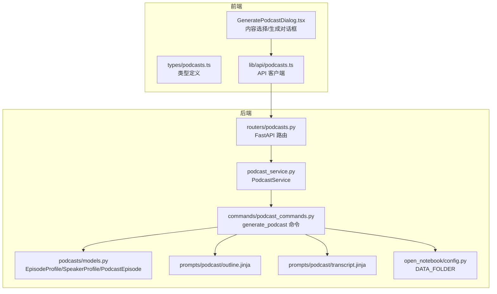
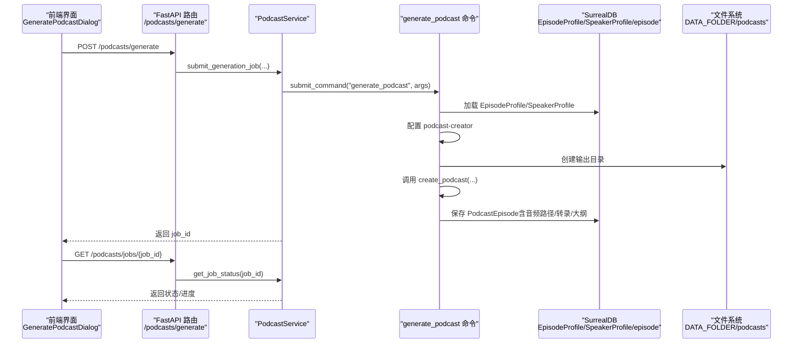
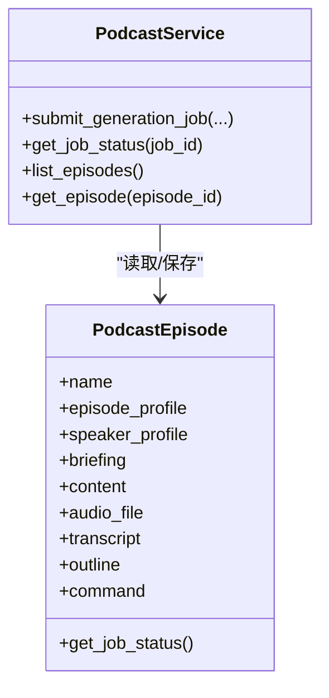
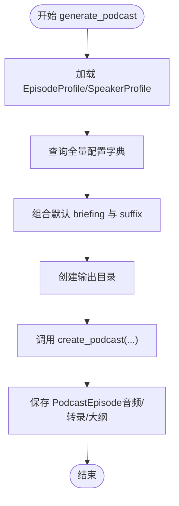
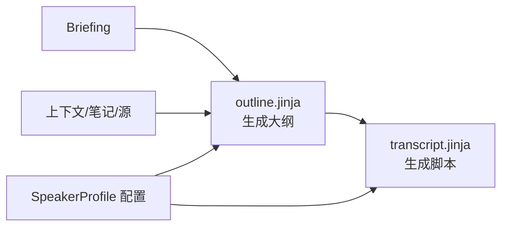
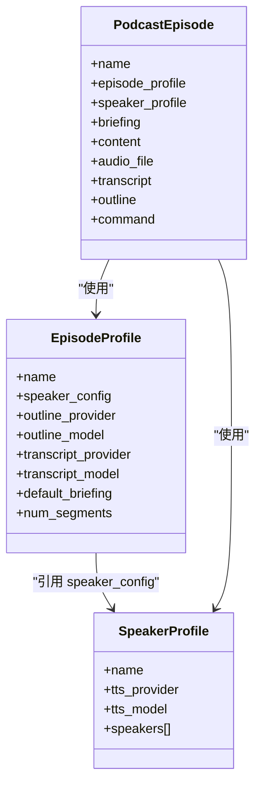
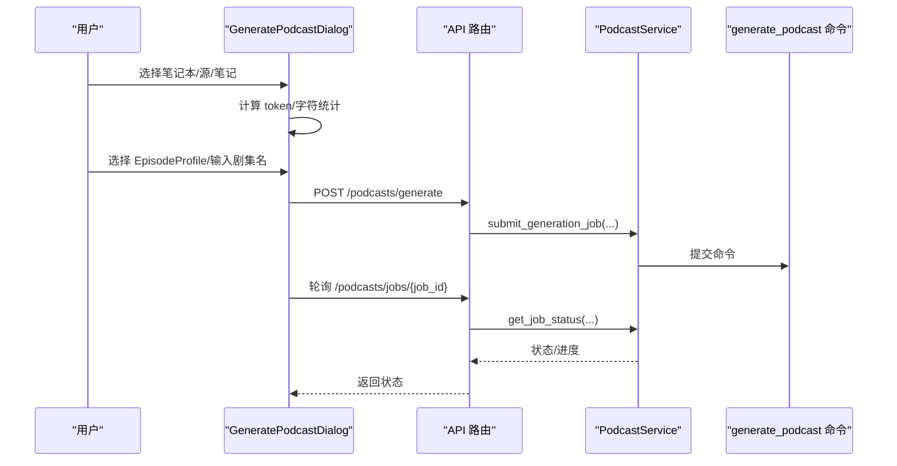
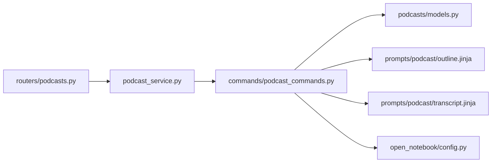

# 播客服务

<cite>
**本文引用的文件**
- [api/podcast_service.py](file://api/podcast_service.py)
- [api/podcast_api_service.py](file://api/podcast_api_service.py)
- [commands/podcast_commands.py](file://commands/podcast_commands.py)
- [api/routers/podcasts.py](file://api/routers/podcasts.py)
- [open_notebook/podcasts/models.py](file://open_notebook/podcasts/models.py)
- [prompts/podcast/outline.jinja](file://prompts/podcast/outline.jinja)
- [prompts/podcast/transcript.jinja](file://prompts/podcast/transcript.jinja)
- [open_notebook/config.py](file://open_notebook/config.py)
- [frontend/src/components/podcasts/GeneratePodcastDialog.tsx](file://frontend/src/components/podcasts/GeneratePodcastDialog.tsx)
- [frontend/src/lib/types/podcasts.ts](file://frontend/src/lib/types/podcasts.ts)
- [frontend/src/lib/api/podcasts.ts](file://frontend/src/lib/api/podcasts.ts)
- [docs/3-USER-GUIDE/creating-podcasts.md](file://docs/3-USER-GUIDE/creating-podcasts.md)
- [docs/2-CORE-CONCEPTS/podcasts-explained.md](file://docs/2-CORE-CONCEPTS/podcasts-explained.md)
</cite>

## 目录
1. [简介](#简介)
2. [项目结构](#项目结构)
3. [核心组件](#核心组件)
4. [架构总览](#架构总览)
5. [详细组件分析](#详细组件分析)
6. [依赖关系分析](#依赖关系分析)
7. [性能考量](#性能考量)
8. [故障排查指南](#故障排查指南)
9. [结论](#结论)
10. [附录](#附录)

## 简介
本文件面向“播客服务”的使用者与维护者，系统化阐述 PodcastService 类的播客生成流程、脚本创作与音频合成机制；解释播客配置管理（EpisodeProfile/SpeakerProfile）、模板系统（Jinja 模板）与内容转换逻辑；并覆盖质量控制、格式适配与输出优化策略。文档同时提供完整的播客创建工作流、参数配置与自定义选项指导，帮助用户高效产出高质量播客内容。

## 项目结构
播客服务由后端 API 路由、服务层、命令执行器、领域模型与前端交互组成，配合提示词模板实现内容到播客的自动化生产。

**图表来源**
- [api/routers/podcasts.py](file://api/routers/podcasts.py#L1-L234)
- [api/podcast_service.py](file://api/podcast_service.py#L1-L207)
- [commands/podcast_commands.py](file://commands/podcast_commands.py#L1-L188)
- [open_notebook/podcasts/models.py](file://open_notebook/podcasts/models.py#L1-L148)
- [prompts/podcast/outline.jinja](file://prompts/podcast/outline.jinja#L1-L84)
- [prompts/podcast/transcript.jinja](file://prompts/podcast/transcript.jinja#L1-L135)
- [open_notebook/config.py](file://open_notebook/config.py#L1-L18)
- [frontend/src/components/podcasts/GeneratePodcastDialog.tsx](file://frontend/src/components/podcasts/GeneratePodcastDialog.tsx#L1-L984)
- [frontend/src/lib/types/podcasts.ts](file://frontend/src/lib/types/podcasts.ts#L1-L110)
- [frontend/src/lib/api/podcasts.ts](file://frontend/src/lib/api/podcasts.ts#L1-L54)

**章节来源**
- [api/routers/podcasts.py](file://api/routers/podcasts.py#L1-L234)
- [api/podcast_service.py](file://api/podcast_service.py#L1-L207)
- [commands/podcast_commands.py](file://commands/podcast_commands.py#L1-L188)
- [open_notebook/podcasts/models.py](file://open_notebook/podcasts/models.py#L1-L148)
- [prompts/podcast/outline.jinja](file://prompts/podcast/outline.jinja#L1-L84)
- [prompts/podcast/transcript.jinja](file://prompts/podcast/transcript.jinja#L1-L135)
- [open_notebook/config.py](file://open_notebook/config.py#L1-L18)
- [frontend/src/components/podcasts/GeneratePodcastDialog.tsx](file://frontend/src/components/podcasts/GeneratePodcastDialog.tsx#L1-L984)
- [frontend/src/lib/types/podcasts.ts](file://frontend/src/lib/types/podcasts.ts#L1-L110)
- [frontend/src/lib/api/podcasts.ts](file://frontend/src/lib/api/podcasts.ts#L1-L54)

## 核心组件
- PodcastService：负责提交生成任务、查询作业状态、列出与获取剧集。
- generate_podcast 命令：实际执行播客生成，加载配置、生成大纲与脚本、调用外部库合成音频并保存结果。
- EpisodeProfile/SpeakerProfile/PodcastEpisode：播客配置与持久化实体。
- 模板系统：outline.jinja 与 transcript.jinja 提示词驱动大纲与对白生成。
- 前端组件：GeneratePodcastDialog 负责内容选择、生成触发与状态展示。

**章节来源**
- [api/podcast_service.py](file://api/podcast_service.py#L33-L161)
- [commands/podcast_commands.py](file://commands/podcast_commands.py#L49-L188)
- [open_notebook/podcasts/models.py](file://open_notebook/podcasts/models.py#L10-L148)
- [prompts/podcast/outline.jinja](file://prompts/podcast/outline.jinja#L1-L84)
- [prompts/podcast/transcript.jinja](file://prompts/podcast/transcript.jinja#L1-L135)
- [frontend/src/components/podcasts/GeneratePodcastDialog.tsx](file://frontend/src/components/podcasts/GeneratePodcastDialog.tsx#L782-L984)

## 架构总览
播客生成采用“异步命令”模式：前端提交生成请求，后端将任务交由 surreal-commands 注册的命令处理；命令在后台完成内容分析、大纲生成、脚本写作、TTS 合成与混音，最终落盘并记录结果。

**图表来源**
- [api/routers/podcasts.py](file://api/routers/podcasts.py#L40-L83)
- [api/podcast_service.py](file://api/podcast_service.py#L36-L113)
- [commands/podcast_commands.py](file://commands/podcast_commands.py#L49-L188)
- [open_notebook/podcasts/models.py](file://open_notebook/podcasts/models.py#L90-L148)
- [open_notebook/config.py](file://open_notebook/config.py#L4-L4)

## 详细组件分析

### PodcastService：生成与状态管理
- 提交生成任务：校验 EpisodeProfile 与 SpeakerProfile 存在性；若未提供 content，则从 Notebook 获取上下文；准备命令参数并提交至 surreal-commands；返回 job_id。
- 查询作业状态：通过 get_command_status 获取状态、结果、错误信息、进度与时间戳。
- 列表与获取剧集：读取 PodcastEpisode 并补充音频 URL 与作业状态；支持删除剧集并清理磁盘文件。

**图表来源**
- [api/podcast_service.py](file://api/podcast_service.py#L33-L161)
- [open_notebook/podcasts/models.py](file://open_notebook/podcasts/models.py#L90-L148)

**章节来源**
- [api/podcast_service.py](file://api/podcast_service.py#L36-L161)
- [api/routers/podcasts.py](file://api/routers/podcasts.py#L85-L179)

### generate_podcast 命令：生成流水线
- 配置加载：按名称加载 EpisodeProfile 与 SpeakerProfile，并拉取全量配置以供 podcast-creator 使用。
- 大纲生成：基于默认 briefing 与可选 suffix 组合生成 briefing，随后调用 podcast-creator 的 create_podcast 生成大纲与脚本。
- 输出落盘：创建输出目录（DATA_FOLDER/podcasts/episodes/{episode_name}），写入最终音频、转录与大纲。
- 结果回写：更新 PodcastEpisode 的音频路径、转录与大纲字段并保存。

**图表来源**
- [commands/podcast_commands.py](file://commands/podcast_commands.py#L49-L188)
- [open_notebook/config.py](file://open_notebook/config.py#L4-L4)

**章节来源**
- [commands/podcast_commands.py](file://commands/podcast_commands.py#L49-L188)

### 模板系统：大纲与脚本生成
- outline.jinja：根据 briefing、上下文与多说话人配置生成结构化段落数组，包含名称、描述与长度（短/中/长）。
- transcript.jinja：依据 outline 与当前上下文生成自然对白，严格约束说话人数量与轮次，确保内容连贯与角色匹配。

**图表来源**
- [prompts/podcast/outline.jinja](file://prompts/podcast/outline.jinja#L1-L84)
- [prompts/podcast/transcript.jinja](file://prompts/podcast/transcript.jinja#L1-L135)

**章节来源**
- [prompts/podcast/outline.jinja](file://prompts/podcast/outline.jinja#L29-L78)
- [prompts/podcast/transcript.jinja](file://prompts/podcast/transcript.jinja#L52-L126)

### 配置模型：EpisodeProfile 与 SpeakerProfile
- EpisodeProfile：封装大纲/转录模型、默认 briefing、段落数等；限制段落数在 3–20。
- SpeakerProfile：封装 TTS 提供商/模型与最多 4 个说话人配置；每个说话人需具备 name、voice_id、backstory、personality 字段。
- PodcastEpisode：持久化播客剧集元数据，关联命令 ID，存储音频路径、转录与大纲，并可推导作业状态。

**图表来源**
- [open_notebook/podcasts/models.py](file://open_notebook/podcasts/models.py#L10-L148)

**章节来源**
- [open_notebook/podcasts/models.py](file://open_notebook/podcasts/models.py#L10-L148)

### 前端工作流：内容选择与生成
- 内容选择面板：支持按笔记本选择源与笔记，计算 token/字符统计，构建上下文。
- 生成对话框：选择 EpisodeProfile、输入剧集名、附加 briefing suffix，提交生成请求；轮询作业状态并展示结果。
- 剧集卡片：展示概要、转录与大纲片段，支持在线试听与下载。

**图表来源**
- [frontend/src/components/podcasts/GeneratePodcastDialog.tsx](file://frontend/src/components/podcasts/GeneratePodcastDialog.tsx#L782-L984)
- [api/routers/podcasts.py](file://api/routers/podcasts.py#L40-L83)
- [api/podcast_service.py](file://api/podcast_service.py#L114-L139)

**章节来源**
- [frontend/src/components/podcasts/GeneratePodcastDialog.tsx](file://frontend/src/components/podcasts/GeneratePodcastDialog.tsx#L782-L984)
- [frontend/src/lib/types/podcasts.ts](file://frontend/src/lib/types/podcasts.ts#L54-L110)
- [frontend/src/lib/api/podcasts.ts](file://frontend/src/lib/api/podcasts.ts#L32-L54)

## 依赖关系分析
- 组件耦合
  - API 路由依赖 PodcastService；PodcastService 依赖 surreal-commands 与领域模型。
  - generate_podcast 命令依赖 SurrealDB 模型、DATA_FOLDER、podcast-creator 库与模板。
- 外部依赖
  - podcast-creator：负责实际的大纲/脚本生成与音频合成。
  - TTS 提供商：OpenAI、Google、ElevenLabs 等，由 SpeakerProfile 配置决定。
- 可能的循环依赖
  - 当前模块间为单向依赖（路由→服务→命令→模型/模板/配置），无明显循环。

**图表来源**
- [api/routers/podcasts.py](file://api/routers/podcasts.py#L1-L234)
- [api/podcast_service.py](file://api/podcast_service.py#L1-L207)
- [commands/podcast_commands.py](file://commands/podcast_commands.py#L1-L188)
- [open_notebook/podcasts/models.py](file://open_notebook/podcasts/models.py#L1-L148)
- [prompts/podcast/outline.jinja](file://prompts/podcast/outline.jinja#L1-L84)
- [prompts/podcast/transcript.jinja](file://prompts/podcast/transcript.jinja#L1-L135)
- [open_notebook/config.py](file://open_notebook/config.py#L1-L18)

**章节来源**
- [api/routers/podcasts.py](file://api/routers/podcasts.py#L1-L234)
- [api/podcast_service.py](file://api/podcast_service.py#L1-L207)
- [commands/podcast_commands.py](file://commands/podcast_commands.py#L1-L188)
- [open_notebook/podcasts/models.py](file://open_notebook/podcasts/models.py#L1-L148)
- [prompts/podcast/outline.jinja](file://prompts/podcast/outline.jinja#L1-L84)
- [prompts/podcast/transcript.jinja](file://prompts/podcast/transcript.jinja#L1-L135)
- [open_notebook/config.py](file://open_notebook/config.py#L1-L18)

## 性能考量
- 异步生成：生成过程耗时较长（取决于内容长度与 TTS 合成），采用作业队列避免阻塞接口。
- 模型选择：不同模型在速度与质量上差异较大，建议根据场景选择合适模型与提供商。
- 输出优化：合理设置段落数（3–20）与每说话人时长，有助于控制生成时间与提升可听性。
- 文件落盘：输出目录统一在 DATA_FOLDER 下，便于清理与备份。

[本节为通用指导，无需特定文件引用]

## 故障排查指南
- 无效 JSON 输出或模型仅输出思考标签
  - 现象：生成失败，错误信息包含“Invalid json output”或“Expecting value”。
  - 建议：更换模型（如改用 gpt-4o、gpt-4o-mini 或 gpt-4-turbo），避免使用会产生扩展思考块的模型。
- 无法导入 podcast-creator
  - 现象：命令执行时报库缺失。
  - 建议：安装 podcast-creator 依赖并确保 Python 环境可用。
- 未提供 content 或 notebook_id
  - 现象：提交生成任务时报错。
  - 建议：提供 content 或有效的 notebook_id，或从 Notebook 获取上下文。
- TTS 连接问题
  - 现象：音频合成阶段失败。
  - 建议：检查网络连接、TTS 提供商可用性，或切换到本地 TTS。

**章节来源**
- [commands/podcast_commands.py](file://commands/podcast_commands.py#L169-L187)
- [docs/3-USER-GUIDE/creating-podcasts.md](file://docs/3-USER-GUIDE/creating-podcasts.md#L421-L483)

## 结论
播客服务通过清晰的分层设计与模板驱动的提示词系统，实现了从内容到播客的自动化生产。PodcastService 提供稳定的任务提交与状态查询能力，generate_podcast 命令承载核心生成逻辑，EpisodeProfile/SpeakerProfile 则保证了配置的可复用与可定制。结合前端工作流与质量控制建议，用户可以高效产出符合预期的播客内容。

[本节为总结，无需特定文件引用]

## 附录

### 完整工作流程与参数说明
- 工作流步骤
  1) 选择笔记本与内容（源/笔记），计算 token/字符统计。
  2) 选择 EpisodeProfile，配置 SpeakerProfile，输入剧集名，可选附加 briefing suffix。
  3) 提交生成请求，获得 job_id。
  4) 轮询作业状态，等待完成。
  5) 查看转录与大纲，试听/下载音频。
- 关键参数
  - episode_profile：剧集配置名称（必填）
  - speaker_profile：说话人配置名称（必填）
  - episode_name：剧集标题（必填）
  - content：播客内容文本（与 notebook_id 二选一）
  - notebook_id：笔记本 ID（与 content 二选一）
  - briefing_suffix：附加指令，追加到默认 briefing

**章节来源**
- [frontend/src/components/podcasts/GeneratePodcastDialog.tsx](file://frontend/src/components/podcasts/GeneratePodcastDialog.tsx#L782-L984)
- [api/routers/podcasts.py](file://api/routers/podcasts.py#L40-L83)
- [api/podcast_service.py](file://api/podcast_service.py#L12-L31)
- [docs/3-USER-GUIDE/creating-podcasts.md](file://docs/3-USER-GUIDE/creating-podcasts.md#L193-L244)

### 模板与提示词要点
- outline.jinja：要求输出 JSON，包含 segments 数组，每个元素含 name/description/size。
- transcript.jinja：严格限制说话人数量与轮次，确保内容自然与角色匹配。

**章节来源**
- [prompts/podcast/outline.jinja](file://prompts/podcast/outline.jinja#L42-L83)
- [prompts/podcast/transcript.jinja](file://prompts/podcast/transcript.jinja#L77-L135)

### 质量控制与格式适配
- 质量控制
  - 语音自然度：尝试不同提供商与声音；调整语速与句长。
  - 内容完整性：确保所选源与笔记覆盖关键点；必要时调整 profile 指令。
  - 角色区分：为不同说话人选择差异较大的声音与个性。
- 格式适配
  - 输出格式：最终为 MP3；可选 128/192/320 kbps。
  - 播放与分享：支持在线试听、下载与分享链接（视部署而定）。

**章节来源**
- [docs/3-USER-GUIDE/creating-podcasts.md](file://docs/3-USER-GUIDE/creating-podcasts.md#L284-L319)
- [docs/3-USER-GUIDE/creating-podcasts.md](file://docs/3-USER-GUIDE/creating-podcasts.md#L421-L483)