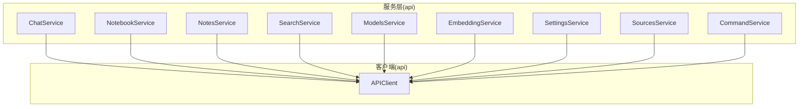
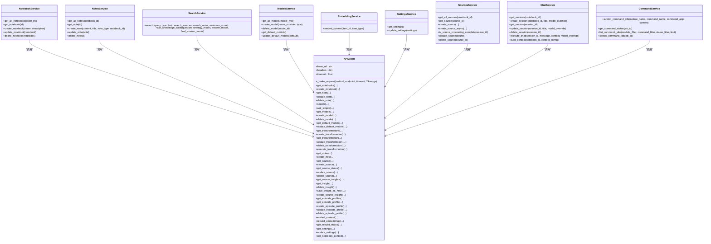
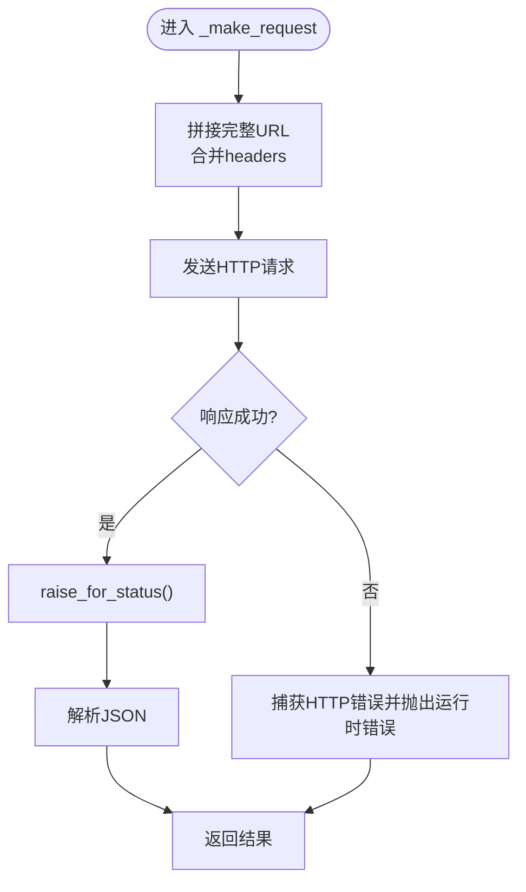
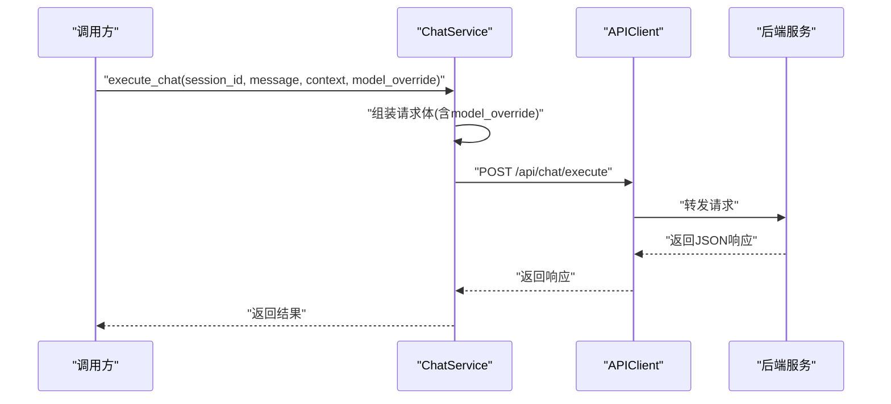
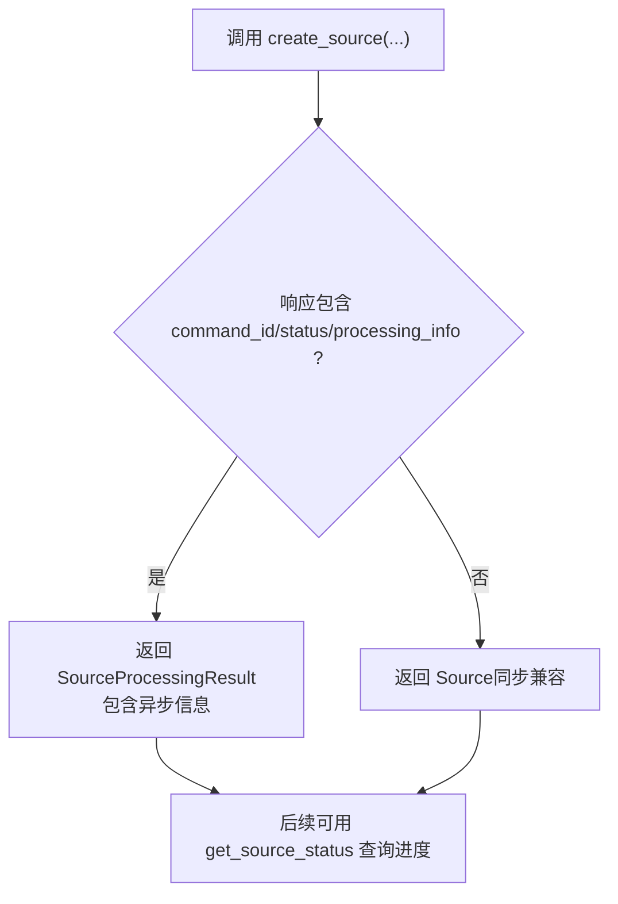

# 服务层设计

<cite>
**本文引用的文件**
- [api/client.py](file://api/client.py)
- [api/chat_service.py](file://api/chat_service.py)
- [api/notebook_service.py](file://api/notebook_service.py)
- [api/notes_service.py](file://api/notes_service.py)
- [api/search_service.py](file://api/search_service.py)
- [api/models_service.py](file://api/models_service.py)
- [api/embedding_service.py](file://api/embedding_service.py)
- [api/settings_service.py](file://api/settings_service.py)
- [api/sources_service.py](file://api/sources_service.py)
- [api/command_service.py](file://api/command_service.py)
- [tests/conftest.py](file://tests/conftest.py)
- [open_notebook/utils/__init__.py](file://open_notebook/utils/__init__.py)
</cite>

## 目录
1. [引言](#引言)
2. [项目结构](#项目结构)
3. [核心组件](#核心组件)
4. [架构总览](#架构总览)
5. [详细组件分析](#详细组件分析)
6. [依赖分析](#依赖分析)
7. [性能考虑](#性能考虑)
8. [故障排查指南](#故障排查指南)
9. [结论](#结论)
10. [附录](#附录)

## 引言
本文件系统化梳理服务层设计，围绕职责分离、依赖注入与业务逻辑封装展开；解释各服务类的设计模式、方法组织与错误处理策略；覆盖服务间协作、命令式异步任务管理（非数据库事务）与并发控制要点；并提供单元测试策略、Mock 使用与集成测试方法，以及性能监控、缓存策略与扩展性设计原则。

## 项目结构
服务层位于 api 包中，采用“服务类 + 全局实例”的轻量依赖注入模式：每个服务类通过全局单例的 APIClient 封装 HTTP 客户端，统一处理认证头、超时与错误转换；部分服务（如 SourcesService）提供增强结果类型以支持异步处理状态。

图表来源
- [api/client.py](file://api/client.py#L13-L529)
- [api/chat_service.py](file://api/chat_service.py#L13-L168)
- [api/notebook_service.py](file://api/notebook_service.py#L13-L87)
- [api/notes_service.py](file://api/notes_service.py#L13-L103)
- [api/search_service.py](file://api/search_service.py#L12-L58)
- [api/models_service.py](file://api/models_service.py#L13-L112)
- [api/embedding_service.py](file://api/embedding_service.py#L12-L27)
- [api/settings_service.py](file://api/settings_service.py#L11-L79)
- [api/sources_service.py](file://api/sources_service.py#L66-L316)
- [api/command_service.py](file://api/command_service.py#L7-L92)

章节来源
- [api/client.py](file://api/client.py#L13-L529)
- [api/chat_service.py](file://api/chat_service.py#L13-L168)
- [api/notebook_service.py](file://api/notebook_service.py#L13-L87)
- [api/notes_service.py](file://api/notes_service.py#L13-L103)
- [api/search_service.py](file://api/search_service.py#L12-L58)
- [api/models_service.py](file://api/models_service.py#L13-L112)
- [api/embedding_service.py](file://api/embedding_service.py#L12-L27)
- [api/settings_service.py](file://api/settings_service.py#L11-L79)
- [api/sources_service.py](file://api/sources_service.py#L66-L316)
- [api/command_service.py](file://api/command_service.py#L7-L92)

## 核心组件
- APIClient：统一的 HTTP 客户端，负责基础 URL、认证头、超时配置与请求封装；提供细粒度的错误转换（连接失败、HTTP 错误、未预期异常），并为长耗时操作（如变换、问答、嵌入重建）设置可配置超时。
- 各领域服务：NotebookService、NotesService、SearchService、ModelsService、EmbeddingService、SettingsService、SourcesService、ChatService、CommandService。它们以“服务类 + 全局实例”形式暴露方法，内部仅调用 APIClient，不直接持有持久化或业务规则实现。
- 增强结果类型：SourcesService 提供 SourceWithMetadata、SourceProcessingResult 等数据承载类，用于在同步/异步处理之间保持接口一致性与信息完整性。
- 工具模块：open_notebook/utils 提供分块、嵌入、加密、令牌统计等工具函数，供上层服务或应用逻辑复用，避免重复实现。

章节来源
- [api/client.py](file://api/client.py#L13-L529)
- [api/sources_service.py](file://api/sources_service.py#L14-L324)
- [open_notebook/utils/__init__.py](file://open_notebook/utils/__init__.py#L1-L70)

## 架构总览
服务层遵循“薄服务层 + 轻量 DI”的设计：服务类只做参数校验、数据映射与调用客户端；客户端负责网络通信、认证与错误转换；工具模块提供通用能力。该模式便于替换底层实现（例如从 HTTP 替换为 gRPC 或本地推理）、进行 Mock 测试与扩展新功能。

图表来源
- [api/client.py](file://api/client.py#L13-L529)
- [api/notebook_service.py](file://api/notebook_service.py#L13-L87)
- [api/notes_service.py](file://api/notes_service.py#L13-L103)
- [api/search_service.py](file://api/search_service.py#L12-L58)
- [api/models_service.py](file://api/models_service.py#L13-L112)
- [api/embedding_service.py](file://api/embedding_service.py#L12-L27)
- [api/settings_service.py](file://api/settings_service.py#L11-L79)
- [api/sources_service.py](file://api/sources_service.py#L66-L316)
- [api/chat_service.py](file://api/chat_service.py#L13-L168)
- [api/command_service.py](file://api/command_service.py#L7-L92)

## 详细组件分析

### APIClient：统一客户端与错误处理
- 职责分离：集中处理基础 URL、认证头、超时、请求封装与错误转换，避免服务类重复实现。
- 依赖注入：通过构造函数注入 base_url；通过环境变量注入 OPEN_NOTEBOOK_PASSWORD；通过 API_CLIENT_TIMEOUT 控制超时。
- 错误处理：区分 RequestError、HTTPStatusError 与未预期异常，统一转换为连接错误或运行时错误，并记录日志。
- 长耗时操作：对变换、问答、嵌入重建等操作设置可配置超时，确保长时间任务不会阻塞。

图表来源
- [api/client.py](file://api/client.py#L48-L78)

章节来源
- [api/client.py](file://api/client.py#L13-L529)

### ChatService：聊天会话与上下文构建
- 方法组织：围绕会话生命周期（查询、创建、读取、更新、删除）与执行聊天、构建上下文展开。
- 错误处理：对每个方法包裹 try/except 并记录错误日志后重新抛出，保证调用方感知异常。
- 超时策略：执行聊天时使用短连接超时与长读取超时，适配本地/远程大模型的交互特性。
- 认证：基于环境变量自动附加 Authorization 头。

图表来源
- [api/chat_service.py](file://api/chat_service.py#L124-L147)
- [api/client.py](file://api/client.py#L137-L154)

章节来源
- [api/chat_service.py](file://api/chat_service.py#L13-L168)

### NotebookService / NotesService / SearchService / ModelsService / EmbeddingService / SettingsService：资源型服务
- 设计模式：面向资源的 CRUD 服务，方法名与参数与 API 对齐，便于替换与扩展。
- 数据映射：将 API 返回的字典列表映射为领域对象（Notebook、Note、Model、ContentSettings 等），隐藏序列化细节。
- 错误处理：统一委托给 APIClient 的 _make_request，异常由客户端转换并抛出。
- 认证：自动附加 Authorization 头。

章节来源
- [api/notebook_service.py](file://api/notebook_service.py#L13-L87)
- [api/notes_service.py](file://api/notes_service.py#L13-L103)
- [api/search_service.py](file://api/search_service.py#L12-L58)
- [api/models_service.py](file://api/models_service.py#L13-L112)
- [api/embedding_service.py](file://api/embedding_service.py#L12-L27)
- [api/settings_service.py](file://api/settings_service.py#L11-L79)

### SourcesService：源管理与异步处理
- 增强结果类型：SourceWithMetadata 暴露常用属性并携带嵌入块数；SourceProcessingResult 承载异步处理状态（command_id、status、processing_info）。
- 创建策略：create_source 支持同步/异步两种路径；create_source_async 强制异步并返回增强结果。
- 状态检查：is_source_processing_complete 基于状态判断是否完成（兼容 None 表示旧版/同步源）。
- 更新与删除：严格校验 ID，调用客户端对应端点。

图表来源
- [api/sources_service.py](file://api/sources_service.py#L128-L217)
- [api/sources_service.py](file://api/sources_service.py#L224-L265)

章节来源
- [api/sources_service.py](file://api/sources_service.py#L66-L316)

### CommandService：命令式异步任务管理
- 职责：封装 surreal-commands 的提交与状态查询，屏蔽底层注册与取消机制差异。
- 方法组织：submit_command_job、get_command_status、list_command_jobs、cancel_command_job。
- 错误处理：捕获异常并记录日志，向上抛出，便于上层重试或降级。

章节来源
- [api/command_service.py](file://api/command_service.py#L7-L92)

## 依赖分析
- 低耦合高内聚：服务类仅依赖全局 APIClient，彼此无直接依赖，便于独立演进与测试。
- 可替换性：APIClient 可替换为其他传输层（如 gRPC、本地推理），不影响服务类。
- 工具模块：open_notebook/utils 提供纯函数与常量，避免循环导入与重复实现。
- 环境变量：统一通过环境变量控制认证与超时，便于部署期配置。

图表来源
- [open_notebook/utils/__init__.py](file://open_notebook/utils/__init__.py#L1-L70)
- [api/client.py](file://api/client.py#L13-L529)

章节来源
- [open_notebook/utils/__init__.py](file://open_notebook/utils/__init__.py#L1-L70)
- [api/client.py](file://api/client.py#L13-L529)

## 性能考虑
- 超时配置：APIClient 支持通过环境变量调整默认超时；长耗时操作（变换、问答、嵌入重建）使用更高超时值，避免早期中断。
- 连接与读取超时：ChatService 在执行聊天时使用短连接与长读取超时，适配本地/远程大模型的交互特性。
- 批量重建：嵌入重建支持双倍超时策略，结合环境变量可进一步放宽限制。
- 日志与可观测性：所有异常均记录日志，便于定位性能瓶颈与错误根因。

章节来源
- [api/client.py](file://api/client.py#L16-L46)
- [api/client.py](file://api/client.py#L310-L326)
- [api/chat_service.py](file://api/chat_service.py#L137-L143)

## 故障排查指南
- 连接失败：确认 API_BASE_URL 与 OPEN_NOTEBOOK_PASSWORD 设置正确；检查网络连通性与防火墙。
- HTTP 错误：查看 APIClient 的错误日志，定位具体端点与状态码；核对请求体与认证头。
- 超时问题：适当提高 API_CLIENT_TIMEOUT；对于长耗时任务（如嵌入重建）建议使用更高超时。
- 异步处理：SourcesService 的异步流程需通过 get_source_status 轮询状态；CommandService 的命令状态查询需确保 surreal-commands 注册可用。
- 单元测试：tests/conftest.py 确保测试环境禁用密码认证并加载 .env；可在服务层使用 Mock 替换 APIClient，隔离网络依赖。

章节来源
- [api/client.py](file://api/client.py#L60-L77)
- [api/sources_service.py](file://api/sources_service.py#L219-L284)
- [api/command_service.py](file://api/command_service.py#L46-L68)
- [tests/conftest.py](file://tests/conftest.py#L12-L27)

## 结论
服务层通过“服务类 + 全局 APIClient”的轻量 DI 模式实现了清晰的职责分离与良好的可替换性；统一的错误处理与超时策略提升了稳定性；增强结果类型与命令式异步管理满足了复杂业务场景的需求。配合完善的测试策略与可观测性，服务层具备良好的扩展性与维护性。

## 附录

### 单元测试策略与 Mock 使用
- 禁用认证：tests/conftest.py 在导入任何依赖前设置 OPEN_NOTEBOOK_PASSWORD 为空字符串，确保测试不受认证中间件影响。
- Mock 客户端：在测试中可替换全局 api_client 或在服务类构造时注入自定义 APIClient 实例，模拟不同响应与异常。
- 参数化测试：针对不同输入组合（空标题、无效 ID、最小分数阈值等）编写用例，覆盖边界条件。
- 并发与重试：对异步任务（SourcesService、CommandService）编写轮询与重试逻辑的测试，验证状态一致性。

章节来源
- [tests/conftest.py](file://tests/conftest.py#L12-L27)
- [api/client.py](file://api/client.py#L13-L529)
- [api/sources_service.py](file://api/sources_service.py#L224-L284)
- [api/command_service.py](file://api/command_service.py#L46-L92)

### 集成测试方法
- 端到端流水线：从 SourcesService 的 create_source_async 到 get_source_status，再到 ChatService 的 execute_chat，形成完整链路测试。
- 环境准备：使用 tests/conftest.py 加载 .env，确保测试环境变量一致。
- 超时与重试：在集成测试中验证超时配置与重试策略的有效性，避免长耗时操作导致测试不稳定。

章节来源
- [api/sources_service.py](file://api/sources_service.py#L128-L265)
- [api/chat_service.py](file://api/chat_service.py#L124-L147)
- [tests/conftest.py](file://tests/conftest.py#L17-L27)

### 缓存策略与扩展性设计原则
- 缓存策略：对高频查询（如搜索、模型列表、笔记列表）可引入进程内缓存或外部缓存（Redis/Memcached），设置 TTL 与失效策略；注意缓存与真实数据的一致性。
- 扩展性设计：新增服务类遵循现有命名与参数风格；通过工具模块复用通用能力；对外暴露清晰的异常与日志，便于监控与排障。

章节来源
- [open_notebook/utils/__init__.py](file://open_notebook/utils/__init__.py#L1-L70)