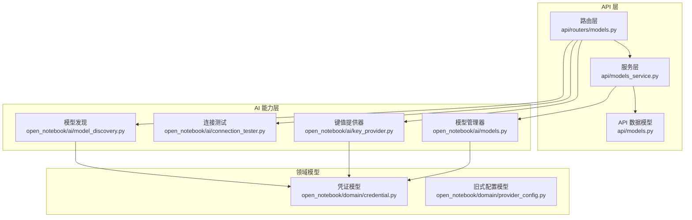
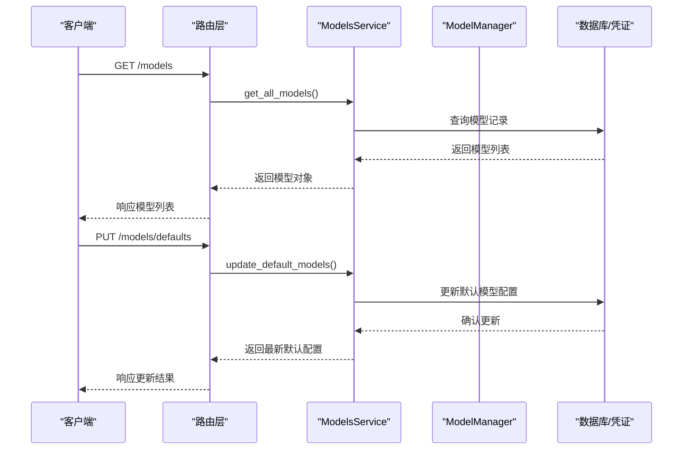
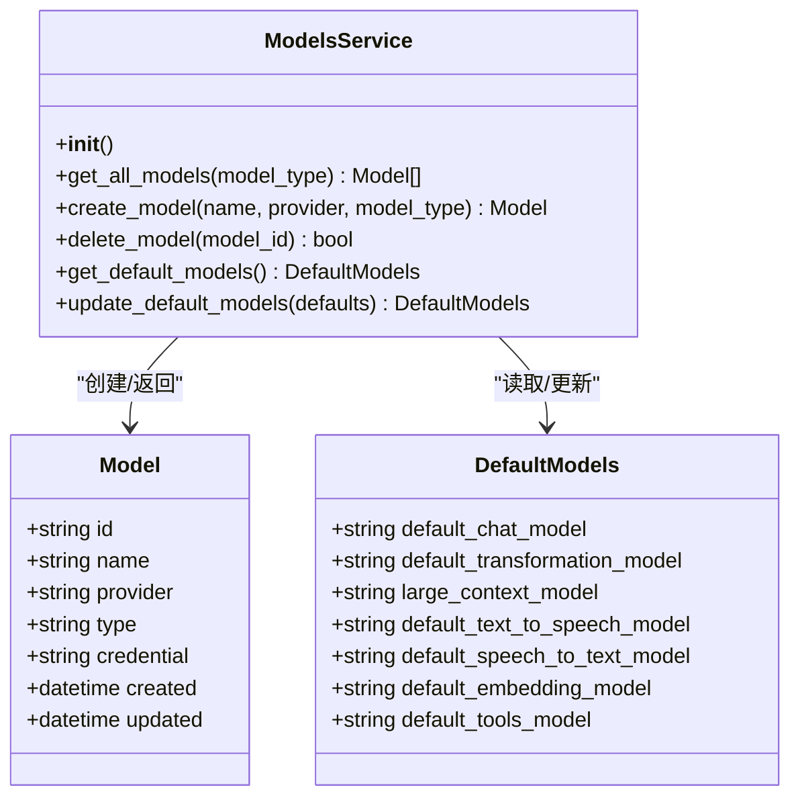
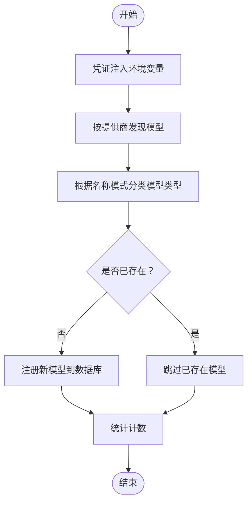
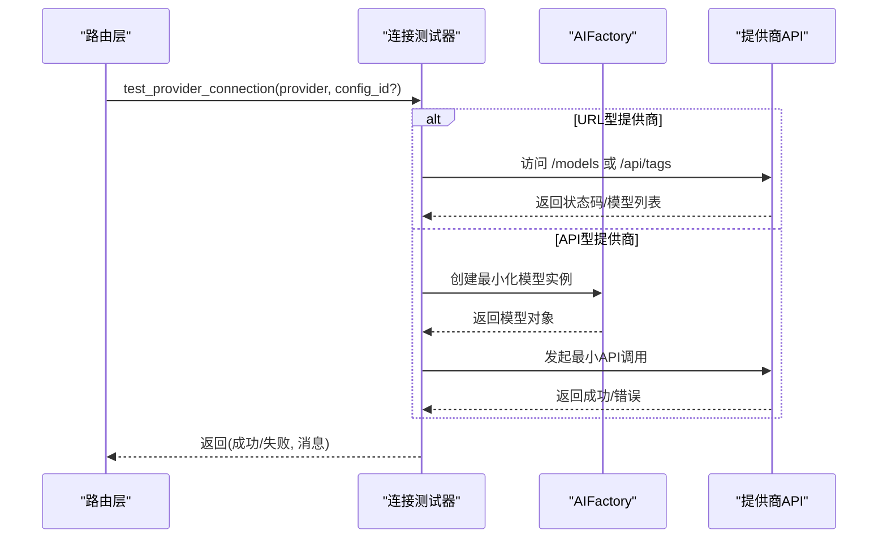
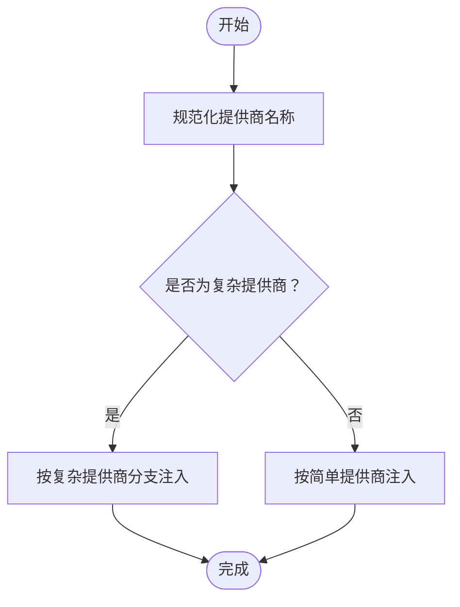
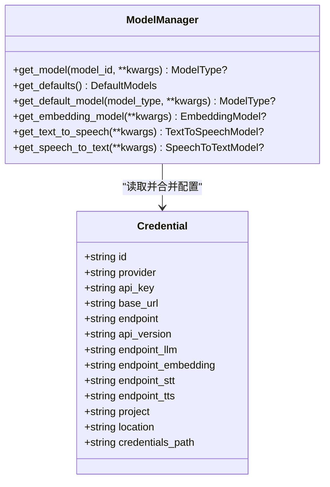
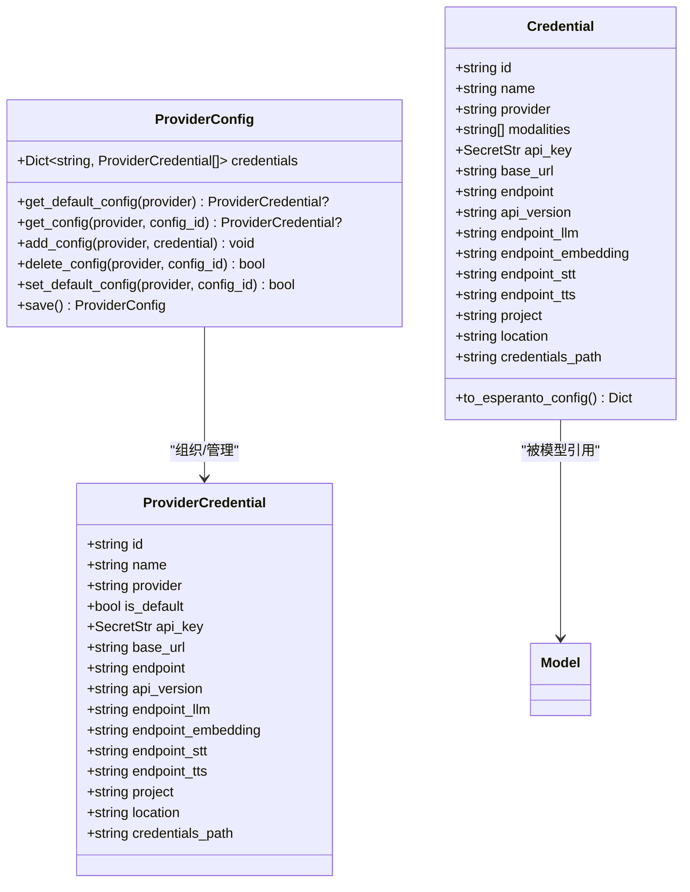
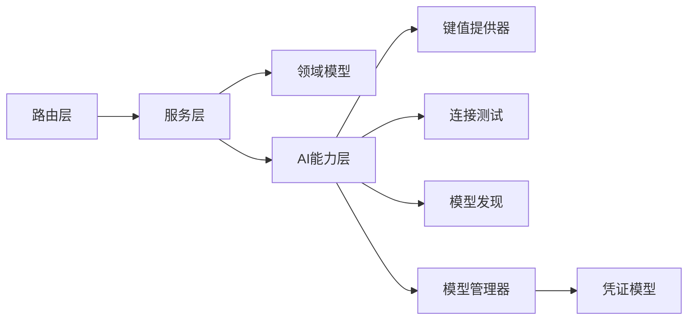

# 模型服务

<cite>
**本文档引用的文件**
- [api/models_service.py](file://api/models_service.py)
- [open_notebook/ai/model_discovery.py](file://open_notebook/ai/model_discovery.py)
- [open_notebook/ai/connection_tester.py](file://open_notebook/ai/connection_tester.py)
- [open_notebook/ai/key_provider.py](file://open_notebook/ai/key_provider.py)
- [open_notebook/ai/models.py](file://open_notebook/ai/models.py)
- [open_notebook/domain/credential.py](file://open_notebook/domain/credential.py)
- [open_notebook/domain/provider_config.py](file://open_notebook/domain/provider_config.py)
- [api/routers/models.py](file://api/routers/models.py)
- [api/models.py](file://api/models.py)
</cite>

## 目录
1. [简介](#简介)
2. [项目结构](#项目结构)
3. [核心组件](#核心组件)
4. [架构总览](#架构总览)
5. [详细组件分析](#详细组件分析)
6. [依赖关系分析](#依赖关系分析)
7. [性能考虑](#性能考虑)
8. [故障排查指南](#故障排查指南)
9. [结论](#结论)
10. [附录](#附录)

## 简介
本文件系统性阐述模型服务（ModelsService）的AI模型管理机制，包括模型发现与配置管理、支持的AI提供商、模型选择逻辑与动态配置更新、连接测试、性能监控与故障恢复策略，并提供最佳实践、版本管理与迁移指导。目标是帮助开发者与运维人员快速理解并高效使用模型服务。

## 项目结构
模型服务位于后端API层与AI能力层之间，通过统一的服务接口对外提供模型查询、默认模型配置、模型发现与同步等能力；同时与凭证管理、连接测试、键值提供器等模块协作，实现从数据库到环境变量的配置回退机制。

图表来源
- [api/routers/models.py](file://api/routers/models.py#L1-L771)
- [api/models_service.py](file://api/models_service.py#L1-L113)
- [open_notebook/ai/model_discovery.py](file://open_notebook/ai/model_discovery.py#L1-L757)
- [open_notebook/ai/connection_tester.py](file://open_notebook/ai/connection_tester.py#L1-L439)
- [open_notebook/ai/key_provider.py](file://open_notebook/ai/key_provider.py#L1-L298)
- [open_notebook/ai/models.py](file://open_notebook/ai/models.py#L1-L267)
- [open_notebook/domain/credential.py](file://open_notebook/domain/credential.py#L1-L200)
- [open_notebook/domain/provider_config.py](file://open_notebook/domain/provider_config.py#L1-L445)

章节来源
- [api/routers/models.py](file://api/routers/models.py#L1-L771)
- [api/models_service.py](file://api/models_service.py#L1-L113)

## 核心组件
- ModelsService：面向API的服务层，封装模型查询、创建、删除与默认模型配置读写。
- ModelManager：模型实例化与默认模型选择的核心，负责从凭证或环境变量构建配置并创建具体模型实例。
- ProviderConfig/ProviderCredential：凭证域模型，支持多配置、加密存储与默认配置切换。
- ModelDiscovery：自动发现各提供商可用模型并注册到数据库。
- ConnectionTester：提供连接测试与单模型端到端测试，用于验证配置有效性。
- KeyProvider：数据库优先的键值提供器，为模型创建前注入环境变量或直接返回配置字典。

章节来源
- [api/models_service.py](file://api/models_service.py#L13-L113)
- [open_notebook/ai/models.py](file://open_notebook/ai/models.py#L97-L267)
- [open_notebook/domain/credential.py](file://open_notebook/domain/credential.py#L29-L200)
- [open_notebook/domain/provider_config.py](file://open_notebook/domain/provider_config.py#L175-L445)
- [open_notebook/ai/model_discovery.py](file://open_notebook/ai/model_discovery.py#L1-L757)
- [open_notebook/ai/connection_tester.py](file://open_notebook/ai/connection_tester.py#L1-L439)
- [open_notebook/ai/key_provider.py](file://open_notebook/ai/key_provider.py#L236-L298)

## 架构总览
模型服务采用“API路由层-服务层-AI能力层-领域模型”的分层架构：
- 路由层处理HTTP请求，调用服务层或AI能力层。
- 服务层封装业务操作，如模型查询、默认模型配置读写。
- AI能力层提供模型发现、连接测试、键值提供与模型管理。
- 领域模型承载凭证与配置数据，支持加密存储与多配置管理。

图表来源
- [api/routers/models.py](file://api/routers/models.py#L165-L358)
- [api/models_service.py](file://api/models_service.py#L19-L108)
- [open_notebook/ai/models.py](file://open_notebook/ai/models.py#L97-L267)

## 详细组件分析

### ModelsService 类
ModelsService是面向API的服务层，负责：
- 获取所有模型并按类型过滤
- 创建新模型
- 删除模型
- 读取默认模型配置
- 更新默认模型配置

实现要点：
- 使用API客户端进行远程调用，返回数据转换为领域模型对象。
- 默认模型配置通过键值映射更新，确保字段一致性。

图表来源
- [api/models_service.py](file://api/models_service.py#L13-L113)
- [open_notebook/ai/models.py](file://open_notebook/ai/models.py#L18-L71)

章节来源
- [api/models_service.py](file://api/models_service.py#L13-L113)

### 模型发现与同步（ModelDiscovery）
ModelDiscovery提供以下能力：
- 按提供商自动发现可用模型（OpenAI、Anthropic、Google、Groq、Mistral、DeepSeek、xAI、OpenRouter、Voyage、ElevenLabs、Ollama、OpenAI-Compatible等）。
- 将发现的模型分类（语言模型、嵌入、语音转文本、文本转语音）。
- 同步到数据库，避免重复注册。
- 并发同步所有提供商。

图表来源
- [open_notebook/ai/model_discovery.py](file://open_notebook/ai/model_discovery.py#L135-L166)
- [open_notebook/ai/model_discovery.py](file://open_notebook/ai/model_discovery.py#L632-L696)

章节来源
- [open_notebook/ai/model_discovery.py](file://open_notebook/ai/model_discovery.py#L1-L757)

### 连接测试（ConnectionTester）
连接测试分为两层：
- Provider连接测试：验证提供商API密钥与端点连通性，针对不同提供商采用差异化策略（如Ollama、OpenAI-Compatible、Azure）。
- 单模型测试：加载模型及其凭证，执行最小化的端到端调用以验证配置正确性。

图表来源
- [open_notebook/ai/connection_tester.py](file://open_notebook/ai/connection_tester.py#L170-L300)
- [open_notebook/ai/connection_tester.py](file://open_notebook/ai/connection_tester.py#L367-L439)

章节来源
- [open_notebook/ai/connection_tester.py](file://open_notebook/ai/connection_tester.py#L1-L439)

### 键值提供器（KeyProvider）
KeyProvider实现“数据库优先、环境变量回退”的配置注入策略：
- 对简单提供商（如OpenAI、Anthropic等）设置API密钥与基础URL。
- 对复杂提供商（Azure、Vertex、OpenAI-Compatible）分别设置专用环境变量。
- 提供按提供商注入与一次性批量注入的能力。

图表来源
- [open_notebook/ai/key_provider.py](file://open_notebook/ai/key_provider.py#L236-L298)

章节来源
- [open_notebook/ai/key_provider.py](file://open_notebook/ai/key_provider.py#L1-L298)

### 模型管理器（ModelManager）
ModelManager负责：
- 根据模型ID获取模型实例，自动合并凭证配置与运行时参数。
- 支持默认模型选择（聊天、变换、工具、大上下文、嵌入、语音合成、语音识别）。
- 通过AIFactory创建具体模型实例，内部缓存实例以提升性能。

图表来源
- [open_notebook/ai/models.py](file://open_notebook/ai/models.py#L97-L267)
- [open_notebook/domain/credential.py](file://open_notebook/domain/credential.py#L29-L98)

章节来源
- [open_notebook/ai/models.py](file://open_notebook/ai/models.py#L1-L267)
- [open_notebook/domain/credential.py](file://open_notebook/domain/credential.py#L1-L200)

### 凭证与配置管理
- ProviderCredential：单个提供商的完整配置项，支持多配置并可设为默认。
- ProviderConfig：旧式配置（已迁移至独立凭证记录），支持默认配置、添加/删除/设置默认配置、保存与加密。
- Credential：新的凭证记录，每个记录独立存储，支持加密存储与解密读取。

图表来源
- [open_notebook/domain/provider_config.py](file://open_notebook/domain/provider_config.py#L22-L445)
- [open_notebook/domain/credential.py](file://open_notebook/domain/credential.py#L29-L200)

章节来源
- [open_notebook/domain/provider_config.py](file://open_notebook/domain/provider_config.py#L1-L445)
- [open_notebook/domain/credential.py](file://open_notebook/domain/credential.py#L1-L200)

## 依赖关系分析
- 路由层依赖服务层与AI能力层，提供REST接口。
- 服务层依赖领域模型与AI模型层，负责业务编排。
- AI模型层依赖凭证与键值提供器，实现配置注入与模型实例化。
- 凭证与配置层提供加密存储与多配置管理，支撑高可用与安全。

图表来源
- [api/routers/models.py](file://api/routers/models.py#L1-L771)
- [api/models_service.py](file://api/models_service.py#L1-L113)
- [open_notebook/ai/key_provider.py](file://open_notebook/ai/key_provider.py#L1-L298)
- [open_notebook/ai/connection_tester.py](file://open_notebook/ai/connection_tester.py#L1-L439)
- [open_notebook/ai/model_discovery.py](file://open_notebook/ai/model_discovery.py#L1-L757)
- [open_notebook/ai/models.py](file://open_notebook/ai/models.py#L1-L267)
- [open_notebook/domain/credential.py](file://open_notebook/domain/credential.py#L1-L200)

章节来源
- [api/routers/models.py](file://api/routers/models.py#L1-L771)
- [api/models_service.py](file://api/models_service.py#L1-L113)

## 性能考虑
- 实例缓存：ModelManager通过AIFactory缓存模型实例，减少重复创建开销。
- 批量查询：模型发现时先批量查询现有模型，避免N+1查询。
- 并发同步：支持并发同步多个提供商，缩短初始化时间。
- 最小化测试：连接测试使用最小化调用与静态测试模型，降低资源消耗。

[本节为通用性能建议，不直接分析具体文件]

## 故障排查指南
常见问题与定位方法：
- API密钥无效：检查凭证是否正确保存、是否启用加密、是否注入到环境变量。
- 连接超时/网络错误：确认端点可达、代理设置、防火墙规则。
- 模型未找到：确认模型名称拼写、提供商是否支持该模型类型。
- 默认模型缺失：检查默认模型配置是否设置，或使用自动分配功能。

章节来源
- [open_notebook/ai/connection_tester.py](file://open_notebook/ai/connection_tester.py#L275-L299)
- [open_notebook/ai/models.py](file://open_notebook/ai/models.py#L220-L264)

## 结论
模型服务通过清晰的分层设计与完善的配置回退机制，实现了对多提供商模型的统一管理与高效使用。结合模型发现、连接测试与凭证管理，能够显著提升部署与运维效率，并为后续扩展与迁移提供坚实基础。

[本节为总结性内容，不直接分析具体文件]

## 附录

### 支持的AI提供商与模型类型
- OpenAI、Anthropic、Google、Groq、Mistral、DeepSeek、xAI、OpenRouter、Voyage、ElevenLabs、Ollama、OpenAI-Compatible、Azure、Vertex。
- 模型类型：语言模型、嵌入模型、语音转文本、文本转语音。

章节来源
- [open_notebook/ai/model_discovery.py](file://open_notebook/ai/model_discovery.py#L36-L133)
- [open_notebook/ai/connection_tester.py](file://open_notebook/ai/connection_tester.py#L21-L37)

### 模型选择逻辑与动态配置更新
- 默认模型选择：按类型映射到默认槽位，若未配置则提示用户在设置中配置。
- 动态配置更新：通过路由层更新默认模型配置，立即生效。
- 自动分配：基于提供商优先级与偏好模型，自动为未配置的默认槽位分配可用模型。

章节来源
- [open_notebook/ai/models.py](file://open_notebook/ai/models.py#L220-L264)
- [api/routers/models.py](file://api/routers/models.py#L678-L771)

### 模型连接测试与故障恢复策略
- Provider连接测试：针对URL型与API型提供商分别测试，返回明确错误信息。
- 单模型测试：加载模型与其凭证，执行最小化调用，验证配置正确性。
- 故障恢复：当默认模型不可用时，记录日志并提示用户重新配置。

章节来源
- [open_notebook/ai/connection_tester.py](file://open_notebook/ai/connection_tester.py#L170-L300)
- [open_notebook/ai/connection_tester.py](file://open_notebook/ai/connection_tester.py#L367-L439)

### 模型配置最佳实践
- 使用凭证记录管理API密钥，启用加密存储。
- 优先使用数据库配置，必要时再回退到环境变量。
- 定期同步模型列表，保持与提供商可用模型一致。
- 为关键场景配置默认模型，避免运行时找不到模型。

章节来源
- [open_notebook/domain/credential.py](file://open_notebook/domain/credential.py#L67-L98)
- [open_notebook/ai/key_provider.py](file://open_notebook/ai/key_provider.py#L236-L298)
- [api/routers/models.py](file://api/routers/models.py#L512-L574)

### 版本管理与迁移指导
- 凭证模型演进：从ProviderConfig迁移到独立凭证记录，支持多配置与加密存储。
- 迁移流程：校验加密密钥、读取旧配置、转换为新凭证记录并保存。
- 建议：在迁移前备份数据库，迁移后验证凭证与默认模型配置。

章节来源
- [open_notebook/domain/provider_config.py](file://open_notebook/domain/provider_config.py#L175-L445)
- [open_notebook/domain/credential.py](file://open_notebook/domain/credential.py#L158-L189)
- [api/credentials_service.py](file://api/credentials_service.py#L686-L696)