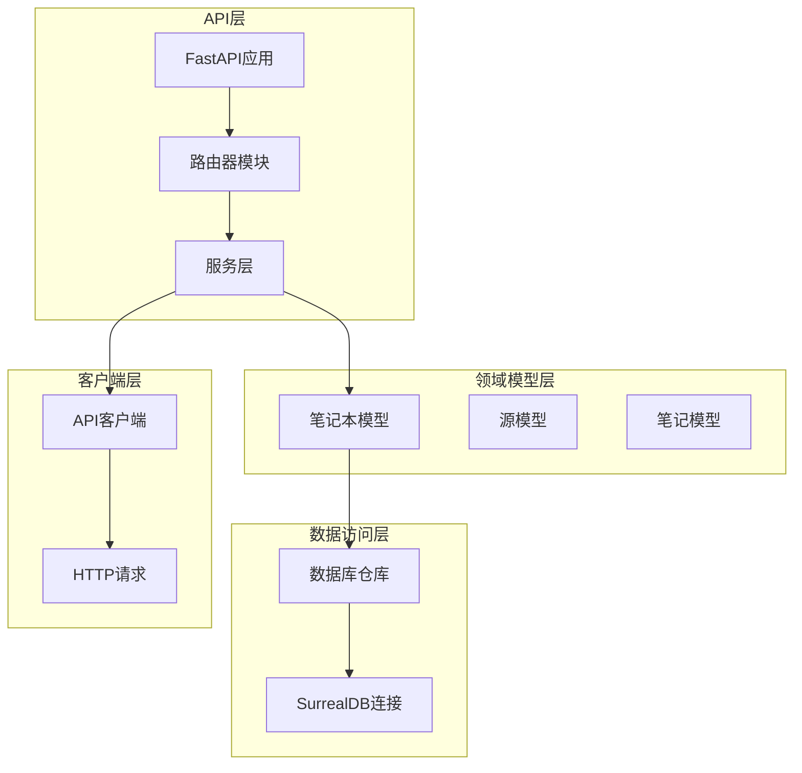
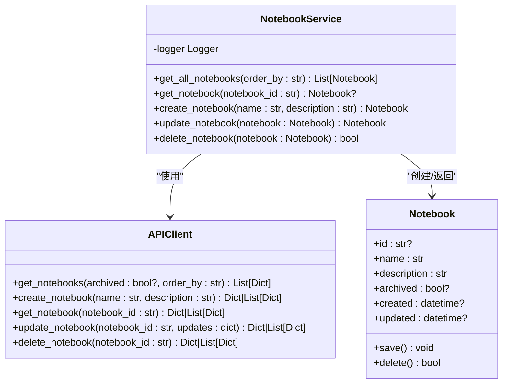
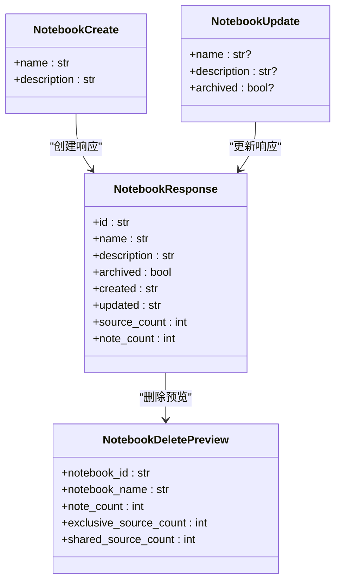
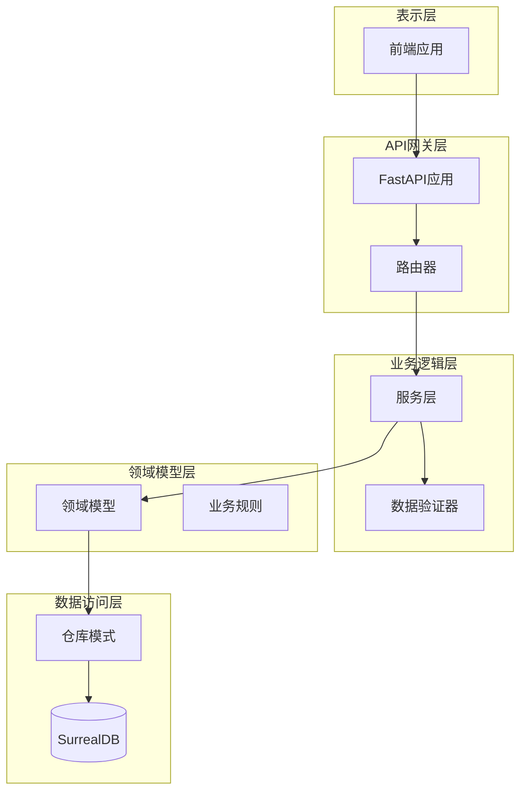
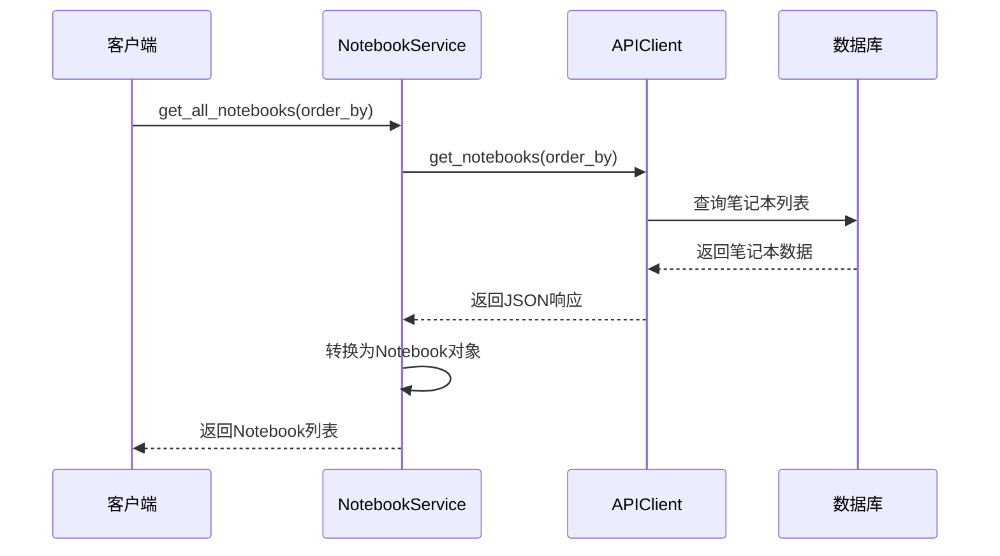
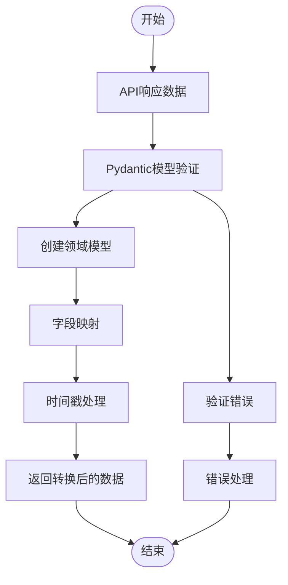
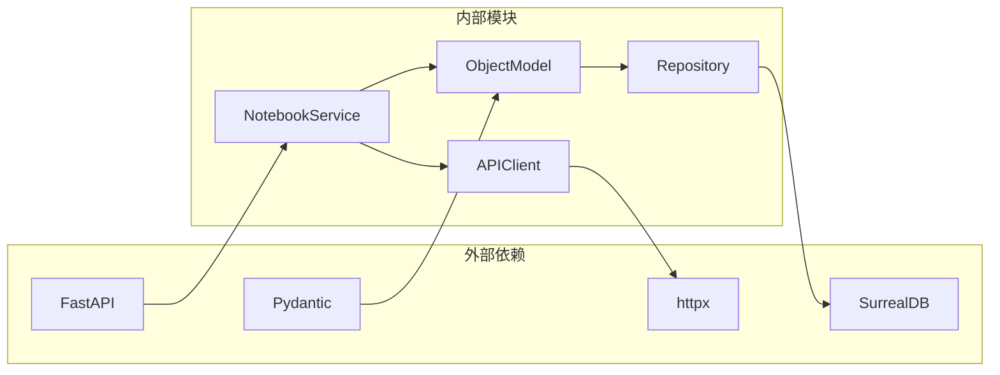
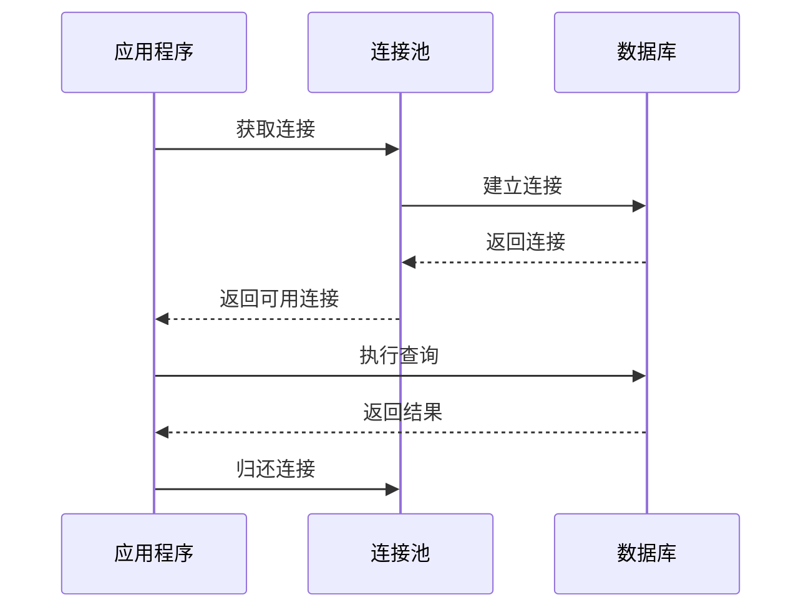

# 笔记本服务

<cite>
**本文档引用的文件**
- [api/notebook_service.py](file://api/notebook_service.py)
- [api/routers/notebooks.py](file://api/routers/notebooks.py)
- [open_notebook/domain/notebook.py](file://open_notebook/domain/notebook.py)
- [api/models.py](file://api/models.py)
- [api/client.py](file://api/client.py)
- [open_notebook/database/repository.py](file://open_notebook/database/repository.py)
- [open_notebook/domain/base.py](file://open_notebook/domain/base.py)
- [api/main.py](file://api/main.py)
</cite>

## 目录
1. [简介](#简介)
2. [项目结构](#项目结构)
3. [核心组件](#核心组件)
4. [架构概览](#架构概览)
5. [详细组件分析](#详细组件分析)
6. [依赖关系分析](#依赖关系分析)
7. [性能考虑](#性能考虑)
8. [故障排除指南](#故障排除指南)
9. [结论](#结论)

## 简介

笔记本服务是Open Notebook系统中的核心组件，负责管理用户的研究笔记本。该服务提供了完整的CRUD操作，支持笔记本的创建、查询、更新和删除，并集成了数据验证、错误处理和异步处理机制。系统采用分层架构设计，通过API客户端与后端数据库进行交互，同时提供RESTful API接口供前端应用调用。

## 项目结构

Open Notebook项目采用模块化设计，主要分为以下几个层次：

**图表来源**
- [api/main.py](file://api/main.py#L99-L190)
- [api/routers/notebooks.py](file://api/routers/notebooks.py#L1-L328)
- [api/notebook_service.py](file://api/notebook_service.py#L13-L88)

**章节来源**
- [api/main.py](file://api/main.py#L99-L190)
- [api/routers/notebooks.py](file://api/routers/notebooks.py#L1-L328)

## 核心组件

### NotebookService类

NotebookService是笔记本服务的核心类，实现了所有CRUD操作的业务逻辑。该类采用服务层模式，负责协调API客户端和领域模型之间的交互。

**图表来源**
- [api/notebook_service.py](file://api/notebook_service.py#L13-L88)
- [api/client.py](file://api/client.py#L13-L530)
- [open_notebook/domain/notebook.py](file://open_notebook/domain/notebook.py#L16-L231)

### 数据模型

系统使用Pydantic模型进行数据验证和序列化：

**图表来源**
- [api/models.py](file://api/models.py#L7-L29)
- [api/models.py](file://api/models.py#L12-L18)
- [api/models.py](file://api/models.py#L20-L29)
- [api/models.py](file://api/models.py#L666-L676)

**章节来源**
- [api/notebook_service.py](file://api/notebook_service.py#L13-L88)
- [api/models.py](file://api/models.py#L7-L685)

## 架构概览

Open Notebook采用分层架构，每层都有明确的职责分工：

**图表来源**
- [api/main.py](file://api/main.py#L99-L190)
- [api/routers/notebooks.py](file://api/routers/notebooks.py#L1-L328)
- [open_notebook/domain/base.py](file://open_notebook/domain/base.py#L31-L329)

## 详细组件分析

### CRUD操作实现

#### get_all_notebooks方法

该方法负责获取所有笔记本，支持按字段排序和可选的归档状态过滤。

**图表来源**
- [api/notebook_service.py](file://api/notebook_service.py#L19-L34)
- [api/client.py](file://api/client.py#L80-L89)

**章节来源**
- [api/notebook_service.py](file://api/notebook_service.py#L19-L34)
- [api/client.py](file://api/client.py#L80-L89)

#### get_notebook方法

获取单个笔记本的详细信息，包含源计数和笔记计数。

**章节来源**
- [api/notebook_service.py](file://api/notebook_service.py#L36-L48)
- [api/routers/notebooks.py](file://api/routers/notebooks.py#L120-L153)

#### create_notebook方法

创建新的笔记本，支持名称和描述参数。

**章节来源**
- [api/notebook_service.py](file://api/notebook_service.py#L50-L62)
- [api/routers/notebooks.py](file://api/routers/notebooks.py#L62-L88)

#### update_notebook方法

更新现有笔记本的信息，支持部分字段更新。

**章节来源**
- [api/notebook_service.py](file://api/notebook_service.py#L64-L78)
- [api/routers/notebooks.py](file://api/routers/notebooks.py#L156-L215)

#### delete_notebook方法

删除笔记本及其关联数据，支持级联删除选项。

**章节来源**
- [api/notebook_service.py](file://api/notebook_service.py#L80-L83)
- [api/routers/notebooks.py](file://api/routers/notebooks.py#L293-L327)

### 数据转换逻辑

系统在不同层之间进行数据转换，确保类型安全和数据完整性：

**图表来源**
- [api/notebook_service.py](file://api/notebook_service.py#L20-L34)
- [open_notebook/domain/base.py](file://open_notebook/domain/base.py#L121-L160)

### 错误处理策略

系统采用多层错误处理机制：

1. **HTTP异常处理**：FastAPI路由器捕获数据库操作异常
2. **业务逻辑异常**：服务层处理输入验证和业务规则
3. **数据库异常**：仓库层处理SurrealDB连接和事务冲突
4. **网络异常**：API客户端处理HTTP请求和连接问题

**章节来源**
- [api/routers/notebooks.py](file://api/routers/notebooks.py#L55-L59)
- [open_notebook/domain/base.py](file://open_notebook/domain/base.py#L152-L160)

## 依赖关系分析

### 组件耦合度

**图表来源**
- [api/notebook_service.py](file://api/notebook_service.py#L5-L10)
- [api/client.py](file://api/client.py#L6-L11)
- [open_notebook/domain/base.py](file://open_notebook/domain/base.py#L13-L21)

### 关键依赖关系

1. **NotebookService**依赖**APIClient**进行API调用
2. **ObjectModel**提供通用的数据持久化功能
3. **Repository**封装数据库操作
4. **FastAPI路由器**提供RESTful接口

**章节来源**
- [api/notebook_service.py](file://api/notebook_service.py#L13-L88)
- [open_notebook/domain/base.py](file://open_notebook/domain/base.py#L31-L329)
- [open_notebook/database/repository.py](file://open_notebook/database/repository.py#L65-L195)

## 性能考虑

### 异步处理

系统广泛使用异步编程模式以提高性能：

1. **数据库操作**：所有数据库查询都是异步执行
2. **API调用**：HTTP请求使用异步客户端
3. **文件处理**：大文件上传和处理采用异步模式

### 连接池管理

**图表来源**
- [open_notebook/database/repository.py](file://open_notebook/database/repository.py#L47-L63)

### 缓存策略

系统采用以下缓存策略：
- **连接缓存**：复用数据库连接减少建立开销
- **查询结果缓存**：对频繁访问的数据进行缓存
- **配置缓存**：避免重复的环境变量读取

## 故障排除指南

### 常见问题及解决方案

#### 数据库连接问题

**症状**：无法连接到SurrealDB数据库
**原因**：
- 环境变量配置错误
- 数据库服务未启动
- 网络连接问题

**解决方案**：
1. 检查SURREAL_URL环境变量
2. 验证数据库凭据
3. 确认网络连通性

#### API调用失败

**症状**：HTTP请求超时或连接错误
**原因**：
- API客户端超时设置过短
- 网络不稳定
- 服务器负载过高

**解决方案**：
1. 调整API_CLIENT_TIMEOUT环境变量
2. 检查网络连接质量
3. 实施重试机制

#### 数据验证错误

**症状**：创建或更新笔记本时出现验证错误
**原因**：
- 输入数据格式不正确
- 必填字段缺失
- 数据类型不匹配

**解决方案**：
1. 使用Pydantic模型进行数据验证
2. 提供清晰的错误消息
3. 实施数据清理和转换

**章节来源**
- [api/client.py](file://api/client.py#L16-L47)
- [open_notebook/domain/base.py](file://open_notebook/domain/base.py#L152-L160)

## 结论

笔记本服务展现了现代Python Web应用的最佳实践，采用了分层架构、异步编程和强类型验证等技术。该服务提供了完整的企业级功能，包括：

1. **完整的CRUD操作**：支持笔记本的全生命周期管理
2. **强类型验证**：使用Pydantic确保数据完整性
3. **异步处理**：提高系统性能和响应速度
4. **错误处理**：多层异常处理确保系统稳定性
5. **扩展性设计**：模块化架构便于功能扩展

通过合理的设计模式和最佳实践，该服务为用户提供了一个可靠、高性能的笔记本管理解决方案。建议在生产环境中配合适当的监控和日志记录机制，以确保系统的稳定运行。