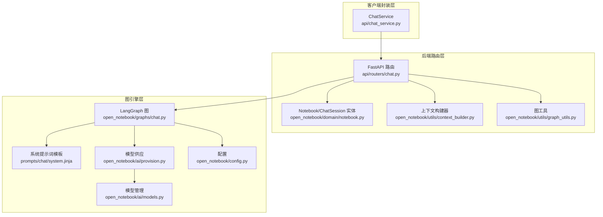
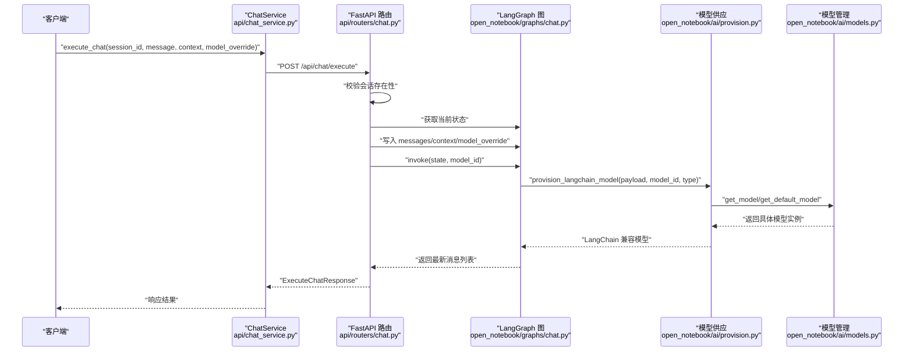
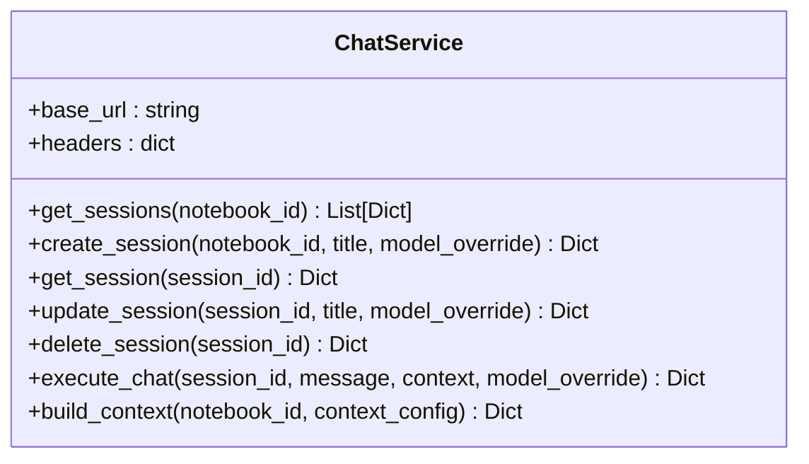
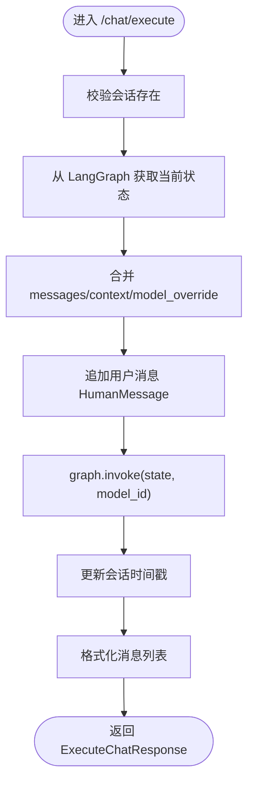
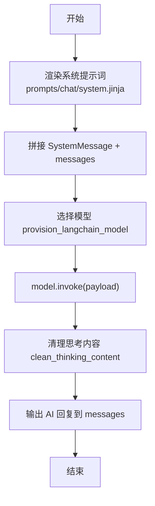
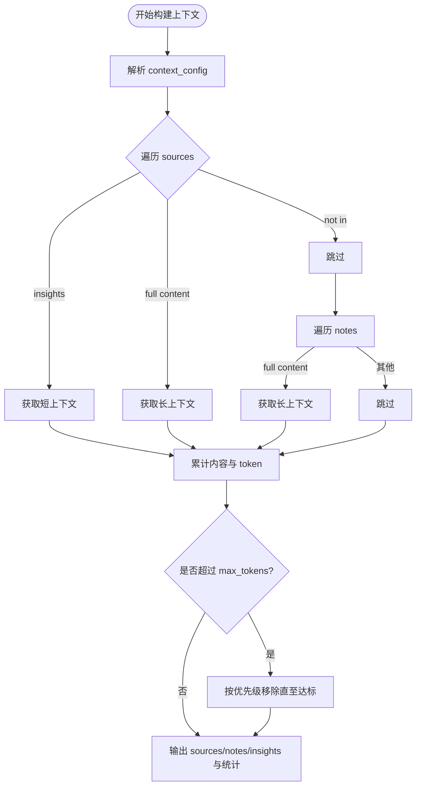
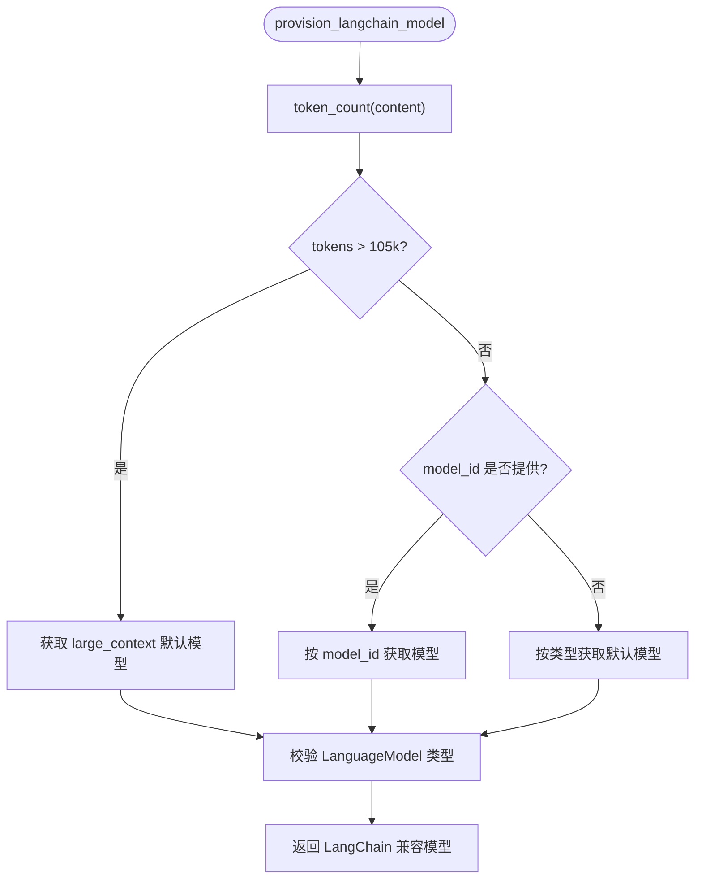
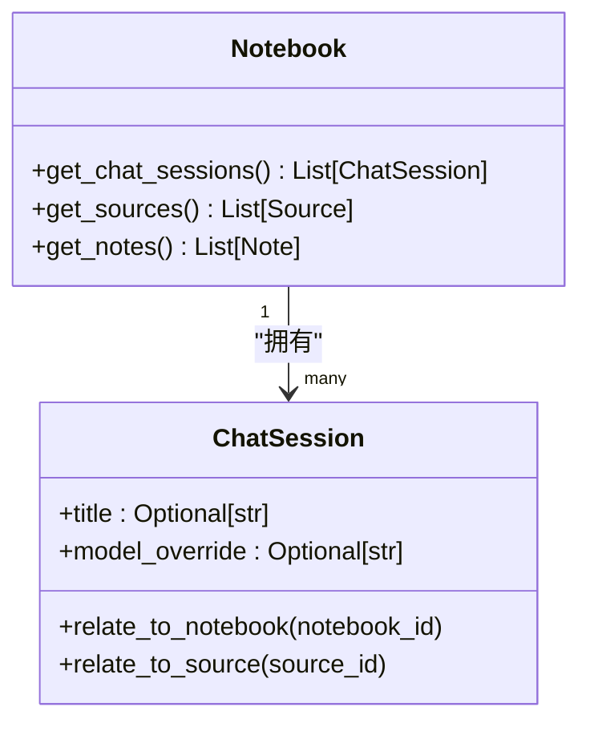
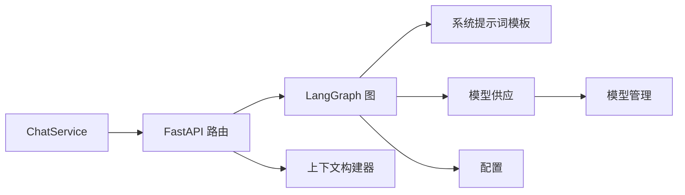

# 聊天服务

<cite>
**本文引用的文件**
- [api/chat_service.py](file://api/chat_service.py)
- [api/routers/chat.py](file://api/routers/chat.py)
- [open_notebook/graphs/chat.py](file://open_notebook/graphs/chat.py)
- [open_notebook/utils/context_builder.py](file://open_notebook/utils/context_builder.py)
- [open_notebook/domain/notebook.py](file://open_notebook/domain/notebook.py)
- [open_notebook/ai/provision.py](file://open_notebook/ai/provision.py)
- [open_notebook/ai/models.py](file://open_notebook/ai/models.py)
- [open_notebook/config.py](file://open_notebook/config.py)
- [prompts/chat/system.jinja](file://prompts/chat/system.jinja)
- [open_notebook/utils/graph_utils.py](file://open_notebook/utils/graph_utils.py)
</cite>

## 目录
1. [简介](#简介)
2. [项目结构](#项目结构)
3. [核心组件](#核心组件)
4. [架构总览](#架构总览)
5. [详细组件分析](#详细组件分析)
6. [依赖关系分析](#依赖关系分析)
7. [性能考虑](#性能考虑)
8. [故障排查指南](#故障排查指南)
9. [结论](#结论)
10. [附录](#附录)

## 简介
本文件系统性阐述聊天服务的设计与实现，重点覆盖以下方面：
- ChatService 类的对话管理机制、会话状态维护与消息处理流程
- 基于 RAG 的智能对话实现、上下文构建策略与 AI 模型集成
- 聊天会话生命周期管理、消息历史记录与并发处理
- 聊天 API 使用示例、配置选项与性能优化建议

## 项目结构
聊天服务由三层协作构成：
- 客户端封装层：通过 ChatService 提供异步 API 封装，统一调用后端接口并处理鉴权与超时
- 后端路由层：FastAPI 路由负责请求校验、会话 CRUD、上下文构建与对话执行
- 图引擎层：LangGraph 状态机驱动对话执行，结合系统提示词模板与模型编排

图表来源
- [api/chat_service.py](file://api/chat_service.py#L13-L169)
- [api/routers/chat.py](file://api/routers/chat.py#L1-L517)
- [open_notebook/graphs/chat.py](file://open_notebook/graphs/chat.py#L1-L94)
- [open_notebook/utils/context_builder.py](file://open_notebook/utils/context_builder.py#L1-L496)
- [open_notebook/domain/notebook.py](file://open_notebook/domain/notebook.py#L610-L679)
- [open_notebook/ai/provision.py](file://open_notebook/ai/provision.py#L1-L61)
- [open_notebook/ai/models.py](file://open_notebook/ai/models.py#L1-L267)
- [open_notebook/config.py](file://open_notebook/config.py#L1-L18)
- [prompts/chat/system.jinja](file://prompts/chat/system.jinja#L1-L43)
- [open_notebook/utils/graph_utils.py](file://open_notebook/utils/graph_utils.py#L1-L24)

章节来源
- [api/chat_service.py](file://api/chat_service.py#L13-L169)
- [api/routers/chat.py](file://api/routers/chat.py#L1-L517)
- [open_notebook/graphs/chat.py](file://open_notebook/graphs/chat.py#L1-L94)

## 核心组件
- ChatService：面向外部的异步聊天服务封装，提供会话查询、创建、更新、删除、消息执行与上下文构建等方法，并内置鉴权头与长读超时配置
- FastAPI 路由：提供 /chat/sessions 与 /chat/execute 等端点，负责参数校验、会话状态读取与写入、上下文构建与对话执行
- LangGraph 图：定义线程化状态（messages、context、context_config、model_override），在节点中渲染系统提示词并调用模型
- 上下文构建器：支持按来源、笔记、洞察组合构建上下文，可裁剪到最大 token 数并去重排序
- 模型管理与供应：根据内容长度与显式 model_id 自动选择默认或大上下文模型，并确保返回 LangChain 兼容模型

章节来源
- [api/chat_service.py](file://api/chat_service.py#L13-L169)
- [api/routers/chat.py](file://api/routers/chat.py#L96-L517)
- [open_notebook/graphs/chat.py](file://open_notebook/graphs/chat.py#L19-L94)
- [open_notebook/utils/context_builder.py](file://open_notebook/utils/context_builder.py#L59-L496)
- [open_notebook/ai/models.py](file://open_notebook/ai/models.py#L97-L267)
- [open_notebook/ai/provision.py](file://open_notebook/ai/provision.py#L9-L61)

## 架构总览
聊天服务采用“API 路由 + LangGraph 状态机 + 模型编排”的分层设计。会话状态持久化在 SQLite 检查点中，消息历史通过 LangGraph 获取；上下文由上下文构建器聚合来源与笔记内容，系统提示词模板注入语境与引用规范。

图表来源
- [api/chat_service.py](file://api/chat_service.py#L124-L148)
- [api/routers/chat.py](file://api/routers/chat.py#L330-L409)
- [open_notebook/graphs/chat.py](file://open_notebook/graphs/chat.py#L27-L81)
- [open_notebook/ai/provision.py](file://open_notebook/ai/provision.py#L9-L61)
- [open_notebook/ai/models.py](file://open_notebook/ai/models.py#L220-L264)

## 详细组件分析

### ChatService 类与会话管理
- 会话查询：支持按笔记本 ID 查询所有会话，返回会话元数据与消息计数
- 会话创建：支持设置标题与模型覆盖，自动关联到笔记本
- 会话读取：返回带消息列表的会话详情，消息来自 LangGraph 状态
- 会话更新/删除：支持更新标题与模型覆盖，或删除会话
- 对话执行：发送用户消息与上下文，支持每请求级模型覆盖
- 上下文构建：按配置聚合来源与笔记内容，估算 token 与字符数

图表来源
- [api/chat_service.py](file://api/chat_service.py#L13-L169)

章节来源
- [api/chat_service.py](file://api/chat_service.py#L24-L164)

### FastAPI 路由与会话生命周期
- 会话查询：校验笔记本存在性，遍历会话并从 LangGraph 获取消息计数
- 会话创建：生成带时间戳的默认标题，保存并建立与笔记本的关系
- 会话读取：从 LangGraph 获取状态中的 messages 列表，回填到响应
- 会话更新：支持更新标题与模型覆盖，同时查询笔记本 ID 并计算消息计数
- 会话删除：删除会话记录
- 对话执行：合并上下文与消息，注入 per-request 或 per-session 模型覆盖，执行图并更新会话时间戳
- 上下文构建：按配置处理来源与笔记，支持短/长上下文，估算 token 数

图表来源
- [api/routers/chat.py](file://api/routers/chat.py#L330-L397)

章节来源
- [api/routers/chat.py](file://api/routers/chat.py#L96-L517)
- [open_notebook/utils/graph_utils.py](file://open_notebook/utils/graph_utils.py#L7-L24)

### LangGraph 图与消息处理
- 状态结构：包含 messages、notebook、context、context_config、model_override
- 节点逻辑：渲染系统提示词模板，拼接消息列表，按配置或覆盖选择模型，调用模型并清理思考标签
- 检查点存储：SQLite 持久化，支持多会话并发

图表来源
- [open_notebook/graphs/chat.py](file://open_notebook/graphs/chat.py#L27-L81)
- [prompts/chat/system.jinja](file://prompts/chat/system.jinja#L1-L43)

章节来源
- [open_notebook/graphs/chat.py](file://open_notebook/graphs/chat.py#L19-L94)
- [open_notebook/config.py](file://open_notebook/config.py#L6-L18)

### 上下文构建策略与 RAG
- 支持按来源/笔记/洞察组合构建上下文，可指定“insights/full content/not in”
- 默认行为：对笔记本内所有来源与笔记使用短上下文
- 可裁剪至最大 token 数，按优先级排序并去重
- 返回 sources/notes/insights 结构化数据与统计指标

图表来源
- [open_notebook/utils/context_builder.py](file://open_notebook/utils/context_builder.py#L105-L417)
- [api/routers/chat.py](file://api/routers/chat.py#L411-L517)

章节来源
- [open_notebook/utils/context_builder.py](file://open_notebook/utils/context_builder.py#L59-L496)
- [api/routers/chat.py](file://api/routers/chat.py#L411-L517)

### 模型集成与选择策略
- 内容长度阈值：当 token 数超过阈值时自动切换为大上下文模型
- 显式覆盖：若请求携带 model_id，则优先使用该模型
- 默认模型：按类型（chat/tools/transformation/embedding 等）从默认配置中获取
- 类型校验：确保返回的是语言模型实例

图表来源
- [open_notebook/ai/provision.py](file://open_notebook/ai/provision.py#L9-L61)
- [open_notebook/ai/models.py](file://open_notebook/ai/models.py#L220-L264)

章节来源
- [open_notebook/ai/provision.py](file://open_notebook/ai/provision.py#L9-L61)
- [open_notebook/ai/models.py](file://open_notebook/ai/models.py#L97-L267)

### 会话实体与关系
- ChatSession：包含标题与模型覆盖字段，支持与笔记本/来源建立关系
- Notebook：提供获取会话、来源、笔记等能力，支撑会话与上下文构建

图表来源
- [open_notebook/domain/notebook.py](file://open_notebook/domain/notebook.py#L610-L626)
- [open_notebook/domain/notebook.py](file://open_notebook/domain/notebook.py#L63-L87)

章节来源
- [open_notebook/domain/notebook.py](file://open_notebook/domain/notebook.py#L610-L679)
- [open_notebook/domain/notebook.py](file://open_notebook/domain/notebook.py#L63-L87)

## 依赖关系分析
- ChatService 依赖后端 API（通过环境变量配置 base_url 与鉴权头）
- 路由层依赖 LangGraph 图、上下文构建器与数据库实体
- LangGraph 图依赖系统提示词模板、模型供应与检查点配置
- 模型管理依赖默认模型配置与凭证提供

图表来源
- [api/chat_service.py](file://api/chat_service.py#L16-L22)
- [api/routers/chat.py](file://api/routers/chat.py#L10-L16)
- [open_notebook/graphs/chat.py](file://open_notebook/graphs/chat.py#L13-L14)
- [open_notebook/ai/provision.py](file://open_notebook/ai/provision.py#L5-L6)
- [open_notebook/config.py](file://open_notebook/config.py#L9-L9)

章节来源
- [api/chat_service.py](file://api/chat_service.py#L16-L22)
- [api/routers/chat.py](file://api/routers/chat.py#L10-L16)
- [open_notebook/graphs/chat.py](file://open_notebook/graphs/chat.py#L13-L14)

## 性能考虑
- 超时配置：对话执行采用短连接超时与长读超时，适配本地/远程推理延迟
- 检查点并发：SQLite 检查点在多会话场景下需注意并发访问，必要时评估锁竞争
- 上下文裁剪：通过 max_tokens 限制输入规模，避免超出模型上下文窗口
- 事件循环与线程：模型供应在同步上下文中运行异步函数时，采用新事件循环或线程池，避免阻塞
- 日志与可观测性：错误日志包含会话 ID、模型覆盖等关键信息，便于定位问题

章节来源
- [api/chat_service.py](file://api/chat_service.py#L137-L139)
- [open_notebook/graphs/chat.py](file://open_notebook/graphs/chat.py#L34-L67)
- [open_notebook/utils/context_builder.py](file://open_notebook/utils/context_builder.py#L320-L350)

## 故障排查指南
- 会话不存在：路由层捕获 NotFoundError 并返回 404
- 执行失败：打印详细错误与堆栈，包含会话 ID、模型覆盖等上下文
- 模型未配置：模型供应阶段会记录缺失默认模型的警告并抛出异常
- 上下文构建异常：捕获并转换为 500 错误，前端可据此提示用户前往设置配置模型

章节来源
- [api/routers/chat.py](file://api/routers/chat.py#L398-L408)
- [open_notebook/ai/provision.py](file://open_notebook/ai/provision.py#L37-L58)
- [api/routers/chat.py](file://api/routers/chat.py#L512-L516)

## 结论
本聊天服务通过清晰的分层设计实现了从会话管理、上下文构建到智能对话的完整链路。LangGraph 的状态机使会话具备良好的可扩展性，结合系统提示词与模型编排，能够稳定地支撑基于 RAG 的智能对话。通过合理的超时、并发与上下文裁剪策略，可在不同部署环境下获得可靠的性能表现。

## 附录

### 聊天 API 使用示例（路径指引）
- 创建会话
  - 请求：POST /api/chat/sessions
  - 参数：notebook_id、title（可选）、model_override（可选）
  - 响应：会话元数据
  - 参考：[api/routers/chat.py](file://api/routers/chat.py#L137-L173)
- 获取会话列表
  - 请求：GET /api/chat/sessions?notebook_id=...
  - 响应：会话列表（含消息计数）
  - 参考：[api/routers/chat.py](file://api/routers/chat.py#L96-L135)
- 获取会话详情（含消息）
  - 请求：GET /api/chat/sessions/{session_id}
  - 响应：会话与消息列表
  - 参考：[api/routers/chat.py](file://api/routers/chat.py#L175-L248)
- 更新会话
  - 请求：PUT /api/chat/sessions/{session_id}
  - 参数：title（可选）、model_override（可选）
  - 参考：[api/routers/chat.py](file://api/routers/chat.py#L250-L304)
- 删除会话
  - 请求：DELETE /api/chat/sessions/{session_id}
  - 参考：[api/routers/chat.py](file://api/routers/chat.py#L306-L328)
- 发送消息并获取回复
  - 请求：POST /api/chat/execute
  - 参数：session_id、message、context、model_override（可选）
  - 参考：[api/routers/chat.py](file://api/routers/chat.py#L330-L409)
- 构建上下文
  - 请求：POST /api/chat/context
  - 参数：notebook_id、context_config
  - 参考：[api/routers/chat.py](file://api/routers/chat.py#L411-L517)

### 配置选项
- 基础地址与鉴权
  - 环境变量：API_BASE_URL、OPEN_NOTEBOOK_PASSWORD
  - 参考：[api/chat_service.py](file://api/chat_service.py#L16-L22)
- 检查点文件
  - 数据目录：DATA_FOLDER、LANGGRAPH_CHECKPOINT_FILE
  - 参考：[open_notebook/config.py](file://open_notebook/config.py#L4-L18)
- 模型默认配置
  - 默认模型键：default_chat_model、large_context_model 等
  - 参考：[open_notebook/ai/models.py](file://open_notebook/ai/models.py#L61-L95)

### 性能优化建议
- 控制上下文大小：合理设置 max_tokens，避免超限导致失败或降速
- 选择合适模型：根据内容长度与质量需求选择默认或大上下文模型
- 并发与超时：根据推理延迟调整连接与读取超时，平衡吞吐与稳定性
- 缓存与预热：对常用模型与提示词进行缓存，减少初始化开销