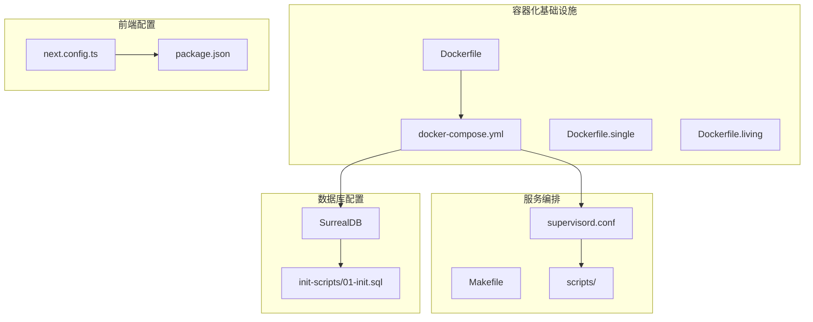
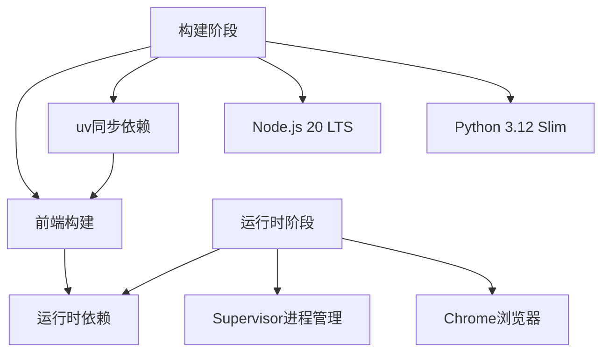
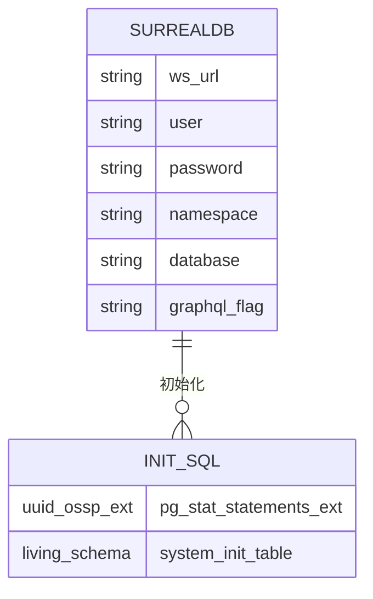
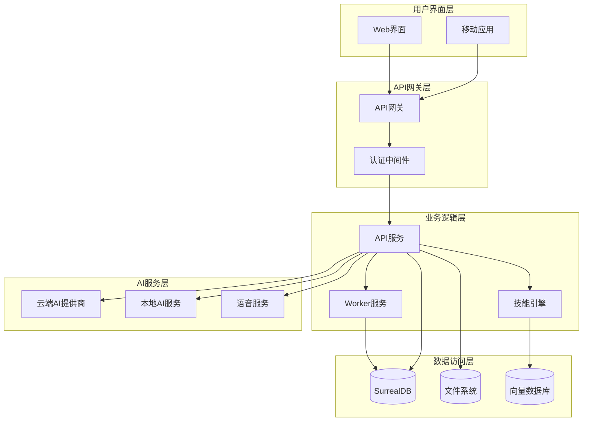
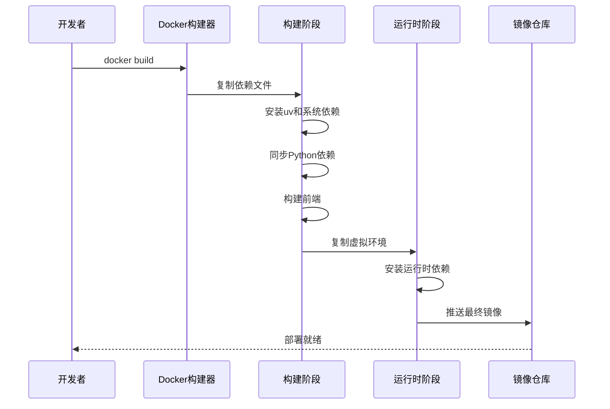
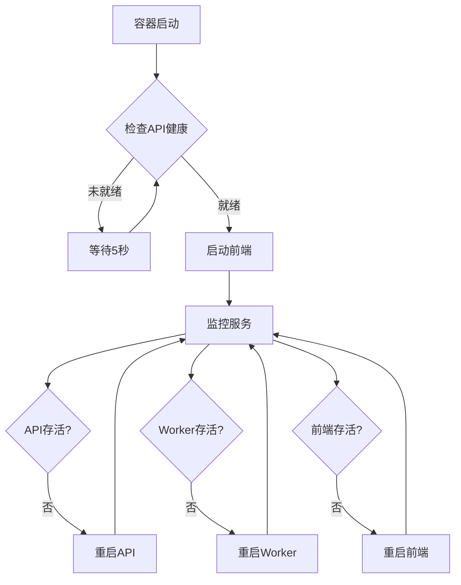
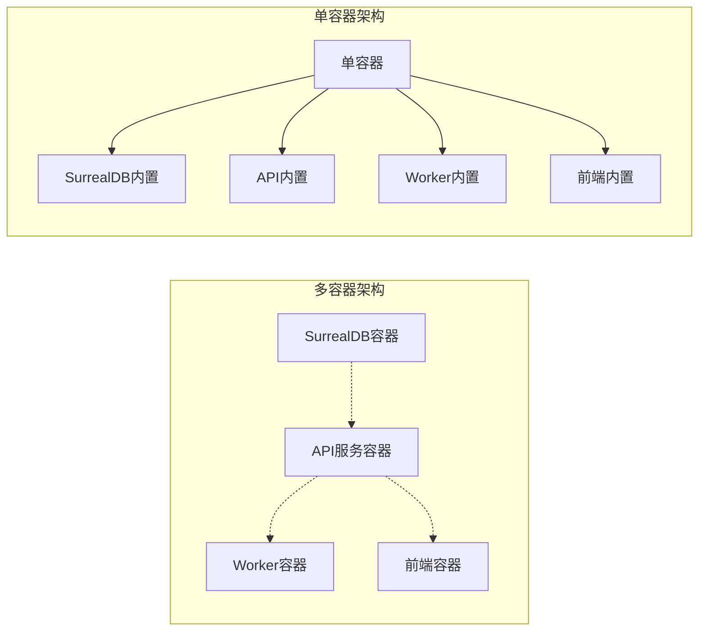
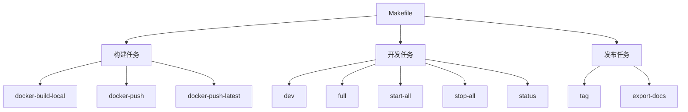
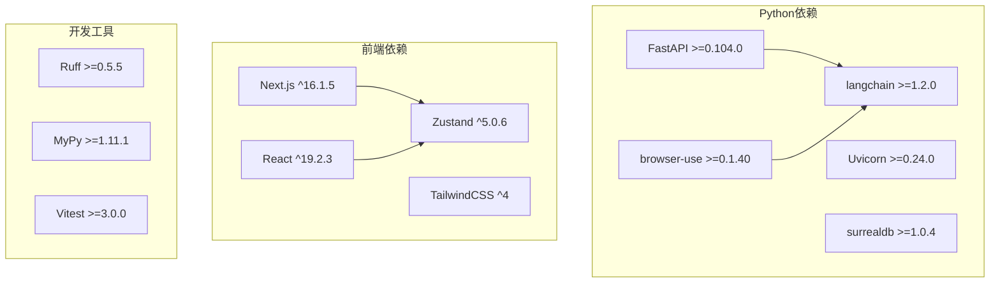

# 基础设施

<cite>
**本文档引用的文件**
- [Dockerfile](file://Dockerfile)
- [docker-compose.yml](file://docker-compose.yml)
- [run_api.py](file://run_api.py)
- [supervisord.conf](file://supervisord.conf)
- [Makefile](file://Makefile)
- [pyproject.toml](file://pyproject.toml)
- [scripts/wait-for-api.sh](file://scripts/wait-for-api.sh)
- [scripts/install-deps.sh](file://scripts/install-deps.sh)
- [examples/docker-compose-full-local.yml](file://examples/docker-compose-full-local.yml)
- [examples/docker-compose-single.yml](file://examples/docker-compose-single.yml)
- [init-scripts/01-init.sql](file://init-scripts/01-init.sql)
- [frontend/package.json](file://frontend/package.json)
- [frontend/next.config.ts](file://frontend/next.config.ts)
</cite>

## 目录
1. [简介](#简介)
2. [项目结构](#项目结构)
3. [核心组件](#核心组件)
4. [架构概览](#架构概览)
5. [详细组件分析](#详细组件分析)
6. [依赖分析](#依赖分析)
7. [性能考虑](#性能考虑)
8. [故障排除指南](#故障排除指南)
9. [结论](#结论)

## 简介

OpenNotebook 是一个开源的研究助手平台，基于活体知识系统架构构建。该项目提供了完整的基础设施支持，包括容器化部署、微服务架构、本地AI集成和现代化的前端界面。

该基础设施的核心目标是提供：
- 可扩展的容器化部署解决方案
- 多模式AI服务集成（云端和本地）
- 完整的开发和生产环境支持
- 自动化的服务编排和管理
- 灵活的配置选项和环境适配

## 项目结构

项目采用模块化的基础设施架构，主要包含以下核心组件：



**图表来源**
- [Dockerfile](file://Dockerfile#L1-L162)
- [docker-compose.yml](file://docker-compose.yml#L1-L61)
- [supervisord.conf](file://supervisord.conf#L1-L41)

**章节来源**
- [Dockerfile](file://Dockerfile#L1-L162)
- [docker-compose.yml](file://docker-compose.yml#L1-L61)
- [Makefile](file://Makefile#L1-L210)

## 核心组件

### 容器化构建系统

项目使用多阶段Docker构建，优化了构建性能和镜像大小：



**图表来源**
- [Dockerfile](file://Dockerfile#L1-L162)

### 服务编排架构

使用Supervisor进行多服务管理，确保所有组件协调运行：

| 服务名称 | 端口 | 功能描述 | 启动优先级 |
|---------|------|----------|------------|
| API服务 | 5055 | REST API后端服务 | 10 |
| Worker服务 | - | Surreal命令工作器 | 20 |
| 前端服务 | 8502 | Next.js静态站点 | 30 |

**章节来源**
- [supervisord.conf](file://supervisord.conf#L7-L41)
- [run_api.py](file://run_api.py#L16-L31)

### 数据库配置

支持多种数据库后端，主要使用SurrealDB作为主要存储：



**图表来源**
- [docker-compose.yml](file://docker-compose.yml#L2-L13)
- [init-scripts/01-init.sql](file://init-scripts/01-init.sql#L1-L29)

**章节来源**
- [docker-compose.yml](file://docker-compose.yml#L2-L13)
- [init-scripts/01-init.sql](file://init-scripts/01-init.sql#L1-L29)

## 架构概览

OpenNotebook采用分层架构设计，支持多种部署模式：



**图表来源**
- [docker-compose.yml](file://docker-compose.yml#L15-L61)
- [supervisord.conf](file://supervisord.conf#L7-L41)

## 详细组件分析

### Docker构建系统

#### 多阶段构建优化



**图表来源**
- [Dockerfile](file://Dockerfile#L33-L45)
- [Dockerfile](file://Dockerfile#L117-L125)

#### 构建优化特性

| 优化特性 | 实现方式 | 性能收益 |
|---------|----------|----------|
| 多核编译 | MAKEFLAGS="-j$(nproc)" | 编译速度提升 |
| 字节码缓存 | UV_COMPILE_BYTECODE=1 | 启动时间减少 |
| 依赖缓存 | 分层构建策略 | 重复构建加速 |
| 前端优化 | 独立Node.js阶段 | 构建效率提升 |

**章节来源**
- [Dockerfile](file://Dockerfile#L18-L24)
- [Dockerfile](file://Dockerfile#L32-L36)

### 服务编排系统

#### Supervisor配置详解



**图表来源**
- [supervisord.conf](file://supervisord.conf#L28-L41)
- [scripts/wait-for-api.sh](file://scripts/wait-for-api.sh#L1-L23)

#### 启动序列控制

服务启动遵循严格的顺序依赖关系：

1. **数据库服务** (优先级: 1)
2. **API服务** (优先级: 2) 
3. **Worker服务** (优先级: 3)
4. **前端服务** (优先级: 4)

**章节来源**
- [supervisord.conf](file://supervisord.conf#L1-L41)
- [scripts/wait-for-api.sh](file://scripts/wait-for-api.sh#L1-L23)

### 部署模式配置

#### 多容器部署模式



**图表来源**
- [docker-compose.yml](file://docker-compose.yml#L15-L61)
- [examples/docker-compose-single.yml](file://examples/docker-compose-single.yml#L1-L23)

#### 本地AI集成配置

| 组件 | 用途 | 默认端口 | 配置示例 |
|------|------|----------|----------|
| Ollama | 本地LLM和嵌入 | 11434 | `OLLAMA_BASE_URL=http://ollama:11434` |
| Speaches | 本地TTS/STT | 8000 | `http://speaches:8000/v1` |
| Chrome | 浏览器自动化 | 系统依赖 | 无配置需求 |

**章节来源**
- [examples/docker-compose-full-local.yml](file://examples/docker-compose-full-local.yml#L42-L69)
- [docker-compose.yml](file://docker-compose.yml#L70-L95)

### 开发工具链

#### Makefile任务管理



**图表来源**
- [Makefile](file://Makefile#L48-L127)
- [Makefile](file://Makefile#L129-L173)

#### 依赖管理系统

项目使用现代Python包管理工具：

| 工具 | 版本 | 用途 |
|------|------|------|
| uv | 最新版本 | 包管理和构建 |
| Poetry | 1.8+ | 依赖锁定 |
| pip | 标准 | 传统依赖安装 |

**章节来源**
- [pyproject.toml](file://pyproject.toml#L1-L101)
- [Makefile](file://Makefile#L1-L210)

## 依赖分析

### 外部依赖关系



**图表来源**
- [pyproject.toml](file://pyproject.toml#L15-L44)
- [frontend/package.json](file://frontend/package.json#L14-L57)

### 服务间依赖

```mermaid
erDiagram
API_SERVICE {
port 5055
uvicorn_server
fastapi_app
}
WORKER_SERVICE {
port none
surreal_commands_worker
commands_module
}
FRONTEND_SERVICE {
port 8502
next_js_server
node_js_runtime
}
DATABASE_SERVICE {
port 8000
surrealdb_rpc
rocksdb_storage
}
API_SERVICE ||--|| DATABASE_SERVICE : "通过SurrealDB连接"
WORKER_SERVICE ||--|| API_SERVICE : "命令执行依赖"
FRONTEND_SERVICE ||--|| API_SERVICE : "HTTP API调用"
```

**图表来源**
- [docker-compose.yml](file://docker-compose.yml#L15-L61)
- [supervisord.conf](file://supervisord.conf#L7-L41)

**章节来源**
- [pyproject.toml](file://pyproject.toml#L15-L44)
- [frontend/package.json](file://frontend/package.json#L14-L57)

## 性能考虑

### 构建性能优化

1. **多阶段构建**：分离构建和运行时环境，减少最终镜像大小
2. **依赖缓存**：利用Docker层缓存机制，加速重复构建
3. **并行编译**：使用多核编译标志提升构建速度
4. **镜像源优化**：国内镜像源加速依赖下载

### 运行时性能

1. **进程管理**：Supervisor确保服务自动重启和监控
2. **内存优化**：合理的进程优先级分配
3. **网络配置**：内部服务间通信优化
4. **缓存策略**：前端静态资源缓存

### 扩展性设计

- **水平扩展**：支持多实例部署
- **负载均衡**：前端代理配置
- **数据库扩展**：SurrealDB集群支持
- **AI服务扩展**：多提供商支持

## 故障排除指南

### 常见启动问题

#### API服务无法启动

**症状**：前端显示连接错误

**排查步骤**：
1. 检查API端口占用：`netstat -tulpn | grep 5055`
2. 查看API日志：`docker logs open_notebook_api_1`
3. 验证数据库连接：检查SURREAL_URL配置
4. 重启API服务：`docker-compose restart open_notebook`

#### 前端无法连接API

**症状**：页面加载后出现连接失败

**解决方案**：
1. 检查INTERNAL_API_URL环境变量
2. 验证wait-for-api.sh脚本执行
3. 确认API健康检查端点可用
4. 查看网络连接状态

#### 数据库连接问题

**症状**：应用启动时报数据库错误

**排查方法**：
1. 检查SurrealDB容器状态
2. 验证数据库凭据配置
3. 确认网络连通性
4. 查看数据库日志

**章节来源**
- [scripts/wait-for-api.sh](file://scripts/wait-for-api.sh#L1-L23)
- [supervisord.conf](file://supervisord.conf#L28-L41)

### 性能问题诊断

#### 内存使用过高

**可能原因**：
- 前端构建缓存过大
- API服务内存泄漏
- 数据库连接池配置不当

**解决建议**：
1. 清理构建缓存：`make clean-cache`
2. 监控进程内存使用
3. 调整API服务参数
4. 优化数据库查询

#### 启动时间过长

**优化措施**：
1. 启用Docker层缓存
2. 减少不必要的依赖更新
3. 使用更快的镜像源
4. 优化前端构建配置

## 结论

OpenNotebook的基础设施设计体现了现代容器化应用的最佳实践：

### 核心优势

1. **高度模块化**：清晰的服务分离和职责划分
2. **灵活部署**：支持多种部署模式和配置选项
3. **开发友好**：完善的开发工具链和自动化流程
4. **可扩展性**：支持水平扩展和性能优化
5. **可靠性**：多层监控和自动恢复机制

### 技术亮点

- **多阶段Docker构建**：优化构建性能和镜像大小
- **Supervisor进程管理**：确保服务稳定运行
- **灵活的AI集成**：支持云端和本地AI服务
- **现代化前端架构**：基于Next.js的高性能界面
- **完整的开发工具链**：从构建到发布的全流程支持

### 未来发展方向

1. **容器编排优化**：考虑Kubernetes部署支持
2. **监控系统增强**：集成更完善的APM工具
3. **CI/CD流水线**：自动化测试和部署流程
4. **性能基准测试**：建立性能指标和监控体系
5. **安全加固**：增强容器和网络安全性

该基础设施为OpenNotebook项目提供了坚实的技术基础，支持从个人开发到企业级部署的各种场景需求。