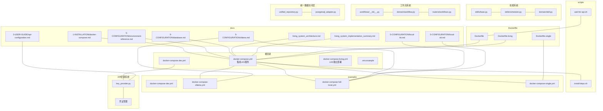
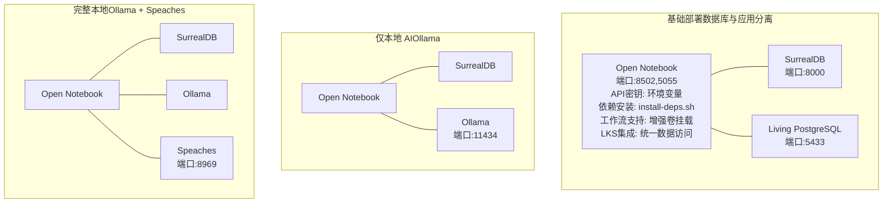
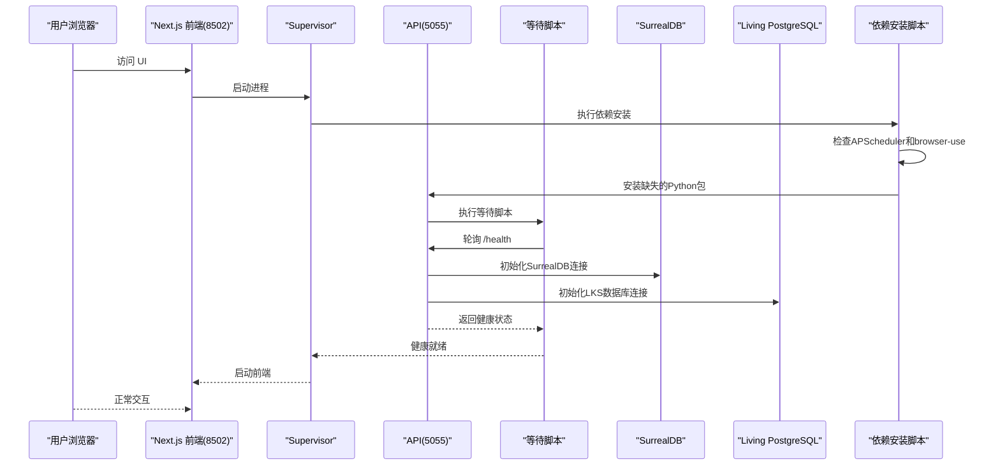
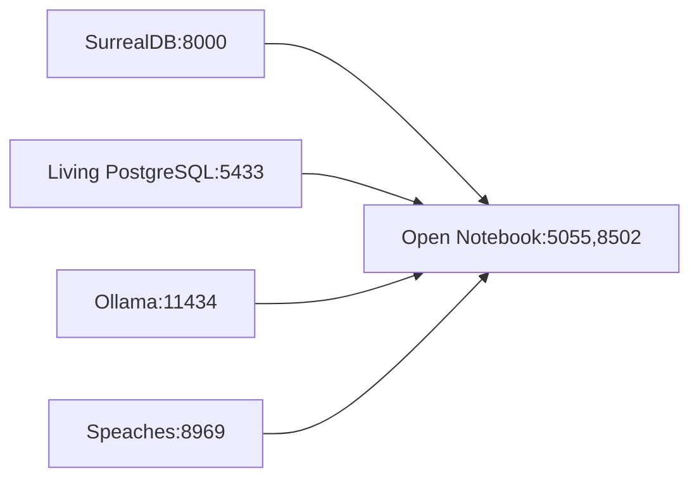
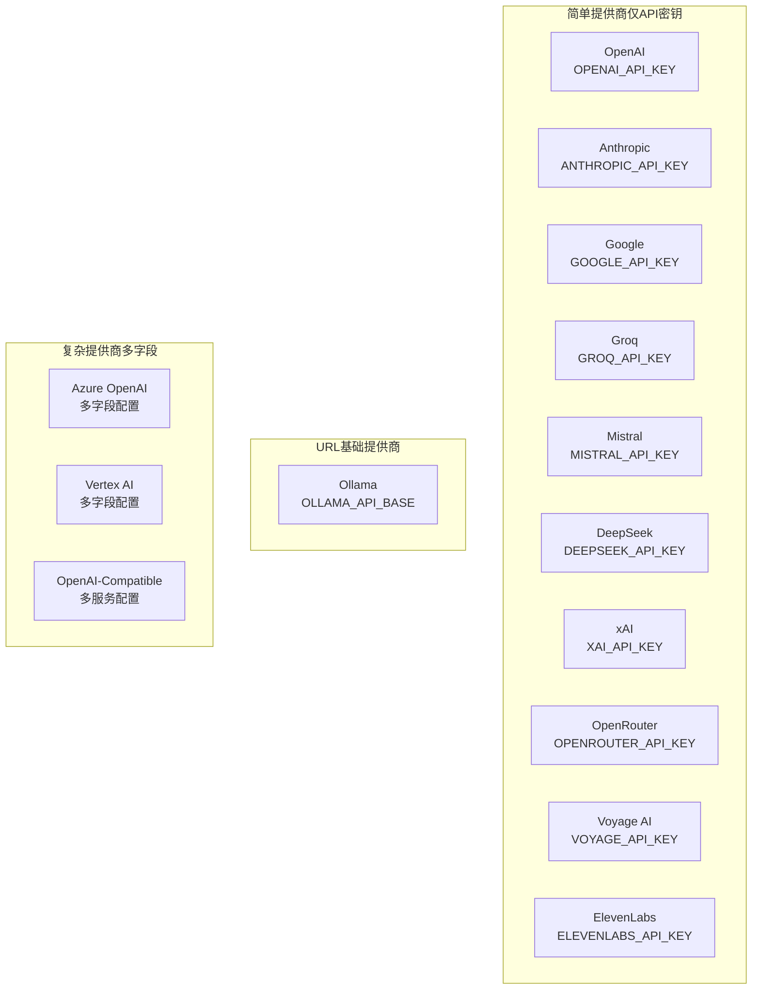
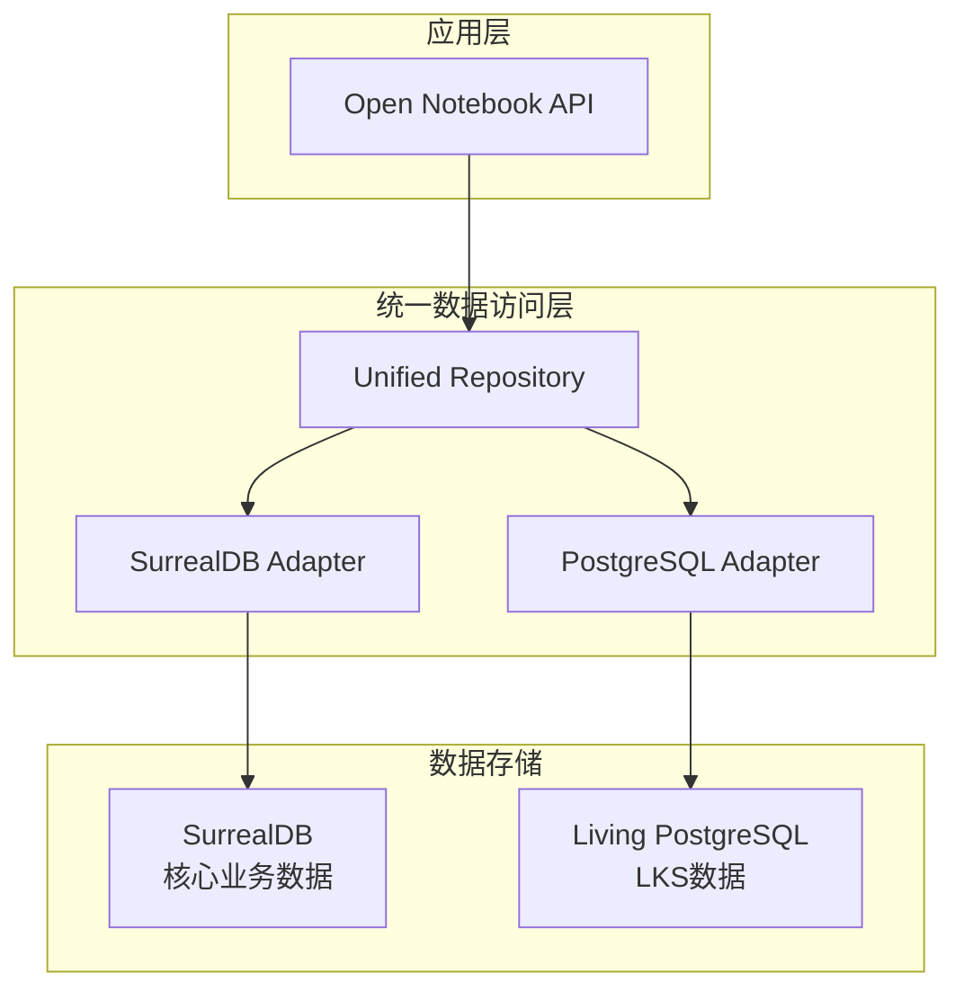
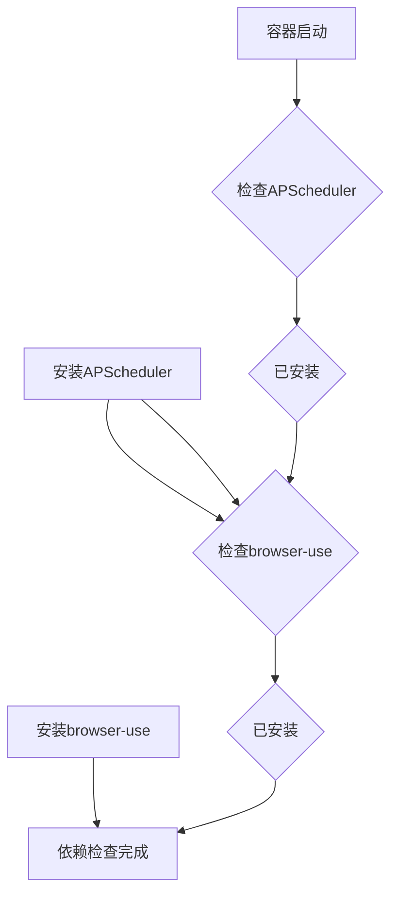

# Docker Compose 部署

<cite>
**本文引用的文件**
- [docker-compose.yml](file://docker-compose.yml)
- [docker-compose.dev.yml](file://docker-compose.dev.yml)
- [docker-compose.living.yml](file://docker-compose.living.yml)
- [examples/docker-compose-dev.yml](file://examples/docker-compose-dev.yml)
- [examples/docker-compose-full-local.yml](file://examples/docker-compose-full-local.yml)
- [examples/docker-compose-ollama.yml](file://examples/docker-compose-ollama.yml)
- [examples/docker-compose-single.yml](file://examples/docker-compose-single.yml)
- [docs/1-INSTALLATION/docker-compose.md](file://docs/1-INSTALLATION/docker-compose.md)
- [docs/3-USER-GUIDE/api-configuration.md](file://docs/3-USER-GUIDE/api-configuration.md)
- [docs/5-CONFIGURATION/environment-reference.md](file://docs/5-CONFIGURATION/environment-reference.md)
- [docs/5-CONFIGURATION/database.md](file://docs/5-CONFIGURATION/database.md)
- [docs/5-CONFIGURATION/ollama.md](file://docs/5-CONFIGURATION/ollama.md)
- [docs/5-CONFIGURATION/local-tts.md](file://docs/5-CONFIGURATION/local-tts.md)
- [docs/5-CONFIGURATION/local-stt.md](file://docs/5-CONFIGURATION/local-stt.md)
- [docs/living_system_architecture.md](file://docs/living_system_architecture.md)
- [docs/living_system_implementation_summary.md](file://docs/living_system_implementation_summary.md)
- [.env.example](file://.env.example)
- [scripts/wait-for-api.sh](file://scripts/wait-for-api.sh)
- [scripts/install-deps.sh](file://scripts/install-deps.sh)
- [Dockerfile](file://Dockerfile)
- [Dockerfile.living](file://Dockerfile.living)
- [Dockerfile.single](file://Dockerfile.single)
- [open_notebook/ai/key_provider.py](file://open_notebook/ai/key_provider.py)
- [open_notebook/skills/base.py](file://open_notebook/skills/base.py)
- [open_notebook/skills/scheduler.py](file://open_notebook/skills/scheduler.py)
- [open_notebook/domain/skill.py](file://open_notebook/domain/skill.py)
- [open_notebook/domain/workflow.py](file://open_notebook/domain/workflow.py)
- [open_notebook/workflows/__init__.py](file://open_notebook/workflows/__init__.py)
- [open_notebook/database/unified_repository.py](file://open_notebook/database/unified_repository.py)
- [open_notebook/database/postgresql_adapter.py](file://open_notebook/database/postgresql_adapter.py)
- [api/main.py](file://api/main.py)
- [api/unified_main.py](file://api/unified_main.py)
- [api/routers/workflows.py](file://api/routers/workflows.py)
- [api/routers/__init__.py](file://api/routers/__init__.py)
- [pyproject.toml](file://pyproject.toml)
- [init-scripts/01-init.sql](file://init-scripts/01-init.sql)
</cite>

## 更新摘要
**变更内容**
- 新增living_postgres服务，集成Living Knowledge System到统一API架构
- 移除独立的LKS服务定义，实现LKS与Open Notebook的统一部署
- 更新API健康检查，支持LKS数据库状态监控
- 增强统一数据访问层，支持SurrealDB和PostgreSQL双数据库架构
- 新增LKS数据库初始化脚本和健康检查配置

## 目录
1. [简介](#简介)
2. [项目结构](#项目结构)
3. [核心组件](#核心组件)
4. [架构总览](#架构总览)
5. [详细组件分析](#详细组件分析)
6. [依赖关系分析](#依赖关系分析)
7. [性能与可扩展性](#性能与可扩展性)
8. [部署步骤与启动顺序](#部署步骤与启动顺序)
9. [健康检查与可观测性](#健康检查与可观测性)
10. [环境变量与配置](#环境变量与配置)
11. [不同环境的Compose配置差异](#不同环境的compose配置差异)
12. [API密钥与凭证系统](#api密钥与凭证系统)
13. [Living Knowledge System集成](#living-knowledge-system集成)
14. [开发工作流程增强](#开发工作流程增强)
15. [故障排除指南](#故障排除指南)
16. [结论](#结论)

## 简介
本文件面向使用 Docker Compose 部署 Open Notebook 的用户，系统化说明多容器架构的优势与适用场景（数据库、API 服务、前端应用、本地 AI 服务的分离），并基于仓库中的示例配置文件，给出开发环境、完整本地部署（含 Ollama 与本地 TTS/STT）、以及单容器替代方案的对比与实践建议。文档还涵盖环境变量、卷挂载、网络设置、服务依赖关系、启动顺序、健康检查、故障排除与扩展定制方法。

**更新** 新增Living Knowledge System (LKS) 集成配置，实现SurrealDB和PostgreSQL双数据库架构，支持统一API访问和健康检查监控。

## 项目结构
Open Notebook 提供了多种 Docker Compose 示例，覆盖从最小化部署到完全本地化的隐私优先方案。核心目录与文件如下：
- 根级默认 compose 文件：用于基础数据库与应用分离部署，现已集成LKS服务
- 开发环境配置：docker-compose.dev.yml提供热重载和开发便利
- LKS独立配置：docker-compose.living.yml提供完整的Living Knowledge System部署
- examples 目录：提供开发、Ollama、完整本地、单容器等示例
- 文档目录：包含安装、配置、环境变量参考与本地 AI 设置指南
- 脚本与镜像构建文件：包含等待 API 健康脚本、依赖安装脚本与多阶段 Dockerfile
- API密钥提供者：支持数据库优先的凭证系统和环境变量回退
- 技能系统：支持自动化任务调度和浏览器自动化功能
- 工作流系统：支持多步骤工作流编排和执行
- 统一数据访问层：支持SurrealDB和PostgreSQL双数据库架构

**图表来源**
- [docker-compose.yml](file://docker-compose.yml#L1-L83)
- [docker-compose.dev.yml](file://docker-compose.dev.yml#L1-L34)
- [docker-compose.living.yml](file://docker-compose.living.yml#L1-L148)
- [examples/docker-compose-dev.yml](file://examples/docker-compose-dev.yml#L1-L29)
- [examples/docker-compose-ollama.yml](file://examples/docker-compose-ollama.yml#L1-L64)
- [examples/docker-compose-full-local.yml](file://examples/docker-compose-full-local.yml#L1-L198)
- [examples/docker-compose-single.yml](file://examples/docker-compose-single.yml#L1-L23)
- [docs/1-INSTALLATION/docker-compose.md](file://docs/1-INSTALLATION/docker-compose.md#L1-L357)
- [docs/3-USER-GUIDE/api-configuration.md](file://docs/3-USER-GUIDE/api-configuration.md#L1-L391)
- [docs/5-CONFIGURATION/environment-reference.md](file://docs/5-CONFIGURATION/environment-reference.md#L1-L275)
- [docs/5-CONFIGURATION/database.md](file://docs/5-CONFIGURATION/database.md#L1-L51)
- [docs/5-CONFIGURATION/ollama.md](file://docs/5-CONFIGURATION/ollama.md#L1-L741)
- [docs/5-CONFIGURATION/local-tts.md](file://docs/5-CONFIGURATION/local-tts.md#L1-L345)
- [docs/5-CONFIGURATION/local-stt.md](file://docs/5-CONFIGURATION/local-stt.md#L1-L366)
- [docs/living_system_architecture.md](file://docs/living_system_architecture.md#L1-L264)
- [docs/living_system_implementation_summary.md](file://docs/living_system_implementation_summary.md#L1-L154)
- [scripts/wait-for-api.sh](file://scripts/wait-for-api.sh#L1-L23)
- [scripts/install-deps.sh](file://scripts/install-deps.sh#L1-L20)
- [Dockerfile](file://Dockerfile#L1-L159)
- [Dockerfile.living](file://Dockerfile.living#L1-L200)
- [Dockerfile.single](file://Dockerfile.single#L1-L81)
- [open_notebook/ai/key_provider.py](file://open_notebook/ai/key_provider.py#L1-L450)
- [open_notebook/skills/base.py](file://open_notebook/skills/base.py#L1-L183)
- [open_notebook/skills/scheduler.py](file://open_notebook/skills/scheduler.py#L1-L65)
- [open_notebook/domain/skill.py](file://open_notebook/domain/skill.py#L1-L162)
- [open_notebook/domain/workflow.py](file://open_notebook/domain/workflow.py#L1-L309)
- [open_notebook/workflows/__init__.py](file://open_notebook/workflows/__init__.py#L1-L29)
- [open_notebook/database/unified_repository.py](file://open_notebook/database/unified_repository.py#L1-L548)
- [open_notebook/database/postgresql_adapter.py](file://open_notebook/database/postgresql_adapter.py#L1-L364)
- [api/main.py](file://api/main.py#L1-L232)
- [api/unified_main.py](file://api/unified_main.py#L1-L406)
- [api/routers/workflows.py](file://api/routers/workflows.py#L1-L453)

**章节来源**
- [docker-compose.yml](file://docker-compose.yml#L1-L83)
- [docker-compose.dev.yml](file://docker-compose.dev.yml#L1-L34)
- [docker-compose.living.yml](file://docker-compose.living.yml#L1-L148)
- [examples/docker-compose-dev.yml](file://examples/docker-compose-dev.yml#L1-L29)
- [examples/docker-compose-ollama.yml](file://examples/docker-compose-ollama.yml#L1-L64)
- [examples/docker-compose-full-local.yml](file://examples/docker-compose-full-local.yml#L1-L198)
- [examples/docker-compose-single.yml](file://examples/docker-compose-single.yml#L1-L23)
- [docs/1-INSTALLATION/docker-compose.md](file://docs/1-INSTALLATION/docker-compose.md#L1-L357)
- [open_notebook/ai/key_provider.py](file://open_notebook/ai/key_provider.py#L1-L450)
- [open_notebook/domain/workflow.py](file://open_notebook/domain/workflow.py#L1-L309)
- [open_notebook/database/unified_repository.py](file://open_notebook/database/unified_repository.py#L1-L548)
- [open_notebook/database/postgresql_adapter.py](file://open_notebook/database/postgresql_adapter.py#L1-L364)

## 核心组件
- 数据库服务（SurrealDB）
  - 默认使用内置 RocksDB 后端，持久化在宿主机或命名卷
  - 提供 GraphQL 实验特性开关
- 数据库服务（Living Knowledge System PostgreSQL）
  - 新增PostgreSQL数据库服务，端口5433，用于Living Knowledge System
  - 支持TimescaleDB扩展，专为时序数据优化
  - 包含数据库初始化脚本和健康检查配置
- 应用服务（Open Notebook）
  - 多阶段构建，同时运行 Next.js 前端与 REST API
  - 使用 Supervisor 管理多个进程，内置等待 API 健康脚本
  - 支持通过环境变量配置数据库连接、加密密钥、外部 API URL 等
  - **新增**：完整的API密钥环境变量支持，包括DeepSeek、阿里云百炼、Moonshot等提供商
  - **新增**：依赖安装脚本自动安装Skill系统所需的Python包
  - **新增**：增强的开发卷挂载配置，支持工作流系统的动态开发
  - **新增**：统一数据访问层，支持SurrealDB和PostgreSQL双数据库架构
- 可选服务
  - Ollama：本地大语言模型与嵌入模型推理
  - Speaches：本地 TTS/STT 服务器（OpenAI 兼容）

**更新** 生产环境配置现在包含完整的API密钥环境变量支持和依赖安装脚本，开发环境提供热重载和源代码挂载，增强了工作流系统的开发支持。新增Living Knowledge System PostgreSQL服务，实现统一API架构。

**章节来源**
- [docker-compose.yml](file://docker-compose.yml#L1-L83)
- [docker-compose.dev.yml](file://docker-compose.dev.yml#L1-L34)
- [docker-compose.living.yml](file://docker-compose.living.yml#L14-L32)
- [examples/docker-compose-ollama.yml](file://examples/docker-compose-ollama.yml#L1-L64)
- [examples/docker-compose-full-local.yml](file://examples/docker-compose-full-local.yml#L1-L198)
- [Dockerfile](file://Dockerfile#L1-L159)
- [scripts/wait-for-api.sh](file://scripts/wait-for-api.sh#L1-L23)
- [scripts/install-deps.sh](file://scripts/install-deps.sh#L1-L20)
- [open_notebook/ai/key_provider.py](file://open_notebook/ai/key_provider.py#L29-L65)
- [open_notebook/database/unified_repository.py](file://open_notebook/database/unified_repository.py#L1-L548)

## 架构总览
下图展示了三种典型部署形态的组件交互与数据流：

**图表来源**
- [docker-compose.yml](file://docker-compose.yml#L1-L83)
- [docker-compose.dev.yml](file://docker-compose.dev.yml#L1-L34)
- [docker-compose.living.yml](file://docker-compose.living.yml#L14-L32)
- [examples/docker-compose-ollama.yml](file://examples/docker-compose-ollama.yml#L1-L64)
- [examples/docker-compose-full-local.yml](file://examples/docker-compose-full-local.yml#L1-L198)

## 详细组件分析

### 组件一：数据库（SurrealDB）
- 运行参数
  - 使用内置存储后端，持久化路径映射至宿主机或命名卷
  - 开启 GraphQL 实验特性
  - 在 Linux 上需要以 root 用户运行以避免权限问题
- 端口与网络
  - 暴露 8000 端口供应用访问
- 依赖关系
  - 应用服务需先于数据库完成初始化，可通过 depends_on 或启动脚本等待

**章节来源**
- [docker-compose.yml](file://docker-compose.yml#L2-L13)
- [docker-compose.dev.yml](file://docker-compose.dev.yml#L2-L13)
- [examples/docker-compose-dev.yml](file://examples/docker-compose-dev.yml#L2-L13)
- [docs/5-CONFIGURATION/database.md](file://docs/5-CONFIGURATION/database.md#L1-L51)

### 组件二：数据库（Living Knowledge System PostgreSQL）
- 运行参数
  - 使用PostgreSQL 15-alpine镜像，专为Living Knowledge System优化
  - 端口映射5433:5432，避免与宿主PostgreSQL冲突
  - 支持TimescaleDB扩展，专为时序数据处理
  - 包含数据库初始化脚本，自动创建必要的扩展和模式
- 端口与网络
  - 暴露 5433 端口供应用访问
  - 使用独立卷存储数据，支持持久化
- 健康检查
  - 提供pg_isready健康检查，确保数据库可用性
  - 支持初始化脚本自动执行
- 依赖关系
  - 应用服务依赖此数据库，通过depends_on确保启动顺序

**更新** 新增Living Knowledge System PostgreSQL服务，提供专门的时序数据存储和健康检查功能。

**章节来源**
- [docker-compose.yml](file://docker-compose.yml#L70-L83)
- [docker-compose.living.yml](file://docker-compose.living.yml#L14-L32)
- [init-scripts/01-init.sql](file://init-scripts/01-init.sql#L1-L28)

### 组件三：应用服务（Open Notebook）
- 容器内进程管理
  - 使用 Supervisor 管理多个进程，确保前端与 API 同时运行
  - 内置等待 API 健康脚本，避免前端过早连接导致的连接错误
  - **新增**：启动时自动执行依赖安装脚本
  - **新增**：集成Living Knowledge System数据库连接
- 网络绑定
  - 绑定到 0.0.0.0，便于反向代理与容器间通信
- 端口暴露
  - 8502：Web UI
  - 5055：统一REST API（包含LKS端点）
- 卷挂载
  - 应用数据目录映射到宿主机，便于备份与持久化
  - **开发环境**：挂载源代码目录以支持热重载
  - **生产环境**：挂载技能系统相关文件以支持动态开发
  - **新增**：挂载Living Knowledge System数据库配置
  - **新增**：挂载统一数据访问层代码
- 依赖关系
  - 依赖数据库服务；在完整本地部署中还依赖 Ollama 与 Speaches
  - **新增**：依赖Living PostgreSQL数据库

**图表来源**
- [scripts/wait-for-api.sh](file://scripts/wait-for-api.sh#L1-L23)
- [scripts/install-deps.sh](file://scripts/install-deps.sh#L1-L20)
- [Dockerfile](file://Dockerfile#L1-L159)
- [api/unified_main.py](file://api/unified_main.py#L104-L119)

**章节来源**
- [Dockerfile](file://Dockerfile#L1-L159)
- [scripts/wait-for-api.sh](file://scripts/wait-for-api.sh#L1-L23)
- [scripts/install-deps.sh](file://scripts/install-deps.sh#L1-L20)
- [docker-compose.yml](file://docker-compose.yml#L15-L68)
- [docker-compose.dev.yml](file://docker-compose.dev.yml#L14-L33)

### 组件四：可选服务（Ollama）
- 用途
  - 提供本地 LLM 与嵌入模型推理，支持多种硬件加速
- 端口与卷
  - 暴露 11434 端口
  - 使用命名卷保存模型缓存
- 网络配置
  - 在容器内通过服务名访问
  - 在 Linux 上如需从宿主访问，需额外配置 host.docker.internal 映射

**章节来源**
- [examples/docker-compose-ollama.yml](file://examples/docker-compose-ollama.yml#L1-L64)
- [examples/docker-compose-full-local.yml](file://examples/docker-compose-full-local.yml#L1-L198)
- [docs/5-CONFIGURATION/ollama.md](file://docs/5-CONFIGURATION/ollama.md#L1-L741)

### 组件五：可选服务（Speaches）
- 用途
  - 提供本地 TTS/STT（OpenAI 兼容接口），适合隐私与离线场景
- 端口与卷
  - 暴露 8000 端口（容器内），映射至 8969
  - 使用命名卷缓存模型
- 网络配置
  - 在容器内通过服务名访问；Linux 上注意 host.docker.internal 解析

**章节来源**
- [examples/docker-compose-full-local.yml](file://examples/docker-compose-full-local.yml#L1-L198)
- [docs/5-CONFIGURATION/local-tts.md](file://docs/5-CONFIGURATION/local-tts.md#L1-L345)
- [docs/5-CONFIGURATION/local-stt.md](file://docs/5-CONFIGURATION/local-stt.md#L1-L366)

## 依赖关系分析
- 服务依赖
  - 基础部署：应用依赖数据库，**新增**：应用依赖Living PostgreSQL
  - Ollama 部署：应用依赖数据库与 Ollama
  - 完整本地部署：应用依赖数据库、Ollama 与 Speaches
  - **新增**：LKS独立部署：API依赖PostgreSQL，Data Agent依赖PostgreSQL和API
- 启动顺序
  - 建议按数据库 → 可选 AI 服务 → 应用的顺序启动
  - 应用内部通过等待脚本确保 API 就绪后再启动前端
  - **新增**：应用启动时自动执行依赖安装脚本
  - **新增**：Living PostgreSQL数据库初始化脚本自动执行
- 网络与端口
  - 数据库：8000
  - API：5055
  - UI：8502
  - Ollama：11434
  - Speaches：8969
  - **新增**：Living PostgreSQL：5433

**图表来源**
- [docker-compose.yml](file://docker-compose.yml#L1-L83)
- [docker-compose.dev.yml](file://docker-compose.dev.yml#L1-L34)
- [docker-compose.living.yml](file://docker-compose.living.yml#L14-L32)
- [examples/docker-compose-ollama.yml](file://examples/docker-compose-ollama.yml#L1-L64)
- [examples/docker-compose-full-local.yml](file://examples/docker-compose-full-local.yml#L1-L198)

**章节来源**
- [docker-compose.yml](file://docker-compose.yml#L1-L83)
- [docker-compose.dev.yml](file://docker-compose.dev.yml#L1-L34)
- [docker-compose.living.yml](file://docker-compose.living.yml#L1-L148)
- [examples/docker-compose-ollama.yml](file://examples/docker-compose-ollama.yml#L1-L64)
- [examples/docker-compose-full-local.yml](file://examples/docker-compose-full-local.yml#L1-L198)

## 性能与可扩展性
- 并发与重试
  - 数据库命令最大并发任务数、重试次数与等待策略可调
- 资源限制
  - 可为 Ollama 与 Speaches 设置内存、CPU 与 GPU 资源限制
- 硬件要求
  - 不同模型与任务对内存、存储与 GPU 的需求差异较大，应根据实际负载选择合适的硬件与镜像（CPU/CUDA）
- **新增**：Living PostgreSQL性能优化
  - TimescaleDB扩展支持时序数据高效存储
  - 独立数据库实例避免与其他服务竞争资源
  - 专用端口5433避免端口冲突

**章节来源**
- [docs/5-CONFIGURATION/environment-reference.md](file://docs/5-CONFIGURATION/environment-reference.md#L1-L275)
- [examples/docker-compose-full-local.yml](file://examples/docker-compose-full-local.yml#L1-L198)
- [docs/5-CONFIGURATION/ollama.md](file://docs/5-CONFIGURATION/ollama.md#L1-L741)
- [docs/5-CONFIGURATION/local-tts.md](file://docs/5-CONFIGURATION/local-tts.md#L1-L345)
- [docs/5-CONFIGURATION/local-stt.md](file://docs/5-CONFIGURATION/local-stt.md#L1-L366)
- [docker-compose.living.yml](file://docker-compose.living.yml#L14-L32)

## 部署步骤与启动顺序
- 基础部署
  1) 准备 docker-compose.yml（或下载官方文件）
  2) 编辑环境变量（尤其是加密密钥与数据库连接）
  3) 启动：docker compose up -d
  4) 等待约 15-20 秒，验证 API 健康与前端可用
  5) **新增**：验证Living PostgreSQL数据库连接状态
- 完整本地部署（Ollama + Speaches）
  1) 使用完整本地示例文件
  2) 启动后拉取所需模型（LLM、嵌入、TTS/STT）
  3) 在 UI 中配置凭据与模型
- 单容器替代方案
  - 使用单容器镜像，内置数据库与前后端，适合快速体验与开发
- **开发环境部署**
  1) 使用 docker-compose.dev.yml
  2) 自动挂载源代码目录支持热重载
  3) 使用本地构建的镜像进行开发调试
  4) **新增**：支持实时代码修改和自动重启
  5) **新增**：支持工作流系统的动态开发
  6) **新增**：支持Living Knowledge System的开发集成

**更新** 新增Living PostgreSQL数据库的部署和验证步骤，以及LKS开发集成支持。

**章节来源**
- [docs/1-INSTALLATION/docker-compose.md](file://docs/1-INSTALLATION/docker-compose.md#L1-L357)
- [examples/docker-compose-full-local.yml](file://examples/docker-compose-full-local.yml#L1-L198)
- [examples/docker-compose-single.yml](file://examples/docker-compose-single.yml#L1-L23)
- [docker-compose.dev.yml](file://docker-compose.dev.yml#L1-L34)

## 健康检查与可观测性
- API 健康检查
  - 通过 /health 接口验证 API 就绪状态
  - **新增**：通过/api/living/health接口验证Living PostgreSQL数据库状态
- 日志与重启
  - 查看日志：docker compose logs -f
  - 重启服务：docker compose restart
- 停止与清理
  - 停止：docker compose down
  - 清理数据卷：docker compose down -v
- **新增**：Living PostgreSQL健康检查
  - 通过pg_isready检查数据库连接
  - 通过/init-scripts自动初始化数据库结构

**章节来源**
- [docs/1-INSTALLATION/docker-compose.md](file://docs/1-INSTALLATION/docker-compose.md#L1-L357)
- [api/unified_main.py](file://api/unified_main.py#L340-L406)
- [docker-compose.living.yml](file://docker-compose.living.yml#L28-L32)
- [init-scripts/01-init.sql](file://init-scripts/01-init.sql#L1-L28)

## 环境变量与配置
- 必填项
  - 加密密钥：用于安全存储凭据
  - 数据库连接：URL、用户名、密码、命名空间、数据库名
  - **新增**：Living PostgreSQL连接：主机、端口、数据库名、用户名、密码
- 可选项
  - 外部 API URL（反向代理场景）
  - Ollama 基础地址（本地或容器内）
  - 代理设置（HTTP/HTTPS/NO_PROXY）
  - 调试与监控（LangChain Tracing）
- **新增**：完整的API密钥环境变量支持
  - DeepSeek：DEEPSEEK_API_KEY
  - 阿里云百炼：DASHSCOPE_API_KEY
  - Moonshot：MOONSHOT_API_KEY
  - 其他提供商：OPENAI_API_KEY、ANTHROPIC_API_KEY、GOOGLE_API_KEY等
- **新增**：技能系统环境变量
  - OPEN_NOTEBOOK_SKILL_ENABLED：启用技能系统
  - OPEN_NOTEBOOK_SKILL_SCHEDULE：技能调度配置
- **新增**：工作流系统环境变量
  - OPEN_NOTEBOOK_WORKFLOW_ENABLED：启用工作流系统
  - OPEN_NOTEBOOK_WORKFLOW_ENGINE：工作流引擎配置
- **新增**：Living Knowledge System环境变量
  - LIVING_DB_HOST：Living PostgreSQL主机
  - LIVING_DB_PORT：Living PostgreSQL端口（默认5433）
  - LIVING_DB_NAME：Living System数据库名
  - LIVING_DB_USER：Living PostgreSQL用户名
  - LIVING_DB_PASSWORD：Living PostgreSQL密码
- 配置来源
  - docker-compose 环境变量
  - .env.example 提供模板
  - 文档中的环境变量参考表

**更新** 生产环境配置现在包含完整的API密钥环境变量支持和技能系统配置，开发环境提供热重载和源代码挂载，新增工作流系统的开发支持。新增Living Knowledge System数据库连接配置。

**章节来源**
- [.env.example](file://.env.example#L1-L60)
- [docs/5-CONFIGURATION/environment-reference.md](file://docs/5-CONFIGURATION/environment-reference.md#L1-L275)
- [docs/5-CONFIGURATION/database.md](file://docs/5-CONFIGURATION/database.md#L1-L51)
- [docker-compose.yml](file://docker-compose.yml#L34-L39)
- [docker-compose.living.yml](file://docker-compose.living.yml#L47-L52)

## 不同环境的Compose配置差异
- 基础部署（推荐）
  - 分离数据库与应用，便于扩展与维护
  - **生产环境**：包含完整的API密钥环境变量支持和依赖安装脚本
  - **新增**：集成Living PostgreSQL数据库服务，端口5433
  - **新增**：增强的开发卷挂载配置，支持工作流系统的动态开发
- 开发环境
  - 使用本地构建的镜像，加载 .env 文件，便于调试
  - **新增**：docker-compose.dev.yml提供热重载和源代码挂载
  - **新增**：支持实时代码修改和自动重启
  - **新增**：支持工作流系统的动态开发
- Ollama 本地模型
  - 新增 Ollama 服务，应用通过服务名访问
- 完整本地部署（隐私优先）
  - 同时包含 Ollama 与 Speaches，实现 100% 本地 AI 与语音处理
- **新增**：LKS独立部署
  - 使用docker-compose.living.yml提供完整的Living Knowledge System
  - 包含PostgreSQL、API服务、Data Agent和可选的pgAdmin管理界面
  - 端口8888用于LKS API，5050用于pgAdmin
- 单容器（不推荐）
  - 将数据库、API、Worker 与前端打包在一个容器中，适合快速体验

**更新** 新增LKS独立部署配置的详细说明，以及增强的开发卷挂载配置。

**章节来源**
- [docker-compose.yml](file://docker-compose.yml#L1-L83)
- [docker-compose.dev.yml](file://docker-compose.dev.yml#L1-L34)
- [docker-compose.living.yml](file://docker-compose.living.yml#L1-L148)
- [examples/docker-compose-dev.yml](file://examples/docker-compose-dev.yml#L1-L29)
- [examples/docker-compose-ollama.yml](file://examples/docker-compose-ollama.yml#L1-L64)
- [examples/docker-compose-full-local.yml](file://examples/docker-compose-full-local.yml#L1-L198)
- [examples/docker-compose-single.yml](file://examples/docker-compose-single.yml#L1-L23)

## API密钥与凭证系统

Open Notebook 采用先进的API密钥管理机制，支持数据库优先的凭证系统和环境变量回退：

### 凭证系统架构
- 数据库优先：所有API密钥存储在SurrealDB中，使用Fernet加密
- 环境变量回退：支持从环境变量读取密钥作为兼容性措施
- 自动初始化：支持从环境变量自动创建凭证记录
- 多凭证支持：每个提供商可配置多个凭证，支持团队协作

### 支持的AI提供商
系统支持以下AI提供商的API密钥管理：

**图表来源**
- [open_notebook/ai/key_provider.py](file://open_notebook/ai/key_provider.py#L29-L65)
- [open_notebook/ai/key_provider.py](file://open_notebook/ai/key_provider.py#L307-L338)

### 环境变量配置
生产环境配置包含完整的API密钥环境变量支持：

| 提供商 | 环境变量 | 默认值 | 用途 |
|--------|----------|--------|------|
| DeepSeek | DEEPSEEK_API_KEY | sk-2b3e736d87754216bc509c8595292931 | 中国AI模型提供商 |
| 阿里云百炼 | DASHSCOPE_API_KEY | sk-383049091d584eb3aad3e0de423a3119 | 通义千问API |
| Moonshot | MOONSHOT_API_KEY | sk-VqWRgeDnKXIED8kijgueo6jscY9Y5uHTXLWXpOt0Bi6FURzy | Kimi AI模型 |
| OpenAI | OPENAI_API_KEY | 未设置 | 最主流的AI模型提供商 |
| Anthropic | ANTHROPIC_API_KEY | 未设置 | Claude系列模型 |
| Google Gemini | GOOGLE_API_KEY | 未设置 | Google AI模型 |

### 凭证迁移机制
系统提供从环境变量到数据库凭证的自动迁移功能：

1. **检测环境变量**：启动时扫描已配置的API密钥
2. **创建凭证记录**：将环境变量转换为加密的数据库记录
3. **更新配置**：后续使用数据库中的凭证
4. **清理环境变量**：可选择删除原始环境变量

**章节来源**
- [open_notebook/ai/key_provider.py](file://open_notebook/ai/key_provider.py#L1-L450)
- [docs/3-USER-GUIDE/api-configuration.md](file://docs/3-USER-GUIDE/api-configuration.md#L1-L391)
- [docs/5-CONFIGURATION/environment-reference.md](file://docs/5-CONFIGURATION/environment-reference.md#L232-L275)
- [docker-compose.yml](file://docker-compose.yml#L43-L47)

## Living Knowledge System集成

Open Notebook现已集成Living Knowledge System (LKS)，实现统一的多数据库架构：

### 统一数据访问层
- **统一接口**：通过统一仓库模式支持SurrealDB和PostgreSQL双数据库
- **透明路由**：自动根据实体类型路由到正确的数据库
- **跨域查询**：支持复杂的跨数据库查询和聚合操作

### 数据库架构

**图表来源**
- [open_notebook/database/unified_repository.py](file://open_notebook/database/unified_repository.py#L323-L541)
- [open_notebook/database/postgresql_adapter.py](file://open_notebook/database/postgresql_adapter.py#L17-L44)

### LKS数据库配置
- **端口分离**：Living PostgreSQL使用5433端口，避免与宿主数据库冲突
- **独立卷**：使用独立的卷存储LKS数据，便于备份和迁移
- **初始化脚本**：自动创建必要的数据库扩展和模式
- **健康检查**：提供pg_isready健康检查，确保数据库可用性

### API集成
- **统一健康检查**：通过/api/living/health端点监控LKS状态
- **状态聚合**：在整体健康检查中包含LKS数据库状态
- **错误处理**：LKS数据库不可用时返回降级状态

**章节来源**
- [docker-compose.yml](file://docker-compose.yml#L70-L83)
- [docker-compose.living.yml](file://docker-compose.living.yml#L14-L32)
- [open_notebook/database/unified_repository.py](file://open_notebook/database/unified_repository.py#L1-L548)
- [open_notebook/database/postgresql_adapter.py](file://open_notebook/database/postgresql_adapter.py#L1-L364)
- [api/unified_main.py](file://api/unified_main.py#L340-L406)
- [init-scripts/01-init.sql](file://init-scripts/01-init.sql#L1-L28)

## 开发工作流程增强

### 依赖安装脚本
Open Notebook 提供了智能的依赖安装机制，确保开发环境的Python包完整性：

#### install-deps.sh 功能特性
- **自动检测**：启动时检查必需的Python包是否已安装
- **条件安装**：仅安装缺失的包，避免重复安装
- **技能系统支持**：自动安装APScheduler和browser-use包
- **版本兼容**：确保安装的包版本符合项目要求

#### 支持的技能系统依赖
- **APScheduler**：异步任务调度框架，支持cron表达式
- **browser-use**：AI驱动的浏览器自动化工具
- **tzlocal**：时区本地化支持

#### 依赖安装流程

**图表来源**
- [scripts/install-deps.sh](file://scripts/install-deps.sh#L1-L20)
- [pyproject.toml](file://pyproject.toml#L43-L44)

### 开发卷挂载配置
开发环境提供了全面的源代码挂载支持：

#### docker-compose.dev.yml 卷配置
- **notebook_data**：应用数据持久化
- **open_notebook**：源代码挂载，支持热重载
- **技能系统文件**：动态挂载技能相关文件

#### 生产环境卷配置
- **notebook_data**：应用数据持久化
- **技能系统文件**：挂载技能相关文件以支持动态开发
- **工作流系统文件**：挂载工作流相关文件以支持动态开发
- **API路由器文件**：挂载API路由以支持动态开发
- **依赖安装脚本**：挂载安装脚本以支持动态依赖管理
- **Living PostgreSQL配置**：挂载LKS数据库相关文件

#### 增强的挂载文件列表
生产环境挂载的关键文件：
- `./open_notebook/skills`：技能系统源代码
- `./open_notebook/workflows`：工作流系统源代码
- `./open_notebook/ai/key_provider.py`：API密钥提供者
- `./open_notebook/domain/skill.py`：技能领域模型
- `./open_notebook/domain/workflow.py`：工作流领域模型
- `./open_notebook/database/unified_repository.py`：统一数据访问层
- `./open_notebook/database/postgresql_adapter.py`：PostgreSQL适配器
- `./api/main.py`：API主入口
- `./api/routers/workflows.py`：工作流路由
- `./api/routers/workflow_builder.py`：工作流构建器路由
- `./api/routers/workflow_templates.py`：工作流模板路由
- `./scripts/install-deps.sh`：依赖安装脚本

#### API路由器挂载方式改进
API路由器现在支持更灵活的挂载方式：
- **独立挂载**：工作流相关路由单独挂载，支持独立开发
- **批量挂载**：通过API路由器包统一管理，减少重复配置
- **动态加载**：支持运行时重新加载路由模块

**章节来源**
- [scripts/install-deps.sh](file://scripts/install-deps.sh#L1-L20)
- [docker-compose.dev.yml](file://docker-compose.dev.yml#L28-L30)
- [docker-compose.yml](file://docker-compose.yml#L48-L59)
- [pyproject.toml](file://pyproject.toml#L43-L44)
- [api/main.py](file://api/main.py#L15-L38)
- [api/routers/__init__.py](file://api/routers/__init__.py#L1-L56)
- [api/routers/workflows.py](file://api/routers/workflows.py#L1-L453)

## 故障排除指南
- 无法连接 API
  - 检查服务是否运行、日志与等待脚本是否成功
- 端口占用
  - 修改映射端口或释放冲突端口
- 数据库连接失败
  - 检查数据库日志，必要时清理数据卷并重建
- Linux 权限问题
  - 添加 user: root 或调整宿主机目录权限
- Ollama/Speaches 连接问题
  - 确认外部访问配置、host.docker.internal 解析、防火墙放通
- 代理与网络
  - 在企业网络中正确配置 HTTP/HTTPS 代理
- **API密钥问题**
  - 检查OPEN_NOTEBOOK_ENCRYPTION_KEY是否正确设置
  - 验证凭证系统是否正常工作
  - 使用Settings → API Keys界面检查密钥状态
- **开发环境问题**
  - 确认源代码挂载是否正确
  - 检查热重载功能是否启用
  - 验证本地构建的镜像版本
  - **新增**：检查工作流系统挂载是否正确
  - **新增**：验证API路由器挂载是否生效
- **依赖安装问题**
  - 检查install-deps.sh脚本执行日志
  - 确认网络连接和PyPI访问权限
  - 验证Python虚拟环境路径
- **技能系统问题**
  - 检查APScheduler是否正确安装
  - 验证browser-use包版本兼容性
  - 确认技能调度器配置
- **工作流系统问题**
  - **新增**：检查工作流领域模型挂载
  - **新增**：验证工作流服务是否正常启动
  - **新增**：确认工作流调度器配置
- **Living PostgreSQL问题**
  - **新增**：检查数据库初始化脚本执行
  - **新增**：验证pg_isready健康检查
  - **新增**：确认数据库扩展和模式创建
  - **新增**：检查LKS API端点/api/living/health状态
- **统一数据访问层问题**
  - **新增**：验证SurrealDB和PostgreSQL连接状态
  - **新增**：检查实体类型路由配置
  - **新增**：确认跨数据库查询功能

**更新** 新增API密钥和凭证系统的故障排除指导，以及依赖安装、技能系统、工作流系统和Living Knowledge System的故障排除指导。

**章节来源**
- [docs/1-INSTALLATION/docker-compose.md](file://docs/1-INSTALLATION/docker-compose.md#L238-L357)
- [docs/5-CONFIGURATION/ollama.md](file://docs/5-CONFIGURATION/ollama.md#L245-L741)
- [docs/5-CONFIGURATION/local-tts.md](file://docs/5-CONFIGURATION/local-tts.md#L218-L345)
- [docs/5-CONFIGURATION/local-stt.md](file://docs/5-CONFIGURATION/local-stt.md#L219-L366)
- [docs/3-USER-GUIDE/api-configuration.md](file://docs/3-USER-GUIDE/api-configuration.md#L324-L358)
- [scripts/install-deps.sh](file://scripts/install-deps.sh#L1-L20)
- [open_notebook/domain/workflow.py](file://open_notebook/domain/workflow.py#L1-L309)
- [docker-compose.living.yml](file://docker-compose.living.yml#L28-L32)
- [api/unified_main.py](file://api/unified_main.py#L340-L406)
- [open_notebook/database/unified_repository.py](file://open_notebook/database/unified_repository.py#L323-L541)

## 结论
通过 Docker Compose 将数据库、API、前端与本地 AI 服务解耦，Open Notebook 能够在不同场景下灵活部署：从最小化的基础分离部署，到完全本地化的隐私优先方案。结合完善的环境变量体系、卷与网络配置、健康检查与故障排除流程，用户可以稳定地在开发、测试与生产环境中运行该平台。

**更新** 生产环境现在提供完整的API密钥环境变量支持和依赖安装脚本，开发环境提供热重载和源代码挂载，增强了开发体验和安全性。新增的工作流系统开发支持和改进的API路由器挂载方式，进一步提升了本地代码开发的便利性和效率。最重要的更新是Living Knowledge System的完整集成，实现了SurrealDB和PostgreSQL双数据库架构，为用户提供统一的数据访问体验。建议优先采用基础分离部署作为起点，再根据需要逐步引入 Ollama 与 Speaches，以获得更好的性能与隐私保障。技能系统的自动依赖安装机制、工作流系统的动态开发支持和Living Knowledge System的统一数据访问层，进一步简化了开发环境的配置和维护工作。