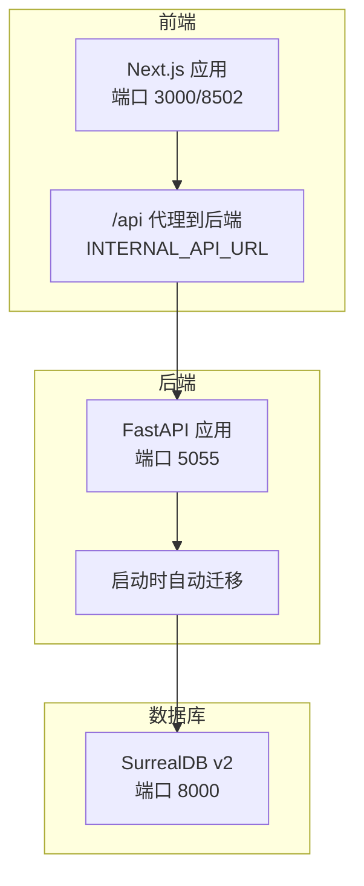
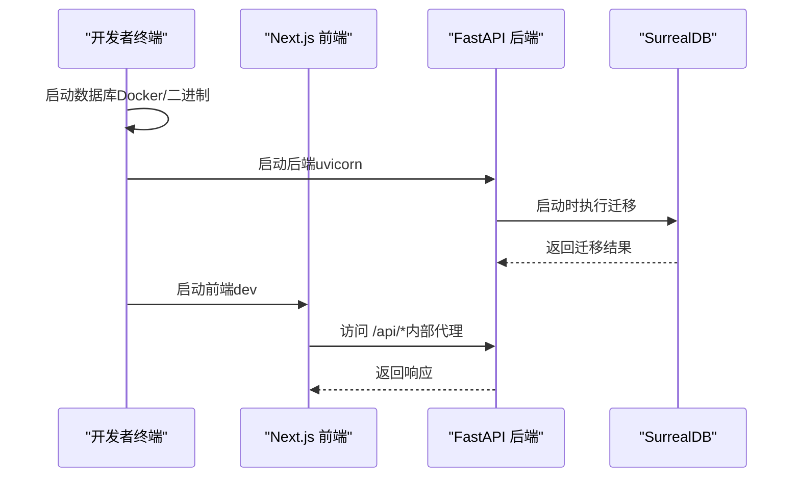
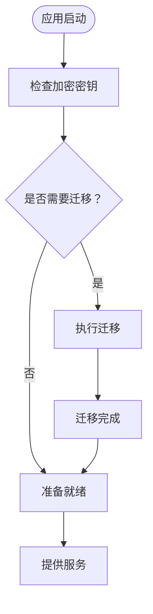
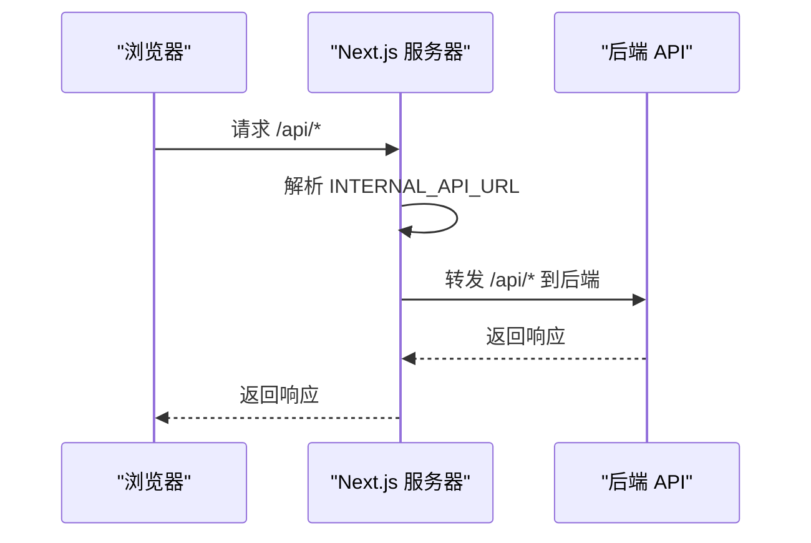
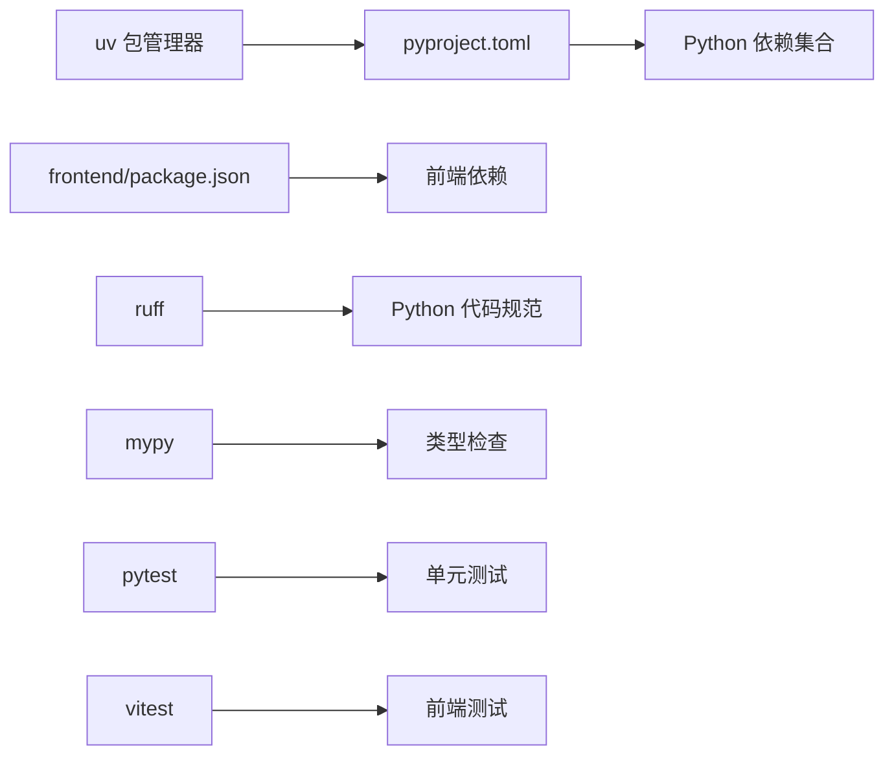

# 从源码部署

<cite>
**本文引用的文件**
- [README.md](file://README.md)
- [README.dev.md](file://README.dev.md)
- [docs/1-INSTALLATION/from-source.md](file://docs/1-INSTALLATION/from-source.md)
- [docs/7-DEVELOPMENT/development-setup.md](file://docs/7-DEVELOPMENT/development-setup.md)
- [Makefile](file://Makefile)
- [pyproject.toml](file://pyproject.toml)
- [frontend/package.json](file://frontend/package.json)
- [frontend/start-server.js](file://frontend/start-server.js)
- [frontend/next.config.ts](file://frontend/next.config.ts)
- [.env.example](file://.env.example)
- [docker-compose.yml](file://docker-compose.yml)
- [run_api.py](file://run_api.py)
- [api/main.py](file://api/main.py)
- [open_notebook/database/async_migrate.py](file://open_notebook/database/async_migrate.py)
- [open_notebook/database/migrate.py](file://open_notebook/database/migrate.py)
- [mypy.ini](file://mypy.ini)
</cite>

## 目录
1. [简介](#简介)
2. [项目结构](#项目结构)
3. [核心组件](#核心组件)
4. [架构总览](#架构总览)
5. [详细组件分析](#详细组件分析)
6. [依赖关系分析](#依赖关系分析)
7. [性能与开发体验](#性能与开发体验)
8. [故障排查指南](#故障排查指南)
9. [结论](#结论)
10. [附录](#附录)

## 简介
本指南面向开发者，提供基于源码的完整部署流程与开发工作流说明。通过本地直接运行后端 API、前端 Next.js 以及数据库（SurrealDB），你将获得对代码的完全控制权与强大的调试能力，适合日常迭代、功能开发与问题定位。

## 项目结构
Open Notebook 采用前后端分离的多模块组织方式：
- 后端 API：FastAPI 应用，负责路由、业务服务与数据库迁移
- 前端：Next.js 应用，提供用户界面与 API 代理
- 核心库：Python 包 open_notebook，封装领域模型、图编排、AI 集成与数据库操作
- 数据库：SurrealDB（通过 Docker 或二进制运行）
- 开发工具链：Makefile、uv、ruff、mypy、pytest、Vitest 等

图表来源
- [frontend/next.config.ts](file://frontend/next.config.ts#L15-L32)
- [api/main.py](file://api/main.py#L47-L96)
- [docker-compose.yml](file://docker-compose.yml#L1-L37)

章节来源
- [README.dev.md](file://README.dev.md#L355-L376)
- [docs/7-DEVELOPMENT/development-setup.md](file://docs/7-DEVELOPMENT/development-setup.md#L1-L20)

## 核心组件
- 后端 API（FastAPI）：提供 REST 路由、认证中间件、CORS、健康检查与自动数据库迁移
- 前端（Next.js）：开发模式下热重载，生产构建支持独立输出；通过 rewrites 将 /api/* 代理到后端
- 数据库（SurrealDB）：通过 Docker 快速启动或使用二进制运行
- 迁移系统：异步迁移管理器在启动时自动应用待处理迁移
- 开发工具链：Makefile 统一命令入口，uv 管理 Python 依赖，ruff/mypy/pytest/Vitest 等保障质量

章节来源
- [api/main.py](file://api/main.py#L1-L190)
- [frontend/next.config.ts](file://frontend/next.config.ts#L1-L36)
- [open_notebook/database/async_migrate.py](file://open_notebook/database/async_migrate.py#L1-L229)
- [Makefile](file://Makefile#L1-L210)

## 架构总览
从源码部署的典型开发栈如下：前端监听 3000（开发）或 8502（独立服务器），通过 /api 代理转发至后端 5055；后端启动时执行数据库迁移，连接本地或容器内的 SurrealDB。

图表来源
- [api/main.py](file://api/main.py#L47-L96)
- [frontend/next.config.ts](file://frontend/next.config.ts#L15-L32)
- [docker-compose.yml](file://docker-compose.yml#L1-L37)

## 详细组件分析

### 后端 API（FastAPI）
- 自动迁移：应用生命周期内自动检测并执行数据库迁移，失败则快速退出，确保数据库一致性
- 中间件：密码认证中间件（排除特定路径）、CORS 中间件
- 路由：按模块注册多个子路由，覆盖笔记本、笔记、搜索、转换、播客、凭据等
- 健康检查：根路径与 /health 响应

图表来源
- [api/main.py](file://api/main.py#L47-L96)
- [open_notebook/database/async_migrate.py](file://open_notebook/database/async_migrate.py#L165-L189)

章节来源
- [api/main.py](file://api/main.py#L1-L190)
- [open_notebook/database/async_migrate.py](file://open_notebook/database/async_migrate.py#L1-L229)

### 前端（Next.js）
- 开发模式：热重载监听 3000，便于实时调试
- 独立服务器：默认端口 8502，用于生产构建产物运行
- API 代理：/api/* 重写到后端 5055，简化反向代理配置
- 文件上传：提升代理体限制以支持较大文件

图表来源
- [frontend/next.config.ts](file://frontend/next.config.ts#L15-L32)
- [frontend/start-server.js](file://frontend/start-server.js#L1-L10)

章节来源
- [frontend/next.config.ts](file://frontend/next.config.ts#L1-L36)
- [frontend/start-server.js](file://frontend/start-server.js#L1-L10)

### 数据库（SurrealDB）
- 容器化：Docker Compose 提供一键启动与持久化卷
- 本地二进制：可直接运行内存或文件存储模式
- 连接参数：URL、用户名、密码、命名空间与数据库名

章节来源
- [docker-compose.yml](file://docker-compose.yml#L1-L37)
- [.env.example](file://.env.example#L16-L20)

### 迁移系统
- 异步迁移管理器：按序执行 up/down 迁移，记录版本
- 版本表：内部维护迁移版本记录，支持回滚

章节来源
- [open_notebook/database/async_migrate.py](file://open_notebook/database/async_migrate.py#L91-L229)
- [open_notebook/database/migrate.py](file://open_notebook/database/migrate.py#L1-L27)

### 启动脚本与进程控制
- run_api.py：统一入口，支持主机、端口与热重载开关
- Makefile：集中命令，如启动数据库、API、前端、Worker，状态查询与清理

章节来源
- [run_api.py](file://run_api.py#L1-L32)
- [Makefile](file://Makefile#L15-L172)

## 依赖关系分析
- Python 与包管理：使用 uv 管理依赖，pyproject.toml 指定最低 Python 版本与依赖清单
- 前端依赖：Next.js 与生态，测试使用 Vitest
- 类型检查：mypy 配置允许渐进式增强
- 开发工具：ruff 规范、pytest 测试、Makefile 统一任务

图表来源
- [pyproject.toml](file://pyproject.toml#L1-L100)
- [frontend/package.json](file://frontend/package.json#L1-L77)
- [mypy.ini](file://mypy.ini#L1-L37)
- [Makefile](file://Makefile#L25-L30)

章节来源
- [pyproject.toml](file://pyproject.toml#L1-L100)
- [frontend/package.json](file://frontend/package.json#L1-L77)
- [mypy.ini](file://mypy.ini#L1-L37)
- [Makefile](file://Makefile#L25-L30)

## 性能与开发体验
- 快速迭代：本地直接运行后端与前端，热重载与日志直出，调试更高效
- 资源占用：仅启动所需服务，避免容器化带来的额外开销
- 生产接近度：Docker Compose 与单容器镜像可用于验证部署一致性

章节来源
- [README.dev.md](file://README.dev.md#L25-L33)
- [docs/7-DEVELOPMENT/development-setup.md](file://docs/7-DEVELOPMENT/development-setup.md#L203-L229)

## 故障排查指南
- 服务无法启动
  - 使用状态命令查看各组件状态，必要时重启全部服务
  - 参考命令：查看状态、停止全部、重新启动
- 端口冲突
  - 查找占用端口的进程并释放，或调整端口
- 数据库连接问题
  - 确认数据库已运行、连接参数正确
- Docker 构建失败
  - 清理构建缓存并重置构建器，优先本地构建验证
- Python 版本过低
  - 使用指定版本的 uv 同步依赖
- npm 命令不可用
  - 安装 Node.js 并确保 PATH 正确
- 前端代理与上传限制
  - Next.js 已内置 /api 代理与较大的代理体限制，确认 INTERNAL_API_URL 设置

章节来源
- [README.dev.md](file://README.dev.md#L299-L352)
- [docs/1-INSTALLATION/from-source.md](file://docs/1-INSTALLATION/from-source.md#L140-L166)
- [frontend/next.config.ts](file://frontend/next.config.ts#L9-L13)

## 结论
从源码部署为开发者提供了最高自由度与最强调试能力。通过本地运行后端 API、前端与数据库，并结合 Makefile 的统一命令与 uv 的依赖管理，你可以实现快速迭代、稳定验证与高效协作。建议在日常开发中优先使用本地直跑模式，在发布前再进行 Docker 镜像验证。

## 附录

### 开发前置条件
- Python 3.11+（推荐使用 uv）
- Node.js 18+
- Git
- Docker（用于数据库容器）
- uv（Python 包管理器）

章节来源
- [docs/1-INSTALLATION/from-source.md](file://docs/1-INSTALLATION/from-source.md#L5-L12)
- [pyproject.toml](file://pyproject.toml#L12-L14)

### 克隆与初始化
- 克隆仓库并进入目录
- 复制示例环境文件
- 安装依赖（uv sync）
- 启动数据库、API、前端与 Worker（可选）

章节来源
- [docs/1-INSTALLATION/from-source.md](file://docs/1-INSTALLATION/from-source.md#L14-L26)
- [README.dev.md](file://README.dev.md#L5-L21)

### 环境变量配置
- 必填项：加密密钥、数据库连接参数
- 可选项：外部 API 地址、本地 Ollama、分块参数、基础认证

章节来源
- [.env.example](file://.env.example#L1-L60)

### 数据库初始化
- 方式一：Docker Compose 一键启动
- 方式二：Makefile 启动数据库
- 方式三：本地二进制运行
- 启动后端时自动执行迁移

章节来源
- [docker-compose.yml](file://docker-compose.yml#L1-L37)
- [Makefile](file://Makefile#L15-L16)
- [api/main.py](file://api/main.py#L66-L88)

### 开发服务器启动与热重载
- 后端：uvicorn 进程，支持 reload
- 前端：Next.js dev，端口 3000；独立服务器端口 8502
- API 代理：/api/* 重写到后端 5055

章节来源
- [run_api.py](file://run_api.py#L16-L31)
- [frontend/next.config.ts](file://frontend/next.config.ts#L15-L32)
- [frontend/start-server.js](file://frontend/start-server.js#L1-L10)

### 调试设置与测试运行
- 后端：使用 uvicorn 的 reload 与自定义端口
- 前端：Vitest 单测与 UI
- Python：pytest 单测
- 类型检查：mypy
- 代码规范：ruff

章节来源
- [run_api.py](file://run_api.py#L18-L20)
- [frontend/package.json](file://frontend/package.json#L5-L13)
- [pyproject.toml](file://pyproject.toml#L49-L70)
- [mypy.ini](file://mypy.ini#L1-L37)

### Makefile 常用命令与版本管理
- 服务管理：启动/停止数据库、API、前端、Worker，查看状态
- 构建与发布：本地构建镜像、推送版本标签、更新 latest 标签、打 Git Tag
- 质量与清理：格式化、类型检查、清理缓存

章节来源
- [Makefile](file://Makefile#L1-L210)
- [pyproject.toml](file://pyproject.toml#L2-L3)

### 最佳实践
- 日常开发使用本地直跑，配合热重载与直接日志
- 在提交前运行 ruff 与 mypy，保持代码风格一致
- 使用 pytest 与 Vitest 覆盖关键逻辑
- 发布前先本地构建镜像并验证
- 使用 Makefile 统一命令，减少环境差异

章节来源
- [README.dev.md](file://README.dev.md#L197-L211)
- [docs/7-DEVELOPMENT/development-setup.md](file://docs/7-DEVELOPMENT/development-setup.md#L230-L258)