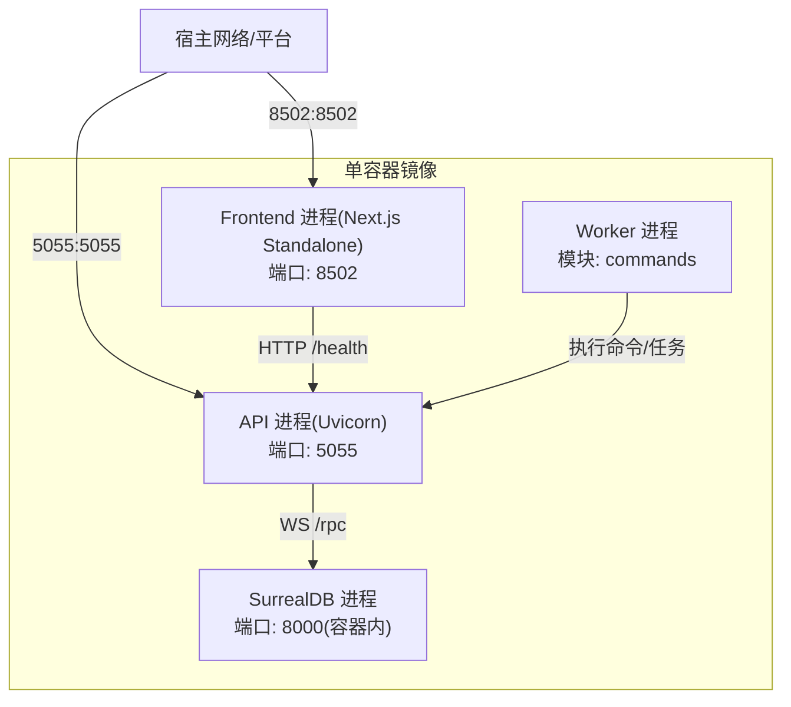
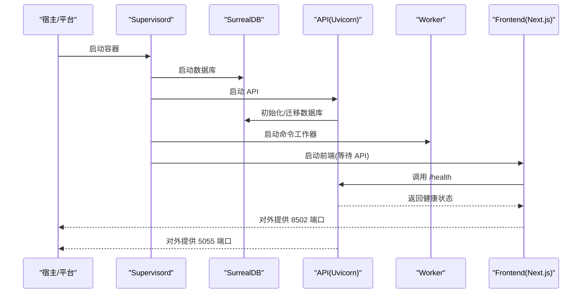
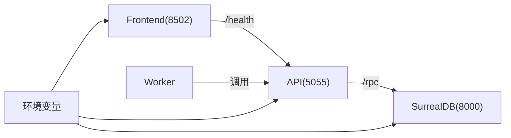

# 单容器部署

<cite>
**本文引用的文件**
- [Dockerfile.single](file://Dockerfile.single)
- [supervisord.single.conf](file://supervisord.single.conf)
- [examples/docker-compose-single.yml](file://examples/docker-compose-single.yml)
- [docs/1-INSTALLATION/single-container.md](file://docs/1-INSTALLATION/single-container.md)
- [scripts/wait-for-api.sh](file://scripts/wait-for-api.sh)
- [frontend/start-server.js](file://frontend/start-server.js)
- [api/main.py](file://api/main.py)
- [open_notebook/config.py](file://open_notebook/config.py)
- [docker-compose.yml](file://docker-compose.yml)
- [docs/5-CONFIGURATION/environment-reference.md](file://docs/5-CONFIGURATION/environment-reference.md)
- [docs/5-CONFIGURATION/advanced.md](file://docs/5-CONFIGURATION/advanced.md)
- [docs/5-CONFIGURATION/reverse-proxy.md](file://docs/5-CONFIGURATION/reverse-proxy.md)
- [run_api.py](file://run_api.py)
</cite>

## 目录
1. [简介](#简介)
2. [项目结构](#项目结构)
3. [核心组件](#核心组件)
4. [架构总览](#架构总览)
5. [详细组件分析](#详细组件分析)
6. [依赖关系分析](#依赖关系分析)
7. [性能考虑](#性能考虑)
8. [故障排查指南](#故障排查指南)
9. [结论](#结论)
10. [附录](#附录)

## 简介
本文件面向希望在共享主机或简单部署环境中快速上线 Open Notebook 的用户，系统性阐述“单容器部署”的简化架构、构建流程、服务管理策略、资源优化、环境变量与端口映射、数据持久化、进程管理、部署步骤、启动参数、日志与性能监控方法，并给出与多容器部署的对比分析与扩展建议。

单容器镜像将数据库（SurrealDB）、后端 API、命令工作器（surreal-commands-worker）与前端 Next.js 服务打包在同一容器内，通过进程管理器统一调度，适合平台限制仅支持单容器镜像的场景（如部分云平台、共享主机），以及最小化部署需求。

## 项目结构
单容器部署的关键文件与职责：
- 构建与运行时
  - Dockerfile.single：多阶段构建，包含前端构建、后端依赖安装、运行时依赖安装与服务编排。
  - supervisord.single.conf：定义四个进程（SurrealDB、API、Worker、Frontend），统一由 supervisord 管理。
- 启动脚本与等待逻辑
  - scripts/wait-for-api.sh：在启动前端前等待 API 健康检查接口可用。
  - frontend/start-server.js：设置默认端口并启动 Next.js Standalone Server。
  - run_api.py：本地开发时的 Uvicorn 启动脚本（单容器镜像中以 Uvicorn 运行 API）。
- 配置与示例
  - examples/docker-compose-single.yml：单容器镜像的完整 docker-compose 示例（含端口、卷、环境变量覆盖）。
  - docker-compose.yml：多容器部署参考（便于理解单容器差异）。
  - docs/1-INSTALLATION/single-container.md：官方单容器安装与使用说明。
  - docs/5-CONFIGURATION/environment-reference.md：环境变量参考。
  - docs/5-CONFIGURATION/advanced.md：高级配置（并发、重试、超时、日志）。
  - docs/5-CONFIGURATION/reverse-proxy.md：反向代理与多容器部署示例（可迁移至单容器思路）。
- 应用层
  - api/main.py：FastAPI 应用入口，含中间件、路由注册、健康检查、生命周期迁移。
  - open_notebook/config.py：应用数据目录、上传缓存、LangGraph 检查点等路径配置。

图表来源
- [Dockerfile.single](file://Dockerfile.single#L77-L81)
- [supervisord.single.conf](file://supervisord.single.conf#L7-L52)
- [examples/docker-compose-single.yml](file://examples/docker-compose-single.yml#L7-L18)

章节来源
- [Dockerfile.single](file://Dockerfile.single#L1-L81)
- [supervisord.single.conf](file://supervisord.single.conf#L1-L52)
- [examples/docker-compose-single.yml](file://examples/docker-compose-single.yml#L1-L23)
- [docker-compose.yml](file://docker-compose.yml#L1-L37)

## 核心组件
- 数据库（SurrealDB）
  - 在单容器中以内置 RocksDB 文件存储方式运行，端口 8000（容器内），通过 supervisord 管理。
- API 服务（Uvicorn）
  - 绑定 0.0.0.0:5055，提供 REST API 与健康检查；内置密码认证中间件与 CORS 中间件。
- 命令工作器（surreal-commands-worker）
  - 加载 commands 模块，异步执行后台任务；由 supervisord 管理。
- 前端（Next.js Standalone）
  - 绑定 0.0.0.0:8502，通过 wait-for-api.sh 等待 API 可用后再启动；通过环境变量控制 API 访问地址。

章节来源
- [supervisord.single.conf](file://supervisord.single.conf#L7-L52)
- [api/main.py](file://api/main.py#L99-L190)
- [frontend/start-server.js](file://frontend/start-server.js#L1-L10)
- [scripts/wait-for-api.sh](file://scripts/wait-for-api.sh#L1-L23)

## 架构总览
单容器部署采用“一体化容器 + 进程管理器”的模式，所有服务在同一容器内运行，通过 supervisord 统一启动顺序、健康检查与自动重启。前端通过 wait-for-api.sh 确保在 API 就绪后再启动，避免启动初期连接失败。

图表来源
- [supervisord.single.conf](file://supervisord.single.conf#L7-L52)
- [scripts/wait-for-api.sh](file://scripts/wait-for-api.sh#L1-L23)
- [api/main.py](file://api/main.py#L187-L190)

## 详细组件分析

### 构建与运行时镜像（Dockerfile.single）
- 多阶段构建
  - 前端构建阶段：使用 Node.js 基础镜像，复制依赖与源码，执行构建，输出静态产物。
  - 后端构建阶段：使用 Python 基础镜像，安装构建工具与 uv，基于 pyproject.toml/uv.lock 安装生产依赖到虚拟环境。
  - 运行时阶段：安装运行时依赖（FFmpeg、Supervisor、NodeJS、SurrealDB、curl），复制后端虚拟环境与前端构建产物，设置环境变量与权限，暴露端口，设置 CMD 启动 supervisord。
- 关键点
  - HOSTNAME 设置为 0.0.0.0，确保容器网络与反向代理可达。
  - 创建 /app/data 与 /mydata 目录用于应用数据与数据库数据持久化。
  - 复制 wait-for-api.sh 并赋予可执行权限。
  - 暴露 8502（前端）与 5055（API）端口。
  - CMD 使用 supervisord 读取 supervisord.single.conf。

章节来源
- [Dockerfile.single](file://Dockerfile.single#L1-L81)

### 进程管理（supervisord.single.conf）
- 进程定义
  - surrealdb：以 RocksDB 方式启动数据库，自动重启，优先级较低。
  - api：Uvicorn 运行 FastAPI 应用，绑定 0.0.0.0:5055，自动重启。
  - worker：加载 commands 模块，执行后台命令，自动重启。
  - frontend：启动 wait-for-api.sh 等待 API 可用后启动 Next.js Standalone Server，传递 API_URL/NEXT_PUBLIC_API_URL/INTERNAL_API_URL 等环境变量。
- 日志与重启策略
  - stdout/stderr 输出到容器日志，无大小限制。
  - autorestart=true，优先级递增，保证启动顺序与稳定性。

章节来源
- [supervisord.single.conf](file://supervisord.single.conf#L1-L52)

### 前端启动与等待机制（frontend/start-server.js 与 wait-for-api.sh）
- 前端启动
  - 若未设置 PORT，默认 8502，然后启动 Next.js Standalone Server。
- API 等待
  - wait-for-api.sh 默认等待 INTERNAL_API_URL（默认 http://localhost:5055）的 /health 接口，最多重试若干次，成功后启动前端；即使超时也继续启动前端，避免完全阻塞。

章节来源
- [frontend/start-server.js](file://frontend/start-server.js#L1-L10)
- [scripts/wait-for-api.sh](file://scripts/wait-for-api.sh#L1-L23)

### API 生命周期与健康检查（api/main.py）
- 生命周期
  - 启动时进行数据库迁移，失败则快速退出，避免 schema 不一致。
  - 支持自定义异常处理器，确保错误响应包含 CORS 头。
- 中间件
  - 密码认证中间件（排除 /health、/docs 等）。
  - CORS 中间件允许跨域访问。
- 路由
  - 注册多个业务路由模块。
- 健康检查
  - 提供 /health 接口返回健康状态。

章节来源
- [api/main.py](file://api/main.py#L47-L97)
- [api/main.py](file://api/main.py#L105-L127)
- [api/main.py](file://api/main.py#L157-L180)
- [api/main.py](file://api/main.py#L187-L190)

### 应用数据与上传缓存（open_notebook/config.py）
- 数据目录
  - DATA_FOLDER 默认 ./data，用于 SQLite 检查点、上传缓存、tiktoken 缓存等。
- 影响
  - 单容器部署需通过卷挂载 /app/data 以实现持久化。

章节来源
- [open_notebook/config.py](file://open_notebook/config.py#L1-L18)

### 端口映射与环境变量
- 端口
  - 8502：前端 Next.js（容器内 8502）
  - 5055：API（容器内 5055）
  - 8000：数据库（容器内 8000，单容器内部使用）
- 环境变量（关键项）
  - OPEN_NOTEBOOK_ENCRYPTION_KEY：加密凭据所需密钥（必填）。
  - SURREAL_URL/SURREAL_USER/SURREAL_PASSWORD/SURREAL_NAMESPACE/SURREAL_DATABASE：数据库连接信息。
  - API_URL/INTERNAL_API_URL：前端访问 API 的外部与内部 URL。
  - 其他高级配置：如 API_CLIENT_TIMEOUT、SURREAL_COMMANDS_MAX_TASKS、TTS_BATCH_SIZE 等。

章节来源
- [Dockerfile.single](file://Dockerfile.single#L77-L81)
- [examples/docker-compose-single.yml](file://examples/docker-compose-single.yml#L7-L18)
- [docs/5-CONFIGURATION/environment-reference.md](file://docs/5-CONFIGURATION/environment-reference.md#L9-L31)
- [docs/5-CONFIGURATION/advanced.md](file://docs/5-CONFIGURATION/advanced.md#L7-L89)

### 数据持久化与卷挂载
- 单容器卷
  - /app/data：应用数据（SQLite 检查点、上传缓存等）。
  - /mydata：SurrealDB RocksDB 数据文件。
- 多容器卷
  - 参考 docker-compose.yml 中的命名卷与挂载方式。

章节来源
- [Dockerfile.single](file://Dockerfile.single#L65-L66)
- [examples/docker-compose-single.yml](file://examples/docker-compose-single.yml#L15-L17)
- [docker-compose.yml](file://docker-compose.yml#L8-L32)

### 部署步骤与启动参数
- 快速开始（本地/平台）
  - 使用官方单容器镜像，映射 8502/5055 端口，设置 OPEN_NOTEBOOK_ENCRYPTION_KEY，挂载 /app/data 与 /mydata。
  - 或使用 examples/docker-compose-single.yml 构建镜像并运行。
- 启动参数
  - API：通过环境变量控制主机、端口、是否热重载（开发用途）。
  - 前端：通过 PORT 控制端口。
  - 数据库：通过 SURREAL_* 环境变量配置连接与命名空间。

章节来源
- [docs/1-INSTALLATION/single-container.md](file://docs/1-INSTALLATION/single-container.md#L17-L53)
- [examples/docker-compose-single.yml](file://examples/docker-compose-single.yml#L1-L23)
- [run_api.py](file://run_api.py#L16-L31)

## 依赖关系分析
- 进程耦合
  - Frontend 依赖 API 的 /health 接口可用；API 依赖数据库完成迁移。
  - Worker 依赖 API 注册的命令模块。
- 外部依赖
  - FFmpeg：音频处理。
  - Supervisor：进程管理。
  - SurrealDB：嵌入式数据库（RocksDB）。
- 环境变量契约
  - API_URL/INTERNAL_API_URL 决定前端如何访问 API。
  - SURREAL_* 决定数据库连接与命名空间。

图表来源
- [supervisord.single.conf](file://supervisord.single.conf#L7-L52)
- [api/main.py](file://api/main.py#L187-L190)
- [docs/5-CONFIGURATION/environment-reference.md](file://docs/5-CONFIGURATION/environment-reference.md#L9-L31)

章节来源
- [supervisord.single.conf](file://supervisord.single.conf#L1-L52)
- [api/main.py](file://api/main.py#L187-L190)
- [docs/5-CONFIGURATION/environment-reference.md](file://docs/5-CONFIGURATION/environment-reference.md#L9-L31)

## 性能考虑
- 并发与重试
  - 通过 SURREAL_COMMANDS_MAX_TASKS 控制并发任务数；推荐指数抖动重试策略以避免惊群效应。
- 超时配置
  - API_CLIENT_TIMEOUT 与 LLM 超时应合理设置，避免请求被反向代理提前截断。
- 批处理
  - TTS_BATCH_SIZE 控制并发 TTS 请求，按提供商能力调整。
- 日志级别
  - 生产环境建议降低日志级别，避免 IO 抖动；调试时开启更详细的日志。

章节来源
- [docs/5-CONFIGURATION/advanced.md](file://docs/5-CONFIGURATION/advanced.md#L7-L89)

## 故障排查指南
- 前端无法连接 API
  - 检查 INTERNAL_API_URL 是否指向容器内 API 地址（默认 http://localhost:5055）。
  - 查看 wait-for-api.sh 的等待日志与最大重试次数。
- API 无法启动或迁移失败
  - 查看 API 进程日志，确认数据库迁移是否成功。
  - 检查 SURREAL_* 环境变量与数据库文件权限。
- 端口冲突或不可达
  - 确认 8502/5055 已正确映射到宿主。
  - 如使用反向代理，确保代理转发到容器内对应端口。
- 数据丢失或损坏
  - 检查 /app/data 与 /mydata 卷挂载是否正确，权限是否允许写入。

章节来源
- [scripts/wait-for-api.sh](file://scripts/wait-for-api.sh#L1-L23)
- [api/main.py](file://api/main.py#L66-L88)
- [examples/docker-compose-single.yml](file://examples/docker-compose-single.yml#L7-L18)

## 结论
单容器部署以“一体化镜像 + 进程管理器”实现最小化部署，适合共享主机、平台限制单容器镜像、以及快速验证场景。其优势在于简单易用、资源占用相对较低；劣势在于扩展性有限、故障隔离差。对于需要更高弹性与可观测性的场景，建议迁移到多容器部署并通过反向代理统一入口。

## 附录

### 单容器 vs 多容器对比
- 单容器
  - 优点：部署简单、资源占用低、平台适配好。
  - 局限：扩展性差、故障隔离弱、难以独立升级组件。
- 多容器
  - 优点：服务解耦、易于扩展、可观测性强。
  - 局限：配置复杂度高、需要网络与卷管理。

章节来源
- [docs/1-INSTALLATION/single-container.md](file://docs/1-INSTALLATION/single-container.md#L116-L125)
- [docker-compose.yml](file://docker-compose.yml#L1-L37)
- [docs/5-CONFIGURATION/reverse-proxy.md](file://docs/5-CONFIGURATION/reverse-proxy.md#L160-L192)

### 环境变量清单（关键）
- OPEN_NOTEBOOK_ENCRYPTION_KEY：加密凭据密钥（必填）
- SURREAL_URL/SURREAL_USER/SURREAL_PASSWORD/SURREAL_NAMESPACE/SURREAL_DATABASE：数据库连接
- API_URL/INTERNAL_API_URL：前端访问 API 的外部与内部 URL
- API_HOST/API_PORT/API_RELOAD：API 主机、端口与热重载（开发）
- 其他高级：API_CLIENT_TIMEOUT、SURREAL_COMMANDS_MAX_TASKS、TTS_BATCH_SIZE、LOGLEVEL/RUST_LOG 等

章节来源
- [docs/5-CONFIGURATION/environment-reference.md](file://docs/5-CONFIGURATION/environment-reference.md#L9-L31)
- [docs/5-CONFIGURATION/advanced.md](file://docs/5-CONFIGURATION/advanced.md#L7-L89)
- [run_api.py](file://run_api.py#L16-L31)