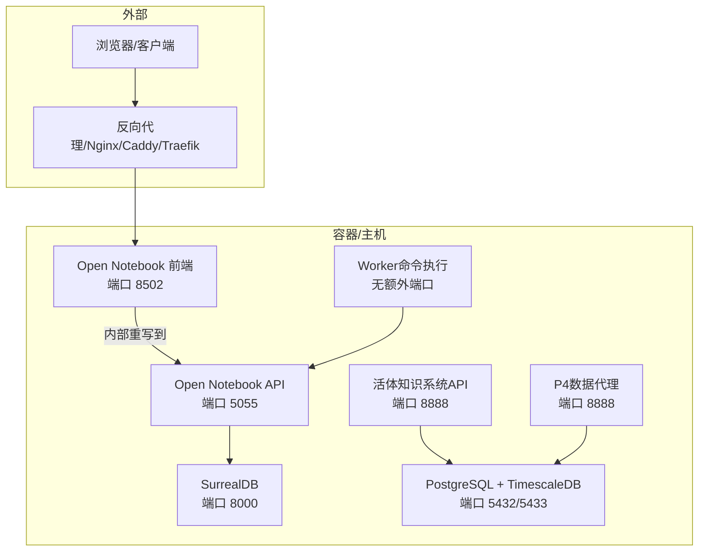
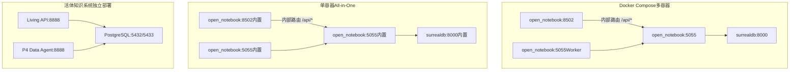
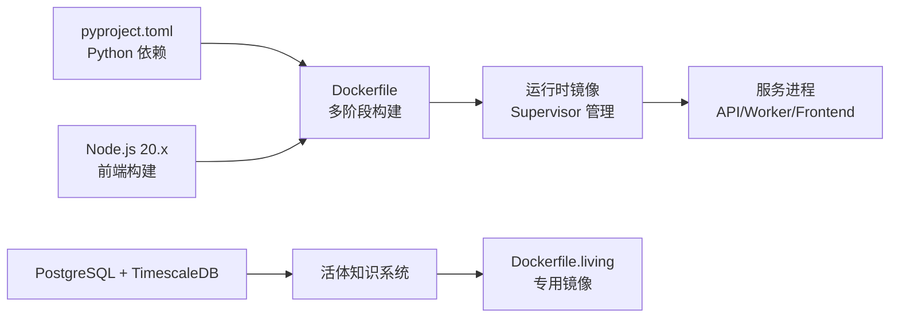

# 安装与部署

<cite>
**本文引用的文件**
- [README.md](file://README.md)
- [docker-compose.yml](file://docker-compose.yml)
- [Dockerfile](file://Dockerfile)
- [Dockerfile.single](file://Dockerfile.single)
- [Dockerfile.living](file://Dockerfile.living)
- [.env.example](file://.env.example)
- [pyproject.toml](file://pyproject.toml)
- [docs/1-INSTALLATION/index.md](file://docs/1-INSTALLATION/index.md)
- [docs/1-INSTALLATION/docker-compose.md](file://docs/1-INSTALLATION/docker-compose.md)
- [docs/1-INSTALLATION/single-container.md](file://docs/1-INSTALLATION/single-container.md)
- [docs/1-INSTALLATION/from-source.md](file://docs/1-INSTALLATION/from-source.md)
- [examples/docker-compose-ollama.yml](file://examples/docker-compose-ollama.yml)
- [examples/docker-compose-single.yml](file://examples/docker-compose-single.yml)
- [docs/5-CONFIGURATION/environment-reference.md](file://docs/5-CONFIGURATION/environment-reference.md)
- [docs/5-CONFIGURATION/security.md](file://docs/5-CONFIGURATION/security.md)
- [docs/5-CONFIGURATION/reverse-proxy.md](file://docs/5-CONFIGURATION/reverse-proxy.md)
- [docs/5-CONFIGURATION/advanced.md](file://docs/5-CONFIGURATION/advanced.md)
- [supervisord.conf](file://supervisord.conf)
- [supervisord.single.conf](file://supervisord.single.conf)
- [docker-compose.living.yml](file://docker-compose.living.yml)
- [docs/living_system_architecture.md](file://docs/living_system_architecture.md)
- [docs/living_system_implementation_summary.md](file://docs/living_system_implementation_summary.md)
- [scripts/start_living.sh](file://scripts/start_living.sh)
- [scripts/living_system.bat](file://scripts/living_system.bat)
- [open_notebook/skills/living/README.md](file://open_notebook/skills/living/README.md)
- [open_notebook/skills/living/api_server.py](file://open_notebook/skills/living/api_server.py)
- [open_notebook/skills/living/examples/p0_perception_organ.py](file://open_notebook/skills/living/examples/p0_perception_organ.py)
</cite>

## 目录
1. [简介](#简介)
2. [项目结构](#项目结构)
3. [核心组件](#核心组件)
4. [架构总览](#架构总览)
5. [详细组件分析](#详细组件分析)
6. [活体知识系统部署](#活体知识系统部署)
7. [依赖关系分析](#依赖关系分析)
8. [性能考虑](#性能考虑)
9. [故障排查指南](#故障排查指南)
10. [结论](#结论)
11. [附录](#附录)

## 简介
本指南面向不同技术背景与运维需求的用户，提供 Open Notebook 的完整安装与部署方案，覆盖以下部署方式：
- Docker Compose 多容器部署（推荐用于大多数用户）
- 单容器部署（适合共享主机或特定平台限制）
- 从源码编译部署（开发者与贡献者）
- **新增：活体知识系统独立部署**（专门的知识管理系统）

同时，文档涵盖生产环境最佳实践、性能调优、安全加固、网络与反向代理配置、数据库设置、环境变量说明、部署后验证与常见问题排查。

## 项目结构
Open Notebook 采用前后端分离与多服务协同的架构：
- 前端：Next.js（静态构建产物 + 服务器端运行）
- 后端：FastAPI（REST API）
- 数据库：SurrealDB（嵌入式存储）
- 运行时编排：Supervisor（统一管理 API、Worker、前端进程）
- **新增：活体知识系统**：独立的生物启发式智能体架构，提供专门的知识管理系统



**图表来源**
- [docker-compose.yml](file://docker-compose.yml#L1-L37)
- [docker-compose.living.yml](file://docker-compose.living.yml#L1-L148)
- [supervisord.conf](file://supervisord.conf#L1-L41)
- [supervisord.single.conf](file://supervisord.single.conf#L1-L52)

**章节来源**
- [docker-compose.yml](file://docker-compose.yml#L1-L37)
- [Dockerfile](file://Dockerfile#L88-L114)
- [Dockerfile.single](file://Dockerfile.single#L77-L81)
- [Dockerfile.living](file://Dockerfile.living#L1-L70)
- [supervisord.conf](file://supervisord.conf#L7-L41)
- [supervisord.single.conf](file://supervisord.single.conf#L7-L52)

## 核心组件
- 前端（Next.js）
  - 暴露端口：8502（Docker 部署），开发模式默认 3000
  - 绑定地址：0.0.0.0（确保可被反向代理访问）
- 后端（FastAPI）
  - 暴露端口：5055（Docker 部署）
  - 内部通过 Supervisor 管理，自动重启与日志输出
- 数据库（SurrealDB）
  - 暴露端口：8000（仅容器内访问或受防火墙保护）
  - 使用 RocksDB 存储，支持持久化卷
- Worker（命令执行）
  - 由 surreal-commands-worker 提供，负责异步任务处理
- **新增：活体知识系统**
  - **API服务**：暴露端口 8888，提供 RESTful API
  - **数据库**：PostgreSQL + TimescaleDB，端口 5432/5433
  - **数据代理**：P4 Data Agent，负责数据生命周期管理
  - **架构**：基于五层生物启发式架构（细胞层、组织层、器官层、经络层、穴位层）

**章节来源**
- [Dockerfile](file://Dockerfile#L79-L89)
- [Dockerfile.single](file://Dockerfile.single#L62-L78)
- [Dockerfile.living](file://Dockerfile.living#L52-L69)
- [supervisord.conf](file://supervisord.conf#L7-L41)
- [supervisord.single.conf](file://supervisord.single.conf#L7-L52)

## 架构总览
下图展示 Docker Compose 与单容器两种部署形态的关键差异与交互：



**图表来源**
- [docker-compose.yml](file://docker-compose.yml#L1-L37)
- [docker-compose.living.yml](file://docker-compose.living.yml#L1-L148)
- [Dockerfile.single](file://Dockerfile.single#L34-L81)
- [Dockerfile.living](file://Dockerfile.living#L29-L70)
- [supervisord.single.conf](file://supervisord.single.conf#L7-L52)

## 详细组件分析

### Docker Compose 多容器部署（推荐）
- 适用场景
  - 多数用户、需要清晰的服务边界与扩展性
  - 支持本地开发与生产环境
- 关键特性
  - 分离数据库与应用，便于备份与迁移
  - 默认端口映射：8502（前端）、5055（API）、8000（数据库）
  - 支持 Ollama 本地模型示例
- 快速开始
  - 下载官方 compose 文件或按示例手动创建
  - 修改加密密钥与数据库连接参数
  - 启动并等待服务就绪
  - 访问前端：http://localhost:8502
  - 配置 AI 提供商凭据（Settings → API Keys）
- 常见任务
  - 停止：docker compose down
  - 查看日志：docker compose logs -f
  - 更新镜像：docker compose pull && up -d
  - 清理数据：docker compose down -v
- 环境变量参考
  - OPEN_NOTEBOOK_ENCRYPTION_KEY：必须，用于加密数据库中的凭据
  - SURREAL_URL/SURREAL_USER/SURREAL_PASSWORD/SURREAL_NAMESPACE/SURREAL_DATABASE：数据库连接
  - API_URL：反向代理场景下的外部 API 地址
- 生产建议
  - 反向代理 + HTTPS
  - 密码保护（OPEN_NOTEBOOK_PASSWORD）
  - 严格的防火墙策略（仅暴露前端端口，隐藏数据库与 API 端口）

**章节来源**
- [docs/1-INSTALLATION/docker-compose.md](file://docs/1-INSTALLATION/docker-compose.md#L1-L357)
- [docker-compose.yml](file://docker-compose.yml#L1-L37)
- [examples/docker-compose-ollama.yml](file://examples/docker-compose-ollama.yml#L1-L64)
- [docs/5-CONFIGURATION/environment-reference.md](file://docs/5-CONFIGURATION/environment-reference.md#L9-L31)
- [docs/5-CONFIGURATION/security.md](file://docs/5-CONFIGURATION/security.md#L80-L113)
- [docs/5-CONFIGURATION/reverse-proxy.md](file://docs/5-CONFIGURATION/reverse-proxy.md#L117-L131)

### 单容器部署（适合共享主机与特定平台）
- 适用场景
  - 平台限制仅允许单一容器（如 PikaPods、Railway、Render 等）
  - 轻量部署与快速上线
- 关键特性
  - 所有服务打包在一个容器中（SurrealDB、API、Worker、前端）
  - 默认端口：8502（前端）、5055（API）
  - 需要持久化卷：/app/data 与 /mydata
- 快速开始
  - 使用官方单容器镜像或基于 Dockerfile.single 构建
  - 设置 OPEN_NOTEBOOK_ENCRYPTION_KEY 与数据库连接
  - 在平台控制台添加持久化磁盘（/app/data 与 /mydata）
  - 配置 AI 提供商凭据
- 与 Docker Compose 的差异
  - 单容器内存占用更低，但扩展性有限
  - 服务耦合度更高，升级与迁移需整体考虑

**章节来源**
- [docs/1-INSTALLATION/single-container.md](file://docs/1-INSTALLATION/single-container.md#L1-L136)
- [Dockerfile.single](file://Dockerfile.single#L1-L81)
- [supervisord.single.conf](file://supervisord.single.conf#L1-L52)

### 从源码编译部署（开发者）
- 适用场景
  - 开发调试、功能定制、贡献代码
- 前置条件
  - Python 3.11+、Node.js 18+、Git、Docker（用于数据库）
  - 推荐使用 uv 管理依赖
- 快速流程
  - 克隆仓库并安装依赖
  - 启动 SurrealDB（或使用 docker compose up surrealdb）
  - 复制 .env.example 为 .env 并设置 OPEN_NOTEBOOK_ENCRYPTION_KEY
  - 启动 API（uvicorn）与前端（Next.js dev）
  - 访问 http://localhost:3000（前端）与 http://localhost:5055/docs（API 文档）
- 开发工作流
  - 代码质量：ruff 格式与检查、mypy 类型检查
  - 测试：pytest
  - 常用命令：make start-all、make api、make database

**章节来源**
- [docs/1-INSTALLATION/from-source.md](file://docs/1-INSTALLATION/from-source.md#L1-L181)
- [.env.example](file://.env.example#L1-L60)
- [pyproject.toml](file://pyproject.toml#L1-L99)

## 活体知识系统部署

### 概述
活体知识系统是一个独立的生物启发式智能体架构，提供专门的知识管理系统。该系统采用五层架构设计，模拟人体组织的自组织、自运行特性，适用于需要复杂知识处理和自动化决策的场景。

### 架构特点
- **五层架构**：细胞层（Skill）、组织层（Agent）、器官层（System）、经络层（Meridian）、穴位层（Trigger）
- **自组织**：Skill 细胞可自主决定何时执行（基于时序）
- **自愈合**：Agent 组织监控 Skill 健康状态，自动重试失败任务
- **可扩展**：新增 Skill/Agent 只需注册到相应 Registry
- **松耦合**：Meridians 实现组件间解耦通信

### 独立部署方式

#### Docker Compose 部署（推荐）
- **适用场景**：生产环境、需要完整监控和管理
- **关键特性**
  - PostgreSQL + TimescaleDB 数据库集群
  - 完整的健康检查和自动重启机制
  - 支持 pgAdmin 数据库管理界面
  - 独立的日志卷管理
- **快速开始**
  ```bash
  # 启动完整服务栈
  docker-compose -f docker-compose.living.yml up -d
  
  # 查看服务状态
  docker-compose -f docker-compose.living.yml ps
  
  # 查看日志
  docker-compose -f docker-compose.living.yml logs -f
  
  # 停止服务
  docker-compose -f docker-compose.living.yml down
  ```
- **端口映射**
  - 8888: API 服务（活体知识系统）
  - 5433: PostgreSQL 数据库（避免与系统数据库冲突）
  - 5050: pgAdmin 数据库管理界面（可选）

#### 本地开发部署
- **适用场景**：开发调试、快速验证
- **启动方式**
  ```bash
  # 使用脚本启动（推荐）
  ./scripts/start_living.sh dev
  
  # 或直接启动
  export LIVING_DB_HOST=localhost
  export LIVING_DB_PORT=5433
  export LIVING_PORT=8888
  python -m open_notebook.skills.living.api_server
  ```

#### Windows 用户部署
```cmd
REM 启动服务
.\scripts\living_system.bat up

REM 查看日志
.\scripts\living_system.bat logs

REM 连接到数据库
.\scripts\living_system.bat psql

REM 停止服务
.\scripts\living_system.bat down
```

### 环境变量配置
- **数据库连接**
  - LIVING_DB_HOST: 数据库主机地址（默认：postgres）
  - LIVING_DB_PORT: 数据库端口（默认：5432）
  - LIVING_DB_NAME: 数据库名称（默认：living_system）
  - LIVING_DB_USER: 数据库用户名（默认：living）
  - LIVING_DB_PASSWORD: 数据库密码（默认：living）

- **服务配置**
  - LIVING_HOST: API 主机地址（默认：0.0.0.0）
  - LIVING_PORT: API 端口（默认：8888）

- **功能开关**
  - LIVING_P0_ENABLED: 是否启用 P0 感知系统（默认：true）
  - LIVING_P0_SYNC_HOUR: P0 同步时间（默认：9）
  - LIVING_DATA_ENABLED: 是否启用数据功能（默认：true）

- **日志配置**
  - LOG_LEVEL: 日志级别（默认：INFO）

### API 端点
系统提供完整的 RESTful API：

| 端点 | 方法 | 功能 |
|------|------|------|
| `/` | GET | 系统信息 |
| `/health` | GET | 健康检查 |
| `/stats` | GET | 系统统计 |
| `/cells` | GET | 列出所有Skill |
| `/cells/{id}` | GET | Skill详情 |
| `/cells/{id}/invoke` | POST | 执行Skill |
| `/agents` | GET | 列出所有Agent |
| `/agents/{id}/execute` | POST | 执行Agent |
| `/agents/{id}/stimulate` | POST | 刺激Agent |
| `/triggers` | GET | 列出触发器 |
| `/triggers/{id}/activate` | POST | 激活触发器 |
| `/meridians` | GET | 经络状态 |
| `/data/lineage/{id}` | GET | 数据血缘 |

### 数据库设计
系统使用 PostgreSQL + TimescaleDB 组合：

- **核心表结构**
  - `cell_states`: 存储 Skill 状态
  - `agent_states`: 存储 Agent 状态
  - `meridian_metrics`: 经络指标（TimescaleDB 超表）
  - `trigger_records`: 触发器记录
  - `data_lineage`: 数据血缘关系

- **时序数据优化**
  - 使用 TimescaleDB 处理时间序列数据
  - 自动分区管理，支持长期历史数据存储

### 部署验证
- **健康检查**
  ```bash
  curl http://localhost:8888/health
  ```

- **API 文档**
  - 访问 http://localhost:8888/docs 查看接口文档

- **数据库连接**
  ```bash
  # 连接到 PostgreSQL
  docker exec -it living_postgres psql -U living -d living_system
  
  # 查看表结构
  \dt
  ```

### 常见任务
- **重置数据**
  ```bash
  # 清空所有数据（谨慎使用）
  ./scripts/start_living.sh reset
  ```

- **查看日志**
  ```bash
  # 实时查看日志
  ./scripts/start_living.sh logs
  ```

- **停止服务**
  ```bash
  # 停止所有服务
  ./scripts/start_living.sh stop
  ```

**章节来源**
- [docker-compose.living.yml](file://docker-compose.living.yml#L1-L148)
- [Dockerfile.living](file://Dockerfile.living#L1-L70)
- [docs/living_system_architecture.md](file://docs/living_system_architecture.md#L1-L264)
- [docs/living_system_implementation_summary.md](file://docs/living_system_implementation_summary.md#L1-L154)
- [scripts/start_living.sh](file://scripts/start_living.sh#L1-L77)
- [scripts/living_system.bat](file://scripts/living_system.bat#L1-L94)
- [open_notebook/skills/living/README.md](file://open_notebook/skills/living/README.md#L1-L286)
- [open_notebook/skills/living/api_server.py](file://open_notebook/skills.living/api_server.py#L1-L200)
- [open_notebook/skills.living/examples/p0_perception_organ.py](file://open_notebook/skills.living/examples/p0_perception_organ.py#L1-L200)

### 环境变量与配置要点
- **必填项**
  - OPEN_NOTEBOOK_ENCRYPTION_KEY：凭据加密密钥（强烈建议强口令）
- **数据库（SurrealDB）**
  - SURREAL_URL、SURREAL_USER、SURREAL_PASSWORD、SURREAL_NAMESPACE、SURREAL_DATABASE
- **活体知识系统数据库（PostgreSQL）**
  - LIVING_DB_HOST、LIVING_DB_PORT、LIVING_DB_NAME、LIVING_DB_USER、LIVING_DB_PASSWORD
- **反向代理与网络**
  - API_URL：前端访问 API 的外部 URL（务必带 https://）
  - HOSTNAME：Docker 中默认 0.0.0.0，确保可被反向代理访问
- **性能与并发**
  - SURREAL_COMMANDS_MAX_TASKS：并发数据库任务数
  - API_CLIENT_TIMEOUT、ESPERANTO_LLM_TIMEOUT：超时配置
- **安全**
  - OPEN_NOTEBOOK_PASSWORD：实例级密码保护（Basic Auth）
  - HTTPS：始终在生产环境启用 TLS
- **活体知识系统特性**
  - LIVING_P0_ENABLED、LIVING_DATA_ENABLED：功能开关
  - LIVING_P0_SYNC_HOUR：P0 同步时间配置

**章节来源**
- [docs/5-CONFIGURATION/environment-reference.md](file://docs/5-CONFIGURATION/environment-reference.md#L1-L275)
- [docs/5-CONFIGURATION/advanced.md](file://docs/5-CONFIGURATION/advanced.md#L1-L545)
- [docs/5-CONFIGURATION/security.md](file://docs/5-CONFIGURATION/security.md#L1-L397)
- [docker-compose.living.yml](file://docker-compose.living.yml#L46-L61)

### 反向代理与域名配置
- **简化说明**
  - v1.1+ 版本使用 Next.js 重写，只需代理前端端口 8502，内部自动转发 /api/* 到后端 5055
  - **活体知识系统**：可直接代理 8888 端口，无需内部路由
- **常见方案**
  - Nginx：设置 HTTPS、上传大小限制、WebSocket 升级头
  - Caddy：自动 HTTPS，长连接超时配置
  - Traefik：静态配置 serversTransport 超时，动态标签路由
- **关键点**
  - 显式设置 API_URL（含协议与域名）
  - 长耗时操作（内容处理、播客生成、数据处理）需足够超时
  - 文件上传超过默认大小时，需在反向代理层调整限制

**章节来源**
- [docs/5-CONFIGURATION/reverse-proxy.md](file://docs/5-CONFIGURATION/reverse-proxy.md#L1-L800)

### 安全配置与最佳实践
- **凭据加密**
  - 使用 OPEN_NOTEBOOK_ENCRYPTION_KEY 加密数据库中的 API 凭据
  - Docker Secrets 支持（_FILE 后缀）
- **实例保护**
  - OPEN_NOTEBOOK_PASSWORD：启用密码保护
  - 仅在公网暴露前端端口，隐藏数据库与 API 端口
- **企业级加固**
  - 反向代理 + 强 TLS
  - 防火墙规则、速率限制、审计日志（自建）
- **认证与授权**
  - 基于密码的会话保护（非企业级 RBAC）
  - API 请求需携带 Bearer Token（密码）
- **活体知识系统安全**
  - 数据库访问控制（PostgreSQL 用户权限）
  - API 访问控制（可扩展中间件）
  - 日志审计（敏感信息脱敏）

**章节来源**
- [docs/5-CONFIGURATION/security.md](file://docs/5-CONFIGURATION/security.md#L1-L397)

### 部署后的验证步骤
- **健康检查**
  - curl http://localhost:5055/health
  - curl http://localhost:8888/health
- **前端访问**
  - 打开 http://localhost:8502，确认页面加载正常
- **API 文档**
  - 访问 http://localhost:5055/docs，查看接口列表
  - 访问 http://localhost:8888/docs，查看活体知识系统接口
- **凭据配置**
  - 进入 Settings → API Keys，添加并测试提供商凭据
- **反向代理验证**
  - 若使用反代，检查浏览器控制台与 API_URL 自动检测日志

**章节来源**
- [docs/1-INSTALLATION/docker-compose.md](file://docs/1-INSTALLATION/docker-compose.md#L94-L123)
- [docs/1-INSTALLATION/single-container.md](file://docs/1-INSTALLATION/single-container.md#L42-L54)
- [docs/5-CONFIGURATION/reverse-proxy.md](file://docs/5-CONFIGURATION/reverse-proxy.md#L593-L640)

## 依赖关系分析
- **运行时依赖**
  - Python 3.11+（后端）
  - Node.js 20.x（前端构建与运行）
  - FFmpeg（音频/播客处理）
  - Supervisor（进程管理）
  - **PostgreSQL 15+**（活体知识系统）
  - **TimescaleDB**（时序数据优化）
- **容器镜像**
  - Dockerfile：多阶段构建，优化体积与启动速度
  - Dockerfile.single：单容器打包，内置 SurrealDB
  - **Dockerfile.living：活体知识系统专用镜像**
- **依赖注入与配置**
  - 环境变量驱动数据库连接、API URL、超时与并发
  - .env.example 提供最小可用配置模板



**图表来源**
- [pyproject.toml](file://pyproject.toml#L14-L42)
- [Dockerfile](file://Dockerfile#L1-L114)
- [Dockerfile.single](file://Dockerfile.single#L1-L81)
- [Dockerfile.living](file://Dockerfile.living#L1-L70)
- [supervisord.conf](file://supervisord.conf#L1-L41)
- [supervisord.single.conf](file://supervisord.single.conf#L1-L52)

**章节来源**
- [pyproject.toml](file://pyproject.toml#L1-L99)
- [Dockerfile](file://Dockerfile#L1-L114)
- [Dockerfile.single](file://Dockerfile.single#L1-L81)
- [Dockerfile.living](file://Dockerfile.living#L1-L70)

## 性能考虑
- **并发与冲突**
  - SURREAL_COMMANDS_MAX_TASKS：根据 CPU 核心数调整（默认 5）
  - 建议高并发场景使用指数抖动重试策略（exponential_jitter）
- **超时设置**
  - API_CLIENT_TIMEOUT 应大于 Esperanto LLM 超时并留缓冲
- **批量处理与吞吐**
  - TTS_BATCH_SIZE：根据提供商并发能力调整（OpenAI 较高，ElevenLabs 较低）
- **端口与网络**
  - 如需修改端口，同步更新 API_URL 以避免自动检测偏差
- **资源限制**
  - 在容器编排中设置内存与 CPU 上限，防止资源争用
- **活体知识系统性能**
  - PostgreSQL 连接池配置
  - TimescaleDB 分区策略
  - 数据库索引优化
  - API 限流与缓存策略

**章节来源**
- [docs/5-CONFIGURATION/advanced.md](file://docs/5-CONFIGURATION/advanced.md#L7-L57)
- [docs/5-CONFIGURATION/advanced.md](file://docs/5-CONFIGURATION/advanced.md#L119-L173)

## 故障排查指南
- **"无法连接到 API"**
  - 检查 Docker 与服务状态、日志
  - 首次启动可能较慢，等待 20-30 秒
- **端口占用**
  - 修改 docker-compose 端口映射或更换宿主端口
- **数据库连接失败**
  - 检查 SurrealDB 日志；Linux 下注意 bind mount 权限（user: root）
  - **活体知识系统**：检查 PostgreSQL 服务状态和连接参数
- **反向代理问题**
  - 混合内容（HTTP/HTTPS 不一致）、WebSocket 升级头缺失、超时过短
  - 文件上传 413：增大反代 body 限制并配置错误响应 CORS
- **凭据与密码**
  - 未设置 OPEN_NOTEBOOK_ENCRYPTION_KEY 将导致凭据无法保存
  - OPEN_NOTEBOOK_PASSWORD 需正确传递至请求头（Bearer）
- **活体知识系统故障**
  - 检查数据库连接字符串和凭据
  - 验证 TimescaleDB 扩展是否正确安装
  - 查看 API 服务健康检查状态
  - 检查日志卷中的错误信息

**章节来源**
- [docs/1-INSTALLATION/docker-compose.md](file://docs/1-INSTALLATION/docker-compose.md#L238-L321)
- [docs/5-CONFIGURATION/reverse-proxy.md](file://docs/5-CONFIGURATION/reverse-proxy.md#L502-L794)
- [docs/5-CONFIGURATION/security.md](file://docs/5-CONFIGURATION/security.md#L330-L378)

## 结论
- 对大多数用户，优先选择 Docker Compose 多容器部署，获得清晰的服务边界与更强的可维护性
- 对受限平台或轻量部署，单容器方案可快速上线
- 开发者建议从源码部署，便于调试与贡献
- **新增：活体知识系统提供独立的知识管理解决方案，适用于复杂的自动化知识处理场景**
- **活体知识系统采用生物启发式架构，具有自组织、自愈合、可扩展等特性**
- 生产环境务必启用 HTTPS、密码保护、严格的防火墙与定期备份
- 通过合理的环境变量与反向代理配置，实现稳定的域名访问与长耗时任务处理

## 附录
- **快速决策表**
  - Docker Compose：推荐，功能完整、易扩展
  - 单容器：平台限制或共享主机
  - 从源码：开发与贡献
  - **活体知识系统**：独立部署，专门的知识管理
- **常用命令速查**
  - docker compose up/down/logs/restart/pull
  - make start-all/api/database（源码）
  - **活体知识系统**：./scripts/start_living.sh dev/prod/stop/logs/reset
- **参考文档**
  - 完整环境变量清单与分组
  - 反向代理与 HTTPS 配置
  - 安全与性能调优
  - **活体知识系统架构与实现指南**

**章节来源**
- [docs/1-INSTALLATION/index.md](file://docs/1-INSTALLATION/index.md#L1-L154)
- [docs/5-CONFIGURATION/environment-reference.md](file://docs/5-CONFIGURATION/environment-reference.md#L133-L230)
- [docs/5-CONFIGURATION/reverse-proxy.md](file://docs/5-CONFIGURATION/reverse-proxy.md#L1-L200)
- [docs/5-CONFIGURATION/advanced.md](file://docs/5-CONFIGURATION/advanced.md#L480-L545)
- [docs/living_system_architecture.md](file://docs/living_system_architecture.md#L1-L264)
- [docs/living_system_implementation_summary.md](file://docs/living_system_implementation_summary.md#L1-L154)