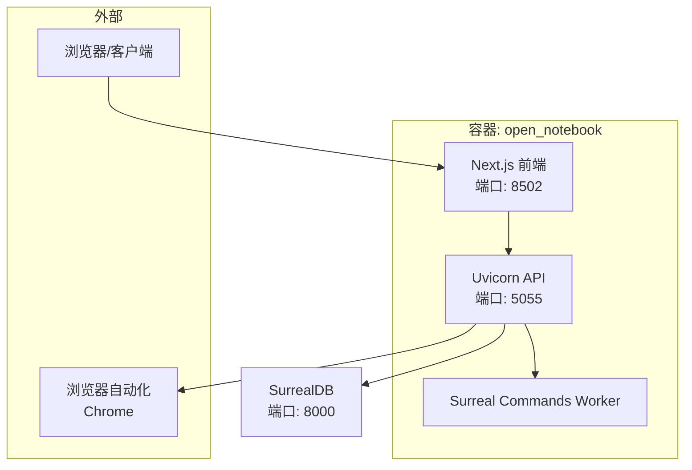
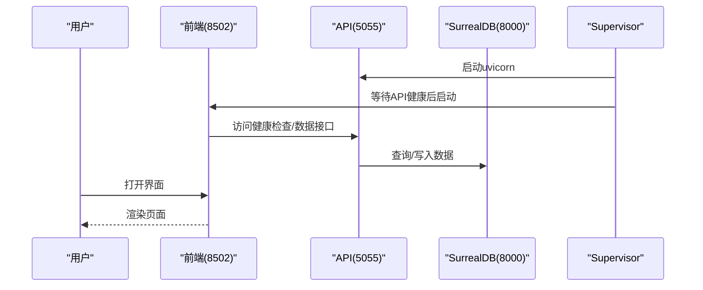
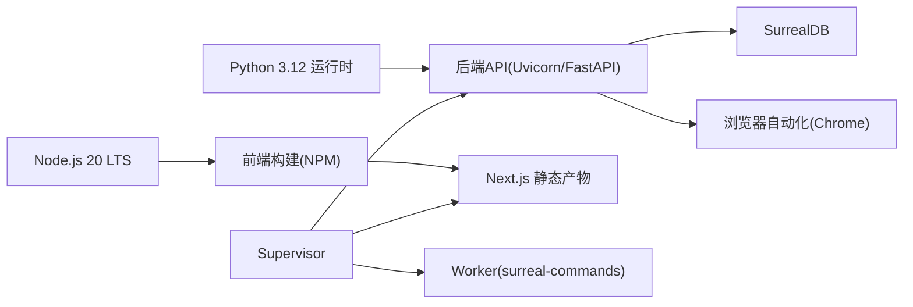

# 系统要求与环境准备

<cite>
**本文引用的文件**
- [README.md](file://README.md)
- [pyproject.toml](file://pyproject.toml)
- [Dockerfile](file://Dockerfile)
- [docker-compose.yml](file://docker-compose.yml)
- [.env.example](file://.env.example)
- [open_notebook/config.py](file://open_notebook/config.py)
- [docs/1-INSTALLATION/index.md](file://docs/1-INSTALLATION/index.md)
- [docs/1-INSTALLATION/docker-compose.md](file://docs/1-INSTALLATION/docker-compose.md)
- [docs/1-INSTALLATION/single-container.md](file://docs/1-INSTALLATION/single-container.md)
- [docs/0-START-HERE/quick-start-local.md](file://docs/0-START-HERE/quick-start-local.md)
- [docs/5-CONFIGURATION/environment-reference.md](file://docs/5-CONFIGURATION/environment-reference.md)
- [docs/5-CONFIGURATION/security.md](file://docs/5-CONFIGURATION/security.md)
- [frontend/package.json](file://frontend/package.json)
- [scripts/wait-for-api.sh](file://scripts/wait-for-api.sh)
- [supervisord.conf](file://supervisord.conf)
</cite>

## 目录
1. [简介](#简介)
2. [项目结构](#项目结构)
3. [核心组件](#核心组件)
4. [架构总览](#架构总览)
5. [详细组件分析](#详细组件分析)
6. [依赖关系分析](#依赖关系分析)
7. [性能考量](#性能考量)
8. [故障排查指南](#故障排查指南)
9. [结论](#结论)
10. [附录](#附录)

## 简介
本文件面向Open Notebook的部署与运维人员，提供从系统要求到环境准备的完整指南。内容覆盖：
- 最低系统要求与推荐配置（内存、存储、CPU、网络）
- 不同部署方式的前置条件（Docker、单容器、源码安装）
- 操作系统兼容性与硬件加速支持（GPU）
- 环境检查清单、依赖验证方法与兼容性测试
- AI提供商选择策略（云服务与本地部署的权衡）
- 网络配置、防火墙与安全注意事项

## 项目结构
Open Notebook采用前后端分离与多容器协作的架构：后端由FastAPI提供REST API与任务处理，前端基于Next.js，数据库使用SurrealDB，Supervisor统一管理进程。Docker镜像中同时包含运行时所需的浏览器自动化依赖与Node.js运行环境。

图表来源
- [Dockerfile](file://Dockerfile#L51-L134)
- [supervisord.conf](file://supervisord.conf#L7-L41)
- [docker-compose.yml](file://docker-compose.yml#L15-L37)

章节来源
- [Dockerfile](file://Dockerfile#L1-L159)
- [docker-compose.yml](file://docker-compose.yml#L1-L37)
- [supervisord.conf](file://supervisord.conf#L1-L41)

## 核心组件
- 后端API（Uvicorn + FastAPI）：提供REST接口与业务逻辑，监听5055端口。
- 前端（Next.js）：静态构建产物通过独立进程启动，监听8502端口。
- 数据库（SurrealDB）：默认WS地址ws://surrealdb:8000/rpc，持久化于卷。
- 进程管理（Supervisor）：统一启动API、Worker与前端，并在启动阶段等待API健康。
- 浏览器自动化（Chrome）：用于AI驱动的网页自动化任务。

章节来源
- [Dockerfile](file://Dockerfile#L51-L134)
- [supervisord.conf](file://supervisord.conf#L7-L41)
- [docker-compose.yml](file://docker-compose.yml#L1-L37)

## 架构总览
下图展示容器内组件交互与端口映射，以及启动顺序保障。

图表来源
- [supervisord.conf](file://supervisord.conf#L28-L41)
- [scripts/wait-for-api.sh](file://scripts/wait-for-api.sh#L1-L23)
- [docker-compose.yml](file://docker-compose.yml#L17-L19)

## 详细组件分析

### 系统要求与硬件配置
- 最低配置
  - 内存：4 GB
  - 存储：应用约2 GB + 文档空间
  - CPU：现代处理器即可
  - 网络：可选（离线可用本地模型）
- 推荐配置
  - 内存：8 GB+
  - 存储：10 GB+（文档与模型）
  - CPU：多核处理器
  - GPU：可选（提升本地推理速度）

章节来源
- [docs/1-INSTALLATION/index.md](file://docs/1-INSTALLATION/index.md#L40-L51)

### 部署方式与前置条件

#### Docker Compose（推荐）
- 前置条件
  - 安装Docker Desktop
  - 准备至少1个AI提供商密钥（或本地Ollama）
- 快速步骤
  - 下载官方compose文件，修改加密密钥，启动服务
  - 访问 http://localhost:8502，配置AI提供商
- 端口
  - 8502：Web UI；5055：API；8000：SurrealDB
- 可选集成
  - 添加Ollama服务实现完全本地推理

章节来源
- [docs/1-INSTALLATION/docker-compose.md](file://docs/1-INSTALLATION/docker-compose.md#L1-L130)
- [docker-compose.yml](file://docker-compose.yml#L1-L37)

#### 单容器（适合平台托管）
- 前置条件
  - Docker；至少1个AI提供商密钥
- 特点
  - 更简单的部署；资源占用略低
  - 适合PikaPods、Railway等平台
- 端口
  - 8502：前端；5055：API

章节来源
- [docs/1-INSTALLATION/single-container.md](file://docs/1-INSTALLATION/single-container.md#L1-L100)

#### 源码安装（开发者）
- 前置条件
  - Python 3.11+、Node.js 18+、Git
- 启动流程
  - 克隆仓库，执行开发启动脚本，访问前端与API端口
- 适用场景
  - 贡献开发、本地调试

章节来源
- [docs/1-INSTALLATION/index.md](file://docs/1-INSTALLATION/index.md#L27-L34)
- [pyproject.toml](file://pyproject.toml#L14-L14)

### 操作系统兼容性
- Docker Compose与单容器：跨平台（Windows/macOS/Linux）
- 开发者源码安装：需满足Python 3.11+与Node.js 18+

章节来源
- [docs/1-INSTALLATION/index.md](file://docs/1-INSTALLATION/index.md#L12-L13)
- [docs/1-INSTALLATION/index.md](file://docs/1-INSTALLATION/index.md#L109-L113)
- [pyproject.toml](file://pyproject.toml#L12-L14)

### 硬件加速支持（GPU）
- 本地推理（Ollama/LM Studio）
  - 可通过环境变量启用GPU（示例：Ollama NUM_GPU），具体取决于宿主机与驱动
- 容器内Chrome与浏览器自动化
  - 镜像已安装Chrome与必要依赖，不直接涉及GPU推理
- 性能影响
  - GPU可显著提升本地大模型推理速度；无GPU时仍可运行但较慢

章节来源
- [docs/0-START-HERE/quick-start-local.md](file://docs/0-START-HERE/quick-start-local.md#L224-L233)

### 环境变量与配置要点
- 必填项
  - OPEN_NOTEBOOK_ENCRYPTION_KEY：用于加密数据库中的API凭据
  - SURREAL_*：数据库连接参数
- 可选项
  - OPEN_NOTEBOOK_PASSWORD：实例级密码保护
  - API_URL：反向代理场景下的外部API地址
  - HTTP(S)_PROXY/NO_PROXY：企业网络代理
  - TTS_BATCH_SIZE、SURREAL_COMMANDS_MAX_TASKS：性能调优
- 验证方法
  - 使用环境变量打印命令检查变量是否生效
  - 通过健康检查端点确认API可用

章节来源
- [.env.example](file://.env.example#L1-L60)
- [docs/5-CONFIGURATION/environment-reference.md](file://docs/5-CONFIGURATION/environment-reference.md#L135-L182)
- [docs/5-CONFIGURATION/environment-reference.md](file://docs/5-CONFIGURATION/environment-reference.md#L186-L200)

### 网络与端口
- 默认端口
  - 8502：前端
  - 5055：API
  - 8000：SurrealDB RPC
- 反向代理
  - 通过设置API_URL与反向代理（Nginx/Caddy/Traefik）暴露HTTPS
- 防火墙
  - 建议仅开放22/80/443，阻断直接访问8502/5055

章节来源
- [docs/5-CONFIGURATION/security.md](file://docs/5-CONFIGURATION/security.md#L266-L283)
- [docker-compose.yml](file://docker-compose.yml#L17-L19)

### 安全与认证
- 密码保护
  - 设置OPEN_NOTEBOOK_PASSWORD后，所有受保护API需携带Bearer Token
- 加密密钥
  - OPEN_NOTEBOOK_ENCRYPTION_KEY用于加密数据库中的凭据；丢失则无法读取旧凭据
- Docker Secrets
  - 支持通过*_FILE变量注入敏感值
- 未保护端点
  - /health、/docs、/openapi.json无需认证

章节来源
- [docs/5-CONFIGURATION/security.md](file://docs/5-CONFIGURATION/security.md#L1-L170)

### AI提供商选择策略
- 云服务（按需付费）
  - 优点：速度快、功能丰富
  - 缺点：隐私外流、成本随用量增长
- 本地部署（免费私有）
  - 优点：完全私有、零API费用
  - 缺点：速度取决于硬件、首次下载模型耗时
- 权衡建议
  - 优先本地模型进行日常研究；复杂/长上下文任务可结合云模型
  - 在反向代理+HTTPS环境下部署，兼顾可用性与隐私

章节来源
- [docs/1-INSTALLATION/index.md](file://docs/1-INSTALLATION/index.md#L54-L76)

## 依赖关系分析

图表来源
- [Dockerfile](file://Dockerfile#L2-L24)
- [Dockerfile](file://Dockerfile#L103-L106)
- [frontend/package.json](file://frontend/package.json#L1-L77)
- [supervisord.conf](file://supervisord.conf#L7-L41)

章节来源
- [Dockerfile](file://Dockerfile#L1-L159)
- [frontend/package.json](file://frontend/package.json#L1-L77)
- [supervisord.conf](file://supervisord.conf#L1-L41)

## 性能考量
- 端口与并发
  - API客户端超时、SurrealDB并发任务数、TTS批大小可调优
- 代理与网络
  - 企业网络需配置HTTP(S)_PROXY与NO_PROXY，避免请求失败
- 前端与API分离
  - Docker Compose模式下前后端分离，便于扩展与弹性伸缩
- 本地推理
  - GPU启用与模型选择直接影响响应时间与质量

章节来源
- [docs/5-CONFIGURATION/environment-reference.md](file://docs/5-CONFIGURATION/environment-reference.md#L54-L101)
- [docs/0-START-HERE/quick-start-local.md](file://docs/0-START-HERE/quick-start-local.md#L224-L233)

## 故障排查指南
- 启动顺序与健康检查
  - 前端通过等待脚本检测API健康后再启动，避免“无法连接API”错误
- 常见问题
  - 端口冲突：修改映射端口
  - 数据库权限：Linux下确保SurrealDB服务用户正确
  - 凭据问题：在设置界面重新测试并注册模型
- 日志与诊断
  - 查看各服务日志，定位启动与连接问题

章节来源
- [scripts/wait-for-api.sh](file://scripts/wait-for-api.sh#L1-L23)
- [docs/1-INSTALLATION/docker-compose.md](file://docs/1-INSTALLATION/docker-compose.md#L238-L321)

## 结论
- Docker Compose是大多数用户的最佳起点，具备清晰的服务边界与易扩展性
- 源码安装适合开发者深度定制与调试
- 本地模型（Ollama/LM Studio）可实现完全私有的研究助手，云服务适合高负载与复杂任务
- 生产部署应结合反向代理、HTTPS与防火墙策略，强化访问控制与数据安全

## 附录

### 环境检查清单
- 基础
  - 已安装Docker或满足Python/Node.js版本要求
  - 至少4 GB内存可用
  - 稳定网络（或本地Ollama）
- 配置
  - 设置OPEN_NOTEBOOK_ENCRYPTION_KEY
  - 配置SURREAL_*参数
  - 如需反向代理，设置API_URL
  - 如在企业网络，配置HTTP(S)_PROXY/NO_PROXY
- 验证
  - API健康检查返回健康状态
  - 前端可正常访问
  - 在设置界面添加并测试AI提供商凭据

章节来源
- [docs/1-INSTALLATION/index.md](file://docs/1-INSTALLATION/index.md#L90-L99)
- [docs/5-CONFIGURATION/environment-reference.md](file://docs/5-CONFIGURATION/environment-reference.md#L186-L200)

### 依赖验证方法
- 环境变量
  - 使用环境变量打印命令检查变量是否生效
- API连通性
  - 访问健康端点与文档端点
- 前端可用性
  - 打开UI端口，确认页面加载

章节来源
- [docs/5-CONFIGURATION/environment-reference.md](file://docs/5-CONFIGURATION/environment-reference.md#L186-L200)
- [docker-compose.yml](file://docker-compose.yml#L17-L19)

### 兼容性测试指南
- 多部署路径对比
  - Docker Compose vs 单容器：比较资源占用与扩展性
- 本地与云混合
  - 本地模型用于常规任务，云模型用于复杂推理，观察延迟与成本差异
- 网络代理
  - 在代理环境下验证URL抓取、转录与TTS功能

章节来源
- [docs/1-INSTALLATION/single-container.md](file://docs/1-INSTALLATION/single-container.md#L116-L126)
- [docs/5-CONFIGURATION/environment-reference.md](file://docs/5-CONFIGURATION/environment-reference.md#L95-L103)