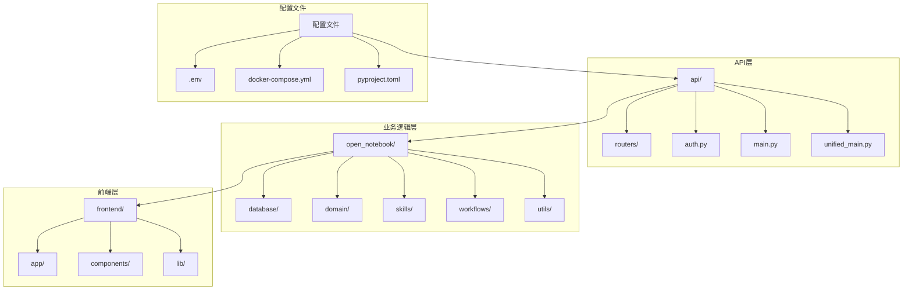
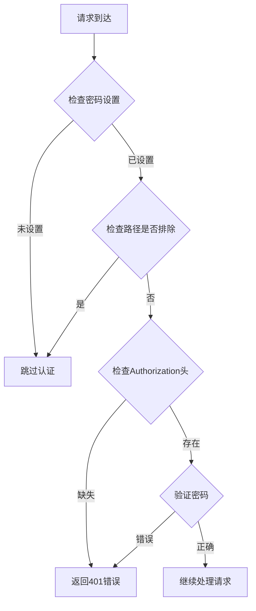
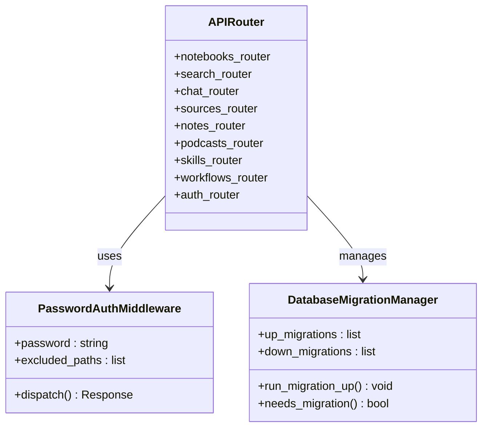
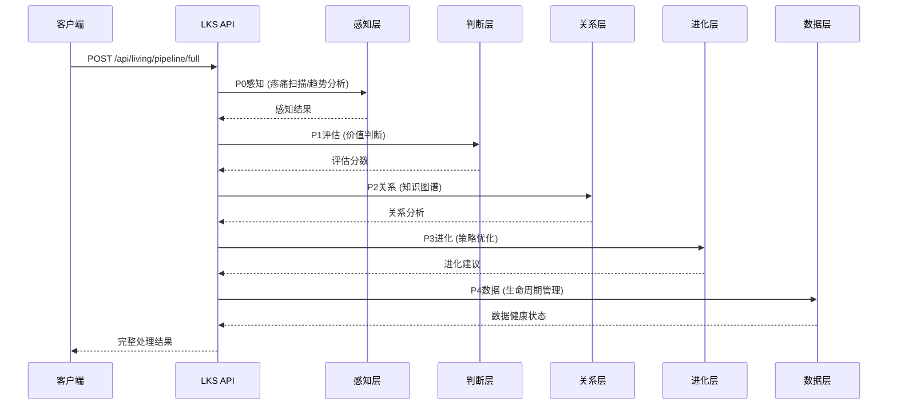
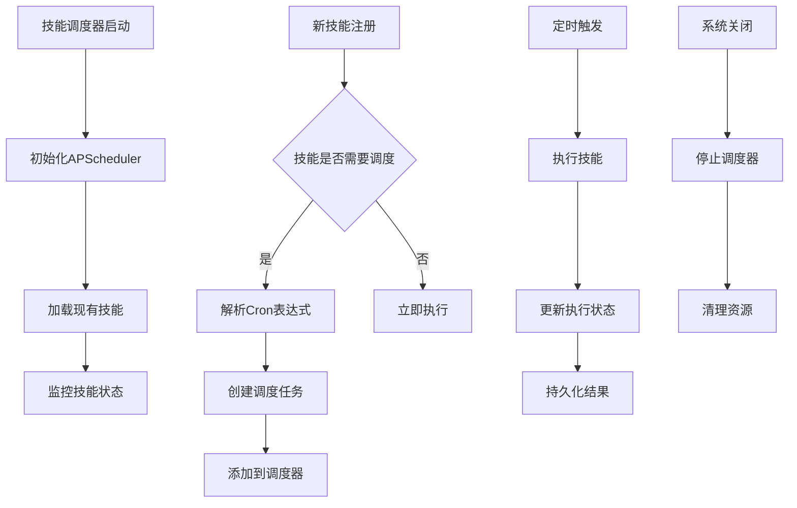
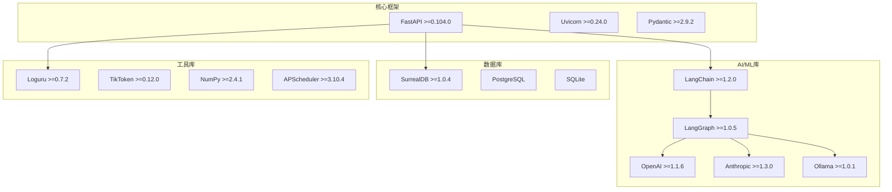

# 统一API服务器

<cite>
**本文档引用的文件**
- [api/main.py](file://api/main.py)
- [api/unified_main.py](file://api/unified_main.py)
- [run_unified_api.py](file://run_unified_api.py)
- [run_api.py](file://run_api.py)
- [api/auth.py](file://api/auth.py)
- [api/routers/__init__.py](file://api/routers/__init__.py)
- [api/routers/notebooks.py](file://api/routers/notebooks.py)
- [api/routers/search.py](file://api/routers/search.py)
- [open_notebook/skills/living/api_endpoints.py](file://open_notebook/skills/living/api_endpoints.py)
- [open_notebook/database/async_migrate.py](file://open_notebook/database/async_migrate.py)
- [open_notebook/skills/scheduler.py](file://open_notebook/skills/scheduler.py)
- [open_notebook/workflows/service.py](file://open_notebook/workflows/service.py)
- [pyproject.toml](file://pyproject.toml)
- [README.md](file://README.md)
</cite>

## 目录
1. [简介](#简介)
2. [项目结构](#项目结构)
3. [核心组件](#核心组件)
4. [架构概览](#架构概览)
5. [详细组件分析](#详细组件分析)
6. [依赖关系分析](#依赖关系分析)
7. [性能考虑](#性能考虑)
8. [故障排除指南](#故障排除指南)
9. [结论](#结论)

## 简介

统一API服务器是Open Notebook项目的核心组件，它将传统的Open Notebook API与Living Knowledge System (LKS) API整合到一个统一的服务中。该项目提供了一个完整的研究助手解决方案，支持多模态内容管理、智能搜索、AI对话、播客生成等功能。

该服务器采用FastAPI框架构建，支持密码认证、CORS跨域访问、数据库迁移管理等特性。通过统一的端口（默认5055）提供所有API服务，简化了部署和维护。

## 项目结构

项目采用模块化的架构设计，主要包含以下核心目录：



**图表来源**
- [api/main.py](file://api/main.py#L1-L273)
- [api/unified_main.py](file://api/unified_main.py#L1-L406)

**章节来源**
- [README.md](file://README.md#L1-L358)
- [pyproject.toml](file://pyproject.toml#L1-L101)

## 核心组件

### 1. 统一API应用

统一API服务器通过`api/unified_main.py`实现，它将两个主要功能模块整合：

- **主API系统**：传统Open Notebook功能（笔记本、源文件、笔记管理等）
- **LKS系统**：Living Knowledge System五层架构（P0-P4）

### 2. 认证中间件

密码认证中间件实现了基础的安全保护机制：



**图表来源**
- [api/auth.py](file://api/auth.py#L12-L75)

### 3. 数据库迁移系统

异步迁移管理系统确保数据库模式的一致性和完整性：

- 支持14个版本的SurrealDB迁移
- 自动检测和执行待处理的迁移
- 提供向前和向后兼容的迁移策略

**章节来源**
- [api/unified_main.py](file://api/unified_main.py#L71-L210)
- [open_notebook/database/async_migrate.py](file://open_notebook/database/async_migrate.py#L91-L195)

## 架构概览

统一API服务器采用分层架构设计，实现了清晰的关注点分离：

```mermaid
graph TB
subgraph "客户端层"
C1[Web浏览器]
C2[移动应用]
C3[第三方集成]
end
subgraph "API网关层"
A1[FastAPI应用]
A2[密码认证中间件]
A3[CORS中间件]
A4[异常处理器]
end
subgraph "业务逻辑层"
B1[路由器模块]
B2[服务层]
B3[工作流引擎]
B4[技能调度器]
end
subgraph "数据访问层"
D1[SurrealDB]
D2[PostgreSQL (LKS)]
D3[文件存储]
end
C1 --> A1
C2 --> A1
C3 --> A1
A1 --> A2
A2 --> A3
A3 --> A4
A4 --> B1
B1 --> B2
B2 --> B3
B3 --> B4
B4 --> D1
B4 --> D2
B4 --> D3
```

**图表来源**
- [api/unified_main.py](file://api/unified_main.py#L212-L370)
- [api/main.py](file://api/main.py#L173-L273)

## 详细组件分析

### 主API路由器系统

API系统包含多个专门的路由器模块，每个负责特定的功能领域：



**图表来源**
- [api/routers/__init__.py](file://api/routers/__init__.py#L1-L56)
- [api/auth.py](file://api/auth.py#L12-L75)
- [open_notebook/database/async_migrate.py](file://open_notebook/database/async_migrate.py#L91-L195)

### LKS五层架构API

Living Knowledge System实现了先进的AI知识处理能力：



**图表来源**
- [open_notebook/skills/living/api_endpoints.py](file://open_notebook/skills/living/api_endpoints.py#L436-L526)

### 技能调度系统

技能调度器基于APScheduler实现自动化任务管理：



**图表来源**
- [open_notebook/skills/scheduler.py](file://open_notebook/skills/scheduler.py#L20-L200)

**章节来源**
- [open_notebook/skills/living/api_endpoints.py](file://open_notebook/skills/living/api_endpoints.py#L1-L566)
- [open_notebook/skills/scheduler.py](file://open_notebook/skills/scheduler.py#L1-L200)

## 依赖关系分析

项目使用现代化的技术栈构建，主要依赖包括：



**图表来源**
- [pyproject.toml](file://pyproject.toml#L15-L44)

**章节来源**
- [pyproject.toml](file://pyproject.toml#L1-L101)

## 性能考虑

### 1. 异步处理

系统广泛采用异步编程模式以提高并发性能：

- 使用async/await模式处理数据库操作
- 异步AI模型调用避免阻塞主线程
- 异步文件上传和处理

### 2. 缓存策略

- 向量嵌入缓存减少重复计算
- 模型配置缓存降低查询开销
- 前端静态资源缓存

### 3. 连接池管理

- 数据库连接池自动管理
- AI服务连接池优化
- 文件系统连接池

## 故障排除指南

### 1. 认证问题

**常见问题**：
- 401未授权错误
- 密码认证失败
- CORS跨域问题

**解决方案**：
- 检查OPEN_NOTEBOOK_PASSWORD环境变量
- 验证Authorization头格式
- 配置正确的CORS设置

### 2. 数据库连接问题

**常见问题**：
- SurrealDB连接失败
- 迁移执行错误
- PostgreSQL连接问题

**解决方案**：
- 验证SURREAL_URL配置
- 检查数据库凭据
- 查看迁移日志

### 3. 性能问题

**常见问题**：
- API响应缓慢
- 内存使用过高
- 并发请求失败

**解决方案**：
- 分析慢查询日志
- 调整工作进程数量
- 优化数据库索引

**章节来源**
- [api/unified_main.py](file://api/unified_main.py#L264-L279)
- [api/main.py](file://api/main.py#L204-L228)

## 结论

统一API服务器代表了现代AI应用服务端架构的最佳实践，成功地将复杂的研究助手功能与先进的Living Knowledge System相结合。通过模块化设计、异步处理、完善的认证机制和灵活的部署选项，该系统为用户提供了强大而易用的API服务。

主要优势包括：
- **统一部署**：单一端口提供所有功能
- **安全可靠**：多层次认证和CORS保护
- **扩展性强**：模块化架构支持功能扩展
- **性能优异**：异步处理和连接池优化
- **易于维护**：自动迁移和健康检查

该系统为构建下一代AI驱动的知识管理平台奠定了坚实的基础，支持从个人研究到企业级应用的各种场景。