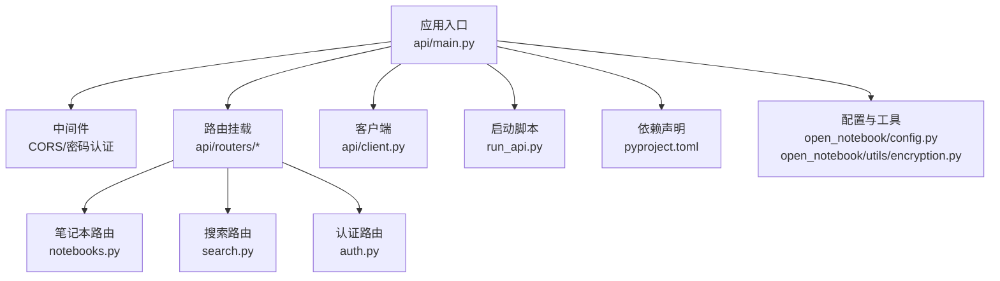
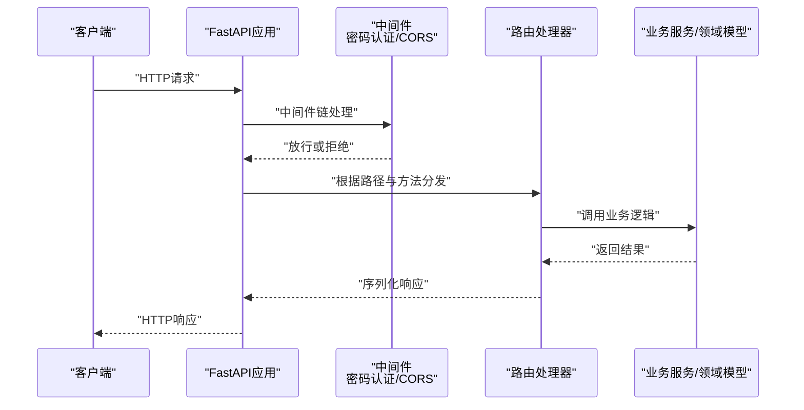
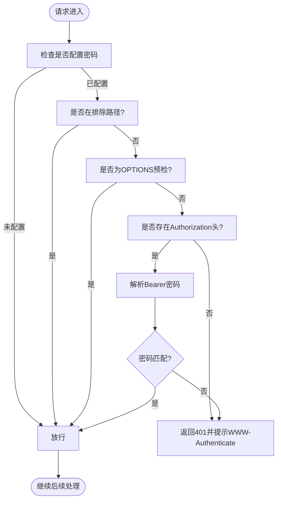
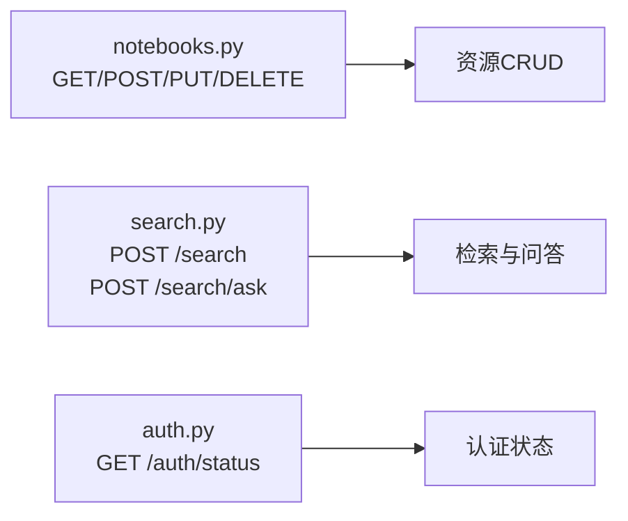
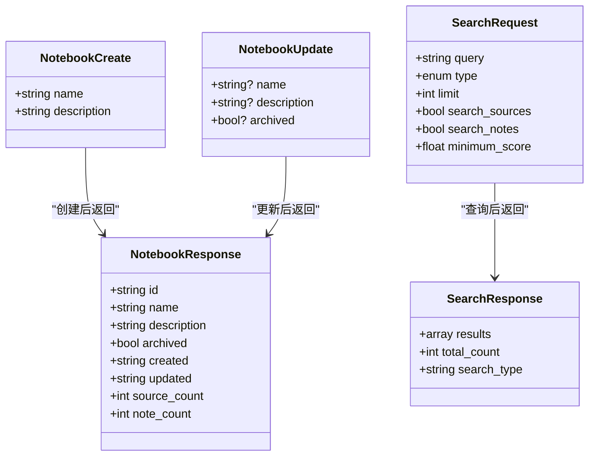
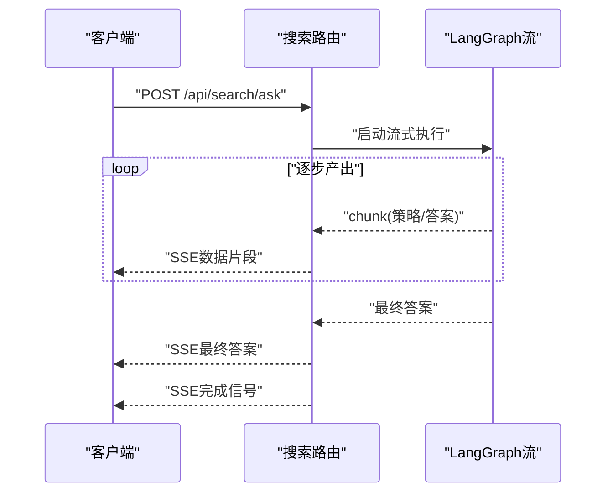
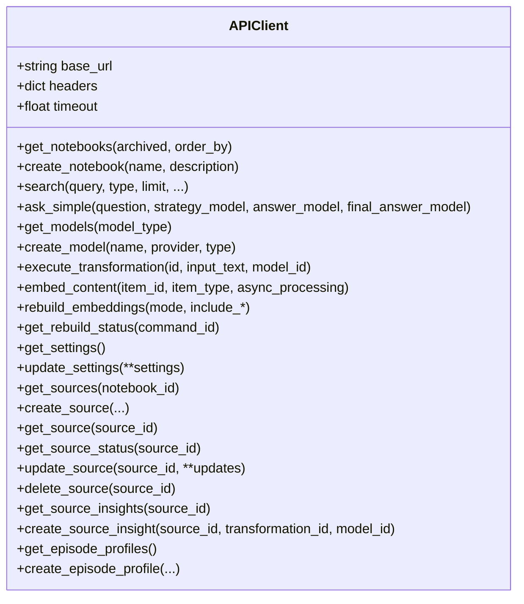
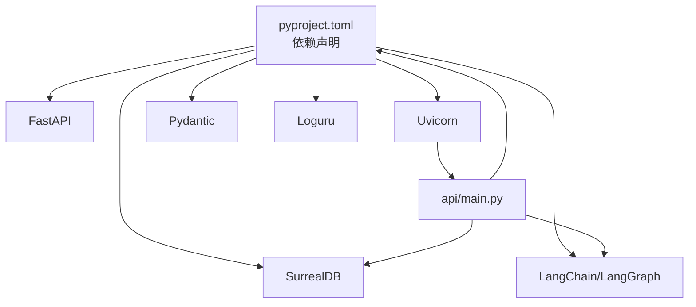

# API开发指南

<cite>
**本文档引用的文件**
- [api/main.py](file://api/main.py)
- [api/auth.py](file://api/auth.py)
- [api/routers/__init__.py](file://api/routers/__init__.py)
- [api/routers/auth.py](file://api/routers/auth.py)
- [api/routers/notebooks.py](file://api/routers/notebooks.py)
- [api/routers/search.py](file://api/routers/search.py)
- [api/models.py](file://api/models.py)
- [api/client.py](file://api/client.py)
- [run_api.py](file://run_api.py)
- [pyproject.toml](file://pyproject.toml)
- [open_notebook/config.py](file://open_notebook/config.py)
- [open_notebook/utils/encryption.py](file://open_notebook/utils/encryption.py)
- [tests/test_models_api.py](file://tests/test_models_api.py)
</cite>

## 目录
1. [简介](#简介)
2. [项目结构](#项目结构)
3. [核心组件](#核心组件)
4. [架构总览](#架构总览)
5. [详细组件分析](#详细组件分析)
6. [依赖关系分析](#依赖关系分析)
7. [性能考虑](#性能考虑)
8. [故障排除指南](#故障排除指南)
9. [结论](#结论)
10. [附录](#附录)

## 简介
本指南面向Open Notebook API的开发者，系统阐述RESTful API设计原则、路由组织结构、请求响应模式与实现规范；详解FastAPI装饰器使用、依赖注入、异常处理的编程模式；提供API版本控制、文档自动生成、认证授权的实现方法；包含前端API客户端使用指南、错误处理策略、性能优化技巧；说明WebSocket实时通信、文件上传下载、流式响应的开发模式；并提供API测试、监控、调试的工具与方法。

## 项目结构
Open Notebook采用分层与功能模块化结合的组织方式：
- 应用入口与中间件：在应用启动时完成数据库迁移、CORS与密码认证中间件注册，并按前缀统一挂载各功能路由。
- 路由模块：每个业务域（如notebooks、search、models等）独立定义APIRouter，集中于api/routers目录。
- 数据模型：统一在api/models.py中定义Pydantic模型，确保请求/响应契约清晰一致。
- 客户端：提供Python客户端api/client.py，便于前端或集成方调用。
- 配置与工具：环境变量加载、加密工具、数据目录配置等。

**图表来源**
- [api/main.py](file://api/main.py#L99-L180)
- [api/routers/notebooks.py](file://api/routers/notebooks.py#L17-L328)
- [api/routers/search.py](file://api/routers/search.py#L14-L215)
- [api/routers/auth.py](file://api/routers/auth.py#L10-L27)
- [api/client.py](file://api/client.py#L13-L530)
- [run_api.py](file://run_api.py#L16-L32)
- [pyproject.toml](file://pyproject.toml#L1-L100)
- [open_notebook/config.py](file://open_notebook/config.py#L1-L18)
- [open_notebook/utils/encryption.py](file://open_notebook/utils/encryption.py#L29-L126)

**章节来源**
- [api/main.py](file://api/main.py#L1-L190)
- [pyproject.toml](file://pyproject.toml#L1-L100)

## 核心组件
- 应用实例与生命周期：通过FastAPI创建应用实例，使用lifespan进行数据库迁移与启动日志记录。
- 中间件体系：密码认证中间件PasswordAuthMiddleware负责全局鉴权；CORS中间件统一跨域策略。
- 路由组织：以“/api”为前缀，按业务域拆分路由模块，标签化管理，便于文档生成与维护。
- 模型契约：Pydantic模型统一定义请求/响应结构，含字段校验、默认值与范围约束。
- 客户端封装：提供统一的APIClient类，自动处理超时、认证头、错误转换等。

**章节来源**
- [api/main.py](file://api/main.py#L47-L96)
- [api/auth.py](file://api/auth.py#L12-L115)
- [api/routers/__init__.py](file://api/routers/__init__.py#L1-L1)
- [api/models.py](file://api/models.py#L1-L685)
- [api/client.py](file://api/client.py#L13-L530)

## 架构总览
下图展示从客户端到服务端的典型交互路径，包括认证、路由分发、业务处理与响应返回。

**图表来源**
- [api/main.py](file://api/main.py#L105-L127)
- [api/auth.py](file://api/auth.py#L12-L115)
- [api/routers/notebooks.py](file://api/routers/notebooks.py#L20-L328)
- [api/routers/search.py](file://api/routers/search.py#L17-L215)

## 详细组件分析

### 认证与授权
- 密码认证中间件：支持Docker secrets风格的密码文件读取，可配置排除路径（如健康检查、文档接口），对缺失或无效认证头返回401。
- 依赖注入：check_api_password作为依赖项，可在需要鉴权的路由中直接注入使用。
- 异常处理：自定义HTTP异常处理器保证CORS头在错误响应中正确设置，尤其适用于上传限制场景。

**图表来源**
- [api/auth.py](file://api/auth.py#L12-L115)

**章节来源**
- [api/auth.py](file://api/auth.py#L12-L115)
- [api/main.py](file://api/main.py#L130-L154)

### 路由组织与REST设计
- 前缀与标签：所有路由统一使用“/api”前缀，按业务域添加标签，便于Swagger/OpenAPI文档分类。
- 资源命名：遵循REST语义，如“/notebooks”、“/sources”、“/search”等。
- 查询参数与排序：如笔记本列表支持archived过滤与order_by排序，提升查询灵活性。
- 错误处理：统一使用HTTPException抛出标准状态码与错误信息，便于客户端处理。

**图表来源**
- [api/routers/notebooks.py](file://api/routers/notebooks.py#L17-L328)
- [api/routers/search.py](file://api/routers/search.py#L14-L215)
- [api/routers/auth.py](file://api/routers/auth.py#L10-L27)

**章节来源**
- [api/routers/notebooks.py](file://api/routers/notebooks.py#L20-L328)
- [api/routers/search.py](file://api/routers/search.py#L17-L215)
- [api/routers/auth.py](file://api/routers/auth.py#L13-L27)

### 请求响应模式与数据模型
- Pydantic模型：涵盖笔记本、搜索、模型、转换、笔记、嵌入、设置、来源、上下文、洞察、凭据等完整领域模型。
- 字段校验：包含长度、数值范围、枚举值、可选字段与模型验证器，确保输入一致性。
- 统一错误响应：ErrorResponse模型用于标准化错误结构。

**图表来源**
- [api/models.py](file://api/models.py#L7-L47)

**章节来源**
- [api/models.py](file://api/models.py#L1-L685)

### 流式响应与实时通信
- SSE流式输出：搜索问答接口支持Server-Sent Events，分片推送策略、答案与最终答案，最后发送完成信号。
- 流式处理：基于LangGraph的异步流式执行，逐块产出中间结果，前端可实时渲染。

**图表来源**
- [api/routers/search.py](file://api/routers/search.py#L61-L155)

**章节来源**
- [api/routers/search.py](file://api/routers/search.py#L61-L155)

### 文件上传与异步处理
- 来源创建：支持链接、上传、文本三种类型；可选择异步处理与删除源文件。
- 嵌入重建：提供批量重建与进度查询，支持命令ID跟踪。
- 处理状态：来源状态接口返回处理阶段、消息与命令ID，便于前端轮询。

**章节来源**
- [api/models.py](file://api/models.py#L280-L366)
- [api/models.py](file://api/models.py#L217-L255)

### API客户端使用指南
- 自动认证：若配置了OPEN_NOTEBOOK_PASSWORD，客户端会自动附加Authorization头。
- 超时策略：默认300秒，可通过API_CLIENT_TIMEOUT调整；长耗时操作（转换、洞察、问答、重建）使用该超时。
- 方法覆盖：提供笔记本、搜索、模型、转换、笔记、嵌入、设置、来源、洞察、剧集档案等完整方法封装。

**图表来源**
- [api/client.py](file://api/client.py#L13-L530)

**章节来源**
- [api/client.py](file://api/client.py#L13-L530)

### 异常处理与错误策略
- 标准化异常：业务异常统一抛出HTTPException，包含状态码与错误详情。
- 自定义异常处理器：确保CORS头在StarletteHTTPException时也能正确返回，避免跨域问题。
- 前端策略：建议捕获HTTP状态码与错误消息，区分网络错误、认证失败、业务错误与超时。

**章节来源**
- [api/main.py](file://api/main.py#L130-L154)
- [api/routers/notebooks.py](file://api/routers/notebooks.py#L55-L59)

### 版本控制与文档生成
- 文档自动生成：FastAPI内置Swagger与ReDoc，默认启用；可通过lifespan与中间件保证文档可用性。
- 版本控制建议：当前版本号在pyproject.toml中定义；建议通过URL前缀或Accept头实现版本隔离，保持向后兼容。

**章节来源**
- [pyproject.toml](file://pyproject.toml#L3-L4)
- [api/main.py](file://api/main.py#L99-L103)

### WebSocket实时通信
- 当前实现：使用Server-Sent Events（SSE）满足流式输出需求。
- WebSocket扩展：如需双向实时通信，可在现有路由基础上新增WebSocket端点，注意连接管理、心跳与重连策略。

## 依赖关系分析
- 应用依赖：FastAPI、Uvicorn、Pydantic、Loguru、LangChain/LangGraph、SurrealDB等。
- 运行时依赖：数据库迁移、加密工具、数据目录与缓存目录初始化。
- 测试依赖：pytest、TestClient、mock等。

**图表来源**
- [pyproject.toml](file://pyproject.toml#L15-L43)
- [api/main.py](file://api/main.py#L1-L190)

**章节来源**
- [pyproject.toml](file://pyproject.toml#L1-L100)
- [api/main.py](file://api/main.py#L1-L190)

## 性能考虑
- 超时配置：长耗时操作（转换、洞察、问答、重建）建议提高API_CLIENT_TIMEOUT，避免早期中断。
- 并发与限流：在网关或反向代理层配置并发限制与速率限制，防止突发流量压垮服务。
- 缓存策略：对静态查询结果与常用配置进行缓存，减少重复计算。
- 数据库优化：合理索引与查询计划，避免N+1查询；批量操作使用事务。
- 日志与监控：使用Loguru记录关键指标，结合外部监控系统观察延迟、错误率与吞吐量。

## 故障排除指南
- 认证失败：确认OPEN_NOTEBOOK_PASSWORD或其文件配置正确，Authorization头格式为“Bearer {password}”。
- CORS错误：检查CORS中间件配置与自定义异常处理器，确保错误响应包含必要头。
- 数据库迁移失败：查看启动日志中的迁移错误，修复schema后再重启服务。
- 超时问题：适当提高API_CLIENT_TIMEOUT，或在服务端调整相关操作的超时阈值。
- 测试用例参考：通过pytest运行测试，验证模型创建、提供者可用性等关键流程。

**章节来源**
- [api/auth.py](file://api/auth.py#L12-L115)
- [api/main.py](file://api/main.py#L130-L154)
- [tests/test_models_api.py](file://tests/test_models_api.py#L1-L392)

## 结论
Open Notebook API以FastAPI为核心，结合Pydantic模型与中间件机制，提供了清晰的REST设计与完善的异常处理策略。通过统一的路由组织、流式响应与客户端封装，开发者可以快速构建稳定可靠的AI研究助理API。建议在生产环境中强化安全配置（密码、CORS、HTTPS）、引入监控与日志聚合，并持续完善测试覆盖与文档生成。

## 附录

### 启动与部署
- 使用run_api.py启动服务，支持主机、端口与热重载配置。
- 生产部署建议：使用Uvicorn多进程模式，配合反向代理（Nginx/Traefik）与证书管理。

**章节来源**
- [run_api.py](file://run_api.py#L16-L32)

### 加密与配置
- 加密密钥：OPEN_NOTEBOOK_ENCRYPTION_KEY用于凭据加密存储，支持_DOCKER_FILE风格。
- 数据目录：DATA_FOLDER、UPLOADS_FOLDER、TIKTOKEN_CACHE_DIR等路径在open_notebook/config.py中定义。

**章节来源**
- [open_notebook/utils/encryption.py](file://open_notebook/utils/encryption.py#L29-L126)
- [open_notebook/config.py](file://open_notebook/config.py#L1-L18)