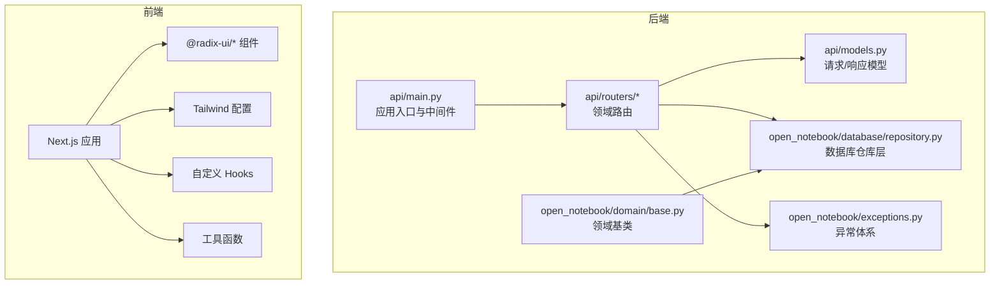
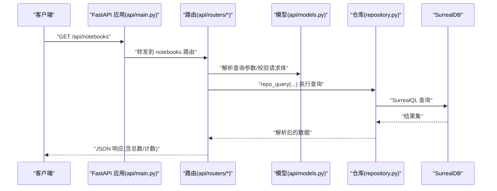
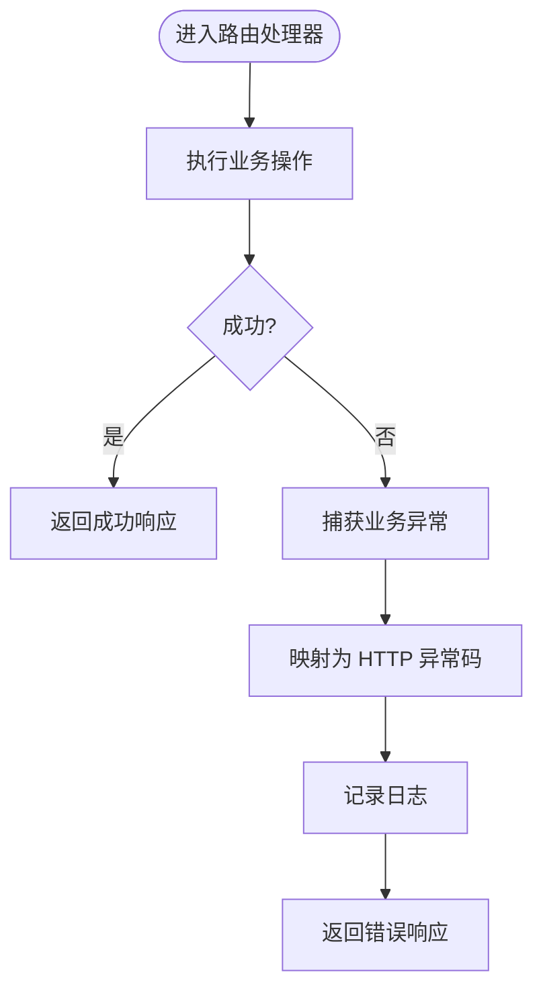
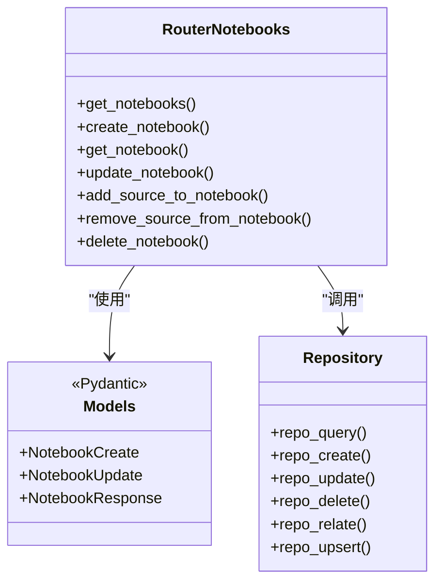
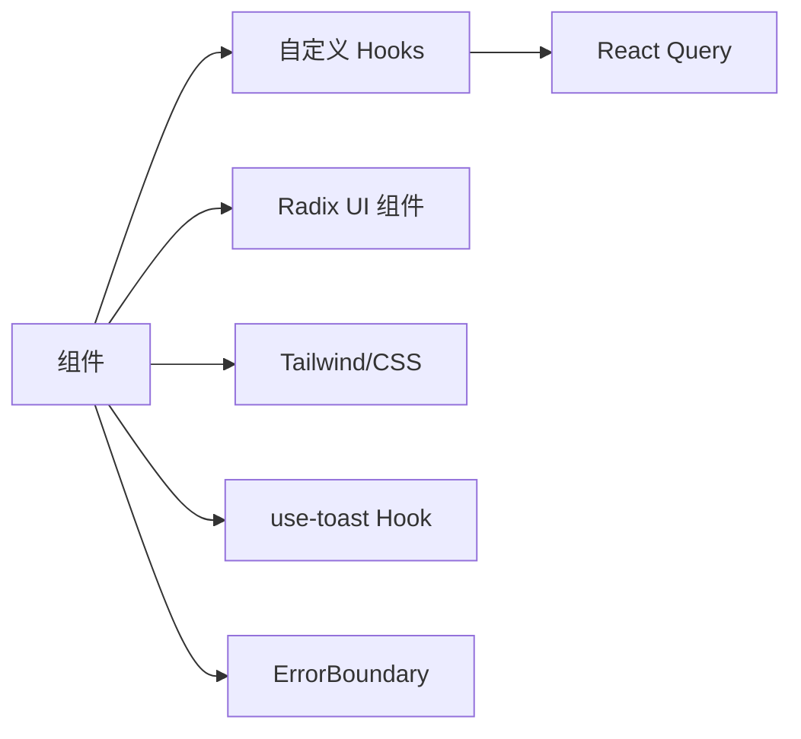
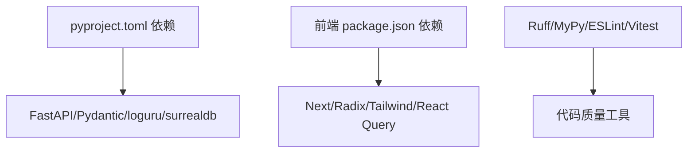

# 代码规范

<cite>
**本文引用的文件**
- [pyproject.toml](file://pyproject.toml)
- [mypy.ini](file://mypy.ini)
- [docs/7-DEVELOPMENT/code-standards.md](file://docs/7-DEVELOPMENT/code-standards.md)
- [open_notebook/exceptions.py](file://open_notebook/exceptions.py)
- [open_notebook/domain/base.py](file://open_notebook/domain/base.py)
- [open_notebook/database/repository.py](file://open_notebook/database/repository.py)
- [api/main.py](file://api/main.py)
- [api/models.py](file://api/models.py)
- [api/routers/notebooks.py](file://api/routers/notebooks.py)
- [frontend/package.json](file://frontend/package.json)
- [frontend/eslint.config.mjs](file://frontend/eslint.config.mjs)
- [frontend/tailwind.config.ts](file://frontend/tailwind.config.ts)
- [frontend/src/lib/utils.ts](file://frontend/src/lib/utils.ts)
- [frontend/src/lib/hooks/use-toast.ts](file://frontend/src/lib/hooks/use-toast.ts)
- [frontend/src/components/common/ErrorBoundary.tsx](file://frontend/src/components/common/ErrorBoundary.tsx)
</cite>

## 目录
1. [引言](#引言)
2. [项目结构](#项目结构)
3. [核心组件](#核心组件)
4. [架构总览](#架构总览)
5. [详细组件分析](#详细组件分析)
6. [依赖关系分析](#依赖关系分析)
7. [性能考量](#性能考量)
8. [故障排查指南](#故障排查指南)
9. [结论](#结论)
10. [附录](#附录)

## 引言
本规范旨在为 Open Notebook 项目提供统一的代码风格、类型注解、错误处理与工程实践标准，并覆盖后端 FastAPI 路由与数据模型、依赖注入与服务层、数据库查询与迁移、前端 React 组件与状态管理、以及 AI 模型集成模式。同时给出代码审查清单、静态分析与格式化工具的使用方法，并通过正反例路径指引帮助团队快速达成一致。

## 项目结构
- 后端采用 FastAPI + SurrealDB，按领域模块拆分路由与服务，统一通过 Pydantic 进行请求/响应建模与校验。
- 前端基于 Next.js 16 + TypeScript，使用 Radix UI 组件库、TailwindCSS 样式体系、React Query 状态管理、Sonner 提示系统。
- 工具链：Ruff（lint/format）、MyPy（静态类型检查）、ESLint（前端）、Vitest（测试）。

图表来源
- [api/main.py](file://api/main.py#L1-L190)
- [api/routers/notebooks.py](file://api/routers/notebooks.py#L1-L328)
- [api/models.py](file://api/models.py#L1-L685)
- [open_notebook/database/repository.py](file://open_notebook/database/repository.py#L1-L195)
- [open_notebook/domain/base.py](file://open_notebook/domain/base.py#L1-L329)
- [open_notebook/exceptions.py](file://open_notebook/exceptions.py#L1-L71)
- [frontend/tailwind.config.ts](file://frontend/tailwind.config.ts#L1-L17)

章节来源
- [pyproject.toml](file://pyproject.toml#L1-L100)
- [frontend/package.json](file://frontend/package.json#L1-L77)

## 核心组件
- 后端异常体系：统一的业务异常类型，便于在路由层转换为 HTTP 异常码与日志记录。
- 领域基类：封装通用的 CRUD、关系维护、保存策略与验证逻辑。
- 数据库仓库：抽象出查询、创建、更新、删除、关联与 upsert 的统一接口，屏蔽底层连接细节。
- FastAPI 路由与模型：以 Pydantic 模型驱动输入输出，结合装饰器生成 OpenAPI 文档。
- 前端工具与约定：ESLint 规则、Tailwind 内容扫描、cn 合并工具、Toast Hook、错误边界。

章节来源
- [open_notebook/exceptions.py](file://open_notebook/exceptions.py#L1-L71)
- [open_notebook/domain/base.py](file://open_notebook/domain/base.py#L1-L329)
- [open_notebook/database/repository.py](file://open_notebook/database/repository.py#L1-L195)
- [api/models.py](file://api/models.py#L1-L685)
- [api/routers/notebooks.py](file://api/routers/notebooks.py#L1-L328)
- [frontend/eslint.config.mjs](file://frontend/eslint.config.mjs#L1-L17)
- [frontend/tailwind.config.ts](file://frontend/tailwind.config.ts#L1-L17)
- [frontend/src/lib/utils.ts](file://frontend/src/lib/utils.ts#L1-L7)
- [frontend/src/lib/hooks/use-toast.ts](file://frontend/src/lib/hooks/use-toast.ts#L1-L26)
- [frontend/src/components/common/ErrorBoundary.tsx](file://frontend/src/components/common/ErrorBoundary.tsx#L1-L105)

## 架构总览
后端启动时执行数据库迁移，注册各领域路由；路由层负责参数解析与异常转换，调用领域对象或服务层完成业务操作；数据库层通过仓库模式与 SurrealDB 交互；前端通过 React Query 获取数据，使用 Tailwind/TanStack Table 等进行展示与交互。

图表来源
- [api/main.py](file://api/main.py#L157-L180)
- [api/routers/notebooks.py](file://api/routers/notebooks.py#L20-L60)
- [api/models.py](file://api/models.py#L20-L30)
- [open_notebook/database/repository.py](file://open_notebook/database/repository.py#L65-L83)

## 详细组件分析

### Python 代码风格与类型注解
- 遵循 PEP 8，使用 Ruff 进行 lint 与格式化，行宽限制 88 字符，字符串使用双引号，多行结构使用尾随逗号。
- 函数参数与返回值必须具备类型注解；模块/类/函数需提供 Google 风格的 docstring。
- 异步/等待模式保持一致，避免混用同步与异步。
- 反例路径参考：[docs/7-DEVELOPMENT/code-standards.md](file://docs/7-DEVELOPMENT/code-standards.md#L32-L47)

章节来源
- [docs/7-DEVELOPMENT/code-standards.md](file://docs/7-DEVELOPMENT/code-standards.md#L7-L15)
- [docs/7-DEVELOPMENT/code-standards.md](file://docs/7-DEVELOPMENT/code-standards.md#L16-L94)

### 错误处理与异常体系
- 自定义异常类型覆盖数据库、认证、配置、外部服务、速率限制、文件与网络等场景。
- 路由层捕获业务异常并映射为合适的 HTTP 状态码，同时记录日志。
- 领域基类在保存/删除/关联失败时抛出统一异常，便于上层处理。

图表来源
- [open_notebook/exceptions.py](file://open_notebook/exceptions.py#L1-L71)
- [api/routers/notebooks.py](file://api/routers/notebooks.py#L62-L88)

章节来源
- [open_notebook/exceptions.py](file://open_notebook/exceptions.py#L1-L71)
- [docs/7-DEVELOPMENT/code-standards.md](file://docs/7-DEVELOPMENT/code-standards.md#L49-L94)

### FastAPI 路由设计与依赖注入
- 路由组织按领域划分，每个领域一个 router 文件；统一前缀与标签，便于 OpenAPI 展示。
- 使用 Pydantic 模型作为请求/响应载体，自动校验与序列化；为每个端点提供摘要、描述与响应说明。
- 中间件顺序：密码认证中间件优先于 CORS 中间件，确保错误响应也能携带 CORS 头。
- 依赖注入建议：将数据库连接、配置读取、加密密钥等抽象为依赖工厂，在路由层通过 Depends 注入。

图表来源
- [api/routers/notebooks.py](file://api/routers/notebooks.py#L1-L328)
- [api/models.py](file://api/models.py#L1-L685)
- [open_notebook/database/repository.py](file://open_notebook/database/repository.py#L65-L195)

章节来源
- [docs/7-DEVELOPMENT/code-standards.md](file://docs/7-DEVELOPMENT/code-standards.md#L155-L235)
- [api/main.py](file://api/main.py#L105-L127)
- [api/routers/notebooks.py](file://api/routers/notebooks.py#L1-L328)

### 数据模型定义与校验
- 请求/响应模型集中定义于 api/models.py，字段带有描述、范围约束与默认值。
- 使用 model_validator/field_validator 对复合条件与字段进行校验。
- 反例路径参考：[docs/7-DEVELOPMENT/code-standards.md](file://docs/7-DEVELOPMENT/code-standards.md#L177-L196)

章节来源
- [api/models.py](file://api/models.py#L1-L685)
- [docs/7-DEVELOPMENT/code-standards.md](file://docs/7-DEVELOPMENT/code-standards.md#L177-L196)

### 依赖注入与服务层
- 建议将数据库连接、配置读取、加密密钥、外部服务客户端等抽象为可注入依赖。
- 在路由层通过 Depends 获取依赖，避免在路由内部直接实例化。
- 服务层负责编排领域对象与仓库操作，保持路由薄、服务厚的设计。

章节来源
- [api/main.py](file://api/main.py#L37-L44)
- [open_notebook/database/repository.py](file://open_notebook/database/repository.py#L12-L27)

### 数据库查询规范与迁移
- 统一通过仓库层执行查询，避免在路由中直接拼接 SQL/SurrealQL。
- 使用 repo_query/repo_create/repo_update/repo_delete/repo_relate/repo_upsert。
- 迁移文件使用 .surrealql，遵循版本递增命名，必要时提供 down 版本文件。
- 反例路径参考：[docs/7-DEVELOPMENT/code-standards.md](file://docs/7-DEVELOPMENT/code-standards.md#L237-L276)

章节来源
- [open_notebook/database/repository.py](file://open_notebook/database/repository.py#L65-L195)
- [docs/7-DEVELOPMENT/code-standards.md](file://docs/7-DEVELOPMENT/code-standards.md#L237-L276)

### AI 模型集成代码模式
- 使用 Pydantic 模型定义模型注册、发现与默认模型配置。
- 通过服务层封装外部模型提供商的调用，统一错误处理与重试策略。
- 反例路径参考：[docs/7-DEVELOPMENT/code-standards.md](file://docs/7-DEVELOPMENT/code-standards.md#L61-L94)

章节来源
- [api/models.py](file://api/models.py#L61-L102)
- [docs/7-DEVELOPMENT/code-standards.md](file://docs/7-DEVELOPMENT/code-standards.md#L61-L94)

### 前端 React 组件开发规范
- 组件结构：函数式组件 + Hooks；单一职责；可复用逻辑抽取为自定义 Hook。
- 类型安全：严格模式开启，避免使用 any；接口用于对象形状，联合类型用于复杂类型。
- 错误处理：显式处理错误、提供有意义提示、适当记录日志；不要静默吞错。
- 样式组织：Tailwind 内容扫描仅包含 src 下目录；使用 cn 工具合并类名；主题切换通过 next-themes。
- 提示系统：使用 Sonner Hook 封装 toast，支持国际化标题与描述。
- 错误边界：提供类组件 ErrorBoundary，开发环境显示错误详情，生产环境提供重试与刷新。

图表来源
- [frontend/src/lib/hooks/use-toast.ts](file://frontend/src/lib/hooks/use-toast.ts#L1-L26)
- [frontend/src/lib/utils.ts](file://frontend/src/lib/utils.ts#L1-L7)
- [frontend/src/components/common/ErrorBoundary.tsx](file://frontend/src/components/common/ErrorBoundary.tsx#L1-L105)
- [frontend/tailwind.config.ts](file://frontend/tailwind.config.ts#L1-L17)

章节来源
- [docs/7-DEVELOPMENT/code-standards.md](file://docs/7-DEVELOPMENT/code-standards.md#L278-L302)
- [frontend/package.json](file://frontend/package.json#L1-L77)
- [frontend/eslint.config.mjs](file://frontend/eslint.config.mjs#L1-L17)
- [frontend/tailwind.config.ts](file://frontend/tailwind.config.ts#L1-L17)
- [frontend/src/lib/hooks/use-toast.ts](file://frontend/src/lib/hooks/use-toast.ts#L1-L26)
- [frontend/src/lib/utils.ts](file://frontend/src/lib/utils.ts#L1-L7)
- [frontend/src/components/common/ErrorBoundary.tsx](file://frontend/src/components/common/ErrorBoundary.tsx#L1-L105)

## 依赖关系分析
- 后端依赖 FastAPI、Pydantic、loguru、surrealdb 等；前端依赖 Next.js、Radix UI、Tailwind、React Query、Sonner 等。
- 工具链：Ruff、MyPy、ESLint、Vitest；包管理使用 npm/yarn（前端）与 setuptools（后端）。
- 依赖注入与中间件：FastAPI 中间件顺序与依赖工厂；前端 QueryClient 与 Provider 包裹。

图表来源
- [pyproject.toml](file://pyproject.toml#L14-L43)
- [frontend/package.json](file://frontend/package.json#L14-L57)

章节来源
- [pyproject.toml](file://pyproject.toml#L14-L70)
- [frontend/package.json](file://frontend/package.json#L14-L77)

## 性能考量
- 异步优先：数据库与外部服务调用均采用异步模式，避免阻塞事件循环。
- 查询优化：路由层尽量一次性聚合统计信息（如计数），减少多次往返。
- 缓存与幂等：对重复操作（如添加源到笔记本）进行幂等性检查，避免重复写入。
- 前端缓存：React Query 合理设置缓存时间与失效策略，避免过度请求。

## 故障排查指南
- 后端启动失败：检查数据库迁移是否成功，确认加密密钥与数据库凭据配置。
- CORS 错误：确认中间件顺序与自定义异常处理器已正确设置 CORS 头。
- 前端错误：使用 ErrorBoundary 捕获未处理异常；开发环境查看错误详情；生产环境提供重试与刷新。
- 类型检查：MyPy 当前允许忽略部分模块错误，逐步收敛至全量检查。

章节来源
- [api/main.py](file://api/main.py#L47-L96)
- [api/main.py](file://api/main.py#L130-L154)
- [frontend/src/components/common/ErrorBoundary.tsx](file://frontend/src/components/common/ErrorBoundary.tsx#L1-L105)
- [mypy.ini](file://mypy.ini#L1-L37)

## 结论
本规范从风格、类型、异常、路由、模型、数据库、迁移、前端组件与状态管理、AI 集成等方面给出了统一标准，并配套工具链与审查清单，帮助团队在保证一致性的同时提升可维护性与可扩展性。

## 附录

### 代码审查检查清单
- [ ] 遵循 PEP 8 与 TypeScript 最佳实践
- [ ] 函数/方法具备类型注解
- [ ] 完整的 docstring（模块/类/函数）
- [ ] 适当的错误处理与异常映射
- [ ] 单元测试与集成测试齐全
- [ ] 无调试代码残留（console.log、print）
- [ ] 提交信息清晰且符合约定
- [ ] 文档同步更新（如有）

章节来源
- [docs/7-DEVELOPMENT/code-standards.md](file://docs/7-DEVELOPMENT/code-standards.md#L358-L370)

### 静态分析与格式化工具使用
- 后端
  - Ruff：检查与修复，命令参考 [docs/7-DEVELOPMENT/code-standards.md](file://docs/7-DEVELOPMENT/code-standards.md#L307-L309)
  - MyPy：静态类型检查，命令参考 [docs/7-DEVELOPMENT/code-standards.md](file://docs/7-DEVELOPMENT/code-standards.md#L311-L312)
- 前端
  - ESLint：检查，命令参考 [frontend/package.json](file://frontend/package.json#L9)
  - Tailwind：内容扫描配置参考 [frontend/tailwind.config.ts](file://frontend/tailwind.config.ts#L5-L8)

章节来源
- [docs/7-DEVELOPMENT/code-standards.md](file://docs/7-DEVELOPMENT/code-standards.md#L307-L316)
- [frontend/package.json](file://frontend/package.json#L5-L13)
- [frontend/eslint.config.mjs](file://frontend/eslint.config.mjs#L12-L14)
- [frontend/tailwind.config.ts](file://frontend/tailwind.config.ts#L5-L8)

### 具体代码示例与反例路径
- Python 异步与异常处理示例：[docs/7-DEVELOPMENT/code-standards.md](file://docs/7-DEVELOPMENT/code-standards.md#L32-L47)（反例）
- FastAPI 路由与模型示例：[docs/7-DEVELOPMENT/code-standards.md](file://docs/7-DEVELOPMENT/code-standards.md#L155-L235)
- 数据库仓库调用示例：[open_notebook/database/repository.py](file://open_notebook/database/repository.py#L65-L195)
- 前端错误边界与 Toast 示例：[frontend/src/components/common/ErrorBoundary.tsx](file://frontend/src/components/common/ErrorBoundary.tsx#L1-L105), [frontend/src/lib/hooks/use-toast.ts](file://frontend/src/lib/hooks/use-toast.ts#L1-L26)