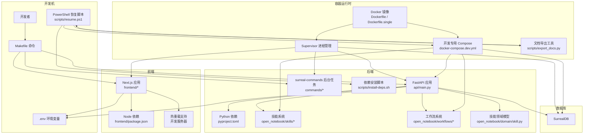
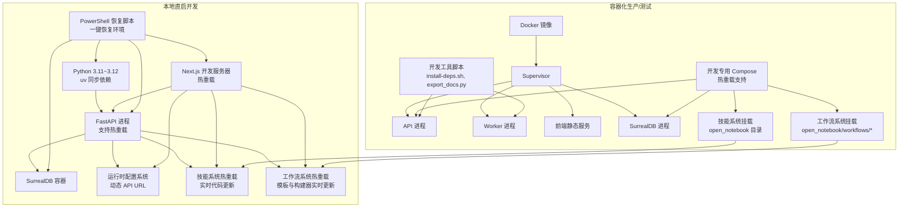
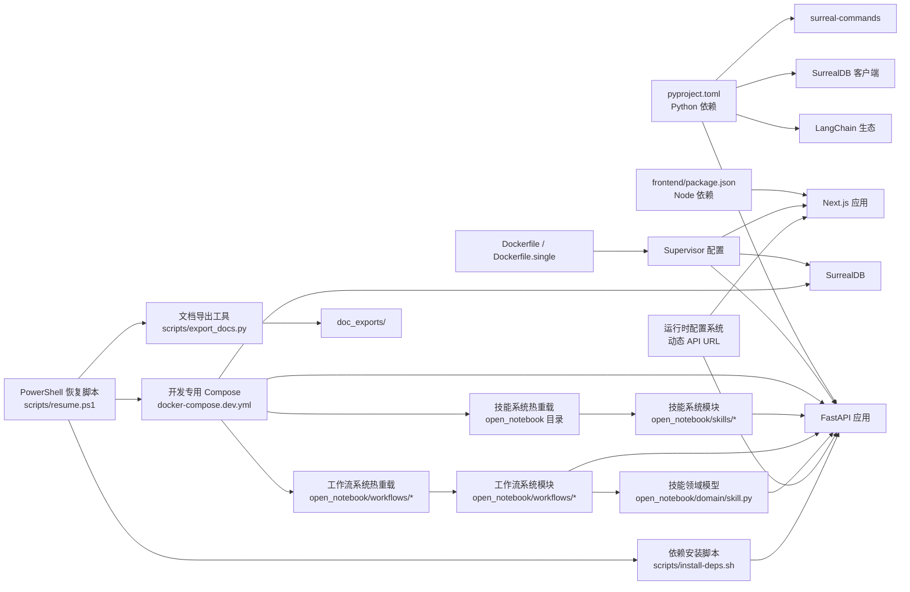

# 开发环境搭建

<cite>
**本文引用的文件**
- [README.dev.md](file://README.dev.md)
- [README.md](file://README.md)
- [pyproject.toml](file://pyproject.toml)
- [.env.example](file://.env.example)
- [Dockerfile](file://Dockerfile)
- [Dockerfile.single](file://Dockerfile.single)
- [docker-compose.yml](file://docker-compose.yml)
- [docker-compose.dev.yml](file://docker-compose.dev.yml)
- [examples/docker-compose-dev.yml](file://examples/docker-compose-dev.yml)
- [Makefile](file://Makefile)
- [supervisord.conf](file://supervisord.conf)
- [supervisord.single.conf](file://supervisord.single.conf)
- [scripts/wait-for-api.sh](file://scripts/wait-for-api.sh)
- [scripts/resume.ps1](file://scripts/resume.ps1)
- [scripts/install-deps.sh](file://scripts/install-deps.sh)
- [scripts/export_docs.py](file://scripts/export_docs.py)
- [scripts/README.md](file://scripts/README.md)
- [frontend/package.json](file://frontend/package.json)
- [frontend/start-server.js](file://frontend/start-server.js)
- [frontend/next.config.ts](file://frontend/next.config.ts)
- [frontend/src/lib/config.ts](file://frontend/src/lib/config.ts)
- [frontend/src/app/config/route.ts](file://frontend/src/app/config/route.ts)
- [open_notebook/config.py](file://open_notebook/config.py)
- [api/main.py](file://api/main.py)
- [open_notebook/domain/skill.py](file://open_notebook/domain/skill.py)
- [open_notebook/skills/__init__.py](file://open_notebook/skills/__init__.py)
- [open_notebook/skills/registry.py](file://open_notebook/skills/registry.py)
- [open_notebook/skills/base.py](file://open_notebook/skills/base.py)
- [open_notebook/skills/runner.py](file://open_notebook/skills/runner.py)
- [open_notebook/skills/content_crawler.py](file://open_notebook/skills/content_crawler.py)
- [open_notebook/skills/browser_base.py](file://open_notebook/skills/browser_base.py)
- [open_notebook/skills/note_organizer.py](file://open_notebook/skills/note_organizer.py)
- [api/routers/skills.py](file://api/routers/skills.py)
- [api/routers/workflows.py](file://api/routers/workflows.py)
- [api/routers/workflow_builder.py](file://api/routers/workflow_builder.py)
- [api/routers/workflow_templates.py](file://api/routers/workflow_templates.py)
- [open_notebook/workflows/service.py](file://open_notebook/workflows/service.py)
- [open_notebook/workflows/engine.py](file://open_notebook/workflows/engine.py)
- [open_notebook/workflows/templates.py](file://open_notebook/workflows/templates.py)
- [open_notebook/workflows/conversational.py](file://open_notebook/workflows/conversational.py)
- [run_api.py](file://run_api.py)
</cite>

## 更新摘要
**变更内容**
- 新增工作流相关文件的热重载支持，通过卷挂载 open_notebook 目录实现技能和工作流相关文件的实时更新
- 改进API路由的开发挂载方式，优化开发服务器的即时反馈能力
- 增强工作流系统的开发体验，支持工作流模板、对话式工作流构建器的热重载
- 完善技能系统与工作流系统的协同开发支持

## 目录
1. [简介](#简介)
2. [项目结构](#项目结构)
3. [核心组件](#核心组件)
4. [架构总览](#架构总览)
5. [详细组件分析](#详细组件分析)
6. [技能系统架构](#技能系统架构)
7. [工作流系统架构](#工作流系统架构)
8. [开发工具与脚本](#开发工具与脚本)
9. [依赖分析](#依赖分析)
10. [性能考虑](#性能考虑)
11. [故障排查指南](#故障排查指南)
12. [结论](#结论)
13. [附录](#附录)

## 简介
本指南面向开发者与运维人员，提供 Open Notebook 的完整开发环境搭建流程，涵盖系统要求、Python 与 Node.js 版本、依赖安装、Docker 与单容器部署、环境变量与数据库初始化、AI 提供商密钥配置、开发服务器启动与热重载、技能系统开发支持、工作流系统开发支持、开发工具脚本使用、以及常见问题排查与优化建议。

## 项目结构
Open Notebook 采用前后端分离架构：后端使用 FastAPI（Python），前端使用 Next.js（TypeScript/React）。数据库为 SurrealDB；通过 uv 打包与管理 Python 依赖；Docker 多阶段构建镜像；Supervisor 统一管理多个进程；开发时支持本地直启与 Docker Compose 双模式，特别针对技能系统和工作流系统提供完整的热重载支持。新增的工作流相关文件热重载支持进一步提升了开发者本地代码修改的即时反馈能力。



**图表来源**
- [Makefile](file://Makefile#L156-L172)
- [scripts/resume.ps1](file://scripts/resume.ps1#L1-L109)
- [scripts/install-deps.sh](file://scripts/install-deps.sh#L1-L20)
- [scripts/export_docs.py](file://scripts/export_docs.py#L1-L97)
- [api/main.py](file://api/main.py#L1-L190)
- [frontend/package.json](file://frontend/package.json#L1-L77)
- [frontend/next.config.ts](file://frontend/next.config.ts#L1-L36)
- [pyproject.toml](file://pyproject.toml#L1-L100)
- [Dockerfile](file://Dockerfile#L1-L159)
- [Dockerfile.single](file://Dockerfile.single#L1-L81)
- [docker-compose.dev.yml](file://docker-compose.dev.yml#L1-L34)
- [supervisord.conf](file://supervisord.conf#L1-L41)
- [supervisord.single.conf](file://supervisord.single.conf#L1-L52)
- [open_notebook/domain/skill.py](file://open_notebook/domain/skill.py#L1-L159)
- [open_notebook/skills/__init__.py](file://open_notebook/skills/__init__.py#L1-L32)
- [open_notebook/workflows/__init__.py](file://open_notebook/workflows/__init__.py#L1-L29)

**章节来源**
- [README.dev.md](file://README.dev.md#L355-L376)
- [Makefile](file://Makefile#L1-L210)
- [scripts/resume.ps1](file://scripts/resume.ps1#L1-L109)

## 核心组件
- 后端 API（FastAPI）：负责路由注册、中间件、异常处理、数据库迁移与健康检查。
- 后台任务（surreal-commands）：执行数据库命令与异步任务。
- 前端（Next.js）：现代化 React UI，支持国际化与主题切换，具备热重载能力。
- 数据库（SurrealDB）：文档/图形混合数据库，提供自动迁移。
- 容器运行时（Supervisor + Docker）：统一管理 API、Worker、前端与数据库进程。
- 开发工具链（uv、Makefile、脚本）：加速依赖安装、服务编排与发布。
- 运行时配置系统：动态配置 API URL，支持开发环境灵活部署。
- 技能系统：完整的自动化技能框架，支持热重载开发。
- 工作流系统：基于技能的工作流编排系统，支持模板化和对话式构建。
- **工作流相关文件热重载**：通过卷挂载实现工作流相关文件的实时更新。
- **开发工具集合**：包含依赖安装、文档导出等实用脚本。

**章节来源**
- [api/main.py](file://api/main.py#L1-L190)
- [open_notebook/config.py](file://open_notebook/config.py#L1-L18)
- [frontend/package.json](file://frontend/package.json#L1-L77)
- [frontend/next.config.ts](file://frontend/next.config.ts#L1-L36)
- [frontend/src/lib/config.ts](file://frontend/src/lib/config.ts#L1-L149)
- [pyproject.toml](file://pyproject.toml#L1-L100)
- [Dockerfile](file://Dockerfile#L1-L159)
- [Dockerfile.single](file://Dockerfile.single#L1-L81)
- [docker-compose.dev.yml](file://docker-compose.dev.yml#L1-L34)
- [supervisord.conf](file://supervisord.conf#L1-L41)
- [supervisord.single.conf](file://supervisord.single.conf#L1-L52)
- [open_notebook/domain/skill.py](file://open_notebook/domain/skill.py#L1-L159)
- [open_notebook/skills/__init__.py](file://open_notebook/skills/__init__.py#L1-L32)
- [open_notebook/workflows/__init__.py](file://open_notebook/workflows/__init__.py#L1-L29)
- [scripts/resume.ps1](file://scripts/resume.ps1#L1-L109)

## 架构总览
下图展示开发与生产两种典型部署形态：本地直启（开发机原生）与容器化（Docker + Supervisor），特别强调技能系统、工作流系统和工作流相关文件的热重载支持。



**图表来源**
- [pyproject.toml](file://pyproject.toml#L14-L43)
- [frontend/package.json](file://frontend/package.json#L5-L13)
- [frontend/next.config.ts](file://frontend/next.config.ts#L1-L36)
- [frontend/src/lib/config.ts](file://frontend/src/lib/config.ts#L1-L149)
- [Dockerfile](file://Dockerfile#L1-L159)
- [Dockerfile.single](file://Dockerfile.single#L1-L81)
- [docker-compose.dev.yml](file://docker-compose.dev.yml#L1-L34)
- [supervisord.conf](file://supervisord.conf#L7-L40)
- [supervisord.single.conf](file://supervisord.single.conf#L7-L51)
- [open_notebook/domain/skill.py](file://open_notebook/domain/skill.py#L1-L159)
- [open_notebook/skills/__init__.py](file://open_notebook/skills/__init__.py#L1-L32)
- [open_notebook/workflows/__init__.py](file://open_notebook/workflows/__init__.py#L1-L29)
- [scripts/resume.ps1](file://scripts/resume.ps1#L1-L109)
- [scripts/install-deps.sh](file://scripts/install-deps.sh#L1-L20)
- [scripts/export_docs.py](file://scripts/export_docs.py#L1-L97)

## 详细组件分析

### 系统要求与前置条件
- Python 版本：3.11 至 3.12（推荐 3.12）
- Node.js 版本：20.x LTS（用于前端构建与运行）
- 包管理器：uv（Python 依赖同步）、npm（前端依赖安装）
- 容器：Docker Desktop（可选，用于容器化部署）
- **PowerShell（Windows开发者专用）**：用于运行恢复脚本和开发工具

**章节来源**
- [pyproject.toml](file://pyproject.toml#L14-L14)
- [frontend/package.json](file://frontend/package.json#L1-L77)
- [Dockerfile](file://Dockerfile#L14-L15)
- [README.md](file://README.md#L99-L101)
- [scripts/resume.ps1](file://scripts/resume.ps1#L1-L109)

### 依赖安装

#### 后端 Python 依赖
- 使用 uv 进行快速同步，冻结依赖以确保一致性。
- 建议在虚拟环境中安装，避免系统级冲突。
- **技能系统依赖**：通过 install-deps.sh 脚本自动安装 APScheduler、browser-use 等必需包。

**章节来源**
- [README.dev.md](file://README.dev.md#L16-L17)
- [pyproject.toml](file://pyproject.toml#L1-L100)
- [Dockerfile](file://Dockerfile#L33-L33)
- [scripts/install-deps.sh](file://scripts/install-deps.sh#L1-L20)

#### 前端 Node.js 依赖
- 在 frontend 目录下使用 npm ci 安装锁定版本依赖。
- 构建产物输出至 .next/standalone，由 Supervisor 启动的 Node 服务提供。

**章节来源**
- [frontend/package.json](file://frontend/package.json#L1-L77)
- [Dockerfile](file://Dockerfile#L42-L45)
- [frontend/start-server.js](file://frontend/start-server.js#L1-L10)

### 环境变量配置
- 必填项：加密密钥、数据库连接参数。
- 可选项：AI 提供商密钥、外部 API 地址、分块策略、基础认证等。
- 建议通过 UI 设置密钥，或在本地复制 .env.example 并按需修改。

**章节来源**
- [.env.example](file://.env.example#L1-L60)
- [README.dev.md](file://README.dev.md#L379-L398)

### 数据库初始化
- API 启动时自动执行数据库迁移，若检测到未完成迁移则阻断启动并记录错误。
- 默认使用 ws://localhost:8000 或 docker-compose 中的 surrealdb 服务。

**章节来源**
- [api/main.py](file://api/main.py#L66-L88)
- [docker-compose.yml](file://docker-compose.yml#L2-L13)

### AI 提供商密钥设置
- 支持多种提供商（OpenAI、Anthropic、Google、Groq、Ollama 等）。
- 可在 UI 的"设置 → API 密钥"中添加与测试连接，或直接在 .env 中配置。

**章节来源**
- [.env.example](file://.env.example#L28-L38)
- [README.md](file://README.md#L156-L161)

### 开发服务器启动与热重载

#### 本地直启开发环境
- 使用 Makefile 的 start-all，同时启动数据库、API、Worker 与前端。
- 前端热重载：Next.js 开发服务器默认监听 3000 端口。
- API 文档：启动后访问 http://localhost:5055/docs。
- **API热重载**：通过 run_api.py 支持热重载模式，自动检测代码变化。

#### 开发专用 Compose 配置（已增强）
- 使用 docker-compose.dev.yml 启动开发环境。
- **新增技能系统热重载支持**：通过卷挂载 open_notebook 目录实现技能相关文件的实时热更新。
- **新增工作流系统热重载支持**：通过卷挂载 open_notebook/workflows/* 实现工作流模板和构建器的实时热更新。
- 端口映射：8502（Web UI）、5055（REST API）、8000（数据库）。

#### 运行时配置系统
- 动态获取 API URL，支持开发环境灵活部署。
- 优先级：运行时配置 > 构建时环境变量 > 智能默认值。
- 支持相对路径重写，避免 CORS 问题。

**章节来源**
- [README.dev.md](file://README.dev.md#L36-L81)
- [Makefile](file://Makefile#L156-L172)
- [Makefile](file://Makefile#L129-L133)
- [docker-compose.dev.yml](file://docker-compose.dev.yml#L28-L33)
- [frontend/src/lib/config.ts](file://frontend/src/lib/config.ts#L1-L149)
- [frontend/src/app/config/route.ts](file://frontend/src/app/config/route.ts#L28-L68)
- [api/main.py](file://api/main.py#L187-L189)
- [run_api.py](file://run_api.py#L16-L31)

### Docker 与单容器部署

#### Docker Compose（推荐用于开发与测试）
- 使用 docker-compose.yml 启动 surrealdb 与 open_notebook 服务。
- 暴露端口：8502（Web UI）、5055（REST API）。
- 数据持久化：分别挂载 surreal_data 与 notebook_data。

#### 开发专用 Compose（已增强）
- 使用 docker-compose.dev.yml 启动开发环境。
- **新增技能系统热重载支持**：挂载 open_notebook 目录实现技能相关文件的实时热更新。
- **新增工作流系统热重载支持**：挂载 open_notebook/workflows/* 实现工作流模板和构建器的实时热更新。
- 端口映射：8502（Web UI）、5055（API）、8000（数据库）。

#### 单容器镜像（Dockerfile.single）
- 将前端构建产物与后端运行时打包进同一镜像，内置 SurrealDB。
- 适合独立部署场景，端口暴露同上。

#### 多阶段构建镜像（Dockerfile）
- 分离前端构建与后端运行时，体积更小，适合多平台分发。
- 运行时安装 Chrome 以支持浏览器自动化。

**章节来源**
- [docker-compose.yml](file://docker-compose.yml#L1-L37)
- [docker-compose.dev.yml](file://docker-compose.dev.yml#L1-L34)
- [examples/docker-compose-dev.yml](file://examples/docker-compose-dev.yml#L1-L29)
- [Dockerfile.single](file://Dockerfile.single#L1-L81)
- [Dockerfile](file://Dockerfile#L1-L159)
- [supervisord.conf](file://supervisord.conf#L7-L40)
- [supervisord.single.conf](file://supervisord.single.conf#L7-L51)

### 进程管理与启动顺序
- Supervisor 统一管理 API、Worker、前端与数据库进程。
- 前端启动前通过 wait-for-api.sh 等等待 API 健康检查接口可用。
- 支持 passenv 注入 API_URL/NEXT_PUBLIC_API_URL/INTERNAL_API_URL 等环境变量。

**章节来源**
- [supervisord.conf](file://supervisord.conf#L28-L40)
- [supervisord.single.conf](file://supervisord.single.conf#L40-L51)
- [scripts/wait-for-api.sh](file://scripts/wait-for-api.sh#L1-L23)

### 数据目录与缓存
- 后端数据目录：./data，包含 SQLite 检查点、上传目录、tiktoken 缓存等。
- 建议在宿主机映射持久化卷，避免容器重建丢失数据。

**章节来源**
- [open_notebook/config.py](file://open_notebook/config.py#L1-L18)

### 前端开发服务器配置

#### Next.js 热重载配置
- 输出模式：standalone，优化 Docker 部署。
- 实验性功能：增加代理客户端最大主体大小（100MB）。
- API 重写：将 /api/* 请求代理到 FastAPI 后端。

#### 运行时配置系统
- 动态获取 API URL，支持开发环境灵活部署。
- 优先级：运行时配置 > 构建时环境变量 > 智能默认值。
- 支持相对路径重写，避免 CORS 问题。

**章节来源**
- [frontend/next.config.ts](file://frontend/next.config.ts#L1-L36)
- [frontend/src/lib/config.ts](file://frontend/src/lib/config.ts#L1-L149)
- [frontend/src/app/config/route.ts](file://frontend/src/app/config/route.ts#L28-L68)

## 技能系统架构

Open Notebook 的技能系统是一个完整的自动化技能框架，支持多种类型的自动化任务，包括内容爬取、浏览器自动化和智能内容处理。

### 技能系统核心组件

#### 技能领域模型
- **SkillInstance**：技能实例配置，存储技能类型、参数、调度和目标笔记本信息。
- **SkillExecution**：技能执行历史和日志，跟踪执行状态、输出和时间信息。

#### 技能注册表
- **SkillRegistry**：中央注册表，维护技能类型到类的映射，支持动态技能实例化。
- **register_skill**：便捷装饰器，用于注册新技能。

#### 技能基类系统
- **Skill**：所有技能的基础抽象类，定义执行生命周期和参数验证。
- **SkillConfig**：技能配置模型，存储在数据库中并可通过 UI 编辑。
- **SkillContext**：执行上下文，包含运行时信息和依赖。
- **SkillResult**：技能执行结果，包含状态、输出和创建的资源 ID。

#### 技能执行引擎
- **SkillRunner**：技能执行引擎，处理执行生命周期、日志记录和错误处理。
- 支持按实例执行和直接执行两种模式。

### 技能类型

#### 内容爬取技能
- **RssCrawlerSkill**：从 RSS 源抓取内容，创建 Source 记录。
- **BrowserCrawlerSkill**：使用 AI 驱动的浏览器自动化抓取动态内容。

#### 内容组织技能
- **NoteSummarizerSkill**：自动生成笔记摘要。
- **NoteTaggerSkill**：为笔记和源生成智能标签。

#### 浏览器自动化技能
- **BrowserUseSkill**：AI 驱动的浏览器自动化基础类。

### 技能系统 API

#### 技能管理 API
- 列出可用技能类型
- 创建、读取、更新、删除技能实例
- 执行技能实例
- 查看执行历史

#### 技能执行 API
- 手动执行技能
- 直接执行技能（无需实例）
- 取消运行中的执行

**章节来源**
- [open_notebook/domain/skill.py](file://open_notebook/domain/skill.py#L1-L159)
- [open_notebook/skills/registry.py](file://open_notebook/skills/registry.py#L1-L133)
- [open_notebook/skills/base.py](file://open_notebook/skills/base.py#L1-L183)
- [open_notebook/skills/runner.py](file://open_notebook/skills/runner.py#L1-L250)
- [open_notebook/skills/content_crawler.py](file://open_notebook/skills/content_crawler.py#L1-L311)
- [open_notebook/skills/browser_base.py](file://open_notebook/skills/browser_base.py#L1-L312)
- [open_notebook/skills/note_organizer.py](file://open_notebook/skills/note_organizer.py#L1-L406)
- [api/routers/skills.py](file://api/routers/skills.py#L1-L401)

## 工作流系统架构

Open Notebook 的工作流系统是一个基于技能的工作流编排框架，支持复杂的工作流定义、执行和管理。

### 工作流系统核心组件

#### 工作流定义与执行
- **WorkflowDefinition**：工作流定义，包含步骤、输入输出模式、调度信息。
- **WorkflowExecution**：工作流执行记录，跟踪执行状态、步骤执行历史和结果。
- **WorkflowStatus**：工作流状态枚举，支持 PENDING、RUNNING、SUCCESS、FAILED、PARTIAL、CANCELLED。

#### 工作流引擎
- **WorkflowEngine**：核心执行引擎，负责步骤依赖解析、并发执行、重试逻辑和错误处理。
- 支持条件执行、并行步骤、依赖关系和错误恢复。

#### 工作流服务层
- **WorkflowService**：工作流操作的服务层，提供创建、查询、执行和管理接口。
- 协调引擎、领域模型和外部系统。

#### 工作流模板系统
- **WorkflowTemplate**：预定义工作流模板，提供即用型工作流配置。
- **TemplateRegistry**：模板注册表，管理模板的注册、查找和分类。

#### 对话式工作流构建器
- **ConversationalWorkflowBuilder**：基于自然语言的工作流生成器。
- **WorkflowSuggestionEngine**：根据用户目标和内容类型提供工作流建议。

### 工作流 API

#### 工作流管理 API
- 创建、读取、更新、删除工作流定义
- 复制工作流定义
- 获取工作流统计信息

#### 工作流执行 API
- 手动执行工作流
- 查询执行历史
- 取消运行中的执行

#### 工作流调度 API
- 获取工作流调度信息
- 更新工作流调度
- 启用/禁用工作流

#### 工作流模板 API
- 浏览工作流模板
- 获取模板详情
- 实例化模板创建工作流
- 快速创建工作流

#### 对话式构建 API
- 从自然语言生成工作流
- 优化现有工作流
- 获取工作流建议
- 快速创建模板

**章节来源**
- [api/routers/workflows.py](file://api/routers/workflows.py#L1-L453)
- [api/routers/workflow_builder.py](file://api/routers/workflow_builder.py#L1-L305)
- [api/routers/workflow_templates.py](file://api/routers/workflow_templates.py#L1-L215)
- [open_notebook/workflows/service.py](file://open_notebook/workflows/service.py#L1-L240)
- [open_notebook/workflows/engine.py](file://open_notebook/workflows/engine.py#L1-L620)
- [open_notebook/workflows/templates.py](file://open_notebook/workflows/templates.py#L1-L675)
- [open_notebook/workflows/conversational.py](file://open_notebook/workflows/conversational.py#L1-L426)

## 开发工具与脚本

### PowerShell 恢复脚本（Windows 专用）

**PowerShell 恢复脚本**是为 Windows 开发者提供的强大工具，能够一键检查和恢复 Open Notebook 开发环境的状态。

#### 脚本功能特性
- **Docker 状态检查**：自动验证 Docker Desktop 是否正常运行
- **容器状态显示**：列出当前运行中的容器及其状态
- **Git 状态检查**：显示工作区是否有未提交的更改
- **服务端口检测**：检查关键端口（8502、5055、8000）的占用情况
- **项目摘要显示**：提供技术栈、主要功能和访问地址的概览
- **一键服务启动**：可选择自动启动 Docker 服务

#### 使用方法
```powershell
# 进入项目目录
cd 

# 运行恢复脚本
.\scripts\resume.ps1
```

#### 脚本输出示例
脚本会显示详细的环境检查结果，包括：
- Docker 状态（绿色勾号表示正常）
- 当前运行的容器列表
- Git 工作区状态
- 服务端口占用情况
- 项目技术栈摘要
- 快速操作建议

#### 自动化操作
脚本结束后会提供以下快速操作建议：
- 启动/停止/重启服务
- 查看日志
- 访问不同服务界面
- 前端和后端开发命令

**章节来源**
- [scripts/resume.ps1](file://scripts/resume.ps1#L1-L109)

### 依赖安装脚本

**install-deps.sh** 脚本用于在容器启动时自动检查和安装技能系统所需的依赖包。

#### 自动检测与安装
- **APScheduler**：定时任务调度框架
- **browser-use**：浏览器自动化功能
- **tzlocal**：时区本地化支持

#### 脚本执行逻辑
```bash
#!/bin/bash
# 检查并安装技能系统依赖
# 如果包未安装，则自动安装
```

**章节来源**
- [scripts/install-deps.sh](file://scripts/install-deps.sh#L1-L20)

### 文档导出工具

**export_docs.py** 是一个强大的文档整理工具，能够将 docs/ 目录下的所有 Markdown 文件整合成便于分享和使用的格式。

#### 工具功能
- 扫描 docs/ 目录下的所有子文件夹
- 合并每个子文件夹中的所有 .md 文件（排除 index.md）
- 为每个子文件夹生成一个合并后的 Markdown 文件
- 保存到 doc_exports/ 目录

#### 输出格式特点
- 每个导出文件都有主标题（文件夹名称）
- 每个源文件都有单独的章节标题
- 包含源文件归属信息
- 完整保留原始内容
- 使用视觉分隔符区分不同部分

#### 使用方法
```bash
# 使用 Makefile（推荐）
make export-docs

# 或直接运行
uv run python scripts/export_docs.py
```

**章节来源**
- [scripts/export_docs.py](file://scripts/export_docs.py#L1-L97)
- [scripts/README.md](file://scripts/README.md#L1-L76)

### 开发工具最佳实践

#### 脚本使用建议
- **PowerShell 恢复脚本**：建议在每次开始开发前运行，确保环境状态正确
- **依赖安装脚本**：在容器首次启动时自动执行，确保所有功能正常
- **文档导出工具**：在需要与他人分享文档时使用，便于 ChatGPT 等平台处理

#### 环境管理
- 使用 PowerShell 恢复脚本快速检查环境状态
- 定期运行文档导出工具整理开发文档
- 确保技能系统和工作流系统依赖正确安装

**章节来源**
- [scripts/resume.ps1](file://scripts/resume.ps1#L1-L109)
- [scripts/install-deps.sh](file://scripts/install-deps.sh#L1-L20)
- [scripts/export_docs.py](file://scripts/export_docs.py#L1-L97)
- [scripts/README.md](file://scripts/README.md#L1-L76)

## 依赖分析



**图表来源**
- [pyproject.toml](file://pyproject.toml#L15-L43)
- [frontend/package.json](file://frontend/package.json#L14-L57)
- [Dockerfile](file://Dockerfile#L1-L159)
- [Dockerfile.single](file://Dockerfile.single#L1-L81)
- [docker-compose.dev.yml](file://docker-compose.dev.yml#L1-L34)
- [open_notebook/domain/skill.py](file://open_notebook/domain/skill.py#L1-L159)
- [open_notebook/skills/__init__.py](file://open_notebook/skills/__init__.py#L1-L32)
- [open_notebook/workflows/__init__.py](file://open_notebook/workflows/__init__.py#L1-L29)
- [frontend/src/lib/config.ts](file://frontend/src/lib/config.ts#L1-L149)
- [supervisord.conf](file://supervisord.conf#L1-L41)
- [supervisord.single.conf](file://supervisord.single.conf#L1-L52)
- [scripts/resume.ps1](file://scripts/resume.ps1#L1-L109)
- [scripts/install-deps.sh](file://scripts/install-deps.sh#L1-L20)
- [scripts/export_docs.py](file://scripts/export_docs.py#L1-L97)

**章节来源**
- [pyproject.toml](file://pyproject.toml#L1-L100)
- [frontend/package.json](file://frontend/package.json#L1-L77)

## 性能考虑
- 优先使用本地直启进行日常开发，获得最快迭代速度与热重载体验。
- **技能系统热重载**：通过挂载 open_notebook 目录实现技能相关文件的实时更新，显著提升开发效率。
- **工作流系统热重载**：通过挂载 open_notebook/workflows/* 实现工作流模板和构建器的实时热更新，提升工作流开发体验。
- 将数据库保持常驻，减少重复启动时间。
- 仅在需要验证 Dockerfile 变更时使用本地 Docker 构建。
- 清理缓存与无用镜像，降低资源占用。
- **PowerShell 恢复脚本**：为 Windows 开发者提供快速环境检查和恢复能力，减少手动操作时间。
- **开发工具自动化**：通过脚本自动处理依赖安装和文档整理，提高开发效率。

**章节来源**
- [README.dev.md](file://README.dev.md#L402-L422)
- [docker-compose.dev.yml](file://docker-compose.dev.yml#L28-L33)
- [scripts/resume.ps1](file://scripts/resume.ps1#L1-L109)

## 故障排查指南

### 服务无法启动
- 检查服务状态与日志，确认数据库、API、Worker、前端是否正常。
- 重启所有服务并观察启动顺序。

### 端口占用
- 查找占用端口的进程并释放，或调整映射端口。
- 使用 stop-all 停止所有相关进程。

### 数据库连接问题
- 确认 .env 中的 SURREAL_* 参数与实际服务一致。
- 检查 docker-compose 中的 surrealdb 服务状态。

### Docker 构建失败
- 清理构建器缓存并重置多平台构建环境。
- 先在本地尝试构建，定位问题后再推送镜像。

### 前端无法连接 API
- 等待 API 健康检查接口可用（wait-for-api.sh）。
- 检查 API_URL/NEXT_PUBLIC_API_URL/INTERNAL_API_URL 环境变量。

### 热重载不工作
- **技能系统热重载**：确认开发专用 Compose 正在运行：`make dev`。
- **工作流系统热重载**：确认开发专用 Compose 正在运行，open_notebook/workflows/* 目录是否正确挂载。
- 检查卷挂载：open_notebook 目录和 open_notebook/workflows/* 是否正确挂载。
- 验证端口映射：8502 和 5055 是否可用。
- **新增**：确认技能相关文件（open_notebook/skills/*、open_notebook/domain/skill.py）在挂载目录中存在。
- **新增**：确认工作流相关文件（open_notebook/workflows/*）在挂载目录中存在。

### API热重载问题
- **API热重载模式**：确认 run_api.py 中的 API_RELOAD 环境变量设置为 true。
- **热重载目录**：确认 reload_dirs 包含正确的项目目录。
- **文件监控**：检查 Python 文件变化是否被正确检测。

### 运行时配置问题
- 检查 /config 端点是否可访问。
- 验证环境变量 NEXT_PUBLIC_API_URL 设置。
- 确认相对路径重写配置正确。

### PowerShell 恢复脚本问题（Windows）
- **Docker Desktop 未启动**：确保 Docker Desktop 正常运行
- **权限问题**：以管理员权限运行 PowerShell
- **脚本执行策略**：如遇执行限制，可临时调整执行策略
- **网络连接**：确保网络连接正常，以便检查服务状态

### 开发工具使用问题
- **文档导出失败**：检查 docs/ 目录结构和文件权限
- **依赖安装失败**：检查网络连接和 Python 环境
- **脚本路径问题**：确保在正确的项目根目录下运行

**章节来源**
- [README.dev.md](file://README.dev.md#L299-L316)
- [README.dev.md](file://README.dev.md#L318-L328)
- [README.dev.md](file://README.dev.md#L330-L338)
- [README.dev.md](file://README.dev.md#L340-L351)
- [scripts/wait-for-api.sh](file://scripts/wait-for-api.sh#L1-L23)
- [supervisord.conf](file://supervisord.conf#L32-L32)
- [supervisord.single.conf](file://supervisord.single.conf#L44-L44)
- [docker-compose.dev.yml](file://docker-compose.dev.yml#L28-L33)
- [frontend/src/lib/config.ts](file://frontend/src/lib/config.ts#L1-L149)
- [frontend/src/app/config/route.ts](file://frontend/src/app/config/route.ts#L28-L68)
- [scripts/resume.ps1](file://scripts/resume.ps1#L1-L109)
- [scripts/export_docs.py](file://scripts/export_docs.py#L1-L97)
- [run_api.py](file://run_api.py#L16-L31)

## 结论
通过本指南，您可以在本地或容器环境中快速搭建 Open Notebook 的开发与生产环境。建议日常开发采用本地直启，配合 Docker Compose 进行集成测试；生产部署可选用单容器镜像以简化运维。新增的开发专用 Compose 配置、运行时配置系统、PowerShell 恢复脚本和开发工具集合进一步提升了开发体验，特别是技能系统和工作流系统的热重载支持和 Windows 开发者的环境恢复能力，显著改善了技能开发、工作流开发和日常开发的迭代效率。

## 附录

### 常用命令速查
- 本地直启：make start-all
- 停止全部：make stop-all
- 查看状态：make status
- 数据库服务：make database
- API 服务：make api
- 前端服务：make frontend
- Worker 服务：make worker
- Docker 构建（本地）：make docker-build-local
- Docker 推送版本标签：make docker-push
- Docker 推送最新标签：make docker-push-latest
- 开发环境启动：make dev
- 全栈开发环境：make full
- **PowerShell 恢复**：.\scripts\resume.ps1
- **文档导出**：make export-docs

**章节来源**
- [README.dev.md](file://README.dev.md#L15-L81)
- [Makefile](file://Makefile#L1-L210)
- [Makefile](file://Makefile#L129-L133)
- [Makefile](file://Makefile#L132-L133)
- [scripts/resume.ps1](file://scripts/resume.ps1#L1-L109)
- [scripts/README.md](file://scripts/README.md#L1-L76)

### 开发环境配置要点
- **技能系统热重载**：通过卷挂载实现技能相关文件的实时更新
- **工作流系统热重载**：通过卷挂载 open_notebook/workflows/* 实现工作流模板和构建器的实时热更新
- 运行时配置：动态 API URL 获取机制
- 端口管理：8502（UI）、5055（API）、8000（数据库）
- 环境隔离：开发专用 Compose 文件与生产配置分离
- **技能系统模块**：open_notebook/skills/* 和 open_notebook/domain/skill.py 的完整支持
- **工作流系统模块**：open_notebook/workflows/* 的完整支持
- **PowerShell 恢复脚本**：Windows 开发者的环境恢复工具
- **开发工具集合**：依赖安装、文档导出等自动化脚本
- **自动化环境检查**：Docker 状态、Git 状态、服务端口检测

**章节来源**
- [docker-compose.dev.yml](file://docker-compose.dev.yml#L1-L34)
- [frontend/src/lib/config.ts](file://frontend/src/lib/config.ts#L1-L149)
- [frontend/next.config.ts](file://frontend/next.config.ts#L1-L36)
- [open_notebook/domain/skill.py](file://open_notebook/domain/skill.py#L1-L159)
- [open_notebook/skills/__init__.py](file://open_notebook/skills/__init__.py#L1-L32)
- [open_notebook/workflows/__init__.py](file://open_notebook/workflows/__init__.py#L1-L29)
- [scripts/resume.ps1](file://scripts/resume.ps1#L1-L109)
- [scripts/install-deps.sh](file://scripts/install-deps.sh#L1-L20)
- [scripts/export_docs.py](file://scripts/export_docs.py#L1-L97)