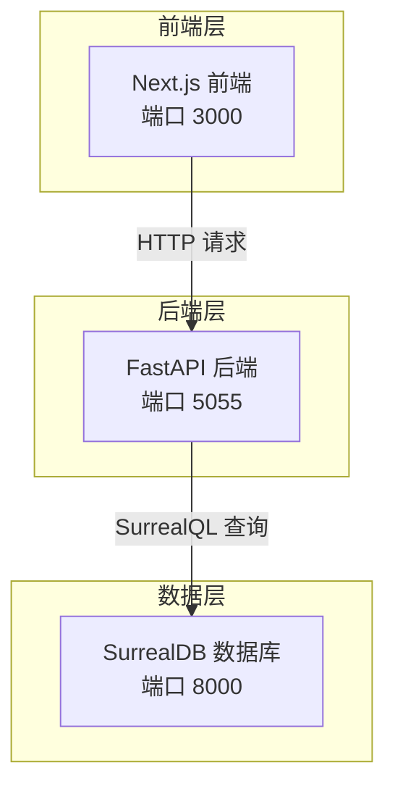
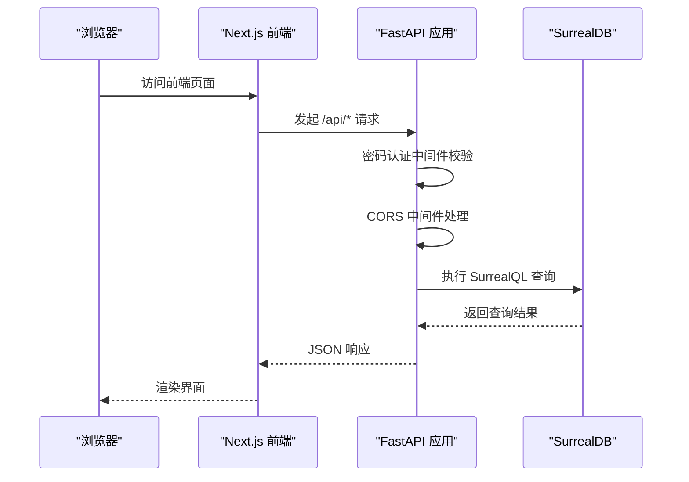
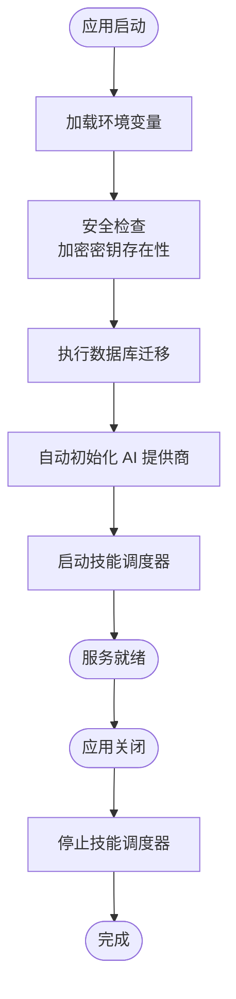
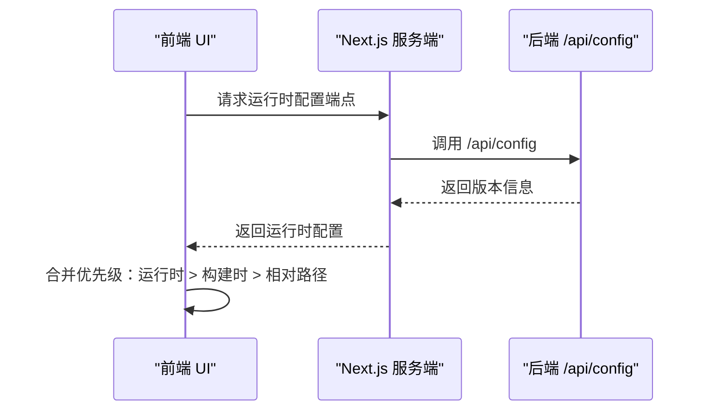
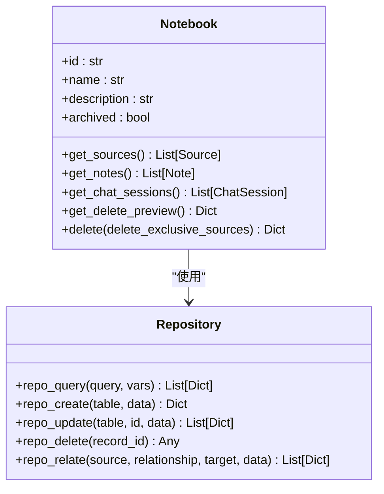
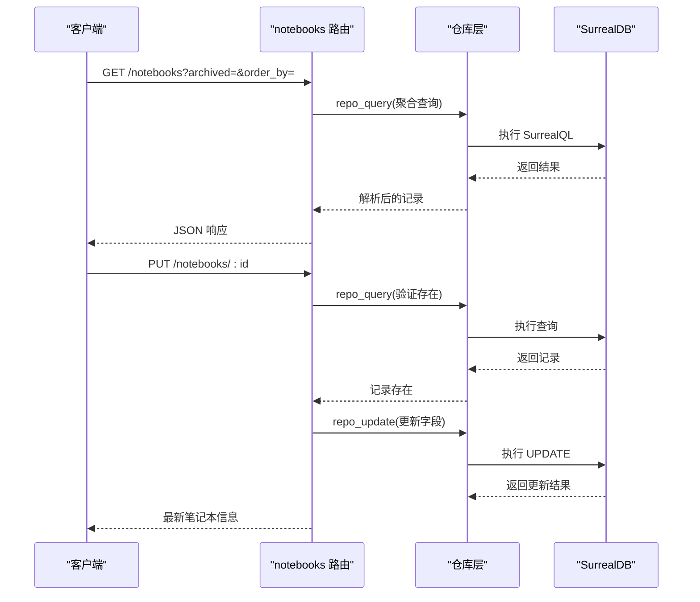
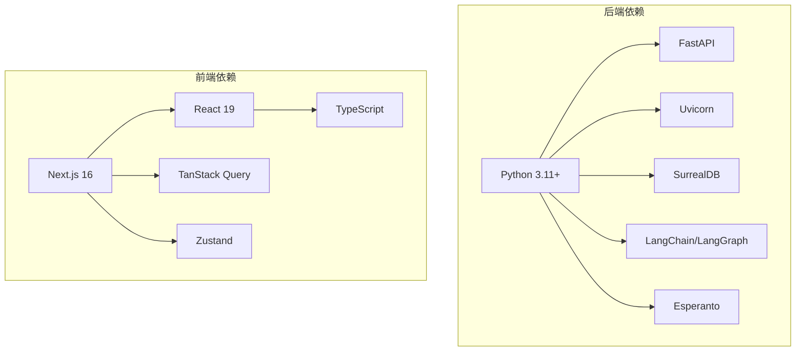

# 开发者工具

<cite>
**本文档引用的文件**
- [README.md](file://README.md)
- [run_api.py](file://run_api.py)
- [api/main.py](file://api/main.py)
- [frontend/package.json](file://frontend/package.json)
- [pyproject.toml](file://pyproject.toml)
- [open_notebook/config.py](file://open_notebook/config.py)
- [frontend/src/lib/config.ts](file://frontend/src/lib/config.ts)
- [frontend/src/lib/types/config.ts](file://frontend/src/lib/types/config.ts)
- [docs/7-DEVELOPMENT/architecture.md](file://docs/7-DEVELOPMENT/architecture.md)
- [docs/7-DEVELOPMENT/development-setup.md](file://docs/7-DEVELOPMENT/development-setup.md)
- [api/routers/notebooks.py](file://api/routers/notebooks.py)
- [open_notebook/database/repository.py](file://open_notebook/database/repository.py)
- [open_notebook/domain/notebook.py](file://open_notebook/domain/notebook.py)
- [Makefile](file://Makefile)
</cite>

## 目录
1. [简介](#简介)
2. [项目结构](#项目结构)
3. [核心组件](#核心组件)
4. [架构总览](#架构总览)
5. [详细组件分析](#详细组件分析)
6. [依赖关系分析](#依赖关系分析)
7. [性能考虑](#性能考虑)
8. [故障排除指南](#故障排除指南)
9. [结论](#结论)
10. [附录](#附录)

## 简介
本文件面向开发者，系统性介绍 Open Notebook 的开发工具与环境配置，涵盖本地开发设置、服务启动流程、前端配置、数据库连接、API 架构以及常见问题排查方法。目标是帮助贡献者快速搭建可运行的全栈开发环境，并理解各组件之间的交互关系。

## 项目结构
项目采用前后端分离的三层架构：前端使用 Next.js/React（端口 3000），后端使用 FastAPI（端口 5055），数据库为 SurrealDB（端口 8000）。开发工具通过 Makefile 提供统一的服务编排与任务管理；前端通过运行时配置动态解析 API 地址，支持反向代理场景下的灵活部署。

图表来源
- [docs/7-DEVELOPMENT/architecture.md](file://docs/7-DEVELOPMENT/architecture.md#L1-L80)
- [frontend/src/lib/config.ts](file://frontend/src/lib/config.ts#L1-L149)
- [api/main.py](file://api/main.py#L132-L160)

章节来源
- [docs/7-DEVELOPMENT/architecture.md](file://docs/7-DEVELOPMENT/architecture.md#L1-L80)
- [Makefile](file://Makefile#L156-L172)

## 核心组件
- 启动脚本与服务编排
  - 后端启动：通过 run_api.py 配置主机、端口与热重载模式，调用 uvicorn 运行 api.main:app。
  - 前端启动：Next.js 使用 npm 脚本 dev 启动开发服务器。
  - 服务编排：Makefile 提供 start-all、stop-all、status 等命令，一键启动数据库、API、Worker 和前端。
- 前端配置与运行时解析
  - 前端通过 runtime-config 端点优先获取后端返回的 API 地址，其次读取构建时环境变量 NEXT_PUBLIC_API_URL，默认使用相对路径（利用 Next.js 重写）以避免跨域与端口映射复杂性。
- 数据库连接与仓库层
  - 仓库层封装了 SurrealDB 的连接、查询、插入、更新、删除等操作，提供统一的异步接口与错误处理。
- 领域模型与路由
  - 领域模型 Notebook 封装了笔记本文档的业务逻辑（如获取源内容、聊天会话、删除预览等）。
  - API 路由示例 notebooks.py 展示了 CRUD 操作与数据库查询集成。

章节来源
- [run_api.py](file://run_api.py#L16-L31)
- [frontend/package.json](file://frontend/package.json#L5-L13)
- [Makefile](file://Makefile#L156-L172)
- [frontend/src/lib/config.ts](file://frontend/src/lib/config.ts#L22-L140)
- [open_notebook/database/repository.py](file://open_notebook/database/repository.py#L65-L195)
- [open_notebook/domain/notebook.py](file://open_notebook/domain/notebook.py#L16-L200)
- [api/routers/notebooks.py](file://api/routers/notebooks.py#L20-L200)

## 架构总览
下图展示了从浏览器到数据库的完整请求链路，包括中间件、异常处理与 CORS 设置：

图表来源
- [api/main.py](file://api/main.py#L132-L160)
- [api/main.py](file://api/main.py#L163-L187)
- [frontend/src/lib/config.ts](file://frontend/src/lib/config.ts#L113-L140)

章节来源
- [api/main.py](file://api/main.py#L132-L187)
- [docs/7-DEVELOPMENT/architecture.md](file://docs/7-DEVELOPMENT/architecture.md#L100-L147)

## 详细组件分析

### 组件 A：后端启动与生命周期管理
- 关键特性
  - 生命周期钩子在应用启动时执行数据库迁移、AI 提供商初始化与技能调度器启动。
  - 异常处理确保在数据库迁移失败时快速失败，避免 schema 不一致。
  - 中间件顺序：密码认证中间件先于 CORS 中间件，保证错误响应也包含 CORS 头。
- 典型流程
  - 启动：加载环境变量 → 安全检查（加密密钥）→ 自动迁移 → 初始化提供商 → 启动技能调度器。
  - 关闭：关闭技能调度器，优雅退出。

图表来源
- [api/main.py](file://api/main.py#L48-L129)

章节来源
- [api/main.py](file://api/main.py#L48-L129)

### 组件 B：前端配置与 API 地址解析
- 关键特性
  - 优先从运行时配置端点获取 API 地址，其次回退到构建时环境变量，最后使用相对路径（Next.js 重写）。
  - 支持开发环境日志输出，便于调试不同优先级的配置来源。
- 典型流程
  - 首次访问时并发获取运行时配置与后端 /api/config，合并为最终的 AppConfig。
  - 支持 resetConfig 重置缓存，便于测试。

图表来源
- [frontend/src/lib/config.ts](file://frontend/src/lib/config.ts#L59-L140)
- [frontend/src/lib/types/config.ts](file://frontend/src/lib/types/config.ts#L6-L24)

章节来源
- [frontend/src/lib/config.ts](file://frontend/src/lib/config.ts#L22-L140)
- [frontend/src/lib/types/config.ts](file://frontend/src/lib/types/config.ts#L1-L38)

### 组件 C：数据库仓库层与领域模型
- 仓库层职责
  - 统一封装数据库连接、查询、插入、更新、删除与关系建立。
  - 提供记录 ID 解析与类型转换，确保返回值一致性。
- 领域模型职责
  - Notebook 封装业务逻辑：获取源内容、笔记、聊天会话；计算删除预览；执行级联删除。
- 典型流程
  - Notebook 获取源内容：通过关系查询与子查询 fetch 关联对象，按更新时间排序。
  - 删除预览：统计仅属于该笔记本的源数量与共享源数量，用于确认删除影响范围。

图表来源
- [open_notebook/database/repository.py](file://open_notebook/database/repository.py#L65-L195)
- [open_notebook/domain/notebook.py](file://open_notebook/domain/notebook.py#L16-L200)

章节来源
- [open_notebook/database/repository.py](file://open_notebook/database/repository.py#L65-L195)
- [open_notebook/domain/notebook.py](file://open_notebook/domain/notebook.py#L29-L136)

### 组件 D：API 路由与数据访问示例
- notebooks 路由示例
  - 列表查询：支持按归档状态过滤与排序字段控制，同时在查询中聚合源与笔记计数。
  - 单条查询：通过记录 ID 查询并返回带计数的结果。
  - 更新操作：按需更新字段，随后重新查询以返回最新状态。
- 典型流程
  - 查询笔记本列表 → 执行聚合查询 → 可选过滤 → 序列化响应。
  - 更新笔记本 → 验证存在性 → 更新字段 → 再查询返回。

图表来源
- [api/routers/notebooks.py](file://api/routers/notebooks.py#L20-L200)
- [open_notebook/database/repository.py](file://open_notebook/database/repository.py#L134-L156)

章节来源
- [api/routers/notebooks.py](file://api/routers/notebooks.py#L20-L200)
- [open_notebook/database/repository.py](file://open_notebook/database/repository.py#L65-L156)

## 依赖关系分析
- 技术栈与版本约束
  - Python 3.11+，FastAPI、Uvicorn、Loguru、LangChain、LangGraph、SurrealDB、Esperanto 等核心依赖。
  - 前端使用 Next.js 16、React 19、TypeScript、Tailwind CSS、TanStack Query 等。
- 开发工具链
  - 代码质量：Ruff（lint）、MyPy（类型检查）、Pre-commit（提交前检查）。
  - 测试：Pytest、Vitest（前端单元测试）。
  - 构建与发布：Docker 多平台镜像构建、版本标签与推送。

图表来源
- [pyproject.toml](file://pyproject.toml#L15-L44)
- [frontend/package.json](file://frontend/package.json#L14-L56)

章节来源
- [pyproject.toml](file://pyproject.toml#L1-L101)
- [frontend/package.json](file://frontend/package.json#L1-L77)

## 性能考虑
- 异步优先：全栈采用 async/await，减少阻塞，提升并发处理能力。
- 流式响应：长耗时任务（如问答、播客生成）通过流式 SSE 返回增量结果，改善用户体验。
- 连接池与事务：数据库连接池与事务支持，降低锁冲突与超时风险。
- 缓存与查询优化：前端使用 TanStack Query 进行缓存与去重，后端通过聚合查询减少往返次数。

## 故障排除指南
- 数据库连接失败
  - 确认 SurrealDB 已启动且端口 8000 可访问；检查 .env 中 SURREAL_* 环境变量是否正确。
  - 参考开发设置文档中的“连接失败”排查步骤。
- API 启动失败或迁移错误
  - 查看 API 日志中的迁移错误信息；确认数据库已初始化且具备写权限。
  - 参考开发设置文档中的“迁移失败”排查步骤。
- 前端无法访问 API
  - 检查前端运行时配置优先级：运行时配置 > 构建时环境变量 > 相对路径。
  - 在开发环境下启用日志，观察配置选择过程。
- 端口占用
  - 使用 Makefile 的 status 命令查看服务状态；必要时更换端口或终止占用进程。
- 本地 Ollama 集成
  - 在设置界面添加 Ollama 凭据并注册模型；确保本地服务可达。

章节来源
- [docs/7-DEVELOPMENT/development-setup.md](file://docs/7-DEVELOPMENT/development-setup.md#L302-L362)
- [frontend/src/lib/config.ts](file://frontend/src/lib/config.ts#L67-L111)
- [Makefile](file://Makefile#L183-L193)

## 结论
通过统一的开发工具链与清晰的架构分层，Open Notebook 提供了高效、可扩展的本地开发体验。建议在本地开发时遵循“数据库 → API → Worker → 前端”的启动顺序，并充分利用 Makefile 与前端运行时配置机制，确保在不同部署场景下的一致性与稳定性。

## 附录
- 快速开始
  - 启动数据库：make database 或 docker compose up -d surrealdb
  - 启动 API：make api 或 uvicorn api.main:app
  - 启动 Worker：make worker-start
  - 启动前端：cd frontend && npm run dev
  - 一键启动：make start-all
- 常用命令
  - 代码检查：make ruff、make lint
  - 类型检查：make lint（MyPy）
  - 测试：uv run pytest、cd frontend && npm run test
  - 文档导出：make export-docs

章节来源
- [Makefile](file://Makefile#L15-L210)
- [docs/7-DEVELOPMENT/development-setup.md](file://docs/7-DEVELOPMENT/development-setup.md#L242-L273)