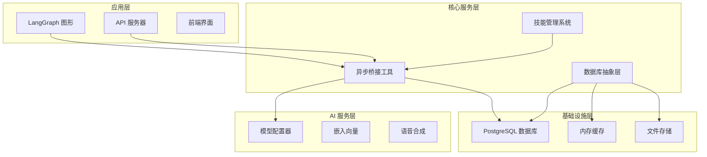
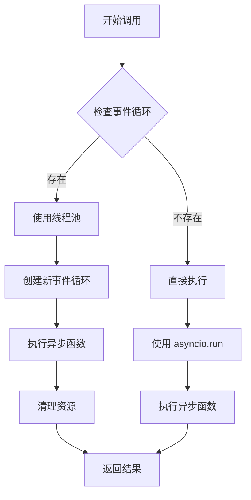
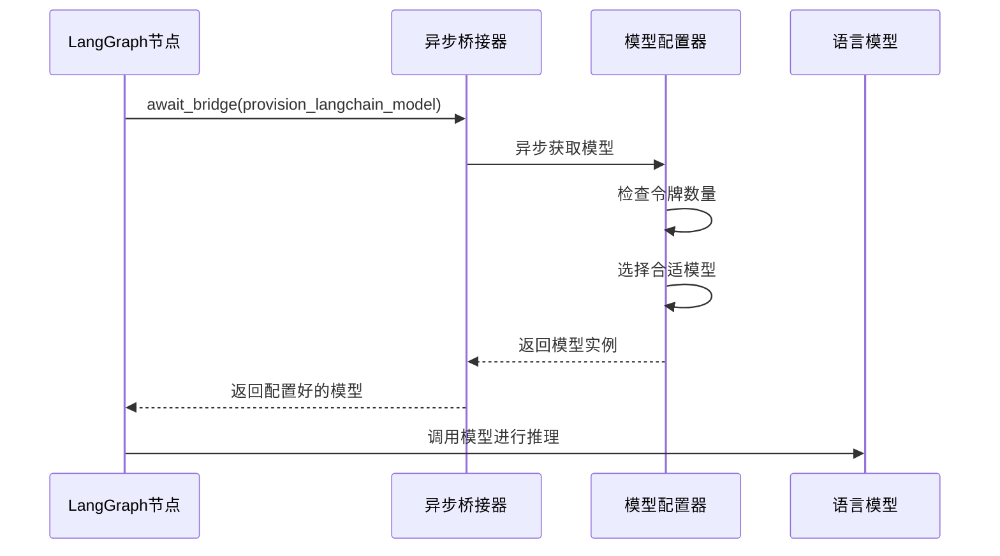
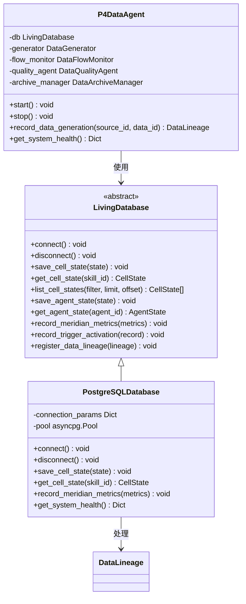
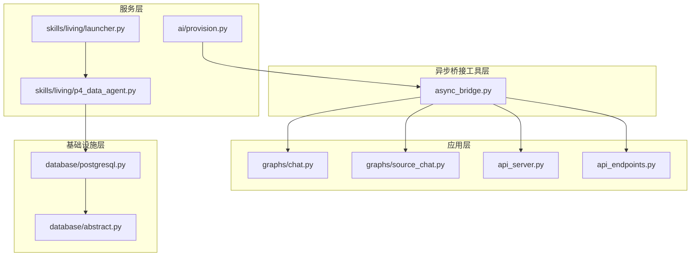

# 异步桥接工具

<cite>
**本文档中引用的文件**
- [async_bridge.py](file://open_notebook/utils/async_bridge.py)
- [chat.py](file://open_notebook/graphs/chat.py)
- [source_chat.py](file://open_notebook/graphs/source_chat.py)
- [provision.py](file://open_notebook/ai/provision.py)
- [api_server.py](file://open_notebook/skills/living/api_server.py)
- [api_endpoints.py](file://open_notebook/skills/living/api_endpoints.py)
- [api_postgres.py](file://open_notebook/skills/living/api_postgres.py)
- [launcher.py](file://open_notebook/skills/living/launcher.py)
- [postgresql.py](file://open_notebook/skills/living/database/postgresql.py)
- [p4_data_agent.py](file://open_notebook/skills/living/p4_data_agent.py)
- [abstract.py](file://open_notebook/skills/living/database/abstract.py)
</cite>

## 目录
1. [简介](#简介)
2. [项目结构](#项目结构)
3. [核心组件](#核心组件)
4. [架构概览](#架构概览)
5. [详细组件分析](#详细组件分析)
6. [依赖关系分析](#依赖关系分析)
7. [性能考虑](#性能考虑)
8. [故障排除指南](#故障排除指南)
9. [结论](#结论)

## 简介

异步桥接工具是OpenNotebook项目中的一个关键基础设施组件，专门用于在同步上下文中安全地调用异步函数。该工具解决了LangGraph节点（同步执行）与异步函数（如模型配置、数据库操作等）之间的兼容性问题，确保系统能够在保持高性能的同时提供稳定的异步功能支持。

该项目采用生物启发式的设计理念，构建了一个完整的"活体知识系统"，其中异步桥接工具作为系统的核心连接器，实现了不同执行模式之间的无缝转换。

## 项目结构

OpenNotebook项目采用了模块化的架构设计，主要分为以下几个核心部分：



**图表来源**
- [async_bridge.py](file://open_notebook/utils/async_bridge.py#L1-L180)
- [api_server.py](file://open_notebook/skills/living/api_server.py#L1-L556)
- [launcher.py](file://open_notebook/skills/living/launcher.py#L1-L345)

**章节来源**
- [async_bridge.py](file://open_notebook/utils/async_bridge.py#L1-L180)
- [api_server.py](file://open_notebook/skills/living/api_server.py#L1-L556)
- [launcher.py](file://open_notebook/skills/living/launcher.py#L1-L345)

## 核心组件

异步桥接工具的核心组件包括以下三个主要部分：

### 1. 线程池管理器
负责管理全局线程池，提供线程安全的异步函数执行环境。默认使用CPU核心数+4的工作线程，最大不超过32个线程。

### 2. 事件循环管理器
处理在不同事件循环状态下的异步函数调用，确保不会出现嵌套事件循环的问题。

### 3. 超时控制机制
提供精确的超时控制，防止异步操作阻塞整个系统。

**章节来源**
- [async_bridge.py](file://open_notebook/utils/async_bridge.py#L24-L60)
- [async_bridge.py](file://open_notebook/utils/async_bridge.py#L96-L149)

## 架构概览

异步桥接工具在整个系统架构中扮演着关键的中介角色，连接了同步和异步两个不同的执行模式：

```mermaid
sequenceDiagram
participant Sync as 同步上下文
participant Bridge as 异步桥接器
participant Pool as 线程池
participant Loop as 新事件循环
participant AsyncFunc as 异步函数
Sync->>Bridge : await_bridge(coro_factory, timeout)
Bridge->>Bridge : 检查当前事件循环
alt 已有事件循环
Bridge->>Pool : 提交任务
Pool->>Loop : 在新线程创建事件循环
Loop->>AsyncFunc : 执行异步函数
AsyncFunc-->>Loop : 返回结果
Loop-->>Pool : 清理资源
Pool-->>Bridge : 返回结果
else 无事件循环
Bridge->>AsyncFunc : 直接执行
AsyncFunc-->>Bridge : 返回结果
end
Bridge-->>Sync : 返回结果或抛出异常
```

**图表来源**
- [async_bridge.py](file://open_notebook/utils/async_bridge.py#L96-L149)

## 详细组件分析

### 异步桥接器核心实现

异步桥接器通过智能检测当前的执行环境来决定最佳的调用策略：

#### 事件循环检测机制


**图表来源**
- [async_bridge.py](file://open_notebook/utils/async_bridge.py#L132-L148)

#### 线程池配置策略
异步桥接器采用动态线程池配置，根据系统资源自动调整工作线程数量：

| 配置参数 | 默认值 | 计算公式 | 说明 |
|---------|--------|----------|------|
| 最大线程数 | 32 | min(32, CPU核心数+4) | 防止线程过多导致上下文切换开销 |
| 线程前缀 | "async_bridge" | 固定值 | 便于调试和监控 |
| 工作队列大小 | 无限 | 由ThreadPoolExecutor默认设置 | 支持大量并发请求 |

**章节来源**
- [async_bridge.py](file://open_notebook/utils/async_bridge.py#L35-L43)
- [async_bridge.py](file://open_notebook/utils/async_bridge.py#L132-L148)

### 在LangGraph中的应用

异步桥接工具在LangGraph图形中发挥着至关重要的作用，特别是在模型配置和消息处理方面：

#### 模型配置流程


**图表来源**
- [chat.py](file://open_notebook/graphs/chat.py#L34-L40)
- [provision.py](file://open_notebook/ai/provision.py#L9-L61)

**章节来源**
- [chat.py](file://open_notebook/graphs/chat.py#L34-L40)
- [source_chat.py](file://open_notebook/graphs/source_chat.py#L98-L107)

### 数据库抽象层集成

异步桥接工具还被广泛应用于数据库操作中，确保所有数据库访问都是异步且线程安全的：

#### 数据库操作模式


**图表来源**
- [abstract.py](file://open_notebook/skills/living/database/abstract.py#L98-L200)
- [postgresql.py](file://open_notebook/skills/living/database/postgresql.py#L28-L699)
- [p4_data_agent.py](file://open_notebook/skills/living/p4_data_agent.py#L385-L493)

**章节来源**
- [abstract.py](file://open_notebook/skills/living/database/abstract.py#L98-L200)
- [postgresql.py](file://open_notebook/skills/living/database/postgresql.py#L28-L699)
- [p4_data_agent.py](file://open_notebook/skills/living/p4_data_agent.py#L385-L493)

## 依赖关系分析

异步桥接工具在整个系统中的依赖关系错综复杂，涉及多个层面的交互：



**图表来源**
- [async_bridge.py](file://open_notebook/utils/async_bridge.py#L1-L180)
- [chat.py](file://open_notebook/graphs/chat.py#L1-L67)
- [source_chat.py](file://open_notebook/graphs/source_chat.py#L1-L196)

**章节来源**
- [async_bridge.py](file://open_notebook/utils/async_bridge.py#L1-L180)
- [chat.py](file://open_notebook/graphs/chat.py#L1-L67)
- [source_chat.py](file://open_notebook/graphs/source_chat.py#L1-L196)

## 性能考虑

异步桥接工具在设计时充分考虑了性能优化，采用了多种策略来确保系统的高效运行：

### 线程池优化策略
- **动态线程数调整**：根据CPU核心数自动计算最优线程数
- **延迟初始化**：只有在首次使用时才创建线程池
- **资源清理**：提供优雅的关闭机制，确保资源正确释放

### 内存管理优化
- **事件循环隔离**：每个线程都有独立的事件循环，避免资源共享冲突
- **任务清理机制**：自动清理未完成的任务，防止内存泄漏
- **连接池管理**：数据库连接采用连接池模式，减少连接建立开销

### 超时控制机制
异步桥接工具提供了灵活的超时控制选项：

| 超时类型 | 默认值 | 适用场景 | 安全考虑 |
|---------|--------|----------|----------|
| 同步调用超时 | 30秒 | LangGraph节点调用 | 防止节点阻塞 |
| 数据库操作超时 | 60秒 | 数据库查询/更新 | 避免数据库锁死 |
| 模型加载超时 | 120秒 | AI模型初始化 | 确保模型可用性 |
| 文件操作超时 | 300秒 | 大文件处理 | 防止长时间占用 |

**章节来源**
- [async_bridge.py](file://open_notebook/utils/async_bridge.py#L35-L43)
- [async_bridge.py](file://open_notebook/utils/async_bridge.py#L96-L149)

## 故障排除指南

### 常见问题及解决方案

#### 1. 线程池耗尽问题
**症状**：异步调用长时间无响应
**原因**：线程池中的所有线程都在处理其他任务
**解决方案**：
- 检查是否有长时间运行的异步操作
- 调整线程池大小配置
- 实现任务优先级管理

#### 2. 事件循环冲突问题
**症状**：出现"RuntimeError: no current event loop"错误
**原因**：在没有事件循环的线程中调用异步函数
**解决方案**：
- 使用异步桥接器而不是直接调用异步函数
- 确保在正确的线程环境中执行异步代码

#### 3. 超时异常处理
**症状**：TimeoutError异常
**原因**：异步操作超过预设的超时时间
**解决方案**：
- 增加超时时间配置
- 优化异步操作的性能
- 实现重试机制

### 调试技巧

#### 日志配置
异步桥接工具提供了详细的日志输出，帮助开发者诊断问题：

```python
# 启用详细日志
import logging
logging.basicConfig(level=logging.DEBUG)

# 或者使用loguru
from loguru import logger
logger.add("async_bridge.log", level="DEBUG")
```

#### 性能监控
建议监控以下关键指标：
- 线程池利用率
- 任务执行时间分布
- 超时发生频率
- 错误率统计

**章节来源**
- [async_bridge.py](file://open_notebook/utils/async_bridge.py#L42-L59)
- [async_bridge.py](file://open_notebook/utils/async_bridge.py#L121-L124)

## 结论

异步桥接工具作为OpenNotebook项目的核心基础设施，成功解决了同步和异步执行模式之间的兼容性问题。通过智能的事件循环管理和线程池优化，该工具确保了系统的稳定性和高性能。

该工具不仅在LangGraph节点中发挥重要作用，还在整个活体知识系统的各个层面提供了可靠的异步支持。其设计体现了现代Python异步编程的最佳实践，为构建复杂的异步应用程序提供了坚实的基础。

未来的发展方向包括：
- 进一步优化线程池性能
- 增强错误处理和恢复能力
- 扩展对更多异步框架的支持
- 提供更丰富的监控和调试功能