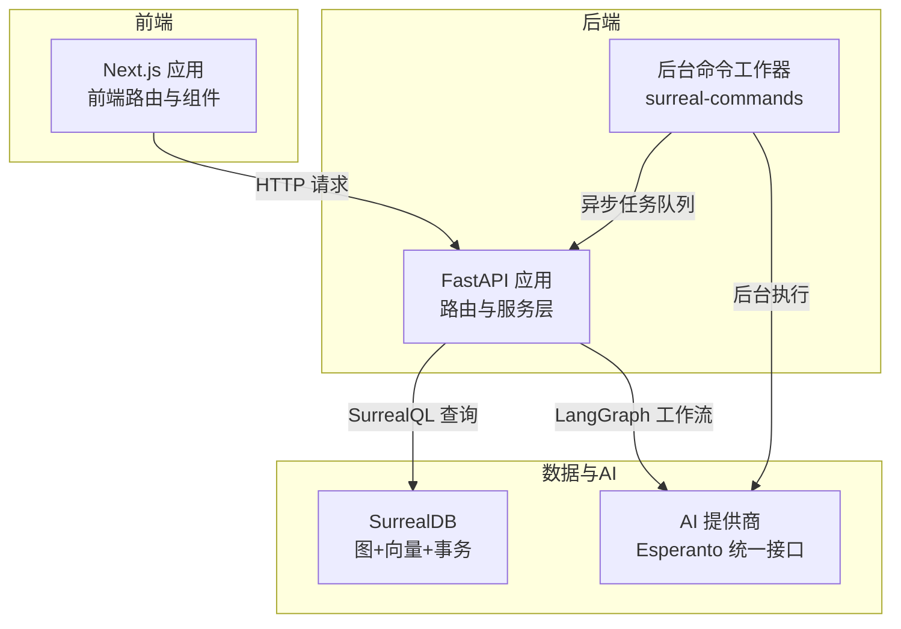
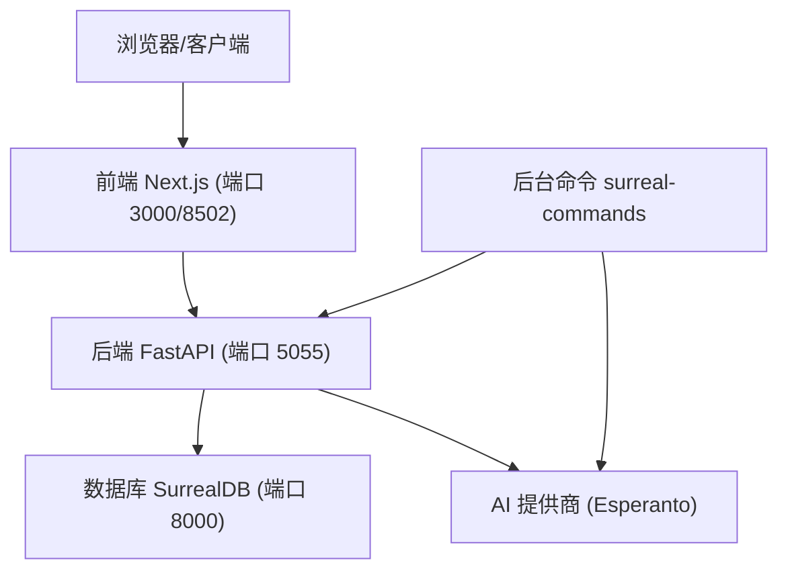
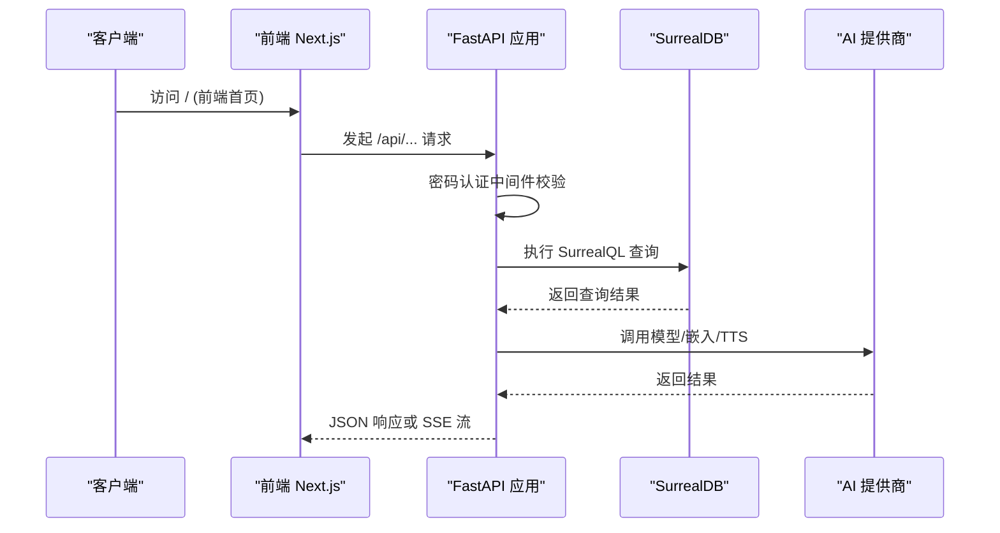
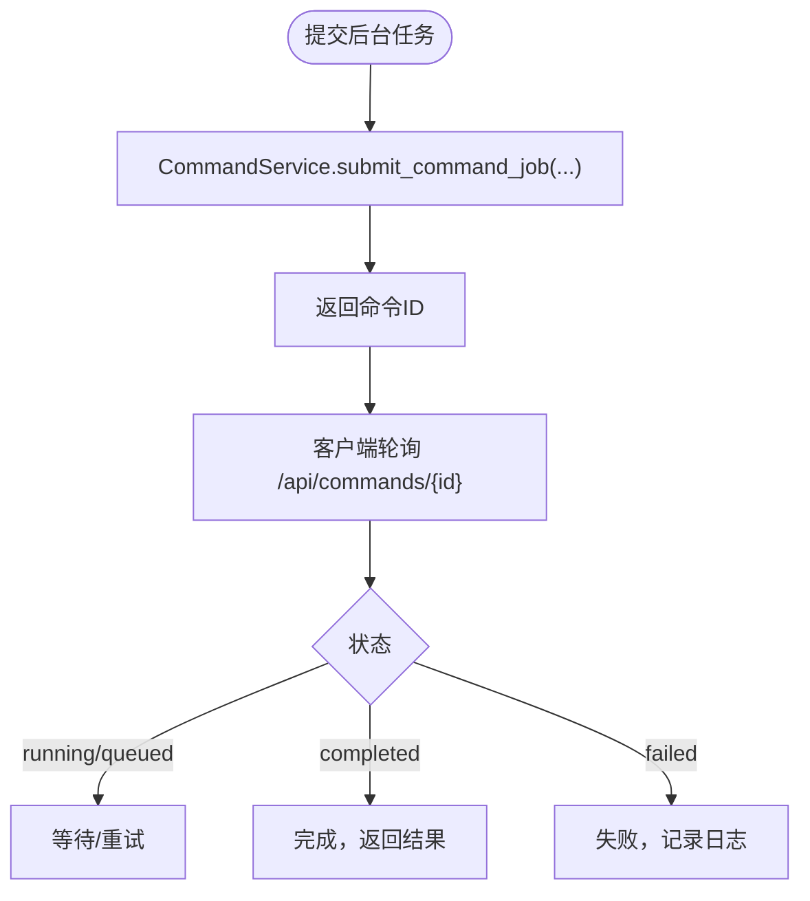
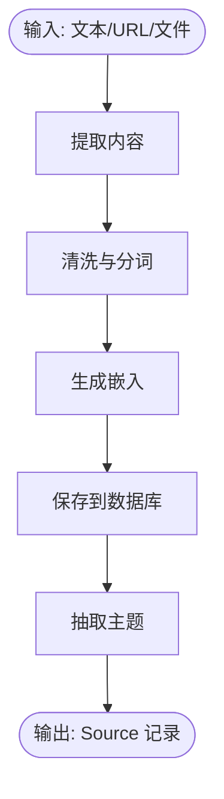
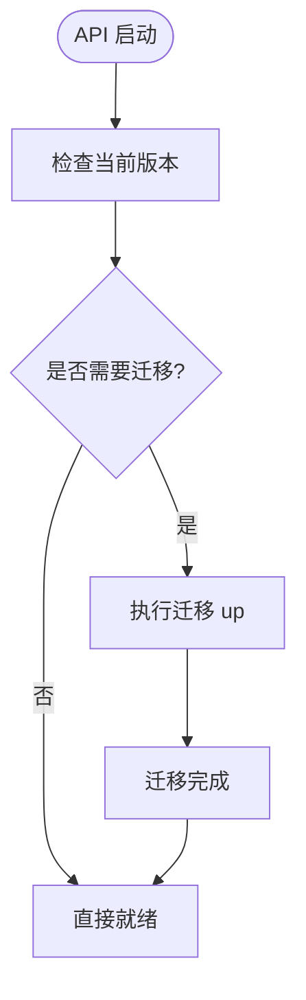
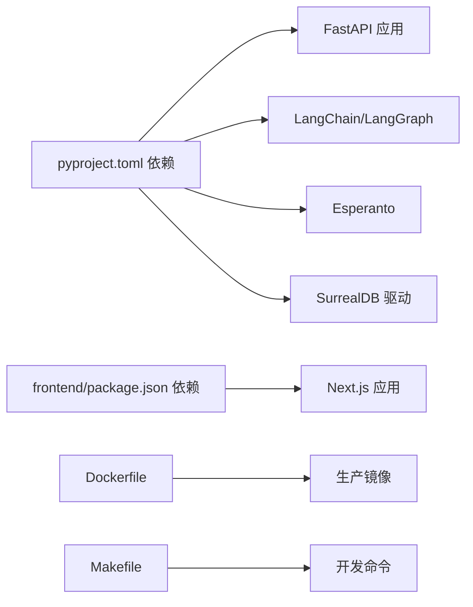

# 开发者指南

<cite>
**本文档引用的文件**
- [README.md](file://README.md)
- [README.dev.md](file://README.dev.md)
- [CONTRIBUTING.md](file://CONTRIBUTING.md)
- [MAINTAINER_GUIDE.md](file://MAINTAINER_GUIDE.md)
- [pyproject.toml](file://pyproject.toml)
- [frontend/package.json](file://frontend/package.json)
- [Dockerfile](file://Dockerfile)
- [docker-compose.yml](file://docker-compose.yml)
- [docs/7-DEVELOPMENT/architecture.md](file://docs/7-DEVELOPMENT/architecture.md)
- [docs/7-DEVELOPMENT/design-principles.md](file://docs/7-DEVELOPMENT/design-principles.md)
- [docs/7-DEVELOPMENT/code-standards.md](file://docs/7-DEVELOPMENT/code-standards.md)
- [docs/7-DEVELOPMENT/testing.md](file://docs/7-DEVELOPMENT/testing.md)
- [docs/7-DEVELOPMENT/development-setup.md](file://docs/7-DEVELOPMENT/development-setup.md)
- [Makefile](file://Makefile)
- [api/main.py](file://api/main.py)
</cite>

## 目录
1. [简介](#简介)
2. [项目结构](#项目结构)
3. [核心组件](#核心组件)
4. [架构总览](#架构总览)
5. [详细组件分析](#详细组件分析)
6. [依赖关系分析](#依赖关系分析)
7. [性能考虑](#性能考虑)
8. [故障排查指南](#故障排查指南)
9. [结论](#结论)
10. [附录](#附录)

## 简介
本指南面向Open Notebook的开发者，提供从环境搭建到代码规范、测试策略、贡献流程与协作规范的完整说明。项目采用前后端分离的三层架构：前端使用Next.js/React，后端基于FastAPI，数据库采用SurrealDB；通过LangGraph实现多步骤AI工作流，通过Esperanto统一接入多家AI模型提供商，支持本地与云端部署。

## 项目结构
项目采用模块化分层组织，主要目录与职责如下：
- api：FastAPI后端，提供REST接口与业务逻辑编排
- frontend：Next.js前端应用，负责用户界面与交互
- open_notebook：Python核心库，包含领域模型、数据库访问、AI集成与图工作流
- commands：后台命令系统（surreal-commands）插件
- docs：用户与开发者文档
- tests：测试套件
- examples：示例部署配置
- scripts：辅助脚本

图表来源
- [docs/7-DEVELOPMENT/architecture.md](file://docs/7-DEVELOPMENT/architecture.md#L3-L36)
- [api/main.py](file://api/main.py#L157-L180)

章节来源
- [README.dev.md](file://README.dev.md#L355-L376)
- [docs/7-DEVELOPMENT/architecture.md](file://docs/7-DEVELOPMENT/architecture.md#L3-L36)

## 核心组件
- 前端（Next.js/React）
  - 技术栈：TypeScript、Tailwind CSS、Zustand（状态）、TanStack Query（服务端状态）
  - 职责：渲染笔记本、源内容、笔记、聊天与播客管理；发起REST请求；流式响应处理
- 后端（FastAPI）
  - 技术栈：Python 3.11+、FastAPI、Pydantic、Loguru、uvicorn
  - 职责：HTTP接口、业务逻辑编排、数据库迁移、错误处理、日志记录
- 数据库（SurrealDB）
  - 技术栈：SurrealQL、异步驱动、自动迁移
  - 职责：持久化领域对象、图关系、向量嵌入、全文搜索
- AI集成（Esperanto + LangChain/LangGraph）
  - 职责：多提供商模型选择、嵌入与TTS/STT、工作流编排（聊天、问答、转换、播客）

章节来源
- [docs/7-DEVELOPMENT/architecture.md](file://docs/7-DEVELOPMENT/architecture.md#L55-L86)
- [docs/7-DEVELOPMENT/architecture.md](file://docs/7-DEVELOPMENT/architecture.md#L89-L148)
- [docs/7-DEVELOPMENT/architecture.md](file://docs/7-DEVELOPMENT/architecture.md#L151-L202)
- [docs/7-DEVELOPMENT/architecture.md](file://docs/7-DEVELOPMENT/architecture.md#L441-L507)

## 架构总览
Open Notebook采用“前端代理后端、后端编排数据库与AI”的三层架构。前端通过Next.js自动代理API请求，简化反向代理配置；后端以FastAPI为核心，注册各领域路由，启动时自动运行数据库迁移；数据库为SurrealDB，提供图与向量能力；AI通过Esperanto抽象多提供商，LangGraph实现复杂工作流。

图表来源
- [docs/7-DEVELOPMENT/architecture.md](file://docs/7-DEVELOPMENT/architecture.md#L3-L36)
- [api/main.py](file://api/main.py#L157-L180)

章节来源
- [docs/7-DEVELOPMENT/architecture.md](file://docs/7-DEVELOPMENT/architecture.md#L3-L36)
- [docs/7-DEVELOPMENT/architecture.md](file://docs/7-DEVELOPMENT/architecture.md#L100-L148)

## 详细组件分析

### API 开发组件
- 路由组织：按领域拆分路由器（notebooks、sources、notes、chat、search、transformations、models、podcasts等），统一前缀/api与标签分类
- 生命周期：启动时执行数据库迁移，失败则快速退出；健康检查端点用于容器探针
- 中间件：密码认证中间件（排除特定路径），CORS中间件最后注册确保错误响应也带CORS头
- 异常处理：自定义异常处理器保证跨域错误响应包含必要头部

图表来源
- [api/main.py](file://api/main.py#L157-L180)
- [docs/7-DEVELOPMENT/architecture.md](file://docs/7-DEVELOPMENT/architecture.md#L617-L682)

章节来源
- [api/main.py](file://api/main.py#L157-L180)

### 异步命令系统（后台任务）
- 使用 surreal-commands 作为后台任务队列，提交长耗时任务（如源内容处理、播客生成）
- 前端轮询 /api/commands/{id} 获取状态
- 开发中可通过 Makefile 快速启动/停止工作器

图表来源
- [docs/7-DEVELOPMENT/architecture.md](file://docs/7-DEVELOPMENT/architecture.md#L599-L614)
- [Makefile](file://Makefile#L141-L153)

章节来源
- [docs/7-DEVELOPMENT/architecture.md](file://docs/7-DEVELOPMENT/architecture.md#L599-L614)
- [Makefile](file://Makefile#L141-L153)

### LangGraph 工作流
- 源处理、聊天、问答、转换、提示等五类工作流，均以状态机形式实现
- 支持流式输出（SSE）、上下文构建、令牌计数与模型回退
- 状态持久化使用 SqliteSaver，会话ID需唯一避免冲突

图表来源
- [docs/7-DEVELOPMENT/architecture.md](file://docs/7-DEVELOPMENT/architecture.md#L274-L295)

章节来源
- [docs/7-DEVELOPMENT/architecture.md](file://docs/7-DEVELOPMENT/architecture.md#L270-L440)

### 数据库与迁移
- 自动迁移在启动时执行，失败则阻止API启动
- 迁移文件位于 /migrations/，按编号顺序执行
- SurrealDB提供图关系、向量嵌入与全文搜索能力

图表来源
- [api/main.py](file://api/main.py#L66-L88)

章节来源
- [api/main.py](file://api/main.py#L66-L88)

### 设计模式与架构原则
- 领域驱动设计（DDD）：领域对象与仓储分离
- 异步优先：所有I/O均为非阻塞
- 服务模式：服务编排领域对象、仓储与工作流
- 流式模式：长任务通过 Server-Sent Events 推送
- 工作器模式：后台命令队列处理耗时任务

章节来源
- [docs/7-DEVELOPMENT/architecture.md](file://docs/7-DEVELOPMENT/architecture.md#L510-L614)
- [docs/7-DEVELOPMENT/design-principles.md](file://docs/7-DEVELOPMENT/design-principles.md#L149-L182)

## 依赖关系分析
- Python 依赖通过 pyproject.toml 管理，包含FastAPI、LangChain/LangGraph、Esperanto、SurrealDB驱动、Podcast Creator等
- 前端依赖通过 package.json 管理，包含Next.js、Radix UI、TanStack Query、i18n等
- Dockerfile 分为构建与运行阶段，使用 uv 加速依赖安装，并内置Supervisor管理多进程
- Makefile 提供一键启动数据库、API、工作器与前端的开发流程

图表来源
- [pyproject.toml](file://pyproject.toml#L15-L42)
- [frontend/package.json](file://frontend/package.json#L14-L57)
- [Dockerfile](file://Dockerfile#L1-L114)
- [Makefile](file://Makefile#L15-L210)

章节来源
- [pyproject.toml](file://pyproject.toml#L15-L42)
- [frontend/package.json](file://frontend/package.json#L14-L57)
- [Dockerfile](file://Dockerfile#L1-L114)
- [Makefile](file://Makefile#L15-L210)

## 性能考虑
- 异步I/O贯穿全栈，提升并发与资源利用率
- 前端使用TanStack Query缓存与增量更新，减少重复请求
- 数据库连接池与事务支持，防止慢查询阻塞
- 后台命令队列避免请求超时，配合流式响应改善用户体验
- Docker 多阶段构建与缓存优化，缩短构建时间

## 故障排查指南
- 服务无法启动
  - 检查服务状态：make status
  - 查看数据库：docker compose ps surrealdb
  - 查看日志：docker compose logs surrealdb
  - 重启：make stop-all && make start-all
- 端口占用
  - 定位进程：lsof -i :5055 / :3000 / :8000
  - 杀掉进程或更换端口
- 数据库连接问题
  - 确认 .env 中 SURREAL_* 配置正确
  - 确认 SurrealDB 正在运行且可访问
- Docker 构建失败
  - 清理构建缓存：docker builder prune
  - 重置 buildx：make docker-buildx-reset
  - 先本地构建验证：make docker-build-local

章节来源
- [README.dev.md](file://README.dev.md#L299-L352)
- [docs/7-DEVELOPMENT/development-setup.md](file://docs/7-DEVELOPMENT/development-setup.md#L302-L362)

## 结论
Open Notebook以清晰的分层架构、严格的代码规范与完善的测试策略，提供了可扩展、可维护的研究助手平台。开发者应遵循设计原则与编码标准，结合异步与工作流模式，确保功能稳定与性能优良。

## 附录

### 开发环境搭建（本地/容器）
- 克隆仓库、复制环境文件、安装依赖（uv sync）
- 启动数据库（Docker 或 Makefile）
- 启动 API（uvicorn）与前端（Next.js）
- 可选：启动后台命令工作器
- 可选：使用 Docker Compose 运行完整栈

章节来源
- [README.dev.md](file://README.dev.md#L5-L81)
- [docs/7-DEVELOPMENT/development-setup.md](file://docs/7-DEVELOPMENT/development-setup.md#L16-L230)

### API 开发指南
- 新增路由：在 api/routers 下创建模块并注册到 api/main.py
- 服务层：在 api/*_service.py 中编排业务逻辑与工作流
- 模型与验证：使用 Pydantic 模型进行输入输出校验
- 错误处理：抛出自定义异常并在 FastAPI 中捕获转换为HTTP状态码
- 文档：FastAPI 自动生成 OpenAPI 文档，访问 /docs

章节来源
- [docs/7-DEVELOPMENT/architecture.md](file://docs/7-DEVELOPMENT/architecture.md#L100-L148)
- [docs/7-DEVELOPMENT/code-standards.md](file://docs/7-DEVELOPMENT/code-standards.md#L155-L236)

### 前端开发指南
- 组件结构：App Router + 可复用组件 + 自定义Hooks + 工具函数
- 状态管理：Zustand（全局）+ TanStack Query（服务端状态）
- 国际化：在 frontend/src/lib/locales 中添加新语言
- 构建与测试：npm run build / test / test:watch

章节来源
- [docs/7-DEVELOPMENT/architecture.md](file://docs/7-DEVELOPMENT/architecture.md#L55-L86)
- [README.dev.md](file://README.dev.md#L247-L287)
- [frontend/package.json](file://frontend/package.json#L5-L13)

### 后端开发指南
- 服务层设计：封装业务逻辑，调用仓储与LangGraph工作流
- 异步模式：统一使用 async/await，避免阻塞
- 数据库操作：通过 repository.py 的 repo_query/repo_create 等方法
- 日志与监控：使用 Loguru 输出结构化日志

章节来源
- [docs/7-DEVELOPMENT/architecture.md](file://docs/7-DEVELOPMENT/architecture.md#L561-L585)
- [docs/7-DEVELOPMENT/code-standards.md](file://docs/7-DEVELOPMENT/code-standards.md#L32-L47)

### 测试策略与代码质量
- 测试类型：单元、集成、API、数据库测试
- 运行方式：pytest（支持异步），覆盖率报告
- 代码质量：Ruff 格式与检查、MyPy 类型检查、预提交钩子
- 质量门禁：PR 需通过测试与静态检查

章节来源
- [docs/7-DEVELOPMENT/testing.md](file://docs/7-DEVELOPMENT/testing.md#L1-L424)
- [docs/7-DEVELOPMENT/code-standards.md](file://docs/7-DEVELOPMENT/code-standards.md#L303-L316)

### 贡献指南与协作规范
- Issue-first 工作流：先建Issue再开发
- 提交规范：清晰的提交信息与变更说明
- 代码审查清单：格式、类型注解、文档、错误处理、测试覆盖
- 维护者指南：发布流程、版本管理、镜像推送

章节来源
- [CONTRIBUTING.md](file://CONTRIBUTING.md#L1-L30)
- [MAINTAINER_GUIDE.md](file://MAINTAINER_GUIDE.md#L1-L20)
- [README.dev.md](file://README.dev.md#L155-L194)

### 持续集成与发布
- Docker 多平台构建与推送：regular 与 single 容器变体
- 版本标签：基于 pyproject.toml 版本号创建 Git Tag
- 发布流程：先本地验证，再推送版本标签，最后更新 v1-latest

章节来源
- [README.dev.md](file://README.dev.md#L155-L194)
- [Makefile](file://Makefile#L58-L127)