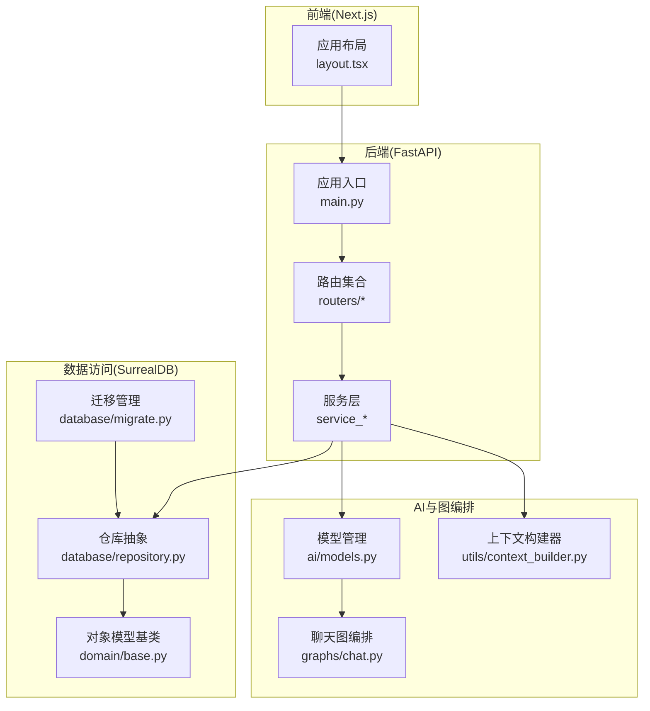
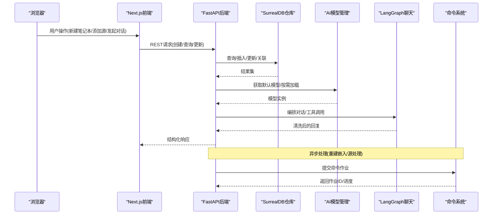
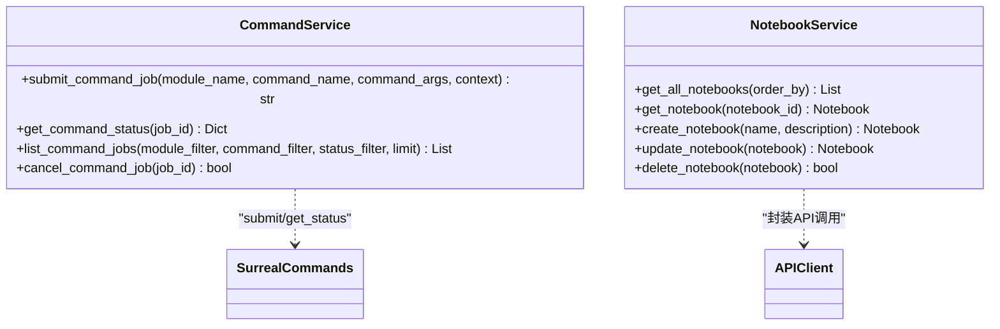
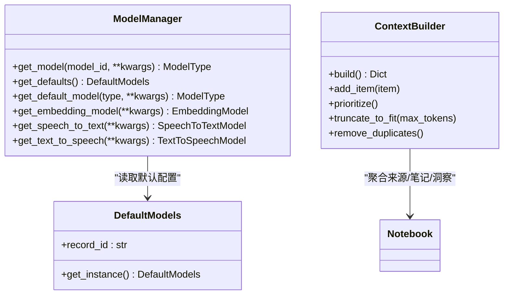
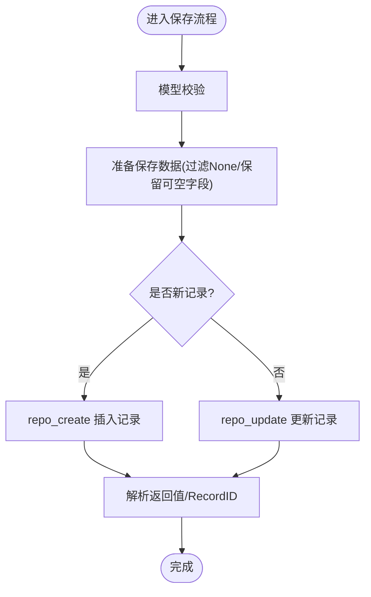
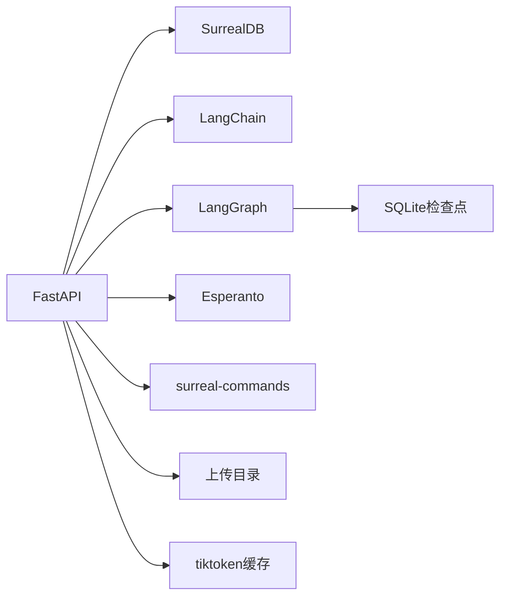
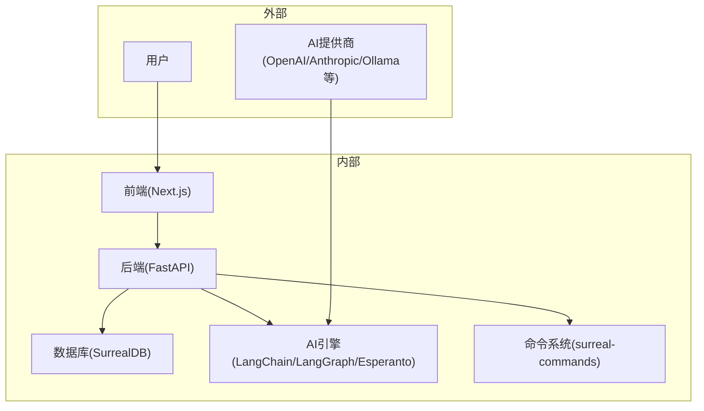

# 架构设计

<cite>
**本文引用的文件**
- [README.md](file://README.md)
- [pyproject.toml](file://pyproject.toml)
- [api/main.py](file://api/main.py)
- [frontend/src/app/layout.tsx](file://frontend/src/app/layout.tsx)
- [api/models.py](file://api/models.py)
- [open_notebook/domain/base.py](file://open_notebook/domain/base.py)
- [open_notebook/database/repository.py](file://open_notebook/database/repository.py)
- [open_notebook/ai/models.py](file://open_notebook/ai/models.py)
- [open_notebook/config.py](file://open_notebook/config.py)
- [api/command_service.py](file://api/command_service.py)
- [open_notebook/utils/context_builder.py](file://open_notebook/utils/context_builder.py)
- [open_notebook/graphs/chat.py](file://open_notebook/graphs/chat.py)
- [open_notebook/database/migrate.py](file://open_notebook/database/migrate.py)
</cite>

## 目录
1. [引言](#引言)
2. [项目结构](#项目结构)
3. [核心组件](#核心组件)
4. [架构总览](#架构总览)
5. [详细组件分析](#详细组件分析)
6. [依赖分析](#依赖分析)
7. [性能考量](#性能考量)
8. [故障排查指南](#故障排查指南)
9. [结论](#结论)
10. [附录](#附录)

## 引言
本文件面向Open Notebook的整体架构设计，聚焦三层系统模型：表现层（前端Next.js）、业务逻辑层（FastAPI服务与领域模型）、数据访问层（SurrealDB）。同时阐述AI集成（LangChain、LangGraph、Esperanto）在系统中的应用与职责划分，并给出系统边界图、数据流图、异步处理与缓存策略、错误处理与横切关注点的实现方式，以及性能、可扩展性与部署拓扑的最佳实践。

## 项目结构
Open Notebook采用前后端分离的多模块组织方式：
- 前端：Next.js应用，负责用户界面、状态管理与API调用封装
- 后端：FastAPI服务，提供REST接口、中间件与路由分发
- 领域与数据：Pydantic模型、对象模型基类、数据库仓库抽象、迁移管理
- AI与图编排：LangChain/LangGraph用于对话与流程编排，Esperanto统一AI提供商接入
- 工具与配置：上下文构建器、SQLite检查点、上传与缓存目录

图表来源
- [frontend/src/app/layout.tsx](file://frontend/src/app/layout.tsx#L19-L45)
- [api/main.py](file://api/main.py#L99-L190)
- [open_notebook/database/repository.py](file://open_notebook/database/repository.py#L47-L63)
- [open_notebook/domain/base.py](file://open_notebook/domain/base.py#L31-L183)
- [open_notebook/ai/models.py](file://open_notebook/ai/models.py#L97-L267)
- [open_notebook/utils/context_builder.py](file://open_notebook/utils/context_builder.py#L59-L141)
- [open_notebook/graphs/chat.py](file://open_notebook/graphs/chat.py#L19-L94)
- [open_notebook/database/migrate.py](file://open_notebook/database/migrate.py#L6-L27)

章节来源
- [README.md](file://README.md#L93-L96)
- [pyproject.toml](file://pyproject.toml#L1-L42)

## 核心组件
- 表现层（前端）
  - Next.js应用通过Provider体系注入主题、国际化、查询缓存、错误边界与连接守卫，根布局集中处理全局状态与兜底UI。
- 业务逻辑层（后端）
  - FastAPI应用负责生命周期管理（启动时自动迁移）、认证中间件、CORS、异常处理与路由注册；服务层封装API调用与命令提交。
- 数据访问层
  - SurrealDB作为统一存储，仓库抽象提供查询、插入、更新、删除、关联等操作；对象模型基类提供通用CRUD与关系维护。
- AI集成
  - Esperanto统一AI提供商接入；LangChain/LangGraph用于对话与流程编排；上下文构建器负责RAG上下文拼装与截断。
- 命令系统
  - 基于surreal-commands的后台作业提交与状态查询，支持异步重建向量嵌入、源内容处理等长耗时任务。

章节来源
- [frontend/src/app/layout.tsx](file://frontend/src/app/layout.tsx#L19-L45)
- [api/main.py](file://api/main.py#L47-L97)
- [api/command_service.py](file://api/command_service.py#L7-L93)
- [open_notebook/database/repository.py](file://open_notebook/database/repository.py#L65-L195)
- [open_notebook/domain/base.py](file://open_notebook/domain/base.py#L31-L183)
- [open_notebook/ai/models.py](file://open_notebook/ai/models.py#L97-L267)
- [open_notebook/utils/context_builder.py](file://open_notebook/utils/context_builder.py#L59-L141)
- [open_notebook/graphs/chat.py](file://open_notebook/graphs/chat.py#L19-L94)

## 架构总览
下图展示从浏览器到数据库的端到端数据流，突出异步命令、AI推理与上下文构建的关键路径。

图表来源
- [api/main.py](file://api/main.py#L157-L180)
- [open_notebook/database/repository.py](file://open_notebook/database/repository.py#L65-L195)
- [open_notebook/ai/models.py](file://open_notebook/ai/models.py#L97-L267)
- [open_notebook/graphs/chat.py](file://open_notebook/graphs/chat.py#L27-L81)
- [api/command_service.py](file://api/command_service.py#L10-L45)

## 详细组件分析

### 组件A：服务层与命令系统
- 职责划分
  - 服务层：封装API客户端调用，屏蔽底层HTTP细节，返回领域对象。
  - 命令系统：统一提交后台作业（如重建嵌入、源处理），查询状态，支持取消占位。
- 设计模式
  - 单例/全局实例：服务层提供全局实例，简化调用。
  - 工厂/适配：命令系统对surreal-commands进行薄封装，暴露统一接口。
- 关键流程
  - 提交命令：确保命令模块已导入，调用submit_command获取作业ID。
  - 查询状态：封装为统一字典，包含状态、结果、错误、进度与时间戳。

图表来源
- [api/command_service.py](file://api/command_service.py#L7-L93)
- [api/notebook_service.py](file://api/notebook_service.py#L13-L88)

章节来源
- [api/command_service.py](file://api/command_service.py#L7-L93)
- [api/notebook_service.py](file://api/notebook_service.py#L13-L88)

### 组件B：AI集成模块（模型管理与图编排）
- 模型管理
  - ModelManager根据模型类型与凭证动态创建LangChain模型实例，支持默认模型读取与覆盖参数。
  - 支持从凭证或环境变量加载密钥，Esperanto负责跨提供商统一封装。
- 图编排
  - LangGraph定义线程状态与节点，结合提示词模板与LangChain模型执行消息流。
  - 使用SQLite检查点持久化会话状态，支持多轮对话与工具调用。
- 上下文构建
  - ContextBuilder按优先级聚合来源、笔记、洞察，支持令牌数限制与去重。

图表来源
- [open_notebook/ai/models.py](file://open_notebook/ai/models.py#L97-L267)
- [open_notebook/utils/context_builder.py](file://open_notebook/utils/context_builder.py#L59-L141)

章节来源
- [open_notebook/ai/models.py](file://open_notebook/ai/models.py#L97-L267)
- [open_notebook/graphs/chat.py](file://open_notebook/graphs/chat.py#L19-L94)
- [open_notebook/utils/context_builder.py](file://open_notebook/utils/context_builder.py#L59-L141)

### 组件C：数据访问层（对象模型与仓库）
- 对象模型基类
  - 提供统一的CRUD方法（get_all/get/save/delete/relate），内置验证与异常处理。
  - 支持多态查找与表名解析，便于不同实体共享通用逻辑。
- 仓库抽象
  - 封装SurrealDB连接、查询、插入、更新、删除与关联，统一记录ID转换与错误传播。
- 迁移管理
  - 同步包装异步迁移管理器，确保应用启动时自动完成数据库版本迁移。

图表来源
- [open_notebook/domain/base.py](file://open_notebook/domain/base.py#L113-L168)
- [open_notebook/database/repository.py](file://open_notebook/database/repository.py#L85-L156)

章节来源
- [open_notebook/domain/base.py](file://open_notebook/domain/base.py#L31-L183)
- [open_notebook/database/repository.py](file://open_notebook/database/repository.py#L47-L195)
- [open_notebook/database/migrate.py](file://open_notebook/database/migrate.py#L6-L27)

### 组件D：表现层（Next.js）
- Provider体系
  - 主题、国际化、查询缓存、错误边界、连接守卫与Toast集中注入，保证一致的用户体验与错误兜底。
- 路由与页面
  - 页面按功能模块组织，组件复用度高，对话、搜索、设置、播客生成等功能模块清晰。

章节来源
- [frontend/src/app/layout.tsx](file://frontend/src/app/layout.tsx#L19-L45)

## 依赖分析
- 技术栈选择合理性
  - FastAPI：高性能异步Web框架，适合REST API与中间件组合（认证、CORS、异常处理）。
  - Next.js：现代React全栈框架，SSR/CSR混合、路由与静态资源优化。
  - SurrealDB：统一的数据库与查询语言，支持结构化与关系建模，便于对象模型映射。
  - LangChain/LangGraph：成熟的AI工作流与图编排能力，适配多提供商模型。
  - Esperanto：统一AI提供商接入，屏蔽差异，便于切换与扩展。
- 外部依赖与集成点
  - 命令系统：surreal-commands提供后台作业能力。
  - 上传与缓存：本地文件系统目录用于上传与tiktoken缓存。
  - SQLite检查点：LangGraph会话状态持久化。

图表来源
- [pyproject.toml](file://pyproject.toml#L15-L42)
- [open_notebook/config.py](file://open_notebook/config.py#L6-L17)

章节来源
- [pyproject.toml](file://pyproject.toml#L15-L42)
- [open_notebook/config.py](file://open_notebook/config.py#L6-L17)

## 性能考量
- 异步与并发
  - 后台命令作业（重建嵌入、源处理）避免阻塞主流程，提升UI响应性。
  - LangGraph使用SQLite检查点，减少重复计算，支持多轮对话状态复用。
- 缓存策略
  - tiktoken缓存目录降低分词开销；模型实例由Esperanto缓存，避免重复初始化。
  - 前端查询缓存（QueryProvider）减少重复网络请求。
- 数据库与序列化
  - 记录ID统一转换与解析，避免字符串拼接错误；批量插入支持忽略重复以降低冲突日志噪音。
- 上下文截断
  - ContextBuilder按优先级与令牌数截断，控制LLM输入规模，平衡质量与成本。

章节来源
- [api/command_service.py](file://api/command_service.py#L10-L45)
- [open_notebook/graphs/chat.py](file://open_notebook/graphs/chat.py#L83-L94)
- [open_notebook/config.py](file://open_notebook/config.py#L15-L17)
- [open_notebook/utils/context_builder.py](file://open_notebook/utils/context_builder.py#L320-L350)
- [open_notebook/database/repository.py](file://open_notebook/database/repository.py#L169-L195)

## 故障排查指南
- 启动与迁移
  - 应用启动时自动执行数据库迁移，若失败则快速退出，避免schema不匹配导致的运行时异常。
- 认证与CORS
  - 密码认证中间件排除健康检查与文档端点；自定义异常处理器确保错误响应包含CORS头。
- 数据库连接
  - 仓库层统一连接管理与关闭，异常捕获与日志记录，区分事务冲突与非重试错误。
- 命令作业
  - 提交前确保命令模块导入；状态查询封装统一字段；取消为占位实现，便于后续完善。
- 错误边界与连接守卫
  - 前端提供错误边界与连接守卫，提升不可用场景下的用户体验。

章节来源
- [api/main.py](file://api/main.py#L47-L97)
- [api/main.py](file://api/main.py#L105-L155)
- [open_notebook/database/repository.py](file://open_notebook/database/repository.py#L47-L63)
- [api/command_service.py](file://api/command_service.py#L10-L45)
- [frontend/src/app/layout.tsx](file://frontend/src/app/layout.tsx#L30-L41)

## 结论
Open Notebook以FastAPI与Next.js为核心，结合SurrealDB、LangChain/LangGraph与Esperanto，构建了隐私优先、可扩展且易于集成的AI研究助手平台。三层架构清晰、职责明确：表现层专注体验，业务逻辑层封装复杂流程，数据访问层提供稳定持久化与迁移保障。异步命令、上下文截断与缓存策略共同提升了性能与可扩展性；统一的AI模型管理与图编排为未来功能演进打下坚实基础。

## 附录
- 系统边界图（概念示意）
