# 测试策略

<cite>
**本文引用的文件**
- [tests/README.md](file://tests/README.md)
- [tests/conftest.py](file://tests/conftest.py)
- [tests/test_chunking.py](file://tests/test_chunking.py)
- [tests/test_domain.py](file://tests/test_domain.py)
- [tests/test_embedding.py](file://tests/test_embedding.py)
- [tests/test_models_api.py](file://tests/test_models_api.py)
- [tests/test_utils.py](file://tests/test_utils.py)
- [tests/test_lks_integration.py](file://tests/test_lks_integration.py)
- [tests/test_lks_performance.py](file://tests/test_lks_performance.py)
- [tests/test_lks_consistency.py](file://tests/test_lks_consistency.py)
- [docs/7-DEVELOPMENT/testing.md](file://docs/7-DEVELOPMENT/testing.md)
- [pyproject.toml](file://pyproject.toml)
- [frontend/package.json](file://frontend/package.json)
- [frontend/vitest.config.ts](file://frontend/vitest.config.ts)
- [frontend/src/test/setup.ts](file://frontend/src/test/setup.ts)
- [frontend/src/lib/config.test.ts](file://frontend/src/lib/config.test.ts)
- [frontend/src/components/common/ConfirmDialog.test.tsx](file://frontend/src/components/common/ConfirmDialog.test.tsx)
- [frontend/src/app/(dashboard)/notebooks/components/ChatColumn.test.tsx](file://frontend/src/app/(dashboard)/notebooks/components/ChatColumn.test.tsx)
- [open_notebook/database/sync_hooks.py](file://open_notebook/database/sync_hooks.py)
- [open_notebook/database/unified_repository.py](file://open_notebook/database/unified_repository.py)
</cite>

## 更新摘要
**变更内容**
- 新增LKS集成测试套件：test_lks_integration.py (828行)、test_lks_performance.py (575行)、test_lks_consistency.py (905行)
- 更新测试架构以包含跨域同步验证、性能基准和数据一致性检查
- 增强数据库测试分类，涵盖SurrealDB与PostgreSQL的统一访问层
- 完善测试金字塔，增加LKS专用测试层级

## 目录
1. [引言](#引言)
2. [项目结构](#项目结构)
3. [核心组件](#核心组件)
4. [架构总览](#架构总览)
5. [详细组件分析](#详细组件分析)
6. [依赖分析](#依赖分析)
7. [性能考虑](#性能考虑)
8. [故障排查指南](#故障排查指南)
9. [结论](#结论)
10. [附录](#附录)

## 引言
本测试策略面向Open Notebook项目，目标是建立覆盖单元测试、集成测试、API测试和LKS专用测试的分层测试体系；明确Python后端（pytest）与前端（Vitest/Jest）的配置与最佳实践；给出API测试、数据库测试、AI服务测试、LKS跨域同步测试的方法与工具；制定测试数据准备、Mock策略与测试环境隔离方案；设定覆盖率目标与持续集成中的测试流程，并补充性能测试与安全测试的实施要点，以及测试用例编写指南与调试技巧。

**更新** 新增LKS（Living Knowledge System）集成测试套件，提供完整的跨域同步验证、性能基准和数据一致性检查，涵盖SurrealDB与PostgreSQL之间的数据同步机制。

## 项目结构
- 后端测试位于tests目录，采用pytest组织，支持异步测试与覆盖率统计。
- 前端测试位于frontend/src，采用Vitest + @testing-library/react，使用JSDOM环境与全局setup脚本进行Mock。
- **新增** LKS测试套件：integration测试验证跨域同步、performance测试提供性能基准、consistency测试确保数据一致性。
- 文档docs/7-DEVELOPMENT/testing.md提供了测试哲学、分类、运行方式、最佳实践与覆盖率目标等指导性内容。
- 配置层面：后端通过pyproject.toml声明pytest与pytest-asyncio依赖；前端通过package.json与vitest.config.ts定义测试脚本与环境。

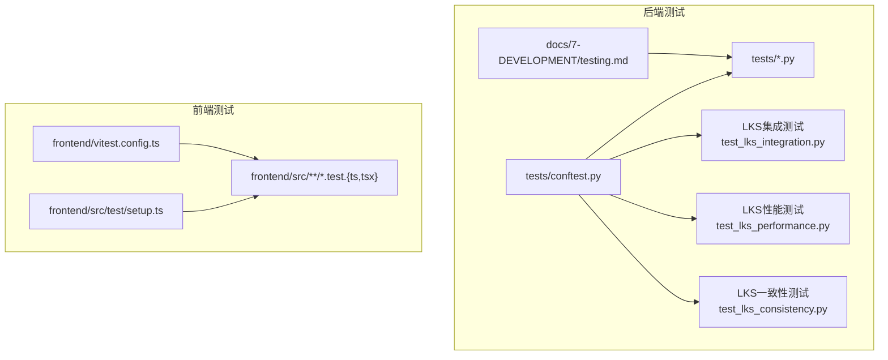

**图表来源**
- [tests/conftest.py](file://tests/conftest.py#L1-L32)
- [tests/test_lks_integration.py](file://tests/test_lks_integration.py#L1-L828)
- [tests/test_lks_performance.py](file://tests/test_lks_performance.py#L1-L575)
- [tests/test_lks_consistency.py](file://tests/test_lks_consistency.py#L1-L905)
- [docs/7-DEVELOPMENT/testing.md](file://docs/7-DEVELOPMENT/testing.md#L1-L424)
- [frontend/vitest.config.ts](file://frontend/vitest.config.ts#L1-L16)
- [frontend/src/test/setup.ts](file://frontend/src/test/setup.ts#L1-L70)

**章节来源**
- [tests/README.md](file://tests/README.md#L1-L1)
- [tests/conftest.py](file://tests/conftest.py#L1-L32)
- [docs/7-DEVELOPMENT/testing.md](file://docs/7-DEVELOPMENT/testing.md#L1-L424)
- [frontend/package.json](file://frontend/package.json#L1-L77)
- [frontend/vitest.config.ts](file://frontend/vitest.config.ts#L1-L16)
- [frontend/src/test/setup.ts](file://frontend/src/test/setup.ts#L1-L70)

## 核心组件
- 后端测试框架与运行
  - 使用pytest与pytest-asyncio，支持异步函数测试与并发场景。
  - 通过conftest.py统一加载环境变量与项目根路径，确保导入正确。
  - 支持覆盖率统计，目标为整体70%+，关键业务逻辑90%+。
- 前端测试框架与运行
  - Vitest作为测试运行器，JSDOM作为DOM环境，@testing-library/react用于断言UI行为。
  - 通过setup.ts集中Mock next/navigation、window.matchMedia、国际化与鉴权等模块。
  - 提供测试脚本：test、test:watch、test:ui。
- **新增** LKS测试组件
  - 集成测试：验证SurrealDB与PostgreSQL之间的跨域同步机制。
  - 性能测试：提供事件吞吐量、查询延迟、同步开销的性能基准。
  - 一致性测试：确保跨域数据映射、引用完整性、状态验证的准确性。

**章节来源**
- [docs/7-DEVELOPMENT/testing.md](file://docs/7-DEVELOPMENT/testing.md#L28-L424)
- [tests/conftest.py](file://tests/conftest.py#L1-L32)
- [pyproject.toml](file://pyproject.toml#L49-L70)
- [frontend/package.json](file://frontend/package.json#L5-L13)
- [frontend/vitest.config.ts](file://frontend/vitest.config.ts#L1-L16)
- [frontend/src/test/setup.ts](file://frontend/src/test/setup.ts#L1-L70)

## 架构总览
下图展示测试分层与组件交互关系：单元测试覆盖算法与工具函数；API测试覆盖FastAPI路由；前端测试覆盖UI组件与Hook；**新增** LKS测试覆盖跨域同步、性能基准和数据一致性；Mock策略贯穿各层以隔离外部依赖。

```mermaid
graph TB
subgraph "单元测试"
U1["文本切分与类型检测<br/>tests/test_chunking.py"]
U2["领域模型与业务规则<br/>tests/test_domain.py"]
U3["嵌入生成与池化<br/>tests/test_embedding.py"]
U4["通用工具与版本比较<br/>tests/test_utils.py"]
end
subgraph "API测试"
A1["模型创建与提供方可用性<br/>tests/test_models_api.py"]
end
subgraph "LKS测试"
L1["跨域同步集成<br/>tests/test_lks_integration.py"]
L2["性能基准测试<br/>tests/test_lks_performance.py"]
L3["数据一致性验证<br/>tests/test_lks_consistency.py"]
end
subgraph "前端测试"
F1["配置优先级<br/>frontend/src/lib/config.test.ts"]
F2["确认对话框<br/>frontend/src/components/common/ConfirmDialog.test.tsx"]
F3["聊天列组件<br/>frontend/src/app/(dashboard)/notebooks/components/ChatColumn.test.tsx"]
end
subgraph "Mock策略"
M1["环境变量禁用密码认证<br/>tests/conftest.py"]
M2["Next导航与媒体查询Mock<br/>frontend/src/test/setup.ts"]
M3["AI模型返回值Mock<br/>tests/test_embedding.py 等"]
M4["SurrealDB/PostgreSQL适配器Mock<br/>LKS测试套件"]
end
U1 --> M3
U2 --> M3
U3 --> M3
A1 --> M3
L1 --> M4
L2 --> M4
L3 --> M4
F1 --> M2
F2 --> M2
F3 --> M2
```

**图表来源**
- [tests/test_chunking.py](file://tests/test_chunking.py#L1-L297)
- [tests/test_domain.py](file://tests/test_domain.py#L1-L399)
- [tests/test_embedding.py](file://tests/test_embedding.py#L1-L234)
- [tests/test_models_api.py](file://tests/test_models_api.py#L1-L392)
- [tests/test_utils.py](file://tests/test_utils.py#L1-L399)
- [tests/test_lks_integration.py](file://tests/test_lks_integration.py#L1-L828)
- [tests/test_lks_performance.py](file://tests/test_lks_performance.py#L1-L575)
- [tests/test_lks_consistency.py](file://tests/test_lks_consistency.py#L1-L905)
- [tests/conftest.py](file://tests/conftest.py#L12-L15)
- [frontend/src/lib/config.test.ts](file://frontend/src/lib/config.test.ts#L1-L101)
- [frontend/src/components/common/ConfirmDialog.test.tsx](file://frontend/src/components/common/ConfirmDialog.test.tsx#L1-L53)
- [frontend/src/app/(dashboard)/notebooks/components/ChatColumn.test.tsx](file://frontend/src/app/(dashboard)/notebooks/components/ChatColumn.test.tsx#L1-L75)
- [frontend/src/test/setup.ts](file://frontend/src/test/setup.ts#L5-L69)

## 详细组件分析

### 单元测试：文本切分与内容类型检测
- 覆盖点
  - 基于扩展名的内容类型识别（HTML、Markdown、Plain）。
  - 基于启发式规则的内容类型识别（标签、标题、链接、代码块等）。
  - 组合策略：扩展名优先，高置信度启发式可覆盖。
  - 文本切分：空文本、短文本、超长文本、HTML/Markdown显式类型、二次切分与长度约束。
- 关键断言
  - 类型判定边界条件与异常输入。
  - 切分后每段长度上限与合理性。
- 最佳实践
  - 为不同输入场景设计独立用例，覆盖空/空白/极短/极长/特殊字符。
  - 显式传入内容类型或文件路径以验证组合策略。

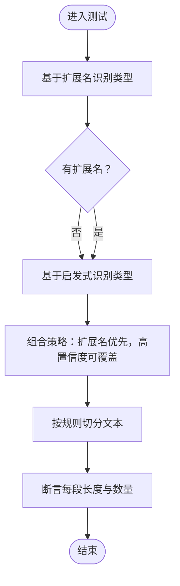

**图表来源**
- [tests/test_chunking.py](file://tests/test_chunking.py#L19-L294)

**章节来源**
- [tests/test_chunking.py](file://tests/test_chunking.py#L1-L297)

### 单元测试：领域模型与业务规则
- 覆盖点
  - RecordModel单例行为与清理。
  - ModelManager实例隔离。
  - Notebook名称校验、归档标志默认值。
  - Source命令字段解析、删除时文件清理与容错。
  - Note内容校验（空/空白）、嵌入相关内容处理。
  - Podcast域：SpeakerProfile与EpisodeProfile的Pydantic校验与范围限制。
- 关键断言
  - 错误输入触发InvalidInputError或Pydantic ValidationError。
  - 删除操作调用父类异步删除并清理文件。
  - 有效数据保存成功且字段符合预期。
- 最佳实践
  - 使用patch/AsyncMock隔离外部依赖，避免真实文件系统与数据库。
  - 对边界值与异常路径分别断言，确保健壮性。

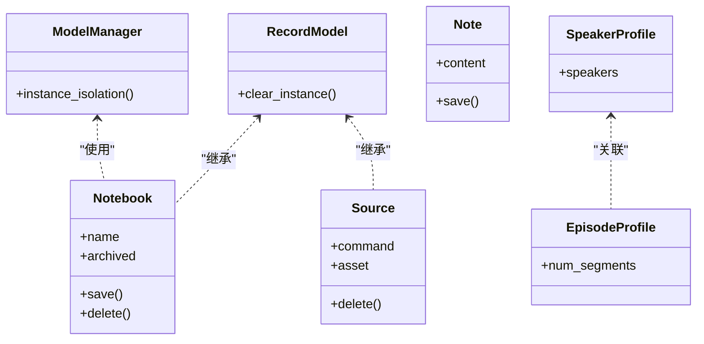

**图表来源**
- [tests/test_domain.py](file://tests/test_domain.py#L28-L395)

**章节来源**
- [tests/test_domain.py](file://tests/test_domain.py#L1-L399)

### 单元测试：嵌入生成与平均池化
- 覆盖点
  - 平均池化：单向量归一化、两向量均值、相同向量、空列表异常、高维向量、单位范数校验。
  - 批量嵌入：空列表返回空、无模型配置抛错、成功路径返回预期形状。
  - 单条嵌入：空文本异常、短文本直接嵌入、长文本切分后池化、内容类型透传。
- Mock策略
  - 通过patch替换模型管理器的get_embedding_model，返回模拟的异步嵌入模型。
- 最佳实践
  - 对长文本切分与池化的端到端流程进行集成式断言，确保向量维度与归一化正确。

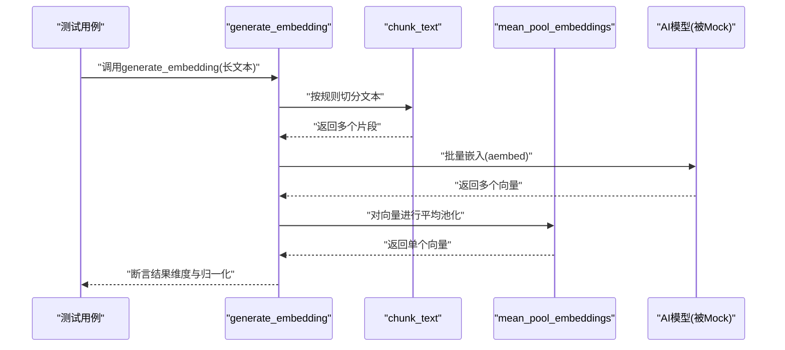

**图表来源**
- [tests/test_embedding.py](file://tests/test_embedding.py#L105-L230)

**章节来源**
- [tests/test_embedding.py](file://tests/test_embedding.py#L1-L234)

### API测试：模型创建与提供方可用性
- 覆盖点
  - 模型重复创建（同名/不同大小写）返回400与明确错误信息。
  - 同名但不同提供方/类型允许创建。
  - 环境变量驱动的提供方可用性：通用与模式特定变量组合影响支持类型集合。
- Mock策略
  - patch数据库查询与模型保存，控制重复检测与持久化行为。
  - patch环境变量读取与AI工厂提供方发现，验证不同配置下的响应。
- 最佳实践
  - 分离"重复检测"与"保存"两个阶段的Mock，确保契约清晰。
  - 针对每种环境变量组合编写独立用例，覆盖边界与异常。

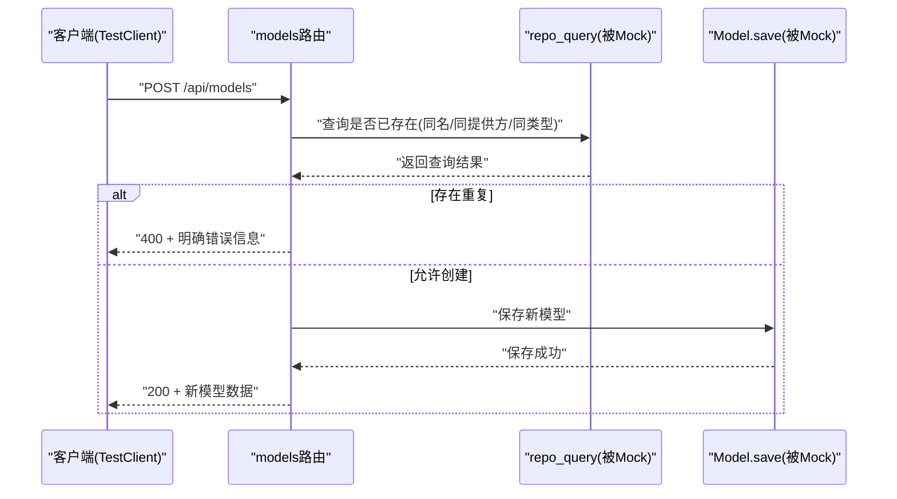

**图表来源**
- [tests/test_models_api.py](file://tests/test_models_api.py#L18-L117)

**章节来源**
- [tests/test_models_api.py](file://tests/test_models_api.py#L1-L392)

### LKS集成测试：跨域同步验证
- 覆盖点
  - Notebook <-> Agent同步：创建、更新、删除事件的完整生命周期。
  - Source <-> DataLineage同步：数据血缘注册与归档机制。
  - Cell Execution -> Note同步：单元执行结果到笔记的转换。
  - 事件发射与路由：多处理器并发处理与错误隔离。
  - 处理器注册与执行：默认处理器集合的创建与验证。
- Mock策略
  - 使用AsyncMock模拟SurrealDB与PostgreSQL适配器。
  - 通过reset_registries确保测试间隔离。
  - 验证事件历史跟踪与过滤功能。
- 最佳实践
  - 使用autouse fixture自动重置全局注册表。
  - 验证事件处理的幂等性和错误恢复能力。

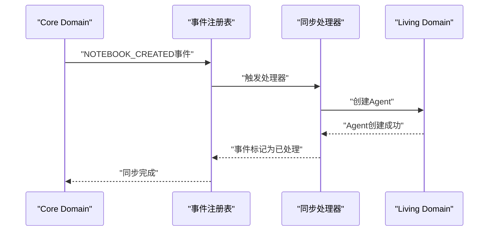

**图表来源**
- [tests/test_lks_integration.py](file://tests/test_lks_integration.py#L102-L235)
- [open_notebook/database/sync_hooks.py](file://open_notebook/database/sync_hooks.py#L92-L119)

**章节来源**
- [tests/test_lks_integration.py](file://tests/test_lks_integration.py#L1-L828)
- [open_notebook/database/sync_hooks.py](file://open_notebook/database/sync_hooks.py#L1-L294)

### LKS性能测试：基准与并发
- 覆盖点
  - 事件吞吐量：并发事件发射与处理的性能基准。
  - 查询延迟：SurrealDB与PostgreSQL查询的延迟测量。
  - 同步开销：跨域同步操作的性能指标。
  - 并发操作：多处理器并发执行的效率验证。
  - 内存效率：事件历史限制与内存使用控制。
- Mock策略
  - 使用fast_query/fast_create模拟低延迟适配器。
  - 通过AsyncMock控制模拟延迟时间。
  - 验证并发操作的性能表现。
- 最佳实践
  - 使用pytest-benchmark插件进行性能基准测试。
  - 设定合理的性能阈值（事件/秒、查询延迟、同步开销）。

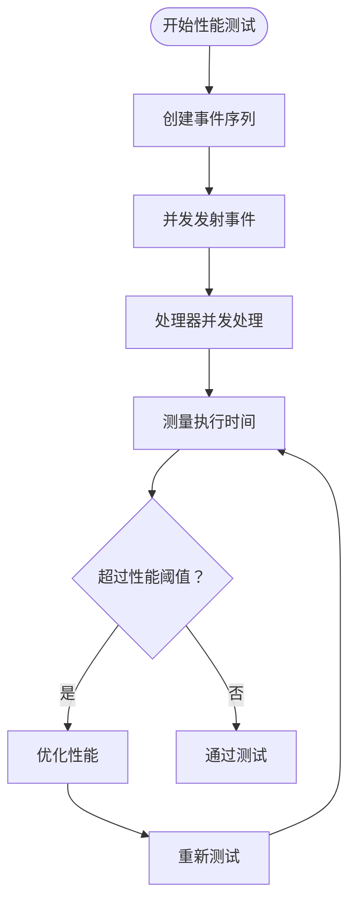

**图表来源**
- [tests/test_lks_performance.py](file://tests/test_lks_performance.py#L115-L149)

**章节来源**
- [tests/test_lks_performance.py](file://tests/test_lks_performance.py#L1-L575)

### LKS一致性测试：数据验证
- 覆盖点
  - 域路由一致性：Core与Living域的实体路由验证。
  - 实体映射一致性：ID映射规则与命名约定。
  - 跨引用完整性：交叉引用的数据一致性检查。
  - 同步状态验证：删除操作的状态转换与标记。
  - 冲突检测：缺失实体的创建与更新策略。
  - 数据漂移检测：事件历史跟踪与内存限制。
- Mock策略
  - 使用跟踪适配器记录所有操作。
  - 模拟存储数据结构以验证一致性。
  - 实现自定义验证器进行数据一致性检查。
- 最佳实践
  - 实现专门的验证器类进行数据一致性检查。
  - 使用测试夹具模拟复杂的跨域数据关系。
  - 验证删除操作的软删除而非硬删除策略。

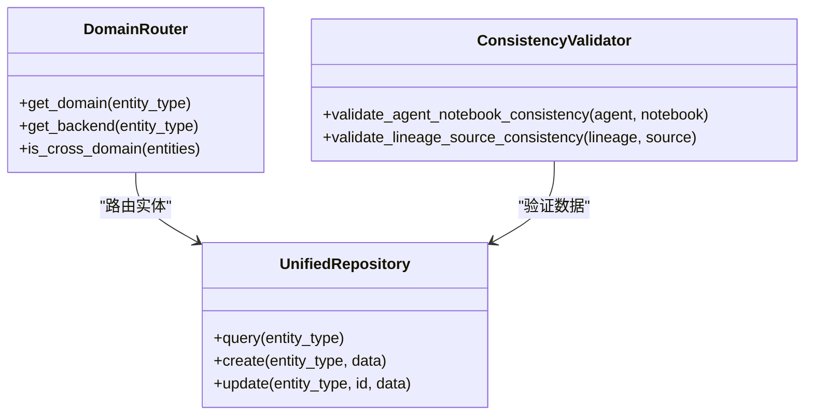

**图表来源**
- [tests/test_lks_consistency.py](file://tests/test_lks_consistency.py#L144-L194)
- [open_notebook/database/unified_repository.py](file://open_notebook/database/unified_repository.py#L194-L250)

**章节来源**
- [tests/test_lks_consistency.py](file://tests/test_lks_consistency.py#L1-L905)
- [open_notebook/database/unified_repository.py](file://open_notebook/database/unified_repository.py#L1-L548)

### 前端测试：配置优先级与组件行为
- 配置优先级测试
  - 运行时配置优先于环境变量；两者缺失时回退至相对路径。
  - 通过重置模块与fetch Mock确保每次用例独立。
- 组件行为测试
  - ConfirmDialog：标题/描述渲染、确认按钮点击回调、自定义确认文案、加载态禁用按钮。
  - ChatColumn：数据加载中显示加载指示，加载完成后渲染聊天面板；通过类型安全的Mock工厂注入钩子状态。
- Mock策略
  - setup.ts集中Mock next/navigation、window.matchMedia、国际化与鉴权模块。
  - 组件内局部Mock（如ChatPanel）避免真实依赖。

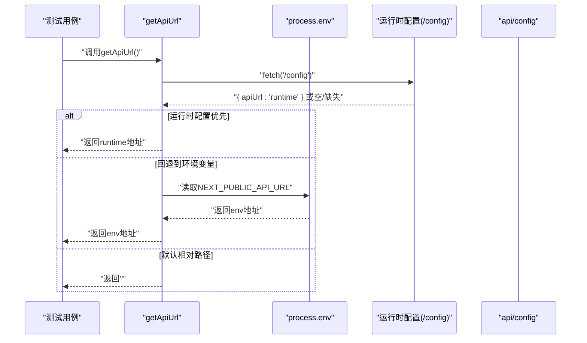

**图表来源**
- [frontend/src/lib/config.test.ts](file://frontend/src/lib/config.test.ts#L22-L99)

**章节来源**
- [frontend/src/lib/config.test.ts](file://frontend/src/lib/config.test.ts#L1-L101)
- [frontend/src/components/common/ConfirmDialog.test.tsx](file://frontend/src/components/common/ConfirmDialog.test.tsx#L1-L53)
- [frontend/src/app/(dashboard)/notebooks/components/ChatColumn.test.tsx](file://frontend/src/app/(dashboard)/notebooks/components/ChatColumn.test.tsx#L1-L75)
- [frontend/src/test/setup.ts](file://frontend/src/test/setup.ts#L1-L70)

## 依赖分析
- 后端依赖
  - pytest与pytest-asyncio用于异步测试与并发场景。
  - dotenv加载环境变量，conftest统一设置OPEN_NOTEBOOK_PASSWORD为空以禁用密码认证。
  - **新增** pytest-benchmark用于性能测试，支持基准测试输出。
- 前端依赖
  - Vitest、@testing-library/react、JSDOM用于DOM环境测试。
  - setup.ts集中Mock，减少重复配置。
- **新增** LKS测试依赖
  - 统一数据访问层：SurrealDB与PostgreSQL适配器的Mock。
  - 同步事件系统：事件注册表与处理器的测试支持。
  - 数据一致性验证：自定义验证器与跟踪适配器。
- 工具与配置
  - pyproject.toml声明开发依赖与lint配置。
  - frontend/package.json提供test、test:watch、test:ui脚本。

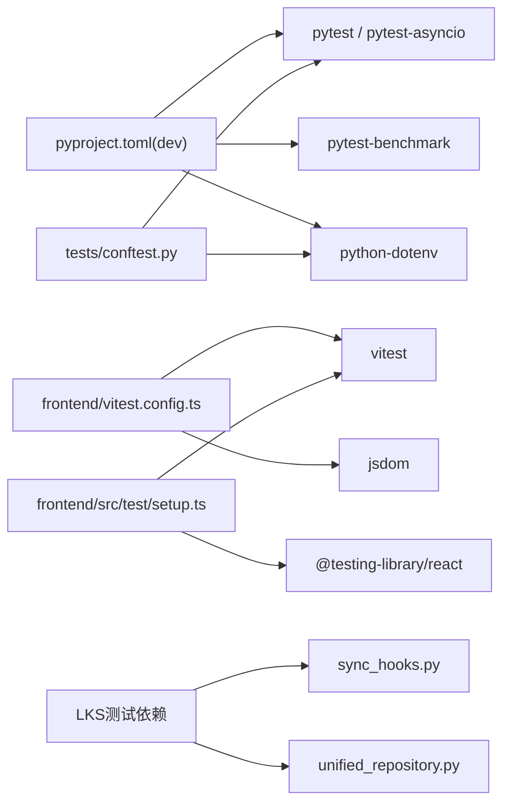

**图表来源**
- [pyproject.toml](file://pyproject.toml#L49-L70)
- [tests/conftest.py](file://tests/conftest.py#L17-L27)
- [frontend/vitest.config.ts](file://frontend/vitest.config.ts#L7-L14)
- [frontend/src/test/setup.ts](file://frontend/src/test/setup.ts#L1-L70)
- [open_notebook/database/sync_hooks.py](file://open_notebook/database/sync_hooks.py#L1-L294)
- [open_notebook/database/unified_repository.py](file://open_notebook/database/unified_repository.py#L1-L548)

**章节来源**
- [pyproject.toml](file://pyproject.toml#L49-L70)
- [frontend/package.json](file://frontend/package.json#L5-L13)
- [frontend/vitest.config.ts](file://frontend/vitest.config.ts#L1-L16)
- [frontend/src/test/setup.ts](file://frontend/src/test/setup.ts#L1-L70)

## 性能考虑
- 异步测试与并发
  - 使用pytest-asyncio与asyncio.gather测试并发创建/处理场景，关注事件循环与资源释放。
  - **新增** LKS性能测试使用pytest-benchmark插件进行基准测试。
- 嵌入生成性能
  - 长文本切分与批量嵌入应避免不必要的重复调用；通过Mock控制调用次数与参数。
- 前端渲染性能
  - 通过局部Mock与最小化DOM渲染，减少测试执行时间；对复杂组件拆分为更小单元测试。
- **新增** LKS性能优化
  - 事件并发处理：验证多处理器并发执行的性能表现。
  - 查询优化：SurrealDB与PostgreSQL查询延迟的基准测试。
  - 内存管理：事件历史限制防止内存泄漏。
- 覆盖率与回归
  - 保持70%+整体覆盖率与关键逻辑90%，避免过度追求100%而牺牲可维护性。

## 故障排查指南
- 常见错误与解决
  - "event loop is closed"：确保使用async fixture与await正确调用异步函数。
  - "object is not awaitable"：检查是否遗漏await关键字。
  - **新增** LKS相关错误：事件处理失败、适配器连接异常、数据一致性验证失败。
- Mock失效
  - 确保在import前完成Mock（如setup.ts），或在用例中使用patch装饰器/上下文。
  - **新增** LKS Mock：确保适配器Mock正确模拟异步操作和错误场景。
- 环境变量问题
  - conftest已设置OPEN_NOTEBOOK_PASSWORD为空以禁用密码认证；若仍出现鉴权相关错误，请检查其他认证中间件或路由。
- 前端测试失败
  - 确认JSDOM环境与全局Mock生效；对动态导入或浏览器API需额外Mock。
- **新增** LKS测试调试
  - 使用verbose模式查看事件处理详情。
  - 检查事件历史以诊断同步问题。
  - 验证适配器调用参数与返回值。

**章节来源**
- [docs/7-DEVELOPMENT/testing.md](file://docs/7-DEVELOPMENT/testing.md#L394-L418)
- [tests/conftest.py](file://tests/conftest.py#L12-L15)
- [frontend/src/test/setup.ts](file://frontend/src/test/setup.ts#L1-L70)

## 结论
本测试策略建立了以pytest与Vitest为核心的分层测试体系，明确了单元、API、LKS专用测试与前端测试的职责边界与最佳实践。**更新** 新增的LKS测试套件提供了完整的跨域同步验证、性能基准和数据一致性检查，涵盖了SurrealDB与PostgreSQL之间的复杂数据同步机制。通过集中Mock与环境隔离，确保测试稳定可靠；结合覆盖率目标与持续集成流程，保障代码质量与演进速度。建议后续补充端到端测试套件，进一步完善测试金字塔。

## 附录

### 测试类别与位置对照
- 单元测试
  - 文本切分与内容类型检测：tests/test_chunking.py
  - 领域模型与业务规则：tests/test_domain.py
  - 嵌入生成与池化：tests/test_embedding.py
  - 通用工具与版本比较：tests/test_utils.py
- API测试
  - 模型创建与提供方可用性：tests/test_models_api.py
- **新增** LKS测试
  - 跨域同步集成：tests/test_lks_integration.py (828行)
  - 性能基准测试：tests/test_lks_performance.py (575行)
  - 数据一致性验证：tests/test_lks_consistency.py (905行)
- 前端测试
  - 配置优先级：frontend/src/lib/config.test.ts
  - 组件行为：frontend/src/components/common/ConfirmDialog.test.tsx
  - 页面组件：frontend/src/app/(dashboard)/notebooks/components/ChatColumn.test.tsx

**章节来源**
- [tests/test_chunking.py](file://tests/test_chunking.py#L1-L297)
- [tests/test_domain.py](file://tests/test_domain.py#L1-L399)
- [tests/test_embedding.py](file://tests/test_embedding.py#L1-L234)
- [tests/test_models_api.py](file://tests/test_models_api.py#L1-L392)
- [tests/test_lks_integration.py](file://tests/test_lks_integration.py#L1-L828)
- [tests/test_lks_performance.py](file://tests/test_lks_performance.py#L1-L575)
- [tests/test_lks_consistency.py](file://tests/test_lks_consistency.py#L1-L905)
- [tests/test_utils.py](file://tests/test_utils.py#L1-L399)
- [frontend/src/lib/config.test.ts](file://frontend/src/lib/config.test.ts#L1-L101)
- [frontend/src/components/common/ConfirmDialog.test.tsx](file://frontend/src/components/common/ConfirmDialog.test.tsx#L1-L53)
- [frontend/src/app/(dashboard)/notebooks/components/ChatColumn.test.tsx](file://frontend/src/app/(dashboard)/notebooks/components/ChatColumn.test.tsx#L1-L75)