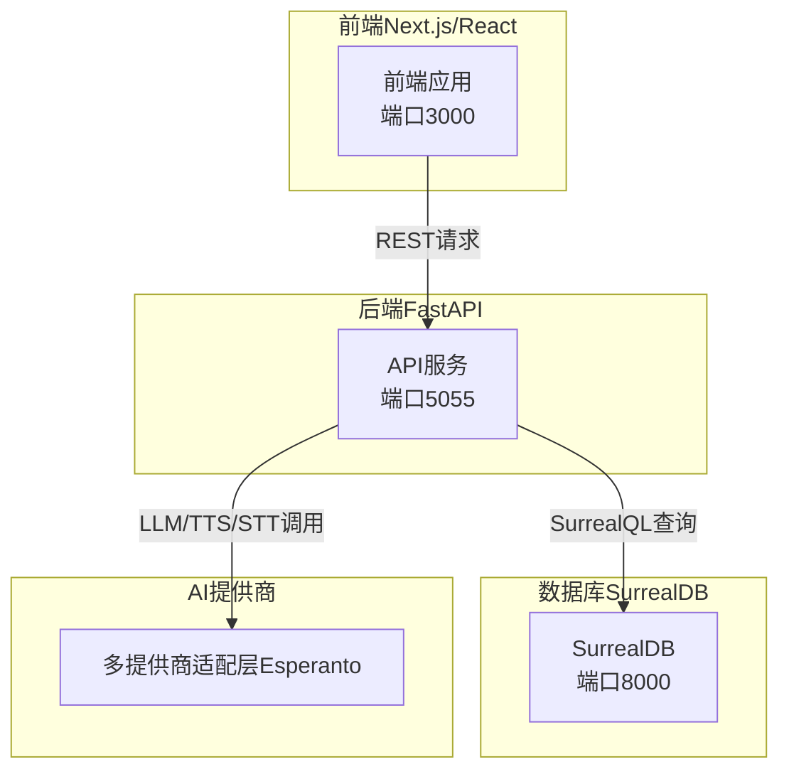
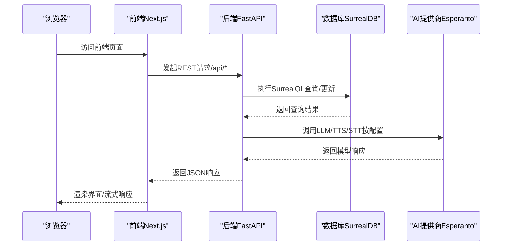
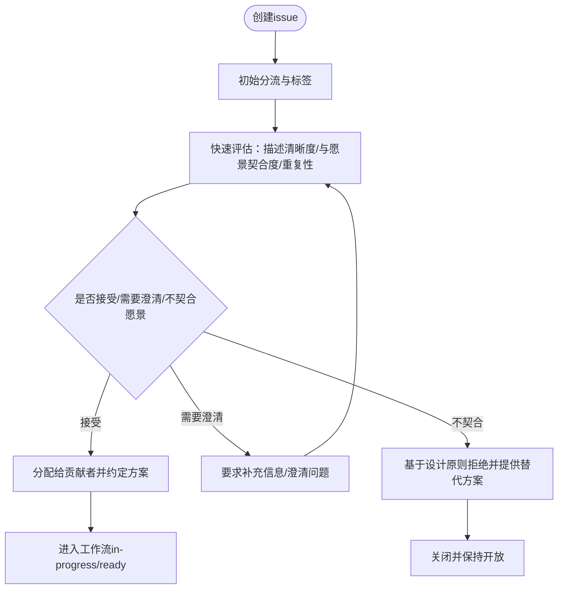
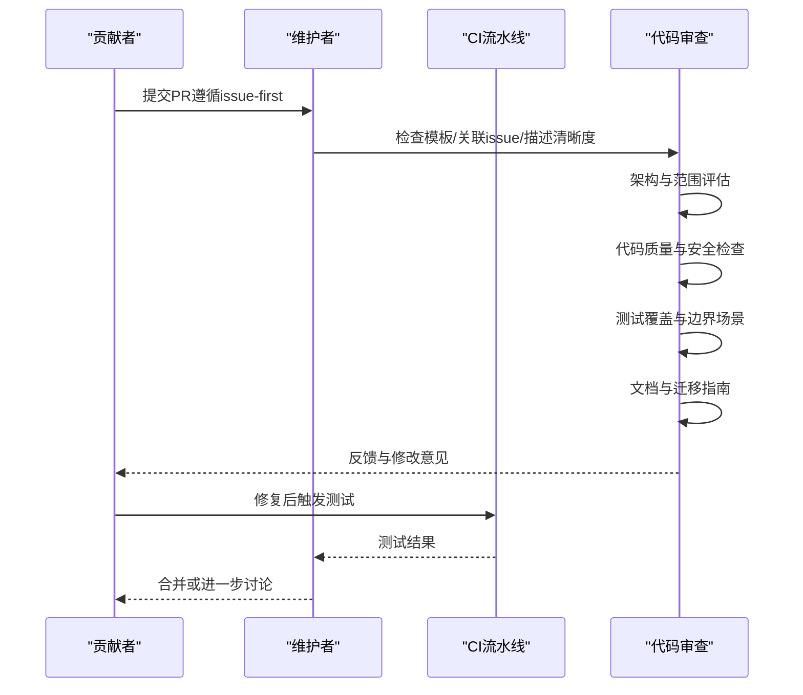
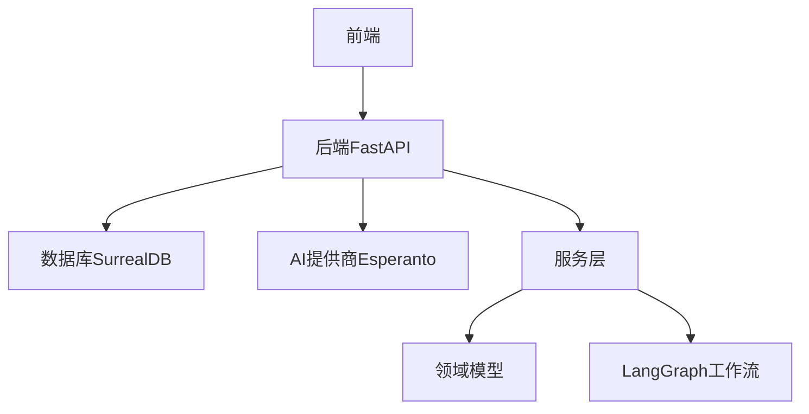

# 维护者指南

<cite>
**本文档引用的文件**
- [MAINTAINER_GUIDE.md](file://MAINTAINER_GUIDE.md)
- [CONTRIBUTING.md](file://CONTRIBUTING.md)
- [CHANGELOG.md](file://CHANGELOG.md)
- [.github/pull_request_template.md](file://.github/pull_request_template.md)
- [docs/7-DEVELOPMENT/maintainer-guide.md](file://docs/7-DEVELOPMENT/maintainer-guide.md)
- [docs/7-DEVELOPMENT/contributing.md](file://docs/7-DEVELOPMENT/contributing.md)
- [docs/7-DEVELOPMENT/architecture.md](file://docs/7-DEVELOPMENT/architecture.md)
- [docs/7-DEVELOPMENT/design-principles.md](file://docs/7-DEVELOPMENT/design-principles.md)
- [docs/7-DEVELOPMENT/code-standards.md](file://docs/7-DEVELOPMENT/code-standards.md)
- [docs/7-DEVELOPMENT/testing.md](file://docs/7-DEVELOPMENT/testing.md)
- [docs/7-DEVELOPMENT/development-setup.md](file://docs/7-DEVELOPMENT/development-setup.md)
</cite>

## 目录
1. [简介](#简介)
2. [项目结构](#项目结构)
3. [核心组件](#核心组件)
4. [架构总览](#架构总览)
5. [详细组件分析](#详细组件分析)
6. [依赖关系分析](#依赖关系分析)
7. [性能考量](#性能考量)
8. [故障排除指南](#故障排除指南)
9. [结论](#结论)
10. [附录](#附录)

## 简介
本指南面向Open Notebook项目维护者，系统化阐述issue分类与优先级评估、标签管理策略；Pull Request审查流程与代码质量把控；社区沟通规范；版本发布与变更日志维护；向后兼容性决策；团队协作工具与决策流程；冲突解决机制；项目治理结构、角色权限与责任分工；以及项目健康度指标、贡献者激励与长期发展规划等。

## 项目结构
Open Notebook采用三层架构（前端/后端/数据库）与异步优先的设计理念，配合LangGraph工作流与多AI提供商适配层，形成可扩展、隐私优先的研究助手平台。维护者需理解整体架构与设计原则，以确保贡献与变更符合项目愿景。

**图表来源**
- [docs/7-DEVELOPMENT/architecture.md](file://docs/7-DEVELOPMENT/architecture.md#L1-L800)

**章节来源**
- [docs/7-DEVELOPMENT/architecture.md](file://docs/7-DEVELOPMENT/architecture.md#L1-L800)

## 核心组件
- issue管理：遵循“先issue后开发”的流程，明确初始分流、标签体系、优先级与状态标签，确保贡献与项目愿景一致。
- PR审查：建立高阶对齐、代码质量、测试与文档四阶段审查清单，配套正向反馈与替代方案建议模板。
- 沟通规范：提供常见场景模板（接受、澄清、拒绝、停滞处理），强调尊重、清晰、一致性与响应性。
- 版本与发布：采用语义化版本与变更日志，记录新增、修复、安全、文档与国际化等维度，确保发布透明可追溯。
- 治理与协作：通过贡献指南、设计原则、代码标准与测试指南形成闭环，保障质量与一致性。

**章节来源**
- [docs/7-DEVELOPMENT/maintainer-guide.md](file://docs/7-DEVELOPMENT/maintainer-guide.md#L1-L409)
- [docs/7-DEVELOPMENT/contributing.md](file://docs/7-DEVELOPMENT/contributing.md#L1-L202)
- [docs/7-DEVELOPMENT/design-principles.md](file://docs/7-DEVELOPMENT/design-principles.md#L1-L352)
- [docs/7-DEVELOPMENT/code-standards.md](file://docs/7-DEVELOPMENT/code-standards.md#L1-L376)
- [docs/7-DEVELOPMENT/testing.md](file://docs/7-DEVELOPMENT/testing.md#L1-L424)
- [CHANGELOG.md](file://CHANGELOG.md#L1-L197)

## 架构总览
下图展示从浏览器到API再到数据库与AI提供商的整体交互路径，帮助维护者在审查PR时把握数据流与职责边界。

**图表来源**
- [docs/7-DEVELOPMENT/architecture.md](file://docs/7-DEVELOPMENT/architecture.md#L140-L147)

**章节来源**
- [docs/7-DEVELOPMENT/architecture.md](file://docs/7-DEVELOPMENT/architecture.md#L1-L800)

## 详细组件分析

### Issue分类与优先级评估
- 初始分流（24-48小时内）：添加类型标签（bug/enhancement/documentation/question/refactor）、难度标签（good first issue/help wanted/advanced）、状态标签（needs-triage/needs-info/needs-discussion/ready/in-progress/blocked）。
- 优先级划分：critical（安全/数据丢失）、high（核心功能中断）、medium（影响较大的问题或有用特性）、low（边缘情况或锦上添花）。
- 决策框架：围绕设计原则进行对齐，评估是否属于核心项目范围、长期支持能力、用户覆盖面与简化优先。

**图表来源**
- [docs/7-DEVELOPMENT/maintainer-guide.md](file://docs/7-DEVELOPMENT/maintainer-guide.md#L14-L84)

**章节来源**
- [docs/7-DEVELOPMENT/maintainer-guide.md](file://docs/7-DEVELOPMENT/maintainer-guide.md#L12-L112)

### 标签管理策略
- 优先级：priority: critical/high/medium/low
- 状态：needs-triage/needs-info/needs-discussion/ready/in-progress/blocked
- 类型：bug/enhancement/documentation/question/refactor
- 难度：good first issue/help wanted/advanced
- 建议实践：统一命名、定期回顾与清理陈旧标签，确保标签与流程一致。

**章节来源**
- [docs/7-DEVELOPMENT/maintainer-guide.md](file://docs/7-DEVELOPMENT/maintainer-guide.md#L85-L112)

### Pull Request审查流程
- 审查清单：是否关联已批准issue、是否引用issue号、PR描述是否清晰、模板检查项是否完成、测试与截图是否充分。
- 红灯项：无关联issue、未分配、试图解决多个无关问题、破坏性变更未经讨论、与愿景冲突。
- 四阶段审查：高阶对齐（架构/范围/替代方案）、代码质量（PEP 8/类型提示/文档/错误处理/安全）、测试覆盖（有意义的测试/本地与CI通过/边界场景）、文档更新（注释/复杂逻辑说明/迁移指南）。
- 反馈模板：正向肯定、具体改进建议、替代方案探讨。

**图表来源**
- [docs/7-DEVELOPMENT/maintainer-guide.md](file://docs/7-DEVELOPMENT/maintainer-guide.md#L113-L199)
- [.github/pull_request_template.md](file://.github/pull_request_template.md#L1-L108)

**章节来源**
- [docs/7-DEVELOPMENT/maintainer-guide.md](file://docs/7-DEVELOPMENT/maintainer-guide.md#L113-L199)
- [.github/pull_request_template.md](file://.github/pull_request_template.md#L1-L108)

### 社区沟通规范
- 常见场景模板：接受、需要澄清、不契合愿景、贡献者失联后的处理、破坏性变更的前置讨论。
- 最佳实践：友善尊重、清晰直接、持续一致、保护项目愿景、及时响应。
- 当有疑问时：回归设计原则、长期可维护性、用户受益面、简化优先、两年后的视角。

**章节来源**
- [docs/7-DEVELOPMENT/maintainer-guide.md](file://docs/7-DEVELOPMENT/maintainer-guide.md#L200-L409)

### 版本发布与变更日志维护
- 采用语义化版本与“未发布”区块，按类别记录变更：新增、修复、安全、文档、国际化等。
- 发布节奏：依据变更性质与稳定性评估，结合CI与测试结果推进。
- 变更日志要点：清晰描述影响面、迁移指引（如适用）、相关issue链接。

**章节来源**
- [CHANGELOG.md](file://CHANGELOG.md#L1-L197)

### 向后兼容性决策
- 原则：避免破坏性变更，必要时提供迁移脚本与弃用期。
- 数据库：所有schema变更必须配套迁移脚本。
- API：变更契约需版本化或通过兼容策略处理。
- 文档：明确标注破坏性变更与迁移路径。

**章节来源**
- [docs/7-DEVELOPMENT/design-principles.md](file://docs/7-DEVELOPMENT/design-principles.md#L236-L252)

### 团队协作工具与决策流程
- 工具：GitHub Issues/PR、Discord、GitHub Discussions、CI流水线。
- 决策流程：issue-first → 维护者评估与分配 → 贡献者实现 → 审查与测试 → 合并与发布。
- 冲突解决：若贡献者长时间失联，按模板关闭PR并重新开放issue供他人认领。

**章节来源**
- [docs/7-DEVELOPMENT/contributing.md](file://docs/7-DEVELOPMENT/contributing.md#L1-L202)
- [docs/7-DEVELOPMENT/maintainer-guide.md](file://docs/7-DEVELOPMENT/maintainer-guide.md#L260-L284)

### 项目治理结构、角色权限与责任分工
- 角色：维护者（负责issue triage、PR审查、发布把关）、贡献者（遵循流程与标准）、社区成员（反馈与讨论）。
- 权限：维护者拥有标签、里程碑、合并权限；贡献者通过PR参与。
- 责任：维护者确保一致性与愿景，贡献者保证质量与文档。

**章节来源**
- [docs/7-DEVELOPMENT/maintainer-guide.md](file://docs/7-DEVELOPMENT/maintainer-guide.md#L1-L409)

### 项目健康度指标、贡献者激励与长期规划
- 健康度指标：issue响应时间、PR审查周期、测试覆盖率、变更日志完整性、文档更新频率。
- 激励：在发布中致谢贡献者、社区认可、统计与荣誉。
- 长期规划：基于设计原则演进，渐进式调整核心原则，公开讨论与文档化。

**章节来源**
- [docs/7-DEVELOPMENT/contributing.md](file://docs/7-DEVELOPMENT/contributing.md#L188-L196)
- [docs/7-DEVELOPMENT/design-principles.md](file://docs/7-DEVELOPMENT/design-principles.md#L327-L335)

## 依赖关系分析
维护者在审查PR时应关注以下依赖链与耦合点：
- 前端与后端：REST接口契约与流式响应协议。
- 后端与数据库：SurrealQL查询与事务一致性。
- 后端与AI提供商：Esperanto抽象层的统一接口与回退逻辑。
- 业务逻辑与领域模型：服务层编排与LangGraph工作流。

**图表来源**
- [docs/7-DEVELOPMENT/architecture.md](file://docs/7-DEVELOPMENT/architecture.md#L100-L123)

**章节来源**
- [docs/7-DEVELOPMENT/architecture.md](file://docs/7-DEVELOPMENT/architecture.md#L1-L800)

## 性能考量
- 异步优先：全栈异步I/O提升并发与响应性。
- 后台任务：长耗时操作通过命令队列异步执行，避免阻塞请求。
- 缓存与索引：数据库索引优化与查询缓存减少延迟。
- 供应商选择：根据上下文大小与任务类型选择合适模型，必要时启用回退与成本估算。

**章节来源**
- [docs/7-DEVELOPMENT/architecture.md](file://docs/7-DEVELOPMENT/architecture.md#L537-L560)
- [docs/7-DEVELOPMENT/architecture.md](file://docs/7-DEVELOPMENT/architecture.md#L441-L508)

## 故障排除指南
- 常见问题：连接失败、端口占用、模块导入错误、数据库迁移失败。
- 处理步骤：核对服务状态、环境变量、端口占用、依赖安装与迁移日志。
- 开发辅助：预提交钩子、代码质量命令（Ruff、MyPy、pytest）、覆盖率报告。

**章节来源**
- [docs/7-DEVELOPMENT/development-setup.md](file://docs/7-DEVELOPMENT/development-setup.md#L302-L417)
- [docs/7-DEVELOPMENT/code-standards.md](file://docs/7-DEVELOPMENT/code-standards.md#L303-L376)
- [docs/7-DEVELOPMENT/testing.md](file://docs/7-DEVELOPMENT/testing.md#L155-L204)

## 结论
维护者应以设计原则为纲、以贡献流程为准、以质量标准为尺，平衡开放协作与愿景守护。通过完善的标签体系、严格的PR审查与透明的发布流程，持续提升项目健康度与社区活力。

## 附录
- 快速参考
  - issue-first工作流：创建issue → 提案 → 分配 → 实施
  - PR模板：类型、测试验证、设计对齐、质量与文档检查、数据库变更、破坏性变更说明
  - 设计原则：隐私优先、简洁优于功能、API优先、多提供商灵活性、通过标准扩展、异步优先
  - 测试指南：单元/集成/API/数据库测试分类与运行方式
  - 开发设置：环境变量、SurrealDB启动、API与前端验证、常用命令与故障排查

**章节来源**
- [docs/7-DEVELOPMENT/contributing.md](file://docs/7-DEVELOPMENT/contributing.md#L5-L202)
- [.github/pull_request_template.md](file://.github/pull_request_template.md#L1-L108)
- [docs/7-DEVELOPMENT/design-principles.md](file://docs/7-DEVELOPMENT/design-principles.md#L1-L352)
- [docs/7-DEVELOPMENT/testing.md](file://docs/7-DEVELOPMENT/testing.md#L1-L424)
- [docs/7-DEVELOPMENT/development-setup.md](file://docs/7-DEVELOPMENT/development-setup.md#L1-L417)