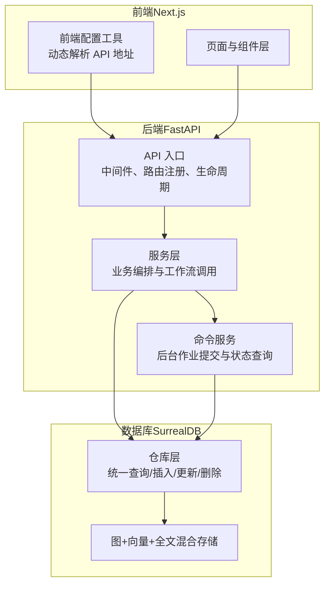
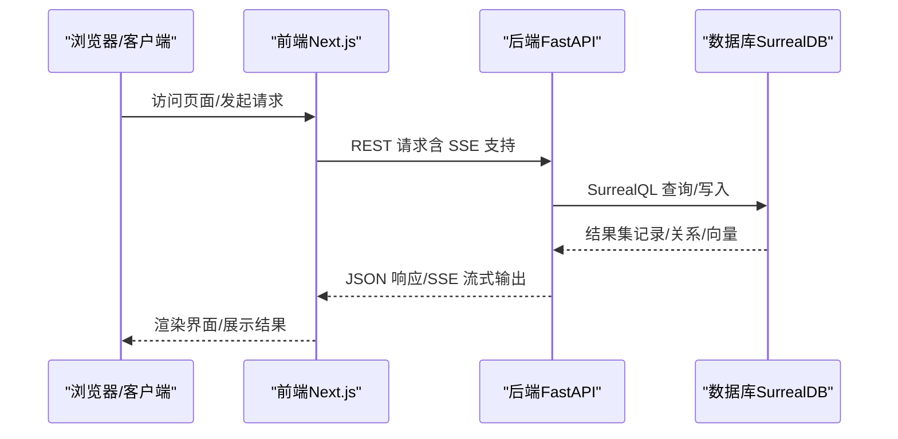
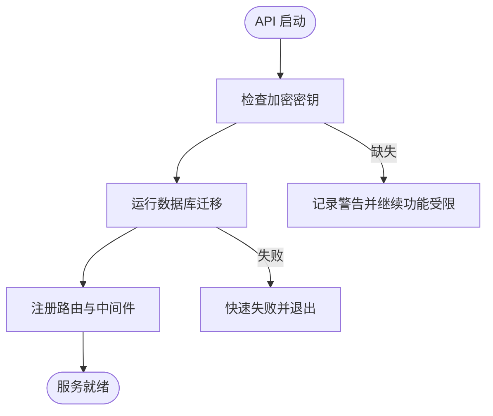
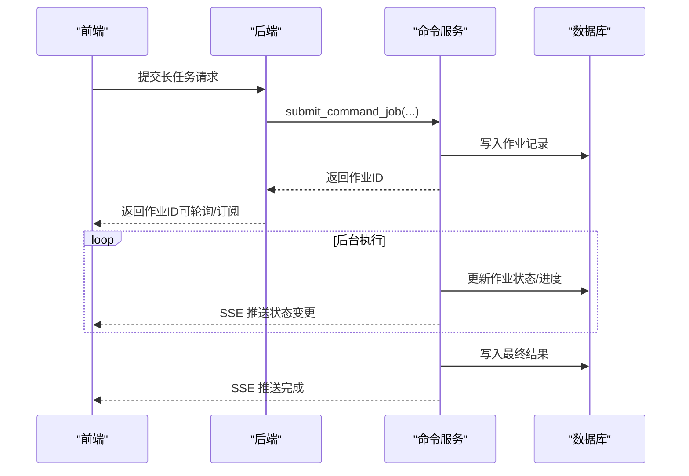
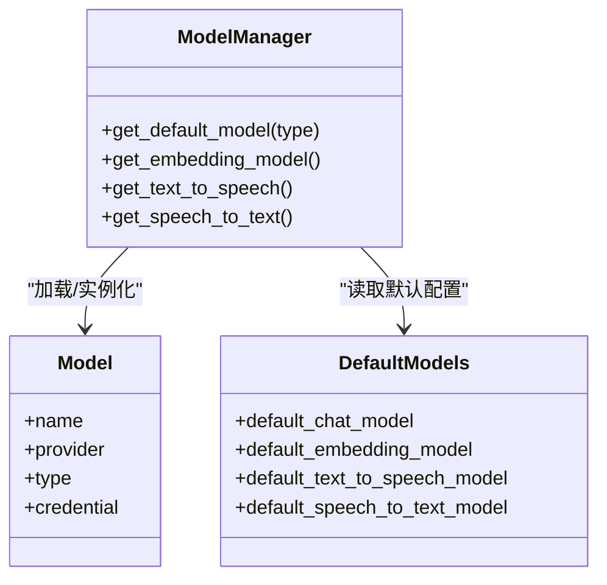
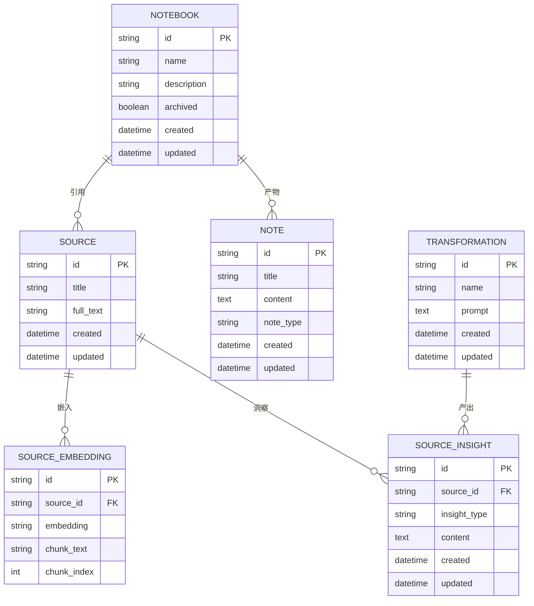
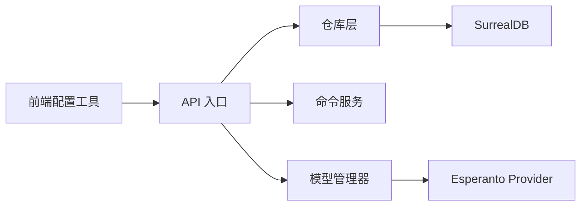

# 设计原则

<cite>
**本文引用的文件**
- [设计原则与项目愿景](file://docs/7-DEVELOPMENT/design-principles.md)
- [架构总览](file://docs/7-DEVELOPMENT/architecture.md)
- [代码标准](file://docs/7-DEVELOPMENT/code-standards.md)
- [测试指南](file://docs/7-DEVELOPMENT/testing.md)
- [API 入口（FastAPI）](file://api/main.py)
- [前端配置工具](file://frontend/src/lib/config.ts)
- [领域模型基类](file://open_notebook/domain/base.py)
- [数据库仓库层](file://open_notebook/database/repository.py)
- [命令服务（后台作业）](file://api/command_service.py)
- [AI 模型管理器](file://open_notebook/ai/models.py)
- [应用配置常量](file://open_notebook/config.py)
- [通用异常定义](file://open_notebook/exceptions.py)
</cite>

## 目录
1. [引言](#引言)
2. [项目结构](#项目结构)
3. [核心组件](#核心组件)
4. [架构总览](#架构总览)
5. [详细组件分析](#详细组件分析)
6. [依赖关系分析](#依赖关系分析)
7. [性能考虑](#性能考虑)
8. [故障排查指南](#故障排查指南)
9. [结论](#结论)
10. [附录](#附录)

## 引言
本文件系统性阐述 Open Notebook 的核心设计原则与指导思想，围绕“以用户为中心”的设计理念、“隐私优先”的安全原则、“模块化与可扩展”的架构原则展开；同时解释异步处理、事件驱动、数据一致性等关键技术原则的应用场景，并给出设计决策的权衡考量、技术债管理、性能与可用性平衡的实践案例。文档还覆盖代码可读性、可维护性、可测试性的设计考量，以及与第三方服务集成的设计原则、API 设计规范与错误处理策略的指导方针。

## 项目结构
Open Notebook 采用三层架构：前端（Next.js）、后端（FastAPI）、数据库（SurrealDB），通过 LangGraph 实现智能工作流编排，通过 Esperanto 统一接入多 Provider 的 AI 能力。整体强调“API 首位”“异步优先”“隐私优先”，并通过严格的分层与契约约束确保可扩展性与可维护性。

图表来源
- [架构总览](file://docs/7-DEVELOPMENT/architecture.md#L40-L203)
- [API 入口（FastAPI）](file://api/main.py#L99-L190)
- [数据库仓库层](file://open_notebook/database/repository.py#L65-L195)

章节来源
- [架构总览](file://docs/7-DEVELOPMENT/architecture.md#L40-L203)
- [设计原则与项目愿景](file://docs/7-DEVELOPMENT/design-principles.md#L28-L125)

## 核心组件
- 以用户为中心：界面简洁、默认可用、渐进披露、响应迅速；API 与 UI 同构，避免“仅 UI 功能”。
- 隐私优先：自托管部署为主、无遥测、最小外部依赖、清晰的数据去向说明。
- 架构原则：分层清晰、类型安全、验证前置、数据库为单一事实源、迁移脚本化。
- 技术原则：异步优先、事件驱动（SSE/后台作业）、数据一致性保障、可测试性优先。

章节来源
- [设计原则与项目愿景](file://docs/7-DEVELOPMENT/design-principles.md#L28-L182)
- [架构总览](file://docs/7-DEVELOPMENT/architecture.md#L44-L50)

## 架构总览
- 三层架构：前端（Next.js）、后端（FastAPI）、数据库（SurrealDB）
- 多 Provider 灵活：Esperanto 提供统一接口，支持 8+ LLM、嵌入、TTS/STT
- 图+向量+全文：SurrealDB 原生支持语义检索与关系建模
- 工作流编排：LangGraph 状态机实现复杂多步骤流程（内容处理、对话、问答、转换、提示词执行）

图表来源
- [架构总览](file://docs/7-DEVELOPMENT/architecture.md#L140-L147)
- [前端配置工具](file://frontend/src/lib/config.ts#L59-L140)
- [API 入口（FastAPI）](file://api/main.py#L157-L180)

章节来源
- [架构总览](file://docs/7-DEVELOPMENT/architecture.md#L40-L203)

## 详细组件分析

### 1) 以用户为中心的设计
- 界面聚焦内容、减少干扰；三栏布局（资料、笔记、聊天）降低认知负担
- 渐进披露：默认提供好用的模型与设置，高级选项隐藏在设置中
- 快速响应：前端使用缓存与状态同步，长任务通过流式返回或后台作业反馈进度
- 可访问性：明确的加载状态、错误提示与降级策略

章节来源
- [设计原则与项目愿景](file://docs/7-DEVELOPMENT/design-principles.md#L126-L148)
- [架构总览](file://docs/7-DEVELOPMENT/architecture.md#L66-L78)

### 2) 隐私优先的安全原则
- 自托管优先：默认部署方式为本地/私有环境，不强制云端依赖
- 无遥测：除非显式开启，否则不收集任何使用数据
- 数据控制：用户决定数据存放位置与访问范围
- 安全启动：API 启动时检查加密密钥与数据库迁移状态，失败即刻阻断

图表来源
- [API 入口（FastAPI）](file://api/main.py#L47-L96)

章节来源
- [设计原则与项目愿景](file://docs/7-DEVELOPMENT/design-principles.md#L30-L45)
- [API 入口（FastAPI）](file://api/main.py#L47-L96)

### 3) 模块化与可扩展性
- 分层解耦：前端不感知数据库结构；API 不包含业务逻辑；领域模型不感知 HTTP；数据库层不感知 AI 提供商
- 插件化命令：后台作业系统支持插件式扩展（如播客生成）
- 统一接口：Esperanto 抽象多 Provider 的差异，便于新增与切换
- 迁移脚本：Schema 变更通过迁移脚本管理，保证演进可控

章节来源
- [设计原则与项目愿景](file://docs/7-DEVELOPMENT/design-principles.md#L94-L109)
- [架构总览](file://docs/7-DEVELOPMENT/architecture.md#L510-L510)

### 4) 异步处理、事件驱动与数据一致性
- 异步优先：数据库、LLM、文件操作均采用异步模式，提升并发与响应
- 事件驱动：长任务通过后台作业与 SSE 推送状态，前端实时更新
- 数据一致性：SurrealDB 事务支持；LangGraph 状态持久化；RecordID 规范化避免歧义
- 流式输出：问答与对话支持流式返回，改善用户体验

图表来源
- [命令服务（后台作业）](file://api/command_service.py#L11-L65)
- [架构总览](file://docs/7-DEVELOPMENT/architecture.md#L599-L614)

章节来源
- [设计原则与项目愿景](file://docs/7-DEVELOPMENT/design-principles.md#L110-L125)
- [架构总览](file://docs/7-DEVELOPMENT/architecture.md#L537-L560)

### 5) 第三方服务集成与 API 设计
- Provider 抽象：统一接口屏蔽差异，支持多 Provider 切换与回退
- 模型选择：按任务类型与上下文大小自动/手动选择最优模型
- API 设计：REST 风格、OpenAPI 自动生成、参数校验与错误码规范化
- 错误处理：结构化异常类型、HTTP 状态映射、CORS 在错误路径仍生效

图表来源
- [AI 模型管理器](file://open_notebook/ai/models.py#L97-L266)

章节来源
- [设计原则与项目愿景](file://docs/7-DEVELOPMENT/design-principles.md#L78-L93)
- [架构总览](file://docs/7-DEVELOPMENT/architecture.md#L441-L507)
- [AI 模型管理器](file://open_notebook/ai/models.py#L97-L266)

### 6) 数据一致性与持久化
- 单一事实源：数据库为所有状态的权威来源
- 关系建模：通过记录链接表达实体间关系，支持图遍历与统计
- 事务与超时：连接池、事务支持、查询超时保护
- 记录 ID 规范：统一 RecordID 解析与序列化，避免字符串拼接错误

图表来源
- [架构总览](file://docs/7-DEVELOPMENT/architecture.md#L161-L196)

章节来源
- [架构总览](file://docs/7-DEVELOPMENT/architecture.md#L151-L203)
- [数据库仓库层](file://open_notebook/database/repository.py#L40-L45)

### 7) 代码可读性、可维护性与可测试性
- 类型安全与验证：Pydantic 模型用于 API 边界，TypeScript 严格类型用于前端
- 文档化：Google 风格 docstring、模块/类/函数注释齐全
- 测试策略：单元/集成/API/数据库测试分类，关注业务逻辑与关键工作流
- 工具链：Ruff 格式化、MyPy 静态检查、Pytest 异步测试

章节来源
- [设计原则与项目愿景](file://docs/7-DEVELOPMENT/design-principles.md#L159-L174)
- [代码标准](file://docs/7-DEVELOPMENT/code-standards.md#L16-L94)
- [测试指南](file://docs/7-DEVELOPMENT/testing.md#L5-L25)

### 8) 错误处理策略与反模式规避
- 结构化异常：统一的异常体系，区分输入、数据库、认证、外部服务、网络、配额等
- 错误映射：HTTP 状态码与异常类型一致，CORS 在错误响应中保留
- 反模式规避：功能蔓延、过早优化、过度工程化、破坏性变更无迁移路径

章节来源
- [通用异常定义](file://open_notebook/exceptions.py#L1-L71)
- [设计原则与项目愿景](file://docs/7-DEVELOPMENT/design-principles.md#L183-L252)

## 依赖关系分析
- 前端到后端：REST 请求 + 可选 SSE；通过前端配置工具动态解析 API 地址
- 后端到数据库：统一仓库层封装 SurrealQL；RecordID 规范化
- 后端到 AI：ModelManager 通过 Esperanto 获取模型实例；支持凭据注入与回退
- 后端到作业：CommandService 提交/查询后台作业；SSE 推送进度

图表来源
- [前端配置工具](file://frontend/src/lib/config.ts#L59-L140)
- [API 入口（FastAPI）](file://api/main.py#L157-L180)
- [数据库仓库层](file://open_notebook/database/repository.py#L65-L195)
- [命令服务（后台作业）](file://api/command_service.py#L11-L65)
- [AI 模型管理器](file://open_notebook/ai/models.py#L97-L266)

章节来源
- [架构总览](file://docs/7-DEVELOPMENT/architecture.md#L617-L682)

## 性能考虑
- 异步 I/O：数据库、LLM、文件操作全部异步，提升并发与资源利用率
- 缓存与懒加载：前端缓存与状态同步、LangGraph 检查点持久化
- 事件驱动：后台作业与 SSE 减少阻塞等待
- 成本与延迟权衡：ModelManager 支持回退与成本估算，避免昂贵调用
- 部署与网络：前端配置工具支持相对路径重写，避免跨域与端口复杂性

章节来源
- [设计原则与项目愿景](file://docs/7-DEVELOPMENT/design-principles.md#L110-L125)
- [架构总览](file://docs/7-DEVELOPMENT/architecture.md#L537-L560)
- [前端配置工具](file://frontend/src/lib/config.ts#L59-L140)

## 故障排查指南
- 启动阶段
  - 加密密钥未配置：API 启动时记录警告，部分加密功能不可用
  - 数据库迁移失败：立即失败并退出，避免 schema 不一致
- 网络与 CORS
  - 错误响应中保留 CORS 头，解决上传 413 前被反向代理拦截的问题
- 数据一致性
  - 使用 RecordID 规范化避免 ID 错误；事务失败时查看日志定位冲突
- AI Provider
  - 回退逻辑：主 Provider 不可用时自动尝试备选；可通过 per-request 覆盖
- 后台作业
  - 提交成功后轮询状态；SSE 推送进度；必要时清理缓存或重启进程

章节来源
- [API 入口（FastAPI）](file://api/main.py#L58-L96)
- [通用异常定义](file://open_notebook/exceptions.py#L1-L71)
- [架构总览](file://docs/7-DEVELOPMENT/architecture.md#L773-L800)

## 结论
Open Notebook 的设计以“用户”“隐私”“模块化”为核心，结合“异步优先”“事件驱动”“数据一致性”等技术原则，构建了可扩展、可维护、可测试且对第三方服务友好的系统。通过严格的分层、契约与工具链，项目在保持简洁的同时，提供了强大的研究助理能力与灵活的扩展空间。

## 附录
- 设计决策框架：是否符合愿景、是否遵循原则、实现是否稳健、成本如何、是否有替代方案
- 进化原则：变更需充分论证、公开讨论、文档化、渐进式落地

章节来源
- [设计原则与项目愿景](file://docs/7-DEVELOPMENT/design-principles.md#L253-L335)